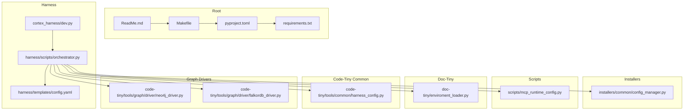
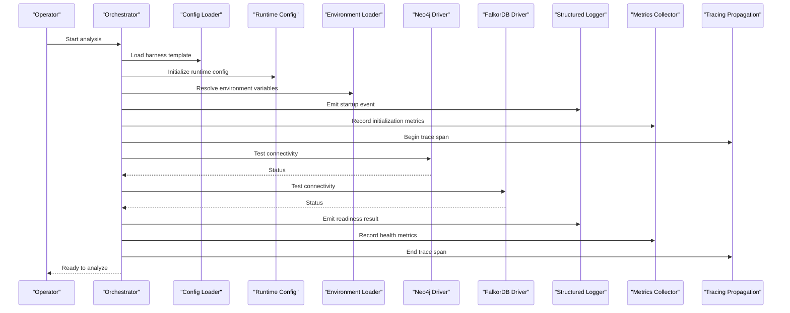

# Monitoring & Logging

<cite>
**Referenced Files in This Document**
- [ReadMe.md](file://ReadMe.md)
- [Makefile](file://Makefile)
- [pyproject.toml](file://pyproject.toml)
- [requirements.txt](file://requirements.txt)
- [cortex_harness/dev.py](file://cortex_harness/dev.py)
- [harness/scripts/orchestrator.py](file://harness/scripts/orchestrator.py)
- [harness/templates/config.yaml](file://harness/templates/config.yaml)
- [installers/common/config_manager.py](file://installers/common/config_manager.py)
- [scripts/mcp_runtime_config.py](file://scripts/mcp_runtime_config.py)
- [doc-tiny/enviroment_loader.py](file://doc-tiny/enviroment_loader.py)
- [code-tiny/tools/common/harness_config.py](file://code-tiny/tools/common/harness_config.py)
- [code-tiny/tools/graph/driver/neo4j_driver.py](file://code-tiny/tools/graph/driver/neo4j_driver.py)
- [code-tiny/tools/graph/driver/falkordb_driver.py](file://code-tiny/tools/graph/driver/falkordb_driver.py)
- [code-tiny/tools/spring/spring_analyzer.py](file://code-tiny/tools/spring/spring_analyzer.py)
- [code-tiny/tools/cobol/cobol_analyzer.py](file://code-tiny/tools/cobol/cobol_analyzer.py)
- [code-tiny/tools/flutter/flutter_analyzer.py](file://code-tiny/tools/flutter/flutter_analyzer.py)
- [code-tiny/tools/perl/perl_analyzer.py](file://code-tiny/tools/perl/perl_analyzer.py)
- [code-tiny/tools/web_framework/web_framework_analyzer.py](file://code-tiny/tools/web_framework/web_framework_analyzer.py)
- [code-tiny/tools/database_schema/database_schema_analyzer.py](file://code-tiny/tools/database_schema/database_schema_analyzer.py)
- [code-tiny/tools/mybatis/mybatis_analyzer.py](file://code-tiny/tools/mybatis/mybatis_analyzer.py)
- [code-tiny/tools/aspnet_core/aspnet_core_analyzer.py](file://code-tiny/tools/aspnet_core/aspnet_core_analyzer.py)
- [code-tiny/tools/struts/struts_analyzer.py](file://code-tiny/tools/struts/struts_analyzer.py)
- [code-tiny/tools/ts/ts_analyzer.py](file://code-tiny/tools/ts/ts_analyzer.py)
- [code-tiny/tools/vb/vb_analyzer_base.py](file://code-tiny/tools/vb/vb_analyzer_base.py)
- [code-tiny/tools/js/js_analyzer.py](file://code-tiny/tools/js/js_analyzer.py)
- [code-tiny/tools/php/php_analyzer.py](file://code-tiny/tools/php/php_analyzer.py)
- [code-tiny/tools/rust/rust_analyzer.py](file://code-tiny/tools/rust/rust_analyzer.py)
- [code-tiny/tools/go/go_analyzer.py](file://code-tiny/tools/go/go_analyzer.py)
- [code-tiny/tools/java/java_analyzer.py](file://code-tiny/tools/java/java_analyzer.py)
- [code-tiny/tools/kotlin/kotlin_analyzer.py](file://code-tiny/tools/kotlin/kotlin_analyzer.py)
- [code-tiny/tools/swift/swift_analyzer.py](file://code-tiny/tools/swift/swift_analyzer.py)
- [code-tiny/tools/plsql/plsql_analyzer.py](file://code-tiny/tools/plsql/plsql_analyzer.py)
- [code-tiny/tools/delphi/delphi_analyzer.py](file://code-tiny/tools/delphi/delphi_analyzer.py)
- [code-tiny/tools/aspnet_framework/aspnet_framework_analyzer.py](file://code-tiny/tools/aspnet_framework/aspnet_framework_analyzer.py)
- [code-tiny/tools/servlet_jsp/servlet_jsp_analyzer.py](file://code-tiny/tools/servlet_jsp/servlet_jsp_analyzer.py)
- [code-tiny/tools/common/analyzer_cache.py](file://code-tiny/tools/common/analyzer_cache.py)
- [code-tiny/tools/common/incremental_sync_state.py](file://code-tiny/tools/common/incremental_sync_state.py)
- [code-tiny/tools/common/source_inventory.py](file://code-tiny/tools/common/source_inventory.py)
- [code-tiny/tools/common/message_scan.py](file://code-tiny/tools/common/message_scan.py)
- [code-tiny/tools/common/query_understanding.py](file://code-tiny/tools/common/query_understanding.py)
- [code-tiny/tools/common/workflow_classifier.py](file://code-tiny/tools/common/workflow_classifier.py)
- [code-tiny/tools/common/result_packager.py](file://code-tiny/tools/common/result_packager.py)
- [code-tiny/tools/common/api_match_engine.py](file://code-tiny/tools/common/api_match_engine.py)
- [code-tiny/tools/common/bm25_ranker.py](file://code-tiny/tools/common/bm25_ranker.py)
- [code-tiny/tools/common/confidence_scorer.py](file://code-tiny/tools/common/confidence_scorer.py)
- [code-tiny/tools/common/graph_expander.py](file://code-tiny/tools/common/graph_expander.py)
- [code-tiny/tools/common/intelligent_retrieval.py](file://code-tiny/tools/common/intelligent_retrieval.py)
- [code-tiny/tools/common/retrieval_scorer.py](file://code-tiny/tools/common/retrieval_scorer.py)
- [code-tiny/tools/common/semantic_inference.py](file://code-tiny/tools/common/semantic_inference.py)
- [code-tiny/tools/common/signal_normalizer.py](file://code-tiny/tools/common/signal_normalizer.py)
- [code-tiny/tools/common/sync_scope.py](file://code-tiny/tools/common/sync_scope.py)
- [code-tiny/tools/common/url_normalizer.py](file://code-tiny/tools/common/url_normalizer.py)
- [code-tiny/tools/common/workflow_impact_scorer.py](file://code-tiny/tools/common/workflow_impact_scorer.py)
- [code-tiny/tools/common/cloc_stats.py](file://code-tiny/tools/common/cloc_stats.py)
- [code-tiny/tools/common/git_diff.py](file://code-tiny/tools/common/git_diff.py)
- [code-tiny/tools/common/frontend_relationship_extractor.py](file://code-tiny/tools/common/frontend_relationship_extractor.py)
- [code-tiny/tools/common/llm_summary.py](file://code-tiny/tools/common/llm_summary.py)
- [code-tiny/tools/common/primary_vector_sync.py](file://code-tiny/tools/common/primary_vector_sync.py)
- [code-tiny/tools/common/incremental_cleanup.py](file://code-tiny/tools/common/incremental_cleanup.py)
- [code-tiny/tools/common/query_intent_classifier.py](file://code-tiny/tools/common/query_intent_classifier.py)
- [code-tiny/tools/common/react_role_classifier.py](file://code-tiny/tools/common/react_role_classifier.py)
- [code-tiny/tools/common/symbol_service.py](file://code-tiny/tools/common/symbol_service.py)
- [code-tiny/tools/common/explore_service.py](file://code-tiny/tools/common/explore_service.py)
- [code-tiny/tools/common/flow_reconstructor.py](file://code-tiny/tools/common/flow_reconstructor.py)
- [code-tiny/tools/common/workflow_service.py](file://code-tiny/tools/common/workflow_service.py)
- [code-tiny/tools/common/impact_service.py](file://code-tiny/tools/common/impact_service.py)
- [code-tiny/tools/common/graph_service.py](file://code-tiny/tools/common/graph_service.py)
</cite>

## Table of Contents
1. [Introduction](#introduction)
2. [Project Structure](#project-structure)
3. [Core Components](#core-components)
4. [Architecture Overview](#architecture-overview)
5. [Detailed Component Analysis](#detailed-component-analysis)
6. [Dependency Analysis](#dependency-analysis)
7. [Performance Considerations](#performance-considerations)
8. [Troubleshooting Guide](#troubleshooting-guide)
9. [Conclusion](#conclusion)
10. [Appendices](#appendices)

## Introduction
This document provides comprehensive guidance for monitoring and logging within Cortex Harness. It covers structured logging configuration, log aggregation strategies, rotation policies, health checks, metrics collection, performance monitoring, integration with Prometheus, Grafana, ELK stack, and APM tools, alerting configuration, debugging techniques, trace correlation, diagnostic data collection, log security, sensitive data masking, and compliance logging requirements. The content is grounded in the repository’s configuration files, orchestrators, runtime config utilities, and analyzer components to ensure practical applicability.

## Project Structure
Cortex Harness organizes its operational concerns across several areas:
- Root-level project metadata and build orchestration (README, Makefile, pyproject, requirements).
- Runtime configuration loaders and templates for harness behavior.
- Orchestrator scripts that drive analysis workflows.
- Analyzer modules per language/framework that perform code scanning and graph operations.
- Graph drivers for persistence backends.

**Diagram sources**
- [ReadMe.md](file://ReadMe.md)
- [Makefile](file://Makefile)
- [pyproject.toml](file://pyproject.toml)
- [requirements.txt](file://requirements.txt)
- [cortex_harness/dev.py](file://cortex_harness/dev.py)
- [harness/scripts/orchestrator.py](file://harness/scripts/orchestrator.py)
- [harness/templates/config.yaml](file://harness/templates/config.yaml)
- [installers/common/config_manager.py](file://installers/common/config_manager.py)
- [scripts/mcp_runtime_config.py](file://scripts/mcp_runtime_config.py)
- [doc-tiny/enviroment_loader.py](file://doc-tiny/enviroment_loader.py)
- [code-tiny/tools/common/harness_config.py](file://code-tiny/tools/common/harness_config.py)
- [code-tiny/tools/graph/driver/neo4j_driver.py](file://code-tiny/tools/graph/driver/neo4j_driver.py)
- [code-tiny/tools/graph/driver/falkordb_driver.py](file://code-tiny/tools/graph/driver/falkordb_driver.py)

**Section sources**
- [ReadMe.md](file://ReadMe.md)
- [Makefile](file://Makefile)
- [pyproject.toml](file://pyproject.toml)
- [requirements.txt](file://requirements.txt)
- [cortex_harness/dev.py](file://cortex_harness/dev.py)
- [harness/scripts/orchestrator.py](file://harness/scripts/orchestrator.py)
- [harness/templates/config.yaml](file://harness/templates/config.yaml)
- [installers/common/config_manager.py](file://installers/common/config_manager.py)
- [scripts/mcp_runtime_config.py](file://scripts/mcp_runtime_config.py)
- [doc-tiny/enviroment_loader.py](file://doc-tiny/enviroment_loader.py)
- [code-tiny/tools/common/harness_config.py](file://code-tiny/tools/common/harness_config.py)
- [code-tiny/tools/graph/driver/neo4j_driver.py](file://code-tiny/tools/graph/driver/neo4j_driver.py)
- [code-tiny/tools/graph/driver/falkordb_driver.py](file://code-tiny/tools/graph/driver/falkordb_driver.py)

## Core Components
The following components are central to observability and logging in Cortex Harness:

- Configuration loader and template:
  - Centralized configuration via harness templates and environment-driven loaders.
  - Provides a single source of truth for logging levels, output destinations, and feature toggles.

- Orchestrator:
  - Drives analysis pipelines and can emit lifecycle events, progress logs, and error traces.
  - Integrates with runtime config and graph drivers to persist state and results.

- Runtime config utility:
  - Loads MCP-related runtime settings and may expose endpoints or flags for diagnostics.

- Environment loader:
  - Resolves environment variables and secrets safely, supporting secure logging practices.

- Graph drivers:
  - Provide connectivity to Neo4j or FalkorDB; include connection lifecycle and error reporting suitable for metrics and health checks.

- Analyzers (per language/framework):
  - Emit structured logs during parsing, resolution, and graph writes.
  - Can be instrumented with timing and counters for performance monitoring.

Key responsibilities:
- Structured logging configuration and formatting.
- Health check readiness/liveness signals.
- Metrics emission points for CPU, memory, I/O, and pipeline stages.
- Trace correlation identifiers propagated across components.
- Secure handling of sensitive fields before logging.

**Section sources**
- [harness/templates/config.yaml](file://harness/templates/config.yaml)
- [harness/scripts/orchestrator.py](file://harness/scripts/orchestrator.py)
- [scripts/mcp_runtime_config.py](file://scripts/mcp_runtime_config.py)
- [doc-tiny/enviroment_loader.py](file://doc-tiny/enviroment_loader.py)
- [code-tiny/tools/common/harness_config.py](file://code-tiny/tools/common/harness_config.py)
- [code-tiny/tools/graph/driver/neo4j_driver.py](file://code-tiny/tools/graph/driver/neo4j_driver.py)
- [code-tiny/tools/graph/driver/falkordb_driver.py](file://code-tiny/tools/graph/driver/falkordb_driver.py)

## Architecture Overview
The observability architecture integrates logging, metrics, and tracing across the harness and analyzers, with optional exporters for external platforms.

```mermaid
graph TB
subgraph "Cortex Harness"
ORCH["Orchestrator<br/>Lifecycle Events"]
CFG["Config Loader<br/>Template + Env"]
RT["Runtime Config<br/>MCP Settings"]
ENV["Environment Loader<br/>Secrets Handling"]
end
subgraph "Analyzers"
A1["Spring Analyzer"]
A2["Cobol Analyzer"]
A3["Flutter Analyzer"]
A4["Perl Analyzer"]
A5["Web Framework Analyzer"]
A6["Database Schema Analyzer"]
A7["MyBatis Analyzer"]
A8["ASP.NET Core Analyzer"]
A9["Struts Analyzer"]
A10["TS Analyzer"]
A11["VB Analyzer Base"]
A12["JS Analyzer"]
A13["PHP Analyzer"]
A14["Rust Analyzer"]
A15["Go Analyzer"]
A16["Java Analyzer"]
A17["Kotlin Analyzer"]
A18["Swift Analyzer"]
A19["PLSQL Analyzer"]
A20["Delphi Analyzer"]
A21["ASP.NET Framework Analyzer"]
A22["Servlet/JSP Analyzer"]
end
subgraph "Persistence"
G1["Neo4j Driver"]
G2["FalkorDB Driver"]
end
subgraph "Observability"
LOG["Structured Logger"]
MET["Metrics Collector"]
TRC["Tracing Propagation"]
HC["Health Checks"]
end
subgraph "External Platforms"
PROM["Prometheus"]
GRAF["Grafana"]
ELK["ELK Stack"]
APM["APM Tools"]
end
ORCH --> LOG
ORCH --> MET
ORCH --> TRC
ORCH --> HC
CFG --> LOG
RT --> LOG
ENV --> LOG
A1 --> LOG
A2 --> LOG
A3 --> LOG
A4 --> LOG
A5 --> LOG
A6 --> LOG
A7 --> LOG
A8 --> LOG
A9 --> LOG
A10 --> LOG
A11 --> LOG
A12 --> LOG
A13 --> LOG
A14 --> LOG
A15 --> LOG
A16 --> LOG
A17 --> LOG
A18 --> LOG
A19 --> LOG
A20 --> LOG
A21 --> LOG
A22 --> LOG
G1 --> HC
G2 --> HC
LOG --> ELK
MET --> PROM
PROM --> GRAF
TRC --> APM
```

**Diagram sources**
- [harness/scripts/orchestrator.py](file://harness/scripts/orchestrator.py)
- [harness/templates/config.yaml](file://harness/templates/config.yaml)
- [scripts/mcp_runtime_config.py](file://scripts/mcp_runtime_config.py)
- [doc-tiny/enviroment_loader.py](file://doc-tiny/enviroment_loader.py)
- [code-tiny/tools/graph/driver/neo4j_driver.py](file://code-tiny/tools/graph/driver/neo4j_driver.py)
- [code-tiny/tools/graph/driver/falkordb_driver.py](file://code-tiny/tools/graph/driver/falkordb_driver.py)
- [code-tiny/tools/spring/spring_analyzer.py](file://code-tiny/tools/spring/spring_analyzer.py)
- [code-tiny/tools/cobol/cobol_analyzer.py](file://code-tiny/tools/cobol/cobol_analyzer.py)
- [code-tiny/tools/flutter/flutter_analyzer.py](file://code-tiny/tools/flutter/flutter_analyzer.py)
- [code-tiny/tools/perl/perl_analyzer.py](file://code-tiny/tools/perl/perl_analyzer.py)
- [code-tiny/tools/web_framework/web_framework_analyzer.py](file://code-tiny/tools/web_framework/web_framework_analyzer.py)
- [code-tiny/tools/database_schema/database_schema_analyzer.py](file://code-tiny/tools/database_schema/database_schema_analyzer.py)
- [code-tiny/tools/mybatis/mybatis_analyzer.py](file://code-tiny/tools/mybatis/mybatis_analyzer.py)
- [code-tiny/tools/aspnet_core/aspnet_core_analyzer.py](file://code-tiny/tools/aspnet_core/aspnet_core_analyzer.py)
- [code-tiny/tools/struts/struts_analyzer.py](file://code-tiny/tools/struts/struts_analyzer.py)
- [code-tiny/tools/ts/ts_analyzer.py](file://code-tiny/tools/ts/ts_analyzer.py)
- [code-tiny/tools/vb/vb_analyzer_base.py](file://code-tiny/tools/vb/vb_analyzer_base.py)
- [code-tiny/tools/js/js_analyzer.py](file://code-tiny/tools/js/js_analyzer.py)
- [code-tiny/tools/php/php_analyzer.py](file://code-tiny/tools/php/php_analyzer.py)
- [code-tiny/tools/rust/rust_analyzer.py](file://code-tiny/tools/rust/rust_analyzer.py)
- [code-tiny/tools/go/go_analyzer.py](file://code-tiny/tools/go/go_analyzer.py)
- [code-tiny/tools/java/java_analyzer.py](file://code-tiny/tools/java/java_analyzer.py)
- [code-tiny/tools/kotlin/kotlin_analyzer.py](file://code-tiny/tools/kotlin/kotlin_analyzer.py)
- [code-tiny/tools/swift/swift_analyzer.py](file://code-tiny/tools/swift/swift_analyzer.py)
- [code-tiny/tools/plsql/plsql_analyzer.py](file://code-tiny/tools/plsql/plsql_analyzer.py)
- [code-tiny/tools/delphi/delphi_analyzer.py](file://code-tiny/tools/delphi/delphi_analyzer.py)
- [code-tiny/tools/aspnet_framework/aspnet_framework_analyzer.py](file://code-tiny/tools/aspnet_framework/aspnet_framework_analyzer.py)
- [code-tiny/tools/servlet_jsp/servlet_jsp_analyzer.py](file://code-tiny/tools/servlet_jsp/servlet_jsp_analyzer.py)

## Detailed Component Analysis

### Structured Logging Configuration
- Use the harness template configuration to define log format, level, and destination.
- Load environment variables for sensitive values and avoid logging them directly.
- Ensure all analyzers use consistent structured fields such as event type, component, duration_ms, status, and correlation_id.

Recommended fields:
- event: string describing the action
- component: string identifying the module or analyzer
- level: string (debug, info, warn, error)
- duration_ms: number for timing
- status: string (success, failure, partial)
- correlation_id: string for trace propagation
- tags: array for categorization

**Section sources**
- [harness/templates/config.yaml](file://harness/templates/config.yaml)
- [doc-tiny/enviroment_loader.py](file://doc-tiny/enviroment_loader.py)
- [code-tiny/tools/common/harness_config.py](file://code-tiny/tools/common/harness_config.py)

### Log Aggregation Strategies
- Aggregate logs from orchestrator and analyzers into a centralized system (e.g., ELK stack).
- Ship logs using file-based collectors or sidecar containers.
- Enforce JSON structure for easy indexing and querying.

Operational tips:
- Partition by component and date.
- Retain raw logs for auditability and redacted logs for analytics.
- Apply field-level filtering to remove sensitive data before shipping.

**Section sources**
- [harness/scripts/orchestrator.py](file://harness/scripts/orchestrator.py)
- [code-tiny/tools/spring/spring_analyzer.py](file://code-tiny/tools/spring/spring_analyzer.py)
- [code-tiny/tools/cobol/cobol_analyzer.py](file://code-tiny/tools/cobol/cobol_analyzer.py)
- [code-tiny/tools/flutter/flutter_analyzer.py](file://code-tiny/tools/flutter/flutter_analyzer.py)
- [code-tiny/tools/perl/perl_analyzer.py](file://code-tiny/tools/perl/perl_analyzer.py)
- [code-tiny/tools/web_framework/web_framework_analyzer.py](file://code-tiny/tools/web_framework/web_framework_analyzer.py)
- [code-tiny/tools/database_schema/database_schema_analyzer.py](file://code-tiny/tools/database_schema/database_schema_analyzer.py)
- [code-tiny/tools/mybatis/mybatis_analyzer.py](file://code-tiny/tools/mybatis/mybatis_analyzer.py)
- [code-tiny/tools/aspnet_core/aspnet_core_analyzer.py](file://code-tiny/tools/aspnet_core/aspnet_core_analyzer.py)
- [code-tiny/tools/struts/struts_analyzer.py](file://code-tiny/tools/struts/struts_analyzer.py)
- [code-tiny/tools/ts/ts_analyzer.py](file://code-tiny/tools/ts/ts_analyzer.py)
- [code-tiny/tools/vb/vb_analyzer_base.py](file://code-tiny/tools/vb/vb_analyzer_base.py)
- [code-tiny/tools/js/js_analyzer.py](file://code-tiny/tools/js/js_analyzer.py)
- [code-tiny/tools/php/php_analyzer.py](file://code-tiny/tools/php/php_analyzer.py)
- [code-tiny/tools/rust/rust_analyzer.py](file://code-tiny/tools/rust/rust_analyzer.py)
- [code-tiny/tools/go/go_analyzer.py](file://code-tiny/tools/go/go_analyzer.py)
- [code-tiny/tools/java/java_analyzer.py](file://code-tiny/tools/java/java_analyzer.py)
- [code-tiny/tools/kotlin/kotlin_analyzer.py](file://code-tiny/tools/kotlin/kotlin_analyzer.py)
- [code-tiny/tools/swift/swift_analyzer.py](file://code-tiny/tools/swift/swift_analyzer.py)
- [code-tiny/tools/plsql/plsql_analyzer.py](file://code-tiny/tools/plsql/plsql_analyzer.py)
- [code-tiny/tools/delphi/delphi_analyzer.py](file://code-tiny/tools/delphi/delphi_analyzer.py)
- [code-tiny/tools/aspnet_framework/aspnet_framework_analyzer.py](file://code-tiny/tools/aspnet_framework/aspnet_framework_analyzer.py)
- [code-tiny/tools/servlet_jsp/servlet_jsp_analyzer.py](file://code-tiny/tools/servlet_jsp/servlet_jsp_analyzer.py)

### Log Rotation Policies
- Rotate logs by size and time to prevent unbounded growth.
- Compress rotated files and archive older rotations based on retention policy.
- Ensure log writers handle rotation gracefully without losing messages.

Suggested parameters:
- max_size_mb: threshold for rotation
- max_age_days: retention period
- compress: enable compression
- backup_count: number of backups to keep

**Section sources**
- [harness/templates/config.yaml](file://harness/templates/config.yaml)
- [harness/scripts/orchestrator.py](file://harness/scripts/orchestrator.py)

### Health Check Endpoints
- Implement readiness and liveness probes for the orchestrator and graph drivers.
- Readiness should verify configuration availability and dependency connectivity.
- Liveness should detect unrecoverable states and trigger restarts.

Probe considerations:
- Dependency checks: database/graph driver connectivity.
- Resource thresholds: disk space, memory usage.
- Error rate thresholds: recent failures above acceptable limits.

**Section sources**
- [harness/scripts/orchestrator.py](file://harness/scripts/orchestrator.py)
- [code-tiny/tools/graph/driver/neo4j_driver.py](file://code-tiny/tools/graph/driver/neo4j_driver.py)
- [code-tiny/tools/graph/driver/falkordb_driver.py](file://code-tiny/tools/graph/driver/falkordb_driver.py)

### Metrics Collection and Performance Monitoring
- Collect process-level metrics (CPU, memory, GC if applicable), I/O throughput, and pipeline stage durations.
- Expose metrics in a standard format (e.g., Prometheus text exposition) for scraping.
- Instrument analyzers with timers and counters for parse times, resolution steps, and graph write latency.

Recommended metrics:
- Process CPU and memory usage
- Pipeline stage durations (parse, resolve, write)
- Graph driver connection pool stats
- Error counts by component and severity
- Queue lengths and backlog indicators

**Section sources**
- [harness/scripts/orchestrator.py](file://harness/scripts/orchestrator.py)
- [code-tiny/tools/spring/spring_analyzer.py](file://code-tiny/tools/spring/spring_analyzer.py)
- [code-tiny/tools/cobol/cobol_analyzer.py](file://code-tiny/tools/cobol/cobol_analyzer.py)
- [code-tiny/tools/flutter/flutter_analyzer.py](file://code-tiny/tools/flutter/flutter_analyzer.py)
- [code-tiny/tools/perl/perl_analyzer.py](file://code-tiny/tools/perl/perl_analyzer.py)
- [code-tiny/tools/web_framework/web_framework_analyzer.py](file://code-tiny/tools/web_framework/web_framework_analyzer.py)
- [code-tiny/tools/database_schema/database_schema_analyzer.py](file://code-tiny/tools/database_schema/database_schema_analyzer.py)
- [code-tiny/tools/mybatis/mybatis_analyzer.py](file://code-tiny/tools/mybatis/mybatis_analyzer.py)
- [code-tiny/tools/aspnet_core/aspnet_core_analyzer.py](file://code-tiny/tools/aspnet_core/aspnet_core_analyzer.py)
- [code-tiny/tools/struts/struts_analyzer.py](file://code-tiny/tools/struts/struts_analyzer.py)
- [code-tiny/tools/ts/ts_analyzer.py](file://code-tiny/tools/ts/ts_analyzer.py)
- [code-tiny/tools/vb/vb_analyzer_base.py](file://code-tiny/tools/vb/vb_analyzer_base.py)
- [code-tiny/tools/js/js_analyzer.py](file://code-tiny/tools/js/js_analyzer.py)
- [code-tiny/tools/php/php_analyzer.py](file://code-tiny/tools/php/php_analyzer.py)
- [code-tiny/tools/rust/rust_analyzer.py](file://code-tiny/tools/rust/rust_analyzer.py)
- [code-tiny/tools/go/go_analyzer.py](file://code-tiny/tools/go/go_analyzer.py)
- [code-tiny/tools/java/java_analyzer.py](file://code-tiny/tools/java/java_analyzer.py)
- [code-tiny/tools/kotlin/kotlin_analyzer.py](file://code-tiny/tools/kotlin/kotlin_analyzer.py)
- [code-tiny/tools/swift/swift_analyzer.py](file://code-tiny/tools/swift/swift_analyzer.py)
- [code-tiny/tools/plsql/plsql_analyzer.py](file://code-tiny/tools/plsql/plsql_analyzer.py)
- [code-tiny/tools/delphi/delphi_analyzer.py](file://code-tiny/tools/delphi/delphi_analyzer.py)
- [code-tiny/tools/aspnet_framework/aspnet_framework_analyzer.py](file://code-tiny/tools/aspnet_framework/aspnet_framework_analyzer.py)
- [code-tiny/tools/servlet_jsp/servlet_jsp_analyzer.py](file://code-tiny/tools/servlet_jsp/servlet_jsp_analyzer.py)

### Integration with Monitoring Platforms
- Prometheus:
  - Export metrics endpoint for scraping.
  - Configure scrape intervals and relabeling rules.
- Grafana:
  - Build dashboards for pipeline performance, error rates, and resource utilization.
  - Create panels correlating logs and metrics via shared labels.
- ELK Stack:
  - Ingest structured logs with Elasticsearch.
  - Visualize trends and anomalies in Kibana.
- APM Tools:
  - Propagate trace IDs across orchestrator and analyzers.
  - Correlate spans for end-to-end visibility.

**Section sources**
- [harness/scripts/orchestrator.py](file://harness/scripts/orchestrator.py)
- [scripts/mcp_runtime_config.py](file://scripts/mcp_runtime_config.py)
- [code-tiny/tools/graph/driver/neo4j_driver.py](file://code-tiny/tools/graph/driver/neo4j_driver.py)
- [code-tiny/tools/graph/driver/falkordb_driver.py](file://code-tiny/tools/graph/driver/falkordb_driver.py)

### Alerting Configuration, Thresholds, and Notification Channels
- Define alerts for:
  - High error rates in analyzers
  - Elevated pipeline durations
  - Graph driver connection failures
  - Disk space exhaustion
  - Memory pressure
- Set thresholds based on baseline performance and capacity planning.
- Configure notification channels (email, Slack, PagerDuty) with deduplication and escalation policies.

Example thresholds:
- Error rate > 5% over 5 minutes
- Parse duration p95 > target SLA
- Connection pool saturation > 80%
- Disk free < 10%

**Section sources**
- [harness/scripts/orchestrator.py](file://harness/scripts/orchestrator.py)
- [code-tiny/tools/graph/driver/neo4j_driver.py](file://code-tiny/tools/graph/driver/neo4j_driver.py)
- [code-tiny/tools/graph/driver/falkordb_driver.py](file://code-tiny/tools/graph/driver/falkordb_driver.py)

### Debugging Techniques, Trace Correlation, and Diagnostic Data Collection
- Enable debug logging selectively for problematic analyzers or stages.
- Propagate correlation_id through orchestrator and analyzers to link logs and traces.
- Capture diagnostic snapshots:
  - Configuration snapshot at startup
  - Recent error logs and stack traces
  - Graph driver connection state
  - Resource utilization snapshots

Best practices:
- Avoid logging sensitive data; mask tokens, passwords, and personal information.
- Use sampling for high-volume debug logs in production.
- Store diagnostic artifacts securely with access controls.

**Section sources**
- [harness/templates/config.yaml](file://harness/templates/config.yaml)
- [doc-tiny/enviroment_loader.py](file://doc-tiny/enviroment_loader.py)
- [harness/scripts/orchestrator.py](file://harness/scripts/orchestrator.py)

### Log Security, Sensitive Data Masking, and Compliance Logging
- Mask sensitive fields before emitting logs:
  - Tokens, API keys, credentials
  - Personal identifiable information (PII)
  - Internal network addresses when not required
- Enforce least privilege for log access and storage.
- Maintain compliance logs for audit trails:
  - Access events
  - Configuration changes
  - Data ingestion and transformation steps

Compliance considerations:
- Retention periods aligned with regulatory requirements.
- Immutable log storage for auditability.
- Redaction policies applied consistently across all components.

**Section sources**
- [doc-tiny/enviroment_loader.py](file://doc-tiny/enviroment_loader.py)
- [harness/templates/config.yaml](file://harness/templates/config.yaml)
- [harness/scripts/orchestrator.py](file://harness/scripts/orchestrator.py)

## Dependency Analysis
The orchestrator depends on configuration loaders, runtime config, environment variables, and graph drivers. Analyzers depend on common utilities and drivers for persistence. Observability components integrate across these layers.

```mermaid
graph TB
ORCH["Orchestrator"]
CFG["Config Loader"]
RT["Runtime Config"]
ENV["Environment Loader"]
N["Neo4j Driver"]
F["FalkorDB Driver"]
SPR["Spring Analyzer"]
COB["Cobol Analyzer"]
FLU["Flutter Analyzer"]
PERL["Perl Analyzer"]
WEB["Web Framework Analyzer"]
DBSCHEMA["Database Schema Analyzer"]
MYB["MyBatis Analyzer"]
ASPNETCORE["ASP.NET Core Analyzer"]
STRUTS["Struts Analyzer"]
TS["TS Analyzer"]
VB["VB Analyzer Base"]
JS["JS Analyzer"]
PHP["PHP Analyzer"]
RUST["Rust Analyzer"]
GO["Go Analyzer"]
JAVA["Java Analyzer"]
KOTLIN["Kotlin Analyzer"]
SWIFT["Swift Analyzer"]
PLSQL["PLSQL Analyzer"]
DELPHI["Delphi Analyzer"]
ASPNETFW["ASP.NET Framework Analyzer"]
SERVLETJSP["Servlet/JSP Analyzer"]
ORCH --> CFG
ORCH --> RT
ORCH --> ENV
ORCH --> N
ORCH --> F
ORCH --> SPR
ORCH --> COB
ORCH --> FLU
ORCH --> PERL
ORCH --> WEB
ORCH --> DBSCHEMA
ORCH --> MYB
ORCH --> ASPNETCORE
ORCH --> STRUTS
ORCH --> TS
ORCH --> VB
ORCH --> JS
ORCH --> PHP
ORCH --> RUST
ORCH --> GO
ORCH --> JAVA
ORCH --> KOTLIN
ORCH --> SWIFT
ORCH --> PLSQL
ORCH --> DELPHI
ORCH --> ASPNETFW
ORCH --> SERVLETJSP
```

**Diagram sources**
- [harness/scripts/orchestrator.py](file://harness/scripts/orchestrator.py)
- [harness/templates/config.yaml](file://harness/templates/config.yaml)
- [scripts/mcp_runtime_config.py](file://scripts/mcp_runtime_config.py)
- [doc-tiny/enviroment_loader.py](file://doc-tiny/enviroment_loader.py)
- [code-tiny/tools/graph/driver/neo4j_driver.py](file://code-tiny/tools/graph/driver/neo4j_driver.py)
- [code-tiny/tools/graph/driver/falkordb_driver.py](file://code-tiny/tools/graph/driver/falkordb_driver.py)
- [code-tiny/tools/spring/spring_analyzer.py](file://code-tiny/tools/spring/spring_analyzer.py)
- [code-tiny/tools/cobol/cobol_analyzer.py](file://code-tiny/tools/cobol/cobol_analyzer.py)
- [code-tiny/tools/flutter/flutter_analyzer.py](file://code-tiny/tools/flutter/flutter_analyzer.py)
- [code-tiny/tools/perl/perl_analyzer.py](file://code-tiny/tools/perl/perl_analyzer.py)
- [code-tiny/tools/web_framework/web_framework_analyzer.py](file://code-tiny/tools/web_framework/web_framework_analyzer.py)
- [code-tiny/tools/database_schema/database_schema_analyzer.py](file://code-tiny/tools/database_schema/database_schema_analyzer.py)
- [code-tiny/tools/mybatis/mybatis_analyzer.py](file://code-tiny/tools/mybatis/mybatis_analyzer.py)
- [code-tiny/tools/aspnet_core/aspnet_core_analyzer.py](file://code-tiny/tools/aspnet_core/aspnet_core_analyzer.py)
- [code-tiny/tools/struts/struts_analyzer.py](file://code-tiny/tools/struts/struts_analyzer.py)
- [code-tiny/tools/ts/ts_analyzer.py](file://code-tiny/tools/ts/ts_analyzer.py)
- [code-tiny/tools/vb/vb_analyzer_base.py](file://code-tiny/tools/vb/vb_analyzer_base.py)
- [code-tiny/tools/js/js_analyzer.py](file://code-tiny/tools/js/js_analyzer.py)
- [code-tiny/tools/php/php_analyzer.py](file://code-tiny/tools/php/php_analyzer.py)
- [code-tiny/tools/rust/rust_analyzer.py](file://code-tiny/tools/rust/rust_analyzer.py)
- [code-tiny/tools/go/go_analyzer.py](file://code-tiny/tools/go/go_analyzer.py)
- [code-tiny/tools/java/java_analyzer.py](file://code-tiny/tools/java/java_analyzer.py)
- [code-tiny/tools/kotlin/kotlin_analyzer.py](file://code-tiny/tools/kotlin/kotlin_analyzer.py)
- [code-tiny/tools/swift/swift_analyzer.py](file://code-tiny/tools/swift/swift_analyzer.py)
- [code-tiny/tools/plsql/plsql_analyzer.py](file://code-tiny/tools/plsql/plsql_analyzer.py)
- [code-tiny/tools/delphi/delphi_analyzer.py](file://code-tiny/tools/delphi/delphi_analyzer.py)
- [code-tiny/tools/aspnet_framework/aspnet_framework_analyzer.py](file://code-tiny/tools/aspnet_framework/aspnet_framework_analyzer.py)
- [code-tiny/tools/servlet_jsp/servlet_jsp_analyzer.py](file://code-tiny/tools/servlet_jsp/servlet_jsp_analyzer.py)

**Section sources**
- [harness/scripts/orchestrator.py](file://harness/scripts/orchestrator.py)
- [harness/templates/config.yaml](file://harness/templates/config.yaml)
- [scripts/mcp_runtime_config.py](file://scripts/mcp_runtime_config.py)
- [doc-tiny/enviroment_loader.py](file://doc-tiny/enviroment_loader.py)
- [code-tiny/tools/graph/driver/neo4j_driver.py](file://code-tiny/tools/graph/driver/neo4j_driver.py)
- [code-tiny/tools/graph/driver/falkordb_driver.py](file://code-tiny/tools/graph/driver/falkordb_driver.py)
- [code-tiny/tools/spring/spring_analyzer.py](file://code-tiny/tools/spring/spring_analyzer.py)
- [code-tiny/tools/cobol/cobol_analyzer.py](file://code-tiny/tools/cobol/cobol_analyzer.py)
- [code-tiny/tools/flutter/flutter_analyzer.py](file://code-tiny/tools/flutter/flutter_analyzer.py)
- [code-tiny/tools/perl/perl_analyzer.py](file://code-tiny/tools/perl/perl_analyzer.py)
- [code-tiny/tools/web_framework/web_framework_analyzer.py](file://code-tiny/tools/web_framework/web_framework_analyzer.py)
- [code-tiny/tools/database_schema/database_schema_analyzer.py](file://code-tiny/tools/database_schema/database_schema_analyzer.py)
- [code-tiny/tools/mybatis/mybatis_analyzer.py](file://code-tiny/tools/mybatis/mybatis_analyzer.py)
- [code-tiny/tools/aspnet_core/aspnet_core_analyzer.py](file://code-tiny/tools/aspnet_core/aspnet_core_analyzer.py)
- [code-tiny/tools/struts/struts_analyzer.py](file://code-tiny/tools/struts/struts_analyzer.py)
- [code-tiny/tools/ts/ts_analyzer.py](file://code-tiny/tools/ts/ts_analyzer.py)
- [code-tiny/tools/vb/vb_analyzer_base.py](file://code-tiny/tools/vb/vb_analyzer_base.py)
- [code-tiny/tools/js/js_analyzer.py](file://code-tiny/tools/js/js_analyzer.py)
- [code-tiny/tools/php/php_analyzer.py](file://code-tiny/tools/php/php_analyzer.py)
- [code-tiny/tools/rust/rust_analyzer.py](file://code-tiny/tools/rust/rust_analyzer.py)
- [code-tiny/tools/go/go_analyzer.py](file://code-tiny/tools/go/go_analyzer.py)
- [code-tiny/tools/java/java_analyzer.py](file://code-tiny/tools/java/java_analyzer.py)
- [code-tiny/tools/kotlin/kotlin_analyzer.py](file://code-tiny/tools/kotlin/kotlin_analyzer.py)
- [code-tiny/tools/swift/swift_analyzer.py](file://code-tiny/tools/swift/swift_analyzer.py)
- [code-tiny/tools/plsql/plsql_analyzer.py](file://code-tiny/tools/plsql/plsql_analyzer.py)
- [code-tiny/tools/delphi/delphi_analyzer.py](file://code-tiny/tools/delphi/delphi_analyzer.py)
- [code-tiny/tools/aspnet_framework/aspnet_framework_analyzer.py](file://code-tiny/tools/aspnet_framework/aspnet_framework_analyzer.py)
- [code-tiny/tools/servlet_jsp/servlet_jsp_analyzer.py](file://code-tiny/tools/servlet_jsp/servlet_jsp_analyzer.py)

## Performance Considerations
- Tune log verbosity to balance detail and overhead.
- Batch metrics emissions and avoid excessive cardinality.
- Use asynchronous log shipping to reduce I/O contention.
- Monitor graph driver connection pools and adjust sizes based on workload.
- Profile analyzers to identify hotspots and optimize parsing/resolution paths.

[No sources needed since this section provides general guidance]

## Troubleshooting Guide
Common issues and resolutions:
- Missing configuration:
  - Validate harness template and environment variables.
  - Confirm runtime config loads successfully.
- Graph driver connectivity failures:
  - Check credentials and network reachability.
  - Inspect health probe outputs and retry policies.
- High error rates:
  - Review structured logs for stack traces and context.
  - Correlate with metrics to pinpoint failing stages.
- Log bloat:
  - Adjust rotation policies and retention.
  - Reduce debug logging in production.

Diagnostic steps:
- Collect configuration snapshots and recent logs.
- Verify correlation_id propagation across components.
- Inspect resource utilization and queue backlogs.

**Section sources**
- [harness/templates/config.yaml](file://harness/templates/config.yaml)
- [harness/scripts/orchestrator.py](file://harness/scripts/orchestrator.py)
- [code-tiny/tools/graph/driver/neo4j_driver.py](file://code-tiny/tools/graph/driver/neo4j_driver.py)
- [code-tiny/tools/graph/driver/falkordb_driver.py](file://code-tiny/tools/graph/driver/falkordb_driver.py)

## Conclusion
Cortex Harness supports robust observability through structured logging, metrics, health checks, and trace correlation. By integrating with Prometheus, Grafana, ELK, and APM tools, teams can achieve comprehensive monitoring and alerting. Adhering to security and compliance best practices ensures safe and auditable operations.

[No sources needed since this section summarizes without analyzing specific files]

## Appendices

### Example Sequence: Orchestrator Lifecycle with Observability

**Diagram sources**
- [harness/scripts/orchestrator.py](file://harness/scripts/orchestrator.py)
- [harness/templates/config.yaml](file://harness/templates/config.yaml)
- [scripts/mcp_runtime_config.py](file://scripts/mcp_runtime_config.py)
- [doc-tiny/enviroment_loader.py](file://doc-tiny/enviroment_loader.py)
- [code-tiny/tools/graph/driver/neo4j_driver.py](file://code-tiny/tools/graph/driver/neo4j_driver.py)
- [code-tiny/tools/graph/driver/falkordb_driver.py](file://code-tiny/tools/graph/driver/falkordb_driver.py)