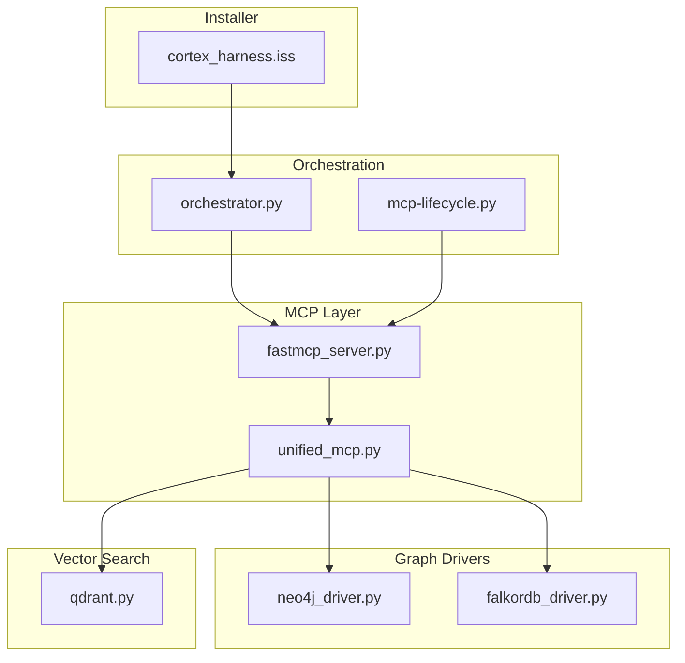
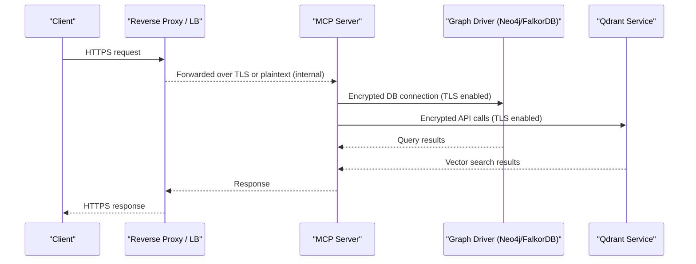
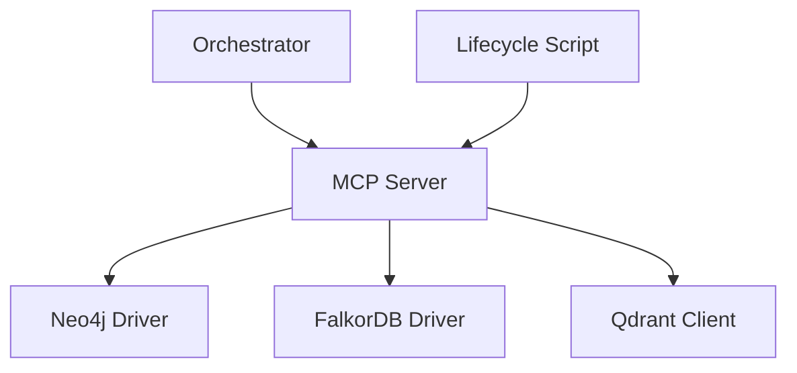

# Network Security Configuration

<cite>
**Referenced Files in This Document**
- [ReadMe.md](file://ReadMe.md)
- [Makefile](file://Makefile)
- [requirements.txt](file://requirements.txt)
- [pyproject.toml](file://pyproject.toml)
- [cortex_harness/dev.py](file://cortex_harness/dev.py)
- [code-tiny/mcp/fastmcp_server.py](file://code-tiny/mcp/fastmcp_server.py)
- [code-tiny/mcp/unified_mcp.py](file://code-tiny/mcp/unified_mcp.py)
- [code-tiny/mcp/services/graph_service.py](file://code-tiny/mcp/services/graph_service.py)
- [code-tiny/tools/graph/driver/neo4j_driver.py](file://code-tiny/tools/graph/driver/neo4j_driver.py)
- [code-tiny/tools/graph/driver/falkordb_driver.py](file://code-tiny/tools/graph/driver/falkordb_driver.py)
- [code-tiny/tools/cobol/qdrant.py](file://code-tiny/tools/cobol/qdrant.py)
- [doc-tiny/graph_store.py](file://doc-tiny/graph_store.py)
- [doc-tiny/neo4j_loader.py](file://doc-tiny/neo4j_loader.py)
- [harness/scripts/orchestrator.py](file://harness/scripts/orchestrator.py)
- [installers/windows/inno_setup/cortex_harness.iss](file://installers/windows/inno_setup/cortex_harness.iss)
- [scripts/mcp-lifecycle.py](file://scripts/mcp-lifecycle.py)
- [tests/test_mcp_http_resilience.py](file://tests/test_mcp_http_resilience.py)
- [tests/test_cobol_qdrant_contract.py](file://tests/test_cobol_qdrant_contract.py)
- [tests/test_falkordb_driver.py](file://tests/test_falkordb_driver.py)
</cite>

## Table of Contents
1. [Introduction](#introduction)
2. [Project Structure](#project-structure)
3. [Core Components](#core-components)
4. [Architecture Overview](#architecture-overview)
5. [Detailed Component Analysis](#detailed-component-analysis)
6. [Dependency Analysis](#dependency-analysis)
7. [Performance Considerations](#performance-considerations)
8. [Troubleshooting Guide](#troubleshooting-guide)
9. [Conclusion](#conclusion)
10. [Appendices](#appendices)

## Introduction
This document provides a comprehensive network security configuration guide for Cortex Harness, focusing on secure communication and infrastructure hardening. It covers SSL/TLS setup for the MCP server and database connections (Neo4j/FalkorDB), certificate management, firewall and port requirements, network segmentation strategies, proxy and reverse proxy considerations, load balancer setup, securing vector search services (Qdrant), external API integrations, and integration points for network monitoring, traffic analysis, and intrusion detection.

The guidance is grounded in the repository’s components that implement the MCP server, graph drivers, vector search client, and orchestration scripts. Where specific implementation details are present in the codebase, they are referenced with section sources. For areas not explicitly implemented in the repository, this document provides best-practice recommendations aligned with common enterprise deployment patterns.

## Project Structure
Cortex Harness integrates multiple subsystems:
- MCP server entrypoints and unified routing
- Graph database drivers (Neo4j and FalkorDB)
- Vector search client (Qdrant)
- Orchestration and lifecycle scripts
- Installer configurations for Windows packaging

**Diagram sources**
- [code-tiny/mcp/fastmcp_server.py](file://code-tiny/mcp/fastmcp_server.py)
- [code-tiny/mcp/unified_mcp.py](file://code-tiny/mcp/unified_mcp.py)
- [code-tiny/tools/graph/driver/neo4j_driver.py](file://code-tiny/tools/graph/driver/neo4j_driver.py)
- [code-tiny/tools/graph/driver/falkordb_driver.py](file://code-tiny/tools/graph/driver/falkordb_driver.py)
- [code-tiny/tools/cobol/qdrant.py](file://code-tiny/tools/cobol/qdrant.py)
- [harness/scripts/orchestrator.py](file://harness/scripts/orchestrator.py)
- [scripts/mcp-lifecycle.py](file://scripts/mcp-lifecycle.py)
- [installers/windows/inno_setup/cortex_harness.iss](file://installers/windows/inno_setup/cortex_harness.iss)

**Section sources**
- [ReadMe.md](file://ReadMe.md)
- [Makefile](file://Makefile)
- [requirements.txt](file://requirements.txt)
- [pyproject.toml](file://pyproject.toml)

## Core Components
- MCP Server: The FastMCP-based server exposes capabilities to clients. Secure transport should be enforced via TLS termination at a reverse proxy or by enabling TLS within the server if supported by the runtime.
- Unified MCP Router: Routes requests to framework-specific handlers and data access layers.
- Graph Drivers: Provide connectivity to Neo4j and FalkorDB with connection parameters and options.
- Qdrant Client: Connects to the vector search service for semantic retrieval.
- Orchestrator and Lifecycle Scripts: Manage process lifecycles, environment variables, and startup flags.

Security-relevant configuration typically resides in environment variables and driver initialization parameters. Review these files to identify where TLS settings, certificates, and authentication credentials are consumed.

**Section sources**
- [code-tiny/mcp/fastmcp_server.py](file://code-tiny/mcp/fastmcp_server.py)
- [code-tiny/mcp/unified_mcp.py](file://code-tiny/mcp/unified_mcp.py)
- [code-tiny/tools/graph/driver/neo4j_driver.py](file://code-tiny/tools/graph/driver/neo4j_driver.py)
- [code-tiny/tools/graph/driver/falkordb_driver.py](file://code-tiny/tools/graph/driver/falkordb_driver.py)
- [code-tiny/tools/cobol/qdrant.py](file://code-tiny/tools/cobol/qdrant.py)
- [harness/scripts/orchestrator.py](file://harness/scripts/orchestrator.py)
- [scripts/mcp-lifecycle.py](file://scripts/mcp-lifecycle.py)

## Architecture Overview
The following diagram maps the primary network-facing components and their dependencies.

**Diagram sources**
- [code-tiny/mcp/fastmcp_server.py](file://code-tiny/mcp/fastmcp_server.py)
- [code-tiny/tools/graph/driver/neo4j_driver.py](file://code-tiny/tools/graph/driver/neo4j_driver.py)
- [code-tiny/tools/graph/driver/falkordb_driver.py](file://code-tiny/tools/graph/driver/falkordb_driver.py)
- [code-tiny/tools/cobol/qdrant.py](file://code-tiny/tools/cobol/qdrant.py)

## Detailed Component Analysis

### MCP Server TLS and Reverse Proxy
- Terminate TLS at a reverse proxy (e.g., Nginx, HAProxy, Envoy) or enable TLS directly in the MCP server if supported by the underlying framework.
- Enforce strong cipher suites and modern TLS versions.
- Configure HTTP Strict Transport Security (HSTS) and secure headers at the proxy layer.
- Validate upstream health checks and ensure failover behavior.

Operational notes:
- Ensure the MCP server binds to localhost when exposed only through a reverse proxy.
- Use separate ports for internal and external interfaces.
- Log TLS handshake failures and certificate errors for monitoring.

**Section sources**
- [code-tiny/mcp/fastmcp_server.py](file://code-tiny/mcp/fastmcp_server.py)
- [code-tiny/mcp/unified_mcp.py](file://code-tiny/mcp/unified_mcp.py)
- [harness/scripts/orchestrator.py](file://harness/scripts/orchestrator.py)
- [scripts/mcp-lifecycle.py](file://scripts/mcp-lifecycle.py)

### Database Connections: Neo4j and FalkorDB
- Enable TLS for both Neo4j and FalkorDB connections using driver-provided options.
- Configure certificate verification and trust stores appropriately.
- Restrict database ports to application hosts only; avoid exposing databases to untrusted networks.
- Use least-privilege database accounts scoped to required operations.

Implementation references:
- Neo4j driver initialization and connection options
- FalkorDB driver initialization and connection options

**Section sources**
- [code-tiny/tools/graph/driver/neo4j_driver.py](file://code-tiny/tools/graph/driver/neo4j_driver.py)
- [code-tiny/tools/graph/driver/falkordb_driver.py](file://code-tiny/tools/graph/driver/falkordb_driver.py)
- [doc-tiny/graph_store.py](file://doc-tiny/graph_store.py)
- [doc-tiny/neo4j_loader.py](file://doc-tiny/neo4j_loader.py)

### Vector Search: Qdrant
- Connect to Qdrant over TLS with certificate validation.
- Authenticate using API keys or mTLS depending on your Qdrant deployment.
- Scope collections and permissions to minimize exposure.
- Monitor Qdrant endpoints for anomalies and rate-limit client requests.

Implementation reference:
- Qdrant client usage and configuration

**Section sources**
- [code-tiny/tools/cobol/qdrant.py](file://code-tiny/tools/cobol/qdrant.py)
- [tests/test_cobol_qdrant_contract.py](file://tests/test_cobol_qdrant_contract.py)

### External API Integrations
- Use TLS for all outbound API calls.
- Validate server certificates and consider pinning certificates for critical APIs.
- Implement retries with exponential backoff and circuit breakers.
- Rotate secrets regularly and store them securely (e.g., OS keychain, secret manager).

[No sources needed since this section provides general guidance]

### Certificate Management
- Store CA bundles and private keys in protected directories with restricted file permissions.
- Automate certificate renewal and reload processes without downtime.
- Validate certificate chains and expiration dates during startup.
- Maintain audit logs for certificate changes.

[No sources needed since this section provides general guidance]

### Firewall Requirements and Port Configurations
- Expose only necessary ports externally (e.g., HTTPS for MCP via reverse proxy).
- Allow internal traffic between MCP server and databases/vector services on private subnets.
- Block direct database and vector service ports from public networks.
- Apply egress filtering to restrict outbound connections to known endpoints.

[No sources needed since this section provides general guidance]

### Network Segmentation Strategies
- Place MCP server in an application segment.
- Isolate databases and vector services in a dedicated segment with strict ACLs.
- Use VLANs or VPC peering to enforce isolation.
- Segment CI/CD and development environments from production.

[No sources needed since this section provides general guidance]

### Proxy and Load Balancer Setup
- Configure TLS termination at the edge with modern protocols (TLS 1.2+).
- Enable keep-alive and connection pooling tuned to workload characteristics.
- Set up health checks and graceful degradation.
- Distribute traffic across multiple MCP instances behind a load balancer.

[No sources needed since this section provides general guidance]

### Reverse Proxy Security Considerations
- Strip or sanitize sensitive headers.
- Enforce request size limits and timeouts.
- Enable request logging and integrate with SIEM.
- Protect against common web attacks (WAF rules, rate limiting).

[No sources needed since this section provides general guidance]

### Monitoring, Traffic Analysis, and Intrusion Detection
- Capture network metrics (latency, error rates, throughput) at the proxy and application layers.
- Integrate with IDS/IPS systems to detect anomalous traffic patterns.
- Correlate TLS handshake failures and certificate errors with alerts.
- Export structured logs to centralized logging and analytics platforms.

[No sources needed since this section provides general guidance]

## Dependency Analysis
The following diagram highlights key dependencies among network-facing components.

**Diagram sources**
- [code-tiny/mcp/fastmcp_server.py](file://code-tiny/mcp/fastmcp_server.py)
- [code-tiny/tools/graph/driver/neo4j_driver.py](file://code-tiny/tools/graph/driver/neo4j_driver.py)
- [code-tiny/tools/graph/driver/falkordb_driver.py](file://code-tiny/tools/graph/driver/falkordb_driver.py)
- [code-tiny/tools/cobol/qdrant.py](file://code-tiny/tools/cobol/qdrant.py)
- [harness/scripts/orchestrator.py](file://harness/scripts/orchestrator.py)
- [scripts/mcp-lifecycle.py](file://scripts/mcp-lifecycle.py)

**Section sources**
- [requirements.txt](file://requirements.txt)
- [pyproject.toml](file://pyproject.toml)

## Performance Considerations
- Tune connection pools for graph and vector services based on expected concurrency.
- Use keep-alive and HTTP/2 where supported to reduce overhead.
- Cache frequently accessed metadata to reduce repeated queries.
- Monitor resource utilization and adjust timeouts accordingly.

[No sources needed since this section provides general guidance]

## Troubleshooting Guide
Common issues and diagnostics:
- TLS handshake failures: Verify certificate chains, hostname matching, and cipher suites.
- Connection refused: Confirm firewall rules and service binding addresses.
- Authentication errors: Check credentials and scope permissions for databases and APIs.
- High latency: Inspect network paths, proxy queues, and backend health.

Validation tests:
- MCP HTTP resilience tests help validate retry logic and error handling under adverse conditions.
- Qdrant contract tests verify client behavior and error responses.
- FalkorDB driver tests confirm connectivity and query execution.

**Section sources**
- [tests/test_mcp_http_resilience.py](file://tests/test_mcp_http_resilience.py)
- [tests/test_cobol_qdrant_contract.py](file://tests/test_cobol_qdrant_contract.py)
- [tests/test_falkordb_driver.py](file://tests/test_falkordb_driver.py)

## Conclusion
Securing Cortex Harness requires a layered approach: enforce TLS at the edge and for all internal communications, manage certificates rigorously, apply strict firewall and segmentation policies, and integrate robust monitoring and intrusion detection. By aligning configuration with the MCP server, graph drivers, and vector search client, you can achieve a resilient and secure deployment.

## Appendices

### Appendix A: Environment Variables and Configuration Keys
Review orchestrator and lifecycle scripts to identify environment variables used for:
- MCP server host/port and TLS flags
- Database connection strings and TLS options
- Qdrant endpoint URLs and authentication tokens
- Logging and monitoring hooks

**Section sources**
- [harness/scripts/orchestrator.py](file://harness/scripts/orchestrator.py)
- [scripts/mcp-lifecycle.py](file://scripts/mcp-lifecycle.py)

### Appendix B: Installer and Packaging Notes
Windows installer configuration may include registry entries or service definitions relevant to network exposure and startup behavior.

**Section sources**
- [installers/windows/inno_setup/cortex_harness.iss](file://installers/windows/inno_setup/cortex_harness.iss)