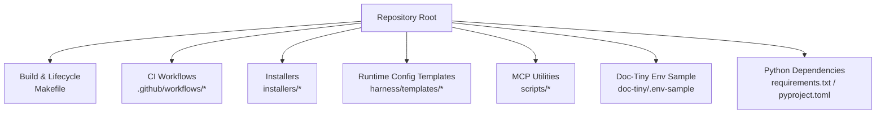
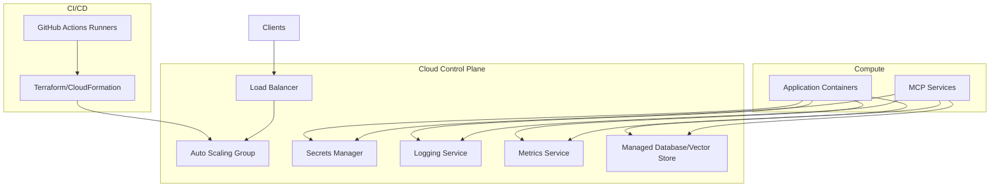
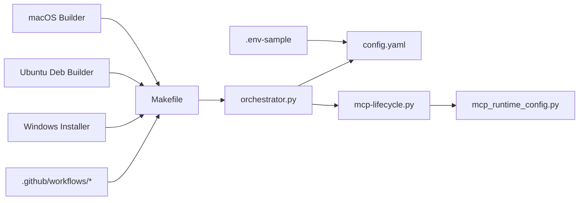
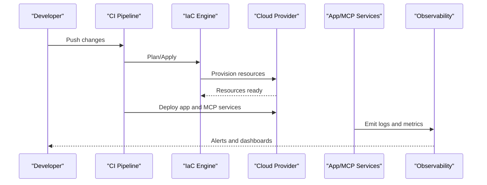

# Cloud Platform Deployments

<cite>
**Referenced Files in This Document**
- [ReadMe.md](file://ReadMe.md)
- [Makefile](file://Makefile)
- [requirements.txt](file://requirements.txt)
- [pyproject.toml](file://pyproject.toml)
- [.github/workflows/cobol-macos.yml](file://.github/workflows/cobol-macos.yml)
- [.github/workflows/lifecycle-macos.yml](file://.github/workflows/lifecycle-macos.yml)
- [harness/scripts/orchestrator.py](file://harness/scripts/orchestrator.py)
- [harness/templates/config.yaml](file://harness/templates/config.yaml)
- [installers/README.md](file://installers/README.md)
- [installers/windows/inno_setup/cortex_harness.iss](file://installers/windows/inno_setup/cortex_harness.iss)
- [installers/ubuntu/scripts/build_deb.sh](file://installers/ubuntu/scripts/build_deb.sh)
- [installers/macos/workflows/build_pkg.sh](file://installers/macos/workflows/build_pkg.sh)
- [scripts/mcp-lifecycle.py](file://scripts/mcp-lifecycle.py)
- [scripts/mcp_runtime_config.py](file://scripts/mcp_runtime_config.py)
- [doc-tiny/.env-sample](file://doc-tiny/.env-sample)
- [code-tiny/requirements.txt](file://code-tiny/requirements.txt)
- [code-tiny/run_mcp.sh](file://code-tiny/run_mcp.sh)
- [code-tiny/mcp.sh](file://code-tiny/mcp.sh)
</cite>

## Table of Contents
1. [Introduction](#introduction)
2. [Project Structure](#project-structure)
3. [Core Components](#core-components)
4. [Architecture Overview](#architecture-overview)
5. [Detailed Component Analysis](#detailed-component-analysis)
6. [Dependency Analysis](#dependency-analysis)
7. [Performance Considerations](#performance-considerations)
8. [Troubleshooting Guide](#troubleshooting-guide)
9. [Conclusion](#conclusion)
10. [Appendices](#appendices)

## Introduction
This document provides cloud platform deployment guidance for AWS, Azure, and Google Cloud Platform (GCP). It focuses on managed service integrations, auto-scaling configurations, and cloud-specific optimizations. It also outlines infrastructure as code patterns using Terraform or CloudFormation, cloud-native monitoring/logging/alerting setups, cost optimization strategies, reserved instance planning, multi-region deployment patterns, and platform-specific security and compliance considerations. The content is designed to be accessible to both technical and non-technical readers while remaining grounded in the repository’s existing build, packaging, and runtime artifacts.

## Project Structure
The repository includes:
- Build and lifecycle tooling via Make targets and scripts
- GitHub Actions workflows for macOS-based CI
- Packaging scripts for Windows, Ubuntu, and macOS installers
- Runtime configuration templates and environment samples
- MCP-related lifecycle and runtime configuration utilities

[No sources needed since this diagram shows conceptual workflow, not actual code structure]

**Section sources**
- [Makefile](file://Makefile)
- [.github/workflows/cobol-macos.yml](file://.github/workflows/cobol-macos.yml)
- [.github/workflows/lifecycle-macos.yml](file://.github/workflows/lifecycle-macos.yml)
- [installers/README.md](file://installers/README.md)
- [harness/templates/config.yaml](file://harness/templates/config.yaml)
- [scripts/mcp-lifecycle.py](file://scripts/mcp-lifecycle.py)
- [scripts/mcp_runtime_config.py](file://scripts/mcp_runtime_config.py)
- [doc-tiny/.env-sample](file://doc-tiny/.env-sample)
- [requirements.txt](file://requirements.txt)
- [pyproject.toml](file://pyproject.toml)

## Core Components
- Build and orchestration:
  - Makefile defines lifecycle targets used across environments.
  - orchestrator.py coordinates tasks during setup and execution.
- Packaging and distribution:
  - Installers include Windows Inno Setup script, Ubuntu deb builder, and macOS package builder.
- Runtime configuration:
  - harness/templates/config.yaml provides a template for application settings.
  - doc-tiny/.env-sample demonstrates environment variable usage.
- MCP lifecycle and runtime:
  - scripts/mcp-lifecycle.py and scripts/mcp_runtime_config.py manage MCP server lifecycle and runtime configuration.
- CI automation:
  - .github/workflows define macOS-based CI jobs that can be adapted to cloud-hosted runners.

**Section sources**
- [Makefile](file://Makefile)
- [harness/scripts/orchestrator.py](file://harness/scripts/orchestrator.py)
- [installers/windows/inno_setup/cortex_harness.iss](file://installers/windows/inno_setup/cortex_harness.iss)
- [installers/ubuntu/scripts/build_deb.sh](file://installers/ubuntu/scripts/build_deb.sh)
- [installers/macos/workflows/build_pkg.sh](file://installers/macos/workflows/build_pkg.sh)
- [harness/templates/config.yaml](file://harness/templates/config.yaml)
- [doc-tiny/.env-sample](file://doc-tiny/.env-sample)
- [scripts/mcp-lifecycle.py](file://scripts/mcp-lifecycle.py)
- [scripts/mcp_runtime_config.py](file://scripts/mcp_runtime_config.py)
- [.github/workflows/cobol-macos.yml](file://.github/workflows/cobol-macos.yml)
- [.github/workflows/lifecycle-macos.yml](file://.github/workflows/lifecycle-macos.yml)

## Architecture Overview
A typical cloud deployment pattern for this project involves:
- Containerizing the Python-based components and MCP services
- Running behind a managed load balancer with auto-scaling groups
- Storing state in managed databases or vector stores
- Centralizing logs and metrics with cloud-native observability tools
- Managing secrets via cloud secret managers
- Automating deployments through CI/CD pipelines

[No sources needed since this diagram shows conceptual workflow, not actual code structure]

## Detailed Component Analysis

### AWS Deployment Pattern
- Compute and scaling:
  - Use ECS/Fargate or EKS for container orchestration; configure Auto Scaling Groups for EC2-based deployments.
  - Set CPU/memory thresholds and scale-out policies aligned with request latency and queue depth.
- Networking:
  - Place services behind ALB/NLB; enable HTTPS termination at the load balancer.
- Storage and data:
  - Use RDS/Aurora for relational data; use managed vector stores where applicable.
- Observability:
  - Ship logs to CloudWatch; set up alarms for error rates and latency.
  - Use CloudWatch Metrics and Dashboards for system health.
- Security:
  - IAM roles for service accounts; VPC security groups restrict ingress/egress.
  - Enable encryption at rest and in transit; rotate secrets via Secrets Manager.
- Cost optimization:
  - Right-size instances; use Savings Plans or Reserved Instances for baseline workloads.
  - Prefer spot instances for fault-tolerant batch jobs.
- Multi-region:
  - Use Route 53 latency-based routing; replicate data with cross-region replication where supported.

[No sources needed since this section provides general guidance]

### Azure Deployment Pattern
- Compute and scaling:
  - Use AKS or App Service with autoscale profiles; configure horizontal pod autoscaling or app-level scaling rules.
- Networking:
  - Use Application Gateway or Front Door for TLS termination and WAF.
- Storage and data:
  - Use Azure SQL Database or Cosmos DB; integrate with Azure Key Vault for secrets.
- Observability:
  - Stream logs to Log Analytics; create alerts based on KQL queries.
  - Monitor with Application Insights and Azure Monitor dashboards.
- Security:
  - Managed identities for resource access; network security groups and private endpoints.
  - Enable encryption at rest and in transit; enforce least privilege.
- Cost optimization:
  - Use Azure Reservations for baseline capacity; leverage spot VMSS for bursty workloads.
- Multi-region:
  - Configure Traffic Manager or Front Door for global routing; use geo-replication for data.

[No sources needed since this section provides general guidance]

### Google Cloud Platform Deployment Pattern
- Compute and scaling:
  - Use GKE with Horizontal Pod Autoscaler; consider Cloud Run for stateless services.
- Networking:
  - Use Load Balancing (HTTP(S)/TCP) with SSL certificates managed by ACM.
- Storage and data:
  - Use Cloud SQL or AlloyDB; integrate Secret Manager for credentials.
- Observability:
  - Export logs to Cloud Logging; set up alerting policies for SLOs.
  - Use Cloud Monitoring dashboards and uptime checks.
- Security:
  - Workload Identity for pods; VPC firewall rules and Private Service Connect.
  - Enable encryption at rest and in transit; audit with Cloud Audit Logs.
- Cost optimization:
  - Committed use discounts for baseline capacity; preemptible VMs for resilient batch processing.
- Multi-region:
  - Use Global HTTP(S) Load Balancer; replicate data with cross-region backups.

[No sources needed since this section provides general guidance]

### Infrastructure as Code Patterns
- Terraform:
  - Define modules for networking, compute, storage, and secrets.
  - Use variables and remote state backends; apply plan/apply in CI.
- CloudFormation:
  - Create stacks per environment; use parameters and outputs; stack sets for multi-account.
- Best practices:
  - Version control all IaC; enforce policy-as-code; run drift detection.
  - Separate state files per environment; use tagging for cost allocation.

[No sources needed since this section provides general guidance]

### CI/CD Integration
- Adapt GitHub Actions to cloud-hosted runners for each provider.
- Integrate Terraform/CloudFormation steps into pipeline stages.
- Gate deployments with approvals and automated tests.

**Section sources**
- [.github/workflows/cobol-macos.yml](file://.github/workflows/cobol-macos.yml)
- [.github/workflows/lifecycle-macos.yml](file://.github/workflows/lifecycle-macos.yml)

### Packaging and Distribution
- Windows:
  - Inno Setup script packages installer assets and registry entries.
- Ubuntu:
  - Deb builder script creates Linux packages for easy installation.
- macOS:
  - Package builder script generates macOS installers.
- Guidance:
  - Sign binaries; pin dependencies; validate checksums.

**Section sources**
- [installers/windows/inno_setup/cortex_harness.iss](file://installers/windows/inno_setup/cortex_harness.iss)
- [installers/ubuntu/scripts/build_deb.sh](file://installers/ubuntu/scripts/build_deb.sh)
- [installers/macos/workflows/build_pkg.sh](file://installers/macos/workflows/build_pkg.sh)
- [installers/README.md](file://installers/README.md)

### Runtime Configuration and Environment
- Template configuration:
  - harness/templates/config.yaml serves as a base for environment-specific overrides.
- Environment variables:
  - doc-tiny/.env-sample illustrates required variables for local and cloud runs.
- MCP lifecycle:
  - scripts/mcp-lifecycle.py manages start/stop/status of MCP services.
  - scripts/mcp_runtime_config.py loads runtime configuration for MCP.

**Section sources**
- [harness/templates/config.yaml](file://harness/templates/config.yaml)
- [doc-tiny/.env-sample](file://doc-tiny/.env-sample)
- [scripts/mcp-lifecycle.py](file://scripts/mcp-lifecycle.py)
- [scripts/mcp_runtime_config.py](file://scripts/mcp_runtime_config.py)

### Build and Orchestration
- Makefile:
  - Provides lifecycle targets for common operations across platforms.
- Orchestrator:
  - harness/scripts/orchestrator.py coordinates setup and execution flows.

**Section sources**
- [Makefile](file://Makefile)
- [harness/scripts/orchestrator.py](file://harness/scripts/orchestrator.py)

### Dependency Management
- Python dependencies:
  - requirements.txt and pyproject.toml define runtime and development dependencies.
- Additional modules:
  - code-tiny/requirements.txt lists dependencies for specific components.

**Section sources**
- [requirements.txt](file://requirements.txt)
- [pyproject.toml](file://pyproject.toml)
- [code-tiny/requirements.txt](file://code-tiny/requirements.txt)

### Shell Scripts for MCP
- code-tiny/run_mcp.sh and code-tiny/mcp.sh provide convenience wrappers for running MCP services locally or in containers.

**Section sources**
- [code-tiny/run_mcp.sh](file://code-tiny/run_mcp.sh)
- [code-tiny/mcp.sh](file://code-tiny/mcp.sh)

## Dependency Analysis
High-level relationships among key components:

**Diagram sources**
- [Makefile](file://Makefile)
- [harness/scripts/orchestrator.py](file://harness/scripts/orchestrator.py)
- [harness/templates/config.yaml](file://harness/templates/config.yaml)
- [scripts/mcp-lifecycle.py](file://scripts/mcp-lifecycle.py)
- [scripts/mcp_runtime_config.py](file://scripts/mcp_runtime_config.py)
- [.github/workflows/cobol-macos.yml](file://.github/workflows/cobol-macos.yml)
- [.github/workflows/lifecycle-macos.yml](file://.github/workflows/lifecycle-macos.yml)
- [installers/windows/inno_setup/cortex_harness.iss](file://installers/windows/inno_setup/cortex_harness.iss)
- [installers/ubuntu/scripts/build_deb.sh](file://installers/ubuntu/scripts/build_deb.sh)
- [installers/macos/workflows/build_pkg.sh](file://installers/macos/workflows/build_pkg.sh)
- [doc-tiny/.env-sample](file://doc-tiny/.env-sample)

**Section sources**
- [Makefile](file://Makefile)
- [harness/scripts/orchestrator.py](file://harness/scripts/orchestrator.py)
- [harness/templates/config.yaml](file://harness/templates/config.yaml)
- [scripts/mcp-lifecycle.py](file://scripts/mcp-lifecycle.py)
- [scripts/mcp_runtime_config.py](file://scripts/mcp_runtime_config.py)
- [.github/workflows/cobol-macos.yml](file://.github/workflows/cobol-macos.yml)
- [.github/workflows/lifecycle-macos.yml](file://.github/workflows/lifecycle-macos.yml)
- [installers/windows/inno_setup/cortex_harness.iss](file://installers/windows/inno_setup/cortex_harness.iss)
- [installers/ubuntu/scripts/build_deb.sh](file://installers/ubuntu/scripts/build_deb.sh)
- [installers/macos/workflows/build_pkg.sh](file://installers/macos/workflows/build_pkg.sh)
- [doc-tiny/.env-sample](file://doc-tiny/.env-sample)

## Performance Considerations
- Right-size compute resources based on observed CPU/memory utilization and request latency.
- Tune auto-scaling thresholds to balance responsiveness and cost.
- Use connection pooling and caching layers where appropriate.
- Optimize database queries and indexes; monitor slow query logs.
- Enable compression and CDN for static assets if applicable.
- Profile MCP services to identify bottlenecks and optimize concurrency.

[No sources needed since this section provides general guidance]

## Troubleshooting Guide
- Verify environment variables and config templates before deployment.
- Check CI logs for failures in build and packaging steps.
- Validate secrets resolution from cloud secret managers.
- Inspect application logs and metrics for errors and anomalies.
- Ensure networking rules allow inbound/outbound traffic as expected.
- Confirm database connectivity and authentication.

**Section sources**
- [doc-tiny/.env-sample](file://doc-tiny/.env-sample)
- [harness/templates/config.yaml](file://harness/templates/config.yaml)
- [.github/workflows/cobol-macos.yml](file://.github/workflows/cobol-macos.yml)
- [.github/workflows/lifecycle-macos.yml](file://.github/workflows/lifecycle-macos.yml)

## Conclusion
By aligning the repository’s build, packaging, and runtime artifacts with cloud-native patterns, you can deploy reliably across AWS, Azure, and GCP. Use managed services for scalability and resilience, automate with CI/CD and IaC, centralize observability, and implement robust security and cost controls. Multi-region designs and reserved capacity planning further enhance performance and economics.

[No sources needed since this section summarizes without analyzing specific files]

## Appendices

### Appendix A: Example Deployment Sequence

[No sources needed since this diagram shows conceptual workflow, not actual code structure]

### Appendix B: Security and Compliance Checklist
- Enforce least privilege with IAM/roles and network policies.
- Encrypt data at rest and in transit; manage keys centrally.
- Rotate secrets regularly; avoid hardcoding credentials.
- Enable audit logging and retention policies.
- Conduct vulnerability scans and dependency audits.
- Align with regional compliance requirements (e.g., GDPR, HIPAA).

[No sources needed since this section provides general guidance]