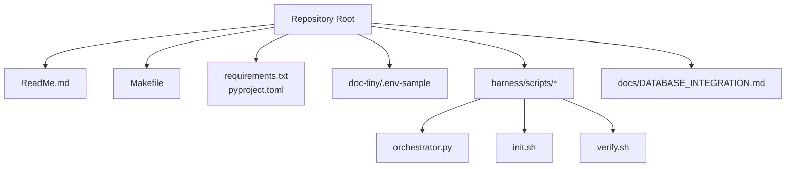
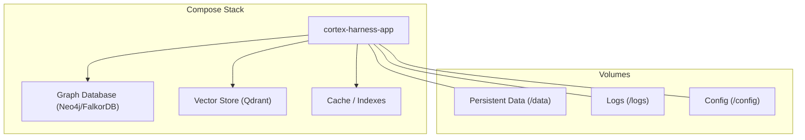
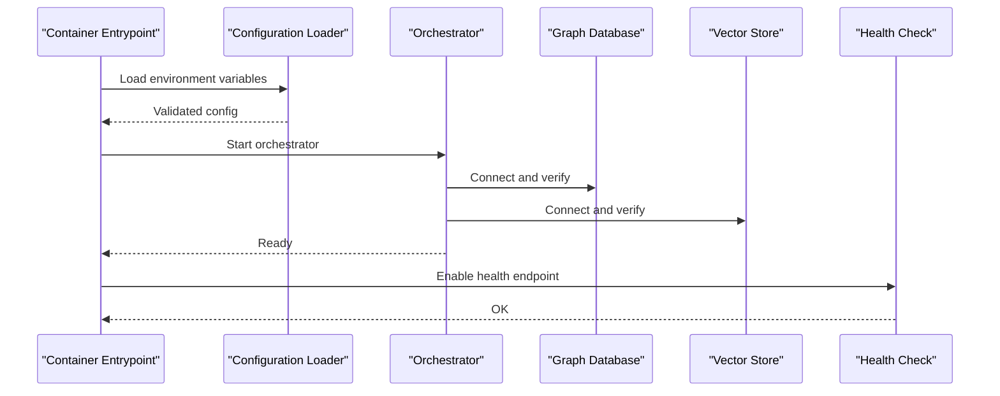
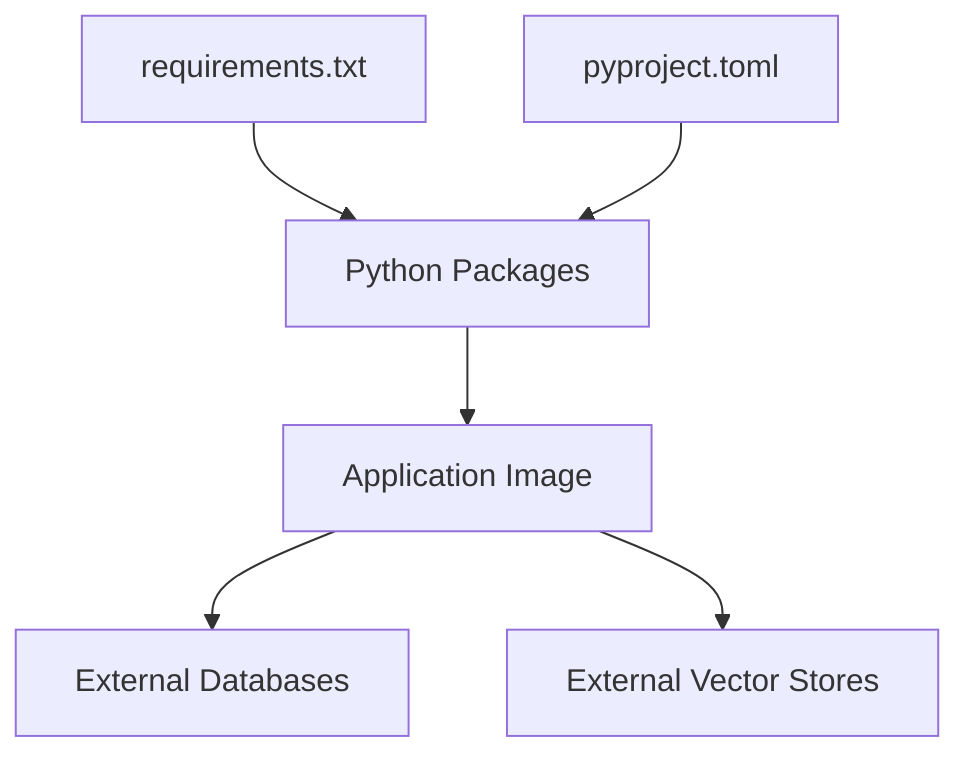

# Containerization & Docker

<cite>
**Referenced Files in This Document**
- [ReadMe.md](file://ReadMe.md)
- [Makefile](file://Makefile)
- [requirements.txt](file://requirements.txt)
- [pyproject.toml](file://pyproject.toml)
- [.env-sample](file://doc-tiny/.env-sample)
- [harness_config.py](file://code-tiny/tools/common/harness_config.py)
- [orchestrator.py](file://harness/scripts/orchestrator.py)
- [init.sh](file://harness/scripts/init.sh)
- [verify.sh](file://harness/scripts/verify.sh)
- [DATABASE_INTEGRATION.md](file://docs/DATABASE_INTEGRATION.md)
</cite>

## Table of Contents
1. [Introduction](#introduction)
2. [Project Structure](#project-structure)
3. [Core Components](#core-components)
4. [Architecture Overview](#architecture-overview)
5. [Detailed Component Analysis](#detailed-component-analysis)
6. [Dependency Analysis](#dependency-analysis)
7. [Performance Considerations](#performance-considerations)
8. [Troubleshooting Guide](#troubleshooting-guide)
9. [Conclusion](#conclusion)
10. [Appendices](#appendices)

## Introduction
This document provides comprehensive containerization guidance for Cortex Harness, focusing on building Docker images, multi-stage builds, and optimization strategies. It explains configuration management via environment variables, persistent data through volume mounts, and Docker Compose setups for development and production. Security best practices, user permissions, and resource limits are covered, along with examples for custom images tailored to different analyzer configurations and database integrations.

## Project Structure
Cortex Harness is a Python-based project with multiple analyzers and orchestration scripts. The repository includes:
- A top-level README describing the project overview and usage.
- A Makefile that centralizes build and lifecycle targets.
- Python dependency files (requirements.txt and pyproject.toml).
- Environment sample file (.env-sample) for configuration.
- Orchestration and initialization scripts under harness/scripts.
- Documentation for database integration.

**Diagram sources**
- [ReadMe.md](file://ReadMe.md)
- [Makefile](file://Makefile)
- [requirements.txt](file://requirements.txt)
- [pyproject.toml](file://pyproject.toml)
- [.env-sample](file://doc-tiny/.env-sample)
- [orchestrator.py](file://harness/scripts/orchestrator.py)
- [init.sh](file://harness/scripts/init.sh)
- [verify.sh](file://harness/scripts/verify.sh)
- [DATABASE_INTEGRATION.md](file://docs/DATABASE_INTEGRATION.md)

**Section sources**
- [ReadMe.md](file://ReadMe.md)
- [Makefile](file://Makefile)
- [requirements.txt](file://requirements.txt)
- [pyproject.toml](file://pyproject.toml)
- [.env-sample](file://doc-tiny/.env-sample)
- [orchestrator.py](file://harness/scripts/orchestrator.py)
- [init.sh](file://harness/scripts/init.sh)
- [verify.sh](file://harness/scripts/verify.sh)
- [DATABASE_INTEGRATION.md](file://docs/DATABASE_INTEGRATION.md)

## Core Components
- Configuration Management:
  - Environment-driven configuration via .env-sample and runtime loader utilities.
  - Harness-specific configuration module used by orchestrator and analyzers.
- Orchestration Scripts:
  - Initialization script for setting up environment and dependencies.
  - Orchestrator script for running analysis workflows.
  - Verification script for health checks and readiness probes.
- Database Integration:
  - Documentation detailing supported databases and connection patterns.

Key responsibilities:
- Build-time: Install dependencies, prepare assets, and set entrypoints.
- Runtime: Load environment variables, initialize graph stores, run analyzers, and expose services as needed.

**Section sources**
- [.env-sample](file://doc-tiny/.env-sample)
- [harness_config.py](file://code-tiny/tools/common/harness_config.py)
- [orchestrator.py](file://harness/scripts/orchestrator.py)
- [init.sh](file://harness/scripts/init.sh)
- [verify.sh](file://harness/scripts/verify.sh)
- [DATABASE_INTEGRATION.md](file://docs/DATABASE_INTEGRATION.md)

## Architecture Overview
The containerized architecture typically consists of:
- Application Image: Python runtime, dependencies, and analyzer modules.
- Data Volumes: Persistent storage for graphs, caches, and logs.
- External Services: Graph databases (e.g., Neo4j or FalkorDB), vector stores (e.g., Qdrant), and optional LLM providers.
- Compose Stack: Development and production stacks coordinating application and service containers.

[No sources needed since this diagram shows conceptual workflow, not actual code structure]

## Detailed Component Analysis

### Docker Image Creation and Multi-Stage Builds
Recommended approach:
- Use a builder stage to install system dependencies and compile native components if required.
- Use a minimal runtime stage (e.g., slim or distroless) to reduce image size and attack surface.
- Copy only necessary artifacts from the builder to the runtime stage.
- Pin Python versions and dependency versions for reproducibility.

Optimization strategies:
- Layer caching: Order instructions to maximize cache hits (dependencies first).
- Combine RUN commands to reduce layers.
- Use .dockerignore to exclude unnecessary files.
- Prefer non-root users inside the container.

Example structure (conceptual):
- Stage 1: Builder installs OS packages and Python dependencies.
- Stage 2: Runtime copies compiled artifacts and sets entrypoint.

[No sources needed since this section provides general guidance]

### Container Configuration Management
Environment variables:
- Define defaults and overrides using .env-sample and runtime loaders.
- Separate secrets from configuration; inject secrets at runtime via secure mechanisms.

Harness configuration:
- Harness configuration module reads environment variables and applies defaults.
- Orchestrator uses configuration to determine analyzer pipelines and output paths.

Best practices:
- Validate required variables at startup.
- Provide clear error messages when configuration is missing.
- Avoid hardcoding sensitive values.

**Section sources**
- [.env-sample](file://doc-tiny/.env-sample)
- [harness_config.py](file://code-tiny/tools/common/harness_config.py)
- [orchestrator.py](file://harness/scripts/orchestrator.py)

### Volume Mounting for Persistent Data
Common volumes:
- Graph store data directory for persistence across restarts.
- Logs directory for observability and debugging.
- Config directory for mounted configuration files.

Mount strategy:
- Bind mount host directories for development.
- Use named volumes for production portability.
- Ensure correct permissions for non-root users.

Operational notes:
- Initialize data directories before starting the app.
- Back up persistent volumes regularly.
- Monitor disk usage and rotate logs.

**Section sources**
- [init.sh](file://harness/scripts/init.sh)
- [verify.sh](file://harness/scripts/verify.sh)

### Docker Compose Setups
Development stack:
- Single compose file defining app, graph database, and vector store.
- Exposes ports for local debugging.
- Uses bind mounts for source code and config.

Production stack:
- Separate compose files for environments (dev/staging/prod).
- Resource limits and restart policies configured.
- Health checks and readiness probes integrated.

Compose considerations:
- Use profiles to toggle optional services.
- Manage secrets via environment files or secret managers.
- Version control compose files and keep them aligned with image tags.

[No sources needed since this section provides general guidance]

### Container Security Best Practices
Security measures:
- Run as non-root user inside the container.
- Minimize base image footprint.
- Scan images for vulnerabilities.
- Restrict capabilities and use read-only filesystem where possible.
- Inject secrets securely and avoid logging sensitive data.

User permissions:
- Create dedicated user/group and chown persistent directories.
- Apply least privilege to file access.

Resource limits:
- Set CPU and memory limits in compose or orchestrator.
- Configure graceful shutdown and backpressure handling.

**Section sources**
- [verify.sh](file://harness/scripts/verify.sh)

### Custom Images with Different Analyzer Configurations
Customization approaches:
- Build variant images per analyzer profile (e.g., Java-focused, C++-focused).
- Use environment variables to enable/disable analyzers at runtime.
- Mount analyzer-specific configuration files via volumes.

Database integrations:
- Configure graph database connections via environment variables.
- Support multiple backends (Neo4j, FalkorDB) based on configuration.
- Initialize indexes and schemas during startup.

Examples (conceptual):
- Image tag suffixes indicating analyzer sets (e.g., :java, :cpp, :full).
- Compose profiles enabling specific analyzers and services.

**Section sources**
- [DATABASE_INTEGRATION.md](file://docs/DATABASE_INTEGRATION.md)
- [harness_config.py](file://code-tiny/tools/common/harness_config.py)
- [orchestrator.py](file://harness/scripts/orchestrator.py)

### Lifecycle and Orchestration Flow
Sequence of operations during container startup:
- Entry point initializes environment and validates configuration.
- Orchestrator loads analyzer settings and connects to external services.
- Health check endpoint responds to readiness probes.

**Diagram sources**
- [orchestrator.py](file://harness/scripts/orchestrator.py)
- [verify.sh](file://harness/scripts/verify.sh)

**Section sources**
- [orchestrator.py](file://harness/scripts/orchestrator.py)
- [verify.sh](file://harness/scripts/verify.sh)

## Dependency Analysis
Build-time dependencies:
- Python packages listed in requirements.txt and pyproject.toml.
- System-level dependencies installed in builder stage.

Runtime dependencies:
- Minimal Python runtime and essential libraries.
- External service clients for graph and vector stores.

**Diagram sources**
- [requirements.txt](file://requirements.txt)
- [pyproject.toml](file://pyproject.toml)

**Section sources**
- [requirements.txt](file://requirements.txt)
- [pyproject.toml](file://pyproject.toml)

## Performance Considerations
- Optimize layer ordering to leverage Docker cache effectively.
- Use multi-stage builds to minimize final image size.
- Enable compression for large artifacts and avoid copying unnecessary files.
- Tune analyzer concurrency and batch sizes via environment variables.
- Monitor resource utilization and adjust limits accordingly.

[No sources needed since this section provides general guidance]

## Troubleshooting Guide
Common issues and resolutions:
- Missing environment variables: Validate required keys at startup and provide clear errors.
- Permission denied on volumes: Ensure non-root user has write access to mounted directories.
- Connection failures to external services: Implement retries and health checks; log connection attempts.
- High memory usage: Adjust analyzer concurrency and set container resource limits.

Verification steps:
- Use verification script to check readiness and connectivity.
- Inspect logs for initialization errors and dependency resolution failures.

**Section sources**
- [verify.sh](file://harness/scripts/verify.sh)
- [init.sh](file://harness/scripts/init.sh)

## Conclusion
Cortex Harness can be containerized effectively using multi-stage builds, environment-driven configuration, and robust volume management. By following security best practices, applying resource limits, and leveraging Docker Compose for both development and production, teams can achieve reproducible, scalable deployments. Custom images and database integrations can be managed through configuration and compose profiles, ensuring flexibility without sacrificing reliability.

[No sources needed since this section summarizes without analyzing specific files]

## Appendices

### Example Dockerfile Outline (Conceptual)
- Builder stage: Install OS packages and Python dependencies.
- Runtime stage: Copy artifacts, set non-root user, define entrypoint.
- Healthcheck: Invoke verification script or HTTP probe.

[No sources needed since this section provides general guidance]

### Example Compose Snippets (Conceptual)
- Development: Bind mounts, exposed ports, dev-friendly defaults.
- Production: Named volumes, resource limits, restart policies, health checks.

[No sources needed since this section provides general guidance]