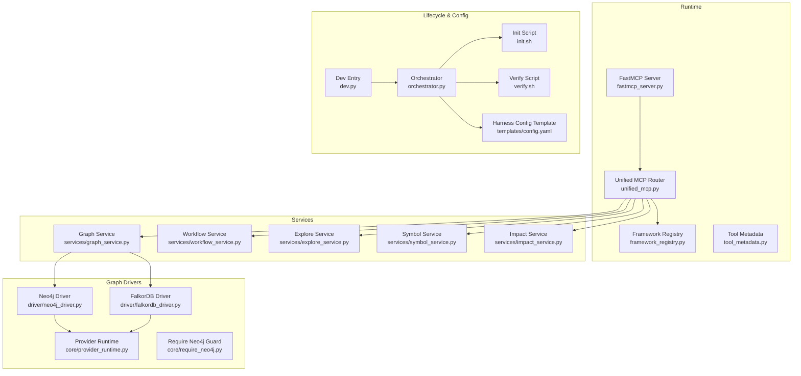
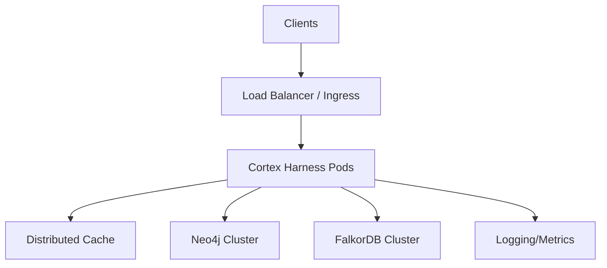
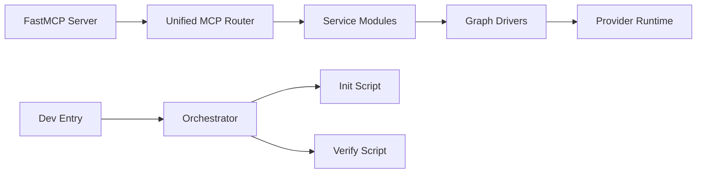

# Production Deployment Strategies

<cite>
**Referenced Files in This Document**
- [ReadMe.md](file://ReadMe.md)
- [Makefile](file://Makefile)
- [pyproject.toml](file://pyproject.toml)
- [requirements.txt](file://requirements.txt)
- [cortex_harness/dev.py](file://cortex_harness/dev.py)
- [harness/scripts/orchestrator.py](file://harness/scripts/orchestrator.py)
- [harness/scripts/init.sh](file://harness/scripts/init.sh)
- [harness/scripts/verify.sh](file://harness/scripts/verify.sh)
- [harness/templates/config.yaml](file://harness/templates/config.yaml)
- [code-tiny/mcp/fastmcp_server.py](file://code-tiny/mcp/fastmcp_server.py)
- [code-tiny/mcp/unified_mcp.py](file://code-tiny/mcp/unified_mcp.py)
- [code-tiny/mcp/services/graph_service.py](file://code-tiny/mcp/services/graph_service.py)
- [code-tiny/mcp/services/workflow_service.py](file://code-tiny/mcp/services/workflow_service.py)
- [code-tiny/mcp/services/explore_service.py](file://code-tiny/mcp/services/explore_service.py)
- [code-tiny/mcp/services/symbol_service.py](file://code-tiny/mcp/services/symbol_service.py)
- [code-tiny/mcp/services/impact_service.py](file://code-tiny/mcp/services/impact_service.py)
- [code-tiny/mcp/framework_registry.py](file://code-tiny/mcp/framework_registry.py)
- [code-tiny/mcp/tool_metadata.py](file://code-tiny/mcp/tool_metadata.py)
- [code-tiny/tools/common/harness_config.py](file://code-tiny/tools/common/harness_config.py)
- [code-tiny/tools/graph/driver/neo4j_driver.py](file://code-tiny/tools/graph/driver/neo4j_driver.py)
- [code-tiny/tools/graph/driver/falkordb_driver.py](file://code-tiny/tools/graph/driver/falkordb_driver.py)
- [code-tiny/tools/graph/core/require_neo4j.py](file://code-tiny/tools/graph/core/require_neo4j.py)
- [code-tiny/tools/graph/core/provider_runtime.py](file://code-tiny/tools/graph/core/provider_runtime.py)
- [doc-tiny/graph_store.py](file://doc-tiny/graph_store.py)
- [doc-tiny/neo4j_loader.py](file://doc-tiny/neo4j_loader.py)
- [scripts/mcp-lifecycle.py](file://scripts/mcp-lifecycle.py)
- [scripts/mcp_runtime_config.py](file://scripts/mcp_runtime_config.py)
- [.github/workflows/lifecycle-macos.yml](file://.github/workflows/lifecycle-macos.yml)
- [.github/workflows/cobol-macos.yml](file://.github/workflows/cobol-macos.yml)
- [installers/README.md](file://installers/README.md)
- [installers/windows/inno_setup/cortex_harness.iss](file://installers/windows/inno_setup/cortex_harness.iss)
- [installers/ubuntu/scripts/build_deb.sh](file://installers/ubuntu/scripts/build_deb.sh)
- [installers/macos/workflows/build_pkg.sh](file://installers/macos/workflows/build_pkg.sh)
</cite>

## Table of Contents
1. Introduction
2. Project Structure
3. Core Components
4. Architecture Overview
5. Detailed Component Analysis
6. Dependency Analysis
7. Performance Considerations
8. Troubleshooting Guide
9. Conclusion
10. Appendices

## Introduction
This document provides production deployment strategies for Cortex Harness, focusing on containerization with Docker, Kubernetes orchestration patterns, and cloud platform deployments across AWS, Azure, and GCP. It covers scaling considerations for multi-node deployments, load balancing, high availability configurations, database clustering (Neo4j and FalkorDB), cache layer configuration, distributed caching strategies, CI/CD integration, automated deployment workflows, rollback procedures, resource requirements, performance tuning parameters, and capacity planning guidelines.

## Project Structure
Cortex Harness is a Python-based system that orchestrates code analysis pipelines and exposes capabilities via an MCP-compatible interface. The runtime includes:
- A FastMCP server entrypoint
- Service modules for graph, workflow, explore, symbol, and impact operations
- Graph drivers for Neo4j and FalkorDB
- Lifecycle scripts and templates for initialization and verification
- Packaging and installer assets for Windows, Ubuntu, and macOS

**Diagram sources**
- [code-tiny/mcp/fastmcp_server.py](file://code-tiny/mcp/fastmcp_server.py)
- [code-tiny/mcp/unified_mcp.py](file://code-tiny/mcp/unified_mcp.py)
- [code-tiny/mcp/framework_registry.py](file://code-tiny/mcp/framework_registry.py)
- [code-tiny/mcp/tool_metadata.py](file://code-tiny/mcp/tool_metadata.py)
- [code-tiny/mcp/services/graph_service.py](file://code-tiny/mcp/services/graph_service.py)
- [code-tiny/mcp/services/workflow_service.py](file://code-tiny/mcp/services/workflow_service.py)
- [code-tiny/mcp/services/explore_service.py](file://code-tiny/mcp/services/explore_service.py)
- [code-tiny/mcp/services/symbol_service.py](file://code-tiny/mcp/services/symbol_service.py)
- [code-tiny/mcp/services/impact_service.py](file://code-tiny/mcp/services/impact_service.py)
- [code-tiny/tools/graph/driver/neo4j_driver.py](file://code-tiny/tools/graph/driver/neo4j_driver.py)
- [code-tiny/tools/graph/driver/falkordb_driver.py](file://code-tiny/tools/graph/driver/falkordb_driver.py)
- [code-tiny/tools/graph/core/provider_runtime.py](file://code-tiny/tools/graph/core/provider_runtime.py)
- [code-tiny/tools/graph/core/require_neo4j.py](file://code-tiny/tools/graph/core/require_neo4j.py)
- [harness/scripts/orchestrator.py](file://harness/scripts/orchestrator.py)
- [harness/scripts/init.sh](file://harness/scripts/init.sh)
- [harness/scripts/verify.sh](file://harness/scripts/verify.sh)
- [harness/templates/config.yaml](file://harness/templates/config.yaml)
- [cortex_harness/dev.py](file://cortex_harness/dev.py)

**Section sources**
- [ReadMe.md](file://ReadMe.md)
- [Makefile](file://Makefile)
- [pyproject.toml](file://pyproject.toml)
- [requirements.txt](file://requirements.txt)
- [cortex_harness/dev.py](file://cortex_harness/dev.py)
- [harness/scripts/orchestrator.py](file://harness/scripts/orchestrator.py)
- [harness/scripts/init.sh](file://harness/scripts/init.sh)
- [harness/scripts/verify.sh](file://harness/scripts/verify.sh)
- [harness/templates/config.yaml](file://harness/templates/config.yaml)
- [code-tiny/mcp/fastmcp_server.py](file://code-tiny/mcp/fastmcp_server.py)
- [code-tiny/mcp/unified_mcp.py](file://code-tiny/mcp/unified_mcp.py)
- [code-tiny/mcp/framework_registry.py](file://code-tiny/mcp/framework_registry.py)
- [code-tiny/mcp/tool_metadata.py](file://code-tiny/mcp/tool_metadata.py)
- [code-tiny/mcp/services/graph_service.py](file://code-tiny/mcp/services/graph_service.py)
- [code-tiny/mcp/services/workflow_service.py](file://code-tiny/mcp/services/workflow_service.py)
- [code-tiny/mcp/services/explore_service.py](file://code-tiny/mcp/services/explore_service.py)
- [code-tiny/mcp/services/symbol_service.py](file://code-tiny/mcp/services/symbol_service.py)
- [code-tiny/mcp/services/impact_service.py](file://code-tiny/mcp/services/impact_service.py)
- [code-tiny/tools/graph/driver/neo4j_driver.py](file://code-tiny/tools/graph/driver/neo4j_driver.py)
- [code-tiny/tools/graph/driver/falkordb_driver.py](file://code-tiny/tools/graph/driver/falkordb_driver.py)
- [code-tiny/tools/graph/core/provider_runtime.py](file://code-tiny/tools/graph/core/provider_runtime.py)
- [code-tiny/tools/graph/core/require_neo4j.py](file://code-tiny/tools/graph/core/require_neo4j.py)

## Core Components
- FastMCP Server: Provides the HTTP/S or stdio transport surface for MCP clients.
- Unified MCP Router: Routes incoming requests to appropriate services based on tool metadata and framework registry.
- Services Layer: Encapsulates domain logic for graph queries, workflows, exploration, symbols, and impact analysis.
- Graph Drivers: Abstracts persistence to Neo4j and FalkorDB through a common provider runtime.
- Lifecycle Scripts: Orchestrate initialization, health checks, and verification tasks.
- Configuration Templates: Centralized YAML template for harness configuration.

Key responsibilities:
- Request routing and validation
- Service dispatching
- Graph abstraction and driver selection
- Health and readiness probes
- Environment-driven configuration

**Section sources**
- [code-tiny/mcp/fastmcp_server.py](file://code-tiny/mcp/fastmcp_server.py)
- [code-tiny/mcp/unified_mcp.py](file://code-tiny/mcp/unified_mcp.py)
- [code-tiny/mcp/framework_registry.py](file://code-tiny/mcp/framework_registry.py)
- [code-tiny/mcp/tool_metadata.py](file://code-tiny/mcp/tool_metadata.py)
- [code-tiny/mcp/services/graph_service.py](file://code-tiny/mcp/services/graph_service.py)
- [code-tiny/mcp/services/workflow_service.py](file://code-tiny/mcp/services/workflow_service.py)
- [code-tiny/mcp/services/explore_service.py](file://code-tiny/mcp/services/explore_service.py)
- [code-tiny/mcp/services/symbol_service.py](file://code-tiny/mcp/services/symbol_service.py)
- [code-tiny/mcp/services/impact_service.py](file://code-tiny/mcp/services/impact_service.py)
- [code-tiny/tools/graph/driver/neo4j_driver.py](file://code-tiny/tools/graph/driver/neo4j_driver.py)
- [code-tiny/tools/graph/driver/falkordb_driver.py](file://code-tiny/tools/graph/driver/falkordb_driver.py)
- [code-tiny/tools/graph/core/provider_runtime.py](file://code-tiny/tools/graph/core/provider_runtime.py)
- [code-tiny/tools/graph/core/require_neo4j.py](file://code-tiny/tools/graph/core/require_neo4j.py)
- [harness/scripts/orchestrator.py](file://harness/scripts/orchestrator.py)
- [harness/scripts/init.sh](file://harness/scripts/init.sh)
- [harness/scripts/verify.sh](file://harness/scripts/verify.sh)
- [harness/templates/config.yaml](file://harness/templates/config.yaml)

## Architecture Overview
The production architecture consists of:
- Ingress/LB: Exposes the MCP service endpoint
- Application Pods: Stateless instances of the FastMCP server with service handlers
- Cache Layer: Optional Redis or similar for distributed caching
- Database Cluster: Neo4j or FalkorDB cluster for graph persistence
- Object Storage: For artifacts and logs if needed
- Monitoring and Logging: Metrics, tracing, centralized logs

[No sources needed since this diagram shows conceptual architecture, not actual code structure]

## Detailed Component Analysis

### Containerization Strategy
- Base image: Use a minimal Python base image aligned with your Python version from project dependencies.
- Multi-stage builds: Separate build stage (dependencies, wheels) and runtime stage (slim image).
- Entrypoint: Run the FastMCP server process; ensure graceful shutdown handling.
- Health endpoints: Implement liveness/readiness probes using verify script or custom route.
- Secrets management: Mount secrets as environment variables or files; avoid baking credentials into images.
- Resource limits: Define CPU/memory requests and limits per pod/container.

Recommended container practices:
- Pin dependency versions via requirements.txt and pyproject.toml
- Precompile native extensions during build stage
- Use non-root user inside container
- Enable structured logging and metrics collection

**Section sources**
- [requirements.txt](file://requirements.txt)
- [pyproject.toml](file://pyproject.toml)
- [code-tiny/mcp/fastmcp_server.py](file://code-tiny/mcp/fastmcp_server.py)
- [harness/scripts/verify.sh](file://harness/scripts/verify.sh)

### Kubernetes Orchestration Patterns
- Deployments: Run multiple replicas of the application pods behind a Service.
- Horizontal Pod Autoscaler (HPA): Scale based on CPU, memory, or custom metrics.
- Vertical Pod Autoscaler (VPA): Right-size resources over time.
- StatefulSets: For stateful components like caches or databases (if self-managed).
- ConfigMaps/Secrets: Externalize configuration and sensitive data.
- Probes: Configure liveness/readiness/startup probes for reliability.
- NetworkPolicies: Restrict ingress/egress traffic to required endpoints.
- PodDisruptionBudgets: Ensure availability during voluntary disruptions.

Example workload topology:
- One Service exposing the MCP endpoint
- Multiple Deployment replicas
- HPA targeting CPU utilization thresholds
- Persistent volumes for any local caches (if used)

**Section sources**
- [harness/scripts/init.sh](file://harness/scripts/init.sh)
- [harness/scripts/verify.sh](file://harness/scripts/verify.sh)
- [harness/templates/config.yaml](file://harness/templates/config.yaml)

### Cloud Platform Deployments
- AWS:
  - ECS/Fargate or EKS for orchestration
  - ALB/NLB for load balancing
  - RDS/Aurora or managed Neo4j/FalkorDB where available
  - ElastiCache for distributed caching
  - IAM roles and policies for least privilege access
- Azure:
  - AKS for orchestration
  - Azure Load Balancer or Application Gateway
  - Managed graph databases or Azure Cosmos DB alternatives
  - Azure Cache for Redis
  - Key Vault for secrets
- GCP:
  - GKE for orchestration
  - Cloud Load Balancing
  - Managed graph databases or compatible services
  - Memorystore for Redis
  - Secret Manager for secrets

Cross-cloud considerations:
- Use Helm charts or Terraform modules for consistent deployments
- Standardize environment variable schemas across platforms
- Centralize logging and metrics with cloud-native collectors

**Section sources**
- [harness/templates/config.yaml](file://harness/templates/config.yaml)
- [scripts/mcp_runtime_config.py](file://scripts/mcp_runtime_config.py)

### Scaling Considerations for Multi-Node Deployments
- Stateless application design: Ensure all state is externalized (cache, database).
- Connection pooling: Tune database and cache connection pools per replica.
- Request routing: Use sticky sessions only if necessary; prefer stateless routing.
- Backpressure: Implement rate limiting and circuit breakers at the gateway.
- Sharding/partitioning: If using graph databases, consider sharding strategies.
- Observability: Track per-replica metrics and error rates.

**Section sources**
- [code-tiny/mcp/unified_mcp.py](file://code-tiny/mcp/unified_mcp.py)
- [code-tiny/mcp/services/graph_service.py](file://code-tiny/mcp/services/graph_service.py)

### Load Balancing Strategies
- Layer 4 vs Layer 7: Choose based on protocol needs; MCP typically uses HTTP(S).
- Health checks: Route traffic only to healthy pods.
- Session affinity: Avoid unless required by application state.
- Canary releases: Gradual rollout with traffic splitting.
- Blue/green deployments: Swap traffic between two identical environments.

**Section sources**
- [harness/scripts/verify.sh](file://harness/scripts/verify.sh)

### High Availability Configurations
- Multi-AZ/Region: Spread replicas across availability zones or regions.
- Database HA: Use managed clusters with automatic failover.
- Cache redundancy: Use clustered cache with replication.
- Graceful degradation: Handle partial failures gracefully.
- Disaster recovery: Regular backups and tested restore procedures.

**Section sources**
- [code-tiny/tools/graph/driver/neo4j_driver.py](file://code-tiny/tools/graph/driver/neo4j_driver.py)
- [code-tiny/tools/graph/driver/falkordb_driver.py](file://code-tiny/tools/graph/driver/falkordb_driver.py)

### Database Clustering Setup
- Neo4j:
  - Cluster mode with causal consistency
  - Read replicas for query offloading
  - Backup and restore automation
- FalkorDB:
  - Clustered deployment with partitioning
  - Replication for durability
  - Index optimization for frequent queries

Driver selection:
- Provider runtime abstracts driver choice
- Require guard ensures Neo4j-specific constraints are enforced when applicable

**Section sources**
- [code-tiny/tools/graph/driver/neo4j_driver.py](file://code-tiny/tools/graph/driver/neo4j_driver.py)
- [code-tiny/tools/graph/driver/falkordb_driver.py](file://code-tiny/tools/graph/driver/falkordb_driver.py)
- [code-tiny/tools/graph/core/provider_runtime.py](file://code-tiny/tools/graph/core/provider_runtime.py)
- [code-tiny/tools/graph/core/require_neo4j.py](file://code-tiny/tools/graph/core/require_neo4j.py)
- [doc-tiny/graph_store.py](file://doc-tiny/graph_store.py)
- [doc-tiny/neo4j_loader.py](file://doc-tiny/neo4j_loader.py)

### Cache Layer Configuration and Distributed Caching
- Local cache: Per-process cache for hot keys (bounded size, TTL).
- Distributed cache: Redis or compatible for shared state across replicas.
- Cache invalidation: Event-driven updates or TTL-based expiration.
- Consistency model: Strong or eventual depending on use case.
- Monitoring: Hit/miss ratios, latency percentiles, eviction events.

Integration points:
- Graph service may cache query results or intermediate structures
- Workflow service may cache pipeline states
- Explore and symbol services may cache index lookups

**Section sources**
- [code-tiny/mcp/services/graph_service.py](file://code-tiny/mcp/services/graph_service.py)
- [code-tiny/mcp/services/workflow_service.py](file://code-tiny/mcp/services/workflow_service.py)
- [code-tiny/mcp/services/explore_service.py](file://code-tiny/mcp/services/explore_service.py)
- [code-tiny/mcp/services/symbol_service.py](file://code-tiny/mcp/services/symbol_service.py)

### CI/CD Pipeline Integration
- Automated builds: Build container images on commit/tag triggers.
- Tests: Unit, integration, and contract tests in CI.
- Security scans: Dependency and container image scanning.
- Artifact publishing: Push images to registry with semantic tags.
- Staging deployments: Deploy to staging for validation.
- Production rollouts: Canary or blue/green with automated promotion.

GitHub Actions examples:
- Lifecycle workflow for testing and packaging
- Framework-specific workflows (e.g., Cobol analyzer)

**Section sources**
- [.github/workflows/lifecycle-macos.yml](file://.github/workflows/lifecycle-macos.yml)
- [.github/workflows/cobol-macos.yml](file://.github/workflows/cobol-macos.yml)
- [Makefile](file://Makefile)

### Automated Deployment Workflows
- GitOps: Use manifests in repository; apply via Argo CD or Flux.
- Helm charts: Parameterize deployments per environment.
- Rollout gates: Automated smoke tests and canary analysis.
- Notifications: Slack/email alerts on deployment status.

**Section sources**
- [harness/templates/config.yaml](file://harness/templates/config.yaml)
- [scripts/mcp-lifecycle.py](file://scripts/mcp-lifecycle.py)

### Rollback Procedures
- Image tagging: Tag stable images with version numbers.
- Quick revert: Switch Service selector or Ingress backend to previous revision.
- Database migrations: Forward-only migrations with backward-compatible schema changes.
- Feature flags: Toggle features without redeploying.
- Validation: Post-rollback health checks and metric baselines.

**Section sources**
- [harness/scripts/verify.sh](file://harness/scripts/verify.sh)

### Resource Requirements and Capacity Planning
- CPU: Estimate per-request compute cost; plan for bursty workloads.
- Memory: Account for graph traversal and indexing overhead.
- Disk: Logs, temporary artifacts, and local caches.
- Network: Egress to databases and caches; internal traffic between pods.
- Sizing models: Use historical metrics to derive baseline and peak capacities.
- Auto-scaling: Set HPA targets based on utilization thresholds.

**Section sources**
- [requirements.txt](file://requirements.txt)
- [pyproject.toml](file://pyproject.toml)

### Performance Tuning Parameters
- Worker processes: Adjust concurrency based on CPU cores and I/O boundness.
- Timeouts: Request timeouts, database query timeouts, cache TTLs.
- Pool sizes: Database and cache connection pool sizing.
- Indexes: Optimize graph indexes for frequent queries.
- Garbage collection: Tune JVM/GC if using managed services with embedded runtimes.

**Section sources**
- [code-tiny/tools/graph/driver/neo4j_driver.py](file://code-tiny/tools/graph/driver/neo4j_driver.py)
- [code-tiny/tools/graph/driver/falkordb_driver.py](file://code-tiny/tools/graph/driver/falkordb_driver.py)
- [harness/templates/config.yaml](file://harness/templates/config.yaml)

## Dependency Analysis
The runtime depends on:
- FastMCP server for transport
- Service modules for domain logic
- Graph drivers for persistence
- Lifecycle scripts for operational tasks
- Installer packages for distribution

**Diagram sources**
- [code-tiny/mcp/fastmcp_server.py](file://code-tiny/mcp/fastmcp_server.py)
- [code-tiny/mcp/unified_mcp.py](file://code-tiny/mcp/unified_mcp.py)
- [code-tiny/mcp/services/graph_service.py](file://code-tiny/mcp/services/graph_service.py)
- [code-tiny/tools/graph/driver/neo4j_driver.py](file://code-tiny/tools/graph/driver/neo4j_driver.py)
- [code-tiny/tools/graph/driver/falkordb_driver.py](file://code-tiny/tools/graph/driver/falkordb_driver.py)
- [code-tiny/tools/graph/core/provider_runtime.py](file://code-tiny/tools/graph/core/provider_runtime.py)
- [harness/scripts/orchestrator.py](file://harness/scripts/orchestrator.py)
- [harness/scripts/init.sh](file://harness/scripts/init.sh)
- [harness/scripts/verify.sh](file://harness/scripts/verify.sh)
- [cortex_harness/dev.py](file://cortex_harness/dev.py)

**Section sources**
- [code-tiny/mcp/fastmcp_server.py](file://code-tiny/mcp/fastmcp_server.py)
- [code-tiny/mcp/unified_mcp.py](file://code-tiny/mcp/unified_mcp.py)
- [code-tiny/mcp/services/graph_service.py](file://code-tiny/mcp/services/graph_service.py)
- [code-tiny/tools/graph/driver/neo4j_driver.py](file://code-tiny/tools/graph/driver/neo4j_driver.py)
- [code-tiny/tools/graph/driver/falkordb_driver.py](file://code-tiny/tools/graph/driver/falkordb_driver.py)
- [code-tiny/tools/graph/core/provider_runtime.py](file://code-tiny/tools/graph/core/provider_runtime.py)
- [harness/scripts/orchestrator.py](file://harness/scripts/orchestrator.py)
- [harness/scripts/init.sh](file://harness/scripts/init.sh)
- [harness/scripts/verify.sh](file://harness/scripts/verify.sh)
- [cortex_harness/dev.py](file://cortex_harness/dev.py)

## Performance Considerations
- Prefer read replicas for heavy analytical queries
- Use caching for frequently accessed nodes and relationships
- Batch operations where possible to reduce round trips
- Monitor slow queries and optimize indexes
- Profile worker threads/processes to identify bottlenecks
- Use backpressure and rate limiting to protect downstream systems

[No sources needed since this section provides general guidance]

## Troubleshooting Guide
Common issues and resolutions:
- Connectivity failures: Validate network policies, firewall rules, and DNS resolution.
- Authentication errors: Check secrets and credentials mounted in containers.
- Database timeouts: Increase timeouts or tune connection pools.
- Cache misses: Review TTL settings and invalidation strategies.
- Health check failures: Inspect verify script outputs and logs.

Operational utilities:
- Verify script for readiness checks
- Lifecycle scripts for bootstrap and maintenance tasks
- Runtime config loader for environment-driven behavior

**Section sources**
- [harness/scripts/verify.sh](file://harness/scripts/verify.sh)
- [scripts/mcp-lifecycle.py](file://scripts/mcp-lifecycle.py)
- [scripts/mcp_runtime_config.py](file://scripts/mcp_runtime_config.py)

## Conclusion
Cortex Harness is designed for scalable, resilient production deployments. By containerizing the FastMCP server, orchestrating with Kubernetes, and leveraging managed cloud services for databases and caches, teams can achieve high availability and horizontal scalability. Robust CI/CD pipelines, clear rollback procedures, and comprehensive observability ensure reliable operations. Proper resource sizing, performance tuning, and capacity planning complete the production strategy.

[No sources needed since this section summarizes without analyzing specific files]

## Appendices

### Installer and Distribution Assets
- Windows installer package definition
- Ubuntu DEB build script
- macOS package build script
- General installer guide

**Section sources**
- [installers/README.md](file://installers/README.md)
- [installers/windows/inno_setup/cortex_harness.iss](file://installers/windows/inno_setup/cortex_harness.iss)
- [installers/ubuntu/scripts/build_deb.sh](file://installers/ubuntu/scripts/build_deb.sh)
- [installers/macos/workflows/build_pkg.sh](file://installers/macos/workflows/build_pkg.sh)