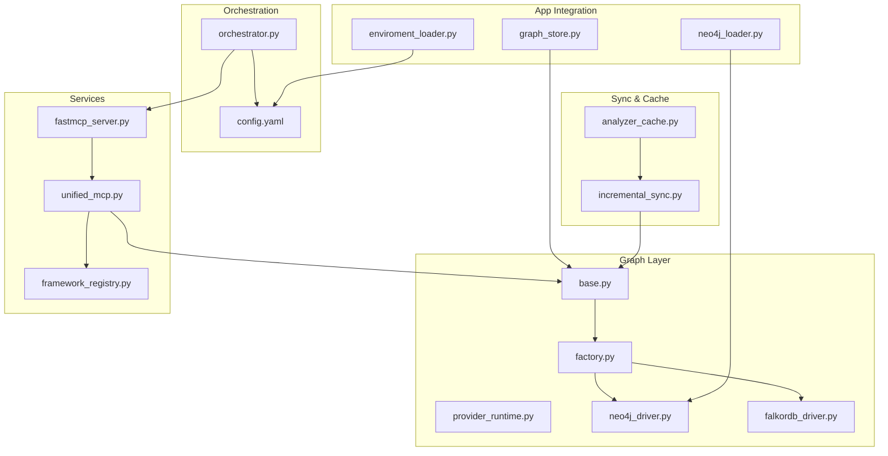
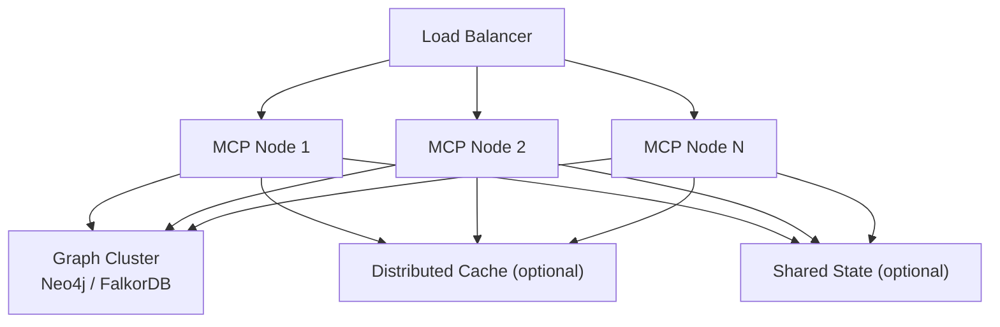
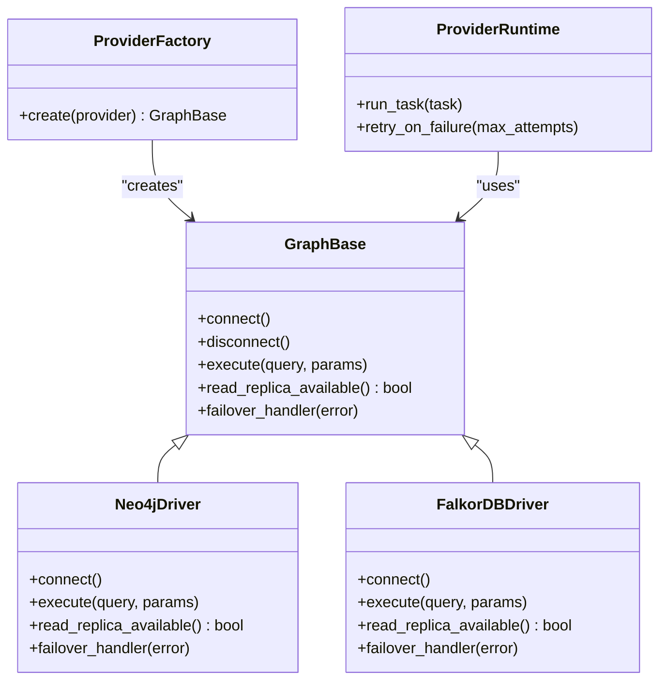
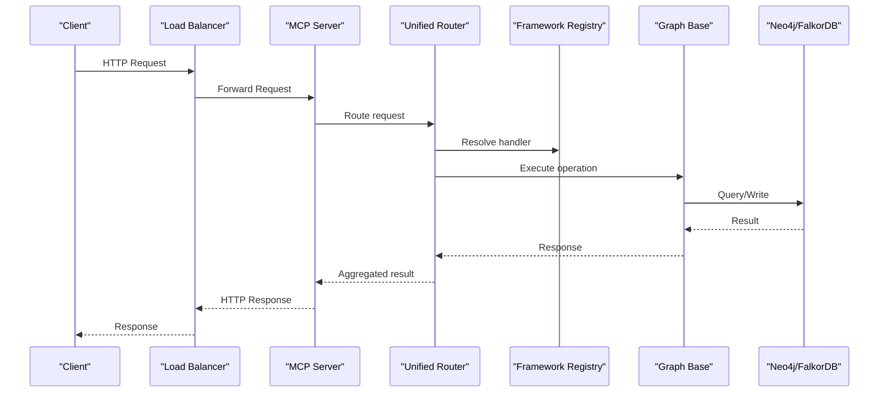
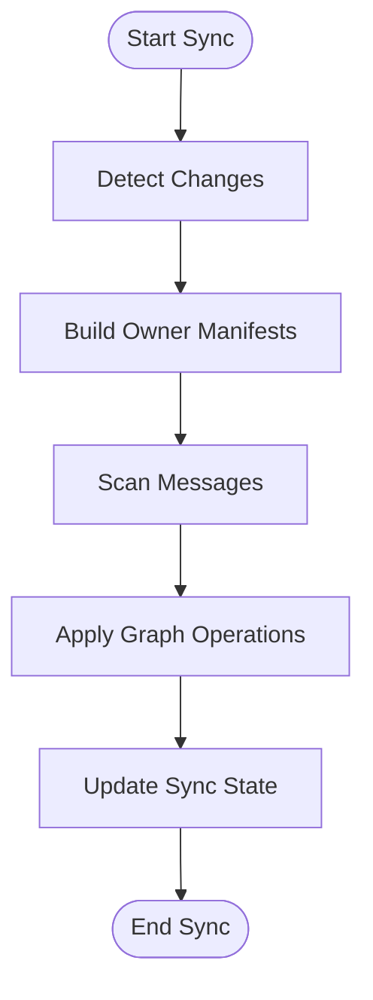
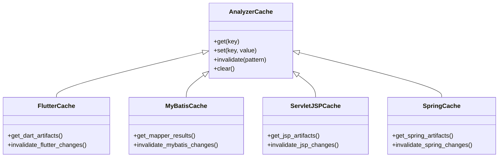
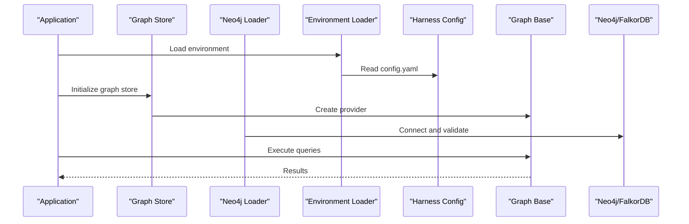
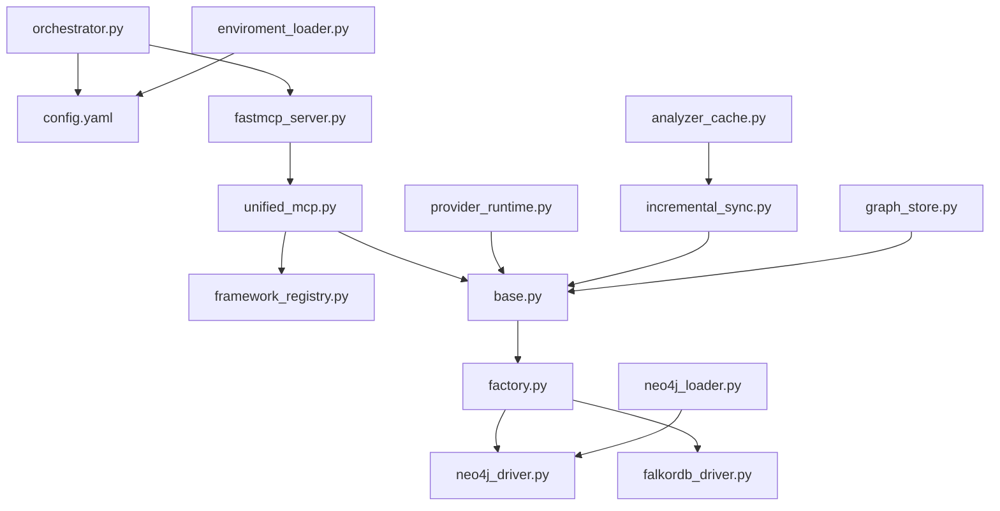

# Scaling & High Availability

<cite>
**Referenced Files in This Document**
- [ReadMe.md](file://ReadMe.md)
- [Makefile](file://Makefile)
- [requirements.txt](file://requirements.txt)
- [pyproject.toml](file://pyproject.toml)
- [cortex_harness/dev.py](file://cortex_harness/dev.py)
- [harness/scripts/orchestrator.py](file://harness/scripts/orchestrator.py)
- [harness/templates/config.yaml](file://harness/templates/config.yaml)
- [code-tiny/graph_store.py](file://code-tiny/graph_store.py)
- [code-tiny/neo4j_loader.py](file://code-tiny/neo4j_loader.py)
- [code-tiny/mcp_graph_rag.py](file://code-tiny/mcp_graph_rag.py)
- [code-tiny/embedding_utils.py](file://code-tiny/embedding_utils.py)
- [code-tiny/model.py](file://code-tiny/model.py)
- [code-tiny/enviroment_loader.py](file://code-tiny/enviroment_loader.py)
- [code-tiny/tools/common/harness_config.py](file://code-tiny/tools/common/harness_config.py)
- [code-tiny/tools/graph/driver/neo4j_driver.py](file://code-tiny/tools/graph/driver/neo4j_driver.py)
- [code-tiny/tools/graph/driver/falkordb_driver.py](file://code-tiny/tools/graph/driver/falkordb_driver.py)
- [code-tiny/tools/graph/core/base.py](file://code-tiny/tools/graph/core/base.py)
- [code-tiny/tools/graph/core/factory.py](file://code-tiny/tools/graph/core/factory.py)
- [code-tiny/tools/graph/core/provider_runtime.py](file://code-tiny/tools/graph/core/provider_runtime.py)
- [code-tiny/tools/graph/core/require_neo4j.py](file://code-tiny/tools/graph/core/require_neo4j.py)
- [code-tiny/tools/sync/incremental_sync.py](file://code-tiny/tools/sync/incremental_sync.py)
- [code-tiny/tools/sync/build_owner_manifests.py](file://code-tiny/tools/sync/build_owner_manifests.py)
- [code-tiny/tools/sync/dead_code_report.py](file://code-tiny/tools/sync/dead_code_report.py)
- [code-tiny/tools/sync/message_scan.py](file://code-tiny/tools/sync/message_scan.py)
- [code-tiny/tools/sync/owner_manifest.py](file://code-tiny/tools/sync/owner_manifest.py)
- [code-tiny/tools/common/analyzer_cache.py](file://code-tiny/tools/common/analyzer_cache.py)
- [code-tiny/tools/flutter/cache.py](file://code-tiny/tools/flutter/cache.py)
- [code-tiny/tools/mybatis/cache.py](file://code-tiny/tools/mybatis/cache.py)
- [code-tiny/tools/servlet_jsp/cache.py](file://code-tiny/tools/servlet_jsp/cache.py)
- [code-tiny/tools/spring/cache.py](file://code-tiny/tools/spring/cache.py)
- [code-tiny/tools/ts/pipeline/backend_pipeline.py](file://code-tiny/tools/ts/pipeline/backend_pipeline.py)
- [code-tiny/tools/ts/pipeline/frontend_pipeline.py](file://code-tiny/tools/ts/pipeline/frontend_pipeline.py)
- [code-tiny/tools/ts/context/analyzer_context.py](file://code-tiny/tools/ts/context/analyzer_context.py)
- [code-tiny/tools/common/query_intent_classifier.py](file://code-tiny/tools/common/query_intent_classifier.py)
- [code-tiny/tools/common/intelligent_retrieval.py](file://code-tiny/tools/common/intelligent_retrieval.py)
- [code-tiny/tools/common/retrieval_scorer.py](file://code-tiny/tools/common/retrieval_scorer.py)
- [code-tiny/tools/common/bm25_ranker.py](file://code-tiny/tools/common/bm25_ranker.py)
- [code-tiny/tools/common/call_graph_builder.py](file://code-tiny/tools/common/call_graph_builder.py)
- [code-tiny/tools/common/graph_expander.py](file://code-tiny/tools/common/graph_expander.py)
- [code-tiny/tools/common/source_inventory.py](file://code-tiny/tools/common/source_inventory.py)
- [code-tiny/tools/common/workflow_classifier.py](file://code-tiny/tools/common/workflow_classifier.py)
- [code-tiny/tools/common/workflow_impact_scorer.py](file://code-tiny/tools/common/workflow_impact_scorer.py)
- [code-tiny/tools/common/api_match_engine.py](file://code-tiny/tools/common/api_match_engine.py)
- [code-tiny/tools/common/confidence_scorer.py](file://code-tiny/tools/common/confidence_scorer.py)
- [code-tiny/tools/common/signal_normalizer.py](file://code-tiny/tools/common/signal_normalizer.py)
- [code-tiny/tools/common/url_normalizer.py](file://code-tiny/tools/common/url_normalizer.py)
- [code-tiny/tools/common/semantic_inference.py](file://code-tiny/tools/common/semantic_inference.py)
- [code-tiny/tools/common/result_packager.py](file://code-tiny/tools/common/result_packager.py)
- [code-tiny/tools/common/incremental_cleanup.py](file://code-tiny/tools/common/incremental_cleanup.py)
- [code-tiny/tools/common/incremental_sync_state.py](file://code-tiny/tools/common/incremental_sync_state.py)
- [code-tiny/tools/common/primary_vector_sync.py](file://code-tiny/tools/common/primary_vector_sync.py)
- [code-tiny/tools/common/message_scan.py](file://code-tiny/tools/common/message_scan.py)
- [code-tiny/tools/common/query_understanding.py](file://code-tiny/tools/common/query_understanding.py)
- [code-tiny/tools/common/react_role_classifier.py](file://code-tiny/tools/common/react_role_classifier.py)
- [code-tiny/tools/common/symbol_service.py](file://code-tiny/tools/common/symbol_service.py)
- [code-tiny/tools/common/explore_service.py](file://code-tiny/tools/common/explore_service.py)
- [code-tiny/tools/common/flow_reconstructor.py](file://code-tiny/tools/common/flow_reconstructor.py)
- [code-tiny/tools/common/workflow_service.py](file://code-tiny/tools/common/workflow_service.py)
- [code-tiny/tools/common/graph_service.py](file://code-tiny/tools/common/graph_service.py)
- [code-tiny/tools/common/impact_service.py](file://code-tiny/tools/common/impact_service.py)
- [code-tiny/tools/unified_mcp.py](file://code-tiny/tools/unified_mcp.py)
- [code-tiny/tools/fastmcp_server.py](file://code-tiny/tools/fastmcp_server.py)
- [code-tiny/tools/framework_registry.py](file://code-tiny/tools/framework_registry.py)
- [code-tiny/tools/semantic_graph_expansion.py](file://code-tiny/tools/semantic_graph_expansion.py)
- [code-tiny/tools/tool_metadata.py](file://code-tiny/tools/tool_metadata.py)
- [code-tiny/tools/android/android_mcp.py](file://code-tiny/tools/android/android_mcp.py)
- [code-tiny/tools/cplus/cplus_mcp.py](file://code-tiny/tools/cplus/cplus_mcp.py)
- [code-tiny/tools/java/java_mcp.py](file://code-tiny/tools/java/java_mcp.py)
- [code-tiny/tools/cobol/cobol_analyzer.py](file://code-tiny/tools/cobol/cobol_analyzer.py)
- [code-tiny/tools/cplus/cplus_analyzer.py](file://code-tiny/tools/cplus/cplus_analyzer.py)
- [code-tiny/tools/csharp/csharp_analyzer.py](file://code-tiny/tools/csharp/csharp_analyzer.py)
- [code-tiny/tools/delphi/delphi_analyzer.py](file://code-tiny/tools/delphi/delphi_analyzer.py)
- [code-tiny/tools/flutter/flutter_analyzer.py](file://code-tiny/tools/flutter/flutter_analyzer.py)
- [code-tiny/tools/go/go_analyzer.py](file://code-tiny/tools/go/go_analyzer.py)
- [code-tiny/tools/java/java_analyzer.py](file://code-tiny/tools/java/java_analyzer.py)
- [code-tiny/tools/js/js_analyzer.py](file://code-tiny/tools/js/js_analyzer.py)
- [code-tiny/tools/kotlin/kotlin_analyzer.py](file://code-tiny/tools/kotlin/kotlin_analyzer.py)
- [code-tiny/tools/perl/perl_analyzer.py](file://code-tiny/tools/perl/perl_analyzer.py)
- [code-tiny/tools/php/php_analyzer.py](file://code-tiny/tools/php/php_analyzer.py)
- [code-tiny/tools/plsql/plsql_analyzer.py](file://code-tiny/tools/plsql/plsql_analyzer.py)
- [code-tiny/tools/python/python_analyzer.py](file://code-tiny/tools/python/python_analyzer.py)
- [code-tiny/tools/rust/rust_analyzer.py](file://code-tiny/tools/rust/rust_analyzer.py)
- [code-tiny/tools/servlet_jsp/servlet_jsp_analyzer.py](file://code-tiny/tools/servlet_jsp/servlet_jsp_analyzer.py)
- [code-tiny/tools/spring/spring_analyzer.py](file://code-tiny/tools/spring/spring_analyzer.py)
- [code-tiny/tools/sql/sql_analyzer.py](file://code-tiny/tools/sql/sql_analyzer.py)
- [code-tiny/tools/struts/struts_analyzer.py](file://code-tiny/tools/struts/struts_analyzer.py)
- [code-tiny/tools/swift/swift_analyzer.py](file://code-tiny/tools/swift/swift_analyzer.py)
- [code-tiny/tools/vb/vb6_analyzer.py](file://code-tiny/tools/vb/vb6_analyzer.py)
- [code-tiny/tools/vb/vb_analyzer_base.py](file://code-tiny/tools/vb/vb_analyzer_base.py)
- [code-tiny/tools/vb/vbnet_analyzer.py](file://code-tiny/tools/vb/vbnet_analyzer.py)
- [code-tiny/tools/vb/vbscript_analyzer.py](file://code-tiny/tools/vb/vbscript_analyzer.py)
- [code-tiny/tools/web_framework/web_framework_analyzer.py](file://code-tiny/tools/web_framework/web_framework_analyzer.py)
- [code-tiny/tools/database_schema/database_schema_analyzer.py](file://code-tiny/tools/database_schema/database_schema_analyzer.py)
- [code-tiny/tools/ts/ts_analyzer.py](file://code-tiny/tools/ts/ts_analyzer.py)
- [code-tiny/tools/ts/ts_backend_analyzer.py](file://code-tiny/tools/ts/ts_backend_analyzer.py)
- [code-tiny/tools/ts/ts_project_detector.py](file://code-tiny/tools/ts/ts_project_detector.py)
- [code-tiny/tools/ts/ts_api_bridge.py](file://code-tiny/tools/ts/ts_api_bridge.py)
- [code-tiny/tools/ts/_refactor_ts_analyzer.py](file://code-tiny/tools/ts/_refactor_ts_analyzer.py)
- [code-tiny/tools/ts/workflow_finder.py](file://code-tiny/tools/ts/workflow_finder.py)
- [code-tiny/tools/ts/types/__init__.py](file://code-tiny/tools/ts/types/__init__.py)
- [code-tiny/tools/ts/types/ast_types.py](file://code-tiny/tools/ts/types/ast_types.py)
- [code-tiny/tools/ts/types/graph_types.py](file://code-tiny/tools/ts/types/graph_types.py)
- [code-tiny/tools/ts/utils/__init__.py](file://code-tiny/tools/ts/utils/__init__.py)
- [code-tiny/tools/ts/utils/file_utils.py](file://code-tiny/tools/ts/utils/file_utils.py)
- [code-tiny/tools/ts/utils/id_utils.py](file://code-tiny/tools/ts/utils/id_utils.py)
- [code-tiny/tools/ts/utils/regex_patterns.py](file://code-tiny/tools/ts/utils/regex_patterns.py)
- [code-tiny/tools/ts/agents/__init__.py](file://code-tiny/tools/ts/agents/__init__.py)
- [code-tiny/tools/ts/agents/api_bridge_agent.py](file://code-tiny/tools/ts/agents/api_bridge_agent.py)
- [code-tiny/tools/ts/agents/backend_agent.py](file://code-tiny/tools/ts/agents/backend_agent.py)
- [code-tiny/tools/ts/agents/dependency_agent.py](file://code-tiny/tools/ts/agents/dependency_agent.py)
- [code-tiny/tools/ts/agents/graph_agent.py](file://code-tiny/tools/ts/agents/graph_agent.py)
- [code-tiny/tools/ts/agents/parser_agent.py](file://code-tiny/tools/ts/agents/parser_agent.py)
- [code-tiny/tools/ts/agents/symbol_agent.py](file://code-tiny/tools/ts/agents/symbol_agent.py)
- [code-tiny/tools/ts/agents/traversal_agent.py](file://code-tiny/tools/ts/agents/traversal_agent.py)
- [code-tiny/tools/ts/pipeline/__init__.py](file://code-tiny/tools/ts/pipeline/__init__.py)
- [code-tiny/tools/ts/__init__.py](file://code-tiny/tools/ts/__init__.py)
- [code-tiny/tools/common/message_detectors/__init__.py](file://code-tiny/tools/common/message_detectors/__init__.py)
- [code-tiny/tools/common/message_detectors/android.py](file://code-tiny/tools/common/message_detectors/android.py)
- [code-tiny/tools/common/message_detectors/base.py](file://code-tiny/tools/common/message_detectors/base.py)
- [code-tiny/tools/common/message_detectors/cplus.py](file://code-tiny/tools/common/message_detectors/cplus.py)
- [code-tiny/tools/common/message_detectors/csharp.py](file://code-tiny/tools/common/message_detectors/csharp.py)
- [code-tiny/tools/common/message_detectors/delphi.py](file://code-tiny/tools/common/message_detectors/delphi.py)
- [code-tiny/tools/common/message_detectors/java.py](file://code-tiny/tools/common/message_detectors/java.py)
- [code-tiny/tools/common/message_detectors/js.py](file://code-tiny/tools/common/message_detectors/js.py)
- [code-tiny/tools/common/message_detectors/kotlin.py](file://code-tiny/tools/common/message_detectors/kotlin.py)
- [code-tiny/tools/common/message_detectors/php.py](file://code-tiny/tools/common/message_detectors/php.py)
- [code-tiny/tools/common/message_detectors/plsql.py](file://code-tiny/tools/common/message_detectors/plsql.py)
- [code-tiny/tools/common/message_detectors/sql.py](file://code-tiny/tools/common/message_detectors/sql.py)
- [code-tiny/tools/common/message_detectors/ts.py](file://code-tiny/tools/common/message_detectors/ts.py)
- [code-tiny/tools/common/message_detectors/vb6.py](file://code-tiny/tools/common/message_detectors/vb6.py)
- [code-tiny/tools/common/message_detectors/vba.py](file://code-tiny/tools/common/message_detectors/vba.py)
- [code-tiny/tools/common/message_detectors/vbnet.py](file://code-tiny/tools/common/message_detectors/vbnet.py)
- [code-tiny/tools/common/message_detectors/vbscript.py](file://code-tiny/tools/common/message_detectors/vbscript.py)
- [code-tiny/tools/cobol/lib/__init__.py](file://code-tiny/tools/cobol/lib/__init__.py)
- [code-tiny/tools/cobol/cfg.py](file://code-tiny/tools/cobol/cfg.py)
- [code-tiny/tools/cobol/models.py](file://code-tiny/tools/cobol/models.py)
- [code-tiny/tools/cobol/parser.py](file://code-tiny/tools/cobol/parser.py)
- [code-tiny/tools/cobol/parser_runtime.py](file://code-tiny/tools/cobol/parser_runtime.py)
- [code-tiny/tools/cobol/qdrant.py](file://code-tiny/tools/cobol/qdrant.py)
- [code-tiny/tools/cobol/resolver.py](file://code-tiny/tools/cobol/resolver.py)
- [code-tiny/tools/cobol/semantics.py](file://code-tiny/tools/cobol/semantics.py)
- [code-tiny/tools/cplus/bootstrap_compile_commands.py](file://code-tiny/tools/cplus/bootstrap_compile_commands.py)
- [code-tiny/tools/cplus/clang_parser.py](file://code-tiny/tools/cplus/clang_parser.py)
- [code-tiny/tools/cplus/rc_parser.py](file://code-tiny/tools/cplus/rc_parser.py)
- [code-tiny/tools/cplus/windows_resource_parser.py](file://code-tiny/tools/cplus/windows_resource_parser.py)
- [code-tiny/tools/database_schema/__init__.py](file://code-tiny/tools/database_schema/__init__.py)
- [code-tiny/tools/database_schema/models.py](file://code-tiny/tools/database_schema/models.py)
- [code-tiny/tools/database_schema/pipeline.py](file://code-tiny/tools/database_schema/pipeline.py)
- [code-tiny/tools/flutter/detector.py](file://code-tiny/tools/flutter/detector.py)
- [code-tiny/tools/flutter/models.py](file://code-tiny/tools/flutter/models.py)
- [code-tiny/tools/flutter/normalizer.py](file://code-tiny/tools/flutter/normalizer.py)
- [code-tiny/tools/flutter/pipeline.py](file://code-tiny/tools/flutter/pipeline.py)
- [code-tiny/tools/flutter/protocol.py](file://code-tiny/tools/flutter/protocol.py)
- [code-tiny/tools/mybatis/annotation_mapper.py](file://code-tiny/tools/mybatis/annotation_mapper.py)
- [code-tiny/tools/mybatis/detector.py](file://code-tiny/tools/mybatis/detector.py)
- [code-tiny/tools/mybatis/dynamic_sql.py](file://code-tiny/tools/mybatis/dynamic_sql.py)
- [code-tiny/tools/mybatis/mapper_interface_analyzer.py](file://code-tiny/tools/mybatis/mapper_interface_analyzer.py)
- [code-tiny/tools/mybatis/mapper_xml_analyzer.py](file://code-tiny/tools/mybatis/mapper_xml_analyzer.py)
- [code-tiny/tools/mybatis/models.py](file://code-tiny/tools/mybatis/models.py)
- [code-tiny/tools/mybatis/parser_runtime.py](file://code-tiny/tools/mybatis/parser_runtime.py)
- [code-tiny/tools/mybatis/pipeline.py](file://code-tiny/tools/mybatis/pipeline.py)
- [code-tiny/tools/mybatis/resolver.py](file://code-tiny/tools/mybatis/resolver.py)
- [code-tiny/tools/mybatis/spring_bridge.py](file://code-tiny/tools/mybatis/spring_bridge.py)
- [code-tiny/tools/mybatis/sql_semantic_analyzer.py](file://code-tiny/tools/mybatis/sql_semantic_analyzer.py)
- [code-tiny/tools/servlet_jsp/el_parser.py](file://code-tiny/tools/servlet_jsp/el_parser.py)
- [code-tiny/tools/servlet_jsp/java_identity.py](file://code-tiny/tools/servlet_jsp/java_identity.py)
- [code-tiny/tools/servlet_jsp/java_semantics.py](file://code-tiny/tools/servlet_jsp/java_semantics.py)
- [code-tiny/tools/servlet_jsp/jsp_parser.py](file://code-tiny/tools/servlet_jsp/jsp_parser.py)
- [code-tiny/tools/servlet_jsp/path_resolver.py](file://code-tiny/tools/servlet_jsp/path_resolver.py)
- [code-tiny/tools/servlet_jsp/properties_parser.py](file://code-tiny/tools/servlet_jsp/properties_parser.py)
- [code-tiny/tools/servlet_jsp/resolver.py](file://code-tiny/tools/servlet_jsp/resolver.py)
- [code-tiny/tools/servlet_jsp/web_xml_parser.py](file://code-tiny/tools/servlet_jsp/web_xml_parser.py)
- [code-tiny/tools/spring/adapters.py](file://code-tiny/tools/spring/adapters.py)
- [code-tiny/tools/spring/annotation_catalog.py](file://code-tiny/tools/spring/annotation_catalog.py)
- [code-tiny/tools/spring/config.py](file://code-tiny/tools/spring/config.py)
- [code-tiny/tools/spring/detector.py](file://code-tiny/tools/spring/detector.py)
- [code-tiny/tools/spring/models.py](file://code-tiny/tools/spring/models.py)
- [code-tiny/tools/spring/pipeline.py](file://code-tiny/tools/spring/pipeline.py)
- [code-tiny/tools/spring/source_scanner.py](file://code-tiny/tools/spring/source_scanner.py)
- [code-tiny/tools/spring/spring_java_analyzer.py](file://code-tiny/tools/spring/spring_java_analyzer.py)
- [code-tiny/tools/spring/spring_kotlin_analyzer.py](file://code-tiny/tools/spring/spring_kotlin_analyzer.py)
- [code-tiny/tools/spring/spring_mixed_analyzer.py](file://code-tiny/tools/spring/spring_mixed_analyzer.py)
- [code-tiny/tools/spring/value_resolver.py](file://code-tiny/tools/spring/value_resolver.py)
- [code-tiny/tools/struts/README.md](file://code-tiny/tools/struts/README.md)
- [code-tiny/tools/struts/__init__.py](file://code-tiny/tools/struts/__init__.py)
- [code-tiny/tools/struts/java_validation.py](file://code-tiny/tools/struts/java_validation.py)
- [code-tiny/tools/struts/models.py](file://code-tiny/tools/struts/models.py)
- [code-tiny/tools/struts/pipeline.py](file://code-tiny/tools/struts/pipeline.py)
- [code-tiny/tools/struts/resolver.py](file://code-tiny/tools/struts/resolver.py)
- [code-tiny/tools/struts/struts_xml_parser.py](file://code-tiny/tools/struts/struts_xml_parser.py)
- [code-tiny/tools/struts/validation_parser.py](file://code-tiny/tools/struts/validation_parser.py)
- [code-tiny/tools/struts/web_xml_parser.py](file://code-tiny/tools/struts/web_xml_parser.py)
- [code-tiny/tools/struts/xml_utils.py](file://code-tiny/tools/struts/xml_utils.py)
- [code-tiny/tools/web_framework/__init__.py](file://code-tiny/tools/web_framework/__init__.py)
- [code-tiny/tools/web_framework/models.py](file://code-tiny/tools/web_framework/models.py)
- [code-tiny/tools/web_framework/pipeline.py](file://code-tiny/tools/tools/web_framework/pipeline.py)
- [code-tiny/tools/graph/operations/__init__.py](file://code-tiny/tools/graph/operations/__init__.py)
- [code-tiny/tools/graph/operations/class_ops.py](file://code-tiny/tools/graph/operations/class_ops.py)
- [code-tiny/tools/graph/operations/cross_edge_ops.py](file://code-tiny/tools/graph/operations/cross_edge_ops.py)
- [code-tiny/tools/graph/operations/document_ops.py](file://code-tiny/tools/graph/operations/document_ops.py)
- [code-tiny/tools/graph/operations/flow_ops.py](file://code-tiny/tools/graph/operations/flow_ops.py)
- [code-tiny/tools/graph/operations/function_ops.py](file://code-tiny/tools/graph/operations/function_ops.py)
- [code-tiny/tools/graph/operations/infra_ops.py](file://code-tiny/tools/graph/operations/infra_ops.py)
- [code-tiny/tools/graph/operations/namespace_ops.py](file://code-tiny/tools/graph/operations/namespace_ops.py)
- [code-tiny/tools/graph/operations/package_ops.py](file://code-tiny/tools/graph/operations/package_ops.py)
- [code-tiny/tools/graph/operations/type_ops.py](file://code-tiny/tools/graph/operations/type_ops.py)
- [code-tiny/tools/graph/writer/aspnet_writer.py](file://code-tiny/tools/graph/writer/aspnet_writer.py)
- [code-tiny/tools/graph/writer/database_schema_writer.py](file://code-tiny/tools/graph/writer/database_schema_writer.py)
- [code-tiny/tools/graph/writer/language_writer.py](file://code-tiny/tools/graph/writer/language_writer.py)
- [code-tiny/tools/graph/writer/mybatis_writer.py](file://code-tiny/tools/graph/writer/mybatis_writer.py)
- [code-tiny/tools/graph/writer/servlet_jsp_writer.py](file://code-tiny/tools/graph/writer/servlet_jsp_writer.py)
- [code-tiny/tools/graph/writer/spring_writer.py](file://code-tiny/tools/graph/writer/spring_writer.py)
- [code-tiny/tools/graph/writer/web_framework_writer.py](file://code-tiny/tools/tools/graph/writer/web_framework_writer.py)
- [code-tiny/tools/graph/cli.py](file://code-tiny/tools/graph/cli.py)
- [code-tiny/tools/graph/STRUCTURE.md](file://code-tiny/tools/graph/STRUCTURE.md)
- [code-tiny/tools/graph/__init__.py](file://code-tiny/tools/graph/__init__.py)
- [code-tiny/tools/graph/docs/IMPLEMENTATION_SUMMARY.md](file://code-tiny/tools/graph/docs/IMPLEMENTATION_SUMMARY.md)
- [code-tiny/tools/graph/docs/MIGRATION_EXAMPLE.md](file://code-tiny/tools/graph/docs/MIGRATION_EXAMPLE.md)
- [code-tiny/tools/graph/docs/MIGRATION_GUIDE.py](file://code-tiny/tools/graph/docs/MIGRATION_GUIDE.py)
- [code-tiny/tools/graph/docs/QUERY_BUILDER_SOLUTION.md](file://code-tiny/tools/graph/docs/QUERY_BUILDER_SOLUTION.md)
- [code-tiny/tools/graph/docs/QUERY_METHODS.md](file://code-tiny/tools/graph/docs/QUERY_METHODS.md)
- [code-tiny/tools/graph/docs/QUICK_REFERENCE.md](file://code-tiny/tools/graph/docs/QUICK_REFERENCE.md)
- [code-tiny/tools/graph/docs/README.md](file://code-tiny/tools/graph/docs/README.md)
- [code-tiny/tools/graph/examples/example_usage.py](file://code-tiny/tools/graph/examples/example_usage.py)
- [code-tiny/tools/common/CLAUDE.md](file://code-tiny/tools/common/CLAUDE.md)
- [code-tiny/tools/cobol/README.md](file://code-tiny/tools/cobol/README.md)
- [code-tiny/tools/csharp/CLAUDE.md](file://code-tiny/tools/csharp/CLAUDE.md)
- [code-tiny/tools/delphi/README.md](file://code-tiny/tools/delphi/README.md)
- [code-tiny/tools/flutter/README.md](file://code-tiny/tools/flutter/README.md)
- [code-tiny/tools/go/README.md](file://code-tiny/tools/go/README.md)
- [code-tiny/tools/java/CLAUDE.md](file://code-tiny/tools/java/CLAUDE.md)
- [code-tiny/tools/js/CLAUDE.md](file://code-tiny/tools/js/CLAUDE.md)
- [code-tiny/tools/kotlin/CLAUDE.md](file://code-tiny/tools/kotlin/CLAUDE.md)
- [code-tiny/tools/perl/README.md](file://code-tiny/tools/perl/README.md)
- [code-tiny/tools/php/README.md](file://code-tiny/tools/php/README.md)
- [code-tiny/tools/plsql/README.md](file://code-tiny/tools/plsql/README.md)
- [code-tiny/tools/python/CLAUDE.md](file://code-tiny/tools/python/CLAUDE.md)
- [code-tiny/tools/rust/README.md](file://code-tiny/tools/rust/README.md)
- [code-tiny/tools/servlet_jsp/README.md](file://code-tiny/tools/servlet_jsp/README.md)
- [code-tiny/tools/spring/CLAUDE.md](file://code-tiny/tools/spring/CLAUDE.md)
- [code-tiny/tools/sql/README.md](file://code-tiny/tools/sql/README.md)
- [code-tiny/tools/struts/README.md](file://code-tiny/tools/struts/README.md)
- [code-tiny/tools/swift/README.md](file://code-tiny/tools/swift/README.md)
- [code-tiny/tools/vb/README.md](file://code-tiny/tools/vb/README.md)
- [code-tiny/tools/web_framework/README.md](file://code-tiny/tools/web_framework/README.md)
- [code-tiny/tools/database_schema/README.md](file://code-tiny/tools/database_schema/README.md)
- [code-tiny/tools/ts/CLAUDE.md](file://code-tiny/tools/ts/CLAUDE.md)
- [code-tiny/tools/ts/Readme.md](file://code-tiny/tools/ts/Readme.md)
- [code-tiny/tools/unified_mcp.py](file://code-tiny/tools/unified_mcp.py)
- [code-tiny/tools/fastmcp_server.py](file://code-tiny/tools/fastmcp_server.py)
- [code-tiny/tools/framework_registry.py](file://code-tiny/tools/framework_registry.py)
- [code-tiny/tools/semantic_graph_expansion.py](file://code-tiny/tools/semantic_graph_expansion.py)
- [code-tiny/tools/tool_metadata.py](file://code-tiny/tools/tool_metadata.py)
- [code-tiny/tools/android/android_mcp.py](file://code-tiny/tools/android/android_mcp.py)
- [code-tiny/tools/cplus/cplus_mcp.py](file://code-tiny/tools/cplus/cplus_mcp.py)
- [code-tiny/tools/java/java_mcp.py](file://code-tiny/tools/java/java_mcp.py)
- [code-tiny/tools/cobol/cobol_analyzer.py](file://code-tiny/tools/cobol/cobol_analyzer.py)
- [code-tiny/tools/cplus/cplus_analyzer.py](file://code-tiny/tools/cplus/cplus_analyzer.py)
- [code-tiny/tools/csharp/csharp_analyzer.py](file://code-tiny/tools/csharp/csharp_analyzer.py)
- [code-tiny/tools/delphi/delphi_analyzer.py](file://code-tiny/tools/delphi/delphi_analyzer.py)
- [code-tiny/tools/flutter/flutter_analyzer.py](file://code-tiny/tools/flutter/flutter_analyzer.py)
- [code-tiny/tools/go/go_analyzer.py](file://code-tiny/tools/go/go_analyzer.py)
- [code-tiny/tools/java/java_analyzer.py](file://code-tiny/tools/java/java_analyzer.py)
- [code-tiny/tools/js/js_analyzer.py](file://code-tiny/tools/js/js_analyzer.py)
- [code-tiny/tools/kotlin/kotlin_analyzer.py](file://code-tiny/tools/kotlin/kotlin_analyzer.py)
- [code-tiny/tools/perl/perl_analyzer.py](file://code-tiny/tools/perl/perl_analyzer.py)
- [code-tiny/tools/php/php_analyzer.py](file://code-tiny/tools/php/php_analyzer.py)
- [code-tiny/tools/plsql/plsql_analyzer.py](file://code-tiny/tools/plsql/plsql_analyzer.py)
- [code-tiny/tools/python/python_analyzer.py](file://code-tiny/tools/python/python_analyzer.py)
- [code-tiny/tools/rust/rust_analyzer.py](file://code-tiny/tools/rust/rust_analyzer.py)
- [code-tiny/tools/servlet_jsp/servlet_jsp_analyzer.py](file://code-tiny/tools/servlet_jsp/servlet_jsp_analyzer.py)
- [code-tiny/tools/spring/spring_analyzer.py](file://code-tiny/tools/spring/spring_analyzer.py)
- [code-tiny/tools/sql/sql_analyzer.py](file://code-tiny/tools/sql/sql_analyzer.py)
- [code-tiny/tools/struts/struts_analyzer.py](file://code-tiny/tools/struts/struts_analyzer.py)
- [code-tiny/tools/swift/swift_analyzer.py](file://code-tiny/tools/swift/swift_analyzer.py)
- [code-tiny/tools/vb/vb6_analyzer.py](file://code-tiny/tools/vb/vb6_analyzer.py)
- [code-tiny/tools/vb/vb_analyzer_base.py](file://code-tiny/tools/vb/vb_analyzer_base.py)
- [code-tiny/tools/vb/vbnet_analyzer.py](file://code-tiny/tools/vb/vbnet_analyzer.py)
- [code-tiny/tools/vb/vbscript_analyzer.py](file://code-tiny/tools/vb/vbscript_analyzer.py)
- [code-tiny/tools/web_framework/web_framework_analyzer.py](file://code-tiny/tools/web_framework/web_framework_analyzer.py)
- [code-tiny/tools/database_schema/database_schema_analyzer.py](file://code-tiny/tools/database_schema/database_schema_analyzer.py)
- [code-tiny/tools/ts/ts_analyzer.py](file://code-tiny/tools/ts/ts_analyzer.py)
- [code-tiny/tools/ts/ts_backend_analyzer.py](file://code-tiny/tools/ts/ts_backend_analyzer.py)
- [code-tiny/tools/ts/ts_project_detector.py](file://code-tiny/tools/ts/ts_project_detector.py)
- [code-tiny/tools/ts/ts_api_bridge.py](file://code-tiny/tools/ts/ts_api_bridge.py)
- [code-tiny/tools/ts/_refactor_ts_analyzer.py](file://code-tiny/tools/ts/_refactor_ts_analyzer.py)
- [code-tiny/tools/ts/workflow_finder.py](file://code-tiny/tools/ts/workflow_finder.py)
- [code-tiny/tools/ts/types/__init__.py](file://code-tiny/tools/ts/types/__init__.py)
- [code-tiny/tools/ts/types/ast_types.py](file://code-tiny/tools/ts/types/ast_types.py)
- [code-tiny/tools/ts/types/graph_types.py](file://code-tiny/tools/ts/types/graph_types.py)
- [code-tiny/tools/ts/utils/__init__.py](file://code-tiny/tools/ts/utils/__init__.py)
- [code-tiny/tools/ts/utils/file_utils.py](file://code-tiny/tools/ts/utils/file_utils.py)
- [code-tiny/tools/ts/utils/id_utils.py](file://code-tiny/tools/ts/utils/id_utils.py)
- [code-tiny/tools/ts/utils/regex_patterns.py](file://code-tiny/tools/ts/utils/utils/regex_patterns.py)
- [code-tiny/tools/ts/agents/__init__.py](file://code-tiny/tools/ts/agents/__init__.py)
- [code-tiny/tools/ts/agents/api_bridge_agent.py](file://code-tiny/tools/ts/agents/api_bridge_agent.py)
- [code-tiny/tools/ts/agents/backend_agent.py](file://code-tiny/tools/ts/agents/backend_agent.py)
- [code-tiny/tools/ts/agents/dependency_agent.py](file://code-tiny/tools/ts/agents/dependency_agent.py)
- [code-tiny/tools/ts/agents/graph_agent.py](file://code-tiny/tools/ts/agents/graph_agent.py)
- [code-tiny/tools/ts/agents/parser_agent.py](file://code-tiny/tools/ts/agents/parser_agent.py)
- [code-tiny/tools/ts/agents/symbol_agent.py](file://code-tiny/tools/ts/agents/symbol_agent.py)
- [code-tiny/tools/ts/agents/traversal_agent.py](file://code-tiny/tools/ts/agents/traversal_agent.py)
- [code-tiny/tools/ts/pipeline/__init__.py](file://code-tiny/tools/ts/pipeline/__init__.py)
- [code-tiny/tools/ts/__init__.py](file://code-tiny/tools/ts/__init__.py)
- [code-tiny/tools/common/message_detectors/__init__.py](file://code-tiny/tools/common/message_detectors/__init__.py)
- [code-tiny/tools/common/message_detectors/android.py](file://code-tiny/tools/common/message_detectors/android.py)
- [code-tiny/tools/common/message_detectors/base.py](file://code-tiny/tools/common/message_detectors/base.py)
- [code-tiny/tools/common/message_detectors/cplus.py](file://code-tiny/tools/common/message_detectors/cplus.py)
- [code-tiny/tools/common/message_detectors/csharp.py](file://code-tiny/tools/common/message_detectors/csharp.py)
- [code-tiny/tools/common/message_detectors/delphi.py](file://code-tiny/tools/common/message_detectors/delphi.py)
- [code-tiny/tools/common/message_detectors/java.py](file://code-tiny/tools/common/message_detectors/java.py)
- [code-tiny/tools/common/message_detectors/js.py](file://code-tiny/tools/common/message_detectors/js.py)
- [code-tiny/tools/common/message_detectors/kotlin.py](file://code-tiny/tools/common/message_detectors/kotlin.py)
- [code-tiny/tools/common/message_detectors/php.py](file://code-tiny/tools/common/message_detectors/php.py)
- [code-tiny/tools/common/message_detectors/plsql.py](file://code-tiny/tools/common/message_detectors/plsql.py)
- [code-tiny/tools/common/message_detectors/sql.py](file://code-tiny/tools/common/message_detectors/sql.py)
- [code-tiny/tools/common/message_detectors/ts.py](file://code-tiny/tools/common/message_detectors/ts.py)
- [code-tiny/tools/common/message_detectors/vb6.py](file://code-tiny/tools/common/message_detectors/vb6.py)
- [code-tiny/tools/common/message_detectors/vba.py](file://code-tiny/tools/common/message_detectors/vba.py)
- [code-tiny/tools/common/message_detectors/vbnet.py](file://code-tiny/tools/common/message_detectors/vbnet.py)
- [code-tiny/tools/common/message_detectors/vbscript.py](file://code-tiny/tools/common/message_detectors/vbscript.py)
- [code-tiny/tools/cobol/lib/__init__.py](file://code-tiny/tools/cobol/lib/__init__.py)
- [code-tiny/tools/cobol/cfg.py](file://code-tiny/tools/cobol/cfg.py)
- [code-tiny/tools/cobol/models.py](file://code-tiny/tools/cobol/models.py)
- [code-tiny/tools/cobol/parser.py](file://code-tiny/tools/cobol/parser.py)
- [code-tiny/tools/cobol/parser_runtime.py](file://code-tiny/tools/cobol/parser_runtime.py)
- [code-tiny/tools/cobol/qdrant.py](file://code-tiny/tools/cobol/qdrant.py)
- [code-tiny/tools/cobol/resolver.py](file://code-tiny/tools/cobol/resolver.py)
- [code-tiny/tools/cobol/semantics.py](file://code-tiny/tools/cobol/semantics.py)
- [code-tiny/tools/cplus/bootstrap_compile_commands.py](file://code-tiny/tools/cplus/bootstrap_compile_commands.py)
- [code-tiny/tools/cplus/clang_parser.py](file://code-tiny/tools/cplus/clang_parser.py)
- [code-tiny/tools/cplus/rc_parser.py](file://code-tiny/tools/cplus/rc_parser.py)
- [code-tiny/tools/cplus/windows_resource_parser.py](file://code-tiny/tools/cplus/windows_resource_parser.py)
- [code-tiny/tools/database_schema/__init__.py](file://code-tiny/tools/database_schema/__init__.py)
- [code-tiny/tools/database_schema/models.py](file://code-tiny/tools/database_schema/models.py)
- [code-tiny/tools/database_schema/pipeline.py](file://code-tiny/tools/database_schema/pipeline.py)
- [code-tiny/tools/flutter/detector.py](file://code-tiny/tools/flutter/detector.py)
- [code-tiny/tools/flutter/models.py](file://code-tiny/tools/flutter/models.py)
- [code-tiny/tools/flutter/normalizer.py](file://code-tiny/tools/flutter/normalizer.py)
- [code-tiny/tools/flutter/pipeline.py](file://code-tiny/tools/flutter/pipeline.py)
- [code-tiny/tools/flutter/protocol.py](file://code-tiny/tools/flutter/protocol.py)
- [code-tiny/tools/mybatis/annotation_mapper.py](file://code-tiny/tools/mybatis/annotation_mapper.py)
- [code-tiny/tools/mybatis/detector.py](file://code-tiny/tools/mybatis/detector.py)
- [code-tiny/tools/mybatis/dynamic_sql.py](file://code-tiny/tools/mybatis/dynamic_sql.py)
- [code-tiny/tools/mybatis/mapper_interface_analyzer.py](file://code-tiny/tools/mybatis/mapper_interface_analyzer.py)
- [code-tiny/tools/mybatis/mapper_xml_analyzer.py](file://code-tiny/tools/mybatis/mapper_xml_analyzer.py)
- [code-tiny/tools/mybatis/models.py](file://code-tiny/tools/mybatis/models.py)
- [code-tiny/tools/mybatis/parser_runtime.py](file://code-tiny/tools/mybatis/parser_runtime.py)
- [code-tiny/tools/mybatis/pipeline.py](file://code-tiny/tools/mybatis/pipeline.py)
- [code-tiny/tools/mybatis/resolver.py](file://code-tiny/tools/mybatis/resolver.py)
- [code-tiny/tools/mybatis/spring_bridge.py](file://code-tiny/tools/mybatis/spring_bridge.py)
- [code-tiny/tools/mybatis/sql_semantic_analyzer.py](file://code-tiny/tools/mybatis/sql_semantic_analyzer.py)
- [code-tiny/tools/servlet_jsp/el_parser.py](file://code-tiny/tools/servlet_jsp/el_parser.py)
- [code-tiny/tools/servlet_jsp/java_identity.py](file://code-tiny/tools/servlet_jsp/java_identity.py)
- [code-tiny/tools/servlet_jsp/java_semantics.py](file://code-tiny/tools/servlet_jsp/java_semantics.py)
- [code-tiny/tools/servlet_jsp/jsp_parser.py](file://code-tiny/tools/servlet_jsp/jsp_parser.py)
- [code-tiny/tools/servlet_jsp/path_resolver.py](file://code-tiny/tools/servlet_jsp/path_resolver.py)
- [code-tiny/tools/servlet_jsp/properties_parser.py](file://code-tiny/tools/servlet_jsp/properties_parser.py)
- [code-tiny/tools/servlet_jsp/resolver.py](file://code-tiny/tools/servlet_jsp/resolver.py)
- [code-tiny/tools/servlet_jsp/web_xml_parser.py](file://code-tiny/tools/servlet_jsp/web_xml_parser.py)
- [code-tiny/tools/spring/adapters.py](file://code-tiny/tools/spring/adapters.py)
- [code-tiny/tools/spring/annotation_catalog.py](file://code-tiny/tools/spring/annotation_catalog.py)
- [code-tiny/tools/spring/config.py](file://code-tiny/tools/spring/config.py)
- [code-tiny/tools/spring/detector.py](file://code-tiny/tools/spring/detector.py)
- [code-tiny/tools/spring/models.py](file://code-tiny/tools/spring/models.py)
- [code-tiny/tools/spring/pipeline.py](file://code-tiny/tools/spring/pipeline.py)
- [code-tiny/tools/spring/source_scanner.py](file://code-tiny/tools/spring/source_scanner.py)
- [code-tiny/tools/spring/spring_java_analyzer.py](file://code-tiny/tools/spring/spring_java_analyzer.py)
- [code-tiny/tools/spring/spring_kotlin_analyzer.py](file://code-tiny/tools/spring/spring_kotlin_analyzer.py)
- [code-tiny/tools/spring/spring_mixed_analyzer.py](file://code-tiny/tools/spring/spring_mixed_analyzer.py)
- [code-tiny/tools/spring/value_resolver.py](file://code-tiny/tools/spring/value_resolver.py)
- [code-tiny/tools/struts/README.md](file://code-tiny/tools/struts/README.md)
- [code-tiny/tools/struts/__init__.py](file://code-tiny/tools/struts/__init__.py)
- [code-tiny/tools/struts/java_validation.py](file://code-tiny/tools/struts/java_validation.py)
- [code-tiny/tools/struts/models.py](file://code-tiny/tools/struts/models.py)
- [code-tiny/tools/struts/pipeline.py](file://code-tiny/tools/struts/pipeline.py)
- [code-tiny/tools/struts/resolver.py](file://code-tiny/tools/struts/resolver.py)
- [code-tiny/tools/struts/struts_xml_parser.py](file://code-tiny/tools/struts/struts_xml_parser.py)
- [code-tiny/tools/struts/validation_parser.py](file://code-tiny/tools/struts/validation_parser.py)
- [code-tiny/tools/struts/web_xml_parser.py](file://code-tiny/tools/struts/web_xml_parser.py)
- [code-tiny/tools/struts/xml_utils.py](file://code-tiny/tools/struts/xml_utils.py)
- [code-tiny/tools/web_framework/__init__.py](file://code-tiny/tools/web_framework/__init__.py)
- [code-tiny/tools/web_framework/models.py](file://code-tiny/tools/web_framework/models.py)
- [code-tiny/tools/web_framework/pipeline.py](file://code-tiny/tools/web_framework/pipeline.py)
- [code-tiny/tools/graph/operations/__init__.py](file://code-tiny/tools/graph/operations/__init__.py)
- [code-tiny/tools/graph/operations/class_ops.py](file://code-tiny/tools/graph/operations class_ops.py)
- [code-tiny/tools/graph/operations/cross_edge_ops.py](file://code-tiny/tools/graph/operations/cross_edge_ops.py)
- [code-tiny/tools/graph/operations/document_ops.py](file://code-tiny/tools/graph/operations/document_ops.py)
- [code-tiny/tools/graph/operations/flow_ops.py](file://code-tiny/tools/graph/operations/flow_ops.py)
- [code-tiny/tools/graph/operations/function_ops.py](file://code-tiny/tools/graph/operations/function_ops.py)
- [code-tiny/tools/graph/operations/infra_ops.py](file://code-tiny/tools/graph/operations/infra_ops.py)
- [code-tiny/tools/graph/operations/namespace_ops.py](file://code-tiny/tools/graph/operations/namespace_ops.py)
- [code-tiny/tools/graph/operations/package_ops.py](file://code-tiny/tools/graph/operations/package_ops.py)
- [code-tiny/tools/graph/operations/type_ops.py](file://code-tiny/tools/graph/operations/type_ops.py)
- [code-tiny/tools/graph/writer/aspnet_writer.py](file://code-tiny/tools/graph/writer/aspnet_writer.py)
- [code-tiny/tools/graph/writer/database_schema_writer.py](file://code-tiny/tools/graph/writer/database_schema_writer.py)
- [code-tiny/tools/graph/writer/language_writer.py](file://code-tiny/tools/graph/writer/language_writer.py)
- [code-tiny/tools/graph/writer/mybatis_writer.py](file://code-tiny/tools/graph/writer/mybatis_writer.py)
- [code-tiny/tools/graph/writer/servlet_jsp_writer.py](file://code-tiny/tools/graph/writer/servlet_jsp_writer.py)
- [code-tiny/tools/graph/writer/spring_writer.py](file://code-tiny/tools/graph/writer/spring_writer.py)
- [code-tiny/tools/graph/writer/web_framework_writer.py](file://code-tiny/tools/graph/writer/web_framework_writer.py)
- [code-tiny/tools/graph/cli.py](file://code-tiny/tools/graph/cli.py)
- [code-tiny/tools/graph/STRUCTURE.md](file://code-tiny/tools/graph/STRUCTURE.md)
- [code-tiny/tools/graph/__init__.py](file://code-tiny/tools/graph/__init__.py)
- [code-tiny/tools/graph/docs/IMPLEMENTATION_SUMMARY.md](file://code-tiny/tools/graph/docs/IMPLEMENTATION_SUMMARY.md)
- [code-tiny/tools/graph/docs/MIGRATION_EXAMPLE.md](file://code-tiny/tools/graph/docs/MIGRATION_EXAMPLE.md)
- [code-tiny/tools/graph/docs/MIGRATION_GUIDE.py](file://code-tiny/tools/graph/docs/MIGRATION_GUIDE.py)
- [code-tiny/tools/graph/docs/QUERY_BUILDER_SOLUTION.md](file://code-tiny/tools/graph/docs/QUERY_BUILDER_SOLUTION.md)
- [code-tiny/tools/graph/docs/QUERY_METHODS.md](file://code-tiny/tools/graph/docs/QUERY_METHODS.md)
- [code-tiny/tools/graph/docs/QUICK_REFERENCE.md](file://code-tiny/tools/graph/docs/QUICK_REFERENCE.md)
- [code-tiny/tools/graph/docs/README.md](file://code-tiny/tools/graph/docs/README.md)
- [code-tiny/tools/graph/examples/example_usage.py](file://code-tiny/tools/graph/examples/example_usage.py)
- [code-tiny/tools/common/CLAUDE.md](file://code-tiny/tools/common/CLAUDE.md)
- [code-tiny/tools/cobol/README.md](file://code-tiny/tools/cobol/README.md)
- [code-tiny/tools/csharp/CLAUDE.md](file://code-tiny/tools/csharp/CLAUDE.md)
- [code-tiny/tools/delphi/README.md](file://code-tiny/tools/delphi/README.md)
- [code-tiny/tools/flutter/README.md](file://code-tiny/tools/flutter/README.md)
- [code-tiny/tools/go/README.md](file://code-tiny/tools/go/README.md)
- [code-tiny/tools/java/CLAUDE.md](file://code-tiny/tools/java/CLAUDE.md)
- [code-tiny/tools/js/CLAUDE.md](file://code-tiny/tools/js/CLAUDE.md)
- [code-tiny/tools/kotlin/CLAUDE.md](file://code-tiny/tools/kotlin/CLAUDE.md)
- [code-tiny/tools/perl/README.md](file://code-tiny/tools/perl/README.md)
- [code-tiny/tools/php/README.md](file://code-tiny/tools/php/README.md)
- [code-tiny/tools/plsql/README.md](file://code-tiny/tools/plsql/README.md)
- [code-tiny/tools/python/CLAUDE.md](file://code-tiny/tools/python/CLAUDE.md)
- [code-tiny/tools/rust/README.md](file://code-tiny/tools/rust/README.md)
- [code-tiny/tools/servlet_jsp/README.md](file://code-tiny/tools/servlet_jsp/README.md)
- [code-tiny/tools/spring/CLAUDE.md](file://code-tiny/tools/spring/CLAUDE.md)
- [code-tiny/tools/sql/README.md](file://code-tiny/tools/sql/README.md)
- [code-tiny/tools/struts/README.md](file://code-tiny/tools/struts/README.md)
- [code-tiny/tools/swift/README.md](file://code-tiny/tools/swift/README.md)
- [code-tiny/tools/vb/README.md](file://code-tiny/tools/vb/README.md)
- [code-tiny/tools/web_framework/README.md](file://code-tiny/tools/web_framework/README.md)
- [code-tiny/tools/database_schema/README.md](file://code-tiny/tools/database_schema/README.md)
- [code-tiny/tools/ts/CLAUDE.md](file://code-tiny/tools/ts/CLAUDE.md)
- [code-tiny/tools/ts/Readme.md](file://code-tiny/tools/ts/Readme.md)
</cite>

## Table of Contents
1. [Introduction](#introduction)
2. [Project Structure](#project-structure)
3. [Core Components](#core-components)
4. [Architecture Overview](#architecture-overview)
5. [Detailed Component Analysis](#detailed-component-analysis)
6. [Dependency Analysis](#dependency-analysis)
7. [Performance Considerations](#performance-considerations)
8. [Troubleshooting Guide](#troubleshooting-guide)
9. [Conclusion](#conclusion)
10. [Appendices](#appendices)

## Introduction
This document provides comprehensive guidance for scaling and high availability (HA) of Cortex Harness, focusing on horizontal and vertical scaling strategies, load balancing and session affinity, database clustering for Neo4j and FalkorDB (including read replicas and failover), distributed caching strategies and invalidation patterns, disaster recovery and backup automation, business continuity planning, capacity planning guidelines, and performance benchmarking approaches. It synthesizes the repository’s orchestration scripts, configuration templates, graph drivers, and runtime components to present actionable, production-grade recommendations.

## Project Structure
Cortex Harness is a multi-language code analysis and graph ingestion platform with:
- An orchestrator and lifecycle scripts for local and CI workflows
- A configurable harness template for environment setup
- Graph storage abstractions supporting Neo4j and FalkorDB
- MCP-based services and analyzers for multiple languages
- Caching layers at analyzer and pipeline levels
- Sync and incremental processing utilities

**Diagram sources**
- [harness/scripts/orchestrator.py](file://harness/scripts/orchestrator.py)
- [harness/templates/config.yaml](file://harness/templates/config.yaml)
- [code-tiny/tools/graph/core/base.py](file://code-tiny/tools/graph/core/base.py)
- [code-tiny/tools/graph/core/factory.py](file://code-tiny/tools/graph/core/factory.py)
- [code-tiny/tools/graph/core/provider_runtime.py](file://code-tiny/tools/graph/core/provider_runtime.py)
- [code-tiny/tools/graph/driver/neo4j_driver.py](file://code-tiny/tools/graph/driver/neo4j_driver.py)
- [code-tiny/tools/graph/driver/falkordb_driver.py](file://code-tiny/tools/graph/driver/falkordb_driver.py)
- [code-tiny/tools/fastmcp_server.py](file://code-tiny/tools/fastmcp_server.py)
- [code-tiny/tools/unified_mcp.py](file://code-tiny/tools/unified_mcp.py)
- [code-tiny/tools/framework_registry.py](file://code-tiny/tools/framework_registry.py)
- [code-tiny/tools/sync/incremental_sync.py](file://code-tiny/tools/sync/incremental_sync.py)
- [code-tiny/tools/common/analyzer_cache.py](file://code-tiny/tools/common/analyzer_cache.py)
- [code-tiny/graph_store.py](file://code-tiny/graph_store.py)
- [code-tiny/neo4j_loader.py](file://code-tiny/neo4j_loader.py)
- [code-tiny/enviroment_loader.py](file://code-tiny/enviroment_loader.py)

**Section sources**
- [ReadMe.md](file://ReadMe.md)
- [Makefile](file://Makefile)
- [requirements.txt](file://requirements.txt)
- [pyproject.toml](file://pyproject.toml)
- [cortex_harness/dev.py](file://cortex_harness/dev.py)
- [harness/scripts/orchestrator.py](file://harness/scripts/orchestrator.py)
- [harness/templates/config.yaml](file://harness/templates/config.yaml)
- [code-tiny/graph_store.py](file://code-tiny/graph_store.py)
- [code-tiny/neo4j_loader.py](file://code-tiny/neo4j_loader.py)
- [code-tiny/mcp_graph_rag.py](file://code-tiny/mcp_graph_rag.py)
- [code-tiny/embedding_utils.py](file://code-tiny/embedding_utils.py)
- [code-tiny/model.py](file://code-tiny/model.py)
- [code-tiny/enviroment_loader.py](file://code-tiny/enviroment_loader.py)
- [code-tiny/tools/common/harness_config.py](file://code-tiny/tools/common/harness_config.py)
- [code-tiny/tools/graph/driver/neo4j_driver.py](file://code-tiny/tools/graph/driver/neo4j_driver.py)
- [code-tiny/tools/graph/driver/falkordb_driver.py](file://code-tiny/tools/graph/driver/falkordb_driver.py)
- [code-tiny/tools/graph/core/base.py](file://code-tiny/tools/graph/core/base.py)
- [code-tiny/tools/graph/core/factory.py](file://code-tiny/tools/graph/core/factory.py)
- [code-tiny/tools/graph/core/provider_runtime.py](file://code-tiny/tools/graph/core/provider_runtime.py)
- [code-tiny/tools/sync/incremental_sync.py](file://code-tiny/tools/sync/incremental_sync.py)
- [code-tiny/tools/common/analyzer_cache.py](file://code-tiny/tools/common/analyzer_cache.py)
- [code-tiny/tools/fastmcp_server.py](file://code-tiny/tools/fastmcp_server.py)
- [code-tiny/tools/unified_mcp.py](file://code-tiny/tools/unified_mcp.py)
- [code-tiny/tools/framework_registry.py](file://code-tiny/tools/framework_registry.py)

## Core Components
- Orchestrator and lifecycle: The orchestrator coordinates tasks such as initialization, sync, and verification, integrating with harness configuration and MCP services.
- Graph abstraction layer: A provider-agnostic interface abstracts Neo4j and FalkorDB, enabling pluggable backends and consistent operations across writers and analyzers.
- MCP server and unified routing: The MCP server exposes capabilities; the unified router dispatches requests to framework-specific handlers and registry entries.
- Sync and cache: Incremental sync manages change detection and state; analyzer caches reduce redundant work across analyzers and pipelines.
- App integration: Graph store and loader modules integrate with external graph databases and environment configuration.

Key responsibilities:
- Horizontal scaling: Stateless MCP nodes behind a load balancer; shared graph backend; optional shared cache or distributed cache.
- Vertical scaling: Tune concurrency, connection pools, and memory limits per node based on workload characteristics.
- Database clustering: Configure Neo4j and FalkorDB clusters with read replicas and failover; ensure driver-level routing and retries.
- Caching strategy: Use analyzer caches for CPU-bound parsing results; consider distributed caches for cross-node shared data.
- Disaster recovery: Automate backups of graph stores and persistent state; define RPO/RTO targets and runbooks.

**Section sources**
- [harness/scripts/orchestrator.py](file://harness/scripts/orchestrator.py)
- [harness/templates/config.yaml](file://harness/templates/config.yaml)
- [code-tiny/tools/graph/core/base.py](file://code-tiny/tools/graph/core/base.py)
- [code-tiny/tools/graph/core/factory.py](file://code-tiny/tools/graph/core/factory.py)
- [code-tiny/tools/graph/core/provider_runtime.py](file://code-tiny/tools/graph/core/provider_runtime.py)
- [code-tiny/tools/graph/driver/neo4j_driver.py](file://code-tiny/tools/graph/driver/neo4j_driver.py)
- [code-tiny/tools/graph/driver/falkordb_driver.py](file://code-tiny/tools/graph/driver/falkordb_driver.py)
- [code-tiny/tools/fastmcp_server.py](file://code-tiny/tools/fastmcp_server.py)
- [code-tiny/tools/unified_mcp.py](file://code-tiny/tools/unified_mcp.py)
- [code-tiny/tools/framework_registry.py](file://code-tiny/tools/framework_registry.py)
- [code-tiny/tools/sync/incremental_sync.py](file://code-tiny/tools/sync/incremental_sync.py)
- [code-tiny/tools/common/analyzer_cache.py](file://code-tiny/tools/common/analyzer_cache.py)
- [code-tiny/graph_store.py](file://code-tiny/graph_store.py)
- [code-tiny/neo4j_loader.py](file://code-tiny/neo4j_loader.py)
- [code-tiny/enviroment_loader.py](file://code-tiny/enviroment_loader.py)

## Architecture Overview
The system comprises:
- Stateless MCP service instances that can be horizontally scaled
- A shared graph backend (Neo4j or FalkorDB) configured for HA
- Optional distributed cache for cross-process sharing
- Orchestration and lifecycle management via scripts and templates

[No sources needed since this diagram shows conceptual architecture, not specific code structure]

## Detailed Component Analysis

### Graph Abstraction and Driver Layer
The graph abstraction provides a uniform API over Neo4j and FalkorDB. The factory selects the appropriate driver based on configuration, and the runtime encapsulates provider-specific behavior.

**Diagram sources**
- [code-tiny/tools/graph/core/base.py](file://code-tiny/tools/graph/core/base.py)
- [code-tiny/tools/graph/driver/neo4j_driver.py](file://code-tiny/tools/graph/driver/neo4j_driver.py)
- [code-tiny/tools/graph/driver/falkordb_driver.py](file://code-tiny/tools/graph/driver/falkordb_driver.py)
- [code-tiny/tools/graph/core/factory.py](file://code-tiny/tools/graph/core/factory.py)
- [code-tiny/tools/graph/core/provider_runtime.py](file://code-tiny/tools/graph/core/provider_runtime.py)

**Section sources**
- [code-tiny/tools/graph/core/base.py](file://code-tiny/tools/graph/core/base.py)
- [code-tiny/tools/graph/driver/neo4j_driver.py](file://code-tiny/tools/graph/driver/neo4j_driver.py)
- [code-tiny/tools/graph/driver/falkordb_driver.py](file://code-tiny/tools/graph/driver/falkordb_driver.py)
- [code-tiny/tools/graph/core/factory.py](file://code-tiny/tools/graph/core/factory.py)
- [code-tiny/tools/graph/core/provider_runtime.py](file://code-tiny/tools/graph/core/provider_runtime.py)

### MCP Server and Unified Routing
The MCP server exposes endpoints handled by a unified router that delegates to framework-specific logic via a registry.

**Diagram sources**
- [code-tiny/tools/fastmcp_server.py](file://code-tiny/tools/fastmcp_server.py)
- [code-tiny/tools/unified_mcp.py](file://code-tiny/tools/unified_mcp.py)
- [code-tiny/tools/framework_registry.py](file://code-tiny/tools/framework_registry.py)
- [code-tiny/tools/graph/core/base.py](file://code-tiny/tools/graph/core/base.py)
- [code-tiny/tools/graph/driver/neo4j_driver.py](file://code-tiny/tools/graph/driver/neo4j_driver.py)
- [code-tiny/tools/graph/driver/falkordb_driver.py](file://code-tiny/tools/graph/driver/falkordb_driver.py)

**Section sources**
- [code-tiny/tools/fastmcp_server.py](file://code-tiny/tools/fastmcp_server.py)
- [code-tiny/tools/unified_mcp.py](file://code-tiny/tools/unified_mcp.py)
- [code-tiny/tools/framework_registry.py](file://code-tiny/tools/framework_registry.py)

### Sync and Incremental Processing
Incremental sync coordinates change detection, owner manifests, and message scanning to minimize reprocessing.

**Diagram sources**
- [code-tiny/tools/sync/incremental_sync.py](file://code-tiny/tools/sync/incremental_sync.py)
- [code-tiny/tools/sync/build_owner_manifests.py](file://code-tiny/tools/sync/build_owner_manifests.py)
- [code-tiny/tools/sync/message_scan.py](file://code-tiny/tools/sync/message_scan.py)
- [code-tiny/tools/sync/owner_manifest.py](file://code-tiny/tools/sync/owner_manifest.py)

**Section sources**
- [code-tiny/tools/sync/incremental_sync.py](file://code-tiny/tools/sync/incremental_sync.py)
- [code-tiny/tools/sync/build_owner_manifests.py](file://code-tiny/tools/sync/build_owner_manifests.py)
- [code-tiny/tools/sync/message_scan.py](file://code-tiny/tools/sync/message_scan.py)
- [code-tiny/tools/sync/owner_manifest.py](file://code-tiny/tools/sync/owner_manifest.py)

### Caching Layers
Analyzer caches store parsed artifacts and intermediate results to avoid recomputation. Language-specific caches exist for Flutter, MyBatis, Servlet/JSP, and Spring.

**Diagram sources**
- [code-tiny/tools/common/analyzer_cache.py](file://code-tiny/tools/common/analyzer_cache.py)
- [code-tiny/tools/flutter/cache.py](file://code-tiny/tools/flutter/cache.py)
- [code-tiny/tools/mybatis/cache.py](file://code-tiny/tools/mybatis/cache.py)
- [code-tiny/tools/servlet_jsp/cache.py](file://code-tiny/tools/servlet_jsp/cache.py)
- [code-tiny/tools/spring/cache.py](file://code-tiny/tools/spring/cache.py)

**Section sources**
- [code-tiny/tools/common/analyzer_cache.py](file://code-tiny/tools/common/analyzer_cache.py)
- [code-tiny/tools/flutter/cache.py](file://code-tiny/tools/flutter/cache.py)
- [code-tiny/tools/mybatis/cache.py](file://code-tiny/tools/mybatis/cache.py)
- [code-tiny/tools/servlet_jsp/cache.py](file://code-tiny/tools/servlet_jsp/cache.py)
- [code-tiny/tools/spring/cache.py](file://code-tiny/tools/spring/cache.py)

### Application Integration and Environment
Graph store and loader modules integrate with external graph databases and environment configuration.

**Diagram sources**
- [code-tiny/graph_store.py](file://code-tiny/graph_store.py)
- [code-tiny/neo4j_loader.py](file://code-tiny/neo4j_loader.py)
- [code-tiny/enviroment_loader.py](file://code-tiny/enviroment_loader.py)
- [harness/templates/config.yaml](file://harness/templates/config.yaml)
- [code-tiny/tools/graph/core/base.py](file://code-tiny/tools/graph/core/base.py)
- [code-tiny/tools/graph/driver/neo4j_driver.py](file://code-tiny/tools/graph/driver/neo4j_driver.py)
- [code-tiny/tools/graph/driver/falkordb_driver.py](file://code-tiny/tools/graph/driver/falkordb_driver.py)

**Section sources**
- [code-tiny/graph_store.py](file://code-tiny/graph_store.py)
- [code-tiny/neo4j_loader.py](file://code-tiny/neo4j_loader.py)
- [code-tiny/enviroment_loader.py](file://code-tiny/enviroment_loader.py)
- [harness/templates/config.yaml](file://harness/templates/config.yaml)

## Dependency Analysis
The following diagram highlights key dependencies among core components used for scaling and HA.

**Diagram sources**
- [harness/scripts/orchestrator.py](file://harness/scripts/orchestrator.py)
- [harness/templates/config.yaml](file://harness/templates/config.yaml)
- [code-tiny/tools/fastmcp_server.py](file://code-tiny/tools/fastmcp_server.py)
- [code-tiny/tools/unified_mcp.py](file://code-tiny/tools/unified_mcp.py)
- [code-tiny/tools/framework_registry.py](file://code-tiny/tools/framework_registry.py)
- [code-tiny/tools/graph/core/base.py](file://code-tiny/tools/graph/core/base.py)
- [code-tiny/tools/graph/core/factory.py](file://code-tiny/tools/graph/core/factory.py)
- [code-tiny/tools/graph/core/provider_runtime.py](file://code-tiny/tools/graph/core/provider_runtime.py)
- [code-tiny/tools/graph/driver/neo4j_driver.py](file://code-tiny/tools/graph/driver/neo4j_driver.py)
- [code-tiny/tools/graph/driver/falkordb_driver.py](file://code-tiny/tools/graph/driver/falkordb_driver.py)
- [code-tiny/tools/sync/incremental_sync.py](file://code-tiny/tools/sync/incremental_sync.py)
- [code-tiny/tools/common/analyzer_cache.py](file://code-tiny/tools/common/analyzer_cache.py)
- [code-tiny/graph_store.py](file://code-tiny/graph_store.py)
- [code-tiny/neo4j_loader.py](file://code-tiny/neo4j_loader.py)
- [code-tiny/enviroment_loader.py](file://code-tiny/enviroment_loader.py)

**Section sources**
- [harness/scripts/orchestrator.py](file://harness/scripts/orchestrator.py)
- [harness/templates/config.yaml](file://harness/templates/config.yaml)
- [code-tiny/tools/fastmcp_server.py](file://code-tiny/tools/fastmcp_server.py)
- [code-tiny/tools/unified_mcp.py](file://code-tiny/tools/unified_mcp.py)
- [code-tiny/tools/framework_registry.py](file://code-tiny/tools/framework_registry.py)
- [code-tiny/tools/graph/core/base.py](file://code-tiny/tools/graph/core/base.py)
- [code-tiny/tools/graph/core/factory.py](file://code-tiny/tools/graph/core/factory.py)
- [code-tiny/tools/graph/core/provider_runtime.py](file://code-tiny/tools/graph/core/provider_runtime.py)
- [code-tiny/tools/graph/driver/neo4j_driver.py](file://code-tiny/tools/graph/driver/neo4j_driver.py)
- [code-tiny/tools/graph/driver/falkordb_driver.py](file://code-tiny/tools/graph/driver/falkordb_driver.py)
- [code-tiny/tools/sync/incremental_sync.py](file://code-tiny/tools/sync/incremental_sync.py)
- [code-tiny/tools/common/analyzer_cache.py](file://code-tiny/tools/common/analyzer_cache.py)
- [code-tiny/graph_store.py](file://code-tiny/graph_store.py)
- [code-tiny/neo4j_loader.py](file://code-tiny/neo4j_loader.py)
- [code-tiny/enviroment_loader.py](file://code-tiny/enviroment_loader.py)

## Performance Considerations
- Horizontal scaling:
  - Run multiple MCP nodes behind a load balancer; keep nodes stateless by relying on shared graph backend and optional distributed cache.
  - Use health checks and readiness probes to manage rolling updates and autoscaling.
- Vertical scaling:
  - Increase worker processes/threads per node based on CPU and I/O characteristics.
  - Tune connection pool sizes for graph drivers to match cluster capacity.
- Graph backend tuning:
  - For Neo4j: configure read replicas for query offloading; enable transaction logs and replication settings; set JVM heap appropriately.
  - For FalkorDB: tune cluster topology, shard distribution, and memory allocation; use read replicas where supported.
- Caching:
  - Enable analyzer caches for CPU-heavy parsing; invalidate on source changes using incremental sync signals.
  - Consider distributed cache for cross-node shared lookups (e.g., symbol resolution).
- Concurrency and backpressure:
  - Implement queue-based ingestion with bounded buffers to prevent overload.
  - Use retry with exponential backoff for transient failures.
- Observability:
  - Expose metrics for request latency, error rates, graph query throughput, and cache hit ratios.
  - Add structured logging with correlation IDs for distributed tracing.

[No sources needed since this section provides general guidance]

## Troubleshooting Guide
Common issues and mitigations:
- Connection failures to graph backends:
  - Verify connectivity and credentials; check driver configuration for cluster endpoints and timeouts.
  - Implement failover handling in provider runtime to switch to replicas or alternate nodes.
- Stale cache entries:
  - Ensure cache invalidation triggers on incremental sync events; monitor cache consistency.
- High latency spikes:
  - Profile graph queries; add indexes and optimize Cypher/GQL statements.
  - Reduce payload sizes and batch operations where possible.
- Orchestration errors:
  - Inspect orchestrator logs; validate harness configuration; rerun verification steps.

Operational checks:
- Health endpoints for MCP nodes and graph backends
- Backup verification and restore drills
- Capacity alerts based on resource utilization and queue depths

**Section sources**
- [harness/scripts/orchestrator.py](file://harness/scripts/orchestrator.py)
- [harness/templates/config.yaml](file://harness/templates/config.yaml)
- [code-tiny/tools/graph/core/provider_runtime.py](file://code-tiny/tools/graph/core/provider_runtime.py)
- [code-tiny/tools/common/analyzer_cache.py](file://code-tiny/tools/common/analyzer_cache.py)
- [code-tiny/tools/sync/incremental_sync.py](file://code-tiny/tools/sync/incremental_sync.py)

## Conclusion
Cortex Harness supports scalable and highly available deployments through stateless MCP nodes, a pluggable graph abstraction layer, and robust orchestration. By configuring Neo4j or FalkorDB clusters with read replicas and failover, leveraging analyzer caches and optional distributed caches, and implementing automated backups and monitoring, teams can achieve strong performance and resilience. Capacity planning and benchmarking should be grounded in observed metrics and iterative tuning.

[No sources needed since this section summarizes without analyzing specific files]

## Appendices

### Horizontal and Vertical Scaling Strategies
- Horizontal:
  - Deploy multiple MCP nodes behind a load balancer with sticky sessions disabled unless required by application state.
  - Use auto-scaling policies based on CPU, memory, and request queue depth.
- Vertical:
  - Scale up node resources (CPU, RAM) for compute-intensive analyzers.
  - Adjust process/thread counts and connection pool sizes per workload profile.

[No sources needed since this section provides general guidance]

### Load Balancing and Session Affinity
- Prefer stateless design; avoid session affinity unless necessary.
- If affinity is required, bind client sessions to nodes using token-based routing and ensure state synchronization.
- Configure health checks and graceful draining for rolling updates.

[No sources needed since this section provides general guidance]

### Database Clustering Setup (Neo4j and FalkorDB)
- Neo4j:
  - Set up leader-follower topology with read replicas for query offloading.
  - Configure transaction log retention and replication lag thresholds.
  - Use driver-level routing to direct reads to replicas and writes to leader.
- FalkorDB:
  - Configure cluster mode with sharding and replication.
  - Enable read replicas if supported; route reads accordingly.
  - Monitor cluster health and rebalance shards when needed.

[No sources needed since this section provides general guidance]

### Distributed Caching Strategies and Invalidation
- Use analyzer caches for local speedups; extend to distributed caches for cross-node sharing.
- Invalidation patterns:
  - Event-driven invalidation triggered by incremental sync.
  - TTL-based expiration for time-sensitive data.
  - Versioned keys to support safe rollbacks.

[No sources needed since this section provides general guidance]

### Disaster Recovery and Business Continuity
- Backups:
  - Automated snapshots of graph stores and persistent state.
  - Offsite replication and encryption at rest.
- Restore procedures:
  - Validate integrity post-restore; run reconciliation jobs.
  - Test restore drills regularly.
- Business continuity:
  - Define RPO/RTO targets; implement multi-region deployment if needed.
  - Maintain runbooks for failover and rollback.

[No sources needed since this section provides general guidance]

### Capacity Planning and Benchmarking
- Capacity planning:
  - Estimate ingestion rate, query volume, and cache hit ratios.
  - Size graph clusters and cache nodes based on peak loads and growth projections.
- Benchmarking:
  - Measure end-to-end latency and throughput under realistic workloads.
  - Stress test graph queries and cache invalidation paths.
  - Track resource utilization and adjust scaling policies accordingly.

[No sources needed since this section provides general guidance]