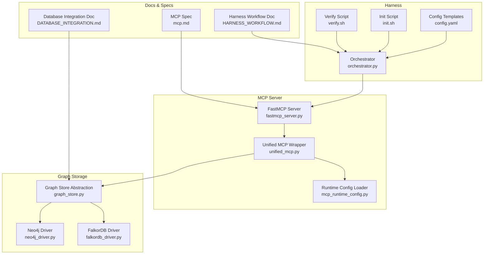
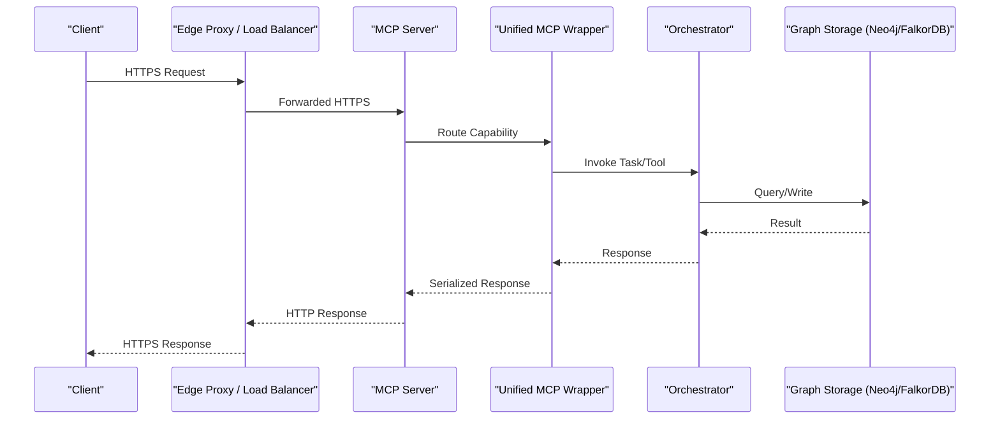
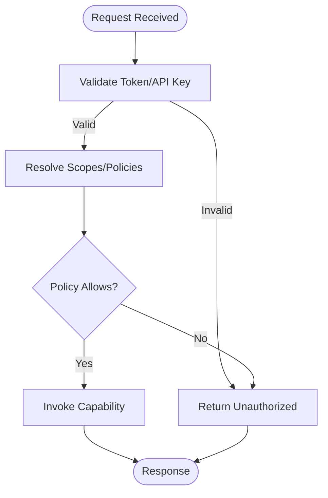
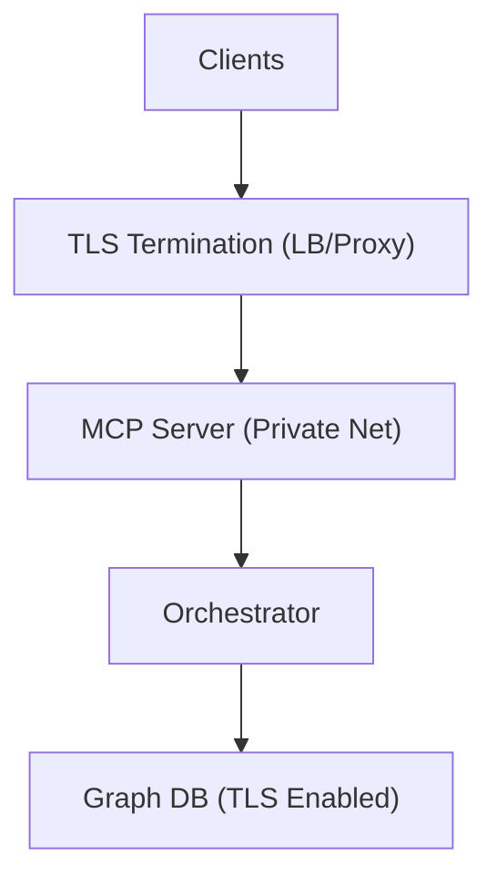
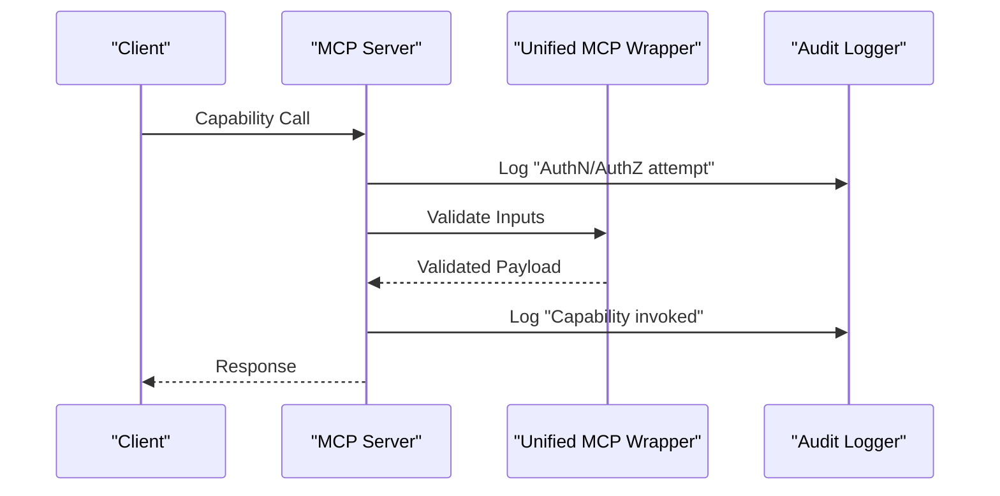
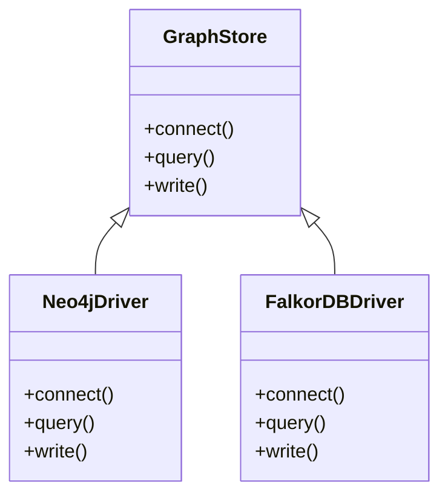
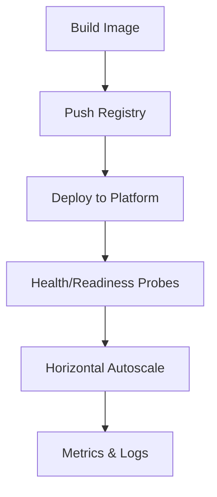
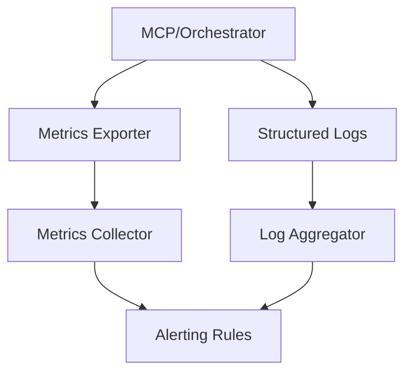
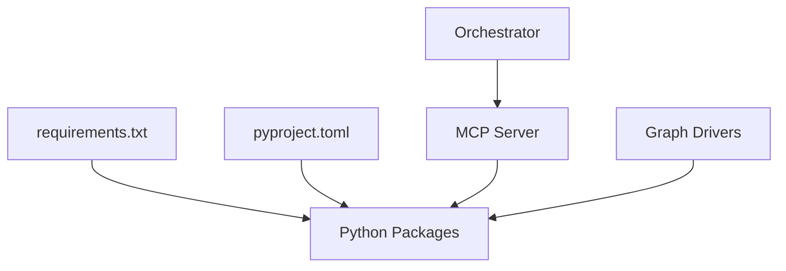

# Security & Production Deployment

<cite>
**Referenced Files in This Document**
- [ReadMe.md](file://ReadMe.md)
- [Makefile](file://Makefile)
- [requirements.txt](file://requirements.txt)
- [pyproject.toml](file://pyproject.toml)
- [.env-sample](file://doc-tiny/.env-sample)
- [config.yaml](file://harness/templates/config.yaml)
- [mcp_runtime_config.py](file://scripts/mcp_runtime_config.py)
- [fastmcp_server.py](file://code-tiny/mcp/fastmcp_server.py)
- [unified_mcp.py](file://code-tiny/mcp/unified_mcp.py)
- [orchestrator.py](file://harness/scripts/orchestrator.py)
- [init.sh](file://harness/scripts/init.sh)
- [verify.sh](file://harness/scripts/verify.sh)
- [cortex_harness.dev.py](file://cortex_harness/dev.py)
- [DATABASE_INTEGRATION.md](file://docs/DATABASE_INTEGRATION.md)
- [HARNESS_WORKFLOW.md](file://docs/HARNESS_WORKFLOW.md)
- [mcp.md](file://docs/specs/mcp.md)
- [test_mcp_http_resilience.py](file://tests/test_mcp_http_resilience.py)
- [test_mcp_acceptance_matrix.py](file://tests/test_mcp_acceptance_matrix.py)
- [test_falkordb_driver.py](file://tests/test_falkordb_driver.py)
- [graph_store.py](file://doc-tiny/graph_store.py)
- [neo4j_loader.py](file://doc-tiny/neo4j_loader.py)
- [falkordb_driver.py](file://code-tiny/code-tiny/graph/driver/falkordb_driver.py)
- [neo4j_driver.py](file://code-tiny/code-tiny/graph/driver/neo4j_driver.py)
</cite>

## Table of Contents
1. Introduction
2. Project Structure
3. Core Components
4. Architecture Overview
5. Detailed Component Analysis
6. Dependency Analysis
7. Performance Considerations
8. Troubleshooting Guide
9. Conclusion

## Introduction
This document provides security and production deployment guidance for Cortex Harness, focusing on authentication and authorization mechanisms, API key management, access control policies, network security configuration (including firewall requirements and SSL/TLS setup), containerization and orchestration considerations, scaling strategies, monitoring and logging, health checks, alerting, hardening guidelines, vulnerability assessment procedures, and compliance considerations for enterprise deployments. It synthesizes information from the repository’s configuration templates, runtime scripts, MCP server components, database integration docs, and tests to provide actionable guidance for secure and reliable operations.

## Project Structure
Cortex Harness is a multi-component system with:
- A Python-based harness and orchestrator layer
- An MCP server implementation for tool and graph capabilities
- Graph storage drivers (Neo4j and FalkorDB)
- Configuration templates and environment samples
- Lifecycle scripts for initialization and verification
- Documentation and specs for MCP and database integration

**Diagram sources**
- [config.yaml](file://harness/templates/config.yaml)
- [orchestrator.py](file://harness/scripts/orchestrator.py)
- [init.sh](file://harness/scripts/init.sh)
- [verify.sh](file://harness/scripts/verify.sh)
- [fastmcp_server.py](file://code-tiny/mcp/fastmcp_server.py)
- [unified_mcp.py](file://code-tiny/mcp/unified_mcp.py)
- [mcp_runtime_config.py](file://scripts/mcp_runtime_config.py)
- [graph_store.py](file://doc-tiny/graph_store.py)
- [neo4j_driver.py](file://code-tiny/code-tiny/graph/driver/neo4j_driver.py)
- [falkordb_driver.py](file://code-tiny/code-tiny/graph/driver/falkordb_driver.py)
- [DATABASE_INTEGRATION.md](file://docs/DATABASE_INTEGRATION.md)
- [mcp.md](file://docs/specs/mcp.md)
- [HARNESS_WORKFLOW.md](file://docs/HARNESS_WORKFLOW.md)

**Section sources**
- [ReadMe.md](file://ReadMe.md)
- [Makefile](file://Makefile)
- [requirements.txt](file://requirements.txt)
- [pyproject.toml](file://pyproject.toml)
- [config.yaml](file://harness/templates/config.yaml)
- [mcp_runtime_config.py](file://scripts/mcp_runtime_config.py)
- [fastmcp_server.py](file://code-tiny/mcp/fastmcp_server.py)
- [unified_mcp.py](file://code-tiny/mcp/unified_mcp.py)
- [orchestrator.py](file://harness/scripts/orchestrator.py)
- [init.sh](file://harness/scripts/init.sh)
- [verify.sh](file://harness/scripts/verify.sh)
- [DATABASE_INTEGRATION.md](file://docs/DATABASE_INTEGRATION.md)
- [HARNESS_WORKFLOW.md](file://docs/HARNESS_WORKFLOW.md)
- [mcp.md](file://docs/specs/mcp.md)

## Core Components
- Configuration and Environment
  - Template configuration file defines application settings consumed by the harness and MCP server.
  - Runtime config loader reads environment variables and merges them into runtime configuration used by MCP services.
  - Environment sample demonstrates expected variable names and patterns for secrets and endpoints.

- MCP Server and Unified Wrapper
  - The MCP server exposes capabilities via HTTP and integrates with the unified wrapper that routes requests to framework-specific analyzers and tools.
  - Tests validate HTTP resilience and acceptance criteria for MCP behavior.

- Orchestrator and Lifecycle Scripts
  - Orchestrator coordinates tasks such as scanning, ingestion, and MCP service lifecycle.
  - Init and verify scripts bootstrap and validate environment readiness.

- Graph Storage Drivers
  - Abstraction over Neo4j and FalkorDB drivers enables pluggable backends.
  - Database integration documentation describes connection parameters, TLS options, and operational considerations.

**Section sources**
- [config.yaml](file://harness/templates/config.yaml)
- [mcp_runtime_config.py](file://scripts/mcp_runtime_config.py)
- [.env-sample](file://doc-tiny/.env-sample)
- [fastmcp_server.py](file://code-tiny/mcp/fastmcp_server.py)
- [unified_mcp.py](file://code-tiny/mcp/unified_mcp.py)
- [test_mcp_http_resilience.py](file://tests/test_mcp_http_resilience.py)
- [test_mcp_acceptance_matrix.py](file://tests/test_mcp_acceptance_matrix.py)
- [orchestrator.py](file://harness/scripts/orchestrator.py)
- [init.sh](file://harness/scripts/init.sh)
- [verify.sh](file://harness/scripts/verify.sh)
- [graph_store.py](file://doc-tiny/graph_store.py)
- [neo4j_driver.py](file://code-tiny/code-tiny/graph/driver/neo4j_driver.py)
- [falkordb_driver.py](file://code-tiny/code-tiny/graph/driver/falkordb_driver.py)
- [DATABASE_INTEGRATION.md](file://docs/DATABASE_INTEGRATION.md)

## Architecture Overview
The system comprises an HTTP-facing MCP server backed by a unified routing layer, orchestrated by a central process, and persisting data through graph storage drivers. Configuration and secrets are provided via environment variables and template files. Network boundaries should enforce TLS termination at the edge and restrict direct access to internal services.

**Diagram sources**
- [fastmcp_server.py](file://code-tiny/mcp/fastmcp_server.py)
- [unified_mcp.py](file://code-tiny/mcp/unified_mcp.py)
- [orchestrator.py](file://harness/scripts/orchestrator.py)
- [graph_store.py](file://doc-tiny/graph_store.py)
- [neo4j_driver.py](file://code-tiny/code-tiny/graph/driver/neo4j_driver.py)
- [falkordb_driver.py](file://code-tiny/code-tiny/graph/driver/falkordb_driver.py)

## Detailed Component Analysis

### Authentication and Authorization
- Authentication
  - Use environment-driven credentials and tokens loaded by the runtime config loader.
  - Enforce token validation at the MCP server entry point before capability routing.
- Authorization
  - Implement role-based or capability-scoped access control within the unified wrapper to restrict which tools or graph operations a caller can perform.
  - Validate scopes against configured policy sets derived from environment or centralized secret store.
- API Key Management
  - Store API keys in a secrets manager; inject via environment variables consumed by the runtime config loader.
  - Rotate keys using zero-downtime reloads supported by the orchestrator.
- Access Control Policies
  - Define per-client or per-workspace policies enforced by the orchestrator prior to invoking analyzers or writing to the graph.

[No sources needed since this diagram shows conceptual workflow, not actual code structure]

**Section sources**
- [mcp_runtime_config.py](file://scripts/mcp_runtime_config.py)
- [unified_mcp.py](file://code-tiny/mcp/unified_mcp.py)
- [fastmcp_server.py](file://code-tiny/mcp/fastmcp_server.py)
- [.env-sample](file://doc-tiny/.env-sample)

### Network Security Configuration
- Firewall Requirements
  - Restrict inbound traffic to the MCP server port(s) from trusted networks or load balancers only.
  - Allow outbound connections to graph storage endpoints from the harness/MCP processes.
- SSL/TLS Setup
  - Terminate TLS at the edge proxy/load balancer and forward to MCP over localhost or private network.
  - For direct-to-service TLS, configure certificate paths and cipher suites via environment variables consumed by the runtime config loader.
- Secure Inter-Service Communication
  - Use mutual TLS between orchestrator and MCP if exposed across untrusted networks.
  - Ensure graph driver connections use encrypted channels where supported.

[No sources needed since this diagram shows conceptual workflow, not actual code structure]

**Section sources**
- [mcp_runtime_config.py](file://scripts/mcp_runtime_config.py)
- [DATABASE_INTEGRATION.md](file://docs/DATABASE_INTEGRATION.md)

### MCP Server Security
- Input Validation and Sanitization
  - Validate request payloads and parameter types in the unified wrapper before invoking analyzers.
- Resilience and Rate Limiting
  - Apply rate limiting and circuit breakers at the MCP server or edge proxy to mitigate abuse.
- Logging and Auditing
  - Log authentication outcomes, authorization decisions, and capability invocations with correlation IDs.

**Diagram sources**
- [fastmcp_server.py](file://code-tiny/mcp/fastmcp_server.py)
- [unified_mcp.py](file://code-tiny/mcp/unified_mcp.py)

**Section sources**
- [test_mcp_http_resilience.py](file://tests/test_mcp_http_resilience.py)
- [test_mcp_acceptance_matrix.py](file://tests/test_mcp_acceptance_matrix.py)
- [fastmcp_server.py](file://code-tiny/mcp/fastmcp_server.py)
- [unified_mcp.py](file://code-tiny/mcp/unified_mcp.py)

### Graph Storage Security (Neo4j and FalkorDB)
- Connection Security
  - Enable TLS for both Neo4j and FalkorDB drivers where supported; configure CA certificates and client certs via environment variables.
- Credential Management
  - Inject usernames/passwords and tokens via secrets managers; avoid embedding in images or configs.
- Data Isolation
  - Use separate databases/collections per tenant/workspace when available.
- Operational Hardening
  - Restrict network access to storage nodes; enable audit logs and encryption at rest.

**Diagram sources**
- [graph_store.py](file://doc-tiny/graph_store.py)
- [neo4j_driver.py](file://code-tiny/code-tiny/graph/driver/neo4j_driver.py)
- [falkordb_driver.py](file://code-tiny/code-tiny/graph/driver/falkordb_driver.py)
- [test_falkordb_driver.py](file://tests/test_falkordb_driver.py)

**Section sources**
- [DATABASE_INTEGRATION.md](file://docs/DATABASE_INTEGRATION.md)
- [graph_store.py](file://doc-tiny/graph_store.py)
- [neo4j_driver.py](file://code-tiny/code-tiny/graph/driver/neo4j_driver.py)
- [falkordb_driver.py](file://code-tiny/code-tiny/graph/driver/falkordb_driver.py)
- [test_falkordb_driver.py](file://tests/test_falkordb_driver.py)

### Containerization and Orchestration
- Container Images
  - Build minimal images with pinned dependencies from requirements and project metadata.
  - Run as non-root user; mount only required volumes.
- Secrets Management
  - Provide secrets via environment variables injected by the orchestrator or platform secrets store.
- Health Checks and Readiness
  - Expose health endpoints and implement liveness/readiness probes based on MCP server status and graph connectivity.
- Scaling Strategies
  - Scale MCP server horizontally behind a load balancer; ensure stateless design and externalize state to graph storage.
  - Use autoscaling policies tied to CPU/memory and request latency metrics.

[No sources needed since this diagram shows conceptual workflow, not actual code structure]

**Section sources**
- [requirements.txt](file://requirements.txt)
- [pyproject.toml](file://pyproject.toml)
- [Makefile](file://Makefile)
- [HARNESS_WORKFLOW.md](file://docs/HARNESS_WORKFLOW.md)

### Monitoring, Logging, and Alerting
- Metrics
  - Emit request counts, error rates, latency percentiles, and graph operation metrics.
- Structured Logging
  - Include correlation IDs, user context, and capability names in logs.
- Alerting
  - Configure alerts for auth failures, high error rates, slow responses, and graph connectivity issues.
- Observability
  - Integrate with centralized log aggregation and tracing systems.

[No sources needed since this diagram shows conceptual workflow, not actual code structure]

**Section sources**
- [fastmcp_server.py](file://code-tiny/mcp/fastmcp_server.py)
- [orchestrator.py](file://harness/scripts/orchestrator.py)

### Security Hardening Guidelines
- Least Privilege
  - Grant minimum permissions to service accounts and filesystem access.
- Secret Rotation
  - Automate rotation of API keys and database credentials; validate new secrets before switching.
- Supply Chain Security
  - Pin versions, scan dependencies, and sign images.
- Network Segmentation
  - Place MCP and orchestrator in private subnets; expose only via secure ingress.
- Compliance
  - Align with enterprise policies for auditability, data retention, and encryption.

[No sources needed since this section provides general guidance]

### Vulnerability Assessment Procedures
- Static and Dynamic Analysis
  - Integrate SAST/DAST scans into CI/CD pipelines.
- Dependency Scanning
  - Regularly scan for known vulnerabilities in Python packages and base images.
- Penetration Testing
  - Periodically test MCP endpoints and graph interfaces for misconfigurations.
- Remediation Tracking
  - Track findings and enforce SLAs for critical/high severity issues.

[No sources needed since this section provides general guidance]

## Dependency Analysis
External dependencies include Python packages defined in requirements and project metadata, MCP server libraries, and graph drivers. The orchestrator depends on MCP runtime configuration and lifecycle scripts.

**Diagram sources**
- [requirements.txt](file://requirements.txt)
- [pyproject.toml](file://pyproject.toml)
- [fastmcp_server.py](file://code-tiny/mcp/fastmcp_server.py)
- [orchestrator.py](file://harness/scripts/orchestrator.py)

**Section sources**
- [requirements.txt](file://requirements.txt)
- [pyproject.toml](file://pyproject.toml)
- [Makefile](file://Makefile)

## Performance Considerations
- Connection Pooling
  - Tune pool sizes for graph drivers based on workload and concurrency.
- Caching
  - Cache frequent query results at the MCP layer where appropriate.
- Backpressure
  - Implement queueing and throttling to protect downstream graph stores.
- Resource Limits
  - Set CPU/memory limits in orchestration platforms to prevent noisy neighbor effects.

[No sources needed since this section provides general guidance]

## Troubleshooting Guide
- Initialization Failures
  - Verify environment variables and secrets injection; check init script outputs.
- MCP Connectivity Issues
  - Inspect HTTP resilience tests and server logs; confirm TLS and endpoint reachability.
- Graph Connectivity Problems
  - Validate driver configurations, certificates, and network ACLs; review database integration documentation.
- Verification Steps
  - Use verify script to assert readiness and basic functionality.

**Section sources**
- [init.sh](file://harness/scripts/init.sh)
- [verify.sh](file://harness/scripts/verify.sh)
- [test_mcp_http_resilience.py](file://tests/test_mcp_http_resilience.py)
- [DATABASE_INTEGRATION.md](file://docs/DATABASE_INTEGRATION.md)

## Conclusion
By enforcing strong authentication and authorization, managing secrets securely, configuring network boundaries and TLS, and adopting robust containerization and observability practices, Cortex Harness can be deployed securely and reliably in production environments. Continuous vulnerability assessments and compliance alignment further strengthen operational posture.