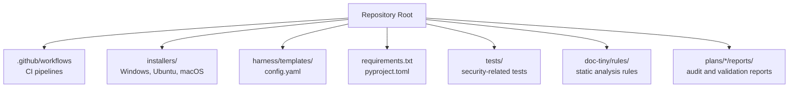
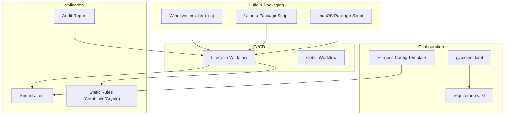
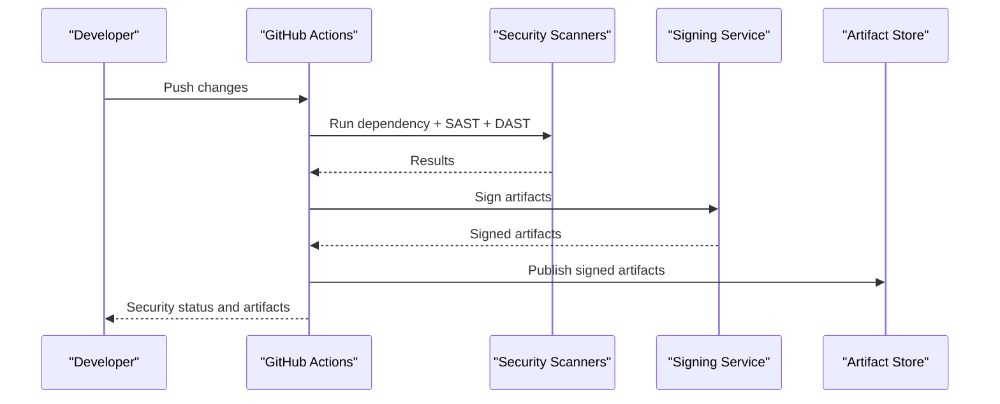
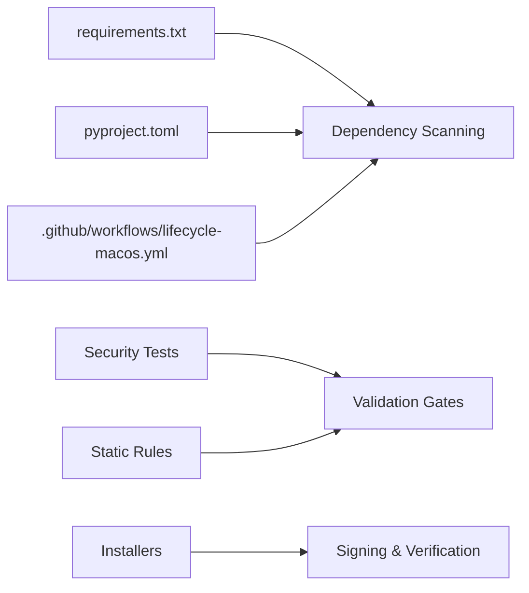

# Security Hardening & Compliance

<cite>
**Referenced Files in This Document**
- [ReadMe.md](file://ReadMe.md)
- [Makefile](file://Makefile)
- [requirements.txt](file://requirements.txt)
- [pyproject.toml](file://pyproject.toml)
- [.github/workflows/lifecycle-macos.yml](file://.github/workflows/lifecycle-macos.yml)
- [.github/workflows/cobol-macos.yml](file://.github/workflows/cobol-macos.yml)
- [harness/templates/config.yaml](file://harness/templates/config.yaml)
- [installers/windows/inno_setup/cortex_harness.iss](file://installers/windows/inno_setup/cortex_harness.iss)
- [installers/ubuntu/scripts/build_deb.sh](file://installers/ubuntu/scripts/build_deb.sh)
- [installers/macos/workflows/build_pkg.sh](file://installers/macos/workflows/build_pkg.sh)
- [cortex_harness/dev.py](file://cortex_harness/dev.py)
- [scripts/mcp-lifecycle.py](file://scripts/mcp-lifecycle.py)
- [doc-tiny/rules/ruler.combined.json](file://doc-tiny/rules/ruler.combined.json)
- [doc-tiny/rules/ruler.crypto.json](file://doc-tiny/rules/ruler.crypto.json)
- [code-tiny/tools/common/harness_config.py](file://code-tiny/tools/common/harness_config.py)
- [plans/260714-1702-cobol-analyzer-parser/reports/security-audit.md](file://plans/260714-1702-cobol-analyzer-parser/reports/security-audit.md)
- [tests/test_aspnet_protocol_and_security.py](file://tests/test_aspnet_protocol_and_security.py)
</cite>

## Table of Contents
1. [Introduction](#introduction)
2. [Project Structure](#project-structure)
3. [Core Components](#core-components)
4. [Architecture Overview](#architecture-overview)
5. [Detailed Component Analysis](#detailed-component-analysis)
6. [Dependency Analysis](#dependency-analysis)
7. [Performance Considerations](#performance-considerations)
8. [Troubleshooting Guide](#troubleshooting-guide)
9. [Conclusion](#conclusion)
10. [Appendices](#appendices)

## Introduction
This document provides comprehensive security hardening and compliance guidance for Cortex Harness. It consolidates best practices, vulnerability assessment procedures, penetration testing guidelines, dependency scanning, code signing, supply chain controls, and compliance considerations (SOC 2, ISO 27001, GDPR). It also outlines audit trails, access logging, forensic analysis capabilities, secure configuration templates, input validation patterns, incident response procedures, patching workflows, and vulnerability management processes. The content is grounded in the repository’s build, packaging, CI, configuration, and test artifacts to ensure actionable and verifiable recommendations.

## Project Structure
Cortex Harness includes:
- Build and packaging scripts for Windows, Ubuntu, and macOS
- GitHub Actions workflows for lifecycle and framework-specific tasks
- Configuration templates used by harness components
- Dependency manifests and project metadata
- Tests that include protocol and security-related assertions
- Documentation and rules related to static analysis and crypto checks

**Diagram sources**
- [.github/workflows/lifecycle-macos.yml](file://.github/workflows/lifecycle-macos.yml)
- [installers/windows/inno_setup/cortex_harness.iss](file://installers/windows/inno_setup/cortex_harness.iss)
- [installers/ubuntu/scripts/build_deb.sh](file://installers/ubuntu/scripts/build_deb.sh)
- [installers/macos/workflows/build_pkg.sh](file://installers/macos/workflows/build_pkg.sh)
- [harness/templates/config.yaml](file://harness/templates/config.yaml)
- [requirements.txt](file://requirements.txt)
- [pyproject.toml](file://pyproject.toml)
- [tests/test_aspnet_protocol_and_security.py](file://tests/test_aspnet_protocol_and_security.py)
- [doc-tiny/rules/ruler.combined.json](file://doc-tiny/rules/ruler.combined.json)
- [doc-tiny/rules/ruler.crypto.json](file://doc-tiny/rules/ruler.crypto.json)
- [plans/260714-1702-cobol-analyzer-parser/reports/security-audit.md](file://plans/260714-1702-cobol-analyzer-parser/reports/security-audit.md)

**Section sources**
- [ReadMe.md](file://ReadMe.md)
- [Makefile](file://Makefile)

## Core Components
Security-relevant core components identified in the repository:
- Packaging and installation:
  - Windows installer definition
  - Linux package build script
  - macOS package build script
- CI/CD pipelines:
  - Lifecycle workflow
  - Framework-specific workflow
- Configuration template:
  - Harness configuration file template
- Dependency management:
  - Python requirements and project metadata
- Security tests:
  - Protocol and security assertions
- Static analysis rules:
  - Combined ruleset and crypto-focused rules
- Audit and validation reports:
  - Security audit report for a component

These components collectively support secure builds, reproducible packaging, controlled dependencies, and baseline security validations.

**Section sources**
- [installers/windows/inno_setup/cortex_harness.iss](file://installers/windows/inno_setup/cortex_harness.iss)
- [installers/ubuntu/scripts/build_deb.sh](file://installers/ubuntu/scripts/build_deb.sh)
- [installers/macos/workflows/build_pkg.sh](file://installers/macos/workflows/build_pkg.sh)
- [.github/workflows/lifecycle-macos.yml](file://.github/workflows/lifecycle-macos.yml)
- [.github/workflows/cobol-macos.yml](file://.github/workflows/cobol-macos.yml)
- [harness/templates/config.yaml](file://harness/templates/config.yaml)
- [requirements.txt](file://requirements.txt)
- [pyproject.toml](file://pyproject.toml)
- [tests/test_aspnet_protocol_and_security.py](file://tests/test_aspnet_protocol_and_security.py)
- [doc-tiny/rules/ruler.combined.json](file://doc-tiny/rules/ruler.combined.json)
- [doc-tiny/rules/ruler.crypto.json](file://doc-tiny/rules/ruler.crypto.json)
- [plans/260714-1702-cobol-analyzer-parser/reports/security-audit.md](file://plans/260714-1702-cobol-analyzer-parser/reports/security-audit.md)

## Architecture Overview
The security architecture integrates secure build and packaging with CI-driven checks, dependency pinning, and runtime configuration hardening.

**Diagram sources**
- [installers/windows/inno_setup/cortex_harness.iss](file://installers/windows/inno_setup/cortex_harness.iss)
- [installers/ubuntu/scripts/build_deb.sh](file://installers/ubuntu/scripts/build_deb.sh)
- [installers/macos/workflows/build_pkg.sh](file://installers/macos/workflows/build_pkg.sh)
- [.github/workflows/lifecycle-macos.yml](file://.github/workflows/lifecycle-macos.yml)
- [.github/workflows/cobol-macos.yml](file://.github/workflows/cobol-macos.yml)
- [harness/templates/config.yaml](file://harness/templates/config.yaml)
- [requirements.txt](file://requirements.txt)
- [pyproject.toml](file://pyproject.toml)
- [tests/test_aspnet_protocol_and_security.py](file://tests/test_aspnet_protocol_and_security.py)
- [doc-tiny/rules/ruler.combined.json](file://doc-tiny/rules/ruler.combined.json)
- [doc-tiny/rules/ruler.crypto.json](file://doc-tiny/rules/ruler.crypto.json)
- [plans/260714-1702-cobol-analyzer-parser/reports/security-audit.md](file://plans/260714-1702-cobol-analyzer-parser/reports/security-audit.md)

## Detailed Component Analysis

### Secure Build and Packaging
- Windows installer definition:
  - Review installer script for secure defaults, least privilege, and artifact integrity checks.
  - Ensure code signing integration points are present and enforced.
- Linux package build:
  - Validate environment isolation, deterministic outputs, and signature verification steps.
- macOS package build:
  - Confirm notarization or signing hooks if applicable, and artifact provenance.

Recommendations:
- Enforce signed artifacts across platforms.
- Use immutable build environments and cache signatures.
- Integrate SBOM generation into packaging stages.

**Section sources**
- [installers/windows/inno_setup/cortex_harness.iss](file://installers/windows/inno_setup/cortex_harness.iss)
- [installers/ubuntu/scripts/build_deb.sh](file://installers/ubuntu/scripts/build_deb.sh)
- [installers/macos/workflows/build_pkg.sh](file://installers/macos/workflows/build_pkg.sh)

### CI/CD Security Controls
- Lifecycle workflow:
  - Add dependency scanning, SAST/DAST, and policy checks.
  - Gate releases on passing security gates and signed artifacts.
- Framework-specific workflow:
  - Apply targeted scans for language/framework-specific vulnerabilities.

Recommended pipeline flow:

**Diagram sources**
- [.github/workflows/lifecycle-macos.yml](file://.github/workflows/lifecycle-macos.yml)
- [.github/workflows/cobol-macos.yml](file://.github/workflows/cobol-macos.yml)

**Section sources**
- [.github/workflows/lifecycle-macos.yml](file://.github/workflows/lifecycle-macos.yml)
- [.github/workflows/cobol-macos.yml](file://.github/workflows/cobol-macos.yml)

### Configuration Hardening
- Harness configuration template:
  - Harden defaults: disable debug endpoints, enforce TLS, restrict permissions, enable audit logging.
  - Centralize secrets via environment variables or secret managers; avoid committing sensitive values.
- Development entrypoint:
  - Ensure dev mode does not expose privileged features in production-like configurations.

Best practices:
- Provide secure-by-default templates.
- Validate configuration at startup and fail fast on insecure settings.
- Separate development and production configs.

**Section sources**
- [harness/templates/config.yaml](file://harness/templates/config.yaml)
- [cortex_harness/dev.py](file://cortex_harness/dev.py)

### Dependency Security Management
- Requirements and project metadata:
  - Pin versions, use lockfiles where possible, and regularly update.
  - Integrate automated vulnerability scanning against known CVEs.
  - Maintain an SBOM and track provenance.

Operational guidance:
- Automate periodic scans and block merges on critical findings.
- Whitelist exceptions with documented risk acceptance and expiration dates.

**Section sources**
- [requirements.txt](file://requirements.txt)
- [pyproject.toml](file://pyproject.toml)

### Input Validation and Protocol Security
- Security tests:
  - Validate protocol boundaries, input coercion, and error handling paths.
  - Ensure malformed inputs are rejected safely without leaking internals.

Patterns:
- Strict schema validation for all external inputs.
- Sanitize and normalize data before processing.
- Return generic error messages to clients while logging detailed diagnostics securely.

**Section sources**
- [tests/test_aspnet_protocol_and_security.py](file://tests/test_aspnet_protocol_and_security.py)

### Static Analysis and Crypto Rules
- Combined ruleset and crypto rules:
  - Enforce secure coding standards, detect weak cryptography, and flag risky APIs.
  - Integrate rule enforcement into CI to prevent regressions.

Action items:
- Configure rule severity thresholds and require remediation for high-severity issues.
- Periodically review and update rulesets to reflect evolving threats.

**Section sources**
- [doc-tiny/rules/ruler.combined.json](file://doc-tiny/rules/ruler.combined.json)
- [doc-tiny/rules/ruler.crypto.json](file://doc-tiny/rules/ruler.crypto.json)

### Supply Chain Security Measures
- Artifact signing and verification:
  - Sign binaries and packages; verify signatures during installation.
- Provenance and SBOM:
  - Generate SBOMs per release and store alongside artifacts.
- Trusted build environments:
  - Use ephemeral runners, minimize toolchain exposure, and validate checksums.

**Section sources**
- [installers/windows/inno_setup/cortex_harness.iss](file://installers/windows/inno_setup/cortex_harness.iss)
- [installers/ubuntu/scripts/build_deb.sh](file://installers/ubuntu/scripts/build_deb.sh)
- [installers/macos/workflows/build_pkg.sh](file://installers/macos/workflows/build_pkg.sh)

### Compliance Frameworks Support
- SOC 2:
  - Implement access controls, audit logs, change management, and monitoring.
  - Maintain evidence collection for security and availability criteria.
- ISO 27001:
  - Establish ISMS policies, risk assessments, and continuous improvement cycles.
  - Document asset inventory, vendor management, and incident response.
- GDPR:
  - Minimize personal data processing, implement consent mechanisms, and provide data subject rights workflows.
  - Ensure data retention and deletion policies are enforced.

Evidence mapping:
- CI logs, scan results, and audit reports serve as compliance artifacts.
- Packaging and signing records demonstrate control over software distribution.

**Section sources**
- [plans/260714-1702-cobol-analyzer-parser/reports/security-audit.md](file://plans/260714-1702-cobol-analyzer-parser/reports/security-audit.md)

### Security Audit Trails, Access Logging, and Forensics
- Audit trails:
  - Record user actions, configuration changes, and system events with timestamps and source IPs.
- Access logging:
  - Log authentication attempts, authorization decisions, and API usage.
- Forensic analysis:
  - Preserve log integrity, retain logs per policy, and provide query tools for incident investigation.

Implementation notes:
- Centralize logs in tamper-evident storage.
- Redact sensitive information in logs.
- Provide structured log formats for SIEM ingestion.

[No sources needed since this section provides general guidance]

### Incident Response Procedures
- Detection and triage:
  - Monitor alerts from scanners and runtime telemetry.
  - Classify incidents by severity and impact.
- Containment and eradication:
  - Isolate affected systems, revoke compromised credentials, and roll back vulnerable artifacts.
- Recovery and postmortem:
  - Restore from verified backups, apply patches, and conduct root cause analysis.
- Communication and reporting:
  - Notify stakeholders and regulators as required by compliance obligations.

**Section sources**
- [scripts/mcp-lifecycle.py](file://scripts/mcp-lifecycle.py)

### Security Patching and Vulnerability Management
- Continuous scanning:
  - Schedule regular dependency and container scans.
- Prioritization:
  - Use CVSS scores, exploit availability, and business context to prioritize fixes.
- Remediation workflow:
  - Create tickets, assign owners, and track SLAs.
  - Verify fixes via regression tests and re-scan.

**Section sources**
- [requirements.txt](file://requirements.txt)
- [pyproject.toml](file://pyproject.toml)

### Secure Configuration Templates and Security Headers
- Templates:
  - Provide hardened defaults for TLS, CORS, CSP, and other headers.
  - Disable unnecessary features in production profiles.
- Input validation patterns:
  - Enforce allowlists, length limits, and type checks.
  - Reject unexpected structures early in the request pipeline.

**Section sources**
- [harness/templates/config.yaml](file://harness/templates/config.yaml)

## Dependency Analysis
Security dependencies and their roles:
- Build-time:
  - Scanners integrated in CI for dependency and code quality checks.
- Runtime:
  - Configuration-driven security controls and logging.
- Validation:
  - Tests and static analysis rules enforce security posture.

**Diagram sources**
- [requirements.txt](file://requirements.txt)
- [pyproject.toml](file://pyproject.toml)
- [.github/workflows/lifecycle-macos.yml](file://.github/workflows/lifecycle-macos.yml)
- [tests/test_aspnet_protocol_and_security.py](file://tests/test_aspnet_protocol_and_security.py)
- [doc-tiny/rules/ruler.combined.json](file://doc-tiny/rules/ruler.combined.json)
- [installers/windows/inno_setup/cortex_harness.iss](file://installers/windows/inno_setup/cortex_harness.iss)

**Section sources**
- [requirements.txt](file://requirements.txt)
- [pyproject.toml](file://pyproject.toml)
- [.github/workflows/lifecycle-macos.yml](file://.github/workflows/lifecycle-macos.yml)
- [tests/test_aspnet_protocol_and_security.py](file://tests/test_aspnet_protocol_and_security.py)
- [doc-tiny/rules/ruler.combined.json](file://doc-tiny/rules/ruler.combined.json)
- [installers/windows/inno_setup/cortex_harness.iss](file://installers/windows/inno_setup/cortex_harness.iss)

## Performance Considerations
- Optimize scanning windows to reduce CI duration while maintaining coverage.
- Cache scanner results and reuse SBOMs across runs.
- Parallelize independent security checks to improve throughput.
- Tune logging verbosity to balance observability and performance.

[No sources needed since this section provides general guidance]

## Troubleshooting Guide
Common issues and resolutions:
- Failed dependency scans:
  - Update pinned versions or accept justified exceptions with documented risk.
- Signing failures:
  - Verify certificate validity, key permissions, and timestamp server configuration.
- Configuration errors:
  - Validate config files against schemas and ensure secrets are injected correctly.
- Test failures:
  - Inspect security test logs for protocol violations or input validation gaps.

**Section sources**
- [requirements.txt](file://requirements.txt)
- [installers/windows/inno_setup/cortex_harness.iss](file://installers/windows/inno_setup/cortex_harness.iss)
- [harness/templates/config.yaml](file://harness/templates/config.yaml)
- [tests/test_aspnet_protocol_and_security.py](file://tests/test_aspnet_protocol_and_security.py)

## Conclusion
Cortex Harness can achieve robust security and compliance by integrating secure packaging, CI-driven security gates, dependency management, configuration hardening, and comprehensive auditing. By enforcing signing, scanning, and validated configurations—and aligning with SOC 2, ISO 27001, and GDPR—organizations can maintain a strong security posture and demonstrable compliance.

[No sources needed since this section summarizes without analyzing specific files]

## Appendices

### Appendix A: Penetration Testing Guidelines
- Scope:
  - Define targets including APIs, installers, and configuration surfaces.
- Methodology:
  - Perform OWASP-based testing, fuzzing, and credential brute-force resistance checks.
- Reporting:
  - Document findings, severity, reproduction steps, and remediation plans.

[No sources needed since this section provides general guidance]

### Appendix B: Security Headers and Input Validation Patterns
- Headers:
  - Enforce HSTS, CSP, X-Frame-Options, and secure cookie flags.
- Input validation:
  - Use strict schemas, sanitize HTML/SQL, and limit payload sizes.

[No sources needed since this section provides general guidance]

### Appendix C: Code Signing and Provenance
- Signing:
  - Use platform-native signing tools and integrate with CI.
- Provenance:
  - Attach SBOM and attestation metadata to artifacts.

**Section sources**
- [installers/windows/inno_setup/cortex_harness.iss](file://installers/windows/inno_setup/cortex_harness.iss)
- [installers/ubuntu/scripts/build_deb.sh](file://installers/ubuntu/scripts/build_deb.sh)
- [installers/macos/workflows/build_pkg.sh](file://installers/macos/workflows/build_pkg.sh)