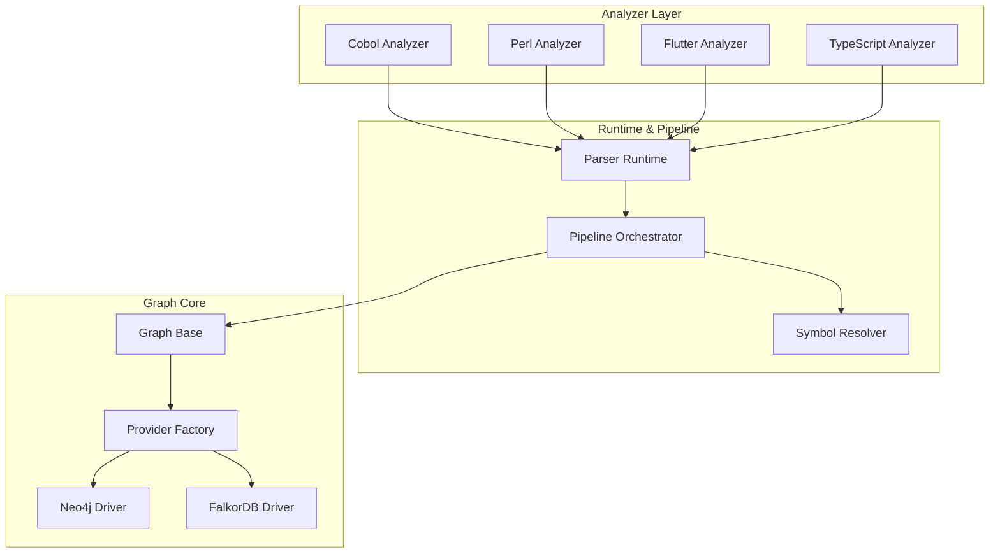
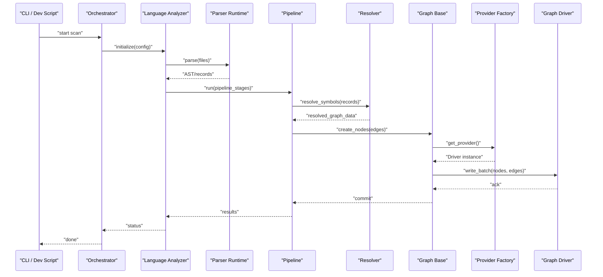
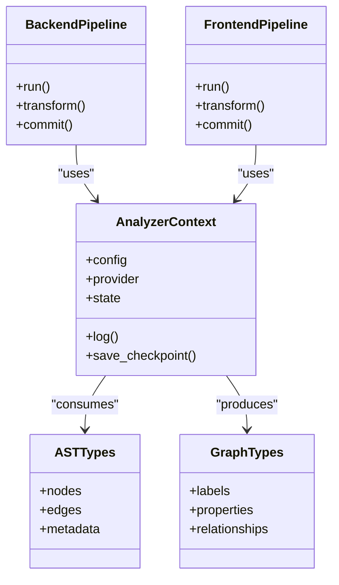
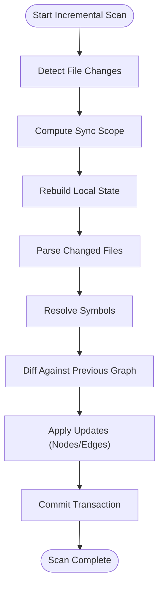
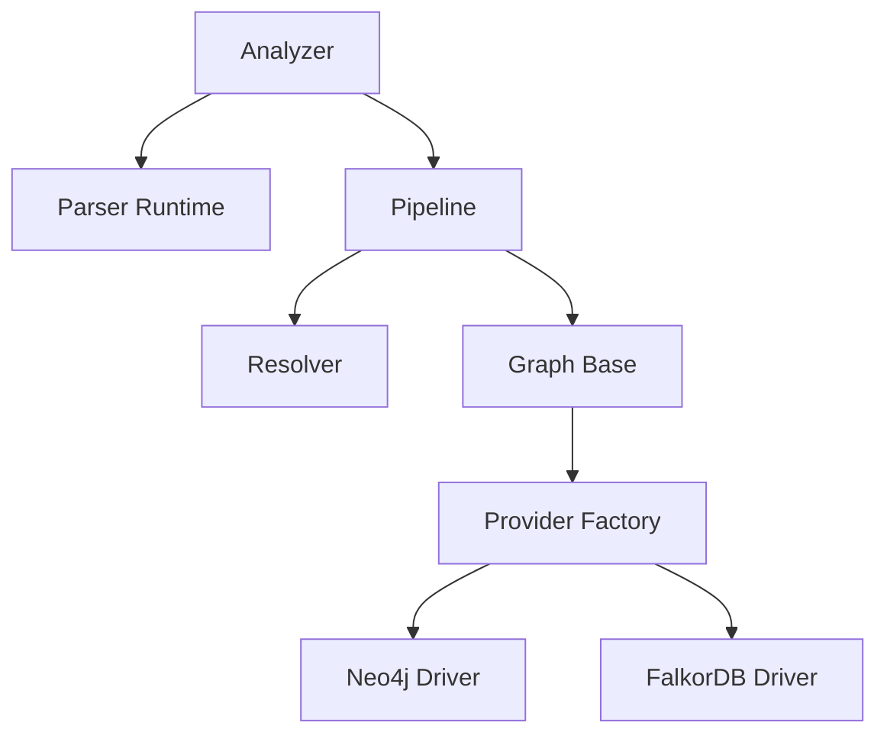

# Custom Analyzer Development

<cite>
**Referenced Files in This Document**
- [ReadMe.md](file://ReadMe.md)
- [Makefile](file://Makefile)
- [pyproject.toml](file://pyproject.toml)
- [requirements.txt](file://requirements.txt)
- [cortex_harness/dev.py](file://cortex_harness/dev.py)
- [harness/scripts/orchestrator.py](file://harness/scripts/orchestrator.py)
- [code-tiny/tools/common/harness_config.py](file://code-tiny/tools/common/harness_config.py)
- [code-tiny/tools/graph/core/base.py](file://code-tiny/tools/graph/core/base.py)
- [code-tiny/tools/graph/core/factory.py](file://code-tiny/tools/graph/core/factory.py)
- [code-tiny/tools/graph/core/provider_runtime.py](file://code-tiny/tools/graph/core/provider_runtime.py)
- [code-tiny/tools/graph/driver/neo4j_driver.py](file://code-tiny/tools/graph/driver/neo4j_driver.py)
- [code-tiny/tools/graph/driver/falkordb_driver.py](file://code-tiny/tools/graph/driver/falkordb_driver.py)
- [code-tiny/tools/cobol/cobol_analyzer.py](file://code-tiny/tools/cobol/cobol_analyzer.py)
- [code-tiny/tools/cobol/parser_runtime.py](file://code-tiny/tools/cobol/parser_runtime.py)
- [code-tiny/tools/cobol/pipeline.py](file://code-tiny/tools/cobol/pipeline.py)
- [code-tiny/tools/cobol/resolver.py](file://code-tiny/tools/cobol/resolver.py)
- [code-tiny/tools/perl/perl_analyzer.py](file://code-tiny/tools/perl/perl_analyzer.py)
- [code-tiny/tools/perl/parser_runtime.py](file://code-tiny/tools/perl/parser_runtime.py)
- [code-tiny/tools/perl/pipeline.py](file://code-tiny/tools/perl/pipeline.py)
- [code-tiny/tools/perl/resolver.py](file://code-tiny/tools/perl/resolver.py)
- [code-tiny/tools/servlet_jsp/parser_runtime.py](file://code-tiny/tools/servlet_jsp/parser_runtime.py)
- [code-tiny/tools/mybatis/parser_runtime.py](file://code-tiny/tools/mybatis/parser_runtime.py)
- [code-tiny/tools/flutter/dart_parser.py](file://code-tiny/tools/flutter/dart_parser.py)
- [code-tiny/tools/flutter/flutter_analyzer.py](file://code-tiny/tools/flutter/flutter_analyzer.py)
- [code-tiny/tools/flutter/pipeline.py](file://code-tiny/tools/flutter/pipeline.py)
- [code-tiny/tools/ts/ts_analyzer.py](file://code-tiny/tools/ts/ts_analyzer.py)
- [code-tiny/tools/ts/context/analyzer_context.py](file://code-tiny/tools/ts/context/analyzer_context.py)
- [code-tiny/tools/ts/types/graph_types.py](file://code-tiny/tools/ts/types/graph_types.py)
- [code-tiny/tools/ts/types/ast_types.py](file://code-tiny/tools/ts/types/ast_types.py)
- [code-tiny/tools/ts/pipeline/backend_pipeline.py](file://code-tiny/tools/ts/pipeline/backend_pipeline.py)
- [code-tiny/tools/ts/pipeline/frontend_pipeline.py](file://code-tiny/tools/ts/pipeline/frontend_pipeline.py)
- [code-tiny/tools/common/incremental_sync_state.py](file://code-tiny/tools/common/incremental_sync_state.py)
- [code-tiny/tools/common/incremental_cleanup.py](file://code-tiny/tools/common/incremental_cleanup.py)
- [code-tiny/tools/common/source_inventory.py](file://code-tiny/tools/common/source_inventory.py)
- [code-tiny/tools/common/sync_scope.py](file://code-tiny/tools/common/sync_scope.py)
- [code-tiny/tools/sync/incremental_sync.py](file://code-tiny/tools/sync/incremental_sync.py)
- [tests/test_cobol_parser_runtime.py](file://tests/test_cobol_parser_runtime.py)
- [tests/test_perl_parser.py](file://tests/test_perl_parser.py)
- [tests/test_flutter_protocol.py](file://tests/test_flutter_protocol.py)
- [tests/test_incremental_sync_cobol.py](file://tests/test_incremental_sync_cobol.py)
- [tests/test_incremental_sync_lock.py](file://tests/test_incremental_sync_lock.py)
- [tests/test_dev_framework_parser_discovery.py](file://tests/test_dev_framework_parser_discovery.py)
</cite>

## Table of Contents
1. [Introduction](#introduction)
2. [Project Structure](#project-structure)
3. [Core Components](#core-components)
4. [Architecture Overview](#architecture-overview)
5. [Detailed Component Analysis](#detailed-component-analysis)
6. [Dependency Analysis](#dependency-analysis)
7. [Performance Considerations](#performance-considerations)
8. [Troubleshooting Guide](#troubleshooting-guide)
9. [Conclusion](#conclusion)
10. [Appendices](#appendices)

## Introduction
This document explains how to create custom language analyzers and extend Cortex Harness capabilities. It covers the analyzer base class interface, parser runtime integration, symbol resolution patterns, graph construction APIs, registration mechanisms, configuration schema definition, and testing frameworks for custom analyzers. Step-by-step tutorials guide you through implementing analyzers for new languages or extending existing ones. Best practices for performance optimization, error recovery, and incremental analysis support are included, along with complete examples referencing real implementations and tests in the repository.

## Project Structure
Cortex Harness organizes analyzers by language/framework under code-tiny/tools/<language>. Each analyzer typically includes:
- An analyzer entry point (e.g., <lang>_analyzer.py)
- A parser runtime adapter (parser_runtime.py)
- A pipeline orchestrator (pipeline.py)
- A resolver for symbol resolution (resolver.py)
- Optional models and utilities

Graph core components provide a unified driver abstraction and runtime for writing nodes and edges into supported graph backends.

**Diagram sources**
- [code-tiny/tools/cobol/cobol_analyzer.py](file://code-tiny/tools/cobol/cobol_analyzer.py)
- [code-tiny/tools/cobol/parser_runtime.py](file://code-tiny/tools/cobol/parser_runtime.py)
- [code-tiny/tools/cobol/pipeline.py](file://code-tiny/tools/cobol/pipeline.py)
- [code-tiny/tools/cobol/resolver.py](file://code-tiny/tools/cobol/resolver.py)
- [code-tiny/tools/perl/perl_analyzer.py](file://code-tiny/tools/perl/perl_analyzer.py)
- [code-tiny/tools/perl/parser_runtime.py](file://code-tiny/tools/perl/parser_runtime.py)
- [code-tiny/tools/perl/pipeline.py](file://code-tiny/tools/perl/pipeline.py)
- [code-tiny/tools/perl/resolver.py](file://code-tiny/tools/perl/resolver.py)
- [code-tiny/tools/flutter/flutter_analyzer.py](file://code-tiny/tools/flutter/flutter_analyzer.py)
- [code-tiny/tools/flutter/dart_parser.py](file://code-tiny/tools/flutter/dart_parser.py)
- [code-tiny/tools/flutter/pipeline.py](file://code-tiny/tools/flutter/pipeline.py)
- [code-tiny/tools/ts/ts_analyzer.py](file://code-tiny/tools/ts/ts_analyzer.py)
- [code-tiny/tools/graph/core/base.py](file://code-tiny/tools/graph/core/base.py)
- [code-tiny/tools/graph/core/factory.py](file://code-tiny/tools/graph/core/factory.py)
- [code-tiny/tools/graph/driver/neo4j_driver.py](file://code-tiny/tools/graph/driver/neo4j_driver.py)
- [code-tiny/tools/graph/driver/falkordb_driver.py](file://code-tiny/tools/graph/driver/falkordb_driver.py)

**Section sources**
- [ReadMe.md](file://ReadMe.md)
- [Makefile](file://Makefile)
- [pyproject.toml](file://pyproject.toml)
- [requirements.txt](file://requirements.txt)

## Core Components
- Graph Base and Provider Runtime: Provide a unified interface for creating nodes and edges and managing provider lifecycles.
- Provider Factory: Resolves and instantiates concrete drivers (Neo4j, FalkorDB).
- Drivers: Implement backend-specific operations for node/edge creation and queries.
- Parser Runtime: Adapts external parsers to a common contract used by pipelines.
- Pipeline: Orchestrates parsing, normalization, resolution, and graph writes.
- Resolver: Performs symbol resolution across files and modules.

Key responsibilities:
- Base defines abstract methods for node/edge creation and transaction boundaries.
- Factory selects the appropriate driver based on configuration.
- Drivers implement low-level graph operations.
- Parser runtime encapsulates parser invocation and result normalization.
- Pipeline coordinates stages and integrates with incremental sync.
- Resolver resolves identifiers to canonical symbols and links references.

**Section sources**
- [code-tiny/tools/graph/core/base.py](file://code-tiny/tools/graph/core/base.py)
- [code-tiny/tools/graph/core/factory.py](file://code-tiny/tools/graph/core/factory.py)
- [code-tiny/tools/graph/core/provider_runtime.py](file://code-tiny/tools/graph/core/provider_runtime.py)
- [code-tiny/tools/graph/driver/neo4j_driver.py](file://code-tiny/tools/graph/driver/neo4j_driver.py)
- [code-tiny/tools/graph/driver/falkordb_driver.py](file://code-tiny/tools/graph/driver/falkordb_driver.py)

## Architecture Overview
The analyzer architecture separates concerns between language-specific logic and shared infrastructure:

**Diagram sources**
- [cortex_harness/dev.py](file://cortex_harness/dev.py)
- [harness/scripts/orchestrator.py](file://harness/scripts/orchestrator.py)
- [code-tiny/tools/cobol/cobol_analyzer.py](file://code-tiny/tools/cobol/cobol_analyzer.py)
- [code-tiny/tools/cobol/parser_runtime.py](file://code-tiny/tools/cobol/parser_runtime.py)
- [code-tiny/tools/cobol/pipeline.py](file://code-tiny/tools/cobol/pipeline.py)
- [code-tiny/tools/cobol/resolver.py](file://code-tiny/tools/cobol/resolver.py)
- [code-tiny/tools/graph/core/base.py](file://code-tiny/tools/graph/core/base.py)
- [code-tiny/tools/graph/core/factory.py](file://code-tiny/tools/graph/core/factory.py)
- [code-tiny/tools/graph/driver/neo4j_driver.py](file://code-tiny/tools/graph/driver/neo4j_driver.py)
- [code-tiny/tools/graph/driver/falkordb_driver.py](file://code-tiny/tools/graph/driver/falkordb_driver.py)

## Detailed Component Analysis

### Analyzer Base Class Interface
- Purpose: Define the contract that all language analyzers must implement.
- Responsibilities:
  - Initialize with configuration and context.
  - Discover source files and framework artifacts.
  - Parse sources via parser runtime.
  - Normalize records into a common model.
  - Resolve symbols and build relationships.
  - Write nodes and edges using graph base.
  - Support incremental updates and error recovery.

Implementation patterns:
- Use factory to obtain a graph provider.
- Delegate parsing to parser runtime.
- Compose pipeline stages for transformation and validation.
- Integrate with incremental sync state to limit rework.

**Section sources**
- [code-tiny/tools/cobol/cobol_analyzer.py](file://code-tiny/tools/cobol/cobol_analyzer.py)
- [code-tiny/tools/perl/perl_analyzer.py](file://code-tiny/tools/perl/perl_analyzer.py)
- [code-tiny/tools/flutter/flutter_analyzer.py](file://code-tiny/tools/flutter/flutter_analyzer.py)
- [code-tiny/tools/ts/ts_analyzer.py](file://code-tiny/tools/ts/ts_analyzer.py)

### Parser Runtime Integration
- Purpose: Encapsulate external parser invocations and normalize outputs.
- Responsibilities:
  - Configure parser environment and arguments.
  - Stream results to avoid memory spikes.
  - Map parser output to internal record types.
  - Handle partial parses and errors gracefully.

Integration points:
- Analyzer calls parser runtime with file list.
- Parser runtime returns normalized records consumed by pipeline.
- Resolver uses these records to resolve symbols.

Examples:
- Cobol parser runtime adapts Cobol-specific parsing.
- Perl parser runtime adapts Perl-specific parsing.
- Servlet/JSP and MyBatis include specialized parser runtimes.

**Section sources**
- [code-tiny/tools/cobol/parser_runtime.py](file://code-tiny/tools/cobol/parser_runtime.py)
- [code-tiny/tools/perl/parser_runtime.py](file://code-tiny/tools/perl/parser_runtime.py)
- [code-tiny/tools/servlet_jsp/parser_runtime.py](file://code-tiny/tools/servlet_jsp/parser_runtime.py)
- [code-tiny/tools/mybatis/parser_runtime.py](file://code-tiny/tools/mybatis/parser_runtime.py)

### Symbol Resolution Patterns
- Purpose: Link references to definitions across modules and files.
- Responsibilities:
  - Build symbol indexes from parsed records.
  - Resolve qualified names and imports.
  - Create reference edges between symbols.
  - Handle ambiguous or missing symbols with fallback strategies.

Patterns:
- Index-first approach: build symbol tables before resolution.
- Multi-pass resolution: initial pass for direct references, second pass for dynamic constructs.
- Scope-aware resolution: respect namespaces and module boundaries.

**Section sources**
- [code-tiny/tools/cobol/resolver.py](file://code-tiny/tools/cobol/resolver.py)
- [code-tiny/tools/perl/resolver.py](file://code-tiny/tools/perl/resolver.py)

### Graph Construction APIs
- Purpose: Provide a consistent API for writing nodes and edges to graph backends.
- Responsibilities:
  - Abstract driver differences behind a base interface.
  - Batch write operations for performance.
  - Manage transactions and rollbacks.
  - Expose helper methods for common node/edge types.

APIs:
- Node creation with labels and properties.
- Edge creation with relationship types and directionality.
- Batch commit and rollback semantics.

**Section sources**
- [code-tiny/tools/graph/core/base.py](file://code-tiny/tools/graph/core/base.py)
- [code-tiny/tools/graph/core/factory.py](file://code-tiny/tools/graph/core/factory.py)
- [code-tiny/tools/graph/driver/neo4j_driver.py](file://code-tiny/tools/graph/driver/neo4j_driver.py)
- [code-tiny/tools/graph/driver/falkordb_driver.py](file://code-tiny/tools/graph/driver/falkordb_driver.py)

### Analyzer Registration Mechanisms
- Purpose: Allow analyzers to be discovered and invoked by the harness.
- Responsibilities:
  - Register analyzer classes with the harness registry.
  - Map language identifiers to analyzer implementations.
  - Validate configuration schemas at startup.

Mechanism:
- Analyzers expose metadata (name, supported extensions).
- Registry maps config entries to analyzer classes.
- Dev scripts and orchestrator use registry to instantiate analyzers.

**Section sources**
- [code-tiny/tools/common/harness_config.py](file://code-tiny/tools/common/harness_config.py)
- [cortex_harness/dev.py](file://cortex_harness/dev.py)
- [harness/scripts/orchestrator.py](file://harness/scripts/orchestrator.py)

### Configuration Schema Definition
- Purpose: Define and validate analyzer configurations.
- Responsibilities:
  - Specify required and optional fields.
  - Provide defaults and constraints.
  - Ensure compatibility across providers and drivers.

Schema elements:
- Language identifier and version.
- Source paths and filters.
- Parser options and flags.
- Graph provider selection and connection parameters.

**Section sources**
- [code-tiny/tools/common/harness_config.py](file://code-tiny/tools/common/harness_config.py)

### Testing Frameworks for Custom Analyzers
- Purpose: Validate analyzer behavior, contracts, and integrations.
- Responsibilities:
  - Unit tests for parser runtime and resolver logic.
  - Integration tests against fixtures and graph contracts.
  - Incremental sync tests to ensure correctness after changes.
  - Protocol and security tests for external interactions.

Test categories:
- Parser runtime tests: verify normalization and error handling.
- Fixture analysis tests: ensure expected nodes/edges are produced.
- Graph contract tests: validate schema compliance.
- Incremental sync tests: confirm efficient reprocessing.

**Section sources**
- [tests/test_cobol_parser_runtime.py](file://tests/test_cobol_parser_runtime.py)
- [tests/test_perl_parser.py](file://tests/test_perl_parser.py)
- [tests/test_flutter_protocol.py](file://tests/test_flutter_protocol.py)
- [tests/test_incremental_sync_cobol.py](file://tests/test_incremental_sync_cobol.py)
- [tests/test_incremental_sync_lock.py](file://tests/test_incremental_sync_lock.py)
- [tests/test_dev_framework_parser_discovery.py](file://tests/test_dev_framework_parser_discovery.py)

### Step-by-Step Tutorial: Implementing a New Language Analyzer
1. Define analyzer entry point:
   - Create <lang>_analyzer.py with initialization, discovery, and orchestration methods.
   - Use graph factory to obtain provider and base APIs for node/edge creation.
2. Implement parser runtime:
   - Create parser_runtime.py to invoke external parser and normalize outputs.
   - Handle partial parses and errors; stream results where possible.
3. Build pipeline:
   - Create pipeline.py to compose stages: parse, normalize, validate, transform.
   - Integrate with resolver for symbol linking.
4. Implement resolver:
   - Create resolver.py to index symbols and resolve references.
   - Support scope-aware and multi-pass resolution.
5. Register analyzer:
   - Update harness configuration schema and registry mapping.
   - Ensure language identifier and supported extensions are declared.
6. Add tests:
   - Unit tests for parser runtime and resolver.
   - Integration tests with fixtures and graph contract assertions.
   - Incremental sync tests to verify efficiency.
7. Optimize:
   - Batch writes and transactions.
   - Cache symbol indexes and reuse across runs.
   - Profile and tune parser arguments.

**Section sources**
- [code-tiny/tools/cobol/cobol_analyzer.py](file://code-tiny/tools/cobol/cobol_analyzer.py)
- [code-tiny/tools/cobol/parser_runtime.py](file://code-tiny/tools/cobol/parser_runtime.py)
- [code-tiny/tools/cobol/pipeline.py](file://code-tiny/tools/cobol/pipeline.py)
- [code-tiny/tools/cobol/resolver.py](file://code-tiny/tools/cobol/resolver.py)
- [code-tiny/tools/perl/perl_analyzer.py](file://code-tiny/tools/perl/perl_analyzer.py)
- [code-tiny/tools/perl/parser_runtime.py](file://code-tiny/tools/perl/parser_runtime.py)
- [code-tiny/tools/perl/pipeline.py](file://code-tiny/tools/perl/pipeline.py)
- [code-tiny/tools/perl/resolver.py](file://code-tiny/tools/perl/resolver.py)
- [code-tiny/tools/flutter/flutter_analyzer.py](file://code-tiny/tools/flutter/flutter_analyzer.py)
- [code-tiny/tools/flutter/dart_parser.py](file://code-tiny/tools/flutter/dart_parser.py)
- [code-tiny/tools/flutter/pipeline.py](file://code-tiny/tools/flutter/pipeline.py)
- [code-tiny/tools/ts/ts_analyzer.py](file://code-tiny/tools/ts/ts_analyzer.py)
- [code-tiny/tools/common/harness_config.py](file://code-tiny/tools/common/harness_config.py)
- [tests/test_cobol_parser_runtime.py](file://tests/test_cobol_parser_runtime.py)
- [tests/test_perl_parser.py](file://tests/test_perl_parser.py)
- [tests/test_incremental_sync_cobol.py](file://tests/test_incremental_sync_cobol.py)

### Extending an Existing Analyzer
- Add new parser features:
  - Extend parser runtime to capture additional constructs.
  - Update pipeline stages to process new records.
- Enhance symbol resolution:
  - Improve resolver to handle new import patterns or dynamic constructs.
- Expand graph nodes/edges:
  - Use base APIs to introduce new node labels and relationship types.
- Update configuration:
  - Add new options to harness configuration schema.
- Test thoroughly:
  - Add unit and integration tests covering new behaviors.
  - Validate incremental sync performance and correctness.

**Section sources**
- [code-tiny/tools/cobol/parser_runtime.py](file://code-tiny/tools/cobol/parser_runtime.py)
- [code-tiny/tools/cobol/pipeline.py](file://code-tiny/tools/cobol/pipeline.py)
- [code-tiny/tools/cobol/resolver.py](file://code-tiny/tools/cobol/resolver.py)
- [code-tiny/tools/common/harness_config.py](file://code-tiny/tools/common/harness_config.py)

### TypeScript Analyzer Context and Types
- Context:
  - Analyzer context provides shared state and utilities during analysis.
- Types:
  - AST types define input structures from parsers.
  - Graph types define output structures for nodes and edges.
- Pipelines:
  - Backend and frontend pipelines separate concerns for different target graphs.

**Diagram sources**
- [code-tiny/tools/ts/context/analyzer_context.py](file://code-tiny/tools/ts/context/analyzer_context.py)
- [code-tiny/tools/ts/types/ast_types.py](file://code-tiny/tools/ts/types/ast_types.py)
- [code-tiny/tools/ts/types/graph_types.py](file://code-tiny/tools/ts/types/graph_types.py)
- [code-tiny/tools/ts/pipeline/backend_pipeline.py](file://code-tiny/tools/ts/pipeline/backend_pipeline.py)
- [code-tiny/tools/ts/pipeline/frontend_pipeline.py](file://code-tiny/tools/ts/pipeline/frontend_pipeline.py)

**Section sources**
- [code-tiny/tools/ts/context/analyzer_context.py](file://code-tiny/tools/ts/context/analyzer_context.py)
- [code-tiny/tools/ts/types/ast_types.py](file://code-tiny/tools/ts/types/ast_types.py)
- [code-tiny/tools/ts/types/graph_types.py](file://code-tiny/tools/ts/types/graph_types.py)
- [code-tiny/tools/ts/pipeline/backend_pipeline.py](file://code-tiny/tools/ts/pipeline/backend_pipeline.py)
- [code-tiny/tools/ts/pipeline/frontend_pipeline.py](file://code-tiny/tools/ts/pipeline/frontend_pipeline.py)

### Incremental Analysis Support
- State management:
  - Track file versions and change sets.
  - Persist checkpoints to resume analysis efficiently.
- Cleanup:
  - Remove stale nodes/edges when sources are deleted or renamed.
- Sync scope:
  - Limit reprocessing to affected modules and dependencies.
- Locking:
  - Prevent concurrent modifications and ensure consistency.

**Diagram sources**
- [code-tiny/tools/common/incremental_sync_state.py](file://code-tiny/tools/common/incremental_sync_state.py)
- [code-tiny/tools/common/incremental_cleanup.py](file://code-tiny/tools/common/incremental_cleanup.py)
- [code-tiny/tools/common/source_inventory.py](file://code-tiny/tools/common/source_inventory.py)
- [code-tiny/tools/common/sync_scope.py](file://code-tiny/tools/common/sync_scope.py)
- [code-tiny/tools/sync/incremental_sync.py](file://code-tiny/tools/sync/incremental_sync.py)

**Section sources**
- [code-tiny/tools/common/incremental_sync_state.py](file://code-tiny/tools/common/incremental_sync_state.py)
- [code-tiny/tools/common/incremental_cleanup.py](file://code-tiny/tools/common/incremental_cleanup.py)
- [code-tiny/tools/common/source_inventory.py](file://code-tiny/tools/common/source_inventory.py)
- [code-tiny/tools/common/sync_scope.py](file://code-tiny/tools/common/sync_scope.py)
- [code-tiny/tools/sync/incremental_sync.py](file://code-tiny/tools/sync/incremental_sync.py)

## Dependency Analysis
Analyzers depend on shared graph core and driver abstractions. The provider factory resolves the correct driver based on configuration.

**Diagram sources**
- [code-tiny/tools/cobol/cobol_analyzer.py](file://code-tiny/tools/cobol/cobol_analyzer.py)
- [code-tiny/tools/cobol/parser_runtime.py](file://code-tiny/tools/cobol/parser_runtime.py)
- [code-tiny/tools/cobol/pipeline.py](file://code-tiny/tools/cobol/pipeline.py)
- [code-tiny/tools/cobol/resolver.py](file://code-tiny/tools/cobol/resolver.py)
- [code-tiny/tools/graph/core/base.py](file://code-tiny/tools/graph/core/base.py)
- [code-tiny/tools/graph/core/factory.py](file://code-tiny/tools/graph/core/factory.py)
- [code-tiny/tools/graph/driver/neo4j_driver.py](file://code-tiny/tools/graph/driver/neo4j_driver.py)
- [code-tiny/tools/graph/driver/falkordb_driver.py](file://code-tiny/tools/graph/driver/falkordb_driver.py)

**Section sources**
- [code-tiny/tools/graph/core/base.py](file://code-tiny/tools/graph/core/base.py)
- [code-tiny/tools/graph/core/factory.py](file://code-tiny/tools/graph/core/factory.py)
- [code-tiny/tools/graph/driver/neo4j_driver.py](file://code-tiny/tools/graph/driver/neo4j_driver.py)
- [code-tiny/tools/graph/driver/falkordb_driver.py](file://code-tiny/tools/graph/driver/falkordb_driver.py)

## Performance Considerations
- Batch writes:
  - Group node and edge creations to reduce round-trips.
- Transactions:
  - Wrap large updates in transactions to improve throughput and safety.
- Streaming:
  - Process parser outputs incrementally to minimize memory usage.
- Caching:
  - Cache symbol indexes and resolved references across runs.
- Profiling:
  - Identify bottlenecks in parsing and resolution phases.
- Incremental scans:
  - Limit reprocessing to changed scopes and dependencies.

[No sources needed since this section provides general guidance]

## Troubleshooting Guide
Common issues and resolutions:
- Parser failures:
  - Verify parser runtime configuration and environment variables.
  - Inspect normalized records for malformed inputs.
- Symbol resolution gaps:
  - Check import mappings and scope rules.
  - Add fallback strategies for dynamic constructs.
- Graph write errors:
  - Confirm driver connectivity and credentials.
  - Validate node/edge schemas and constraints.
- Incremental inconsistencies:
  - Review lock files and state checkpoints.
  - Ensure cleanup removes stale artifacts correctly.

Validation and tests:
- Run parser runtime tests to catch normalization issues early.
- Execute fixture-based integration tests to assert graph contracts.
- Use incremental sync tests to verify efficiency and correctness.

**Section sources**
- [tests/test_cobol_parser_runtime.py](file://tests/test_cobol_parser_runtime.py)
- [tests/test_perl_parser.py](file://tests/test_perl_parser.py)
- [tests/test_incremental_sync_cobol.py](file://tests/test_incremental_sync_cobol.py)
- [tests/test_incremental_sync_lock.py](file://tests/test_incremental_sync_lock.py)

## Conclusion
Custom analyzer development in Cortex Harness leverages a clear separation between language-specific logic and shared infrastructure. By adhering to the analyzer base interface, integrating parser runtimes, implementing robust symbol resolution, and using graph construction APIs, you can add support for new languages or extend existing ones effectively. Proper configuration, comprehensive testing, and attention to performance and incremental analysis will ensure reliable and scalable analyzers.

[No sources needed since this section summarizes without analyzing specific files]

## Appendices

### Example References
- Cobol analyzer implementation and tests:
  - [code-tiny/tools/cobol/cobol_analyzer.py](file://code-tiny/tools/cobol/cobol_analyzer.py)
  - [code-tiny/tools/cobol/parser_runtime.py](file://code-tiny/tools/cobol/parser_runtime.py)
  - [code-tiny/tools/cobol/pipeline.py](file://code-tiny/tools/cobol/pipeline.py)
  - [code-tiny/tools/cobol/resolver.py](file://code-tiny/tools/cobol/resolver.py)
  - [tests/test_cobol_parser_runtime.py](file://tests/test_cobol_parser_runtime.py)
  - [tests/test_incremental_sync_cobol.py](file://tests/test_incremental_sync_cobol.py)
- Perl analyzer implementation and tests:
  - [code-tiny/tools/perl/perl_analyzer.py](file://code-tiny/tools/perl/perl_analyzer.py)
  - [code-tiny/tools/perl/parser_runtime.py](file://code-tiny/tools/perl/parser_runtime.py)
  - [code-tiny/tools/perl/pipeline.py](file://code-tiny/tools/perl/pipeline.py)
  - [code-tiny/tools/perl/resolver.py](file://code-tiny/tools/perl/resolver.py)
  - [tests/test_perl_parser.py](file://tests/test_perl_parser.py)
- Flutter analyzer and protocol tests:
  - [code-tiny/tools/flutter/flutter_analyzer.py](file://code-tiny/tools/flutter/flutter_analyzer.py)
  - [code-tiny/tools/flutter/dart_parser.py](file://code-tiny/tools/flutter/dart_parser.py)
  - [code-tiny/tools/flutter/pipeline.py](file://code-tiny/tools/flutter/pipeline.py)
  - [tests/test_flutter_protocol.py](file://tests/test_flutter_protocol.py)
- TypeScript analyzer context and types:
  - [code-tiny/tools/ts/ts_analyzer.py](file://code-tiny/tools/ts/ts_analyzer.py)
  - [code-tiny/tools/ts/context/analyzer_context.py](file://code-tiny/tools/ts/context/analyzer_context.py)
  - [code-tiny/tools/ts/types/ast_types.py](file://code-tiny/tools/ts/types/ast_types.py)
  - [code-tiny/tools/ts/types/graph_types.py](file://code-tiny/tools/ts/types/graph_types.py)
  - [code-tiny/tools/ts/pipeline/backend_pipeline.py](file://code-tiny/tools/ts/pipeline/backend_pipeline.py)
  - [code-tiny/tools/ts/pipeline/frontend_pipeline.py](file://code-tiny/tools/ts/pipeline/frontend_pipeline.py)
- Graph core and drivers:
  - [code-tiny/tools/graph/core/base.py](file://code-tiny/tools/graph/core/base.py)
  - [code-tiny/tools/graph/core/factory.py](file://code-tiny/tools/graph/core/factory.py)
  - [code-tiny/tools/graph/driver/neo4j_driver.py](file://code-tiny/tools/graph/driver/neo4j_driver.py)
  - [code-tiny/tools/graph/driver/falkordb_driver.py](file://code-tiny/tools/graph/driver/falkordb_driver.py)
- Configuration and registration:
  - [code-tiny/tools/common/harness_config.py](file://code-tiny/tools/common/harness_config.py)
  - [cortex_harness/dev.py](file://cortex_harness/dev.py)
  - [harness/scripts/orchestrator.py](file://harness/scripts/orchestrator.py)
- Incremental analysis:
  - [code-tiny/tools/common/incremental_sync_state.py](file://code-tiny/tools/common/incremental_sync_state.py)
  - [code-tiny/tools/common/incremental_cleanup.py](file://code-tiny/tools/common/incremental_cleanup.py)
  - [code-tiny/tools/common/source_inventory.py](file://code-tiny/tools/common/source_inventory.py)
  - [code-tiny/tools/common/sync_scope.py](file://code-tiny/tools/common/sync_scope.py)
  - [code-tiny/tools/sync/incremental_sync.py](file://code-tiny/tools/sync/incremental_sync.py)