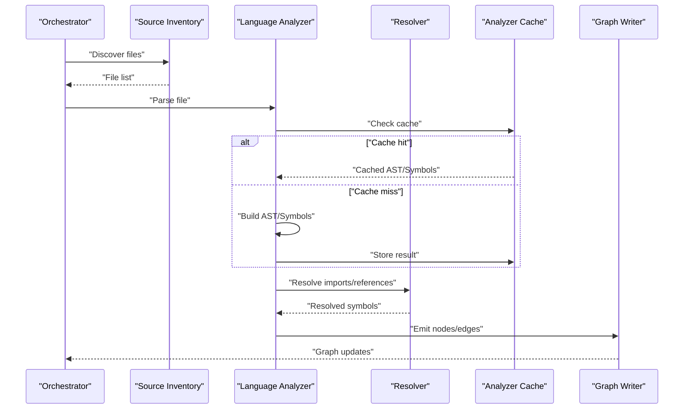
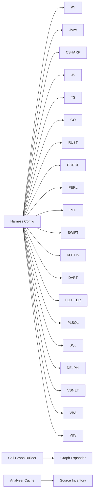

# Language Support & Analyzers

<cite>
**Referenced Files in This Document**
- [python_analyzer.py](file://code-tiny/tools/python/python_analyzer.py)
- [java_analyzer.py](file://code-tiny/tools/java/java_analyzer.py)
- [csharp_analyzer.py](file://code-tiny/tools/csharp/csharp_analyzer.py)
- [js_analyzer.py](file://code-tiny/tools/js/js_analyzer.py)
- [ts_analyzer.py](file://code-tiny/tools/ts/ts_analyzer.py)
- [go_analyzer.py](file://code-tiny/tools/go/go_analyzer.py)
- [rust_analyzer.py](file://code-tiny/tools/rust/rust_analyzer.py)
- [cobol_analyzer.py](file://code-tiny/tools/cobol/cobol_analyzer.py)
- [perl_analyzer.py](file://code-tiny/tools/perl/perl_analyzer.py)
- [php_analyzer.py](file://code-tiny/tools/php/php_analyzer.py)
- [swift_analyzer.py](file://code-tiny/tools/swift/swift_analyzer.py)
- [kotlin_analyzer.py](file://code-tiny/tools/kotlin/kotlin_analyzer.py)
- [dart_parser.py](file://code-tiny/tools/flutter/dart_parser.py)
- [flutter_analyzer.py](file://code-tiny/tools/flutter/flutter_analyzer.py)
- [plsql_analyzer.py](file://code-tiny/tools/plsql/plsql_analyzer.py)
- [sql_analyzer.py](file://code-tiny/tools/sql/sql_analyzer.py)
- [delphi_analyzer.py](file://code-tiny/tools/delphi/delphi_analyzer.py)
- [vbnet_analyzer.py](file://code-tiny/tools/vb/vbnet_analyzer.py)
- [vba_analyzer.py](file://code-tiny/tools/vb/vba_analyzer.py)
- [vbscript_analyzer.py](file://code-tiny/tools/vb/vbscript_analyzer.py)
- [harness_config.py](file://code-tiny/tools/common/harness_config.py)
- [analyzer_cache.py](file://code-tiny/tools/common/analyzer_cache.py)
- [call_graph_builder.py](file://code-tiny/tools/common/call_graph_builder.py)
- [graph_expander.py](file://code-tiny/tools/common/graph_expander.py)
- [source_inventory.py](file://code-tiny/tools/common/source_inventory.py)
- [pipeline.py](file://code-tiny/tools/database_schema/pipeline.py)
- [database_schema_analyzer.py](file://code-tiny/tools/database_schema/database_schema_analyzer.py)
- [models.py](file://code-tiny/tools/database_schema/models.py)
- [spring_analyzer.py](file://code-tiny/tools/spring/spring_analyzer.py)
- [aspnet_core_analyzer.py](file://code-tiny/tools/aspnet_core/aspnet_core_analyzer.py)
- [servlet_jsp_analyzer.py](file://code-tiny/tools/servlet_jsp/servlet_jsp_analyzer.py)
- [struts_analyzer.py](file://code-tiny/tools/struts/struts_analyzer.py)
- [mybatis_analyzer.py](file://code-tiny/tools/mybatis/mybatis_analyzer.py)
- [web_framework_analyzer.py](file://code-tiny/tools/web_framework/web_framework_analyzer.py)
- [CLAUDE.md](file://code-tiny/tools/python/CLAUDE.md)
- [CLAUDE.md](file://code-tiny/tools/java/CLAUDE.md)
- [CLAUDE.md](file://code-tiny/tools/csharp/CLAUDE.md)
- [CLAUDE.md](file://code-tiny/tools/js/CLAUDE.md)
- [CLAUDE.md](file://code-tiny/tools/kotlin/CLAUDE.md)
</cite>

## Table of Contents
1. [Introduction](#introduction)
2. [Project Structure](#project-structure)
3. [Core Components](#core-components)
4. [Architecture Overview](#architecture-overview)
5. [Detailed Component Analysis](#detailed-component-analysis)
6. [Dependency Analysis](#dependency-analysis)
7. [Performance Considerations](#performance-considerations)
8. [Troubleshooting Guide](#troubleshooting-guide)
9. [Conclusion](#conclusion)
10. [Appendices](#appendices)

## Introduction
This document provides comprehensive language support documentation for Cortex Harness, covering 20+ programming languages and frameworks. It explains language-specific configuration options, detection rules, analysis capabilities, symbol resolution, import tracking, relationship extraction, performance tuning, limitations, and extension mechanisms through custom analyzers and parser implementations.

## Project Structure
Cortex Harness organizes language support as modular analyzers under tools/<language>. Each analyzer typically includes:
- A primary analyzer module implementing the language-specific parsing and graph construction
- Optional pipeline orchestration and resolver modules
- Shared utilities from tools/common for caching, call graphs, graph expansion, and source inventory
- Framework overlays (Spring, ASP.NET Core, Servlet/JSP, Struts, MyBatis) that extend language analyzers with framework semantics

```mermaid
graph TB
subgraph "Language Analyzers"
PY["Python Analyzer"]
JAVA["Java Analyzer"]
CSHARP["C# Analyzer"]
JS["JS Analyzer"]
TS["TS Analyzer"]
GO["Go Analyzer"]
RUST["Rust Analyzer"]
COBOL["COBOL Analyzer"]
PERL["Perl Analyzer"]
PHP["PHP Analyzer"]
SWIFT["Swift Analyzer"]
KOTLIN["Kotlin Analyzer"]
DART["Dart Parser"]
FLUTTER["Flutter Analyzer"]
PLSQL["PL/SQL Analyzer"]
SQL["SQL Analyzer"]
DELPHI["Delphi Analyzer"]
VBNET["VB.NET Analyzer"]
VBA["VBA Analyzer"]
VBS["VBScript Analyzer"]
end
subgraph "Framework Overlays"
SPRING["Spring Analyzer"]
ASPNET["ASP.NET Core Analyzer"]
SERVLET["Servlet/JSP Analyzer"]
STRUTS["Struts Analyzer"]
MYBATIS["MyBatis Analyzer"]
WEBFW["Web Framework Analyzer"]
end
subgraph "Common Utilities"
CACHE["Analyzer Cache"]
CG["Call Graph Builder"]
EXPAND["Graph Expander"]
INV["Source Inventory"]
HCFG["Harness Config"]
end
PY --> HCFG
JAVA --> HCFG
CSHARP --> HCFG
JS --> HCFG
TS --> HCFG
GO --> HCFG
RUST --> HCFG
COBOL --> HCFG
PERL --> HCFG
PHP --> HCFG
SWIFT --> HCFG
KOTLIN --> HCFG
DART --> HCFG
FLUTTER --> HCFG
PLSQL --> HCFG
SQL --> HCFG
DELPHI --> HCFG
VBNET --> HCFG
VBA --> HCFG
VBS --> HCFG
SPRING --> JAVA
ASPNET --> CSHARP
SERVLET --> JAVA
STRUTS --> JAVA
MYBATIS --> JAVA
SPRING --> EXPAND
ASPNET --> EXPAND
SERVLET --> EXPAND
STRUTS --> EXPAND
MYBATIS --> EXPAND
CG --> EXPAND
CACHE --> INV
```

**Diagram sources**
- [python_analyzer.py](file://code-tiny/tools/python/python_analyzer.py)
- [java_analyzer.py](file://code-tiny/tools/java/java_analyzer.py)
- [csharp_analyzer.py](file://code-tiny/tools/csharp/csharp_analyzer.py)
- [js_analyzer.py](file://code-tiny/tools/js/js_analyzer.py)
- [ts_analyzer.py](file://code-tiny/tools/ts/ts_analyzer.py)
- [go_analyzer.py](file://code-tiny/tools/go/go_analyzer.py)
- [rust_analyzer.py](file://code-tiny/tools/rust/rust_analyzer.py)
- [cobol_analyzer.py](file://code-tiny/tools/cobol/cobol_analyzer.py)
- [perl_analyzer.py](file://code-tiny/tools/perl/perl_analyzer.py)
- [php_analyzer.py](file://code-tiny/tools/php/php_analyzer.py)
- [swift_analyzer.py](file://code-tiny/tools/swift/swift_analyzer.py)
- [kotlin_analyzer.py](file://code-tiny/tools/kotlin/kotlin_analyzer.py)
- [dart_parser.py](file://code-tiny/tools/flutter/dart_parser.py)
- [flutter_analyzer.py](file://code-tiny/tools/flutter/flutter_analyzer.py)
- [plsql_analyzer.py](file://code-tiny/tools/plsql/plsql_analyzer.py)
- [sql_analyzer.py](file://code-tiny/tools/sql/sql_analyzer.py)
- [delphi_analyzer.py](file://code-tiny/tools/delphi/delphi_analyzer.py)
- [vbnet_analyzer.py](file://code-tiny/tools/vb/vbnet_analyzer.py)
- [vba_analyzer.py](file://code-tiny/tools/vb/vba_analyzer.py)
- [vbscript_analyzer.py](file://code-tiny/tools/vb/vbscript_analyzer.py)
- [spring_analyzer.py](file://code-tiny/tools/spring/spring_analyzer.py)
- [aspnet_core_analyzer.py](file://code-tiny/tools/aspnet_core/aspnet_core_analyzer.py)
- [servlet_jsp_analyzer.py](file://code-tiny/tools/servlet_jsp/servlet_jsp_analyzer.py)
- [struts_analyzer.py](file://code-tiny/tools/struts/struts_analyzer.py)
- [mybatis_analyzer.py](file://code-tiny/tools/mybatis/mybatis_analyzer.py)
- [web_framework_analyzer.py](file://code-tiny/tools/web_framework/web_framework_analyzer.py)
- [analyzer_cache.py](file://code-tiny/tools/common/analyzer_cache.py)
- [call_graph_builder.py](file://code-tiny/tools/common/call_graph_builder.py)
- [graph_expander.py](file://code-tiny/tools/common/graph_expander.py)
- [source_inventory.py](file://code-tiny/tools/common/source_inventory.py)
- [harness_config.py](file://code-tiny/tools/common/harness_config.py)

**Section sources**
- [harness_config.py](file://code-tiny/tools/common/harness_config.py)
- [analyzer_cache.py](file://code-tiny/tools/common/analyzer_cache.py)
- [call_graph_builder.py](file://code-tiny/tools/common/call_graph_builder.py)
- [graph_expander.py](file://code-tiny/tools/common/graph_expander.py)
- [source_inventory.py](file://code-tiny/tools/common/source_inventory.py)

## Core Components
- Language Analyzers: Implement per-language parsing, symbol extraction, import tracking, and relationship building. They integrate with shared utilities to produce a unified code graph.
- Framework Overlays: Extend language analyzers with framework-specific semantics (e.g., Spring annotations, ASP.NET routes, JSP tag libraries).
- Common Utilities: Provide caching, call graph construction, graph expansion, and source inventory management to improve performance and consistency across analyzers.

Key responsibilities:
- Detection rules: Identify supported files by extensions and project structure markers.
- Configuration options: Allow customization of include/exclude patterns, dialects, and runtime dependencies.
- Symbol resolution: Resolve imports, references, and cross-file relationships.
- Relationship extraction: Build edges such as calls, uses, extends/implements, and data flow.

**Section sources**
- [python_analyzer.py](file://code-tiny/tools/python/python_analyzer.py)
- [java_analyzer.py](file://code-tiny/tools/java/java_analyzer.py)
- [csharp_analyzer.py](file://code-tiny/tools/csharp/csharp_analyzer.py)
- [js_analyzer.py](file://code-tiny/tools/js/js_analyzer.py)
- [ts_analyzer.py](file://code-tiny/tools/ts/ts_analyzer.py)
- [go_analyzer.py](file://code-tiny/tools/go/go_analyzer.py)
- [rust_analyzer.py](file://code-tiny/tools/rust/rust_analyzer.py)
- [cobol_analyzer.py](file://code-tiny/tools/cobol/cobol_analyzer.py)
- [perl_analyzer.py](file://code-tiny/tools/perl/perl_analyzer.py)
- [php_analyzer.py](file://code-tiny/tools/php/php_analyzer.py)
- [swift_analyzer.py](file://code-tiny/tools/swift/swift_analyzer.py)
- [kotlin_analyzer.py](file://code-tiny/tools/kotlin/kotlin_analyzer.py)
- [dart_parser.py](file://code-tiny/tools/flutter/dart_parser.py)
- [flutter_analyzer.py](file://code-tiny/tools/flutter/flutter_analyzer.py)
- [plsql_analyzer.py](file://code-tiny/tools/plsql/plsql_analyzer.py)
- [sql_analyzer.py](file://code-tiny/tools/sql/sql_analyzer.py)
- [delphi_analyzer.py](file://code-tiny/tools/delphi/delphi_analyzer.py)
- [vbnet_analyzer.py](file://code-tiny/tools/vb/vbnet_analyzer.py)
- [vba_analyzer.py](file://code-tiny/tools/vb/vba_analyzer.py)
- [vbscript_analyzer.py](file://code-tiny/tools/vb/vbscript_analyzer.py)
- [spring_analyzer.py](file://code-tiny/tools/spring/spring_analyzer.py)
- [aspnet_core_analyzer.py](file://code-tiny/tools/aspnet_core/aspnet_core_analyzer.py)
- [servlet_jsp_analyzer.py](file://code-tiny/tools/servlet_jsp/servlet_jsp_analyzer.py)
- [struts_analyzer.py](file://code-tiny/tools/struts/struts_analyzer.py)
- [mybatis_analyzer.py](file://code-tiny/tools/mybatis/mybatis_analyzer.py)
- [web_framework_analyzer.py](file://code-tiny/tools/web_framework/web_framework_analyzer.py)

## Architecture Overview
The architecture layers language analyzers over common utilities and optional framework overlays. The harness orchestrates scanning, parsing, resolution, and graph writing.

**Diagram sources**
- [source_inventory.py](file://code-tiny/tools/common/source_inventory.py)
- [analyzer_cache.py](file://code-tiny/tools/common/analyzer_cache.py)
- [call_graph_builder.py](file://code-tiny/tools/common/call_graph_builder.py)
- [graph_expander.py](file://code-tiny/tools/common/graph_expander.py)
- [harness_config.py](file://code-tiny/tools/common/harness_config.py)

## Detailed Component Analysis

### Python
- Capabilities: Module/package discovery, function/class definitions, imports, decorators, dynamic attributes handling.
- Configuration: Include/exclude patterns, virtual environment paths, dependency resolution flags.
- Symbol Resolution: Resolves relative imports, package-level names, and third-party modules when available.
- Relationships: Calls, imports, class inheritance, method overrides.
- Limitations: Dynamic imports may be partially resolved; heavy runtime introspection is not performed.

**Section sources**
- [python_analyzer.py](file://code-tiny/tools/python/python_analyzer.py)
- [CLAUDE.md](file://code-tiny/tools/python/CLAUDE.md)

### Java
- Capabilities: Class/method extraction, annotation processing, generics, interfaces, packages.
- Configuration: Source roots, classpath entries, annotation processors, JDK version.
- Symbol Resolution: Resolves fully qualified names, imports, and library symbols via classpath.
- Relationships: Inheritance, implementation, method calls, field access.
- Limitations: Complex build scripts may require explicit classpath configuration.

**Section sources**
- [java_analyzer.py](file://code-tiny/tools/java/java_analyzer.py)
- [CLAUDE.md](file://code-tiny/tools/java/CLAUDE.md)

### C# (.NET)
- Capabilities: Classes, methods, properties, events, attributes, namespaces.
- Configuration: Project files (.csproj), NuGet packages, target framework.
- Symbol Resolution: Uses Roslyn-based parsing for accurate symbol resolution.
- Relationships: Inherits, implements, calls, attribute usage.
- Limitations: Requires .NET SDK availability; some dynamic features are limited.

**Section sources**
- [csharp_analyzer.py](file://code-tiny/tools/csharp/csharp_analyzer.py)
- [CLAUDE.md](file://code-tiny/tools/csharp/CLAUDE.md)

### JavaScript
- Capabilities: Functions, classes, modules (CommonJS/ESM), dynamic requires.
- Configuration: Node_modules resolution, Babel/TypeScript transpilation settings.
- Symbol Resolution: Static imports/exports; dynamic requires may be approximated.
- Relationships: Imports, exports, function calls, prototype chains.
- Limitations: Heavy dynamic patterns can reduce accuracy.

**Section sources**
- [js_analyzer.py](file://code-tiny/tools/js/js_analyzer.py)
- [CLAUDE.md](file://code-tiny/tools/js/CLAUDE.md)

### TypeScript
- Capabilities: Types, interfaces, enums, modules, decorators, JSX/TSX.
- Configuration: tsconfig.json, path mappings, lib targets.
- Symbol Resolution: Leverages TypeScript compiler API for precise resolution.
- Relationships: Type references, imports, decorators, generic parameters.
- Limitations: Complex type-only constructs may not affect runtime graph.

**Section sources**
- [ts_analyzer.py](file://code-tiny/tools/ts/ts_analyzer.py)

### Go
- Capabilities: Packages, functions, types, interfaces, generics.
- Configuration: GOPATH/GOMOD, vendor directories, build tags.
- Symbol Resolution: Uses go/parser and go/types for accurate resolution.
- Relationships: Imports, method calls, interface implementations.
- Limitations: Conditional compilation via build tags may omit symbols.

**Section sources**
- [go_analyzer.py](file://code-tiny/tools/go/go_analyzer.py)

### Rust
- Capabilities: Modules, functions, structs, traits, macros.
- Configuration: Cargo workspace, feature flags, edition.
- Symbol Resolution: Uses rust-analyzer or cargo metadata where available.
- Relationships: Imports, trait implementations, macro expansions.
- Limitations: Macro-heavy code may require additional configuration.

**Section sources**
- [rust_analyzer.py](file://code-tiny/tools/rust/rust_analyzer.py)

### COBOL
- Capabilities: Programs, sections, paragraphs, copybooks, data items.
- Configuration: Copybook paths, dialects (IBM Micro Focus, GnuCOBOL), source formats.
- Symbol Resolution: Resolves COPY statements and external references.
- Relationships: CALL, PERFORM, data linkage.
- Limitations: Legacy formatting and mixed-case identifiers require careful normalization.

**Section sources**
- [cobol_analyzer.py](file://code-tiny/tools/cobol/cobol_analyzer.py)

### Perl
- Capabilities: Packages, subroutines, modules, use/include directives.
- Configuration: @INC paths, pragma handling, CPAN modules.
- Symbol Resolution: Static analysis of use/lib; dynamic eval is not executed.
- Relationships: Subroutine calls, module imports.
- Limitations: Heavily dynamic code reduces precision.

**Section sources**
- [perl_analyzer.py](file://code-tiny/tools/perl/perl_analyzer.py)

### PHP
- Capabilities: Classes, functions, namespaces, traits, autoloaders.
- Configuration: Composer autoloading, PSR-4 mappings.
- Symbol Resolution: Resolves namespace imports and composer autoload maps.
- Relationships: Class inheritance, method calls, trait usage.
- Limitations: Runtime-loaded classes may be missed without explicit config.

**Section sources**
- [php_analyzer.py](file://code-tiny/tools/php/php_analyzer.py)

### Swift
- Capabilities: Classes, structs, protocols, extensions, modules.
- Configuration: Package.swift, Xcode project references.
- Symbol Resolution: Uses swift-syntax or sourcekit where available.
- Relationships: Protocol conformance, inheritance, method calls.
- Limitations: Platform-specific APIs may be excluded.

**Section sources**
- [swift_analyzer.py](file://code-tiny/tools/swift/swift_analyzer.py)

### Kotlin
- Capabilities: Classes, functions, data classes, annotations, coroutines.
- Configuration: Gradle/KMP targets, JVM/JS/Native variants.
- Symbol Resolution: Resolves imports and annotations via Kotlin compiler integration.
- Relationships: Inheritance, interface implementation, suspend functions.
- Limitations: Multiplatform targets require explicit configuration.

**Section sources**
- [kotlin_analyzer.py](file://code-tiny/tools/kotlin/kotlin_analyzer.py)
- [CLAUDE.md](file://code-tiny/tools/kotlin/CLAUDE.md)

### Dart/Flutter
- Capabilities: Classes, functions, mixins, async/await, Flutter widgets.
- Configuration: pubspec.yaml, analysis_options.yaml, Flutter SDK path.
- Symbol Resolution: Uses dart analyzer for accurate resolution.
- Relationships: Widget composition, state management, service bindings.
- Limitations: Generated code (build_runner) must be present for full coverage.

**Section sources**
- [dart_parser.py](file://code-tiny/tools/flutter/dart_parser.py)
- [flutter_analyzer.py](file://code-tiny/tools/flutter/flutter_analyzer.py)

### PL/SQL
- Capabilities: Procedures, functions, packages, triggers, cursors.
- Configuration: Database connection, schema filters, compilation units.
- Symbol Resolution: Resolves package bodies, forward declarations.
- Relationships: Calls, exception handling, cursor usage.
- Limitations: Requires database connectivity for deep resolution.

**Section sources**
- [plsql_analyzer.py](file://code-tiny/tools/plsql/plsql_analyzer.py)

### SQL
- Capabilities: Tables, views, stored procedures, functions, triggers.
- Configuration: Dialect (MySQL, PostgreSQL, Oracle), schema discovery.
- Symbol Resolution: Resolves foreign keys, view dependencies.
- Relationships: Data lineage, procedure calls.
- Limitations: Dynamic SQL within procedures is not analyzed.

**Section sources**
- [sql_analyzer.py](file://code-tiny/tools/sql/sql_analyzer.py)

### Delphi
- Capabilities: Units, classes, records, interfaces, forms.
- Configuration: IDE project files, search paths.
- Symbol Resolution: Resolves unit uses and interface implementations.
- Relationships: Class inheritance, method calls, event handlers.
- Limitations: Late-bound components may be missed.

**Section sources**
- [delphi_analyzer.py](file://code-tiny/tools/delphi/delphi_analyzer.py)

### VB.NET
- Capabilities: Classes, modules, properties, events, attributes.
- Configuration: Visual Studio projects, .NET SDK.
- Symbol Resolution: Uses Roslyn for accurate resolution.
- Relationships: Inherits, implements, calls, attribute usage.
- Limitations: Some designer-generated code may be noisy.

**Section sources**
- [vbnet_analyzer.py](file://code-tiny/tools/vb/vbnet_analyzer.py)

### VBA
- Capabilities: Modules, procedures, user forms, references.
- Configuration: Host application (Excel, Access), reference libraries.
- Symbol Resolution: Static analysis of Dim/As declarations.
- Relationships: Procedure calls, form interactions.
- Limitations: Host-specific APIs are not deeply analyzed.

**Section sources**
- [vba_analyzer.py](file://code-tiny/tools/vb/vba_analyzer.py)

### VBScript
- Capabilities: Scripts, functions, classes (limited), WMI/COM references.
- Configuration: Execution context, COM registration.
- Symbol Resolution: Static imports and object creation patterns.
- Relationships: Function calls, COM method invocations.
- Limitations: COM late binding reduces precision.

**Section sources**
- [vbscript_analyzer.py](file://code-tiny/tools/vb/vbscript_analyzer.py)

### Framework Overlays

#### Spring (Java/Kotlin)
- Extends Java/Kotlin analyzers with annotation-driven wiring (@Controller, @Service, @Repository).
- Extracts REST endpoints, bean dependencies, and aspect-oriented relationships.
- Configuration: Spring profiles, component scan paths.

**Section sources**
- [spring_analyzer.py](file://code-tiny/tools/spring/spring_analyzer.py)

#### ASP.NET Core (C#)
- Extends C# analyzer with routing, controllers, middleware, and DI registrations.
- Configuration: Program.cs, Startup, appsettings.json.

**Section sources**
- [aspnet_core_analyzer.py](file://code-tiny/tools/aspnet_core/aspnet_core_analyzer.py)

#### Servlet/JSP (Java)
- Extends Java analyzer with servlet mappings, JSP tag libraries, EL expressions.
- Configuration: web.xml, JSP include paths.

**Section sources**
- [servlet_jsp_analyzer.py](file://code-tiny/tools/servlet_jsp/servlet_jsp_analyzer.py)

#### Struts (Java)
- Extends Java analyzer with action mappings, validation configurations.
- Configuration: struts.xml, validation.xml.

**Section sources**
- [struts_analyzer.py](file://code-tiny/tools/struts/struts_analyzer.py)

#### MyBatis (Java)
- Extends Java analyzer with mapper interfaces and XML SQL mapping.
- Configuration: Mapper locations, SQL dialects.

**Section sources**
- [mybatis_analyzer.py](file://code-tiny/tools/mybatis/mybatis_analyzer.py)

#### Web Framework Overlay
- Generic overlay for detecting web-related artifacts across languages.
- Configuration: Route patterns, template engines.

**Section sources**
- [web_framework_analyzer.py](file://code-tiny/tools/web_framework/web_framework_analyzer.py)

### Database Schema Overlay
- Provides schema discovery and analysis for SQL and procedural code.
- Pipeline orchestrates schema parsing and graph emission.

**Section sources**
- [pipeline.py](file://code-tiny/tools/database_schema/pipeline.py)
- [database_schema_analyzer.py](file://code-tiny/tools/database_schema/database_schema_analyzer.py)
- [models.py](file://code-tiny/tools/database_schema/models.py)

## Dependency Analysis
Analyzers depend on shared utilities for caching, call graph construction, and graph expansion. Framework overlays depend on language analyzers and may add their own resolvers.

**Diagram sources**
- [harness_config.py](file://code-tiny/tools/common/harness_config.py)
- [analyzer_cache.py](file://code-tiny/tools/common/analyzer_cache.py)
- [call_graph_builder.py](file://code-tiny/tools/common/call_graph_builder.py)
- [graph_expander.py](file://code-tiny/tools/common/graph_expander.py)
- [source_inventory.py](file://code-tiny/tools/common/source_inventory.py)

**Section sources**
- [analyzer_cache.py](file://code-tiny/tools/common/analyzer_cache.py)
- [call_graph_builder.py](file://code-tiny/tools/common/call_graph_builder.py)
- [graph_expander.py](file://code-tiny/tools/common/graph_expander.py)
- [source_inventory.py](file://code-tiny/tools/common/source_inventory.py)
- [harness_config.py](file://code-tiny/tools/common/harness_config.py)

## Performance Considerations
- Enable analyzer cache to avoid re-parsing unchanged files.
- Use incremental sync to limit scope to changed files and related dependencies.
- Configure include/exclude patterns to reduce scanning overhead.
- For large repositories, prefer static analysis modes and disable heavy runtime introspection.
- Tune call graph builder depth and graph expander breadth to balance completeness vs. performance.

[No sources needed since this section provides general guidance]

## Troubleshooting Guide
- Symbol resolution failures: Verify classpath/module paths and ensure required dependencies are present.
- Missing imports: Check include/exclude patterns and ensure correct file extensions are recognized.
- Framework-specific issues: Confirm framework configuration files (e.g., tsconfig.json, pom.xml, csproj) are discoverable.
- Incremental sync inconsistencies: Validate lock files and change detection logic; clear caches if necessary.

**Section sources**
- [analyzer_cache.py](file://code-tiny/tools/common/analyzer_cache.py)
- [source_inventory.py](file://code-tiny/tools/common/source_inventory.py)

## Conclusion
Cortex Harness provides robust, extensible language support across 20+ languages and major frameworks. By leveraging shared utilities and framework overlays, it delivers consistent symbol resolution, import tracking, and relationship extraction. Proper configuration and performance tuning enable scalable analysis for large, heterogeneous codebases.

[No sources needed since this section summarizes without analyzing specific files]

## Appendices

### Configuration Examples
- Python: Set virtualenv path and exclude test directories.
- Java: Define source roots and classpath entries for multi-module builds.
- TypeScript: Configure path mappings and lib targets for modern syntax.
- Flutter: Point to Flutter SDK and ensure generated code exists.
- Database Schema: Specify dialect and schema filters for targeted analysis.

[No sources needed since this section provides general guidance]

### Extending Language Support
- Implement a new analyzer following the existing pattern: parse source, extract symbols, resolve references, emit graph nodes/edges.
- Integrate with harness config for detection rules and options.
- Add framework overlay if applicable to enrich semantics.
- Utilize common utilities for caching and graph operations.

[No sources needed since this section provides general guidance]