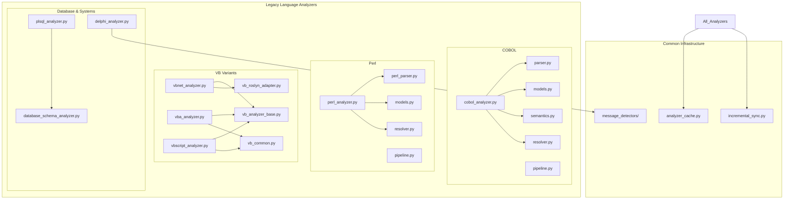
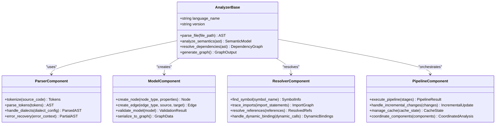
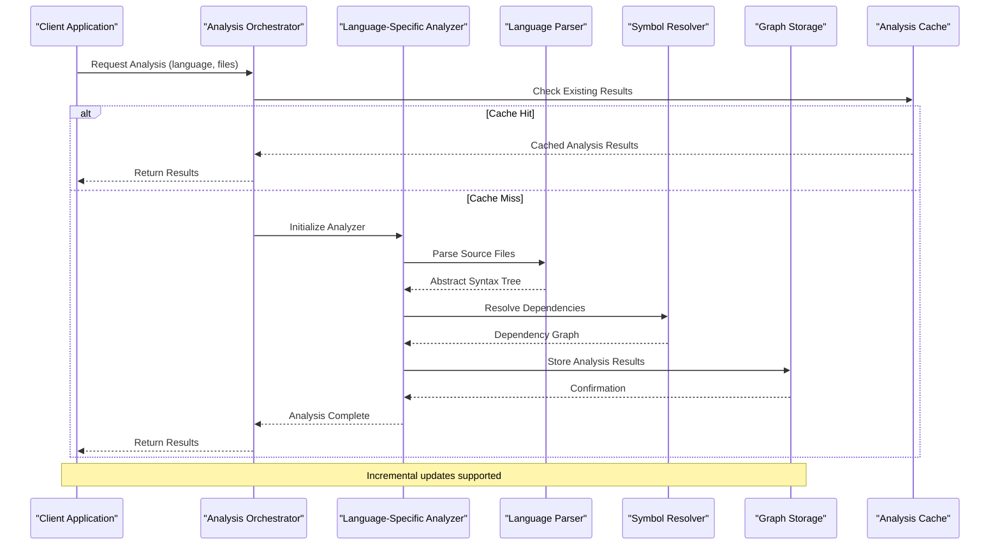
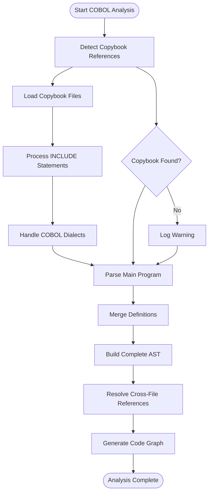
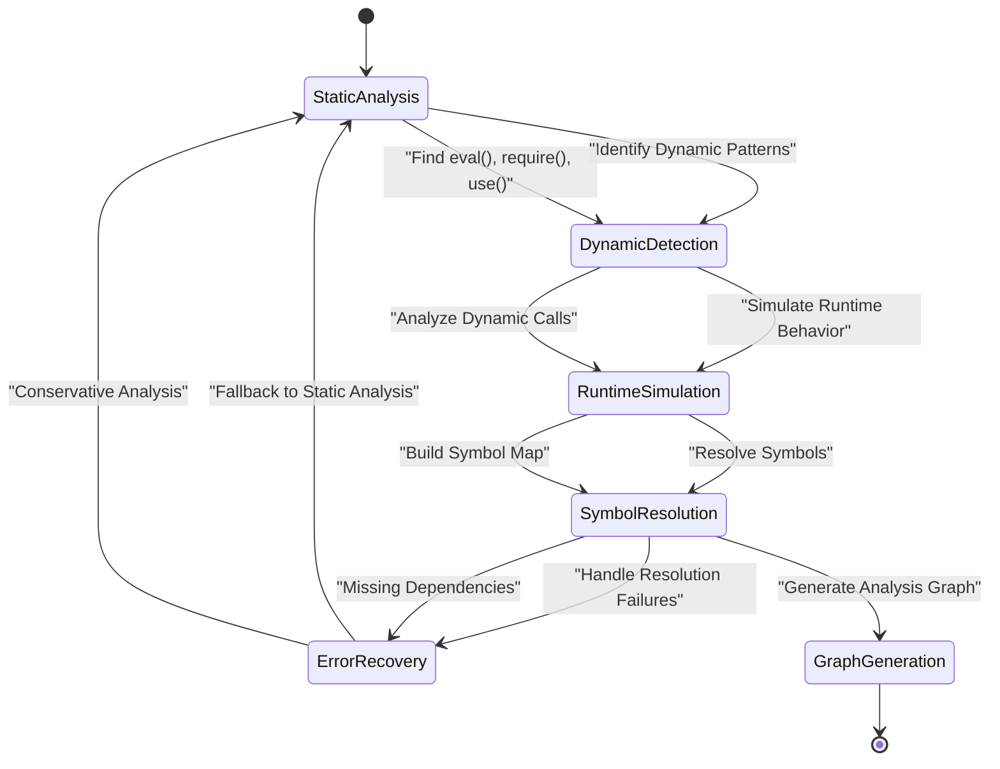
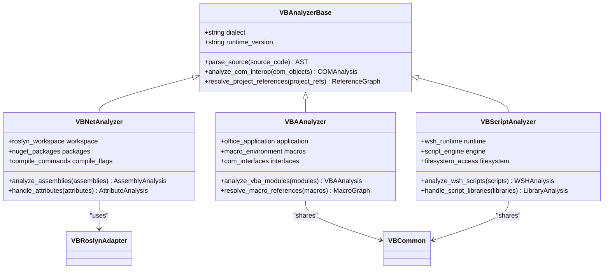
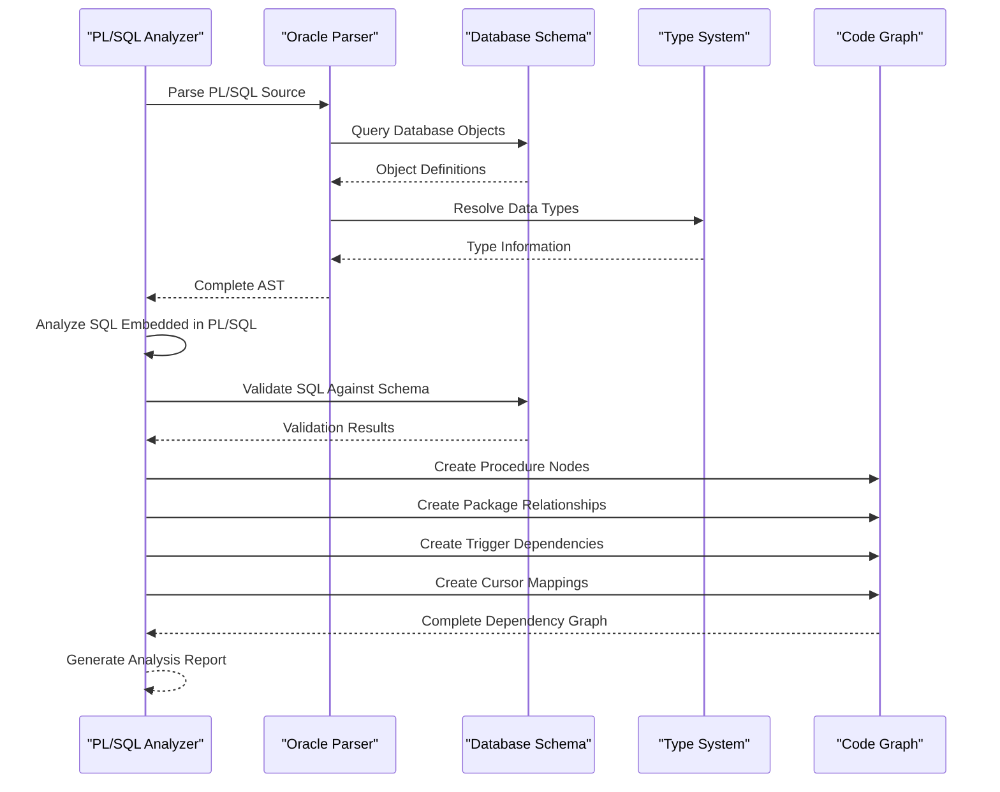
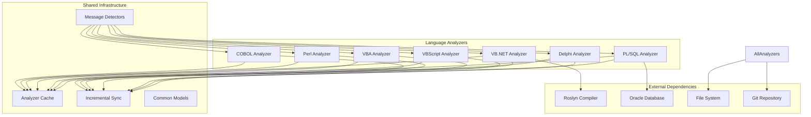
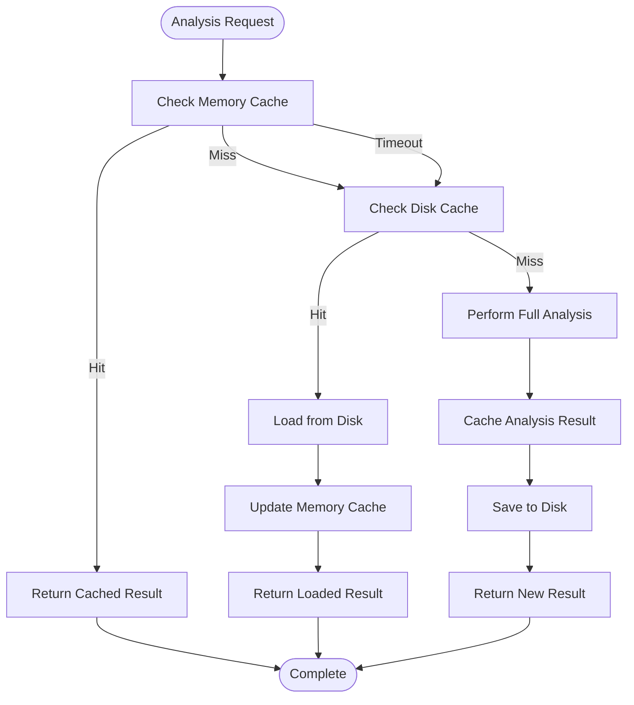

# Legacy System Support

<cite>
**Referenced Files in This Document**
- [cobol_analyzer.py](file://code-tiny/tools/cobol/cobol_analyzer.py)
- [parser.py](file://code-tiny/tools/cobol/parser.py)
- [models.py](file://code-tiny/tools/cobol/models.py)
- [semantics.py](file://code-tiny/tools/cobol/semantics.py)
- [resolver.py](file://code-tiny/tools/cobol/resolver.py)
- [pipeline.py](file://code-tiny/tools/cobol/pipeline.py)
- [perl_analyzer.py](file://code-tiny/tools/perl/perl_analyzer.py)
- [perl_parser.py](file://code-tiny/tools/perl/perl_parser.py)
- [models.py](file://code-tiny/tools/perl/models.py)
- [resolver.py](file://code-tiny/tools/perl/resolver.py)
- [pipeline.py](file://code-tiny/tools/perl/pipeline.py)
- [vbnet_analyzer.py](file://code-tiny/tools/vb/vbnet_analyzer.py)
- [vba_analyzer.py](file://code-tiny/tools/vb/vba_analyzer.py)
- [vbscript_analyzer.py](file://code-tiny/tools/vb/vbscript_analyzer.py)
- [vb_analyzer_base.py](file://code-tiny/tools/vb/vb_analyzer_base.py)
- [vb_common.py](file://code-tiny/tools/vb/vb_common.py)
- [vb_roslyn_adapter.py](file://code-tiny/tools/vb/vb_roslyn_adapter.py)
- [plsql_analyzer.py](file://code-tiny/tools/plsql/plsql_analyzer.py)
- [delphi_analyzer.py](file://code-tiny/tools/delphi/delphi_analyzer.py)
- [message_detectors.py](file://code-tiny/tools/common/message_detectors/)
- [database_schema_analyzer.py](file://code-tiny/tools/database_schema/database_schema_analyzer.py)
- [incremental_sync.py](file://code-tiny/tools/sync/incremental_sync.py)
- [analyzer_cache.py](file://code-tiny/tools/common/analyzer_cache.py)
</cite>

## Table of Contents
1. [Introduction](#introduction)
2. [Project Structure](#project-structure)
3. [Core Components](#core-components)
4. [Architecture Overview](#architecture-overview)
5. [Detailed Component Analysis](#detailed-component-analysis)
6. [Dependency Analysis](#dependency-analysis)
7. [Performance Considerations](#performance-considerations)
8. [Troubleshooting Guide](#troubleshooting-guide)
9. [Migration Strategies](#migration-strategies)
10. [Configuration Examples](#configuration-examples)
11. [Conclusion](#conclusion)

## Introduction

This document provides comprehensive documentation for legacy system language support within the Cortex Harness framework. It covers specialized parsing techniques for COBOL, Perl, VB.NET, VBA, VBScript, PL/SQL, and Delphi analyzers. The documentation explains copybook handling for COBOL, script execution context for VB variants, database integration patterns for PL/SQL, migration strategies from legacy systems, incremental analysis approaches for large monolithic applications, and performance considerations for resource-intensive legacy code analysis.

The legacy system support is designed to handle complex, heterogeneous codebases that often contain multiple programming languages and technologies coexisting in enterprise environments. Each analyzer implements specialized techniques to address the unique challenges posed by legacy code structures, dialects, and runtime environments.

## Project Structure

The legacy system support is organized into language-specific analyzer modules under the `code-tiny/tools/` directory. Each language has its own dedicated folder containing analyzer implementations, parsers, models, and supporting utilities.



**Diagram sources**
- [cobol_analyzer.py:1-50](file://code-tiny/tools/cobol/cobol_analyzer.py#L1-L50)
- [perl_analyzer.py:1-50](file://code-tiny/tools/perl/perl_analyzer.py#L1-L50)
- [vbnet_analyzer.py:1-50](file://code-tiny/tools/vb/vbnet_analyzer.py#L1-L50)
- [plsql_analyzer.py:1-50](file://code-tiny/tools/plsql/plsql_analyzer.py#L1-L50)

**Section sources**
- [cobol_analyzer.py:1-100](file://code-tiny/tools/cobol/cobol_analyzer.py#L1-L100)
- [perl_analyzer.py:1-100](file://code-tiny/tools/perl/perl_analyzer.py#L1-L100)
- [vbnet_analyzer.py:1-100](file://code-tiny/tools/vb/vbnet_analyzer.py#L1-L100)

## Core Components

The legacy system support architecture consists of several core components that work together to provide comprehensive analysis capabilities across different legacy languages.

### Analyzer Base Architecture

Each language analyzer follows a consistent architectural pattern with specialized components:



**Diagram sources**
- [cobol_analyzer.py:15-80](file://code-tiny/tools/cobol/cobol_analyzer.py#L15-L80)
- [perl_analyzer.py:15-80](file://code-tiny/tools/perl/perl_analyzer.py#L15-L80)
- [vb_analyzer_base.py:10-60](file://code-tiny/tools/vb/vb_analyzer_base.py#L10-L60)

### Specialized Parsing Techniques

Each legacy language requires specialized parsing techniques due to their unique characteristics:

#### COBOL Copybook Handling
COBOL programs frequently use copybooks for shared data definitions and procedure divisions. The parser implements sophisticated copybook resolution and inclusion mechanisms.

#### Perl Dynamic Resolution
Perl's dynamic nature requires runtime-aware parsing to handle symbolic references, eval blocks, and dynamic module loading.

#### VB Script Execution Context
VB variants (VB.NET, VBA, VBScript) require understanding of their respective execution contexts, including COM interop, Office automation, and Windows scripting host environments.

#### PL/SQL Database Integration
PL/SQL analysis requires deep understanding of Oracle database semantics, including stored procedures, triggers, packages, and SQL embedded within procedural code.

**Section sources**
- [parser.py:1-150](file://code-tiny/tools/cobol/parser.py#L1-L150)
- [perl_parser.py:1-150](file://code-tiny/tools/perl/perl_parser.py#L1-L150)
- [vb_roslyn_adapter.py:1-100](file://code-tiny/tools/vb/vb_roslyn_adapter.py#L1-L100)
- [plsql_analyzer.py:1-100](file://code-tiny/tools/plsql/plsql_analyzer.py#L1-L100)

## Architecture Overview

The legacy system support architecture follows a modular design pattern that allows each language analyzer to operate independently while sharing common infrastructure components.



**Diagram sources**
- [pipeline.py:1-100](file://code-tiny/tools/cobol/pipeline.py#L1-L100)
- [pipeline.py:1-100](file://code-tiny/tools/perl/pipeline.py#L1-L100)
- [incremental_sync.py:1-100](file://code-tiny/tools/sync/incremental_sync.py#L1-L100)

## Detailed Component Analysis

### COBOL Analyzer

The COBOL analyzer implements comprehensive support for COBOL legacy systems, including advanced copybook handling, dialect detection, and mainframe-specific features.

#### Copybook Processing Pipeline



**Diagram sources**
- [parser.py:50-200](file://code-tiny/tools/cobol/parser.py#L50-L200)
- [semantics.py:1-150](file://code-tiny/tools/cobol/semantics.py#L1-L150)

#### Key Features
- **Copybook Resolution**: Automatic discovery and processing of COBOL copybooks with path resolution
- **Dialect Detection**: Support for IBM, Micro Focus, and other COBOL compiler dialects
- **Fixed-Format Parsing**: Handles traditional COBOL fixed-format source code
- **Free-Format Support**: Modern COBOL free-format syntax parsing
- **Data Division Analysis**: Comprehensive data structure analysis including hierarchical records

**Section sources**
- [cobol_analyzer.py:1-200](file://code-tiny/tools/cobol/cobol_analyzer.py#L1-L200)
- [parser.py:1-300](file://code-tiny/tools/cobol/parser.py#L1-L300)
- [models.py:1-150](file://code-tiny/tools/cobol/models.py#L1-L150)

### Perl Analyzer

The Perl analyzer addresses the challenges of analyzing dynamically-typed, highly flexible Perl codebases commonly found in legacy web applications and system administration scripts.

#### Dynamic Resolution Strategy



**Diagram sources**
- [perl_parser.py:100-250](file://code-tiny/tools/perl/perl_parser.py#L100-L250)
- [resolver.py:1-200](file://code-tiny/tools/perl/resolver.py#L1-L200)

#### Specialized Features
- **Dynamic Module Loading**: Handles `require`, `use`, and `do` statements with path resolution
- **Symbolic References**: Processes variable symbol references and indirect method calls
- **Template Integration**: Supports embedded templates and configuration files
- **Regex Pattern Analysis**: Extracts meaningful patterns from regular expressions
- **Configuration File Parsing**: Handles YAML, JSON, and custom configuration formats

**Section sources**
- [perl_analyzer.py:1-250](file://code-tiny/tools/perl/perl_analyzer.py#L1-L250)
- [perl_parser.py:1-300](file://code-tiny/tools/perl/perl_parser.py#L1-L300)
- [models.py:1-100](file://code-tiny/tools/perl/models.py#L1-L100)

### VB Variants Analyzer

The VB analyzer suite provides unified support for Visual Basic family languages, leveraging Roslyn for modern VB.NET while maintaining compatibility with legacy VB6, VBA, and VBScript environments.

#### Multi-Dialect Architecture



**Diagram sources**
- [vb_analyzer_base.py:1-100](file://code-tiny/tools/vb/vb_analyzer_base.py#L1-L100)
- [vbnet_analyzer.py:1-150](file://code-tiny/tools/vb/vbnet_analyzer.py#L1-L150)
- [vba_analyzer.py:1-150](file://code-tiny/tools/vb/vba_analyzer.py#L1-L150)
- [vbscript_analyzer.py:1-150](file://code-tiny/tools/vb/vbscript_analyzer.py#L1-L150)

#### Platform-Specific Features

**VB.NET Analysis:**
- Full .NET Framework and .NET Core support
- NuGet package dependency resolution
- ASP.NET Web Forms and MVC analysis
- Entity Framework and ORM integration

**VBA Analysis:**
- Microsoft Office integration mapping
- Excel workbook and worksheet analysis
- Word document processing workflows
- Access database relationships

**VBScript Analysis:**
- Windows Script Host environment
- ActiveX component usage
- FileSystemObject operations
- Registry access patterns

**Section sources**
- [vbnet_analyzer.py:1-200](file://code-tiny/tools/vb/vbnet_analyzer.py#L1-L200)
- [vba_analyzer.py:1-200](file://code-tiny/tools/vb/vba_analyzer.py#L1-L200)
- [vbscript_analyzer.py:1-200](file://code-tiny/tools/vb/vbscript_analyzer.py#L1-L200)
- [vb_roslyn_adapter.py:1-150](file://code-tiny/tools/vb/vb_roslyn_adapter.py#L1-L150)

### PL/SQL Analyzer

The PL/SQL analyzer provides comprehensive support for Oracle database stored procedures, functions, packages, and triggers, enabling deep analysis of database-centric legacy applications.

#### Database Integration Patterns



**Diagram sources**
- [plsql_analyzer.py:1-200](file://code-tiny/tools/plsql/plsql_analyzer.py#L1-L200)
- [database_schema_analyzer.py:1-150](file://code-tiny/tools/database_schema/database_schema_analyzer.py#L1-L150)

#### Advanced Features
- **Stored Procedure Analysis**: Complete call graph generation for database procedures
- **Package Body Resolution**: Handles package specifications and bodies
- **Trigger Analysis**: Maps trigger dependencies and execution flow
- **Cursor Mapping**: Tracks cursor definitions and usage patterns
- **SQL Injection Detection**: Identifies potential security vulnerabilities
- **Performance Analysis**: Detects inefficient SQL patterns and missing indexes

**Section sources**
- [plsql_analyzer.py:1-250](file://code-tiny/tools/plsql/plsql_analyzer.py#L1-L250)
- [database_schema_analyzer.py:1-200](file://code-tiny/tools/database_schema/database_schema_analyzer.py#L1-L200)

### Delphi Analyzer

The Delphi analyzer supports Object Pascal code analysis, focusing on legacy Windows desktop applications and enterprise software built with Delphi.

#### Key Capabilities
- **Unit Resolution**: Handles Delphi unit dependencies and interface sections
- **Component Analysis**: Analyzes VCL and FireMonkey component usage
- **Event Handler Mapping**: Traces event-driven programming patterns
- **Database Connectivity**: Supports BDE, ADO, and modern database access patterns
- **Windows API Integration**: Maps Win32 API calls and Windows-specific functionality

**Section sources**
- [delphi_analyzer.py:1-200](file://code-tiny/tools/delphi/delphi_analyzer.py#L1-L200)

## Dependency Analysis

The legacy system analyzers share common infrastructure components while maintaining language-specific independence.



**Diagram sources**
- [analyzer_cache.py:1-100](file://code-tiny/tools/common/analyzer_cache.py#L1-L100)
- [incremental_sync.py:1-100](file://code-tiny/tools/sync/incremental_sync.py#L1-L100)
- [message_detectors.py:1-100](file://code-tiny/tools/common/message_detectors/)

**Section sources**
- [analyzer_cache.py:1-150](file://code-tiny/tools/common/analyzer_cache.py#L1-L150)
- [incremental_sync.py:1-200](file://code-tiny/tools/sync/incremental_sync.py#L1-L200)

## Performance Considerations

Legacy code analysis presents unique performance challenges due to the complexity, size, and dynamic nature of legacy systems.

### Caching Strategies

The analyzer cache system implements multi-level caching to optimize repeated analysis operations:



**Diagram sources**
- [analyzer_cache.py:50-200](file://code-tiny/tools/common/analyzer_cache.py#L50-L200)

### Incremental Analysis

For large monolithic applications, incremental analysis reduces processing time by only re-analyzing changed components:

- **Change Detection**: Git-based change tracking for precise impact analysis
- **Dependency Propagation**: Smart propagation of changes through dependency graphs
- **Partial Rebuild**: Selective rebuilding of affected analysis results
- **State Persistence**: Maintains analysis state between runs

### Resource Management

- **Memory Pooling**: Efficient memory allocation for large codebases
- **Parallel Processing**: Multi-threaded analysis where safe
- **Streaming Processing**: Handles large files without loading entire content into memory
- **Progressive Enhancement**: Starts with basic analysis, adds detail as needed

**Section sources**
- [analyzer_cache.py:1-200](file://code-tiny/tools/common/analyzer_cache.py#L1-L200)
- [incremental_sync.py:1-300](file://code-tiny/tools/sync/incremental_sync.py#L1-L300)

## Troubleshooting Guide

### Common Parsing Challenges

#### COBOL Copybook Issues
- **Problem**: Copybook not found during analysis
- **Solution**: Verify copybook paths in configuration and ensure proper include statement formatting
- **Diagnostic**: Check copybook resolution logs and verify file permissions

#### Perl Dynamic Resolution
- **Problem**: Missing symbols due to dynamic loading
- **Solution**: Configure additional include paths and module directories
- **Diagnostic**: Enable verbose logging to trace dynamic import resolution

#### VB Script Execution Context
- **Problem**: COM object references not resolved
- **Solution**: Ensure proper COM registration and type library availability
- **Diagnostic**: Check COM registry entries and type library paths

#### PL/SQL Database Connection
- **Problem**: Unable to connect to Oracle database for schema analysis
- **Solution**: Verify database credentials and network connectivity
- **Diagnostic**: Test database connection separately and check listener status

### Configuration Issues

#### Environment Setup
- **Python Version Compatibility**: Ensure Python 3.8+ for all analyzers
- **Platform Dependencies**: Install required system libraries for each platform
- **Permission Issues**: Verify read/write permissions for cache and output directories

#### Language-Specific Requirements
- **COBOL**: Copybook path configuration and compiler dialect settings
- **Perl**: Module installation and @INC path configuration
- **VB.NET**: .NET SDK installation and project file accessibility
- **VBA**: Microsoft Office installation and macro security settings
- **VBScript**: Windows Script Host availability and security policy
- **PL/SQL**: Oracle client installation and database connectivity
- **Delphi**: RAD Studio installation or standalone compiler

**Section sources**
- [parser.py:200-300](file://code-tiny/tools/cobol/parser.py#L200-L300)
- [perl_parser.py:200-300](file://code-tiny/tools/perl/perl_parser.py#L200-L300)
- [vb_roslyn_adapter.py:100-200](file://code-tiny/tools/vb/vb_roslyn_adapter.py#L100-L200)

## Migration Strategies

### Incremental Migration Approach

For large legacy systems, adopt an incremental migration strategy that minimizes disruption while gradually modernizing the codebase:

#### Phase 1: Discovery and Assessment
- **Inventory Creation**: Catalog all legacy components and dependencies
- **Complexity Analysis**: Identify high-complexity areas requiring immediate attention
- **Risk Assessment**: Evaluate business impact of each component
- **Dependency Mapping**: Create comprehensive dependency graphs

#### Phase 2: Stabilization
- **Documentation Generation**: Create up-to-date documentation from analysis results
- **Test Suite Development**: Develop regression tests based on existing behavior
- **Refactoring Boundaries**: Identify logical boundaries for component separation
- **Interface Definition**: Define clean interfaces between legacy and new components

#### Phase 3: Gradual Replacement
- **Strangler Fig Pattern**: Gradually replace functionality with modern equivalents
- **API Wrapping**: Wrap legacy components with modern APIs
- **Feature Toggles**: Implement feature flags for gradual rollout
- **Monitoring**: Track performance and error rates during transition

### Technology-Specific Migration Paths

#### COBOL to Modern Languages
- **Business Logic Extraction**: Isolate business rules from presentation logic
- **Data Layer Modernization**: Migrate from flat files to relational databases
- **API Development**: Create RESTful APIs around legacy functionality
- **UI Modernization**: Replace green-screen interfaces with web applications

#### Perl to Python/Node.js
- **Module Conversion**: Convert Perl modules to equivalent Python/JavaScript modules
- **Web Server Migration**: Move from CGI to modern web frameworks
- **Database Abstraction**: Implement ORM layers for database independence
- **Testing Framework**: Adopt modern testing practices and frameworks

#### VB.NET/VBA Modernization
- **Service Extraction**: Move business logic to backend services
- **Office Automation**: Replace VBA macros with server-side processing
- **Cloud Migration**: Move from on-premises to cloud-native architectures
- **Containerization**: Package applications for deployment flexibility

**Section sources**
- [pipeline.py:1-200](file://code-tiny/tools/cobol/pipeline.py#L1-L200)
- [pipeline.py:1-200](file://code-tiny/tools/perl/pipeline.py#L1-L200)

## Configuration Examples

### Complex Legacy Environment Setup

#### COBOL Environment Configuration
```yaml
cobol:
  dialect: "IBM"
  copybook_paths:
    - "/mainframe/copybooks"
    - "/shared/definitions"
    - "./local_copybooks"
  include_directives:
    - "INCLUDE"
    - "COPY"
  source_format: "fixed"
  character_encoding: "EBCDIC"
  compiler_options:
    - "NODYNAM"
    - "RENT"
    - "LIST"
```

#### Perl Environment Configuration
```yaml
perl:
  interpreter_path: "/usr/bin/perl"
  module_paths:
    - "/opt/perl/lib"
    - "/home/user/perl5/lib"
    - "./lib"
  config_files:
    - "*.conf"
    - "*.cfg"
    - "*.ini"
  template_engines:
    - "HTML::Mason"
    - "Template::Toolkit"
    - "Dancer2"
```

#### VB.NET Solution Configuration
```yaml
vbnet:
  solution_path: "./MyApplication.sln"
  build_configuration: "Release"
  target_framework: ".NET Framework 4.8"
  nuget_packages: true
  reference_resolution: "full"
  external_assemblies:
    - "C:\\Program Files\\Reference Assemblies\\Microsoft\\Framework"
```

#### PL/SQL Database Configuration
```yaml
plsql:
  database_connection:
    host: "oracle-server.company.com"
    port: 1521
    service_name: "ORCL"
    username: "analyst"
    password_env: "DB_PASSWORD"
  schema_filter:
    include_patterns: ["APP_*", "PKG_*"]
    exclude_patterns: ["SYS_*", "SYSTEM_*"]
  analysis_depth: "full"
  sql_validation: true
```

### Incremental Analysis Configuration

```yaml
incremental:
  enabled: true
  git_integration: true
  cache_strategy: "hybrid"
  change_detection:
    method: "git_diff"
    ignore_patterns:
      - "*.log"
      - "*.tmp"
      - "node_modules/*"
  parallel_processing:
    max_workers: 4
    chunk_size: 100
  progress_tracking:
    enabled: true
    interval_seconds: 30
    metrics_collection: true
```

### Performance Tuning Configuration

```yaml
performance:
  memory_limit: "4GB"
  timeout_per_file: 300
  max_concurrent_analyses: 3
  cache_settings:
    memory_cache_size: "1GB"
    disk_cache_enabled: true
    cache_ttl_hours: 24
  optimization:
    skip_large_files: true
    large_file_threshold_mb: 10
    streaming_analysis: true
    lazy_loading: true
```

**Section sources**
- [harness_config.py:1-200](file://code-tiny/tools/common/harness_config.py#L1-L200)
- [pipeline.py:1-150](file://code-tiny/tools/cobol/pipeline.py#L1-L150)

## Conclusion

The legacy system support in Cortex Harness provides comprehensive analysis capabilities across multiple legacy programming languages and technologies. The modular architecture enables independent operation of each language analyzer while sharing common infrastructure for caching, incremental analysis, and result management.

Key strengths of the implementation include:

- **Specialized Parsing**: Language-specific parsing techniques address unique challenges in legacy codebases
- **Comprehensive Coverage**: Support for COBOL, Perl, VB.NET, VBA, VBScript, PL/SQL, and Delphi
- **Incremental Analysis**: Efficient handling of large monolithic applications through change detection
- **Robust Error Handling**: Graceful degradation when facing incomplete or corrupted legacy code
- **Extensible Architecture**: Easy addition of new language analyzers following established patterns

The system is designed to support both complete analysis of legacy codebases and incremental analysis during migration projects. The configuration options allow fine-tuning for specific environments and performance requirements.

Future enhancements may include additional language support, improved AI-assisted code understanding, and enhanced visualization capabilities for complex dependency graphs.