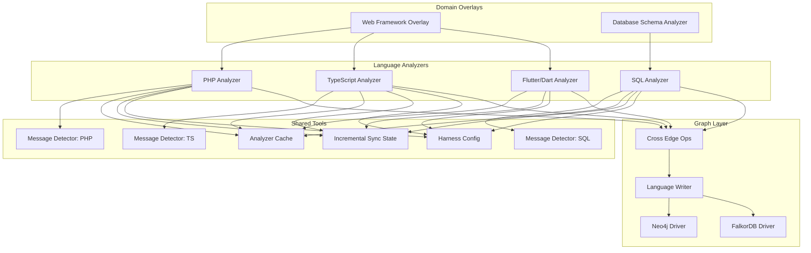
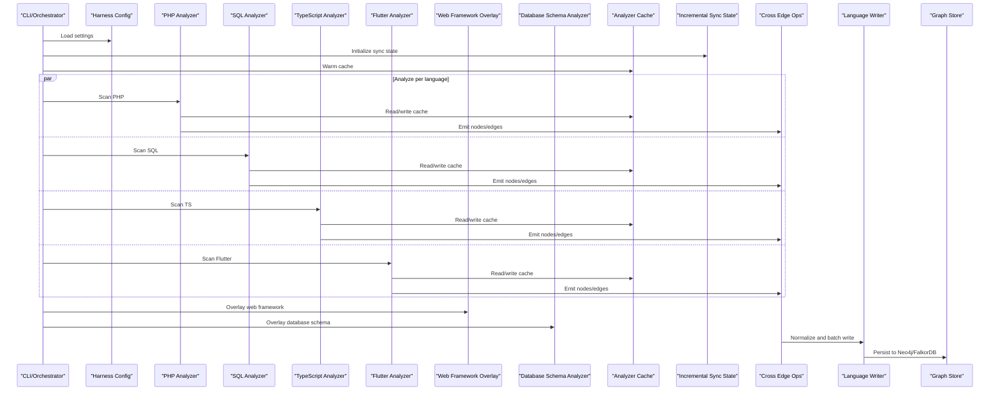
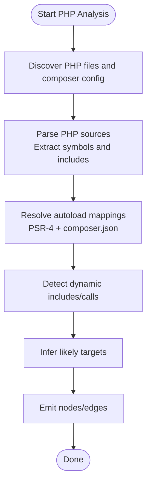
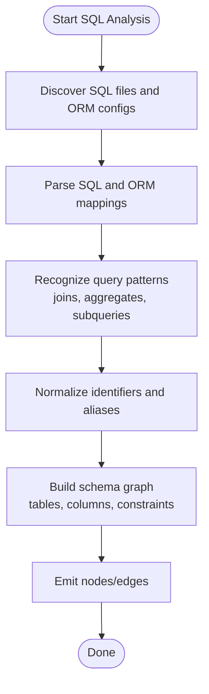
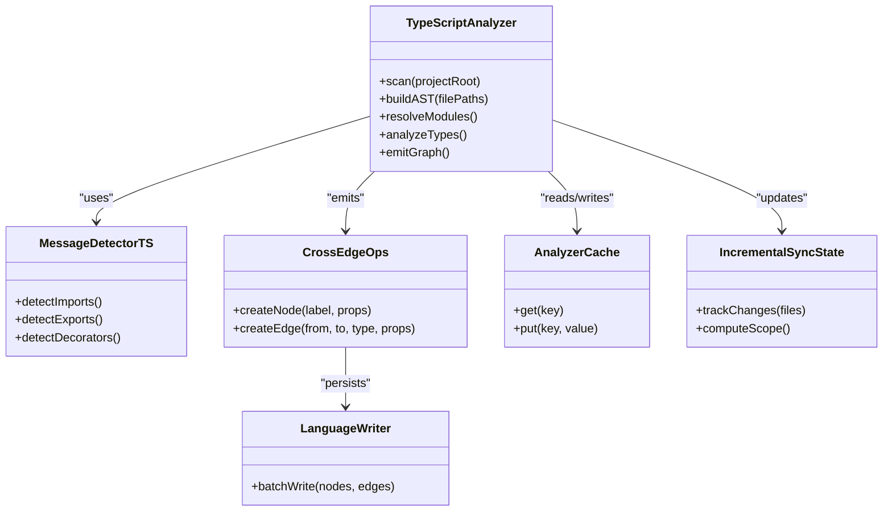
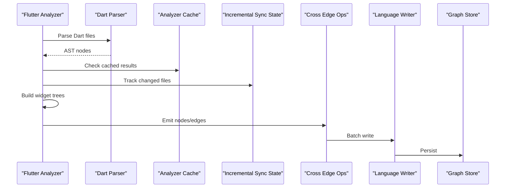
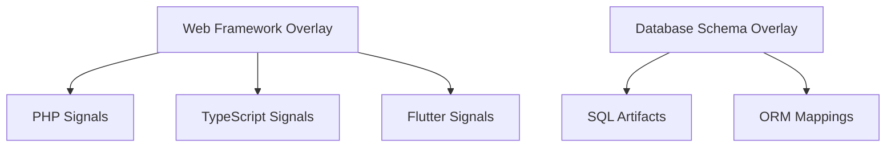
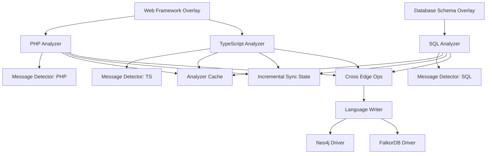

# Scripting & Web Languages

<cite>
**Referenced Files in This Document**
- [php_analyzer.py](file://code-tiny/tools/php/php_analyzer.py)
- [sql_analyzer.py](file://code-tiny/tools/sql/sql_analyzer.py)
- [ts_analyzer.py](file://code-tiny/tools/ts/ts_analyzer.py)
- [flutter_analyzer.py](file://code-tiny/tools/flutter/flutter_analyzer.py)
- [database_schema_analyzer.py](file://code-tiny/tools/database_schema/database_schema_analyzer.py)
- [web_framework_analyzer.py](file://code-tiny/tools/web_framework/web_framework_analyzer.py)
- [message_detectors/php.py](file://code-tiny/tools/common/message_detectors/php.py)
- [message_detectors/sql.py](file://code-tiny/tools/common/message_detectors/sql.py)
- [message_detectors/ts.py](file://code-tiny/tools/common/message_detectors/ts.py)
- [graph/operations/cross_edge_ops.py](file://code-tiny/tools/graph/operations/cross_edge_ops.py)
- [graph/writer/language_writer.py](file://code-tiny/tools/graph/writer/language_writer.py)
- [graph/driver/falkordb_driver.py](file://code-tiny/tools/graph/driver/falkordb_driver.py)
- [graph/driver/neo4j_driver.py](file://code-tiny/tools/graph/driver/neo4j_driver.py)
- [common/harness_config.py](file://code-tiny/tools/common/harness_config.py)
- [common/analyzer_cache.py](file://code-tiny/tools/common/analyzer_cache.py)
- [common/incremental_sync_state.py](file://code-tiny/tools/common/incremental_sync_state.py)
- [test_dart_fixture_analysis.py](file://tests/test_dart_fixture_analysis.py)
- [test_database_schema_overlay.py](file://tests/test_database_schema_overlay.py)
</cite>

## Table of Contents
1. [Introduction](#introduction)
2. [Project Structure](#project-structure)
3. [Core Components](#core-components)
4. [Architecture Overview](#architecture-overview)
5. [Detailed Component Analysis](#detailed-component-analysis)
6. [Dependency Analysis](#dependency-analysis)
7. [Performance Considerations](#performance-considerations)
8. [Troubleshooting Guide](#troubleshooting-guide)
9. [Conclusion](#conclusion)
10. [Appendices](#appendices)

## Introduction
This document explains how the repository supports scripting and web-focused languages with a focus on PHP, SQL, TypeScript, and Flutter/Dart analyzers. It covers dynamic language analysis techniques, runtime behavior inference, and web framework integration patterns. It also details TypeScript type system analysis, Flutter widget tree construction, PHP autoloading mechanisms, and SQL query pattern recognition. Configuration examples are provided for web development workflows, database schema analysis, and mobile app architecture mapping. Finally, it addresses performance optimization for dynamically typed languages and real-time analysis capabilities.

## Project Structure
The relevant code is organized under tools by language and capability:
- Language-specific analyzers: php, sql, ts, flutter
- Shared utilities: message detectors, caching, incremental sync state, harness configuration
- Graph operations and writers to persist semantic information
- Database schema analyzer for SQL-centric projects
- Web framework overlay analyzer for cross-language web stacks

**Diagram sources**
- [php_analyzer.py](file://code-tiny/tools/php/php_analyzer.py)
- [sql_analyzer.py](file://code-tiny/tools/sql/sql_analyzer.py)
- [ts_analyzer.py](file://code-tiny/tools/ts/ts_analyzer.py)
- [flutter_analyzer.py](file://code-tiny/tools/flutter/flutter_analyzer.py)
- [message_detectors/php.py](file://code-tiny/tools/common/message_detectors/php.py)
- [message_detectors/sql.py](file://code-tiny/tools/common/message_detectors/sql.py)
- [message_detectors/ts.py](file://code-tiny/tools/common/message_detectors/ts.py)
- [analyzer_cache.py](file://code-tiny/tools/common/analyzer_cache.py)
- [incremental_sync_state.py](file://code-tiny/tools/common/incremental_sync_state.py)
- [harness_config.py](file://code-tiny/tools/common/harness_config.py)
- [cross_edge_ops.py](file://code-tiny/tools/graph/operations/cross_edge_ops.py)
- [language_writer.py](file://code-tiny/tools/graph/writer/language_writer.py)
- [neo4j_driver.py](file://code-tiny/tools/graph/driver/neo4j_driver.py)
- [falkordb_driver.py](file://code-tiny/tools/graph/driver/falkordb_driver.py)
- [web_framework_analyzer.py](file://code-tiny/tools/web_framework/web_framework_analyzer.py)
- [database_schema_analyzer.py](file://code-tiny/tools/database_schema/database_schema_analyzer.py)

**Section sources**
- [php_analyzer.py](file://code-tiny/tools/php/php_analyzer.py)
- [sql_analyzer.py](file://code-tiny/tools/sql/sql_analyzer.py)
- [ts_analyzer.py](file://code-tiny/tools/ts/ts_analyzer.py)
- [flutter_analyzer.py](file://code-tiny/tools/flutter/flutter_analyzer.py)
- [web_framework_analyzer.py](file://code-tiny/tools/web_framework/web_framework_analyzer.py)
- [database_schema_analyzer.py](file://code-tiny/tools/database_schema/database_schema_analyzer.py)
- [message_detectors/php.py](file://code-tiny/tools/common/message_detectors/php.py)
- [message_detectors/sql.py](file://code-tiny/tools/common/message_detectors/sql.py)
- [message_detectors/ts.py](file://code-tiny/tools/common/message_detectors/ts.py)
- [analyzer_cache.py](file://code-tiny/tools/common/analyzer_cache.py)
- [incremental_sync_state.py](file://code-tiny/tools/common/incremental_sync_state.py)
- [harness_config.py](file://code-tiny/tools/common/harness_config.py)
- [cross_edge_ops.py](file://code-tiny/tools/graph/operations/cross_edge_ops.py)
- [language_writer.py](file://code-tiny/tools/graph/writer/language_writer.py)
- [neo4j_driver.py](file://code-tiny/tools/graph/driver/neo4j_driver.py)
- [falkordb_driver.py](file://code-tiny/tools/graph/driver/falkordb_driver.py)

## Core Components
- PHP Analyzer: Parses PHP source, detects classes, functions, includes/require, and infers autoloading via composer metadata and PSR-4 conventions. Emits symbols and edges into the graph.
- SQL Analyzer: Scans SQL files and ORM mappings, recognizes DDL/DML patterns, normalizes identifiers, and builds schema relationships (tables, columns, constraints).
- TypeScript Analyzer: Builds ASTs, resolves modules, analyzes types and interfaces, and maps frontend/backend boundaries when present. Integrates with message detectors for TS-specific signals.
- Flutter/Dart Analyzer: Parses Dart code, identifies widgets, states, and navigation flows; constructs widget trees and component relationships; integrates with cache and sync layers.
- Web Framework Overlay: Detects frameworks across languages (e.g., routes, controllers, views), correlates endpoints to backend logic and frontend assets.
- Database Schema Analyzer: Extracts schemas from SQL artifacts and ORM configurations, producing normalized entities and relations for downstream queries.

Key shared capabilities:
- Message Detectors: Lightweight scanners that detect framework or language-specific messages (e.g., route definitions, SQL statements, TS imports).
- Analyzer Cache: Deduplicates work and accelerates re-scans by storing intermediate results keyed by file content hashes.
- Incremental Sync State: Tracks changes to enable targeted reanalysis without full rescans.
- Harness Config: Centralized configuration for enabling/disabling analyzers, setting paths, and tuning performance.

**Section sources**
- [php_analyzer.py](file://code-tiny/tools/php/php_analyzer.py)
- [sql_analyzer.py](file://code-tiny/tools/sql/sql_analyzer.py)
- [ts_analyzer.py](file://code-tiny/tools/ts/ts_analyzer.py)
- [flutter_analyzer.py](file://code-tiny/tools/flutter/flutter_analyzer.py)
- [web_framework_analyzer.py](file://code-tiny/tools/web_framework/web_framework_analyzer.py)
- [database_schema_analyzer.py](file://code-tiny/tools/database_schema/database_schema_analyzer.py)
- [message_detectors/php.py](file://code-tiny/tools/common/message_detectors/php.py)
- [message_detectors/sql.py](file://code-tiny/tools/common/message_detectors/sql.py)
- [message_detectors/ts.py](file://code-tiny/tools/common/message_detectors/ts.py)
- [analyzer_cache.py](file://code-tiny/tools/common/analyzer_cache.py)
- [incremental_sync_state.py](file://code-tiny/tools/common/incremental_sync_state.py)
- [harness_config.py](file://code-tiny/tools/common/harness_config.py)

## Architecture Overview
The analyzers follow a consistent pipeline:
- Discovery: Identify project roots and relevant files based on configuration and heuristics.
- Parsing: Build language-specific representations (ASTs, tokens, or regex-based scans).
- Inference: Apply rules to infer runtime behavior (e.g., autoload resolution, widget composition, SQL execution contexts).
- Graph Emission: Create nodes and edges representing symbols, dependencies, and relationships.
- Persistence: Write to the chosen graph store (Neo4j or FalkorDB) via drivers.

**Diagram sources**
- [harness_config.py](file://code-tiny/tools/common/harness_config.py)
- [analyzer_cache.py](file://code-tiny/tools/common/analyzer_cache.py)
- [incremental_sync_state.py](file://code-tiny/tools/common/incremental_sync_state.py)
- [php_analyzer.py](file://code-tiny/tools/php/php_analyzer.py)
- [sql_analyzer.py](file://code-tiny/tools/sql/sql_analyzer.py)
- [ts_analyzer.py](file://code-tiny/tools/ts/ts_analyzer.py)
- [flutter_analyzer.py](file://code-tiny/tools/flutter/flutter_analyzer.py)
- [web_framework_analyzer.py](file://code-tiny/tools/web_framework/web_framework_analyzer.py)
- [database_schema_analyzer.py](file://code-tiny/tools/database_schema/database_schema_analyzer.py)
- [cross_edge_ops.py](file://code-tiny/tools/graph/operations/cross_edge_ops.py)
- [language_writer.py](file://code-tiny/tools/graph/writer/language_writer.py)
- [neo4j_driver.py](file://code-tiny/tools/graph/driver/neo4j_driver.py)
- [falkordb_driver.py](file://code-tiny/tools/graph/driver/falkordb_driver.py)

## Detailed Component Analysis

### PHP Analyzer and Autoloading Mechanisms
- Responsibilities:
  - Parse PHP files to extract classes, functions, traits, and includes.
  - Infer autoloading using composer.json and PSR-4 conventions.
  - Detect dynamic calls and resolve likely targets where possible.
  - Integrate with message detectors for PHP-specific signals (e.g., routing annotations).
- Dynamic analysis techniques:
  - Static symbol extraction combined with heuristic resolution for dynamic includes.
  - Composer metadata parsing to map namespaces to directories.
  - Runtime-like call graph construction by analyzing function/class usage patterns.
- Integration points:
  - Writes nodes/edges through cross-edge ops and persists via language writer.
  - Uses cache and incremental sync to avoid redundant work.

**Diagram sources**
- [php_analyzer.py](file://code-tiny/tools/php/php_analyzer.py)
- [message_detectors/php.py](file://code-tiny/tools/common/message_detectors/php.py)
- [analyzer_cache.py](file://code-tiny/tools/common/analyzer_cache.py)
- [incremental_sync_state.py](file://code-tiny/tools/common/incremental_sync_state.py)
- [cross_edge_ops.py](file://code-tiny/tools/graph/operations/cross_edge_ops.py)
- [language_writer.py](file://code-tiny/tools/graph/writer/language_writer.py)

**Section sources**
- [php_analyzer.py](file://code-tiny/tools/php/php_analyzer.py)
- [message_detectors/php.py](file://code-tiny/tools/common/message_detectors/php.py)
- [analyzer_cache.py](file://code-tiny/tools/common/analyzer_cache.py)
- [incremental_sync_state.py](file://code-tiny/tools/common/incremental_sync_state.py)
- [cross_edge_ops.py](file://code-tiny/tools/graph/operations/cross_edge_ops.py)
- [language_writer.py](file://code-tiny/tools/graph/writer/language_writer.py)

### SQL Analyzer and Query Pattern Recognition
- Responsibilities:
  - Scan SQL files and ORM mappings to identify DDL/DML statements.
  - Recognize common patterns: joins, aggregations, subqueries, and conditional fragments.
  - Normalize identifiers and build schema graphs (tables, columns, constraints).
- Pattern recognition:
  - Regex and token-based detection for complex SQL structures.
  - ORM bridge to correlate application code with SQL fragments.
- Integration points:
  - Emits schema nodes and relationship edges.
  - Works with database schema overlay to enrich context.

**Diagram sources**
- [sql_analyzer.py](file://code-tiny/tools/sql/sql_analyzer.py)
- [message_detectors/sql.py](file://code-tiny/tools/common/message_detectors/sql.py)
- [database_schema_analyzer.py](file://code-tiny/tools/database_schema/database_schema_analyzer.py)
- [analyzer_cache.py](file://code-tiny/tools/common/analyzer_cache.py)
- [incremental_sync_state.py](file://code-tiny/tools/common/incremental_sync_state.py)
- [cross_edge_ops.py](file://code-tiny/tools/graph/operations/cross_edge_ops.py)
- [language_writer.py](file://code-tiny/tools/graph/writer/language_writer.py)

**Section sources**
- [sql_analyzer.py](file://code-tiny/tools/sql/sql_analyzer.py)
- [message_detectors/sql.py](file://code-tiny/tools/common/message_detectors/sql.py)
- [database_schema_analyzer.py](file://code-tiny/tools/database_schema/database_schema_analyzer.py)
- [analyzer_cache.py](file://code-tiny/tools/common/analyzer_cache.py)
- [incremental_sync_state.py](file://code-tiny/tools/common/incremental_sync_state.py)
- [cross_edge_ops.py](file://code-tiny/tools/graph/operations/cross_edge_ops.py)
- [language_writer.py](file://code-tiny/tools/graph/writer/language_writer.py)

### TypeScript Analyzer and Type System Analysis
- Responsibilities:
  - Build ASTs for TypeScript files, resolve modules, and analyze types/interfaces.
  - Map frontend/backend boundaries and API contracts.
  - Integrate with message detectors for TS-specific signals (imports, exports, decorators).
- Type system analysis:
  - Traverse type declarations, generic parameters, and inferred types.
  - Correlate interface usage across modules to build dependency graphs.
- Integration points:
  - Emits nodes/edges for types, modules, and references.
  - Leverages cache and incremental sync for fast iteration.

**Diagram sources**
- [ts_analyzer.py](file://code-tiny/tools/ts/ts_analyzer.py)
- [message_detectors/ts.py](file://code-tiny/tools/common/message_detectors/ts.py)
- [cross_edge_ops.py](file://code-tiny/tools/graph/operations/cross_edge_ops.py)
- [language_writer.py](file://code-tiny/tools/graph/writer/language_writer.py)
- [analyzer_cache.py](file://code-tiny/tools/common/analyzer_cache.py)
- [incremental_sync_state.py](file://code-tiny/tools/common/incremental_sync_state.py)

**Section sources**
- [ts_analyzer.py](file://code-tiny/tools/ts/ts_analyzer.py)
- [message_detectors/ts.py](file://code-tiny/tools/common/message_detectors/ts.py)
- [cross_edge_ops.py](file://code-tiny/tools/graph/operations/cross_edge_ops.py)
- [language_writer.py](file://code-tiny/tools/graph/writer/language_writer.py)
- [analyzer_cache.py](file://code-tiny/tools/common/analyzer_cache.py)
- [incremental_sync_state.py](file://code-tiny/tools/common/incremental_sync_state.py)

### Flutter/Dart Analyzer and Widget Tree Construction
- Responsibilities:
  - Parse Dart files to identify widgets, states, and navigation flows.
  - Construct widget trees and component relationships.
  - Integrate with cache and incremental sync for efficient updates.
- Widget tree construction:
  - Detect widget classes and their compositions.
  - Infer parent-child relationships and lifecycle hooks.
- Integration points:
  - Emits nodes/edges for widgets and relationships.
  - Persists via language writer to graph stores.

**Diagram sources**
- [flutter_analyzer.py](file://code-tiny/tools/flutter/flutter_analyzer.py)
- [analyzer_cache.py](file://code-tiny/tools/common/analyzer_cache.py)
- [incremental_sync_state.py](file://code-tiny/tools/common/incremental_sync_state.py)
- [cross_edge_ops.py](file://code-tiny/tools/graph/operations/cross_edge_ops.py)
- [language_writer.py](file://code-tiny/tools/graph/writer/language_writer.py)
- [neo4j_driver.py](file://code-tiny/tools/graph/driver/neo4j_driver.py)
- [falkordb_driver.py](file://code-tiny/tools/graph/driver/falkordb_driver.py)

**Section sources**
- [flutter_analyzer.py](file://code-tiny/tools/flutter/flutter_analyzer.py)
- [analyzer_cache.py](file://code-tiny/tools/common/analyzer_cache.py)
- [incremental_sync_state.py](file://code-tiny/tools/common/incremental_sync_state.py)
- [cross_edge_ops.py](file://code-tiny/tools/graph/operations/cross_edge_ops.py)
- [language_writer.py](file://code-tiny/tools/graph/writer/language_writer.py)
- [neo4j_driver.py](file://code-tiny/tools/graph/driver/neo4j_driver.py)
- [falkordb_driver.py](file://code-tiny/tools/graph/driver/falkordb_driver.py)

### Web Framework Overlay and Database Schema Overlay
- Web Framework Overlay:
  - Detects frameworks across languages (routes, controllers, views).
  - Correlates endpoints to backend logic and frontend assets.
  - Enhances cross-language understanding for web stacks.
- Database Schema Overlay:
  - Extracts schemas from SQL artifacts and ORM configurations.
  - Produces normalized entities and relations for downstream queries.

**Diagram sources**
- [web_framework_analyzer.py](file://code-tiny/tools/web_framework/web_framework_analyzer.py)
- [database_schema_analyzer.py](file://code-tiny/tools/database_schema/database_schema_analyzer.py)
- [message_detectors/php.py](file://code-tiny/tools/common/message_detectors/php.py)
- [message_detectors/ts.py](file://code-tiny/tools/common/message_detectors/ts.py)
- [message_detectors/sql.py](file://code-tiny/tools/common/message_detectors/sql.py)

**Section sources**
- [web_framework_analyzer.py](file://code-tiny/tools/web_framework/web_framework_analyzer.py)
- [database_schema_analyzer.py](file://code-tiny/tools/database_schema/database_schema_analyzer.py)
- [message_detectors/php.py](file://code-tiny/tools/common/message_detectors/php.py)
- [message_detectors/ts.py](file://code-tiny/tools/common/message_detectors/ts.py)
- [message_detectors/sql.py](file://code-tiny/tools/common/message_detectors/sql.py)

## Dependency Analysis
Analyzers depend on shared utilities and graph infrastructure:
- Direct dependencies:
  - Message detectors for language-specific signals.
  - Cache and incremental sync for performance and change tracking.
  - Cross-edge ops and language writer for graph emission.
  - Drivers for persistence (Neo4j/FalkorDB).
- Indirect dependencies:
  - Web framework overlay depends on multiple language detectors.
  - Database schema overlay depends on SQL artifacts and ORM mappings.

**Diagram sources**
- [php_analyzer.py](file://code-tiny/tools/php/php_analyzer.py)
- [sql_analyzer.py](file://code-tiny/tools/sql/sql_analyzer.py)
- [ts_analyzer.py](file://code-tiny/tools/ts/ts_analyzer.py)
- [message_detectors/php.py](file://code-tiny/tools/common/message_detectors/php.py)
- [message_detectors/sql.py](file://code-tiny/tools/common/message_detectors/sql.py)
- [message_detectors/ts.py](file://code-tiny/tools/common/message_detectors/ts.py)
- [analyzer_cache.py](file://code-tiny/tools/common/analyzer_cache.py)
- [incremental_sync_state.py](file://code-tiny/tools/common/incremental_sync_state.py)
- [cross_edge_ops.py](file://code-tiny/tools/graph/operations/cross_edge_ops.py)
- [language_writer.py](file://code-tiny/tools/graph/writer/language_writer.py)
- [neo4j_driver.py](file://code-tiny/tools/graph/driver/neo4j_driver.py)
- [falkordb_driver.py](file://code-tiny/tools/graph/driver/falkordb_driver.py)
- [web_framework_analyzer.py](file://code-tiny/tools/web_framework/web_framework_analyzer.py)
- [database_schema_analyzer.py](file://code-tiny/tools/database_schema/database_schema_analyzer.py)

**Section sources**
- [php_analyzer.py](file://code-tiny/tools/php/php_analyzer.py)
- [sql_analyzer.py](file://code-tiny/tools/sql/sql_analyzer.py)
- [ts_analyzer.py](file://code-tiny/tools/ts/ts_analyzer.py)
- [message_detectors/php.py](file://code-tiny/tools/common/message_detectors/php.py)
- [message_detectors/sql.py](file://code-tiny/tools/common/message_detectors/sql.py)
- [message_detectors/ts.py](file://code-tiny/tools/common/message_detectors/ts.py)
- [analyzer_cache.py](file://code-tiny/tools/common/analyzer_cache.py)
- [incremental_sync_state.py](file://code-tiny/tools/common/incremental_sync_state.py)
- [cross_edge_ops.py](file://code-tiny/tools/graph/operations/cross_edge_ops.py)
- [language_writer.py](file://code-tiny/tools/graph/writer/language_writer.py)
- [neo4j_driver.py](file://code-tiny/tools/graph/driver/neo4j_driver.py)
- [falkordb_driver.py](file://code-tiny/tools/graph/driver/falkordb_driver.py)
- [web_framework_analyzer.py](file://code-tiny/tools/web_framework/web_framework_analyzer.py)
- [database_schema_analyzer.py](file://code-tiny/tools/database_schema/database_schema_analyzer.py)

## Performance Considerations
- Use analyzer cache to avoid recomputation for unchanged files.
- Enable incremental sync to limit scope to affected files and reduce overhead.
- Prefer FalkorDB for high-throughput writes when available; fall back to Neo4j if needed.
- Batch graph emissions via language writer to minimize driver round-trips.
- For dynamically typed languages (PHP, TS), rely on static extraction plus heuristics to limit speculative resolution.
- Configure harness to disable unused analyzers to reduce startup time.

[No sources needed since this section provides general guidance]

## Troubleshooting Guide
- If PHP autoloading appears incomplete:
  - Verify composer.json presence and PSR-4 mappings.
  - Ensure message detector for PHP is enabled and scanning expected directories.
- If SQL patterns are missed:
  - Confirm SQL files are included in discovery and ORM mappings are accessible.
  - Check normalization rules for alias handling.
- If TypeScript types are unresolved:
  - Validate module resolution paths and ensure TS config is discoverable.
  - Inspect message detector outputs for import/export signals.
- If Flutter widget trees are incomplete:
  - Ensure Dart files are scanned and cache is warmed.
  - Review incremental sync state for missed change detection.
- If graph persistence fails:
  - Check driver configuration for Neo4j/FalkorDB connectivity.
  - Validate batch write sizes and retry policies.

**Section sources**
- [php_analyzer.py](file://code-tiny/tools/php/php_analyzer.py)
- [sql_analyzer.py](file://code-tiny/tools/sql/sql_analyzer.py)
- [ts_analyzer.py](file://code-tiny/tools/ts/ts_analyzer.py)
- [flutter_analyzer.py](file://code-tiny/tools/flutter/flutter_analyzer.py)
- [analyzer_cache.py](file://code-tiny/tools/common/analyzer_cache.py)
- [incremental_sync_state.py](file://code-tiny/tools/common/incremental_sync_state.py)
- [neo4j_driver.py](file://code-tiny/tools/graph/driver/neo4j_driver.py)
- [falkordb_driver.py](file://code-tiny/tools/graph/driver/falkordb_driver.py)

## Conclusion
The repository provides robust support for scripting and web-focused languages through modular analyzers, shared utilities, and a flexible graph layer. PHP autoloading, SQL pattern recognition, TypeScript type analysis, and Flutter widget tree construction are implemented with attention to performance and incremental updates. The web framework and database schema overlays enhance cross-language understanding, while caching and sync mechanisms enable real-time analysis capabilities.

[No sources needed since this section summarizes without analyzing specific files]

## Appendices

### Configuration Examples
- Web Development Workflow:
  - Enable PHP, TypeScript, and web framework overlay analyzers.
  - Set project root paths for frontend and backend directories.
  - Configure cache directory and incremental sync scope.
- Database Schema Analysis:
  - Include SQL files and ORM configuration paths.
  - Enable database schema overlay to normalize entities and relations.
- Mobile App Architecture Mapping:
  - Enable Flutter analyzer and set Dart project root.
  - Optionally include test fixtures to validate widget tree construction.

**Section sources**
- [harness_config.py](file://code-tiny/tools/common/harness_config.py)
- [web_framework_analyzer.py](file://code-tiny/tools/web_framework/web_framework_analyzer.py)
- [database_schema_analyzer.py](file://code-tiny/tools/database_schema/database_schema_analyzer.py)
- [flutter_analyzer.py](file://code-tiny/tools/flutter/flutter_analyzer.py)
- [test_dart_fixture_analysis.py](file://tests/test_dart_fixture_analysis.py)
- [test_database_schema_overlay.py](file://tests/test_database_schema_overlay.py)