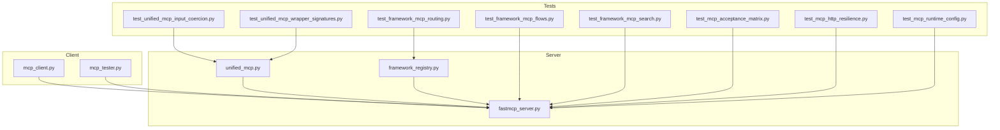
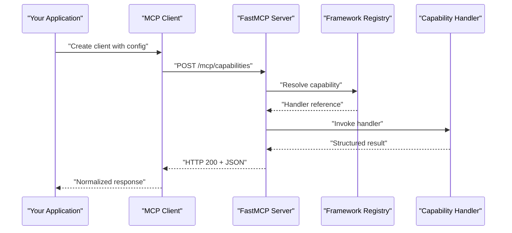
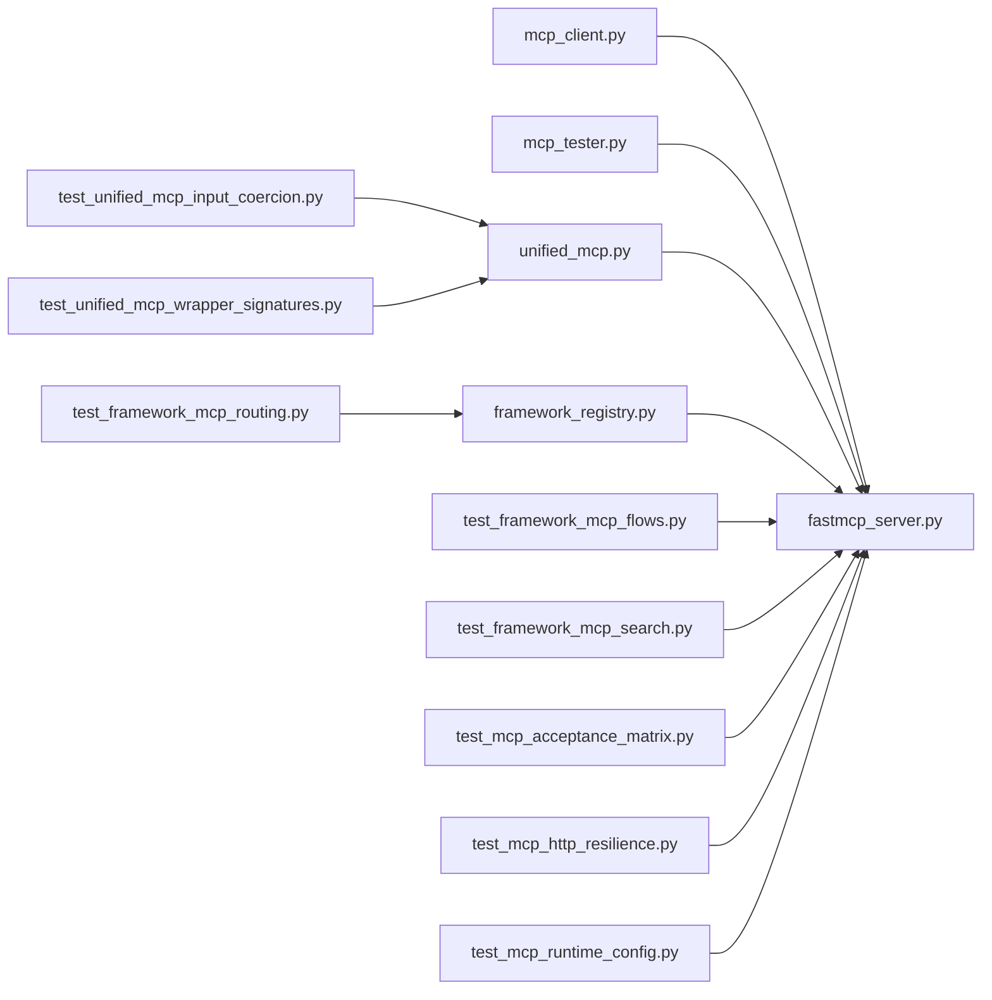

# Client Integration & SDK

<cite>
**Referenced Files in This Document**
- [mcp_client.py](file://code-tiny/testtool/mcp_client.py)
- [mcp_tester.py](file://code-tiny/testtool/mcp_tester.py)
- [unified_mcp.py](file://code-tiny/mcp/unified_mcp.py)
- [fastmcp_server.py](file://code-tiny/mcp/fastmcp_server.py)
- [framework_registry.py](file://code-tiny/mcp/framework_registry.py)
- [test_unified_mcp_input_coercion.py](file://tests/test_unified_mcp_input_coercion.py)
- [test_unified_mcp_wrapper_signatures.py](file://tests/test_unified_mcp_wrapper_signatures.py)
- [test_framework_mcp_flows.py](file://tests/test_framework_mcp_flows.py)
- [test_framework_mcp_routing.py](file://tests/test_framework_mcp_routing.py)
- [test_framework_mcp_search.py](file://tests/test_framework_mcp_search.py)
- [test_mcp_acceptance_matrix.py](file://tests/test_mcp_acceptance_matrix.py)
- [test_mcp_http_resilience.py](file://tests/test_mcp_http_resilience.py)
- [test_mcp_runtime_config.py](file://tests/test_mcp_runtime_config.py)
- [scripts/mcp-lifecycle.py](file://scripts/mcp-lifecycle.py)
- [scripts/mcp_runtime_config.py](file://scripts/mcp_runtime_config.py)
- [specs/mcp.md](file://docs/specs/mcp.md)
</cite>

## Table of Contents
1. [Introduction](#introduction)
2. [Project Structure](#project-structure)
3. [Core Components](#core-components)
4. [Architecture Overview](#architecture-overview)
5. [Detailed Component Analysis](#detailed-component-analysis)
6. [Dependency Analysis](#dependency-analysis)
7. [Performance Considerations](#performance-considerations)
8. [Troubleshooting Guide](#troubleshooting-guide)
9. [Conclusion](#conclusion)
10. [Appendices](#appendices)

## Introduction
This document provides client integration guidance for the Model Context Protocol (MCP) within Cortex Harness. It focuses on the MCP client library, connection establishment, authentication mechanisms, message formatting, protocol compliance, and error handling patterns. It also includes integration examples for popular AI frameworks such as LangChain and AutoGen, custom agent implementations, testing strategies using MCP tester utilities and mock implementations, guidance for implementing custom clients, handling connection failures, optimizing communication patterns, security considerations, rate limiting, and monitoring approaches for production deployments.

## Project Structure
The MCP client integration spans several modules:
- A lightweight HTTP-based MCP client used by tests and tooling
- An MCP tester utility to validate server behavior and contract compliance
- Unified MCP wrapper that standardizes input coercion and method signatures across framework integrations
- FastMCP server implementation exposing MCP endpoints
- Framework registry for capability routing and discovery
- Comprehensive test suites validating flows, routing, search, acceptance matrix, HTTP resilience, and runtime configuration

**Diagram sources**
- [mcp_client.py](file://code-tiny/testtool/mcp_client.py)
- [mcp_tester.py](file://code-tiny/testtool/mcp_tester.py)
- [unified_mcp.py](file://code-tiny/mcp/unified_mcp.py)
- [fastmcp_server.py](file://code-tiny/mcp/fastmcp_server.py)
- [framework_registry.py](file://code-tiny/mcp/framework_registry.py)
- [test_unified_mcp_input_coercion.py](file://tests/test_unified_mcp_input_coercion.py)
- [test_unified_mcp_wrapper_signatures.py](file://tests/test_unified_mcp_wrapper_signatures.py)
- [test_framework_mcp_flows.py](file://tests/test_framework_mcp_flows.py)
- [test_framework_mcp_routing.py](file://tests/test_framework_mcp_routing.py)
- [test_framework_mcp_search.py](file://tests/test_framework_mcp_search.py)
- [test_mcp_acceptance_matrix.py](file://tests/test_mcp_acceptance_matrix.py)
- [test_mcp_http_resilience.py](file://tests/test_mcp_http_resilience.py)
- [test_mcp_runtime_config.py](file://tests/test_mcp_runtime_config.py)

**Section sources**
- [mcp_client.py](file://code-tiny/testtool/mcp_client.py)
- [mcp_tester.py](file://code-tiny/testtool/mcp_tester.py)
- [unified_mcp.py](file://code-tiny/mcp/unified_mcp.py)
- [fastmcp_server.py](file://code-tiny/mcp/fastmcp_server.py)
- [framework_registry.py](file://code-tiny/mcp/framework_registry.py)
- [test_unified_mcp_input_coercion.py](file://tests/test_unified_mcp_input_coercion.py)
- [test_unified_mcp_wrapper_signatures.py](file://tests/test_unified_mcp_wrapper_signatures.py)
- [test_framework_mcp_flows.py](file://tests/test_framework_mcp_flows.py)
- [test_framework_mcp_routing.py](file://tests/test_framework_mcp_routing.py)
- [test_framework_mcp_search.py](file://tests/test_framework_mcp_search.py)
- [test_mcp_acceptance_matrix.py](file://tests/test_mcp_acceptance_matrix.py)
- [test_mcp_http_resilience.py](file://tests/test_mcp_http_resilience.py)
- [test_mcp_runtime_config.py](file://tests/test_mcp_runtime_config.py)

## Core Components
- MCP Client Library: Provides a minimal HTTP client for sending MCP requests and receiving responses. It is used by tests and can be adapted into higher-level integrations.
- MCP Tester Utilities: Offers helpers to drive MCP servers through standardized calls, assert response shapes, and validate protocol compliance.
- Unified MCP Wrapper: Normalizes inputs and method signatures across different framework integrations, ensuring consistent behavior and easier testing.
- FastMCP Server: Implements the MCP endpoint(s), routes capabilities via the framework registry, and returns structured responses.
- Framework Registry: Maintains capability mappings and dispatch logic for MCP operations.

Key responsibilities:
- Connection management: Establish and reuse HTTP connections with retries and timeouts.
- Authentication: Support token-based or header-based authentication as configured at runtime.
- Message formatting: Ensure request/response payloads conform to the MCP specification.
- Error handling: Translate transport errors into domain-specific exceptions with actionable messages.
- Observability: Emit metrics and logs for latency, throughput, and failure rates.

**Section sources**
- [mcp_client.py](file://code-tiny/testtool/mcp_client.py)
- [mcp_tester.py](file://code-tiny/testtool/mcp_tester.py)
- [unified_mcp.py](file://code-tiny/mcp/unified_mcp.py)
- [fastmcp_server.py](file://code-tiny/mcp/fastmcp_server.py)
- [framework_registry.py](file://code-tiny/mcp/framework_registry.py)

## Architecture Overview
The MCP client communicates over HTTP with the FastMCP server. The unified wrapper standardizes calls, while the framework registry routes requests to appropriate handlers. Tests exercise these paths to ensure correctness and resilience.

**Diagram sources**
- [mcp_client.py](file://code-tiny/testtool/mcp_client.py)
- [fastmcp_server.py](file://code-tiny/mcp/fastmcp_server.py)
- [framework_registry.py](file://code-tiny/mcp/framework_registry.py)

## Detailed Component Analysis

### MCP Client Library
Responsibilities:
- Initialize HTTP session with configurable base URL, headers, and auth tokens.
- Send MCP requests with proper content-type and payload structure.
- Parse responses and raise typed exceptions on non-2xx status codes.
- Implement retry/backoff for transient network errors.

Integration tips:
- Use environment variables or a secure secrets manager for credentials.
- Configure timeouts suitable for your workload and SLAs.
- Wrap client usage in context managers or lifecycle hooks to ensure cleanup.

Testing:
- Use the MCP tester utilities to simulate server responses and verify client behavior under various conditions.

**Section sources**
- [mcp_client.py](file://code-tiny/testtool/mcp_client.py)
- [mcp_tester.py](file://code-tiny/testtool/mcp_tester.py)

### MCP Tester Utilities
Capabilities:
- Bootstrap an in-process or external MCP server for tests.
- Execute canonical MCP calls and assert response schemas.
- Validate capability discovery, routing, and error scenarios.

Usage:
- Create a test fixture that starts the server, runs client calls, and asserts outcomes.
- Parameterize tests to cover multiple configurations and edge cases.

**Section sources**
- [mcp_tester.py](file://code-tiny/testtool/mcp_tester.py)

### Unified MCP Wrapper
Purpose:
- Provide a stable API surface for framework integrations.
- Coerce inputs to expected types and normalize outputs.
- Centralize error mapping and logging.

Benefits:
- Simplifies integration with LangChain, AutoGen, and custom agents.
- Reduces duplication across integrations.
- Improves testability by isolating transformation logic.

**Section sources**
- [unified_mcp.py](file://code-tiny/mcp/unified_mcp.py)
- [test_unified_mcp_input_coercion.py](file://tests/test_unified_mcp_input_coercion.py)
- [test_unified_mcp_wrapper_signatures.py](file://tests/test_unified_mcp_wrapper_signatures.py)

### FastMCP Server
Features:
- Exposes MCP endpoints for capability discovery and invocation.
- Routes requests via the framework registry to specific handlers.
- Enforces schema validation and returns structured responses.

Operational concerns:
- Enable CORS if accessed from browsers.
- Apply middleware for auth, rate limiting, and observability.
- Graceful shutdown and health checks.

**Section sources**
- [fastmcp_server.py](file://code-tiny/mcp/fastmcp_server.py)
- [framework_registry.py](file://code-tiny/mcp/framework_registry.py)

### Framework Registry
Role:
- Maintain capability-to-handler mappings.
- Resolve and cache handler references.
- Provide introspection endpoints for capability lists.

Extensibility:
- Register new capabilities dynamically at startup.
- Validate capability metadata before registration.

**Section sources**
- [framework_registry.py](file://code-tiny/mcp/framework_registry.py)

### MCP Lifecycle Scripts
Functions:
- Start/stop MCP server processes.
- Manage runtime configuration and environment variables.
- Orchestrate integration tests against live endpoints.

Production use:
- Integrate with process supervisors (systemd, Docker, Kubernetes).
- Use configuration files or secret stores for sensitive values.

**Section sources**
- [scripts/mcp-lifecycle.py](file://scripts/mcp-lifecycle.py)
- [scripts/mcp_runtime_config.py](file://scripts/mcp_runtime_config.py)

## Dependency Analysis
The following diagram shows key dependencies between client, server, registry, and tests.

**Diagram sources**
- [mcp_client.py](file://code-tiny/testtool/mcp_client.py)
- [mcp_tester.py](file://code-tiny/testtool/mcp_tester.py)
- [unified_mcp.py](file://code-tiny/mcp/unified_mcp.py)
- [fastmcp_server.py](file://code-tiny/mcp/fastmcp_server.py)
- [framework_registry.py](file://code-tiny/mcp/framework_registry.py)
- [test_unified_mcp_input_coercion.py](file://tests/test_unified_mcp_input_coercion.py)
- [test_unified_mcp_wrapper_signatures.py](file://tests/test_unified_mcp_wrapper_signatures.py)
- [test_framework_mcp_flows.py](file://tests/test_framework_mcp_flows.py)
- [test_framework_mcp_routing.py](file://tests/test_framework_mcp_routing.py)
- [test_framework_mcp_search.py](file://tests/test_framework_mcp_search.py)
- [test_mcp_acceptance_matrix.py](file://tests/test_mcp_acceptance_matrix.py)
- [test_mcp_http_resilience.py](file://tests/test_mcp_http_resilience.py)
- [test_mcp_runtime_config.py](file://tests/test_mcp_runtime_config.py)

**Section sources**
- [mcp_client.py](file://code-tiny/testtool/mcp_client.py)
- [mcp_tester.py](file://code-tiny/testtool/mcp_tester.py)
- [unified_mcp.py](file://code-tiny/mcp/unified_mcp.py)
- [fastmcp_server.py](file://code-tiny/mcp/fastmcp_server.py)
- [framework_registry.py](file://code-tiny/mcp/framework_registry.py)
- [test_unified_mcp_input_coercion.py](file://tests/test_unified_mcp_input_coercion.py)
- [test_unified_mcp_wrapper_signatures.py](file://tests/test_unified_mcp_wrapper_signatures.py)
- [test_framework_mcp_flows.py](file://tests/test_framework_mcp_flows.py)
- [test_framework_mcp_routing.py](file://tests/test_framework_mcp_routing.py)
- [test_framework_mcp_search.py](file://tests/test_framework_mcp_search.py)
- [test_mcp_acceptance_matrix.py](file://tests/test_mcp_acceptance_matrix.py)
- [test_mcp_http_resilience.py](file://tests/test_mcp_http_resilience.py)
- [test_mcp_runtime_config.py](file://tests/test_mcp_runtime_config.py)

## Performance Considerations
- Connection pooling: Reuse HTTP sessions to reduce handshake overhead.
- Timeouts and backoff: Set sensible connect/read timeouts; implement exponential backoff with jitter for retries.
- Payload size: Keep MCP payloads compact; avoid unnecessary fields.
- Concurrency: Use async clients where possible; limit concurrent requests to prevent server overload.
- Caching: Cache capability listings and stable metadata to reduce repeated calls.
- Monitoring: Track latency percentiles, error rates, and throughput; alert on anomalies.

[No sources needed since this section provides general guidance]

## Troubleshooting Guide
Common issues and resolutions:
- Connection refused: Verify server is running and reachable; check firewall rules and ports.
- Authentication failures: Confirm token validity and header names; ensure secrets are loaded correctly.
- Schema mismatches: Validate request/response structures against the MCP spec; use the tester utilities to reproduce.
- Timeouts: Increase timeouts or optimize server-side processing; inspect slow handlers.
- Rate limiting: Adjust limits or implement client-side throttling; monitor queue lengths.

Diagnostic steps:
- Enable verbose logging on both client and server.
- Capture raw HTTP traffic for inspection.
- Run acceptance matrix tests to pinpoint regressions.

**Section sources**
- [test_mcp_http_resilience.py](file://tests/test_mcp_http_resilience.py)
- [test_mcp_acceptance_matrix.py](file://tests/test_mcp_acceptance_matrix.py)
- [test_mcp_runtime_config.py](file://tests/test_mcp_runtime_config.py)

## Conclusion
Cortex Harness provides a robust MCP client and server foundation with strong testing coverage. By leveraging the unified wrapper, tester utilities, and lifecycle scripts, teams can integrate MCP into diverse applications and frameworks with confidence. Focus on secure configuration, resilient networking, and comprehensive observability to achieve reliable production deployments.

[No sources needed since this section summarizes without analyzing specific files]

## Appendices

### Integration Examples

#### LangChain Integration
- Use the unified MCP wrapper to call MCP capabilities from LangChain tools.
- Map MCP responses to LangChain-compatible formats.
- Handle errors by raising LangChain exceptions when appropriate.

References:
- [unified_mcp.py](file://code-tiny/mcp/unified_mcp.py)
- [test_unified_mcp_wrapper_signatures.py](file://tests/test_unified_mcp_wrapper_signatures.py)

#### AutoGen Integration
- Wrap MCP calls in AutoGen function tools.
- Serialize arguments according to MCP expectations.
- Propagate MCP errors as tool execution results.

References:
- [unified_mcp.py](file://code-tiny/mcp/unified_mcp.py)
- [test_unified_mcp_input_coercion.py](file://tests/test_unified_mcp_input_coercion.py)

#### Custom Agent Implementation
- Instantiate the MCP client with environment-driven configuration.
- Implement retry and circuit breaker patterns for resilience.
- Log and trace each MCP call for observability.

References:
- [mcp_client.py](file://code-tiny/testtool/mcp_client.py)
- [scripts/mcp-lifecycle.py](file://scripts/mcp-lifecycle.py)

### Testing Strategies
- Unit tests: Validate input coercion and signature normalization.
- Flow tests: Exercise end-to-end MCP workflows against a live or mocked server.
- Routing tests: Ensure capability resolution and dispatch work correctly.
- Search tests: Verify query semantics and response shapes.
- Acceptance matrix: Confirm feature parity across capabilities.
- Resilience tests: Simulate network failures, timeouts, and server errors.
- Runtime config tests: Validate configuration loading and defaults.

References:
- [test_unified_mcp_input_coercion.py](file://tests/test_unified_mcp_input_coercion.py)
- [test_unified_mcp_wrapper_signatures.py](file://tests/test_unified_mcp_wrapper_signatures.py)
- [test_framework_mcp_flows.py](file://tests/test_framework_mcp_flows.py)
- [test_framework_mcp_routing.py](file://tests/test_framework_mcp_routing.py)
- [test_framework_mcp_search.py](file://tests/test_framework_mcp_search.py)
- [test_mcp_acceptance_matrix.py](file://tests/test_mcp_acceptance_matrix.py)
- [test_mcp_http_resilience.py](file://tests/test_mcp_http_resilience.py)
- [test_mcp_runtime_config.py](file://tests/test_mcp_runtime_config.py)

### Security Considerations
- Transport security: Always use HTTPS in production.
- Secrets management: Store tokens in secure vaults; avoid hardcoding.
- Input validation: Enforce strict schemas on all MCP payloads.
- Least privilege: Limit capability access per caller identity.
- Audit logging: Record access events and sensitive actions.

References:
- [specs/mcp.md](file://docs/specs/mcp.md)

### Rate Limiting and Monitoring
- Client-side: Implement token bucket or leaky bucket algorithms.
- Server-side: Apply middleware to enforce quotas per client or capability.
- Metrics: Export latency histograms, error counters, and throughput gauges.
- Alerts: Trigger on elevated error rates and latency spikes.

References:
- [test_mcp_http_resilience.py](file://tests/test_mcp_http_resilience.py)
- [scripts/mcp-lifecycle.py](file://scripts/mcp-lifecycle.py)