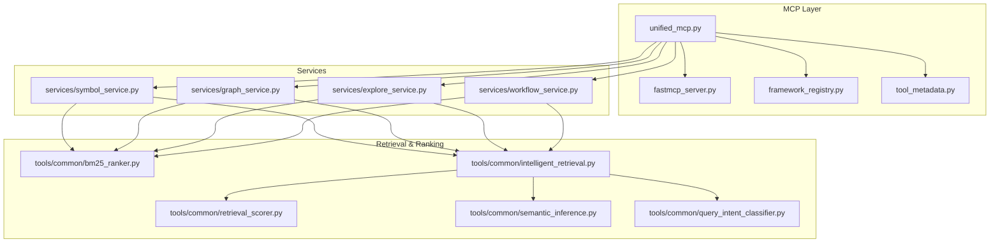
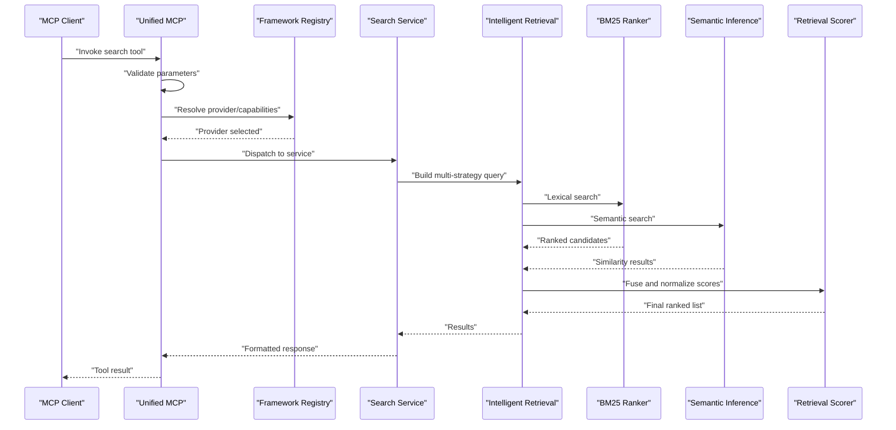
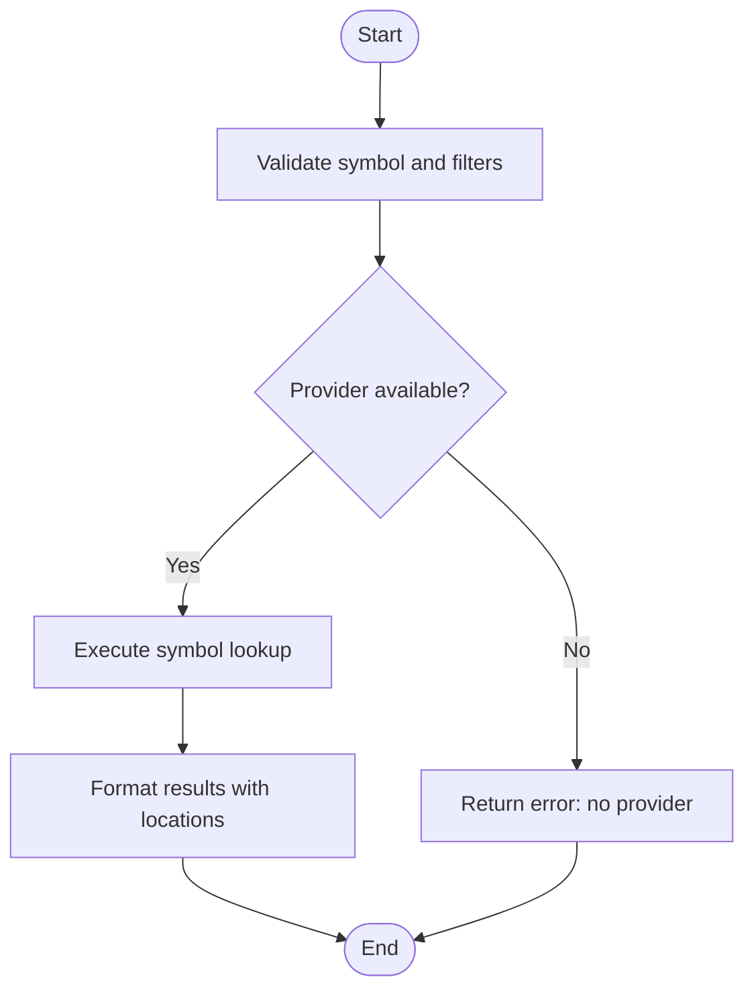
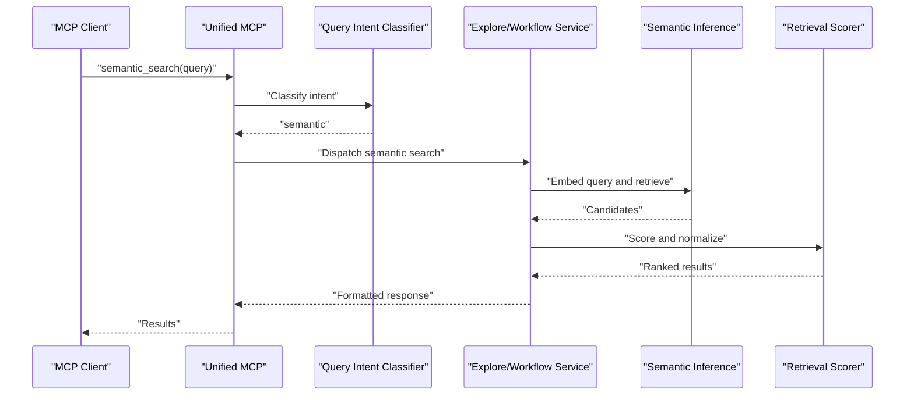
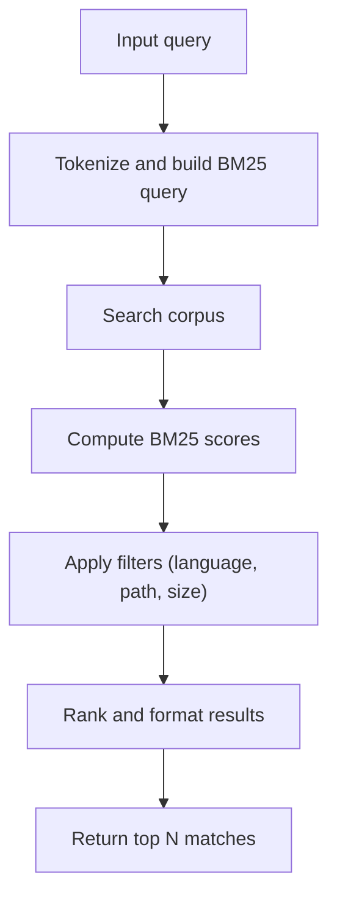
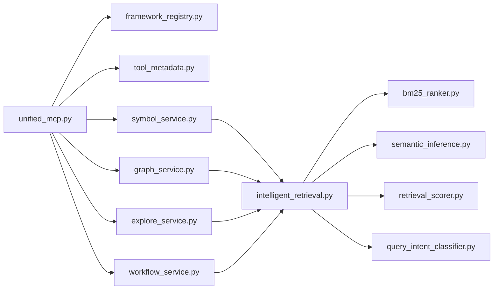

# Code Search Tools

<cite>
**Referenced Files in This Document**
- [unified_mcp.py](file://code-tiny/mcp/unified_mcp.py)
- [fastmcp_server.py](file://code-tiny/mcp/fastmcp_server.py)
- [framework_registry.py](file://code-tiny/mcp/framework_registry.py)
- [tool_metadata.py](file://code-tiny/mcp/tool_metadata.py)
- [bm25_ranker.py](file://code-tiny/tools/common/bm25_ranker.py)
- [intelligent_retrieval.py](file://code-tiny/tools/common/intelligent_retrieval.py)
- [retrieval_scorer.py](file://code-tiny/tools/common/retrieval_scorer.py)
- [semantic_inference.py](file://code-tiny/tools/common/semantic_inference.py)
- [query_intent_classifier.py](file://code-tiny/tools/common/query_intent_classifier.py)
- [symbol_service.py](file://code-tiny/mcp/services/symbol_service.py)
- [graph_service.py](file://code-tiny/mcp/services/graph_service.py)
- [explore_service.py](file://code-tiny/mcp/services/explore_service.py)
- [workflow_service.py](file://code-tiny/mcp/services/workflow_service.py)
- [test_framework_mcp_search.py](file://tests/test_framework_mcp_search.py)
- [search_by_code.json](file://code-tiny/testtool/input_exam/search_by_code.json)
- [semantic_search.json](file://code-tiny/testtool/input_exam/semantic_search.json)
- [search_functions.json](file://code-tiny/testtool/input_exam/search_functions.json)
</cite>

## Table of Contents
1. [Introduction](#introduction)
2. [Project Structure](#project-structure)
3. [Core Components](#core-components)
4. [Architecture Overview](#architecture-overview)
5. [Detailed Component Analysis](#detailed-component-analysis)
6. [Dependency Analysis](#dependency-analysis)
7. [Performance Considerations](#performance-considerations)
8. [Troubleshooting Guide](#troubleshooting-guide)
9. [Conclusion](#conclusion)

## Introduction
This document explains the code search tools available through Cortex Harness MCP. It covers symbol search, semantic search, pattern matching, and content-based queries. It also documents how search tools are registered, validated, and formatted for responses, including BM25 ranking integration and semantic similarity scoring. Guidance is provided for optimizing performance on large codebases and handling complex queries effectively.

## Project Structure
The search capabilities are exposed via MCP tools that are registered by a unified server entry point. The core logic spans:
- MCP tool registration and routing
- Service layer orchestration (symbol, graph, explore, workflow)
- Retrieval and ranking utilities (BM25, semantic inference, retrieval scorer)
- Query intent classification to choose appropriate strategies
- Test fixtures and examples for common search patterns

**Diagram sources**
- [unified_mcp.py](file://code-tiny/mcp/unified_mcp.py)
- [fastmcp_server.py](file://code-tiny/mcp/fastmcp_server.py)
- [framework_registry.py](file://code-tiny/mcp/framework_registry.py)
- [tool_metadata.py](file://code-tiny/mcp/tool_metadata.py)
- [symbol_service.py](file://code-tiny/mcp/services/symbol_service.py)
- [graph_service.py](file://code-tiny/mcp/services/graph_service.py)
- [explore_service.py](file://code-tiny/mcp/services/explore_service.py)
- [workflow_service.py](file://code-tiny/mcp/services/workflow_service.py)
- [bm25_ranker.py](file://code-tiny/tools/common/bm25_ranker.py)
- [intelligent_retrieval.py](file://code-tiny/tools/common/intelligent_retrieval.py)
- [retrieval_scorer.py](file://code-tiny/tools/common/retrieval_scorer.py)
- [semantic_inference.py](file://code-tiny/tools/common/semantic_inference.py)
- [query_intent_classifier.py](file://code-tiny/tools/common/query_intent_classifier.py)

**Section sources**
- [unified_mcp.py](file://code-tiny/mcp/unified_mcp.py)
- [fastmcp_server.py](file://code-tiny/mcp/fastmcp_server.py)
- [framework_registry.py](file://code-tiny/mcp/framework_registry.py)
- [tool_metadata.py](file://code-tiny/mcp/tool_metadata.py)
- [symbol_service.py](file://code-tiny/mcp/services/symbol_service.py)
- [graph_service.py](file://code-tiny/mcp/services/graph_service.py)
- [explore_service.py](file://code-tiny/mcp/services/explore_service.py)
- [workflow_service.py](file://code-tiny/mcp/services/workflow_service.py)
- [bm25_ranker.py](file://code-tiny/tools/common/bm25_ranker.py)
- [intelligent_retrieval.py](file://code-tiny/tools/common/intelligent_retrieval.py)
- [retrieval_scorer.py](file://code-tiny/tools/common/retrieval_scorer.py)
- [semantic_inference.py](file://code-tiny/tools/common/semantic_inference.py)
- [query_intent_classifier.py](file://code-tiny/tools/common/query_intent_classifier.py)

## Core Components
- Unified MCP entrypoint: Registers and routes search tools to service implementations.
- Framework registry: Manages capability discovery and provider selection for different languages/frameworks.
- Tool metadata: Defines schemas, descriptions, and parameter constraints for search tools.
- Services:
  - Symbol service: Exact and fuzzy symbol lookups with context.
  - Graph service: Traversal-based searches across relationships.
  - Explore service: Broad exploration using combined signals.
  - Workflow service: High-level workflows combining multiple search strategies.
- Retrieval and ranking:
  - BM25 ranker: Lexical relevance scoring over text corpora.
  - Intelligent retrieval: Orchestrates multi-strategy retrieval and fusion.
  - Retrieval scorer: Normalizes and combines scores from multiple sources.
  - Semantic inference: Embedding-based similarity and query understanding.
  - Query intent classifier: Determines whether to use symbol, semantic, or pattern search.

**Section sources**
- [unified_mcp.py](file://code-tiny/mcp/unified_mcp.py)
- [framework_registry.py](file://code-tiny/mcp/framework_registry.py)
- [tool_metadata.py](file://code-tiny/mcp/tool_metadata.py)
- [symbol_service.py](file://code-tiny/mcp/services/symbol_service.py)
- [graph_service.py](file://code-tiny/mcp/services/graph_service.py)
- [explore_service.py](file://code-tiny/mcp/services/explore_service.py)
- [workflow_service.py](file://code-tiny/mcp/services/workflow_service.py)
- [bm25_ranker.py](file://code-tiny/tools/common/bm25_ranker.py)
- [intelligent_retrieval.py](file://code-tiny/tools/common/intelligent_retrieval.py)
- [retrieval_scorer.py](file://code-tiny/tools/common/retrieval_scorer.py)
- [semantic_inference.py](file://code-tiny/tools/common/semantic_inference.py)
- [query_intent_classifier.py](file://code-tiny/tools/common/query_intent_classifier.py)

## Architecture Overview
The MCP client invokes a search tool. The unified entrypoint validates parameters, classifies intent, and delegates to the appropriate service. Services may call graph operations, lexical search, and semantic search. Results are scored and fused, then packaged into a standardized response.

**Diagram sources**
- [unified_mcp.py](file://code-tiny/mcp/unified_mcp.py)
- [framework_registry.py](file://code-tiny/mcp/framework_registry.py)
- [symbol_service.py](file://code-tiny/mcp/services/symbol_service.py)
- [graph_service.py](file://code-tiny/mcp/services/graph_service.py)
- [explore_service.py](file://code-tiny/mcp/services/explore_service.py)
- [workflow_service.py](file://code-tiny/mcp/services/workflow_service.py)
- [intelligent_retrieval.py](file://code-tiny/tools/common/intelligent_retrieval.py)
- [bm25_ranker.py](file://code-tiny/tools/common/bm25_ranker.py)
- [semantic_inference.py](file://code-tiny/tools/common/semantic_inference.py)
- [retrieval_scorer.py](file://code-tiny/tools/common/retrieval_scorer.py)

## Detailed Component Analysis

### Search Tool Registration and Routing
- The unified MCP component registers search tools and maps them to service handlers.
- The framework registry resolves language-specific providers and capabilities.
- Tool metadata defines parameter schemas, validation rules, and descriptions used during invocation.

Key responsibilities:
- Registering tool names and handlers
- Parsing and validating inputs against schemas
- Selecting the best provider based on project context
- Returning consistent error messages for invalid inputs

**Section sources**
- [unified_mcp.py](file://code-tiny/mcp/unified_mcp.py)
- [framework_registry.py](file://code-tiny/mcp/framework_registry.py)
- [tool_metadata.py](file://code-tiny/mcp/tool_metadata.py)

### Symbol Search
Symbol search locates identifiers such as functions, classes, variables, and methods. It supports exact matches, case-insensitive matching, and optional scope filters (e.g., file path or namespace).

Typical flow:
- Validate symbol name and optional filters
- Resolve provider and index
- Execute symbol lookup
- Return top matches with location and context

**Diagram sources**
- [symbol_service.py](file://code-tiny/mcp/services/symbol_service.py)
- [framework_registry.py](file://code-tiny/mcp/framework_registry.py)
- [tool_metadata.py](file://code-tiny/mcp/tool_metadata.py)

**Section sources**
- [symbol_service.py](file://code-tiny/mcp/services/symbol_service.py)
- [tool_metadata.py](file://code-tiny/mcp/tool_metadata.py)

### Semantic Search
Semantic search uses embeddings to find code fragments similar in meaning to a natural language query. It integrates with semantic inference and retrieval scorers to produce ranked results.

Key steps:
- Classify query intent to confirm semantic mode
- Generate embedding for the query
- Retrieve semantically similar items
- Score and fuse with other signals if needed

**Diagram sources**
- [semantic_inference.py](file://code-tiny/tools/common/semantic_inference.py)
- [query_intent_classifier.py](file://code-tiny/tools/common/query_intent_classifier.py)
- [explore_service.py](file://code-tiny/mcp/services/explore_service.py)
- [workflow_service.py](file://code-tiny/mcp/services/workflow_service.py)
- [retrieval_scorer.py](file://code-tiny/tools/common/retrieval_scorer.py)

**Section sources**
- [semantic_inference.py](file://code-tiny/tools/common/semantic_inference.py)
- [query_intent_classifier.py](file://code-tiny/tools/common/query_intent_classifier.py)
- [explore_service.py](file://code-tiny/mcp/services/explore_service.py)
- [workflow_service.py](file://code-tiny/mcp/services/workflow_service.py)
- [retrieval_scorer.py](file://code-tiny/tools/common/retrieval_scorer.py)

### Pattern Matching and Content-Based Queries
Pattern matching leverages lexical search and BM25 ranking to find code matching textual patterns or keywords. Content-based queries focus on full-text search within files.

Processing logic:
- Parse query into tokens/patterns
- Run BM25 ranking over indexed text
- Fuse with any additional signals (e.g., recency, file type)
- Return ranked snippets with highlights

**Diagram sources**
- [bm25_ranker.py](file://code-tiny/tools/common/bm25_ranker.py)
- [intelligent_retrieval.py](file://code-tiny/tools/common/intelligent_retrieval.py)

**Section sources**
- [bm25_ranker.py](file://code-tiny/tools/common/bm25_ranker.py)
- [intelligent_retrieval.py](file://code-tiny/tools/common/intelligent_retrieval.py)

### Graph-Aware Searches
Graph services enable traversal-based searches across relationships (calls, imports, dependencies). Useful for impact analysis and dependency tracing.

Highlights:
- Use graph edges to expand candidate sets
- Combine with BM25 and semantic signals
- Provide structured paths and summaries

**Section sources**
- [graph_service.py](file://code-tiny/mcp/services/graph_service.py)
- [intelligent_retrieval.py](file://code-tiny/tools/common/intelligent_retrieval.py)

### Result Formatting and Packaging
All search tools return standardized responses containing:
- Matched items with identifiers and locations
- Scores and reasons for ranking
- Optional context snippets and related nodes
- Metadata such as provider and strategy used

Formatting is handled by the service layer before returning to the MCP client.

**Section sources**
- [symbol_service.py](file://code-tiny/mcp/services/symbol_service.py)
- [graph_service.py](file://code-tiny/mcp/services/graph_service.py)
- [explore_service.py](file://code-tiny/mcp/services/explore_service.py)
- [workflow_service.py](file://code-tiny/mcp/services/workflow_service.py)

## Dependency Analysis
The following diagram shows key dependencies among search components.

**Diagram sources**
- [unified_mcp.py](file://code-tiny/mcp/unified_mcp.py)
- [framework_registry.py](file://code-tiny/mcp/framework_registry.py)
- [tool_metadata.py](file://code-tiny/mcp/tool_metadata.py)
- [symbol_service.py](file://code-tiny/mcp/services/symbol_service.py)
- [graph_service.py](file://code-tiny/mcp/services/graph_service.py)
- [explore_service.py](file://code-tiny/mcp/services/explore_service.py)
- [workflow_service.py](file://code-tiny/mcp/services/workflow_service.py)
- [intelligent_retrieval.py](file://code-tiny/tools/common/intelligent_retrieval.py)
- [bm25_ranker.py](file://code-tiny/tools/common/bm25_ranker.py)
- [semantic_inference.py](file://code-tiny/tools/common/semantic_inference.py)
- [retrieval_scorer.py](file://code-tiny/tools/common/retrieval_scorer.py)
- [query_intent_classifier.py](file://code-tiny/tools/common/query_intent_classifier.py)

**Section sources**
- [unified_mcp.py](file://code-tiny/mcp/unified_mcp.py)
- [framework_registry.py](file://code-tiny/mcp/framework_registry.py)
- [tool_metadata.py](file://code-tiny/mcp/tool_metadata.py)
- [symbol_service.py](file://code-tiny/mcp/services/symbol_service.py)
- [graph_service.py](file://code-tiny/mcp/services/graph_service.py)
- [explore_service.py](file://code-tiny/mcp/services/explore_service.py)
- [workflow_service.py](file://code-tiny/mcp/services/workflow_service.py)
- [intelligent_retrieval.py](file://code-tiny/tools/common/intelligent_retrieval.py)
- [bm25_ranker.py](file://code-tiny/tools/common/bm25_ranker.py)
- [semantic_inference.py](file://code-tiny/tools/common/semantic_inference.py)
- [retrieval_scorer.py](file://code-tiny/tools/common/retrieval_scorer.py)
- [query_intent_classifier.py](file://code-tiny/tools/common/query_intent_classifier.py)

## Performance Considerations
- Prefer targeted queries:
  - Use symbol search for precise identifiers.
  - Apply path or language filters to reduce corpus size.
- Tune BM25 parameters:
  - Adjust k1 and b to balance term frequency saturation and document length normalization.
  - Limit max results to reduce downstream processing.
- Cache frequent queries:
  - Memoize embeddings and BM25 results for repeated queries.
- Batch and parallelize:
  - When combining multiple strategies, run independent retrievals concurrently where possible.
- Index hygiene:
  - Keep indexes up-to-date; avoid scanning stale data.
- Large codebase guidance:
  - Use hierarchical scopes (module/package) to constrain searches.
  - Pre-filter by file types and sizes.
  - Consider incremental indexing and hot-path caching for frequently accessed symbols.

[No sources needed since this section provides general guidance]

## Troubleshooting Guide
Common issues and resolutions:
- Invalid parameters:
  - Ensure required fields are present and conform to schema.
  - Check enum values and ranges for limit and offset.
- No results:
  - Verify provider availability and index status.
  - Relax filters or broaden query terms.
- Slow responses:
  - Reduce result limits and disable unnecessary expansions.
  - Confirm BM25 and semantic backends are reachable and healthy.
- Incorrect ranking:
  - Review BM25 weights and semantic similarity thresholds.
  - Inspect fusion weights in the retrieval scorer.

Operational checks:
- Validate tool registration and handler mapping.
- Confirm metadata schemas match expected inputs.
- Log provider resolution and strategy selection for diagnostics.

**Section sources**
- [tool_metadata.py](file://code-tiny/mcp/tool_metadata.py)
- [framework_registry.py](file://code-tiny/mcp/framework_registry.py)
- [bm25_ranker.py](file://code-tiny/tools/common/bm25_ranker.py)
- [semantic_inference.py](file://code-tiny/tools/common/semantic_inference.py)
- [retrieval_scorer.py](file://code-tiny/tools/common/retrieval_scorer.py)

## Conclusion
Cortex Harness MCP provides a comprehensive set of code search tools spanning symbol, semantic, pattern, and content-based queries. The unified registration and routing layer ensures consistent validation and formatting, while intelligent retrieval fuses BM25 and semantic signals for high-quality results. By applying the performance and troubleshooting guidance above, you can optimize search behavior for both small and large codebases.