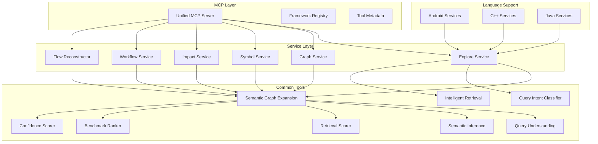
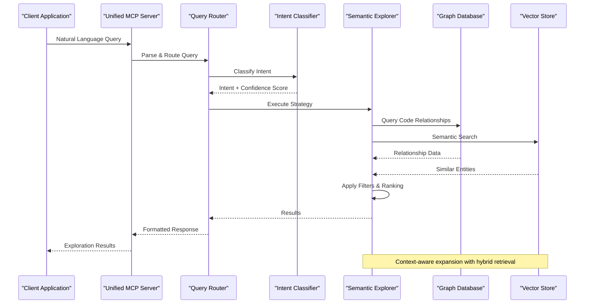
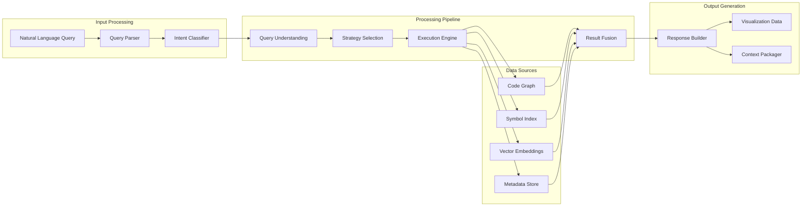
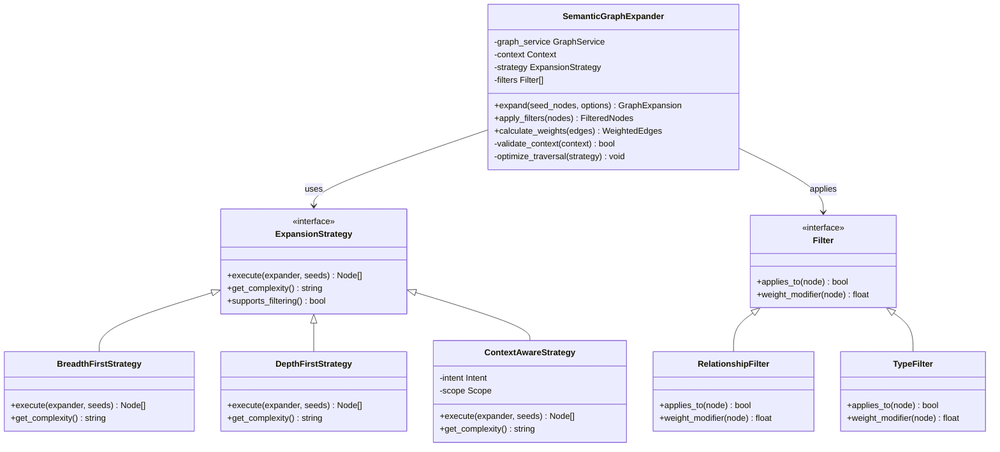
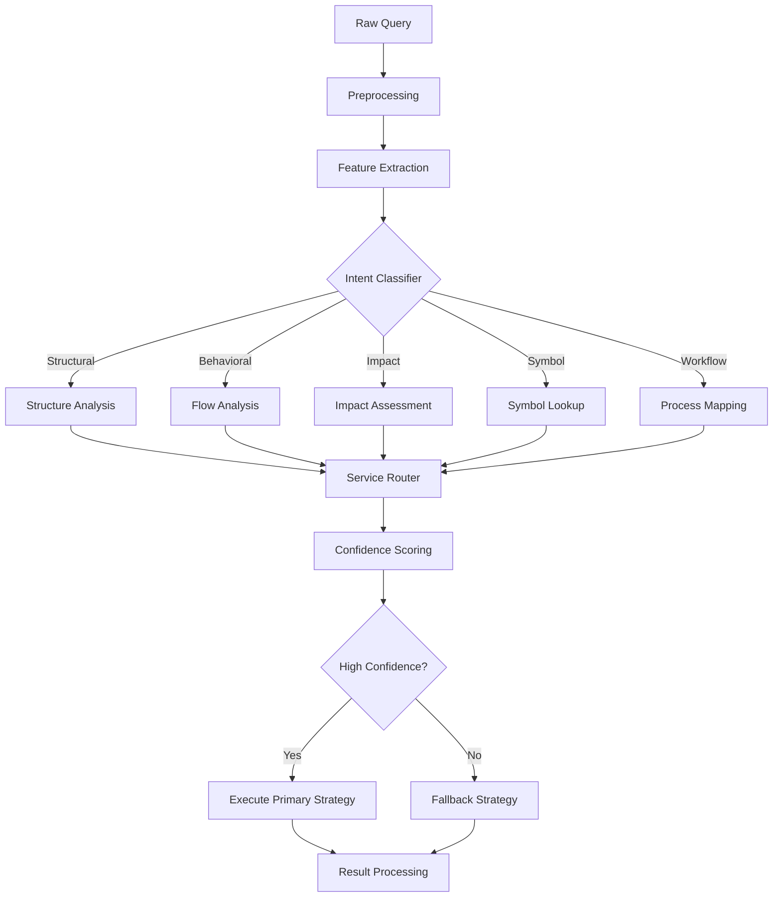
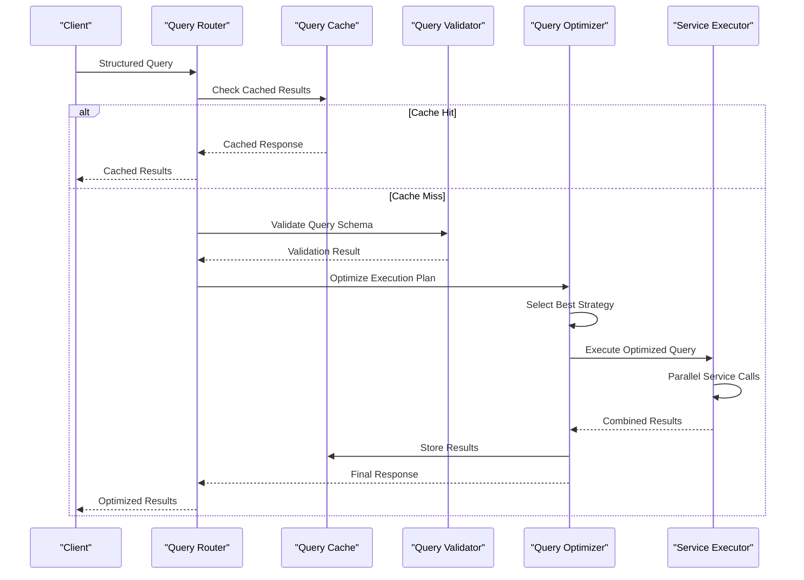
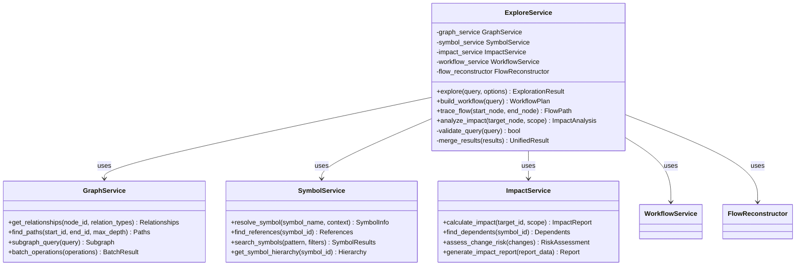
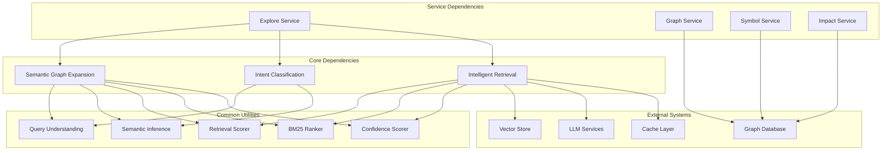

# Semantic Exploration Tools

<cite>
**Referenced Files in This Document**
- [semantic_graph_expansion.py](file://code-tiny/mcp/semantic_graph_expansion.py)
- [query_intent_classifier.py](file://code-tiny/tools/common/query_intent_classifier.py)
- [intelligent_retrieval.py](file://code-tiny/tools/common/intelligent_retrieval.py)
- [unified_mcp.py](file://code-tiny/mcp/unified_mcp.py)
- [explore_service.py](file://code-tiny/mcp/services/explore_service.py)
- [graph_service.py](file://code-tiny/mcp/services/graph_service.py)
- [symbol_service.py](file://code-tiny/mcp/services/symbol_service.py)
- [impact_service.py](file://code-tiny/mcp/services/impact_service.py)
- [workflow_service.py](file://code-tiny/mcp/services/workflow_service.py)
- [flow_reconstructor.py](file://code-tiny/mcp/services/flow_reconstructor.py)
- [tool_metadata.py](file://code-tiny/mcp/tool_metadata.py)
- [framework_registry.py](file://code-tiny/mcp/framework_registry.py)
- [fastmcp_server.py](file://code-tiny/mcp/fastmcp_server.py)
- [graph_expander.py](file://code-tiny/tools/common/graph_expander.py)
- [query_understanding.py](file://code-tiny/tools/common/query_understanding.py)
- [semantic_inference.py](file://code-tiny/tools/common/semantic_inference.py)
- [retrieval_scorer.py](file://code-tiny/tools/common/retrieval_scorer.py)
- [bm25_ranker.py](file://code-tiny/tools/common/bm25_ranker.py)
- [confidence_scorer.py](file://code-tiny/tools/common/confidence_scorer.py)
</cite>

## Table of Contents
1. [Introduction](#introduction)
2. [Project Structure](#project-structure)
3. [Core Components](#core-components)
4. [Architecture Overview](#architecture-overview)
5. [Detailed Component Analysis](#detailed-component-analysis)
6. [Dependency Analysis](#dependency-analysis)
7. [Performance Considerations](#performance-considerations)
8. [Troubleshooting Guide](#troubleshooting-guide)
9. [Conclusion](#conclusion)
10. [Appendices](#appendices)

## Introduction

Cortex Harness MCP provides a sophisticated semantic exploration system that enables natural language interaction with code semantics and relationships. The system combines graph-based code analysis, intent classification, and intelligent query routing to deliver powerful semantic search and exploration capabilities across multiple programming languages and frameworks.

The semantic exploration tools are designed to help developers understand complex codebases through intuitive queries, enabling them to explore relationships between components, trace execution flows, and discover architectural patterns without requiring deep knowledge of the underlying code structure.

## Project Structure

The semantic exploration system is organized into several key layers:

**Diagram sources**
- [unified_mcp.py](file://code-tiny/mcp/unified_mcp.py)
- [explore_service.py](file://code-tiny/mcp/services/explore_service.py)
- [semantic_graph_expansion.py](file://code-tiny/mcp/semantic_graph_expansion.py)
- [query_intent_classifier.py](file://code-tiny/tools/common/query_intent_classifier.py)
- [intelligent_retrieval.py](file://code-tiny/tools/common/intelligent_retrieval.py)

**Section sources**
- [unified_mcp.py](file://code-tiny/mcp/unified_mcp.py)
- [framework_registry.py](file://code-tiny/mcp/framework_registry.py)
- [tool_metadata.py](file://code-tiny/mcp/tool_metadata.py)

## Core Components

### Semantic Graph Expansion System

The semantic graph expansion system serves as the core engine for exploring code relationships and dependencies. It provides intelligent traversal algorithms that can expand from seed nodes to discover related entities, following various relationship types and applying context-aware filtering.

Key features include:
- **Multi-dimensional expansion**: Supports expansion along different relationship types (imports, calls, inheritance, etc.)
- **Context-aware filtering**: Applies semantic filters based on query context and user preferences
- **Progressive discovery**: Implements depth-limited exploration with configurable expansion strategies
- **Relationship weighting**: Prioritizes important connections based on semantic relevance

### Intent Classification Engine

The intent classification system analyzes natural language queries to determine the user's exploration goals and routes them to appropriate services. It supports multiple intent categories:

- **Structural queries**: Understanding code organization and dependencies
- **Behavioral queries**: Tracing execution flows and call patterns  
- **Impact analysis**: Assessing change propagation and risk assessment
- **Symbol exploration**: Finding specific code elements and their relationships
- **Workflow analysis**: Understanding business logic and process flows

### Intelligent Query Routing

The query routing system acts as an intelligent dispatcher that:
- Parses natural language queries using advanced NLP techniques
- Maps intents to specific service endpoints
- Optimizes query execution paths based on available data
- Provides fallback mechanisms when primary routes fail
- Maintains context across multi-step explorations

**Section sources**
- [semantic_graph_expansion.py](file://code-tiny/mcp/semantic_graph_expansion.py)
- [query_intent_classifier.py](file://code-tiny/tools/common/query_intent_classifier.py)
- [intelligent_retrieval.py](file://code-tiny/tools/common/intelligent_retrieval.py)

## Architecture Overview

The semantic exploration architecture follows a layered approach with clear separation of concerns:

**Diagram sources**
- [unified_mcp.py](file://code-tiny/mcp/unified_mcp.py)
- [explore_service.py](file://code-tiny/mcp/services/explore_service.py)
- [semantic_graph_expansion.py](file://code-tiny/mcp/semantic_graph_expansion.py)

The architecture integrates multiple data sources and processing pipelines:

**Diagram sources**
- [query_understanding.py](file://code-tiny/tools/common/query_understanding.py)
- [semantic_inference.py](file://code-tiny/tools/common/semantic_inference.py)
- [intelligent_retrieval.py](file://code-tiny/tools/common/intelligent_retrieval.py)

## Detailed Component Analysis

### Semantic Graph Expansion Engine

The semantic graph expansion engine implements sophisticated algorithms for navigating code relationships:

**Diagram sources**
- [semantic_graph_expansion.py](file://code-tiny/mcp/semantic_graph_expansion.py)
- [graph_expander.py](file://code-tiny/tools/common/graph_expander.py)

#### Key Algorithms

The expansion engine implements several core algorithms:

1. **Weighted Path Discovery**: Uses edge weights and node importance scores to prioritize meaningful relationships
2. **Contextual Pruning**: Eliminates irrelevant branches early in the traversal process
3. **Adaptive Depth Control**: Dynamically adjusts exploration depth based on result density and query complexity
4. **Parallel Expansion**: Concurrently explores multiple relationship types for improved performance

**Section sources**
- [semantic_graph_expansion.py](file://code-tiny/mcp/semantic_graph_expansion.py)
- [graph_expander.py](file://code-tiny/tools/common/graph_expander.py)

### Intent Classification System

The intent classification system employs machine learning models and rule-based heuristics to understand user queries:

**Diagram sources**
- [query_intent_classifier.py](file://code-tiny/tools/common/query_intent_classifier.py)
- [query_understanding.py](file://code-tiny/tools/common/query_understanding.py)

#### Supported Intent Categories

The classifier recognizes several primary intent types:

- **Structural Analysis**: Understanding code organization, module relationships, and architectural patterns
- **Behavioral Tracing**: Following execution flows, method calls, and data transformations
- **Impact Assessment**: Evaluating the effects of changes and identifying affected components
- **Symbol Exploration**: Locating specific code elements and understanding their usage
- **Workflow Discovery**: Mapping business processes and application workflows

**Section sources**
- [query_intent_classifier.py](file://code-tiny/tools/common/query_intent_classifier.py)
- [query_understanding.py](file://code-tiny/tools/common/query_understanding.py)

### Intelligent Query Routing

The query routing system provides intelligent dispatch and optimization:

**Diagram sources**
- [unified_mcp.py](file://code-tiny/mcp/unified_mcp.py)
- [explore_service.py](file://code-tiny/mcp/services/explore_service.py)

#### Query Optimization Strategies

The routing system implements several optimization techniques:

1. **Intelligent Caching**: Caches frequently accessed query results with TTL-based expiration
2. **Parallel Execution**: Executes independent operations concurrently
3. **Lazy Loading**: Defers expensive operations until results are actually needed
4. **Result Streaming**: Returns partial results while continuing computation
5. **Adaptive Throttling**: Adjusts request rates based on system load

**Section sources**
- [unified_mcp.py](file://code-tiny/mcp/unified_mcp.py)
- [explore_service.py](file://code-tiny/mcp/services/explore_service.py)

### Service Layer Components

The service layer provides specialized functionality for different aspects of code exploration:

#### Explore Service

The explore service orchestrates semantic exploration workflows:

**Diagram sources**
- [explore_service.py](file://code-tiny/mcp/services/explore_service.py)
- [graph_service.py](file://code-tiny/mcp/services/graph_service.py)
- [symbol_service.py](file://code-tiny/mcp/services/symbol_service.py)
- [impact_service.py](file://code-tiny/mcp/services/impact_service.py)
- [workflow_service.py](file://code-tiny/mcp/services/workflow_service.py)
- [flow_reconstructor.py](file://code-tiny/mcp/services/flow_reconstructor.py)

**Section sources**
- [explore_service.py](file://code-tiny/mcp/services/explore_service.py)
- [graph_service.py](file://code-tiny/mcp/services/graph_service.py)
- [symbol_service.py](file://code-tiny/mcp/services/symbol_service.py)
- [impact_service.py](file://code-tiny/mcp/services/impact_service.py)
- [workflow_service.py](file://code-tiny/mcp/services/workflow_service.py)
- [flow_reconstructor.py](file://code-tiny/mcp/services/flow_reconstructor.py)

## Dependency Analysis

The semantic exploration system has well-defined dependency relationships:

**Diagram sources**
- [semantic_graph_expansion.py](file://code-tiny/mcp/semantic_graph_expansion.py)
- [query_intent_classifier.py](file://code-tiny/tools/common/query_intent_classifier.py)
- [intelligent_retrieval.py](file://code-tiny/tools/common/intelligent_retrieval.py)

### Coupling and Cohesion Analysis

The system demonstrates good architectural principles:

- **High Cohesion**: Each component has a focused responsibility
- **Low Coupling**: Clear interfaces minimize inter-component dependencies
- **Layered Architecture**: Separation between presentation, business logic, and data access
- **Plugin Architecture**: Extensible design for new language support and analysis types

**Section sources**
- [semantic_graph_expansion.py](file://code-tiny/mcp/semantic_graph_expansion.py)
- [unified_mcp.py](file://code-tiny/mcp/unified_mcp.py)

## Performance Considerations

### Query Optimization Strategies

The system implements several performance optimization techniques:

1. **Hybrid Retrieval**: Combines exact matching with semantic similarity search
2. **Result Caching**: Implements intelligent caching with adaptive expiration policies
3. **Lazy Evaluation**: Defers expensive computations until results are needed
4. **Batch Operations**: Groups related database queries for improved efficiency
5. **Streaming Responses**: Returns partial results while continuing computation

### Memory Management

Memory usage is optimized through:

- **Streaming Processing**: Processes large datasets incrementally
- **Result Pagination**: Limits result set sizes with cursor-based pagination
- **Garbage Collection**: Explicit cleanup of temporary objects
- **Connection Pooling**: Efficient reuse of database and external service connections

### Scalability Patterns

The system supports horizontal scaling through:

- **Stateless Services**: Enables easy distribution across multiple instances
- **Distributed Caching**: Shared cache layer for consistent results
- **Load Balancing**: Automatic distribution of query load
- **Asynchronous Processing**: Background jobs for long-running operations

## Troubleshooting Guide

### Common Issues and Solutions

#### Query Performance Problems

**Symptoms**: Slow response times, high memory usage
**Solutions**:
- Enable query profiling to identify bottlenecks
- Adjust cache TTL values based on data volatility
- Implement query result limits and pagination
- Monitor database connection pool utilization

#### Intent Classification Errors

**Symptoms**: Incorrect intent routing, low confidence scores
**Solutions**:
- Review query preprocessing pipeline
- Update intent classification models with more training data
- Implement fallback strategies for ambiguous queries
- Add query validation and error handling

#### Graph Traversal Issues

**Symptoms**: Missing relationships, incomplete results
**Solutions**:
- Verify graph database connectivity and schema
- Check relationship type mappings and filters
- Increase traversal depth limits if necessary
- Validate symbol resolution and indexing

### Debugging Techniques

Enable detailed logging for troubleshooting:

1. **Query Logging**: Capture raw queries and parsed intents
2. **Performance Metrics**: Track execution times and resource usage
3. **Error Tracking**: Log exceptions and recovery actions
4. **Cache Monitoring**: Observe hit rates and eviction patterns

**Section sources**
- [explore_service.py](file://code-tiny/mcp/services/explore_service.py)
- [unified_mcp.py](file://code-tiny/mcp/unified_mcp.py)

## Conclusion

The Cortex Harness MCP semantic exploration system provides a comprehensive solution for natural language code exploration. By combining advanced graph algorithms, intelligent intent classification, and optimized query routing, it enables developers to understand complex codebases through intuitive interactions.

The modular architecture ensures extensibility and maintainability, while the performance optimizations guarantee responsive interactions even with large codebases. The integration with LLM services enhances understanding capabilities, making the system particularly effective for complex semantic queries and contextual exploration.

Future enhancements could include additional language support, improved visualization capabilities, and enhanced collaborative features for team-based code exploration.

## Appendices

### Example Semantic Queries

#### Structural Exploration
- "Show me all classes that inherit from UserService"
- "Find dependencies between authentication modules"
- "Display the package hierarchy for the payment system"

#### Behavioral Analysis
- "Trace the execution flow from login API to database access"
- "Show all methods called by the order processing workflow"
- "Find error handling patterns in the notification service"

#### Impact Assessment
- "What would break if I modify the User model?"
- "Show downstream effects of changing the payment gateway interface"
- "Identify all components affected by database schema changes"

#### Symbol Exploration
- "Find all references to the calculateTax function"
- "Show the complete inheritance chain for PaymentProcessor"
- "Display configuration files used by the email service"

### Best Practices for Effective Queries

1. **Be Specific**: Include relevant context like module names or file paths
2. **Use Domain Terminology**: Leverage business domain language for better results
3. **Iterative Refinement**: Start broad and narrow down based on initial results
4. **Combine Approaches**: Mix structural and behavioral queries for comprehensive understanding
5. **Leverage Filters**: Use available filters to focus on relevant parts of the codebase