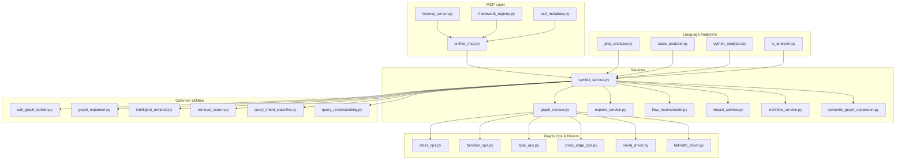
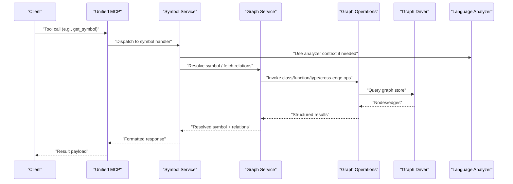
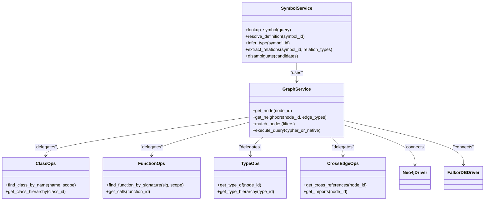
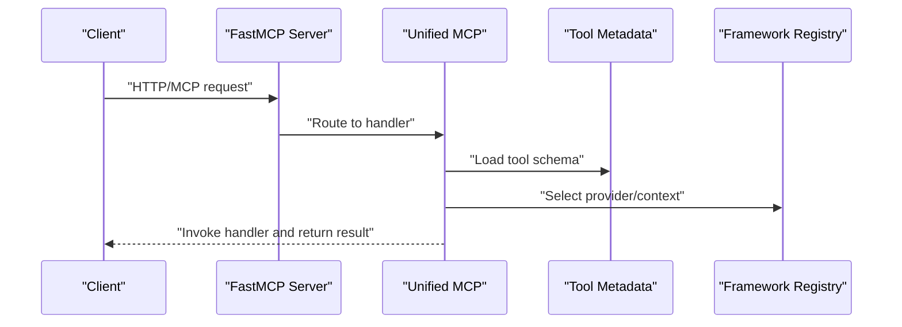
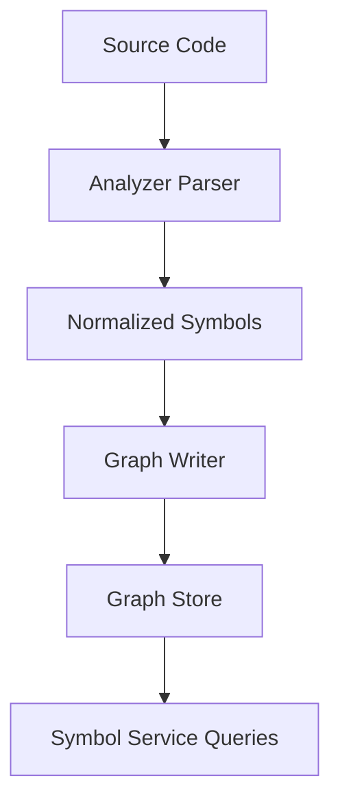
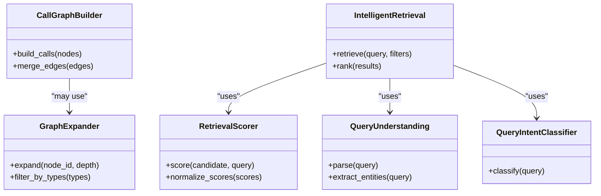
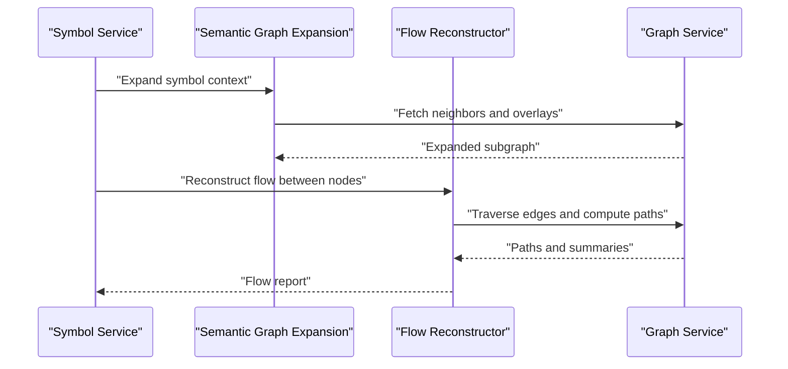
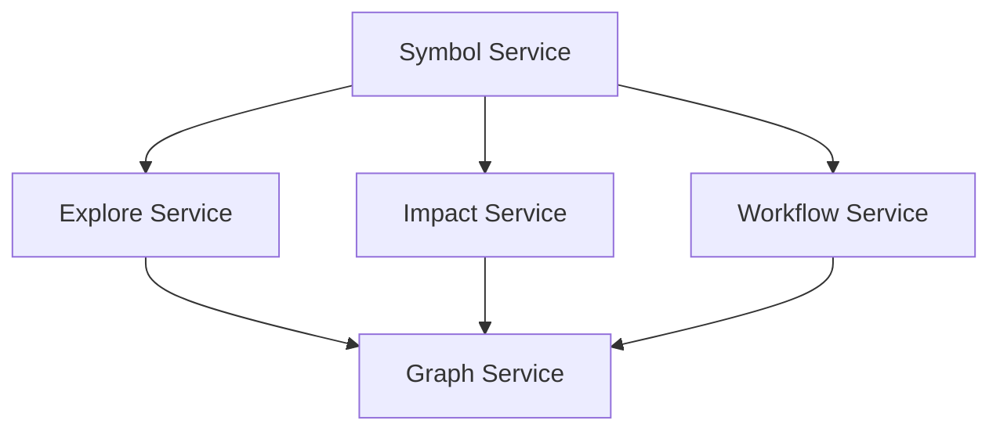
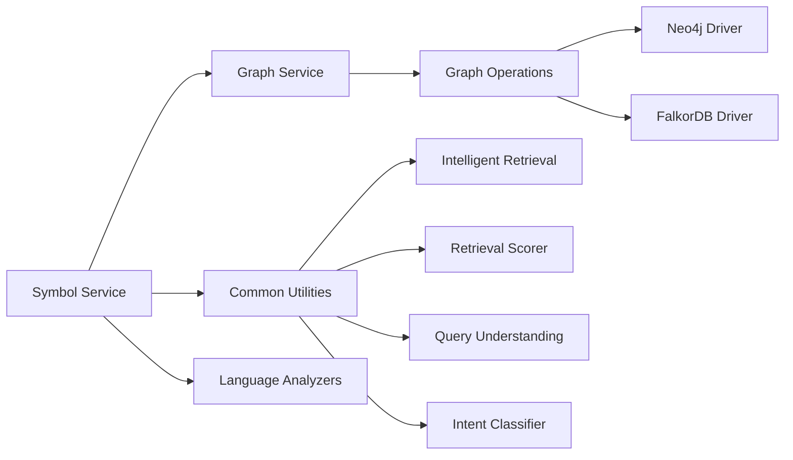

# Symbol Analysis Tools

<cite>
**Referenced Files in This Document**
- [symbol_service.py](file://code-tiny/mcp/services/symbol_service.py)
- [graph_service.py](file://code-tiny/mcp/services/graph_service.py)
- [unified_mcp.py](file://code-tiny/mcp/unified_mcp.py)
- [fastmcp_server.py](file://code-tiny/mcp/fastmcp_server.py)
- [framework_registry.py](file://code-tiny/mcp/framework_registry.py)
- [semantic_graph_expansion.py](file://code-tiny/mcp/semantic_graph_expansion.py)
- [tool_metadata.py](file://code-tiny/mcp/tool_metadata.py)
- [explore_service.py](file://code-tiny/mcp/services/explore_service.py)
- [flow_reconstructor.py](file://code-tiny/mcp/services/flow_reconstructor.py)
- [impact_service.py](file://code-tiny/mcp/services/impact_service.py)
- [workflow_service.py](file://code-tiny/mcp/services/workflow_service.py)
- [java_analyzer.py](file://code-tiny/tools/java/java_analyzer.py)
- [cplus_analyzer.py](file://code-tiny/tools/cplus/cplus_analyzer.py)
- [python_analyzer.py](file://code-tiny/tools/python/python_analyzer.py)
- [ts_analyzer.py](file://code-tiny/tools/ts/ts_analyzer.py)
- [call_graph_builder.py](file://code-tiny/tools/common/call_graph_builder.py)
- [graph_expander.py](file://code-tiny/tools/common/graph_expander.py)
- [intelligent_retrieval.py](file://code-tiny/tools/common/intelligent_retrieval.py)
- [retrieval_scorer.py](file://code-tiny/tools/common/retrieval_scorer.py)
- [query_intent_classifier.py](file://code-tiny/tools/common/query_intent_classifier.py)
- [query_understanding.py](file://code-tiny/tools/common/query_understanding.py)
- [neo4j_driver.py](file://code-tiny/tools/graph/driver/neo4j_driver.py)
- [falkordb_driver.py](file://code-tiny/tools/graph/driver/falkordb_driver.py)
- [class_ops.py](file://code-tiny/tools/graph/operations/class_ops.py)
- [function_ops.py](file://code-tiny/tools/graph/operations/function_ops.py)
- [type_ops.py](file://code-tiny/tools/graph/operations/type_ops.py)
- [cross_edge_ops.py](file://code-tiny/tools/graph/operations/cross_edge_ops.py)
- [test_get_symbol.json](file://code-tiny/testtool/input_exam/get_symbol.json)
- [listup_symbols_matching_file_path.json](file://code-tiny/testtool/input_exam/listup_symbols_matching_file_path.json)
- [search_functions.json](file://code-tiny/testtool/input_exam/search_functions.json)
- [trace_flow.json](file://code-tiny/testtool/input_exam/trace_flow.json)
</cite>

## Table of Contents
1. [Introduction](#introduction)
2. [Project Structure](#project-structure)
3. [Core Components](#core-components)
4. [Architecture Overview](#architecture-overview)
5. [Detailed Component Analysis](#detailed-component-analysis)
6. [Dependency Analysis](#dependency-analysis)
7. [Performance Considerations](#performance-considerations)
8. [Troubleshooting Guide](#troubleshooting-guide)
9. [Conclusion](#conclusion)
10. [Appendices](#appendices)

## Introduction
This document explains the symbol analysis tools in Cortex Harness MCP. It covers symbol lookup, definition resolution, type inference, and relationship extraction. It also documents how symbols are indexed and retrieved from the graph database, provides examples of symbol queries, dependency tracing, and cross-reference analysis, and describes the symbol service architecture and its integration with language-specific analyzers. Guidance is included for handling complex symbol relationships and resolving ambiguous references.

## Project Structure
The symbol analysis capability spans several layers:
- MCP server entrypoints and routing
- Symbol service orchestration
- Graph operations and drivers
- Language analyzers that produce symbol data
- Common utilities for retrieval, scoring, and query understanding

**Diagram sources**
- [unified_mcp.py](file://code-tiny/mcp/unified_mcp.py)
- [fastmcp_server.py](file://code-tiny/mcp/fastmcp_server.py)
- [framework_registry.py](file://code-tiny/mcp/framework_registry.py)
- [tool_metadata.py](file://code-tiny/mcp/tool_metadata.py)
- [symbol_service.py](file://code-tiny/mcp/services/symbol_service.py)
- [graph_service.py](file://code-tiny/mcp/services/graph_service.py)
- [explore_service.py](file://code-tiny/mcp/services/explore_service.py)
- [flow_reconstructor.py](file://code-tiny/mcp/services/flow_reconstructor.py)
- [impact_service.py](file://code-tiny/mcp/services/impact_service.py)
- [workflow_service.py](file://code-tiny/mcp/services/workflow_service.py)
- [semantic_graph_expansion.py](file://code-tiny/mcp/semantic_graph_expansion.py)
- [class_ops.py](file://code-tiny/tools/graph/operations/class_ops.py)
- [function_ops.py](file://code-tiny/tools/graph/operations/function_ops.py)
- [type_ops.py](file://code-tiny/tools/graph/operations/type_ops.py)
- [cross_edge_ops.py](file://code-tiny/tools/graph/operations/cross_edge_ops.py)
- [neo4j_driver.py](file://code-tiny/tools/graph/driver/neo4j_driver.py)
- [falkordb_driver.py](file://code-tiny/tools/graph/driver/falkordb_driver.py)
- [java_analyzer.py](file://code-tiny/tools/java/java_analyzer.py)
- [cplus_analyzer.py](file://code-tiny/tools/cplus/cplus_analyzer.py)
- [python_analyzer.py](file://code-tiny/tools/python/python_analyzer.py)
- [ts_analyzer.py](file://code-tiny/tools/ts/ts_analyzer.py)
- [call_graph_builder.py](file://code-tiny/tools/common/call_graph_builder.py)
- [graph_expander.py](file://code-tiny/tools/common/graph_expander.py)
- [intelligent_retrieval.py](file://code-tiny/tools/common/intelligent_retrieval.py)
- [retrieval_scorer.py](file://code-tiny/tools/common/retrieval_scorer.py)
- [query_intent_classifier.py](file://code-tiny/tools/common/query_intent_classifier.py)
- [query_understanding.py](file://code-tiny/tools/common/query_understanding.py)

**Section sources**
- [unified_mcp.py](file://code-tiny/mcp/unified_mcp.py)
- [fastmcp_server.py](file://code-tiny/mcp/fastmcp_server.py)
- [framework_registry.py](file://code-tiny/mcp/framework_registry.py)
- [tool_metadata.py](file://code-tiny/mcp/tool_metadata.py)
- [symbol_service.py](file://code-tiny/mcp/services/symbol_service.py)
- [graph_service.py](file://code-tiny/mcp/services/graph_service.py)

## Core Components
- Symbol Service: Orchestrates symbol lookups, definition resolution, type inference, and relationship extraction. It composes graph operations, common retrieval utilities, and analyzer outputs to answer symbol-centric queries.
- Graph Service: Provides a unified interface over graph operations (classes, functions, types, cross edges) and underlying drivers (Neo4j/FalkorDB).
- MCP Integration: Unified MCP layer exposes symbol capabilities as tools, with metadata and framework registry support.
- Language Analyzers: Produce normalized symbol artifacts consumed by the symbol service.
- Common Utilities: Query understanding, intent classification, intelligent retrieval, scoring, call graph building, and graph expansion.

Key responsibilities:
- Indexing: Analyzers write symbol nodes and edges into the graph store via graph operations.
- Retrieval: Symbol service uses graph ops and retrieval utilities to find symbols, resolve definitions, infer types, and extract relationships.
- Resolution: Disambiguation strategies leverage scope, file path, signature matching, and semantic similarity.

**Section sources**
- [symbol_service.py](file://code-tiny/mcp/services/symbol_service.py)
- [graph_service.py](file://code-tiny/mcp/services/graph_service.py)
- [unified_mcp.py](file://code-tiny/mcp/unified_mcp.py)
- [tool_metadata.py](file://code-tiny/mcp/tool_metadata.py)
- [framework_registry.py](file://code-tiny/mcp/framework_registry.py)
- [java_analyzer.py](file://code-tiny/tools/java/java_analyzer.py)
- [cplus_analyzer.py](file://code-tiny/tools/cplus/cplus_analyzer.py)
- [python_analyzer.py](file://code-tiny/tools/python/python_analyzer.py)
- [ts_analyzer.py](file://code-tiny/tools/ts/ts_analyzer.py)
- [call_graph_builder.py](file://code-tiny/tools/common/call_graph_builder.py)
- [graph_expander.py](file://code-tiny/tools/common/graph_expander.py)
- [intelligent_retrieval.py](file://code-tiny/tools/common/intelligent_retrieval.py)
- [retrieval_scorer.py](file://code-tiny/tools/common/retrieval_scorer.py)
- [query_intent_classifier.py](file://code-tiny/tools/common/query_intent_classifier.py)
- [query_understanding.py](file://code-tiny/tools/common/query_understanding.py)

## Architecture Overview
The symbol analysis pipeline integrates MCP tool calls with services, graph operations, and analyzers.

**Diagram sources**
- [unified_mcp.py](file://code-tiny/mcp/unified_mcp.py)
- [symbol_service.py](file://code-tiny/mcp/services/symbol_service.py)
- [graph_service.py](file://code-tiny/mcp/services/graph_service.py)
- [class_ops.py](file://code-tiny/tools/graph/operations/class_ops.py)
- [function_ops.py](file://code-tiny/tools/graph/operations/function_ops.py)
- [type_ops.py](file://code-tiny/tools/graph/operations/type_ops.py)
- [cross_edge_ops.py](file://code-tiny/tools/graph/operations/cross_edge_ops.py)
- [neo4j_driver.py](file://code-tiny/tools/graph/driver/neo4j_driver.py)
- [falkordb_driver.py](file://code-tiny/tools/graph/driver/falkordb_driver.py)
- [java_analyzer.py](file://code-tiny/tools/java/java_analyzer.py)
- [cplus_analyzer.py](file://code-tiny/tools/cplus/cplus_analyzer.py)
- [python_analyzer.py](file://code-tiny/tools/python/python_analyzer.py)
- [ts_analyzer.py](file://code-tiny/tools/ts/ts_analyzer.py)

## Detailed Component Analysis

### Symbol Service
Responsibilities:
- Symbol lookup by name, file path, or identifier
- Definition resolution across scopes and modules
- Type inference using type nodes and relationships
- Relationship extraction (calls, imports, extends, implements, etc.)
- Ambiguity resolution using signature, location, and semantic signals

Integration points:
- Graph Service for read/write operations
- Common utilities for retrieval, scoring, and query understanding
- Language analyzers for symbol ingestion and context

**Diagram sources**
- [symbol_service.py](file://code-tiny/mcp/services/symbol_service.py)
- [graph_service.py](file://code-tiny/mcp/services/graph_service.py)
- [class_ops.py](file://code-tiny/tools/graph/operations/class_ops.py)
- [function_ops.py](file://code-tiny/tools/graph/operations/function_ops.py)
- [type_ops.py](file://code-tiny/tools/graph/operations/type_ops.py)
- [cross_edge_ops.py](file://code-tiny/tools/graph/operations/cross_edge_ops.py)
- [neo4j_driver.py](file://code-tiny/tools/graph/driver/neo4j_driver.py)
- [falkordb_driver.py](file://code-tiny/tools/graph/driver/falkordb_driver.py)

**Section sources**
- [symbol_service.py](file://code-tiny/mcp/services/symbol_service.py)
- [graph_service.py](file://code-tiny/mcp/services/graph_service.py)
- [class_ops.py](file://code-tiny/tools/graph/operations/class_ops.py)
- [function_ops.py](file://code-tiny/tools/graph/operations/function_ops.py)
- [type_ops.py](file://code-tiny/tools/graph/operations/type_ops.py)
- [cross_edge_ops.py](file://code-tiny/tools/graph/operations/cross_edge_ops.py)
- [neo4j_driver.py](file://code-tiny/tools/graph/driver/neo4j_driver.py)
- [falkordb_driver.py](file://code-tiny/tools/graph/driver/falkordb_driver.py)

### MCP Integration and Tool Exposure
- Unified MCP layer routes incoming tool requests to appropriate handlers.
- Tool metadata defines schemas and descriptions for symbol-related tools.
- Framework registry supports capability discovery and provider selection.

**Diagram sources**
- [fastmcp_server.py](file://code-tiny/mcp/fastmcp_server.py)
- [unified_mcp.py](file://code-tiny/mcp/unified_mcp.py)
- [tool_metadata.py](file://code-tiny/mcp/tool_metadata.py)
- [framework_registry.py](file://code-tiny/mcp/framework_registry.py)

**Section sources**
- [fastmcp_server.py](file://code-tiny/mcp/fastmcp_server.py)
- [unified_mcp.py](file://code-tiny/mcp/unified_mcp.py)
- [tool_metadata.py](file://code-tiny/mcp/tool_metadata.py)
- [framework_registry.py](file://code-tiny/mcp/framework_registry.py)

### Language-Specific Analyzers
Analyzers parse source code and emit normalized symbol artifacts consumed by the symbol service. Examples include Java, C++, Python, and TypeScript analyzers. They integrate with the graph writer layer to persist symbols and relationships.

[No sources needed since this diagram shows conceptual workflow, not actual code structure]

**Section sources**
- [java_analyzer.py](file://code-tiny/tools/java/java_analyzer.py)
- [cplus_analyzer.py](file://code-tiny/tools/cplus/cplus_analyzer.py)
- [python_analyzer.py](file://code-tiny/tools/python/python_analyzer.py)
- [ts_analyzer.py](file://code-tiny/tools/ts/ts_analyzer.py)

### Common Utilities for Symbol Analysis
- Call graph builder: constructs call relationships between functions/methods.
- Graph expander: expands neighborhoods around symbols for context.
- Intelligent retrieval: combines keyword and semantic search to rank candidates.
- Retrieval scorer: scores matches based on signature, proximity, and semantics.
- Query understanding and intent classifier: interprets user intent to tailor queries.

**Diagram sources**
- [call_graph_builder.py](file://code-tiny/tools/common/call_graph_builder.py)
- [graph_expander.py](file://code-tiny/tools/common/graph_expander.py)
- [intelligent_retrieval.py](file://code-tiny/tools/common/intelligent_retrieval.py)
- [retrieval_scorer.py](file://code-tiny/tools/common/retrieval_scorer.py)
- [query_understanding.py](file://code-tiny/tools/common/query_understanding.py)
- [query_intent_classifier.py](file://code-tiny/tools/common/query_intent_classifier.py)

**Section sources**
- [call_graph_builder.py](file://code-tiny/tools/common/call_graph_builder.py)
- [graph_expander.py](file://code-tiny/tools/common/graph_expander.py)
- [intelligent_retrieval.py](file://code-tiny/tools/common/intelligent_retrieval.py)
- [retrieval_scorer.py](file://code-tiny/tools/common/retrieval_scorer.py)
- [query_understanding.py](file://code-tiny/tools/common/query_understanding.py)
- [query_intent_classifier.py](file://code-tiny/tools/common/query_intent_classifier.py)

### Semantic Graph Expansion and Flow Reconstruction
Semantic graph expansion augments symbol contexts with related nodes and edges. Flow reconstruction builds execution paths and traces dependencies across modules.

**Diagram sources**
- [semantic_graph_expansion.py](file://code-tiny/mcp/semantic_graph_expansion.py)
- [flow_reconstructor.py](file://code-tiny/mcp/services/flow_reconstructor.py)
- [graph_service.py](file://code-tiny/mcp/services/graph_service.py)

**Section sources**
- [semantic_graph_expansion.py](file://code-tiny/mcp/semantic_graph_expansion.py)
- [flow_reconstructor.py](file://code-tiny/mcp/services/flow_reconstructor.py)

### Explore, Impact, and Workflow Services
Explore service aids navigation and browsing of symbol graphs. Impact service computes change impact across dependents. Workflow service orchestrates multi-step analyses involving symbols.

**Diagram sources**
- [explore_service.py](file://code-tiny/mcp/services/explore_service.py)
- [impact_service.py](file://code-tiny/mcp/services/impact_service.py)
- [workflow_service.py](file://code-tiny/mcp/services/workflow_service.py)
- [graph_service.py](file://code-tiny/mcp/services/graph_service.py)

**Section sources**
- [explore_service.py](file://code-tiny/mcp/services/explore_service.py)
- [impact_service.py](file://code-tiny/mcp/services/impact_service.py)
- [workflow_service.py](file://code-tiny/mcp/services/workflow_service.py)

## Dependency Analysis
Symbol analysis depends on:
- Graph operations for precise node and edge access
- Drivers for persistence backends
- Analyzers for symbol ingestion
- Common utilities for retrieval and scoring

**Diagram sources**
- [symbol_service.py](file://code-tiny/mcp/services/symbol_service.py)
- [graph_service.py](file://code-tiny/mcp/services/graph_service.py)
- [neo4j_driver.py](file://code-tiny/tools/graph/driver/neo4j_driver.py)
- [falkordb_driver.py](file://code-tiny/tools/graph/driver/falkordb_driver.py)
- [intelligent_retrieval.py](file://code-tiny/tools/common/intelligent_retrieval.py)
- [retrieval_scorer.py](file://code-tiny/tools/common/retrieval_scorer.py)
- [query_understanding.py](file://code-tiny/tools/common/query_understanding.py)
- [query_intent_classifier.py](file://code-tiny/tools/common/query_intent_classifier.py)
- [java_analyzer.py](file://code-tiny/tools/java/java_analyzer.py)
- [cplus_analyzer.py](file://code-tiny/tools/cplus/cplus_analyzer.py)
- [python_analyzer.py](file://code-tiny/tools/python/python_analyzer.py)
- [ts_analyzer.py](file://code-tiny/tools/ts/ts_analyzer.py)

**Section sources**
- [symbol_service.py](file://code-tiny/mcp/services/symbol_service.py)
- [graph_service.py](file://code-tiny/mcp/services/graph_service.py)
- [neo4j_driver.py](file://code-tiny/tools/graph/driver/neo4j_driver.py)
- [falkordb_driver.py](file://code-tiny/tools/graph/driver/falkordb_driver.py)
- [intelligent_retrieval.py](file://code-tiny/tools/common/intelligent_retrieval.py)
- [retrieval_scorer.py](file://code-tiny/tools/common/retrieval_scorer.py)
- [query_understanding.py](file://code-tiny/tools/common/query_understanding.py)
- [query_intent_classifier.py](file://code-tiny/tools/common/query_intent_classifier.py)
- [java_analyzer.py](file://code-tiny/tools/java/java_analyzer.py)
- [cplus_analyzer.py](file://code-tiny/tools/cplus/cplus_analyzer.py)
- [python_analyzer.py](file://code-tiny/tools/python/python_analyzer.py)
- [ts_analyzer.py](file://code-tiny/tools/ts/ts_analyzer.py)

## Performance Considerations
- Prefer targeted graph operations over broad scans; filter by scope and type early.
- Use intelligent retrieval to reduce candidate sets before expensive scoring.
- Cache frequent symbol lookups at the service layer when safe.
- Batch neighbor expansions to avoid repeated driver round-trips.
- Tune scoring thresholds to balance precision and recall.

[No sources needed since this section provides general guidance]

## Troubleshooting Guide
Common issues and resolutions:
- Ambiguous symbol references: disambiguate using file path, signature, and semantic similarity; fall back to interactive clarification if necessary.
- Missing definitions: ensure analyzers have run successfully and symbols are persisted; verify graph indexes exist.
- Slow queries: refine filters, limit traversal depth, and prefer specific operation endpoints.
- Inconsistent types: validate type inference by checking type nodes and relationships; re-run type analysis if needed.

Operational checks:
- Verify MCP tool metadata and routing are correct.
- Confirm graph driver connectivity and backend availability.
- Validate analyzer outputs and normalization contracts.

**Section sources**
- [unified_mcp.py](file://code-tiny/mcp/unified_mcp.py)
- [tool_metadata.py](file://code-tiny/mcp/tool_metadata.py)
- [neo4j_driver.py](file://code-tiny/tools/graph/driver/neo4j_driver.py)
- [falkordb_driver.py](file://code-tiny/tools/graph/driver/falkordb_driver.py)

## Conclusion
Cortex Harness MCP’s symbol analysis tools provide robust symbol lookup, definition resolution, type inference, and relationship extraction through a layered architecture. The symbol service coordinates graph operations, retrieval utilities, and language analyzers to deliver accurate and efficient symbol insights. With careful scoping, indexing, and disambiguation strategies, complex symbol relationships can be navigated effectively.

[No sources needed since this section summarizes without analyzing specific files]

## Appendices

### Example Symbol Queries and Workflows
- Get symbol details: retrieve a symbol by identifier or name within a scope.
- List symbols by file path: enumerate symbols defined in a given file.
- Search functions: locate functions matching patterns or signatures.
- Trace flow: reconstruct execution paths between two symbols.

For concrete payloads and parameters, see the test input examples:
- [get_symbol.json](file://code-tiny/testtool/input_exam/get_symbol.json)
- [listup_symbols_matching_file_path.json](file://code-tiny/testtool/input_exam/listup_symbols_matching_file_path.json)
- [search_functions.json](file://code-tiny/testtool/input_exam/search_functions.json)
- [trace_flow.json](file://code-tiny/testtool/input_exam/trace_flow.json)

**Section sources**
- [test_get_symbol.json](file://code-tiny/testtool/input_exam/get_symbol.json)
- [listup_symbols_matching_file_path.json](file://code-tiny/testtool/input_exam/listup_symbols_matching_file_path.json)
- [search_functions.json](file://code-tiny/testtool/input_exam/search_functions.json)
- [trace_flow.json](file://code-tiny/testtool/input_exam/trace_flow.json)