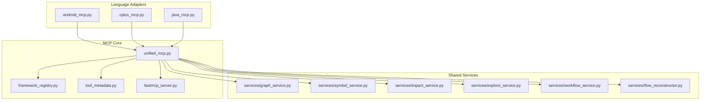
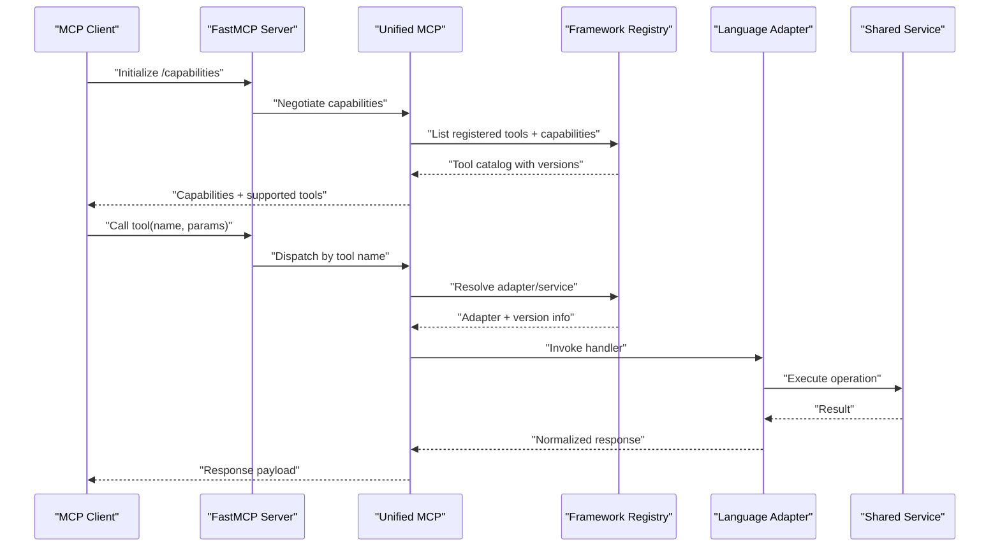
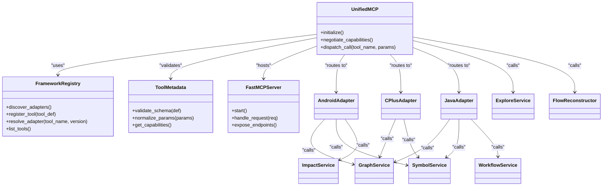

# Tool Registration & Metadata

<cite>
**Referenced Files in This Document**
- [unified_mcp.py](file://code-tiny/mcp/unified_mcp.py)
- [framework_registry.py](file://code-tiny/mcp/framework_registry.py)
- [tool_metadata.py](file://code-tiny/mcp/tool_metadata.py)
- [fastmcp_server.py](file://code-tiny/mcp/fastmcp_server.py)
- [android_mcp.py](file://code-tiny/mcp/android/android_mcp.py)
- [cplus_mcp.py](file://code-tiny/mcp/cplus/cplus_mcp.py)
- [java_mcp.py](file://code-tiny/mcp/java/java_mcp.py)
- [Readme.md](file://code-tiny/mcp/Readme.md)
</cite>

## Table of Contents
1. [Introduction](#introduction)
2. [Project Structure](#project-structure)
3. [Core Components](#core-components)
4. [Architecture Overview](#architecture-overview)
5. [Detailed Component Analysis](#detailed-component-analysis)
6. [Dependency Analysis](#dependency-analysis)
7. [Performance Considerations](#performance-considerations)
8. [Troubleshooting Guide](#troubleshooting-guide)
9. [Conclusion](#conclusion)
10. [Appendices](#appendices)

## Introduction

This document explains how Cortex Harness registers MCP tools, defines their metadata, negotiates capabilities, discovers and validates new tools, and exposes them through the MCP interface. It also documents the framework registry system for lifecycle and versioning, and provides guidance for extending the MCP system with custom capabilities while maintaining compatibility across clients.

## Project Structure

The MCP subsystem is organized under code-tiny/mcp with a layered design:
- Unified entrypoint and server orchestration
- Framework-aware registry for discovery and routing
- Centralized metadata schema and validation
- Language-specific MCP adapters (Android, C++, Java)
- Shared services for graph, symbol, flow, and workflow operations

[No sources needed since this diagram shows conceptual workflow, not actual code structure]

## Core Components

- Unified MCP entrypoint: orchestrates server startup, capability negotiation, and request dispatch to language adapters and shared services.
- Framework registry: manages tool discovery, registration, capability negotiation, and lifecycle/versioning.
- Tool metadata: defines schemas for tool definitions, parameters, return types, and capability tags; includes validation helpers.
- FastMCP server: lightweight HTTP transport layer exposing MCP endpoints.
- Language adapters: per-language MCP modules that register domain-specific tools and map requests to shared services.

Key responsibilities:
- Discovery: scan available analyzers and adapters at runtime.
- Validation: enforce metadata contracts and parameter schemas.
- Capability negotiation: advertise supported features and filter client requests accordingly.
- Lifecycle management: initialize, hot-reload, and gracefully shutdown tools.
- Versioning: track tool versions and ensure backward-compatible updates.

**Section sources**
- [unified_mcp.py](file://code-tiny/mcp/unified_mcp.py)
- [framework_registry.py](file://code-tiny/mcp/framework_registry.py)
- [tool_metadata.py](file://code-tiny/mcp/tool_metadata.py)
- [fastmcp_server.py](file://code-tiny/mcp/fastmcp_server.py)
- [android_mcp.py](file://code-tiny/mcp/android/android_mcp.py)
- [cplus_mcp.py](file://code-tiny/mcp/cplus/cplus_mcp.py)
- [java_mcp.py](file://code-tiny/mcp/java/java_mcp.py)

## Architecture Overview

The MCP system follows a registry-driven architecture where tools are discovered, validated, and exposed via a unified interface. Capability negotiation ensures clients only receive tools they support.

**Diagram sources**
- [unified_mcp.py](file://code-tiny/mcp/unified_mcp.py)
- [framework_registry.py](file://code-tiny/mcp/framework_registry.py)
- [fastmcp_server.py](file://code-tiny/mcp/fastmcp_server.py)
- [android_mcp.py](file://code-tiny/mcp/android/android_mcp.py)
- [cplus_mcp.py](file://code-tiny/mcp/cplus/cplus_mcp.py)
- [java_mcp.py](file://code-tiny/mcp/java/java_mcp.py)

## Detailed Component Analysis

### Unified MCP Entrypoint
Responsibilities:
- Initialize the FastMCP server and register routes.
- Perform capability negotiation with clients.
- Route incoming requests to appropriate adapters or shared services.
- Enforce metadata validation before invoking handlers.

Operational flow:
- On startup, load configuration and discover available adapters.
- Build a capability matrix based on registered tools and their declared features.
- Expose endpoints for listing tools, querying capabilities, and executing calls.

Error handling:
- Validate incoming payloads against tool metadata schemas.
- Return structured errors with codes and messages for client recovery.

**Section sources**
- [unified_mcp.py](file://code-tiny/mcp/unified_mcp.py)
- [fastmcp_server.py](file://code-tiny/mcp/fastmcp_server.py)

### Framework Registry
Responsibilities:
- Discover tools from language adapters and analyzer packages.
- Register tools with metadata and capability tags.
- Manage tool lifecycle: init, reload, shutdown.
- Track versions and resolve compatible implementations.

Discovery process:
- Scan adapter modules and import tool definitions.
- Parse metadata and validate against schema.
- Index tools by name, version, and capability tags.

Versioning strategy:
- Maintain a registry table mapping tool names to versions.
- Prefer latest compatible version unless client explicitly requests an older one.
- Support deprecation warnings and fallbacks.

**Section sources**
- [framework_registry.py](file://code-tiny/mcp/framework_registry.py)

### Tool Metadata Schema
Responsibilities:
- Define canonical schema for tool definitions, parameters, and returns.
- Provide validators for required fields, types, and constraints.
- Attach capability tags to enable selective exposure.

Schema highlights:
- Tool identity: name, version, description.
- Parameters: typed inputs with defaults and validation rules.
- Returns: output shape and semantics.
- Capabilities: feature flags such as read-only, streaming, batch.

Validation:
- Reject malformed tool definitions early during registration.
- Provide actionable diagnostics for missing or invalid fields.

**Section sources**
- [tool_metadata.py](file://code-tiny/mcp/tool_metadata.py)

### Language Adapters (Android, C++, Java)
Responsibilities:
- Register language-specific tools and map them to shared services.
- Translate MCP calls into service invocations.
- Handle language-specific parameter coercion and result normalization.

Examples:
- Android adapter: exposes graph, symbol, and impact analysis tools for Android projects.
- C++ adapter: exposes similar capabilities tailored to C++ ecosystems.
- Java adapter: integrates with Java/Kotlin frameworks and symbols.

Lifecycle:
- Adapters are loaded dynamically by the registry.
- Each adapter declares its own capabilities and version constraints.

**Section sources**
- [android_mcp.py](file://code-tiny/mcp/android/android_mcp.py)
- [cplus_mcp.py](file://code-tiny/mcp/cplus/cplus_mcp.py)
- [java_mcp.py](file://code-tiny/mcp/java/java_mcp.py)

### Shared Services
Responsibilities:
- Implement core analysis and query logic used by multiple adapters.
- Provide consistent interfaces for graph traversal, symbol lookup, impact analysis, exploration, workflows, and flow reconstruction.

Services:
- Graph service: queries and manipulates the semantic graph.
- Symbol service: resolves symbols and relationships.
- Impact service: computes change impact and dependencies.
- Explore service: supports exploratory queries and summaries.
- Workflow service: orchestrates multi-step analyses.
- Flow reconstructor: rebuilds control/data flows from parsed artifacts.

**Section sources**
- [services/graph_service.py](file://code-tiny/mcp/services/graph_service.py)
- [services/symbol_service.py](file://code-tiny/mcp/services/symbol_service.py)
- [services/impact_service.py](file://code-tiny/mcp/services/impact_service.py)
- [services/explore_service.py](file://code-tiny/mcp/services/explore_service.py)
- [services/workflow_service.py](file://code-tiny/mcp/services/workflow_service.py)
- [services/flow_reconstructor.py](file://code-tiny/mcp/services/flow_reconstructor.py)

### MCP Server Transport
Responsibilities:
- Expose HTTP endpoints for MCP clients.
- Serialize/deserialize requests and responses.
- Enforce rate limits and basic security policies.

Endpoints:
- Initialization and capability negotiation.
- Tool listing and invocation.
- Health checks and diagnostics.

**Section sources**
- [fastmcp_server.py](file://code-tiny/mcp/fastmcp_server.py)

## Dependency Analysis

**Diagram sources**
- [unified_mcp.py](file://code-tiny/mcp/unified_mcp.py)
- [framework_registry.py](file://code-tiny/mcp/framework_registry.py)
- [tool_metadata.py](file://code-tiny/mcp/tool_metadata.py)
- [fastmcp_server.py](file://code-tiny/mcp/fastmcp_server.py)
- [android_mcp.py](file://code-tiny/mcp/android/android_mcp.py)
- [cplus_mcp.py](file://code-tiny/mcp/cplus/cplus_mcp.py)
- [java_mcp.py](file://code-tiny/mcp/java/java_mcp.py)
- [services/graph_service.py](file://code-tiny/mcp/services/graph_service.py)
- [services/symbol_service.py](file://code-tiny/mcp/services/symbol_service.py)
- [services/impact_service.py](file://code-tiny/mcp/services/impact_service.py)
- [services/explore_service.py](file://code-tiny/mcp/services/explore_service.py)
- [services/workflow_service.py](file://code-tiny/mcp/services/workflow_service.py)
- [services/flow_reconstructor.py](file://code-tiny/mcp/services/flow_reconstructor.py)

**Section sources**
- [unified_mcp.py](file://code-tiny/mcp/unified_mcp.py)
- [framework_registry.py](file://code-tiny/mcp/framework_registry.py)
- [tool_metadata.py](file://code-tiny/mcp/tool_metadata.py)
- [fastmcp_server.py](file://code-tiny/mcp/fastmcp_server.py)
- [android_mcp.py](file://code-tiny/mcp/android/android_mcp.py)
- [cplus_mcp.py](file://code-tiny/mcp/cplus/cplus_mcp.py)
- [java_mcp.py](file://code-tiny/mcp/java/java_mcp.py)

## Performance Considerations

- Lazy loading: defer heavy initialization until first use to reduce startup time.
- Caching: cache expensive graph queries and symbol resolutions where safe.
- Batch operations: group related calls to minimize overhead.
- Streaming: support large result sets via streaming endpoints when available.
- Concurrency: limit concurrent executions per tool to avoid resource exhaustion.

[No sources needed since this section provides general guidance]

## Troubleshooting Guide

Common issues and remedies:
- Tool not found: verify registration and capability advertisement; check version resolution.
- Parameter validation failures: inspect metadata schema and input coercion; ensure required fields are present.
- Capability mismatch: confirm client advertised capabilities match tool requirements.
- Service unavailability: check health endpoints and dependency readiness (e.g., graph store).
- Version conflicts: pin client versions or adjust registry policy to prefer compatible versions.

Diagnostics:
- Use capability listing to verify exposed tools and versions.
- Enable detailed logging around registration and dispatch paths.
- Validate tool metadata offline before deployment.

**Section sources**
- [unified_mcp.py](file://code-tiny/mcp/unified_mcp.py)
- [framework_registry.py](file://code-tiny/mcp/framework_registry.py)
- [tool_metadata.py](file://code-tiny/mcp/tool_metadata.py)
- [fastmcp_server.py](file://code-tiny/mcp/fastmcp_server.py)

## Conclusion

Cortex Harness implements a robust MCP tool registration and metadata system centered on a framework registry, strict metadata validation, and capability negotiation. Language adapters integrate domain-specific analyzers through shared services, enabling consistent tool exposure across platforms. By following the patterns outlined here, teams can extend the MCP system with new capabilities while preserving compatibility across diverse clients.

[No sources needed since this section summarizes without analyzing specific files]

## Appendices

### Example: Custom Tool Implementation

Steps to add a new tool:
- Define metadata: specify name, version, description, parameters, returns, and capability tags.
- Implement handler: write logic in a language adapter or shared service.
- Register tool: invoke the registry’s registration API with validated metadata.
- Test: run capability negotiation and call the tool via the MCP endpoint.

References:
- Metadata schema and validation: [tool_metadata.py](file://code-tiny/mcp/tool_metadata.py)
- Registration and lifecycle: [framework_registry.py](file://code-tiny/mcp/framework_registry.py)
- Adapter pattern example: [android_mcp.py](file://code-tiny/mcp/android/android_mcp.py), [cplus_mcp.py](file://code-tiny/mcp/cplus/cplus_mcp.py), [java_mcp.py](file://code-tiny/mcp/java/java_mcp.py)

**Section sources**
- [tool_metadata.py](file://code-tiny/mcp/tool_metadata.py)
- [framework_registry.py](file://code-tiny/mcp/framework_registry.py)
- [android_mcp.py](file://code-tiny/mcp/android/android_mcp.py)
- [cplus_mcp.py](file://code-tiny/mcp/cplus/cplus_mcp.py)
- [java_mcp.py](file://code-tiny/mcp/java/java_mcp.py)

### Example: Capability Declaration

Guidelines:
- Declare capabilities declaratively in tool metadata.
- Use capability tags to gate features (e.g., read-only, streaming).
- Ensure client advertises matching capabilities during negotiation.

References:
- Capability negotiation flow: [unified_mcp.py](file://code-tiny/mcp/unified_mcp.py)
- Server endpoints: [fastmcp_server.py](file://code-tiny/mcp/fastmcp_server.py)

**Section sources**
- [unified_mcp.py](file://code-tiny/mcp/unified_mcp.py)
- [fastmcp_server.py](file://code-tiny/mcp/fastmcp_server.py)

### Compatibility Across Clients

Best practices:
- Prefer stable metadata schemas and avoid breaking changes.
- Provide versioned tool endpoints or negotiate versions during initialization.
- Gracefully degrade functionality when optional capabilities are absent.

References:
- Registry versioning: [framework_registry.py](file://code-tiny/mcp/framework_registry.py)
- Unified negotiation: [unified_mcp.py](file://code-tiny/mcp/unified_mcp.py)

**Section sources**
- [framework_registry.py](file://code-tiny/mcp/framework_registry.py)
- [unified_mcp.py](file://code-tiny/mcp/unified_mcp.py)