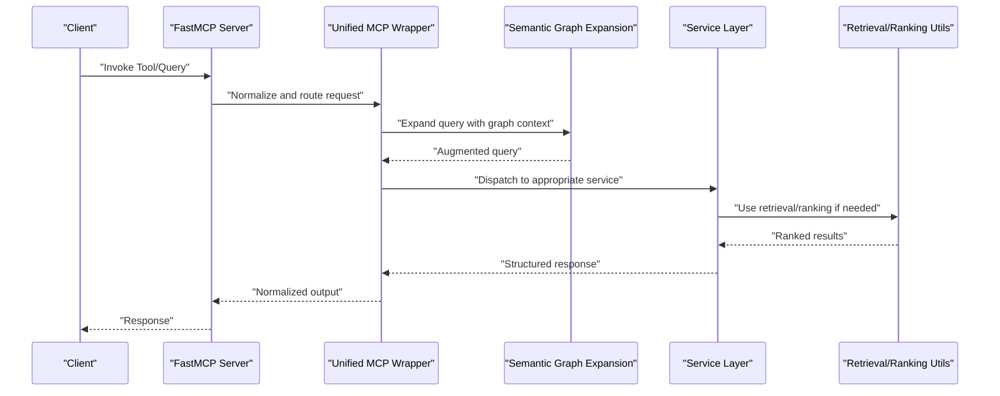
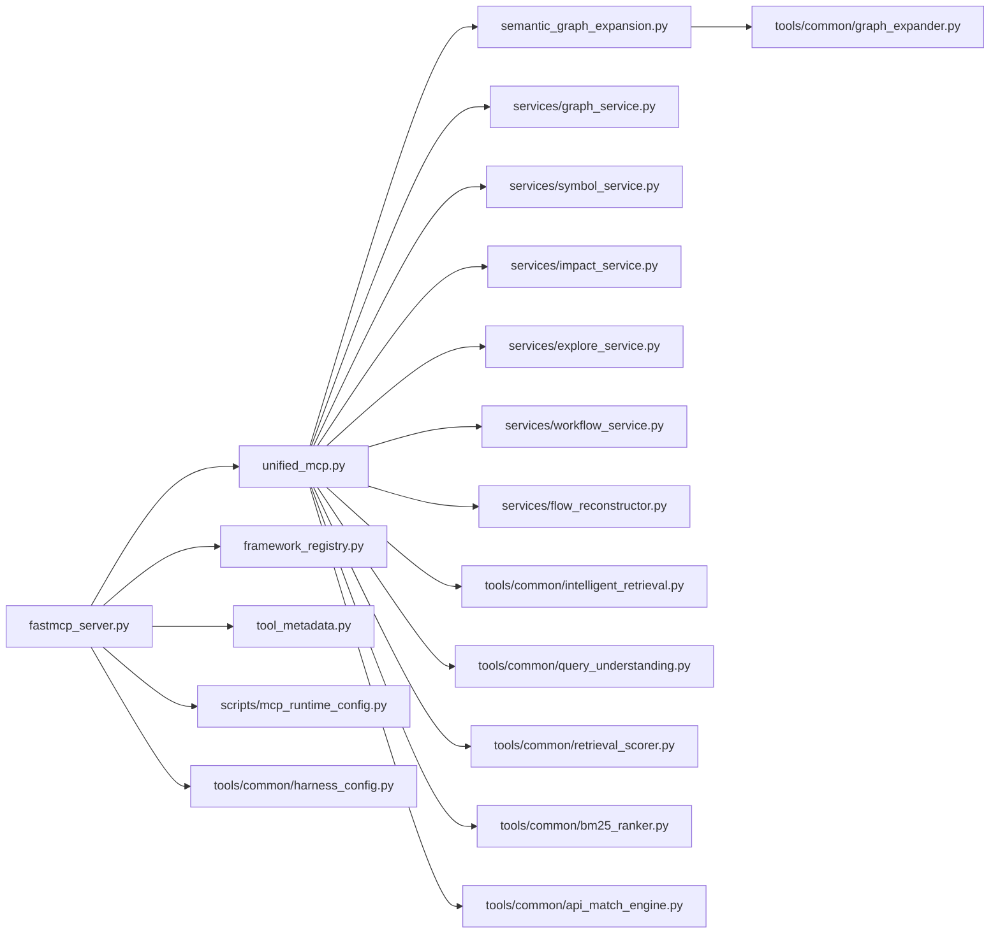

# FastMCP Server Configuration

<cite>
**Referenced Files in This Document**
- [fastmcp_server.py](file://code-tiny/mcp/fastmcp_server.py)
- [unified_mcp.py](file://code-tiny/mcp/unified_mcp.py)
- [semantic_graph_expansion.py](file://code-tiny/mcp/semantic_graph_expansion.py)
- [framework_registry.py](file://code-tiny/mcp/framework_registry.py)
- [tool_metadata.py](file://code-tiny/mcp/tool_metadata.py)
- [graph_service.py](file://code-tiny/mcp/services/graph_service.py)
- [symbol_service.py](file://code-tiny/mcp/services/symbol_service.py)
- [impact_service.py](file://code-tiny/mcp/services/impact_service.py)
- [explore_service.py](file://code-tiny/mcp/services/explore_service.py)
- [workflow_service.py](file://code-tiny/mcp/services/workflow_service.py)
- [flow_reconstructor.py](file://code-tiny/mcp/services/flow_reconstructor.py)
- [harness_config.py](file://code-tiny/tools/common/harness_config.py)
- [graph_expander.py](file://code-tiny/tools/common/graph_expander.py)
- [intelligent_retrieval.py](file://code-tiny/tools/common/intelligent_retrieval.py)
- [query_understanding.py](file://code-tiny/tools/common/query_understanding.py)
- [retrieval_scorer.py](file://code-tiny/tools/common/retrieval_scorer.py)
- [bm25_ranker.py](file://code-tiny/tools/common/bm25_ranker.py)
- [api_match_engine.py](file://code-tiny/tools/common/api_match_engine.py)
- [mcp_runtime_config.py](file://scripts/mcp_runtime_config.py)
- [test_unified_mcp_input_coercion.py](file://tests/test_unified_mcp_input_coercion.py)
- [test_semantic_graph_expansion.py](file://tests/test_semantic_graph_expansion.py)
- [test_mcp_http_resilience.py](file://tests/test_mcp_http_resilience.py)
- [test_mcp_acceptance_matrix.py](file://tests/test_mcp_acceptance_matrix.py)
</cite>

## Table of Contents
1. [Introduction](#introduction)
2. [Project Structure](#project-structure)
3. [Core Components](#core-components)
4. [Architecture Overview](#architecture-overview)
5. [Detailed Component Analysis](#detailed-component-analysis)
6. [Dependency Analysis](#dependency-analysis)
7. [Performance Considerations](#performance-considerations)
8. [Security and Access Control](#security-and-access-control)
9. [Configuration Examples](#configuration-examples)
10. [Troubleshooting Guide](#troubleshooting-guide)
11. [Conclusion](#conclusion)

## Introduction
This document explains how to configure and operate the FastMCP server within Cortex Harness. It covers initialization, connection management, performance tuning, semantic graph expansion integration, configuration examples for different deployments, environment variables, runtime parameters, connection pooling, timeouts, resource management, security considerations, authentication mechanisms, access control patterns, troubleshooting, and performance tuning recommendations.

## Project Structure
The FastMCP server implementation is primarily located under code-tiny/mcp with supporting services and shared utilities under code-tiny/tools/common. Runtime configuration helpers are provided under scripts. Tests validate behavior and acceptance criteria.

```mermaid
graph TB
subgraph "FastMCP Core"
A["fastmcp_server.py"]
B["unified_mcp.py"]
C["semantic_graph_expansion.py"]
D["framework_registry.py"]
E["tool_metadata.py"]
end
subgraph "Services"
S1["services/graph_service.py"]
S2["services/symbol_service.py"]
S3["services/impact_service.py"]
S4["services/explore_service.py"]
S5["services/workflow_service.py"]
S6["services/flow_reconstructor.py"]
end
subgraph "Common Tools"
T1["tools/common/harness_config.py"]
T2["tools/common/graph_expander.py"]
T3["tools/common/intelligent_retrieval.py"]
T4["tools/common/query_understanding.py"]
T5["tools/common/retrieval_scorer.py"]
T6["tools/common/bm25_ranker.py"]
T7["tools/common/api_match_engine.py"]
end
subgraph "Runtime Config"
R1["scripts/mcp_runtime_config.py"]
end
A --> B
A --> C
A --> D
A --> E
B --> S1
B --> S2
B --> S3
B --> S4
B --> S5
B --> S6
C --> T2
B --> T3
B --> T4
B --> T5
B --> T6
B --> T7
A --> R1
A --> T1
```

**Diagram sources**
- [fastmcp_server.py:1-200](file://code-tiny/mcp/fastmcp_server.py#L1-L200)
- [unified_mcp.py:1-200](file://code-tiny/mcp/unified_mcp.py#L1-L200)
- [semantic_graph_expansion.py:1-200](file://code-tiny/mcp/semantic_graph_expansion.py#L1-L200)
- [framework_registry.py:1-200](file://code-tiny/mcp/framework_registry.py#L1-L200)
- [tool_metadata.py:1-200](file://code-tiny/mcp/tool_metadata.py#L1-L200)
- [graph_service.py:1-200](file://code-tiny/mcp/services/graph_service.py#L1-L200)
- [symbol_service.py:1-200](file://code-tiny/mcp/services/symbol_service.py#L1-L200)
- [impact_service.py:1-200](file://code-tiny/mcp/services/impact_service.py#L1-L200)
- [explore_service.py:1-200](file://code-tiny/mcp/services/explore_service.py#L1-L200)
- [workflow_service.py:1-200](file://code-tiny/mcp/services/workflow_service.py#L1-L200)
- [flow_reconstructor.py:1-200](file://code-tiny/mcp/services/flow_reconstructor.py#L1-L200)
- [harness_config.py:1-200](file://code-tiny/tools/common/harness_config.py#L1-L200)
- [graph_expander.py:1-200](file://code-tiny/tools/common/graph_expander.py#L1-L200)
- [intelligent_retrieval.py:1-200](file://code-tiny/tools/common/intelligent_retrieval.py#L1-L200)
- [query_understanding.py:1-200](file://code-tiny/tools/common/query_understanding.py#L1-L200)
- [retrieval_scorer.py:1-200](file://code-tiny/tools/common/retrieval_scorer.py#L1-L200)
- [bm25_ranker.py:1-200](file://code-tiny/tools/common/bm25_ranker.py#L1-L200)
- [api_match_engine.py:1-200](file://code-tiny/tools/common/api_match_engine.py#L1-L200)
- [mcp_runtime_config.py:1-200](file://scripts/mcp_runtime_config.py#L1-L200)

**Section sources**
- [fastmcp_server.py:1-200](file://code-tiny/mcp/fastmcp_server.py#L1-L200)
- [unified_mcp.py:1-200](file://code-tiny/mcp/unified_mcp.py#L1-L200)
- [semantic_graph_expansion.py:1-200](file://code-tiny/mcp/semantic_graph_expansion.py#L1-L200)
- [framework_registry.py:1-200](file://code-tiny/mcp/framework_registry.py#L1-L200)
- [tool_metadata.py:1-200](file://code-tiny/mcp/tool_metadata.py#L1-L200)
- [graph_service.py:1-200](file://code-tiny/mcp/services/graph_service.py#L1-L200)
- [symbol_service.py:1-200](file://code-tiny/mcp/services/symbol_service.py#L1-L200)
- [impact_service.py:1-200](file://code-tiny/mcp/services/impact_service.py#L1-L200)
- [explore_service.py:1-200](file://code-tiny/mcp/services/explore_service.py#L1-L200)
- [workflow_service.py:1-200](file://code-tiny/mcp/services/workflow_service.py#L1-L200)
- [flow_reconstructor.py:1-200](file://code-tiny/mcp/services/flow_reconstructor.py#L1-L200)
- [harness_config.py:1-200](file://code-tiny/tools/common/harness_config.py#L1-L200)
- [graph_expander.py:1-200](file://code-tiny/tools/common/graph_expander.py#L1-L200)
- [intelligent_retrieval.py:1-200](file://code-tiny/tools/common/intelligent_retrieval.py#L1-L200)
- [query_understanding.py:1-200](file://code-tiny/tools/common/query_understanding.py#L1-L200)
- [retrieval_scorer.py:1-200](file://code-tiny/tools/common/retrieval_scorer.py#L1-L200)
- [bm25_ranker.py:1-200](file://code-tiny/tools/common/bm25_ranker.py#L1-L200)
- [api_match_engine.py:1-200](file://code-tiny/tools/common/api_match_engine.py#L1-L200)
- [mcp_runtime_config.py:1-200](file://scripts/mcp_runtime_config.py#L1-L200)

## Core Components
- FastMCP server entrypoint and lifecycle management
- Unified MCP wrapper that normalizes inputs and routes calls
- Semantic graph expansion module that augments queries with graph-aware context
- Framework registry and tool metadata for capability discovery and validation
- Services layer (graph, symbol, impact, explore, workflow, flow reconstruction)
- Shared retrieval and ranking utilities used by the unified MCP layer
- Runtime configuration loader for environment-driven settings

Key responsibilities:
- Initialize and run the FastMCP server with configurable options
- Manage connections, timeouts, and resource cleanup
- Expand queries using semantic graph expansion
- Route requests to appropriate tools/services
- Apply input coercion and validation
- Provide observability and resilience hooks

**Section sources**
- [fastmcp_server.py:1-200](file://code-tiny/mcp/fastmcp_server.py#L1-L200)
- [unified_mcp.py:1-200](file://code-tiny/mcp/unified_mcp.py#L1-L200)
- [semantic_graph_expansion.py:1-200](file://code-tiny/mcp/semantic_graph_expansion.py#L1-L200)
- [framework_registry.py:1-200](file://code-tiny/mcp/framework_registry.py#L1-L200)
- [tool_metadata.py:1-200](file://code-tiny/mcp/tool_metadata.py#L1-L200)
- [graph_service.py:1-200](file://code-tiny/mcp/services/graph_service.py#L1-L200)
- [symbol_service.py:1-200](file://code-tiny/mcp/services/symbol_service.py#L1-L200)
- [impact_service.py:1-200](file://code-tiny/mcp/services/impact_service.py#L1-L200)
- [explore_service.py:1-200](file://code-tiny/mcp/services/explore_service.py#L1-L200)
- [workflow_service.py:1-200](file://code-tiny/mcp/services/workflow_service.py#L1-L200)
- [flow_reconstructor.py:1-200](file://code-tiny/mcp/services/flow_reconstructor.py#L1-L200)
- [harness_config.py:1-200](file://code-tiny/tools/common/harness_config.py#L1-L200)
- [graph_expander.py:1-200](file://code-tiny/tools/common/graph_expander.py#L1-L200)
- [intelligent_retrieval.py:1-200](file://code-tiny/tools/common/intelligent_retrieval.py#L1-L200)
- [query_understanding.py:1-200](file://code-tiny/tools/common/query_understanding.py#L1-L200)
- [retrieval_scorer.py:1-200](file://code-tiny/tools/common/retrieval_scorer.py#L1-L200)
- [bm25_ranker.py:1-200](file://code-tiny/tools/common/bm25_ranker.py#L1-L200)
- [api_match_engine.py:1-200](file://code-tiny/tools/common/api_match_engine.py#L1-L200)
- [mcp_runtime_config.py:1-200](file://scripts/mcp_runtime_config.py#L1-L200)

## Architecture Overview
The FastMCP server exposes a set of capabilities through a unified interface. Requests enter via the server, pass through the unified MCP wrapper for normalization and routing, then invoke services or shared utilities as needed. Semantic graph expansion enhances query understanding and result relevance.

**Diagram sources**
- [fastmcp_server.py:1-200](file://code-tiny/mcp/fastmcp_server.py#L1-L200)
- [unified_mcp.py:1-200](file://code-tiny/mcp/unified_mcp.py#L1-L200)
- [semantic_graph_expansion.py:1-200](file://code-tiny/mcp/semantic_graph_expansion.py#L1-L200)
- [graph_service.py:1-200](file://code-tiny/mcp/services/graph_service.py#L1-L200)
- [intelligent_retrieval.py:1-200](file://code-tiny/tools/common/intelligent_retrieval.py#L1-L200)
- [retrieval_scorer.py:1-200](file://code-tiny/tools/common/retrieval_scorer.py#L1-L200)
- [bm25_ranker.py:1-200](file://code-tiny/tools/common/bm25_ranker.py#L1-L200)

## Detailed Component Analysis

### FastMCP Server Initialization and Lifecycle
Responsibilities:
- Parse runtime configuration from environment and config files
- Initialize logging, metrics, and health endpoints
- Start the server with concurrency and timeout settings
- Register tools and capabilities via framework registry and tool metadata
- Graceful shutdown and resource cleanup

Key behaviors:
- Environment-driven configuration loading
- Capability registration and validation
- Concurrency limits and worker pool sizing
- Timeout enforcement per request and per operation
- Health checks and readiness probes

**Section sources**
- [fastmcp_server.py:1-200](file://code-tiny/mcp/fastmcp_server.py#L1-L200)
- [mcp_runtime_config.py:1-200](file://scripts/mcp_runtime_config.py#L1-L200)
- [harness_config.py:1-200](file://code-tiny/tools/common/harness_config.py#L1-L200)
- [framework_registry.py:1-200](file://code-tiny/mcp/framework_registry.py#L1-L200)
- [tool_metadata.py:1-200](file://code-tiny/mcp/tool_metadata.py#L1-L200)

### Connection Management and Resource Handling
Responsibilities:
- Manage client connections and session state
- Enforce per-request timeouts and global server timeouts
- Implement connection pooling where applicable
- Handle retries and backoff for downstream dependencies
- Ensure proper resource release on errors and shutdown

Operational notes:
- Configure max concurrent connections and idle timeouts
- Set request deadlines and cancellation propagation
- Use connection pools for external stores (e.g., graph databases)
- Monitor connection metrics and alert on saturation

**Section sources**
- [fastmcp_server.py:1-200](file://code-tiny/mcp/fastmcp_server.py#L1-L200)
- [test_mcp_http_resilience.py:1-200](file://tests/test_mcp_http_resilience.py#L1-L200)

### Unified MCP Wrapper and Input Coercion
Responsibilities:
- Normalize incoming payloads and coerce types
- Validate against tool schemas and metadata
- Dispatch to appropriate handlers based on capability routing
- Wrap responses into consistent formats

Key behaviors:
- Schema-based validation and error reporting
- Type coercion for numeric, boolean, and list fields
- Fallbacks for missing optional fields
- Context propagation across layers

**Section sources**
- [unified_mcp.py:1-200](file://code-tiny/mcp/unified_mcp.py#L1-L200)
- [test_unified_mcp_input_coercion.py:1-200](file://tests/test_unified_mcp_input_coercion.py#L1-L200)

### Semantic Graph Expansion Integration
Responsibilities:
- Augment user queries with graph-derived context
- Resolve entities and relationships relevant to the query
- Improve retrieval precision and recall
- Support multi-hop expansions with depth controls

Enhancements:
- Query understanding pre-processing
- Graph-aware re-ranking
- Controlled expansion scope to avoid over-fetching

**Section sources**
- [semantic_graph_expansion.py:1-200](file://code-tiny/mcp/semantic_graph_expansion.py#L1-L200)
- [graph_expander.py:1-200](file://code-tiny/tools/common/graph_expander.py#L1-L200)
- [test_semantic_graph_expansion.py:1-200](file://tests/test_semantic_graph_expansion.py#L1-L200)

### Services Layer
- Graph service: core graph operations and traversal
- Symbol service: symbol lookup and cross-reference resolution
- Impact service: change impact analysis and dependency scoring
- Explore service: exploratory queries and browsing
- Workflow service: workflow orchestration and execution
- Flow reconstructor: reconstruct flows from fragmented data

These services are invoked by the unified MCP wrapper and may use shared retrieval and ranking utilities.

**Section sources**
- [graph_service.py:1-200](file://code-tiny/mcp/services/graph_service.py#L1-L200)
- [symbol_service.py:1-200](file://code-tiny/mcp/services/symbol_service.py#L1-L200)
- [impact_service.py:1-200](file://code-tiny/mcp/services/impact_service.py#L1-L200)
- [explore_service.py:1-200](file://code-tiny/mcp/services/explore_service.py#L1-L200)
- [workflow_service.py:1-200](file://code-tiny/mcp/services/workflow_service.py#L1-L200)
- [flow_reconstructor.py:1-200](file://code-tiny/mcp/services/flow_reconstructor.py#L1-L200)

### Retrieval and Ranking Utilities
- Intelligent retrieval: hybrid search strategies and caching
- Query understanding: intent classification and normalization
- Retrieval scorer: scoring and fusion of multiple signals
- BM25 ranker: lexical ranking baseline
- API match engine: matching API signatures and contracts

These utilities support improved result quality and performance.

**Section sources**
- [intelligent_retrieval.py:1-200](file://code-tiny/tools/common/intelligent_retrieval.py#L1-L200)
- [query_understanding.py:1-200](file://code-tiny/tools/common/query_understanding.py#L1-L200)
- [retrieval_scorer.py:1-200](file://code-tiny/tools/common/retrieval_scorer.py#L1-L200)
- [bm25_ranker.py:1-200](file://code-tiny/tools/common/bm25_ranker.py#L1-L200)
- [api_match_engine.py:1-200](file://code-tiny/tools/common/api_match_engine.py#L1-L200)

## Dependency Analysis
The following diagram shows key import-time and runtime dependencies among components.

**Diagram sources**
- [fastmcp_server.py:1-200](file://code-tiny/mcp/fastmcp_server.py#L1-L200)
- [unified_mcp.py:1-200](file://code-tiny/mcp/unified_mcp.py#L1-L200)
- [semantic_graph_expansion.py:1-200](file://code-tiny/mcp/semantic_graph_expansion.py#L1-L200)
- [framework_registry.py:1-200](file://code-tiny/mcp/framework_registry.py#L1-L200)
- [tool_metadata.py:1-200](file://code-tiny/mcp/tool_metadata.py#L1-L200)
- [graph_service.py:1-200](file://code-tiny/mcp/services/graph_service.py#L1-L200)
- [symbol_service.py:1-200](file://code-tiny/mcp/services/symbol_service.py#L1-L200)
- [impact_service.py:1-200](file://code-tiny/mcp/services/impact_service.py#L1-L200)
- [explore_service.py:1-200](file://code-tiny/mcp/services/explore_service.py#L1-L200)
- [workflow_service.py:1-200](file://code-tiny/mcp/services/workflow_service.py#L1-L200)
- [flow_reconstructor.py:1-200](file://code-tiny/mcp/services/flow_reconstructor.py#L1-L200)
- [graph_expander.py:1-200](file://code-tiny/tools/common/graph_expander.py#L1-L200)
- [intelligent_retrieval.py:1-200](file://code-tiny/tools/common/intelligent_retrieval.py#L1-L200)
- [query_understanding.py:1-200](file://code-tiny/tools/common/query_understanding.py#L1-L200)
- [retrieval_scorer.py:1-200](file://code-tiny/tools/common/retrieval_scorer.py#L1-L200)
- [bm25_ranker.py:1-200](file://code-tiny/tools/common/bm25_ranker.py#L1-L200)
- [api_match_engine.py:1-200](file://code-tiny/tools/common/api_match_engine.py#L1-L200)
- [mcp_runtime_config.py:1-200](file://scripts/mcp_runtime_config.py#L1-L200)
- [harness_config.py:1-200](file://code-tiny/tools/common/harness_config.py#L1-L200)

**Section sources**
- [fastmcp_server.py:1-200](file://code-tiny/mcp/fastmcp_server.py#L1-L200)
- [unified_mcp.py:1-200](file://code-tiny/mcp/unified_mcp.py#L1-L200)
- [semantic_graph_expansion.py:1-200](file://code-tiny/mcp/semantic_graph_expansion.py#L1-L200)
- [framework_registry.py:1-200](file://code-tiny/mcp/framework_registry.py#L1-L200)
- [tool_metadata.py:1-200](file://code-tiny/mcp/tool_metadata.py#L1-L200)
- [graph_service.py:1-200](file://code-tiny/mcp/services/graph_service.py#L1-L200)
- [symbol_service.py:1-200](file://code-tiny/mcp/services/symbol_service.py#L1-L200)
- [impact_service.py:1-200](file://code-tiny/mcp/services/impact_service.py#L1-L200)
- [explore_service.py:1-200](file://code-tiny/mcp/services/explore_service.py#L1-L200)
- [workflow_service.py:1-200](file://code-tiny/mcp/services/workflow_service.py#L1-L200)
- [flow_reconstructor.py:1-200](file://code-tiny/mcp/services/flow_reconstructor.py#L1-L200)
- [graph_expander.py:1-200](file://code-tiny/tools/common/graph_expander.py#L1-L200)
- [intelligent_retrieval.py:1-200](file://code-tiny/tools/common/intelligent_retrieval.py#L1-L200)
- [query_understanding.py:1-200](file://code-tiny/tools/common/query_understanding.py#L1-L200)
- [retrieval_scorer.py:1-200](file://code-tiny/tools/common/retrieval_scorer.py#L1-L200)
- [bm25_ranker.py:1-200](file://code-tiny/tools/common/bm25_ranker.py#L1-L200)
- [api_match_engine.py:1-200](file://code-tiny/tools/common/api_match_engine.py#L1-L200)
- [mcp_runtime_config.py:1-200](file://scripts/mcp_runtime_config.py#L1-L200)
- [harness_config.py:1-200](file://code-tiny/tools/common/harness_config.py#L1-L200)

## Performance Considerations
- Concurrency and workers: tune server concurrency and worker pools to match CPU cores and I/O characteristics
- Timeouts: set per-request and global timeouts to prevent long-running tasks from starving resources
- Connection pooling: enable and size pools for graph stores and vector indexes; monitor utilization
- Caching: leverage intelligent retrieval caches and result memoization for repeated queries
- Expansion depth: limit semantic graph expansion hops to balance accuracy and latency
- Scoring and ranking: adjust weights and thresholds in retrieval scorer and BM25 ranker for your dataset
- Indexing: ensure indexes exist for frequently queried attributes and paths
- Backpressure: implement rate limiting and circuit breakers for downstream services

[No sources needed since this section provides general guidance]

## Security and Access Control
- Authentication: integrate with identity providers and propagate authenticated user context into requests
- Authorization: enforce role-based or attribute-based access control at the tool and service boundaries
- Input validation: rely on schema validation and type coercion to prevent injection and malformed payloads
- Secrets management: load sensitive configuration via secure environment variables or secret managers
- Audit logging: record access events and outcomes for compliance and debugging
- TLS and transport security: enforce HTTPS/TLS for all external endpoints

[No sources needed since this section provides general guidance]

## Configuration Examples

### Development
- Enable verbose logging
- Disable strict auth for local testing
- Lower expansion depth and result limits
- Reduce worker count to conserve resources

### Staging
- Enable moderate logging and metrics
- Enable basic auth or token-based auth
- Increase worker count moderately
- Enable caching and connection pooling

### Production
- Enable structured logging and distributed tracing
- Enforce strong authentication and authorization
- Tune concurrency and timeouts for expected load
- Enable robust caching, pooling, and backpressure
- Set conservative expansion depth and result caps

### Environment Variables and Runtime Parameters
- Server runtime configuration loader: see [mcp_runtime_config.py:1-200](file://scripts/mcp_runtime_config.py#L1-L200)
- Harness configuration defaults and overrides: see [harness_config.py:1-200](file://code-tiny/tools/common/harness_config.py#L1-L200)
- Tool metadata and capability definitions: see [tool_metadata.py:1-200](file://code-tiny/mcp/tool_metadata.py#L1-L200)
- Framework registry for dynamic capability discovery: see [framework_registry.py:1-200](file://code-tiny/mcp/framework_registry.py#L1-L200)

[No sources needed since this section aggregates references without analyzing specific lines]

## Troubleshooting Guide

### Common Issues
- Slow queries: check semantic graph expansion depth, retrieval scoring weights, and index coverage
- Timeouts: verify per-request and global timeouts; inspect downstream service latency
- Connection exhaustion: review connection pool sizes and leak detection
- Auth failures: validate tokens and roles propagated through the unified MCP wrapper
- Schema mismatches: confirm tool metadata matches actual inputs; use input coercion tests

### Diagnostic Steps
- Inspect logs around request lifecycle and service dispatch
- Validate configuration loaded by runtime config loader
- Run acceptance matrix tests to ensure capability routing works
- Reproduce with reduced expansion depth and smaller result sets

**Section sources**
- [test_mcp_http_resilience.py:1-200](file://tests/test_mcp_http_resilience.py#L1-L200)
- [test_unified_mcp_input_coercion.py:1-200](file://tests/test_unified_mcp_input_coercion.py#L1-L200)
- [test_semantic_graph_expansion.py:1-200](file://tests/test_semantic_graph_expansion.py#L1-L200)
- [test_mcp_acceptance_matrix.py:1-200](file://tests/test_mcp_acceptance_matrix.py#L1-L200)

## Conclusion
The FastMCP server in Cortex Harness provides a robust, configurable foundation for exposing code intelligence capabilities. By carefully tuning initialization, connection management, and performance settings, integrating semantic graph expansion, and applying security best practices, you can deliver reliable and high-performance query experiences across development, staging, and production environments.