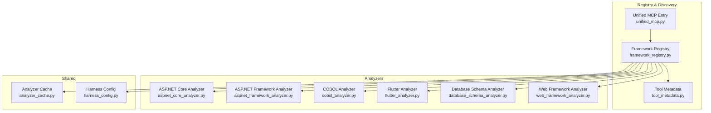
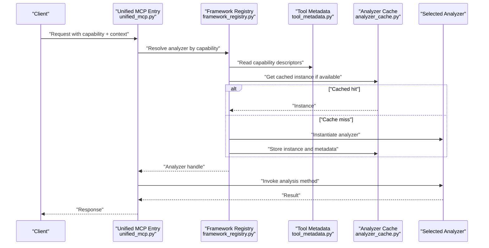
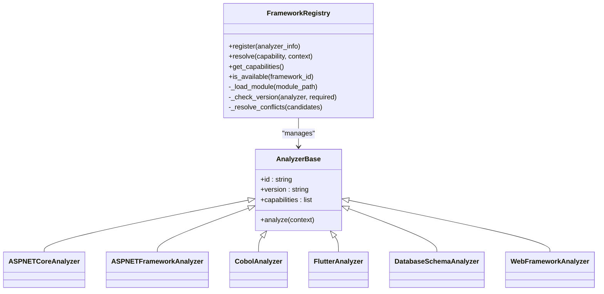
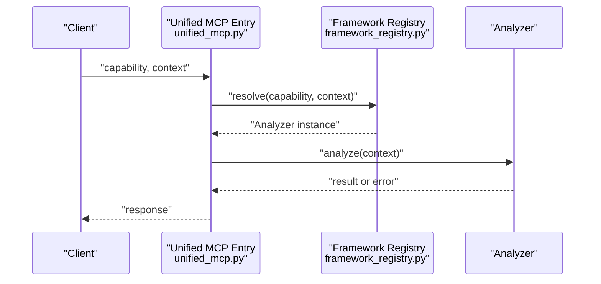
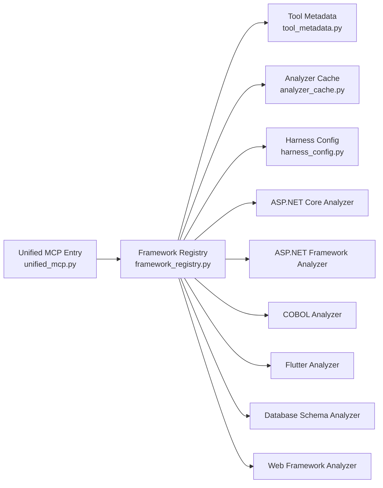

# Framework Registry & Discovery

<cite>
**Referenced Files in This Document**
- [framework_registry.py](file://code-tiny/mcp/framework_registry.py)
- [unified_mcp.py](file://code-tiny/mcp/unified_mcp.py)
- [tool_metadata.py](file://code-tiny/mcp/tool_metadata.py)
- [analyzer_cache.py](file://code-tiny/tools/common/analyzer_cache.py)
- [harness_config.py](file://code-tiny/tools/common/harness_config.py)
- [aspnet_core_analyzer.py](file://code-tiny/tools/aspnet_core/aspnet_core_analyzer.py)
- [aspnet_framework_analyzer.py](file://code-tiny/tools/aspnet_framework/aspnet_framework_analyzer.py)
- [cobol_analyzer.py](file://code-tiny/tools/cobol/cobol_analyzer.py)
- [flutter_analyzer.py](file://code-tiny/tools/flutter/flutter_analyzer.py)
- [database_schema_analyzer.py](file://code-tiny/tools/database_schema/database_schema_analyzer.py)
- [web_framework_analyzer.py](file://code-tiny/tools/web_framework/web_framework_analyzer.py)
- [test_common_analyzer_registry.py](file://tests/test_common_analyzer_registry.py)
- [test_dev_framework_parser_discovery.py](file://tests/test_dev_framework_parser_discovery.py)
- [test_framework_fixture_analysis.py](file://tests/test_framework_fixture_analysis.py)
</cite>

## Table of Contents
1. [Introduction](#introduction)
2. [Project Structure](#project-structure)
3. [Core Components](#core-components)
4. [Architecture Overview](#architecture-overview)
5. [Detailed Component Analysis](#detailed-component-analysis)
6. [Dependency Analysis](#dependency-analysis)
7. [Performance Considerations](#performance-considerations)
8. [Troubleshooting Guide](#troubleshooting-guide)
9. [Conclusion](#conclusion)
10. [Appendices](#appendices)

## Introduction
This document explains the Framework Registry and Discovery system in Cortex Harness. It focuses on how framework-specific analyzers are registered, discovered, and dynamically loaded; how capability detection works; and how dependency resolution is performed across frameworks. It also covers caching strategies for metadata and analyzer instances, version compatibility checks, conflict resolution, graceful degradation, and practical guidance for integrating third-party frameworks while maintaining backward compatibility.

## Project Structure
The registry and discovery logic spans a small set of core modules:
- A central registry that tracks available analyzers and their capabilities
- A unified MCP entrypoint that discovers and routes requests to appropriate analyzers
- Metadata definitions used by the registry and routing layer
- Per-framework analyzer implementations with optional detectors and pipelines
- Shared utilities for caching and configuration

**Diagram sources**
- [framework_registry.py](file://code-tiny/mcp/framework_registry.py)
- [unified_mcp.py](file://code-tiny/mcp/unified_mcp.py)
- [tool_metadata.py](file://code-tiny/mcp/tool_metadata.py)
- [analyzer_cache.py](file://code-tiny/tools/common/analyzer_cache.py)
- [harness_config.py](file://code-tiny/tools/common/harness_config.py)
- [aspnet_core_analyzer.py](file://code-tiny/tools/aspnet_core/aspnet_core_analyzer.py)
- [aspnet_framework_analyzer.py](file://code-tiny/tools/aspnet_framework/aspnet_framework_analyzer.py)
- [cobol_analyzer.py](file://code-tiny/tools/cobol/cobol_analyzer.py)
- [flutter_analyzer.py](file://code-tiny/tools/flutter/flutter_analyzer.py)
- [database_schema_analyzer.py](file://code-tiny/tools/database_schema/database_schema_analyzer.py)
- [web_framework_analyzer.py](file://code-tiny/tools/web_framework/web_framework_analyzer.py)

**Section sources**
- [framework_registry.py](file://code-tiny/mcp/framework_registry.py)
- [unified_mcp.py](file://code-tiny/mcp/unified_mcp.py)
- [tool_metadata.py](file://code-tiny/mcp/tool_metadata.py)
- [analyzer_cache.py](file://code-tiny/tools/common/analyzer_cache.py)
- [harness_config.py](file://code-tiny/tools/common/harness_config.py)

## Core Components
- Framework Registry: Central component that maintains mappings between framework identifiers and analyzer implementations, exposes registration APIs, and provides lookup and capability queries.
- Unified MCP Entry: Orchestrates request handling by querying the registry for suitable analyzers based on context (e.g., project type, requested capability).
- Tool Metadata: Defines schema and descriptors for tools and capabilities consumed by the registry and MCP layer.
- Analyzer Cache: Caches analyzer instances and related metadata to reduce initialization overhead and improve performance.
- Harness Config: Provides configuration access for enabling/disabling analyzers, setting timeouts, and tuning discovery behavior.

Key responsibilities:
- Registration: Analyzers register themselves via the registry at import or startup time.
- Discovery: The registry scans available analyzers and builds an index of supported capabilities.
- Routing: The MCP layer uses the registry to select the best-matching analyzer for a given request.
- Caching: Instances and metadata are cached to avoid repeated parsing and heavy setup.
- Compatibility: Version constraints and feature flags are checked before selecting an analyzer.

**Section sources**
- [framework_registry.py](file://code-tiny/mcp/framework_registry.py)
- [unified_mcp.py](file://code-tiny/mcp/unified_mcp.py)
- [tool_metadata.py](file://code-tiny/mcp/tool_metadata.py)
- [analyzer_cache.py](file://code-tiny/tools/common/analyzer_cache.py)
- [harness_config.py](file://code-tiny/tools/common/harness_config.py)

## Architecture Overview
The registry acts as a single source of truth for analyzer availability and capabilities. The MCP entry delegates analysis tasks to the registry, which resolves dependencies and returns an appropriate analyzer instance. Caching ensures fast subsequent calls.

**Diagram sources**
- [unified_mcp.py](file://code-tiny/mcp/unified_mcp.py)
- [framework_registry.py](file://code-tiny/mcp/framework_registry.py)
- [tool_metadata.py](file://code-tiny/mcp/tool_metadata.py)
- [analyzer_cache.py](file://code-tiny/tools/common/analyzer_cache.py)

## Detailed Component Analysis

### Framework Registry
Responsibilities:
- Maintain a registry map from framework IDs to analyzer classes/factories
- Expose registration functions for analyzers to self-register
- Provide capability-based lookup and filtering
- Enforce version compatibility and conflict resolution rules
- Coordinate dynamic loading of analyzer modules when needed

Operational patterns:
- Registration: Analyzers call registry APIs during module load to advertise capabilities
- Discovery: On first use, the registry may scan known packages or rely on explicit imports
- Resolution: Given a capability and context, choose the highest-priority compatible analyzer
- Fallback: If no exact match, try broader matches or degrade gracefully

**Diagram sources**
- [framework_registry.py](file://code-tiny/mcp/framework_registry.py)
- [aspnet_core_analyzer.py](file://code-tiny/tools/aspnet_core/aspnet_core_analyzer.py)
- [aspnet_framework_analyzer.py](file://code-tiny/tools/aspnet_framework/aspnet_framework_analyzer.py)
- [cobol_analyzer.py](file://code-tiny/tools/cobol/cobol_analyzer.py)
- [flutter_analyzer.py](file://code-tiny/tools/flutter/flutter_analyzer.py)
- [database_schema_analyzer.py](file://code-tiny/tools/database_schema/database_schema_analyzer.py)
- [web_framework_analyzer.py](file://code-tiny/tools/web_framework/web_framework_analyzer.py)

**Section sources**
- [framework_registry.py](file://code-tiny/mcp/framework_registry.py)
- [aspnet_core_analyzer.py](file://code-tiny/tools/aspnet_core/aspnet_core_analyzer.py)
- [aspnet_framework_analyzer.py](file://code-tiny/tools/aspnet_framework/aspnet_framework_analyzer.py)
- [cobol_analyzer.py](file://code-tiny/tools/cobol/cobol_analyzer.py)
- [flutter_analyzer.py](file://code-tiny/tools/flutter/flutter_analyzer.py)
- [database_schema_analyzer.py](file://code-tiny/tools/database_schema/database_schema_analyzer.py)
- [web_framework_analyzer.py](file://code-tiny/tools/web_framework/web_framework_analyzer.py)

### Unified MCP Entry
Responsibilities:
- Accept incoming requests with capability and context
- Delegate selection to the registry
- Handle errors and fallbacks
- Serialize results back to clients

Flow highlights:
- Capability extraction from request payload
- Registry query for matching analyzer
- Invocation of analyzer’s analyze method
- Error wrapping and graceful degradation

**Diagram sources**
- [unified_mcp.py](file://code-tiny/mcp/unified_mcp.py)
- [framework_registry.py](file://code-tiny/mcp/framework_registry.py)

**Section sources**
- [unified_mcp.py](file://code-tiny/mcp/unified_mcp.py)
- [framework_registry.py](file://code-tiny/mcp/framework_registry.py)

### Tool Metadata
Responsibilities:
- Define capability schemas and tool descriptors
- Provide machine-readable information consumed by the registry and MCP layer
- Support versioning and feature flags

Usage:
- Registry reads metadata to validate analyzer claims
- MCP uses metadata to present available capabilities to clients

**Section sources**
- [tool_metadata.py](file://code-tiny/mcp/tool_metadata.py)

### Analyzer Cache
Responsibilities:
- Cache analyzer instances keyed by identity and configuration
- Store lightweight metadata snapshots to speed up capability checks
- Evict or refresh entries based on configuration changes or invalidation signals

Benefits:
- Reduced startup latency
- Lower memory churn due to shared instances
- Faster capability queries without re-parsing

**Section sources**
- [analyzer_cache.py](file://code-tiny/tools/common/analyzer_cache.py)

### Harness Config
Responsibilities:
- Provide runtime toggles for enabling/disabling analyzers
- Configure cache policies and timeouts
- Influence discovery scope (e.g., include/exclude certain frameworks)

**Section sources**
- [harness_config.py](file://code-tiny/tools/common/harness_config.py)

### Example Analyzers
Each analyzer implements a common interface and registers itself with the registry. They typically expose:
- An identifier and version
- A list of capabilities
- An analyze method that processes context and returns results

Representative examples:
- ASP.NET Core Analyzer
- ASP.NET Framework Analyzer
- COBOL Analyzer
- Flutter Analyzer
- Database Schema Analyzer
- Web Framework Analyzer

These analyzers demonstrate consistent registration patterns and capability declarations.

**Section sources**
- [aspnet_core_analyzer.py](file://code-tiny/tools/aspnet_core/aspnet_core_analyzer.py)
- [aspnet_framework_analyzer.py](file://code-tiny/tools/aspnet_framework/aspnet_framework_analyzer.py)
- [cobol_analyzer.py](file://code-tiny/tools/cobol/cobol_analyzer.py)
- [flutter_analyzer.py](file://code-tiny/tools/flutter/flutter_analyzer.py)
- [database_schema_analyzer.py](file://code-tiny/tools/database_schema/database_schema_analyzer.py)
- [web_framework_analyzer.py](file://code-tiny/tools/web_framework/web_framework_analyzer.py)

## Dependency Analysis
The registry depends on metadata and cache components. Analyzers depend on the registry for registration and on shared utilities for configuration. The MCP layer depends on the registry for routing.

**Diagram sources**
- [unified_mcp.py](file://code-tiny/mcp/unified_mcp.py)
- [framework_registry.py](file://code-tiny/mcp/framework_registry.py)
- [tool_metadata.py](file://code-tiny/mcp/tool_metadata.py)
- [analyzer_cache.py](file://code-tiny/tools/common/analyzer_cache.py)
- [harness_config.py](file://code-tiny/tools/common/harness_config.py)
- [aspnet_core_analyzer.py](file://code-tiny/tools/aspnet_core/aspnet_core_analyzer.py)
- [aspnet_framework_analyzer.py](file://code-tiny/tools/aspnet_framework/aspnet_framework_analyzer.py)
- [cobol_analyzer.py](file://code-tiny/tools/cobol/cobol_analyzer.py)
- [flutter_analyzer.py](file://code-tiny/tools/flutter/flutter_analyzer.py)
- [database_schema_analyzer.py](file://code-tiny/tools/database_schema/database_schema_analyzer.py)
- [web_framework_analyzer.py](file://code-tiny/tools/web_framework/web_framework_analyzer.py)

**Section sources**
- [unified_mcp.py](file://code-tiny/mcp/unified_mcp.py)
- [framework_registry.py](file://code-tiny/mcp/framework_registry.py)
- [tool_metadata.py](file://code-tiny/mcp/tool_metadata.py)
- [analyzer_cache.py](file://code-tiny/tools/common/analyzer_cache.py)
- [harness_config.py](file://code-tiny/tools/common/harness_config.py)

## Performance Considerations
- Instance caching: Reuse analyzer instances to avoid repeated initialization costs.
- Metadata caching: Cache capability descriptors to minimize parsing overhead.
- Lazy loading: Load analyzer modules only when needed to reduce startup time.
- Scope-limited discovery: Restrict scanning to relevant directories or packages based on configuration.
- Result memoization: Where safe, memoize expensive analysis outputs keyed by input fingerprints.

[No sources needed since this section provides general guidance]

## Troubleshooting Guide
Common issues and resolutions:
- Analyzer not found: Ensure the analyzer module is imported or discoverable by the registry. Verify registration calls occur during module load.
- Capability mismatch: Check capability descriptors in metadata and ensure the analyzer advertises the correct capabilities.
- Version incompatibility: Confirm analyzer versions satisfy required ranges; adjust harness config or upgrade/downgrade analyzers accordingly.
- Conflicting analyzers: Resolve conflicts by adjusting priority or disabling lower-priority analyzers via configuration.
- Cache staleness: Invalidate cache entries after configuration changes or analyzer updates.

Validation references:
- Tests cover registry behavior, discovery flows, and fixture-based analysis scenarios.

**Section sources**
- [test_common_analyzer_registry.py](file://tests/test_common_analyzer_registry.py)
- [test_dev_framework_parser_discovery.py](file://tests/test_dev_framework_parser_discovery.py)
- [test_framework_fixture_analysis.py](file://tests/test_framework_fixture_analysis.py)

## Conclusion
The Framework Registry and Discovery system provides a robust foundation for managing multiple analyzers across diverse frameworks. By centralizing registration, capability management, and dynamic loading, it enables flexible routing through the MCP layer. Caching and configuration controls deliver performance and operational flexibility. With clear extension points and compatibility mechanisms, integrating new frameworks and maintaining backward compatibility is straightforward.

[No sources needed since this section summarizes without analyzing specific files]

## Appendices

### Registering a New Framework
Steps:
- Implement an analyzer class that conforms to the expected interface and declares its capabilities and version.
- Register the analyzer with the registry during module import or initialization.
- Optionally provide a detector to aid automatic discovery based on project artifacts.
- Add tests to verify registration, capability exposure, and basic analysis flow.

References:
- See existing analyzers for registration patterns and capability declarations.

**Section sources**
- [aspnet_core_analyzer.py](file://code-tiny/tools/aspnet_core/aspnet_core_analyzer.py)
- [aspnet_framework_analyzer.py](file://code-tiny/tools/aspnet_framework/aspnet_framework_analyzer.py)
- [cobol_analyzer.py](file://code-tiny/tools/cobol/cobol_analyzer.py)
- [flutter_analyzer.py](file://code-tiny/tools/flutter/flutter_analyzer.py)
- [database_schema_analyzer.py](file://code-tiny/tools/database_schema/database_schema_analyzer.py)
- [web_framework_analyzer.py](file://code-tiny/tools/web_framework/web_framework_analyzer.py)

### Implementing Custom Analyzers
Guidelines:
- Follow the analyzer base contract for id, version, capabilities, and analyze method.
- Use harness config to respect runtime toggles and timeouts.
- Leverage the cache for storing reusable state or intermediate results.
- Keep dependencies minimal and declare them clearly in metadata.

**Section sources**
- [analyzer_cache.py](file://code-tiny/tools/common/analyzer_cache.py)
- [harness_config.py](file://code-tiny/tools/common/harness_config.py)

### Extending Existing Capabilities
Approach:
- Extend capability descriptors in metadata to reflect new features.
- Update analyzer implementations to support additional inputs or outputs.
- Adjust registry resolution logic if necessary to prioritize enhanced analyzers.
- Validate with integration tests using fixtures.

**Section sources**
- [tool_metadata.py](file://code-tiny/mcp/tool_metadata.py)
- [framework_registry.py](file://code-tiny/mcp/framework_registry.py)

### Integrating Third-Party Frameworks
Best practices:
- Isolate third-party dependencies behind adapters or wrappers.
- Provide graceful degradation when optional dependencies are missing.
- Use harness config to enable/disable integrations per environment.
- Document required external tools and versions.

**Section sources**
- [harness_config.py](file://code-tiny/tools/common/harness_config.py)

### Maintaining Backward Compatibility
Strategies:
- Version your analyzers and enforce minimum required versions in the registry.
- Provide fallback analyzers for older capabilities.
- Deprecate features gradually with warnings and migration paths.
- Test against multiple analyzer versions to ensure stability.

**Section sources**
- [framework_registry.py](file://code-tiny/mcp/framework_registry.py)
- [tool_metadata.py](file://code-tiny/mcp/tool_metadata.py)