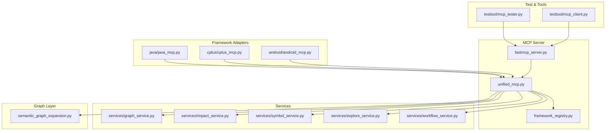
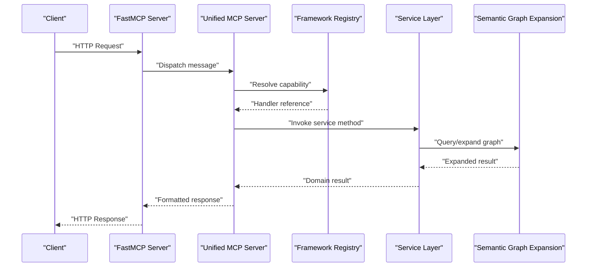
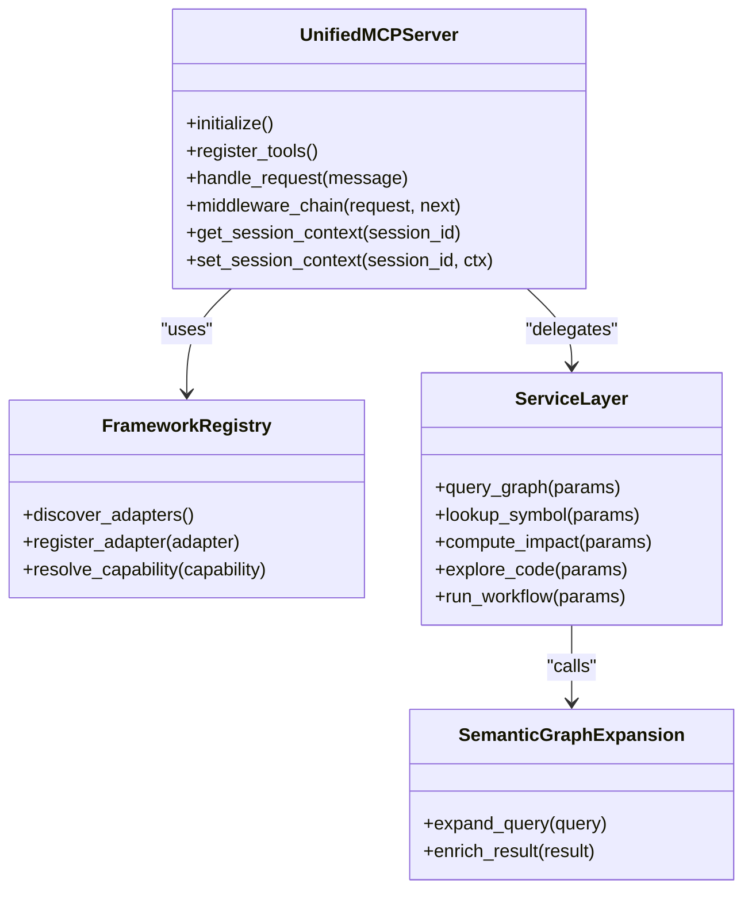
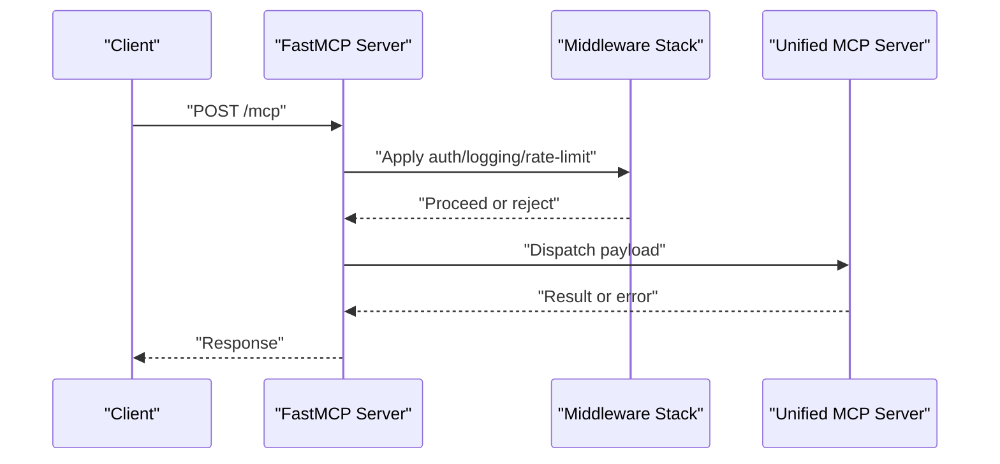
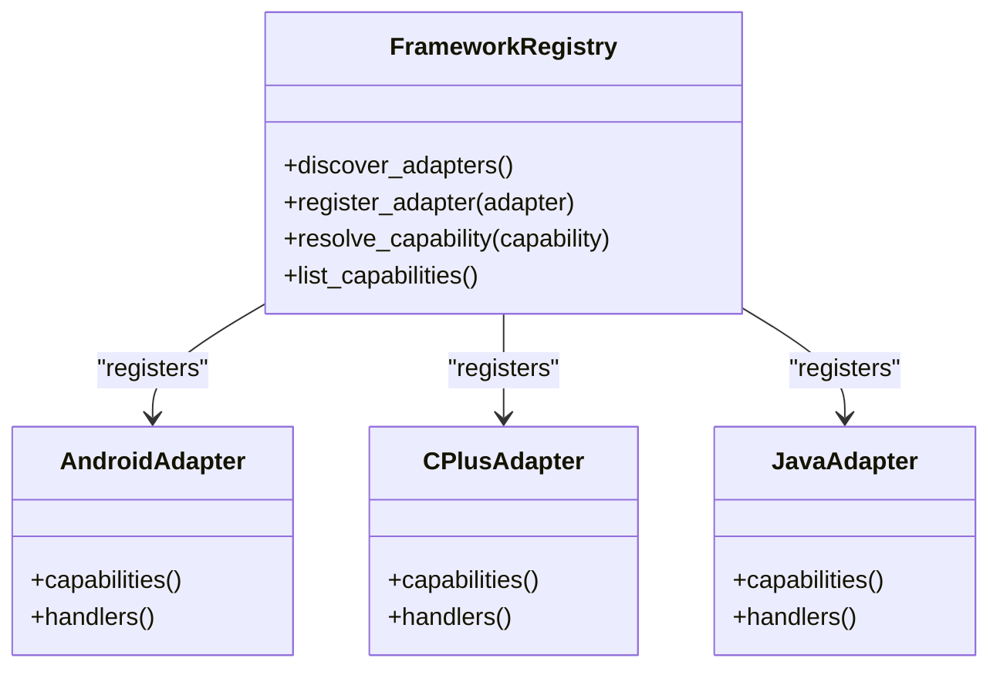
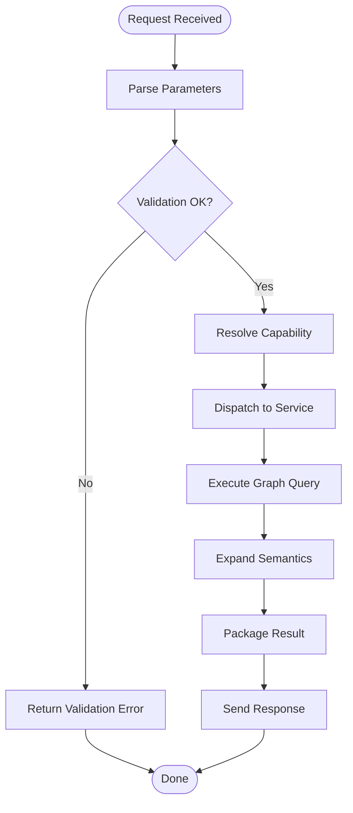
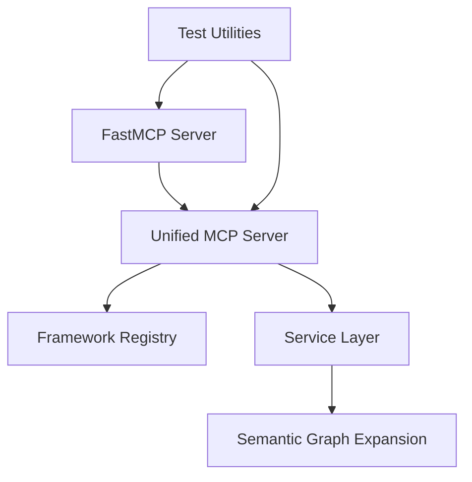

# MCP Server Architecture

<cite>
**Referenced Files in This Document**
- [unified_mcp.py](file://code-tiny/mcp/unified_mcp.py)
- [fastmcp_server.py](file://code-tiny/mcp/fastmcp_server.py)
- [framework_registry.py](file://code-tiny/mcp/framework_registry.py)
- [graph_service.py](file://code-tiny/mcp/services/graph_service.py)
- [impact_service.py](file://code-tiny/mcp/services/impact_service.py)
- [symbol_service.py](file://code-tiny/mcp/services/symbol_service.py)
- [explore_service.py](file://code-tiny/mcp/services/explore_service.py)
- [workflow_service.py](file://code-tiny/mcp/services/workflow_service.py)
- [semantic_graph_expansion.py](file://code-tiny/mcp/semantic_graph_expansion.py)
- [tool_metadata.py](file://code-tiny/mcp/tool_metadata.py)
- [android_mcp.py](file://code-tiny/mcp/android/android_mcp.py)
- [cplus_mcp.py](file://code-tiny/mcp/cplus/cplus_mcp.py)
- [java_mcp.py](file://code-tiny/mcp/java/java_mcp.py)
- [mcp_client.py](file://code-tiny/testtool/mcp_client.py)
- [mcp_tester.py](file://code-tiny/testtool/mcp_tester.py)
- [test_framework_mcp_flows.py](file://tests/test_framework_mcp_flows.py)
- [test_framework_mcp_routing.py](file://tests/test_framework_mcp_routing.py)
- [test_unified_mcp_input_coercion.py](file://tests/test_unified_mcp_input_coercion.py)
- [test_unified_mcp_wrapper_signatures.py](file://tests/test_unified_mcp_wrapper_signatures.py)
- [scripts/mcp-lifecycle.py](file://scripts/mcp-lifecycle.py)
- [scripts/mcp_runtime_config.py](file://scripts/mcp_runtime_config.py)
</cite>

## Table of Contents
1. [Introduction](#introduction)
2. [Project Structure](#project-structure)
3. [Core Components](#core-components)
4. [Architecture Overview](#architecture-overview)
5. [Detailed Component Analysis](#detailed-component-analysis)
6. [Dependency Analysis](#dependency-analysis)
7. [Performance Considerations](#performance-considerations)
8. [Troubleshooting Guide](#troubleshooting-guide)
9. [Conclusion](#conclusion)
10. [Appendices](#appendices)

## Introduction
This document explains the Model Context Protocol (MCP) server architecture implemented in Cortex Harness. It focuses on:
- The unified MCP server implementation that standardizes tool exposure and request handling across frameworks and languages.
- The FastMCP server setup used to bootstrap the HTTP transport and route requests into the unified layer.
- The framework registry system that discovers, registers, and dispatches capabilities per language or framework.
- The server lifecycle, connection handling, and message routing mechanisms.
- How concurrent connections are managed, how request/response patterns flow through the stack, and how state is maintained across sessions.
- Configuration options for deployment, scaling considerations, and performance tuning.
- Examples of server initialization, custom middleware development, and integration with external systems such as graph databases.

## Project Structure
The MCP server code resides under the code-tiny module and integrates with services and analyzers. Key areas include:
- Unified MCP entrypoints and wrappers
- FastMCP server bootstrap and configuration
- Framework-specific MCP adapters
- Service layer modules for graph, symbol, impact, explore, and workflow operations
- Test utilities and acceptance tests validating flows and routing

**Diagram sources**
- [unified_mcp.py](file://code-tiny/mcp/unified_mcp.py)
- [fastmcp_server.py](file://code-tiny/mcp/fastmcp_server.py)
- [framework_registry.py](file://code-tiny/mcp/framework_registry.py)
- [graph_service.py](file://code-tiny/mcp/services/graph_service.py)
- [impact_service.py](file://code-tiny/mcp/services/impact_service.py)
- [symbol_service.py](file://code-tiny/mcp/services/symbol_service.py)
- [explore_service.py](file://code-tiny/mcp/services/explore_service.py)
- [workflow_service.py](file://code-tiny/mcp/services/workflow_service.py)
- [semantic_graph_expansion.py](file://code-tiny/mcp/semantic_graph_expansion.py)
- [android_mcp.py](file://code-tiny/mcp/android/android_mcp.py)
- [cplus_mcp.py](file://code-tiny/mcp/cplus/cplus_mcp.py)
- [java_mcp.py](file://code-tiny/mcp/java/java_mcp.py)
- [mcp_client.py](file://code-tiny/testtool/mcp_client.py)
- [mcp_tester.py](file://code-tiny/testtool/mcp_tester.py)

**Section sources**
- [unified_mcp.py](file://code-tiny/mcp/unified_mcp.py)
- [fastmcp_server.py](file://code-tiny/mcp/fastmcp_server.py)
- [framework_registry.py](file://code-tiny/mcp/framework_registry.py)
- [graph_service.py](file://code-tiny/mcp/services/graph_service.py)
- [impact_service.py](file://code-tiny/mcp/services/impact_service.py)
- [symbol_service.py](file://code-tiny/mcp/services/symbol_service.py)
- [explore_service.py](file://code-tiny/mcp/services/explore_service.py)
- [workflow_service.py](file://code-tiny/mcp/services/workflow_service.py)
- [semantic_graph_expansion.py](file://code-tiny/mcp/semantic_graph_expansion.py)
- [android_mcp.py](file://code-tiny/mcp/android/android_mcp.py)
- [cplus_mcp.py](file://code-tiny/mcp/cplus/cplus_mcp.py)
- [java_mcp.py](file://code-tiny/mcp/java/java_mcp.py)
- [mcp_client.py](file://code-tiny/testtool/mcp_client.py)
- [mcp_tester.py](file://code-tiny/testtool/mcp_tester.py)

## Core Components
- Unified MCP server: Provides a single interface for registering tools, handling requests, and coordinating responses across all frameworks and analyzers.
- FastMCP server: Bootstraps the HTTP transport, configures routes, and delegates incoming messages to the unified server.
- Framework registry: Discovers and registers framework-specific MCP adapters, enabling capability-based routing.
- Services: Encapsulate domain logic for graph queries, symbol lookups, impact analysis, exploration, and workflow orchestration.
- Semantic graph expansion: Enhances query results by expanding semantic relationships within the graph.
- Tool metadata: Centralizes tool definitions, schemas, and documentation consumed by clients.

Key responsibilities:
- Lifecycle management: startup, readiness checks, graceful shutdown.
- Connection handling: accept concurrent connections, maintain session state where applicable.
- Message routing: parse incoming MCP messages, resolve target capabilities, and dispatch to appropriate handlers.
- State maintenance: persist or cache session-scoped data and context across requests.

**Section sources**
- [unified_mcp.py](file://code-tiny/mcp/unified_mcp.py)
- [fastmcp_server.py](file://code-tiny/mcp/fastmcp_server.py)
- [framework_registry.py](file://code-tiny/mcp/framework_registry.py)
- [tool_metadata.py](file://code-tiny/mcp/tool_metadata.py)

## Architecture Overview
The MCP server follows a layered architecture:
- Transport layer: FastMCP handles HTTP requests and forwards them to the unified server.
- Unified layer: Orchestrates routing, validation, middleware, and response formatting.
- Capability layer: Framework registry maps capabilities to concrete implementations.
- Service layer: Executes business logic against graph databases and other backends.
- Graph layer: Performs semantic expansion and traversal over stored code artifacts.

**Diagram sources**
- [fastmcp_server.py](file://code-tiny/mcp/fastmcp_server.py)
- [unified_mcp.py](file://code-tiny/mcp/unified_mcp.py)
- [framework_registry.py](file://code-tiny/mcp/framework_registry.py)
- [graph_service.py](file://code-tiny/mcp/services/graph_service.py)
- [semantic_graph_expansion.py](file://code-tiny/mcp/semantic_graph_expansion.py)

## Detailed Component Analysis

### Unified MCP Server
Responsibilities:
- Initialize and configure the server instance.
- Register tools and capabilities from framework adapters.
- Implement middleware pipeline for cross-cutting concerns (logging, metrics, validation).
- Manage request lifecycle: parsing, validation, dispatch, execution, serialization.
- Maintain session-scoped state and context propagation.

Concurrency model:
- Accepts multiple concurrent connections via the underlying HTTP server.
- Uses async-friendly patterns to avoid blocking I/O during graph queries and network calls.

State management:
- Stores per-session context (e.g., active project, user preferences).
- Persists critical state to durable storage when necessary.

Error handling:
- Normalizes errors into consistent MCP error responses.
- Implements retries and fallbacks for transient failures.

**Section sources**
- [unified_mcp.py](file://code-tiny/mcp/unified_mcp.py)
- [test_unified_mcp_input_coercion.py](file://tests/test_unified_mcp_input_coercion.py)
- [test_unified_mcp_wrapper_signatures.py](file://tests/test_unified_mcp_wrapper_signatures.py)

#### Class Diagram: Unified MCP Server

**Diagram sources**
- [unified_mcp.py](file://code-tiny/mcp/unified_mcp.py)
- [framework_registry.py](file://code-tiny/mcp/framework_registry.py)
- [graph_service.py](file://code-tiny/mcp/services/graph_service.py)
- [impact_service.py](file://code-tiny/mcp/services/impact_service.py)
- [symbol_service.py](file://code-tiny/mcp/services/symbol_service.py)
- [explore_service.py](file://code-tiny/mcp/services/explore_service.py)
- [workflow_service.py](file://code-tiny/mcp/services/workflow_service.py)
- [semantic_graph_expansion.py](file://code-tiny/mcp/semantic_graph_expansion.py)

### FastMCP Server Setup
Responsibilities:
- Configure HTTP transport settings (host, port, workers, timeouts).
- Mount routes for MCP endpoints.
- Integrate middleware (auth, rate limiting, logging).
- Provide health check and readiness probes.

Lifecycle hooks:
- Startup tasks: initialize registries, connect to graph database, warm caches.
- Shutdown tasks: flush buffers, close connections, release resources.

**Section sources**
- [fastmcp_server.py](file://code-tiny/mcp/fastmcp_server.py)
- [scripts/mcp-lifecycle.py](file://scripts/mcp-lifecycle.py)
- [scripts/mcp_runtime_config.py](file://scripts/mcp_runtime_config.py)

#### Sequence Diagram: FastMCP Request Flow

**Diagram sources**
- [fastmcp_server.py](file://code-tiny/mcp/fastmcp_server.py)
- [unified_mcp.py](file://code-tiny/mcp/unified_mcp.py)

### Framework Registry System
Responsibilities:
- Discover framework-specific MCP adapters (Android, C++, Java, etc.).
- Register capabilities and tool definitions provided by each adapter.
- Route incoming requests to the correct adapter based on capability metadata.

Discovery mechanism:
- Scans known directories or uses plugin manifests to locate adapters.
- Validates adapter contracts before registration.

Routing strategy:
- Matches request capability names to registered handlers.
- Supports fallbacks and multi-capability resolution.

**Section sources**
- [framework_registry.py](file://code-tiny/mcp/framework_registry.py)
- [android_mcp.py](file://code-tiny/mcp/android/android_mcp.py)
- [cplus_mcp.py](file://code-tiny/mcp/cplus/cplus_mcp.py)
- [java_mcp.py](file://code-tiny/mcp/java/java_mcp.py)
- [test_framework_mcp_routing.py](file://tests/test_framework_mcp_routing.py)

#### Class Diagram: Framework Registry

**Diagram sources**
- [framework_registry.py](file://code-tiny/mcp/framework_registry.py)
- [android_mcp.py](file://code-tiny/mcp/android/android_mcp.py)
- [cplus_mcp.py](file://code-tiny/mcp/cplus/cplus_mcp.py)
- [java_mcp.py](file://code-tiny/mcp/java/java_mcp.py)

### Service Layer and Graph Integration
Responsibilities:
- Provide high-level APIs for graph queries, symbol lookups, impact analysis, exploration, and workflows.
- Coordinate with semantic graph expansion to enrich results.
- Handle caching, pagination, and filtering.

Data flow:
- Requests enter the unified server, which delegates to specific services.
- Services interact with the graph database via drivers and perform semantic expansions.
- Results are packaged and returned to the client.

**Section sources**
- [graph_service.py](file://code-tiny/mcp/services/graph_service.py)
- [impact_service.py](file://code-tiny/mcp/services/impact_service.py)
- [symbol_service.py](file://code-tiny/mcp/services/symbol_service.py)
- [explore_service.py](file://code-tiny/mcp/services/explore_service.py)
- [workflow_service.py](file://code-tiny/mcp/services/workflow_service.py)
- [semantic_graph_expansion.py](file://code-tiny/mcp/semantic_graph_expansion.py)

#### Flowchart: Graph Query Processing

**Diagram sources**
- [graph_service.py](file://code-tiny/mcp/services/graph_service.py)
- [semantic_graph_expansion.py](file://code-tiny/mcp/semantic_graph_expansion.py)

### Tool Metadata and Documentation
Responsibilities:
- Define tool schemas, parameters, and descriptions.
- Expose metadata to clients for discovery and validation.
- Support versioning and deprecation notices.

Integration points:
- Consumed by the unified server during tool registration.
- Used by test utilities to validate payloads and behaviors.

**Section sources**
- [tool_metadata.py](file://code-tiny/mcp/tool_metadata.py)
- [mcp_tester.py](file://code-tiny/testtool/mcp_tester.py)

## Dependency Analysis
The MCP server depends on:
- FastMCP for HTTP transport and routing.
- Framework registry for capability discovery and dispatch.
- Service layer for domain logic and graph interactions.
- Semantic graph expansion for enrichment.
- Test utilities for validation and acceptance testing.

**Diagram sources**
- [fastmcp_server.py](file://code-tiny/mcp/fastmcp_server.py)
- [unified_mcp.py](file://code-tiny/mcp/unified_mcp.py)
- [framework_registry.py](file://code-tiny/mcp/framework_registry.py)
- [graph_service.py](file://code-tiny/mcp/services/graph_service.py)
- [semantic_graph_expansion.py](file://code-tiny/mcp/semantic_graph_expansion.py)
- [mcp_client.py](file://code-tiny/testtool/mcp_client.py)
- [mcp_tester.py](file://code-tiny/testtool/mcp_tester.py)

**Section sources**
- [test_framework_mcp_flows.py](file://tests/test_framework_mcp_flows.py)
- [test_framework_mcp_routing.py](file://tests/test_framework_mcp_routing.py)
- [mcp_client.py](file://code-tiny/testtool/mcp_client.py)
- [mcp_tester.py](file://code-tiny/testtool/mcp_tester.py)

## Performance Considerations
- Concurrency: Ensure the FastMCP server is configured with adequate worker processes and threads to handle concurrent connections without blocking.
- Caching: Leverage service-layer caching for frequently accessed graph nodes and expanded results.
- Pagination: Apply pagination and filtering at the graph query level to reduce payload sizes.
- Timeouts: Set sensible request timeouts and implement retry policies for transient failures.
- Resource limits: Enforce rate limiting and memory quotas to protect the server under load.
- Database optimization: Use indexes and optimized queries; consider read replicas for heavy read workloads.

[No sources needed since this section provides general guidance]

## Troubleshooting Guide
Common issues and resolutions:
- Initialization failures: Verify runtime configuration and environment variables; check logs for missing dependencies.
- Capability not found: Ensure the framework adapter is discovered and registered; review registry logs.
- Graph query errors: Validate query parameters; inspect graph connectivity and schema compatibility.
- Session state inconsistencies: Confirm persistence backend availability and integrity checks.
- High latency: Profile service methods; identify bottlenecks in graph traversal and network calls.

Operational tips:
- Use health check endpoints to monitor server readiness.
- Enable structured logging and metrics collection for observability.
- Run acceptance tests against staging environments to validate end-to-end flows.

**Section sources**
- [scripts/mcp-lifecycle.py](file://scripts/mcp-lifecycle.py)
- [scripts/mcp_runtime_config.py](file://scripts/mcp_runtime_config.py)
- [test_framework_mcp_flows.py](file://tests/test_framework_mcp_flows.py)

## Conclusion
The MCP server in Cortex Harness provides a robust, extensible foundation for exposing code analysis capabilities via a standardized protocol. The unified server abstracts complexity, the FastMCP transport ensures scalability, and the framework registry enables modular capability expansion. With careful configuration and monitoring, the system can support high-concurrency workloads and integrate seamlessly with external graph databases and analytics pipelines.

[No sources needed since this section summarizes without analyzing specific files]

## Appendices

### Configuration Options for Deployment
- Transport settings: host, port, workers, timeouts.
- Runtime configuration: environment variables for database connections, feature flags, and logging levels.
- Scaling parameters: horizontal scaling via multiple instances behind a load balancer; vertical scaling by increasing resources.

**Section sources**
- [scripts/mcp_runtime_config.py](file://scripts/mcp_runtime_config.py)

### Examples: Server Initialization and Custom Middleware
- Server initialization: Bootstrap FastMCP, register unified server, mount routes, start lifecycle hooks.
- Custom middleware: Implement authentication, request validation, and metrics collection; integrate into the middleware chain.

**Section sources**
- [fastmcp_server.py](file://code-tiny/mcp/fastmcp_server.py)
- [unified_mcp.py](file://code-tiny/mcp/unified_mcp.py)

### Integration with External Systems
- Graph database integration: Connect via drivers, execute queries, and expand semantics.
- External analytics: Publish metrics and events for downstream processing.

**Section sources**
- [graph_service.py](file://code-tiny/mcp/services/graph_service.py)
- [semantic_graph_expansion.py](file://code-tiny/mcp/semantic_graph_expansion.py)