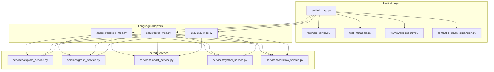
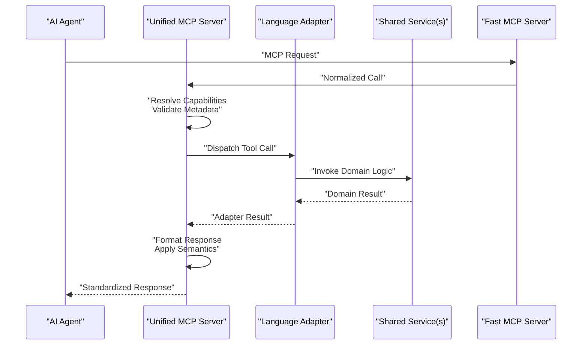
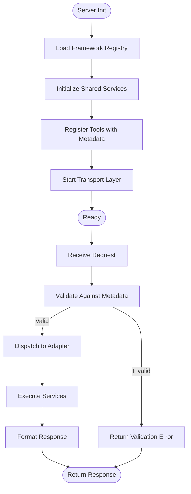
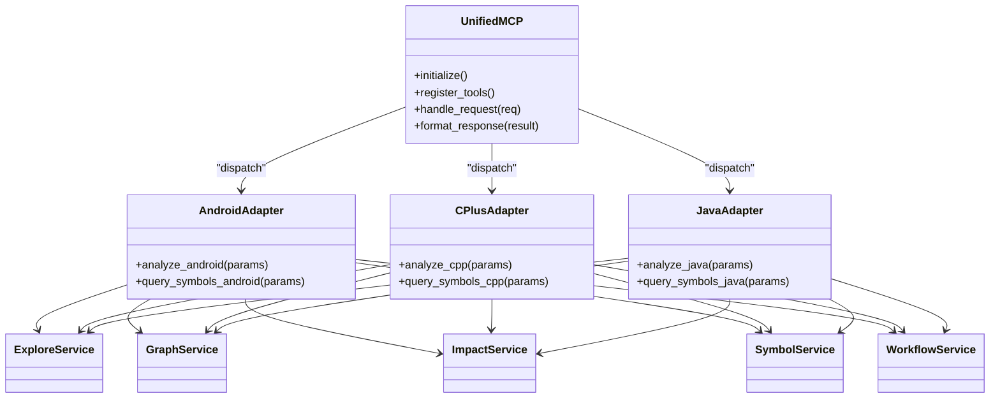
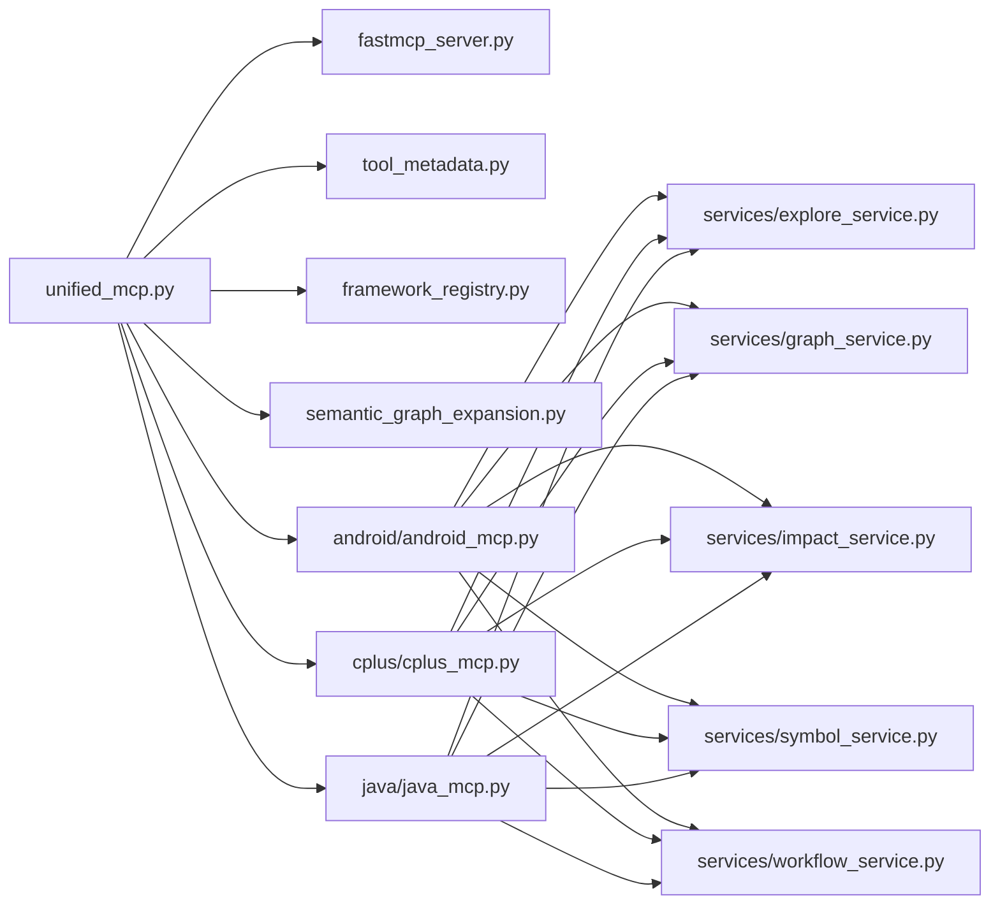

# Unified MCP Server Implementation

<cite>
**Referenced Files in This Document**
- [unified_mcp.py](file://code-tiny/mcp/unified_mcp.py)
- [fastmcp_server.py](file://code-tiny/mcp/fastmcp_server.py)
- [tool_metadata.py](file://code-tiny/mcp/tool_metadata.py)
- [framework_registry.py](file://code-tiny/mcp/framework_registry.py)
- [semantic_graph_expansion.py](file://code-tiny/mcp/semantic_graph_expansion.py)
- [android_mcp.py](file://code-tiny/mcp/android/android_mcp.py)
- [cplus_mcp.py](file://code-tiny/mcp/cplus/cplus_mcp.py)
- [java_mcp.py](file://code-tiny/mcp/java/java_mcp.py)
- [explore_service.py](file://code-tiny/mcp/services/explore_service.py)
- [graph_service.py](file://code-tiny/mcp/services/graph_service.py)
- [impact_service.py](file://code-tiny/mcp/services/impact_service.py)
- [symbol_service.py](file://code-tiny/mcp/services/symbol_service.py)
- [workflow_service.py](file://code-tiny/mcp/services/workflow_service.py)
- [Readme.md](file://code-tiny/mcp/Readme.md)
</cite>

## Table of Contents
1. [Introduction](#introduction)
2. [Project Structure](#project-structure)
3. [Core Components](#core-components)
4. [Architecture Overview](#architecture-overview)
5. [Detailed Component Analysis](#detailed-component-analysis)
6. [Dependency Analysis](#dependency-analysis)
7. [Performance Considerations](#performance-considerations)
8. [Troubleshooting Guide](#troubleshooting-guide)
9. [Conclusion](#conclusion)
10. [Appendices](#appendices)

## Introduction
This document explains the Unified MCP Server implementation in Cortex Harness. It focuses on how the unified server abstracts different MCP implementations, provides a consistent interface for AI agents, and manages tool registration, metadata, validation, and response formatting. It also covers initialization flows, dynamic capability loading, error handling, logging, debugging, and practical examples for extending the system with custom tools and middleware.

## Project Structure
The MCP subsystem is organized under code-tiny/mcp with:
- A unified server entrypoint that standardizes request/response handling across multiple language-specific MCP servers.
- Language adapters (Android, C++, Java) that expose framework-specific capabilities through a common interface.
- Shared services (explore, graph, impact, symbol, workflow) used by tools to access code intelligence.
- Metadata definitions and registry utilities for tool discovery and capability routing.

**Diagram sources**
- [unified_mcp.py](file://code-tiny/mcp/unified_mcp.py)
- [fastmcp_server.py](file://code-tiny/mcp/fastmcp_server.py)
- [tool_metadata.py](file://code-tiny/mcp/tool_metadata.py)
- [framework_registry.py](file://code-tiny/mcp/framework_registry.py)
- [semantic_graph_expansion.py](file://code-tiny/mcp/semantic_graph_expansion.py)
- [android_mcp.py](file://code-tiny/mcp/android/android_mcp.py)
- [cplus_mcp.py](file://code-tiny/mcp/cplus/cplus_mcp.py)
- [java_mcp.py](file://code-tiny/mcp/java/java_mcp.py)
- [explore_service.py](file://code-tiny/mcp/services/explore_service.py)
- [graph_service.py](file://code-tiny/mcp/services/graph_service.py)
- [impact_service.py](file://code-tiny/mcp/services/impact_service.py)
- [symbol_service.py](file://code-tiny/mcp/services/symbol_service.py)
- [workflow_service.py](file://code-tiny/mcp/services/workflow_service.py)

**Section sources**
- [Readme.md](file://code-tiny/mcp/Readme.md)

## Core Components
- Unified MCP Server: Provides a single entrypoint that normalizes requests, routes them to appropriate adapters, and formats responses consistently.
- Fast MCP Server: Implements the underlying transport and lifecycle management for MCP protocol interactions.
- Tool Metadata: Defines schemas for tool descriptions, parameters, validation rules, and output contracts.
- Framework Registry: Maintains capability mappings and enables dynamic discovery and loading of language-specific features.
- Semantic Graph Expansion: Enhances query results by expanding semantic relationships within the code graph.
- Language Adapters: Android, C++, and Java adapters translate generic tool calls into domain-specific operations.
- Shared Services: Explore, Graph, Impact, Symbol, and Workflow services provide reusable functionality consumed by tools.

Key responsibilities:
- Request normalization and dispatch
- Capability-based routing
- Parameter validation against metadata
- Response packaging and formatting
- Error translation and logging
- Dynamic loading of new tools and adapters at runtime

**Section sources**
- [unified_mcp.py](file://code-tiny/mcp/unified_mcp.py)
- [fastmcp_server.py](file://code-tiny/mcp/fastmcp_server.py)
- [tool_metadata.py](file://code-tiny/mcp/tool_metadata.py)
- [framework_registry.py](file://code-tiny/mcp/framework_registry.py)
- [semantic_graph_expansion.py](file://code-tiny/mcp/semantic_graph_expansion.py)
- [android_mcp.py](file://code-tiny/mcp/android/android_mcp.py)
- [cplus_mcp.py](file://code-tiny/mcp/cplus/cplus_mcp.py)
- [java_mcp.py](file://code-tiny/mcp/java/java_mcp.py)
- [explore_service.py](file://code-tiny/mcp/services/explore_service.py)
- [graph_service.py](file://code-tiny/mcp/services/graph_service.py)
- [impact_service.py](file://code-tiny/mcp/services/impact_service.py)
- [symbol_service.py](file://code-tiny/mcp/services/symbol_service.py)
- [workflow_service.py](file://code-tiny/mcp/services/workflow_service.py)

## Architecture Overview
The unified server sits above language adapters and shared services. It uses metadata and registry information to route incoming requests to the correct adapter and service, validates inputs, executes logic, and returns standardized responses.

**Diagram sources**
- [unified_mcp.py](file://code-tiny/mcp/unified_mcp.py)
- [fastmcp_server.py](file://code-tiny/mcp/fastmcp_server.py)
- [tool_metadata.py](file://code-tiny/mcp/tool_metadata.py)
- [framework_registry.py](file://code-tiny/mcp/framework_registry.py)
- [semantic_graph_expansion.py](file://code-tiny/mcp/semantic_graph_expansion.py)
- [android_mcp.py](file://code-tiny/mcp/android/android_mcp.py)
- [cplus_mcp.py](file://code-tiny/mcp/cplus/cplus_mcp.py)
- [java_mcp.py](file://code-tiny/mcp/java/java_mcp.py)
- [explore_service.py](file://code-tiny/mcp/services/explore_service.py)
- [graph_service.py](file://code-tiny/mcp/services/graph_service.py)
- [impact_service.py](file://code-tiny/mcp/services/impact_service.py)
- [symbol_service.py](file://code-tiny/mcp/services/symbol_service.py)
- [workflow_service.py](file://code-tiny/mcp/services/workflow_service.py)

## Detailed Component Analysis

### Unified MCP Server
Responsibilities:
- Initialize server components and load configuration
- Discover and register tools via the framework registry
- Normalize incoming requests and map to tool handlers
- Validate parameters using metadata schemas
- Execute adapters and services, then format responses
- Apply semantic graph expansion where applicable
- Centralize error handling and logging

Initialization flow:
- Load registry entries and capability maps
- Instantiate shared services
- Register tool handlers with metadata
- Start transport layer

Request handling flow:
- Parse and validate request payload
- Resolve target adapter based on capability
- Invoke adapter method with validated parameters
- Wrap result with metadata-driven formatting
- Return standardized response or error

**Diagram sources**
- [unified_mcp.py](file://code-tiny/mcp/unified_mcp.py)
- [framework_registry.py](file://code-tiny/mcp/framework_registry.py)
- [tool_metadata.py](file://code-tiny/mcp/tool_metadata.py)

**Section sources**
- [unified_mcp.py](file://code-tiny/mcp/unified_mcp.py)
- [framework_registry.py](file://code-tiny/mcp/framework_registry.py)
- [tool_metadata.py](file://code-tiny/mcp/tool_metadata.py)

### Fast MCP Server
Responsibilities:
- Manage MCP transport lifecycle (start, stop, health checks)
- Serialize/deserialize messages
- Provide middleware hooks for cross-cutting concerns
- Route normalized calls to the unified server

Integration points:
- Exposes endpoints for agent clients
- Integrates with unified server for business logic
- Supports pluggable middleware for logging, metrics, and tracing

**Section sources**
- [fastmcp_server.py](file://code-tiny/mcp/fastmcp_server.py)

### Tool Metadata System
Responsibilities:
- Define tool descriptions, parameter schemas, and return types
- Enforce validation rules (required fields, types, constraints)
- Drive response formatting and documentation generation
- Support versioning and deprecation notices

Validation flow:
- Load schema from metadata
- Coerce input values to expected types
- Check required fields and constraints
- Produce detailed validation errors when invalid

Response formatting:
- Map internal results to standardized structures
- Attach metadata such as labels, categories, and hints
- Include semantic expansions if enabled

**Section sources**
- [tool_metadata.py](file://code-tiny/mcp/tool_metadata.py)

### Framework Registry and Dynamic Loading
Responsibilities:
- Maintain capability-to-adapter mappings
- Discover available adapters and tools at startup
- Enable dynamic loading of new tools without restart
- Provide capability queries for intelligent routing

Dynamic loading:
- Scan registered modules for tool definitions
- Update capability index on demand
- Rebind handlers after hot reload

**Section sources**
- [framework_registry.py](file://code-tiny/mcp/framework_registry.py)

### Semantic Graph Expansion
Responsibilities:
- Expand query results with related nodes and edges
- Improve context for downstream analysis
- Integrate with symbol and graph services

Processing logic:
- Identify core entities in results
- Fetch neighbors and relationships
- Merge and deduplicate expanded data
- Preserve original structure while adding context

**Section sources**
- [semantic_graph_expansion.py](file://code-tiny/mcp/semantic_graph_expansion.py)

### Language Adapters (Android, C++, Java)
Responsibilities:
- Translate generic tool calls into language-specific operations
- Use shared services to perform analysis and retrieval
- Normalize outputs to the unified contract

Common patterns:
- Resolve project scope and targets
- Query symbols and graphs
- Compute impacts and workflows
- Package results with consistent metadata

**Diagram sources**
- [unified_mcp.py](file://code-tiny/mcp/unified_mcp.py)
- [android_mcp.py](file://code-tiny/mcp/android/android_mcp.py)
- [cplus_mcp.py](file://code-tiny/mcp/cplus/cplus_mcp.py)
- [java_mcp.py](file://code-tiny/mcp/java/java_mcp.py)
- [explore_service.py](file://code-tiny/mcp/services/explore_service.py)
- [graph_service.py](file://code-tiny/mcp/services/graph_service.py)
- [impact_service.py](file://code-tiny/mcp/services/impact_service.py)
- [symbol_service.py](file://code-tiny/mcp/services/symbol_service.py)
- [workflow_service.py](file://code-tiny/mcp/services/workflow_service.py)

**Section sources**
- [android_mcp.py](file://code-tiny/mcp/android/android_mcp.py)
- [cplus_mcp.py](file://code-tiny/mcp/cplus/cplus_mcp.py)
- [java_mcp.py](file://code-tiny/mcp/java/java_mcp.py)

### Shared Services
- Explore Service: High-level exploration APIs for navigating codebases and aggregating insights.
- Graph Service: CRUD and traversal operations over the semantic graph.
- Impact Service: Computes change impact and propagation paths.
- Symbol Service: Resolves symbols, references, and declarations.
- Workflow Service: Manages multi-step analysis pipelines and orchestration.

Usage patterns:
- Adapters call services with validated parameters
- Services return typed results suitable for formatting
- Errors are translated into standardized error objects

**Section sources**
- [explore_service.py](file://code-tiny/mcp/services/explore_service.py)
- [graph_service.py](file://code-tiny/mcp/services/graph_service.py)
- [impact_service.py](file://code-tiny/mcp/services/impact_service.py)
- [symbol_service.py](file://code-tiny/mcp/services/symbol_service.py)
- [workflow_service.py](file://code-tiny/mcp/services/workflow_service.py)

## Dependency Analysis
The unified server depends on:
- Fast MCP Server for transport and lifecycle
- Tool Metadata for validation and formatting
- Framework Registry for capability mapping and dynamic loading
- Semantic Graph Expansion for enriched results
- Language Adapters for domain-specific logic
- Shared Services for reusable analysis functions

**Diagram sources**
- [unified_mcp.py](file://code-tiny/mcp/unified_mcp.py)
- [fastmcp_server.py](file://code-tiny/mcp/fastmcp_server.py)
- [tool_metadata.py](file://code-tiny/mcp/tool_metadata.py)
- [framework_registry.py](file://code-tiny/mcp/framework_registry.py)
- [semantic_graph_expansion.py](file://code-tiny/mcp/semantic_graph_expansion.py)
- [android_mcp.py](file://code-tiny/mcp/android/android_mcp.py)
- [cplus_mcp.py](file://code-tiny/mcp/cplus/cplus_mcp.py)
- [java_mcp.py](file://code-tiny/mcp/java/java_mcp.py)
- [explore_service.py](file://code-tiny/mcp/services/explore_service.py)
- [graph_service.py](file://code-tiny/mcp/services/graph_service.py)
- [impact_service.py](file://code-tiny/mcp/services/impact_service.py)
- [symbol_service.py](file://code-tiny/mcp/services/symbol_service.py)
- [workflow_service.py](file://code-tiny/mcp/services/workflow_service.py)

**Section sources**
- [unified_mcp.py](file://code-tiny/mcp/unified_mcp.py)
- [framework_registry.py](file://code-tiny/mcp/framework_registry.py)

## Performance Considerations
- Prefer lazy loading of heavy adapters and services to reduce startup time.
- Cache frequently accessed graph traversals and symbol resolutions.
- Batch expand semantic relationships to minimize repeated lookups.
- Use pagination for large result sets returned by explore and graph services.
- Avoid deep recursion in graph expansion; prefer iterative approaches with bounds.
- Instrument key operations with timing metrics to identify bottlenecks.

[No sources needed since this section provides general guidance]

## Troubleshooting Guide
Common issues and strategies:
- Validation failures: Inspect metadata schemas and ensure input coercion matches expected types.
- Routing errors: Verify capability mappings in the registry and confirm adapter availability.
- Missing symbols or empty results: Check graph connectivity and service initialization status.
- Slow responses: Profile service calls and consider caching or limiting expansion depth.
- Logging and debugging: Enable detailed logs around request normalization, dispatch, and formatting to trace issues.

Error handling patterns:
- Normalize exceptions into structured error responses with codes and messages.
- Preserve original stack traces in logs while returning safe messages to clients.
- Provide actionable hints in validation errors to guide callers.

**Section sources**
- [unified_mcp.py](file://code-tiny/mcp/unified_mcp.py)
- [tool_metadata.py](file://code-tiny/mcp/tool_metadata.py)
- [framework_registry.py](file://code-tiny/mcp/framework_registry.py)

## Conclusion
The Unified MCP Server provides a robust abstraction layer that standardizes tool usage across multiple languages and frameworks. By leveraging metadata-driven validation, capability-based routing, and shared services, it offers a consistent interface for AI agents while remaining extensible for custom tools and middleware. Proper initialization, dynamic loading, and strong error handling ensure reliability and maintainability.

[No sources needed since this section summarizes without analyzing specific files]

## Appendices

### Practical Examples

- Server Initialization
  - Steps:
    - Load registry and capability maps
    - Initialize shared services
    - Register tools with metadata
    - Start transport layer
  - References:
    - [unified_mcp.py](file://code-tiny/mcp/unified_mcp.py)
    - [fastmcp_server.py](file://code-tiny/mcp/fastmcp_server.py)

- Tool Discovery and Registration
  - Steps:
    - Scan registry for tool definitions
    - Bind handlers with metadata
    - Update capability index
  - References:
    - [framework_registry.py](file://code-tiny/mcp/framework_registry.py)
    - [tool_metadata.py](file://code-tiny/mcp/tool_metadata.py)

- Dynamic Capability Loading
  - Steps:
    - Hot-reload module containing new tools
    - Refresh registry mappings
    - Rebind handlers without restart
  - References:
    - [framework_registry.py](file://code-tiny/mcp/framework_registry.py)

- Extending with Custom Tools
  - Steps:
    - Define tool metadata (description, parameters, return type)
    - Implement handler logic using shared services
    - Register tool via registry
  - References:
    - [tool_metadata.py](file://code-tiny/mcp/tool_metadata.py)
    - [framework_registry.py](file://code-tiny/mcp/framework_registry.py)
    - [unified_mcp.py](file://code-tiny/mcp/unified_mcp.py)

- Adding Middleware Components
  - Steps:
    - Implement middleware hook (e.g., logging, metrics)
    - Register middleware with transport layer
    - Ensure order of execution aligns with requirements
  - References:
    - [fastmcp_server.py](file://code-tiny/mcp/fastmcp_server.py)