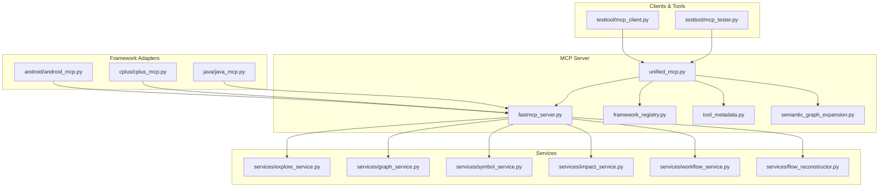
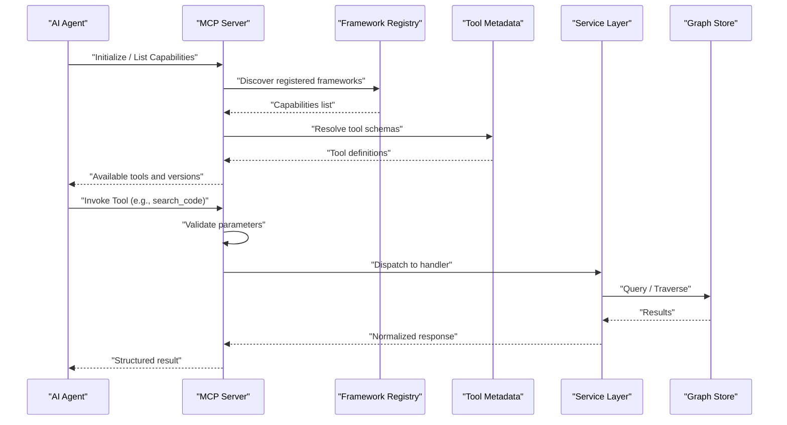
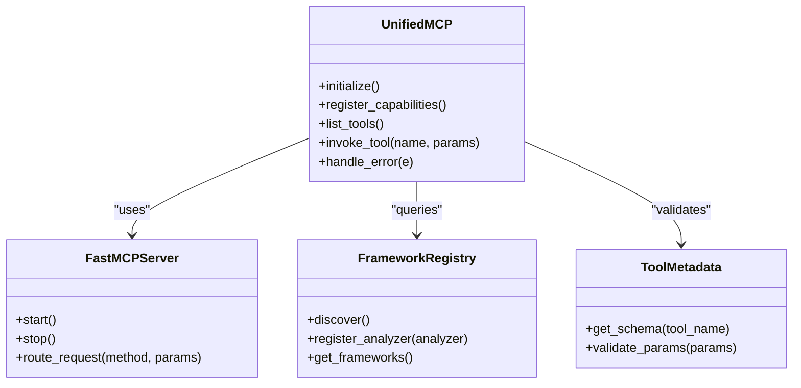
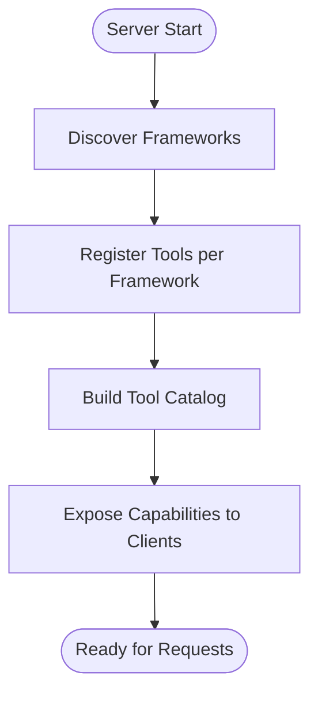
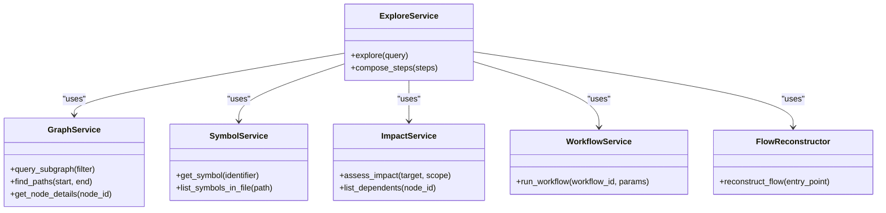
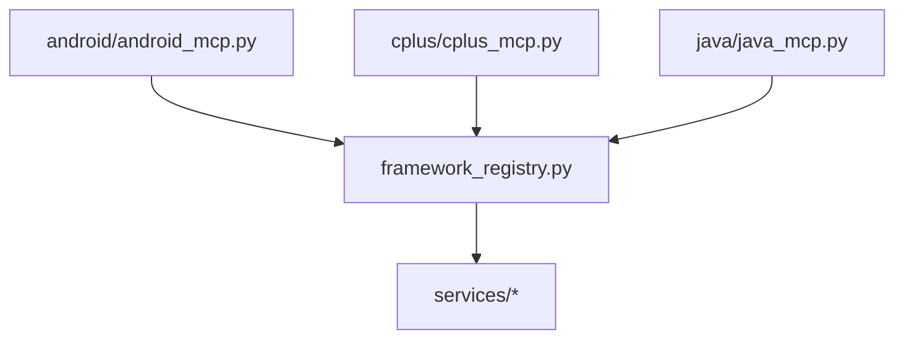
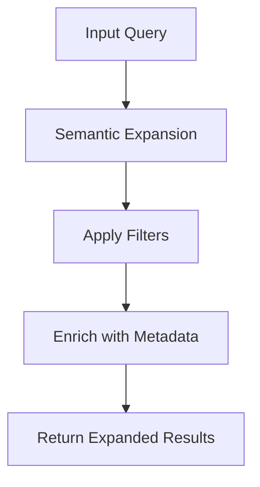
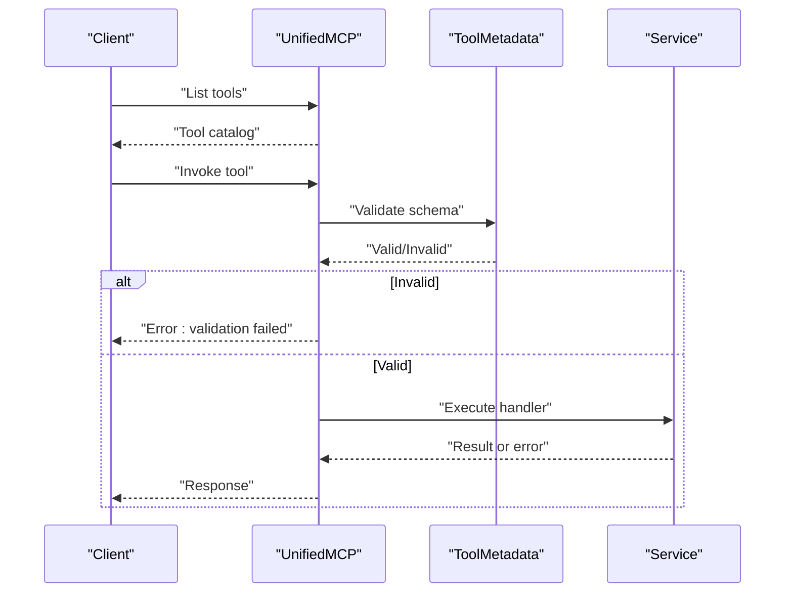
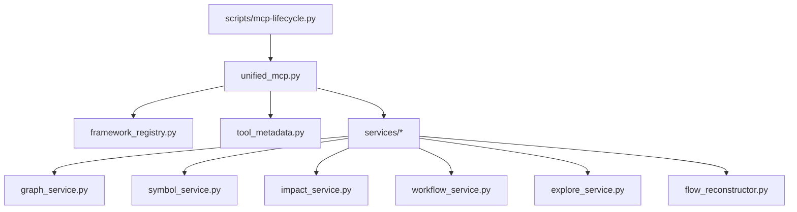

# Model Context Protocol Integration

<cite>
**Referenced Files in This Document**
- [unified_mcp.py](file://code-tiny/mcp/unified_mcp.py)
- [fastmcp_server.py](file://code-tiny/mcp/fastmcp_server.py)
- [framework_registry.py](file://code-tiny/mcp/framework_registry.py)
- [tool_metadata.py](file://code-tiny/mcp/tool_metadata.py)
- [semantic_graph_expansion.py](file://code-tiny/mcp/semantic_graph_expansion.py)
- [services/explore_service.py](file://code-tiny/mcp/services/explore_service.py)
- [services/graph_service.py](file://code-tiny/mcp/services/graph_service.py)
- [services/symbol_service.py](file://code-tiny/mcp/services/symbol_service.py)
- [services/impact_service.py](file://code-tiny/mcp/services/impact_service.py)
- [services/workflow_service.py](file://code-tiny/mcp/services/workflow_service.py)
- [services/flow_reconstructor.py](file://code-tiny/mcp/services/flow_reconstructor.py)
- [android/android_mcp.py](file://code-tiny/mcp/android/android_mcp.py)
- [cplus/cplus_mcp.py](file://code-tiny/mcp/cplus/cplus_mcp.py)
- [java/java_mcp.py](file://code-tiny/mcp/java/java_mcp.py)
- [testtool/mcp_client.py](file://code-tiny/testtool/mcp_client.py)
- [testtool/mcp_tester.py](file://code-tiny/testtool/mcp_tester.py)
- [scripts/mcp-lifecycle.py](file://scripts/mcp-lifecycle.py)
- [specs/mcp.md](file://docs/specs/mcp.md)
- [MCP_CAPABILITY_ACCEPTANCE_MATRIX.md](file://docs/MCP_CAPABILITY_ACCEPTANCE_MATRIX.md)
</cite>

## Table of Contents
1. [Introduction](#introduction)
2. [Project Structure](#project-structure)
3. [Core Components](#core-components)
4. [Architecture Overview](#architecture-overview)
5. [Detailed Component Analysis](#detailed-component-analysis)
6. [Dependency Analysis](#dependency-analysis)
7. [Performance Considerations](#performance-considerations)
8. [Troubleshooting Guide](#troubleshooting-guide)
9. [Conclusion](#conclusion)
10. [Appendices](#appendices)

## Introduction
This document explains the Model Context Protocol (MCP) integration for Cortex Harness, focusing on the MCP server architecture, capability registration, tool discovery, and how AI agents interact with Cortex Harness via standardized MCP messages. It covers available tools such as code search, dependency analysis, impact assessment, and semantic exploration; client implementation examples; message routing; capability negotiation; error handling; security considerations; authentication mechanisms; rate limiting; guidance for developing custom capabilities; and testing and debugging strategies.

## Project Structure
The MCP implementation is primarily located under code-tiny/mcp, with framework-specific adapters and shared services:
- Unified MCP entrypoints and server bootstrap
- Capability registry and tool metadata
- Services for graph, symbol, impact, workflow, explore, and flow reconstruction
- Framework-specific MCP modules (Android, C++, Java)
- Test utilities and lifecycle scripts
- Specification and acceptance matrix documents

**Diagram sources**
- [unified_mcp.py](file://code-tiny/mcp/unified_mcp.py)
- [fastmcp_server.py](file://code-tiny/mcp/fastmcp_server.py)
- [framework_registry.py](file://code-tiny/mcp/framework_registry.py)
- [tool_metadata.py](file://code-tiny/mcp/tool_metadata.py)
- [semantic_graph_expansion.py](file://code-tiny/mcp/semantic_graph_expansion.py)
- [services/explore_service.py](file://code-tiny/mcp/services/explore_service.py)
- [services/graph_service.py](file://code-tiny/mcp/services/graph_service.py)
- [services/symbol_service.py](file://code-tiny/mcp/services/symbol_service.py)
- [services/impact_service.py](file://code-tiny/mcp/services/impact_service.py)
- [services/workflow_service.py](file://code-tiny/mcp/services/workflow_service.py)
- [services/flow_reconstructor.py](file://code-tiny/mcp/services/flow_reconstructor.py)
- [android/android_mcp.py](file://code-tiny/mcp/android/android_mcp.py)
- [cplus/cplus_mcp.py](file://code-tiny/mcp/cplus/cplus_mcp.py)
- [java/java_mcp.py](file://code-tiny/mcp/java/java_mcp.py)
- [testtool/mcp_client.py](file://code-tiny/testtool/mcp_client.py)
- [testtool/mcp_tester.py](file://code-tiny/testtool/mcp_tester.py)

**Section sources**
- [unified_mcp.py](file://code-tiny/mcp/unified_mcp.py)
- [fastmcp_server.py](file://code-tiny/mcp/fastmcp_server.py)
- [framework_registry.py](file://code-tiny/mcp/framework_registry.py)
- [tool_metadata.py](file://code-tiny/mcp/tool_metadata.py)
- [semantic_graph_expansion.py](file://code-tiny/mcp/semantic_graph_expansion.py)
- [services/explore_service.py](file://code-tiny/mcp/services/explore_service.py)
- [services/graph_service.py](file://code-tiny/mcp/services/graph_service.py)
- [services/symbol_service.py](file://code-tiny/mcp/services/symbol_service.py)
- [services/impact_service.py](file://code-tiny/mcp/services/impact_service.py)
- [services/workflow_service.py](file://code-tiny/mcp/services/workflow_service.py)
- [services/flow_reconstructor.py](file://code-tiny/mcp/services/flow_reconstructor.py)
- [android/android_mcp.py](file://code-tiny/mcp/android/android_mcp.py)
- [cplus/cplus_mcp.py](file://code-tiny/mcp/cplus/cplus_mcp.py)
- [java/java_mcp.py](file://code-tiny/mcp/java/java_mcp.py)
- [testtool/mcp_client.py](file://code-tiny/testtool/mcp_client.py)
- [testtool/mcp_tester.py](file://code-tiny/testtool/mcp_tester.py)

## Core Components
- Unified MCP entrypoint: orchestrates server initialization, capability registration, and request dispatching.
- FastMCP server wrapper: provides transport and protocol-level features.
- Framework registry: discovers and registers framework-specific capabilities and analyzers.
- Tool metadata: defines tool schemas, descriptions, and parameter contracts.
- Semantic graph expansion: augments query results with contextual graph relationships.
- Services layer: encapsulates domain logic for explore, graph traversal, symbol lookup, impact analysis, workflows, and flow reconstruction.
- Framework adapters: Android, C++, Java MCP modules that register language-specific tools and behaviors.
- Client utilities: test clients and testers to validate MCP flows.

Key responsibilities:
- Capability negotiation and tool discovery
- Message routing from MCP requests to service handlers
- Input validation and output normalization
- Error propagation and structured responses
- Security and access control hooks

**Section sources**
- [unified_mcp.py](file://code-tiny/mcp/unified_mcp.py)
- [fastmcp_server.py](file://code-tiny/mcp/fastmcp_server.py)
- [framework_registry.py](file://code-tiny/mcp/framework_registry.py)
- [tool_metadata.py](file://code-tiny/mcp/tool_metadata.py)
- [semantic_graph_expansion.py](file://code-tiny/mcp/semantic_graph_expansion.py)
- [services/explore_service.py](file://code-tiny/mcp/services/explore_service.py)
- [services/graph_service.py](file://code-tiny/mcp/services/graph_service.py)
- [services/symbol_service.py](file://code-tiny/mcp/services/symbol_service.py)
- [services/impact_service.py](file://code-tiny/mcp/services/impact_service.py)
- [services/workflow_service.py](file://code-tiny/mcp/services/workflow_service.py)
- [services/flow_reconstructor.py](file://code-tiny/mcp/services/flow_reconstructor.py)
- [android/android_mcp.py](file://code-tiny/mcp/android/android_mcp.py)
- [cplus/cplus_mcp.py](file://code-tiny/mcp/cplus/cplus_mcp.py)
- [java/java_mcp.py](file://code-tiny/mcp/java/java_mcp.py)

## Architecture Overview
The MCP server exposes a set of tools to AI agents. Agents send MCP messages describing their intent (e.g., search code, traverse dependencies, assess impact). The server validates inputs, routes requests to appropriate services, executes analysis against the underlying graph store, and returns structured results.

**Diagram sources**
- [unified_mcp.py](file://code-tiny/mcp/unified_mcp.py)
- [framework_registry.py](file://code-tiny/mcp/framework_registry.py)
- [tool_metadata.py](file://code-tiny/mcp/tool_metadata.py)
- [services/explore_service.py](file://code-tiny/mcp/services/explore_service.py)
- [services/graph_service.py](file://code-tiny/mcp/services/graph_service.py)
- [services/symbol_service.py](file://code-tiny/mcp/services/symbol_service.py)
- [services/impact_service.py](file://code-tiny/mcp/services/impact_service.py)

## Detailed Component Analysis

### Unified MCP Entry and Server Bootstrap
Responsibilities:
- Initialize transport and protocol layers
- Register core and framework-specific tools
- Provide capability listing and version negotiation
- Centralize error handling and logging

**Diagram sources**
- [unified_mcp.py](file://code-tiny/mcp/unified_mcp.py)
- [fastmcp_server.py](file://code-tiny/mcp/fastmcp_server.py)
- [framework_registry.py](file://code-tiny/mcp/framework_registry.py)
- [tool_metadata.py](file://code-tiny/mcp/tool_metadata.py)

**Section sources**
- [unified_mcp.py](file://code-tiny/mcp/unified_mcp.py)
- [fastmcp_server.py](file://code-tiny/mcp/fastmcp_server.py)
- [framework_registry.py](file://code-tiny/mcp/framework_registry.py)
- [tool_metadata.py](file://code-tiny/mcp/tool_metadata.py)

### Capability Registration and Tool Discovery
- The registry scans framework adapters and registers analyzers and tools per framework.
- Tool metadata defines schemas and constraints for each tool’s input and output.
- Capability negotiation allows clients to discover supported tools and versions before invoking them.

**Diagram sources**
- [framework_registry.py](file://code-tiny/mcp/framework_registry.py)
- [tool_metadata.py](file://code-tiny/mcp/tool_metadata.py)
- [unified_mcp.py](file://code-tiny/mcp/unified_mcp.py)

**Section sources**
- [framework_registry.py](file://code-tiny/mcp/framework_registry.py)
- [tool_metadata.py](file://code-tiny/mcp/tool_metadata.py)
- [unified_mcp.py](file://code-tiny/mcp/unified_mcp.py)

### Service Layer: Explore, Graph, Symbol, Impact, Workflow, Flow Reconstruction
- Explore service: high-level orchestration for multi-step queries and cross-service calls.
- Graph service: low-level graph traversal and query operations.
- Symbol service: symbol resolution and lookup across languages.
- Impact service: change impact analysis and dependency-based assessments.
- Workflow service: pipeline orchestration for complex tasks.
- Flow reconstructor: reconstructs execution or call flows from graph data.

**Diagram sources**
- [services/explore_service.py](file://code-tiny/mcp/services/explore_service.py)
- [services/graph_service.py](file://code-tiny/mcp/services/graph_service.py)
- [services/symbol_service.py](file://code-tiny/mcp/services/symbol_service.py)
- [services/impact_service.py](file://code-tiny/mcp/services/impact_service.py)
- [services/workflow_service.py](file://code-tiny/mcp/services/workflow_service.py)
- [services/flow_reconstructor.py](file://code-tiny/mcp/services/flow_reconstructor.py)

**Section sources**
- [services/explore_service.py](file://code-tiny/mcp/services/explore_service.py)
- [services/graph_service.py](file://code-tiny/mcp/services/graph_service.py)
- [services/symbol_service.py](file://code-tiny/mcp/services/symbol_service.py)
- [services/impact_service.py](file://code-tiny/mcp/services/impact_service.py)
- [services/workflow_service.py](file://code-tiny/mcp/services/workflow_service.py)
- [services/flow_reconstructor.py](file://code-tiny/mcp/services/flow_reconstructor.py)

### Framework-Specific MCP Modules
- Android MCP module: registers Android-specific tools and analyzer integrations.
- C++ MCP module: registers C++ specific tools and parser bridges.
- Java MCP module: registers Java-specific tools and Spring/Servlet overlays.

**Diagram sources**
- [android/android_mcp.py](file://code-tiny/mcp/android/android_mcp.py)
- [cplus/cplus_mcp.py](file://code-tiny/mcp/cplus/cplus_mcp.py)
- [java/java_mcp.py](file://code-tiny/mcp/java/java_mcp.py)
- [framework_registry.py](file://code-tiny/mcp/framework_registry.py)
- [services/explore_service.py](file://code-tiny/mcp/services/explore_service.py)
- [services/graph_service.py](file://code-tiny/mcp/services/graph_service.py)
- [services/symbol_service.py](file://code-tiny/mcp/services/symbol_service.py)
- [services/impact_service.py](file://code-tiny/mcp/services/impact_service.py)

**Section sources**
- [android/android_mcp.py](file://code-tiny/mcp/android/android_mcp.py)
- [cplus/cplus_mcp.py](file://code-tiny/mcp/cplus/cplus_mcp.py)
- [java/java_mcp.py](file://code-tiny/mcp/java/java_mcp.py)
- [framework_registry.py](file://code-tiny/mcp/framework_registry.py)

### Semantic Graph Expansion
Augments query results by expanding nodes into related entities and edges, improving context for downstream consumers.

**Diagram sources**
- [semantic_graph_expansion.py](file://code-tiny/mcp/semantic_graph_expansion.py)
- [services/graph_service.py](file://code-tiny/mcp/services/graph_service.py)

**Section sources**
- [semantic_graph_expansion.py](file://code-tiny/mcp/semantic_graph_expansion.py)
- [services/graph_service.py](file://code-tiny/mcp/services/graph_service.py)

### Available MCP Tools
Commonly exposed tools include:
- Code search: text and semantic search over indexed artifacts
- Dependency analysis: list dependencies and dependents for symbols/files/modules
- Impact assessment: evaluate change impact within scopes
- Symbol lookup: resolve identifiers and retrieve details
- Graph traversal: find paths, subgraphs, and node details
- Workflow execution: run predefined analysis pipelines
- Flow reconstruction: rebuild call or execution flows

For exact tool names, schemas, and accepted parameters, consult the tool metadata and specification documents.

**Section sources**
- [tool_metadata.py](file://code-tiny/mcp/tool_metadata.py)
- [specs/mcp.md](file://docs/specs/mcp.md)
- [MCP_CAPABILITY_ACCEPTANCE_MATRIX.md](file://docs/MCP_CAPABILITY_ACCEPTANCE_MATRIX.md)

### Client Implementation Examples
- Test client: demonstrates connecting to the MCP server, listing capabilities, and invoking tools.
- Tester utility: runs sample payloads and validates responses.

Use these as references for integrating with popular AI frameworks and agent platforms. Adapt the client to your platform’s messaging patterns while preserving MCP semantics.

**Section sources**
- [testtool/mcp_client.py](file://code-tiny/testtool/mcp_client.py)
- [testtool/mcp_tester.py](file://code-tiny/testtool/mcp_tester.py)

### Message Routing, Capability Negotiation, and Error Handling
- Capability negotiation: clients should enumerate available tools and versions before invocation.
- Message routing: unified entrypoint validates and dispatches to service handlers based on tool name.
- Error handling: structured errors are propagated back to clients with actionable details.

**Diagram sources**
- [unified_mcp.py](file://code-tiny/mcp/unified_mcp.py)
- [tool_metadata.py](file://code-tiny/mcp/tool_metadata.py)
- [services/explore_service.py](file://code-tiny/mcp/services/explore_service.py)

**Section sources**
- [unified_mcp.py](file://code-tiny/mcp/unified_mcp.py)
- [tool_metadata.py](file://code-tiny/mcp/tool_metadata.py)
- [services/explore_service.py](file://code-tiny/mcp/services/explore_service.py)

## Dependency Analysis
The MCP server depends on:
- Framework registry for dynamic capability discovery
- Tool metadata for schema validation
- Services for domain logic
- Graph store for persistence and traversal
- Lifecycle scripts for operational management

**Diagram sources**
- [unified_mcp.py](file://code-tiny/mcp/unified_mcp.py)
- [framework_registry.py](file://code-tiny/mcp/framework_registry.py)
- [tool_metadata.py](file://code-tiny/mcp/tool_metadata.py)
- [services/explore_service.py](file://code-tiny/mcp/services/explore_service.py)
- [services/graph_service.py](file://code-tiny/mcp/services/graph_service.py)
- [services/symbol_service.py](file://code-tiny/mcp/services/symbol_service.py)
- [services/impact_service.py](file://code-tiny/mcp/services/impact_service.py)
- [services/workflow_service.py](file://code-tiny/mcp/services/workflow_service.py)
- [services/flow_reconstructor.py](file://code-tiny/mcp/services/flow_reconstructor.py)
- [scripts/mcp-lifecycle.py](file://scripts/mcp-lifecycle.py)

**Section sources**
- [unified_mcp.py](file://code-tiny/mcp/unified_mcp.py)
- [framework_registry.py](file://code-tiny/mcp/framework_registry.py)
- [tool_metadata.py](file://code-tiny/mcp/tool_metadata.py)
- [services/explore_service.py](file://code-tiny/mcp/services/explore_service.py)
- [services/graph_service.py](file://code-tiny/mcp/services/graph_service.py)
- [services/symbol_service.py](file://code-tiny/mcp/services/symbol_service.py)
- [services/impact_service.py](file://code-tiny/mcp/services/impact_service.py)
- [services/workflow_service.py](file://code-tiny/mcp/services/workflow_service.py)
- [services/flow_reconstructor.py](file://code-tiny/mcp/services/flow_reconstructor.py)
- [scripts/mcp-lifecycle.py](file://scripts/mcp-lifecycle.py)

## Performance Considerations
- Prefer targeted queries and filters to reduce graph traversal cost.
- Use pagination and limits where applicable to avoid large payloads.
- Cache frequent lookups at the service layer when safe.
- Batch operations for multiple related queries.
- Monitor latency and throughput; tune concurrency settings in the server wrapper.

[No sources needed since this section provides general guidance]

## Troubleshooting Guide
- Validate tool schemas using the metadata layer before invoking tools.
- Inspect capability lists to ensure required tools are available.
- Use the test client and tester utilities to reproduce issues with known payloads.
- Check lifecycle scripts for server health checks and restart procedures.
- Review error responses for actionable diagnostics and stack traces.

**Section sources**
- [testtool/mcp_client.py](file://code-tiny/testtool/mcp_client.py)
- [testtool/mcp_tester.py](file://code-tiny/testtool/mcp_tester.py)
- [scripts/mcp-lifecycle.py](file://scripts/mcp-lifecycle.py)
- [tool_metadata.py](file://code-tiny/mcp/tool_metadata.py)

## Conclusion
Cortex Harness MCP provides a robust, extensible interface for AI agents to perform code analysis, symbol lookup, dependency and impact analysis, and semantic exploration. The architecture emphasizes clear separation between transport, capability registration, tool metadata, and service logic, enabling easy extension with new tools and frameworks. Following the guidance here will help you integrate effectively, secure your deployment, and maintain high performance.

[No sources needed since this section summarizes without analyzing specific files]

## Appendices

### Developing Custom MCP Capabilities
Steps:
- Define tool metadata: name, description, input schema, output contract.
- Implement a service handler for the tool’s logic.
- Register the tool in the framework registry or adapter module.
- Update capability listings and tests.
- Validate with the test client and tester utilities.

**Section sources**
- [tool_metadata.py](file://code-tiny/mcp/tool_metadata.py)
- [framework_registry.py](file://code-tiny/mcp/framework_registry.py)
- [testtool/mcp_client.py](file://code-tiny/testtool/mcp_client.py)
- [testtool/mcp_tester.py](file://code-tiny/testtool/mcp_tester.py)

### Testing Strategies and Debugging Techniques
- Unit tests for service handlers and metadata validation.
- Integration tests using the test client to exercise full MCP flows.
- Acceptance tests aligned with the capability matrix.
- Use lifecycle scripts to start/stop servers and capture logs.
- Add instrumentation around key service methods to trace performance.

**Section sources**
- [MCP_CAPABILITY_ACCEPTANCE_MATRIX.md](file://docs/MCP_CAPABILITY_ACCEPTANCE_MATRIX.md)
- [scripts/mcp-lifecycle.py](file://scripts/mcp-lifecycle.py)
- [testtool/mcp_client.py](file://code-tiny/testtool/mcp_client.py)
- [testtool/mcp_tester.py](file://code-tiny/testtool/mcp_tester.py)

### Security, Authentication, and Rate Limiting
- Enforce authentication at the transport layer (e.g., TLS, tokens).
- Apply authorization policies per tool or resource scope.
- Implement rate limiting and quotas to protect backend resources.
- Sanitize inputs and validate outputs strictly using tool metadata.
- Log security events and failures for auditability.

[No sources needed since this section provides general guidance]