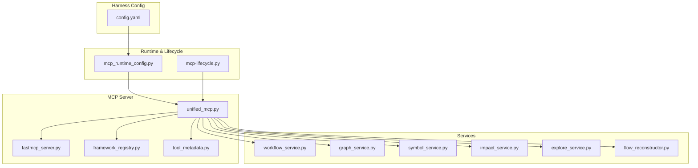
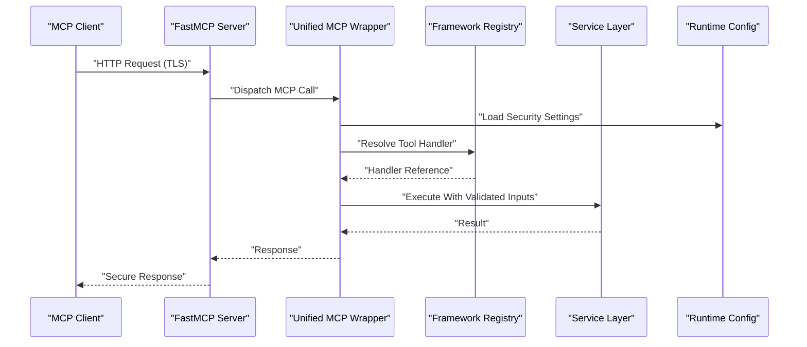
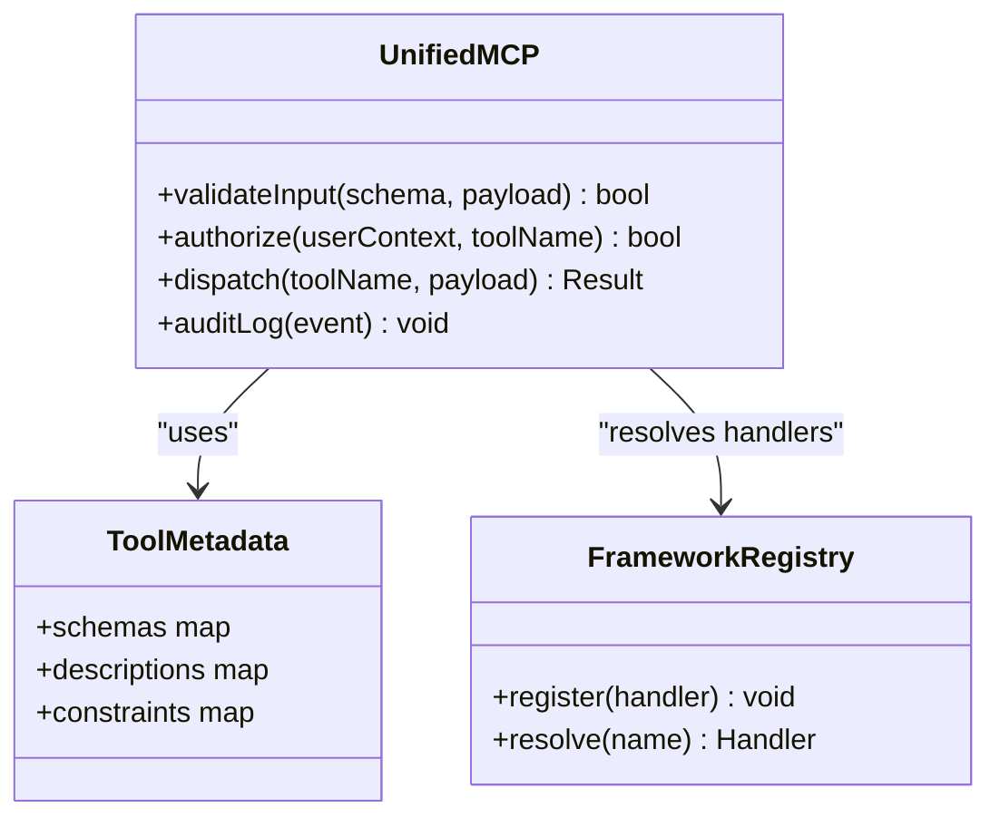
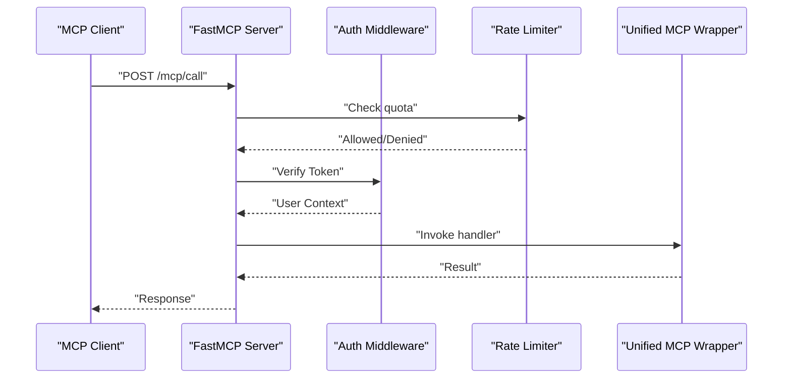
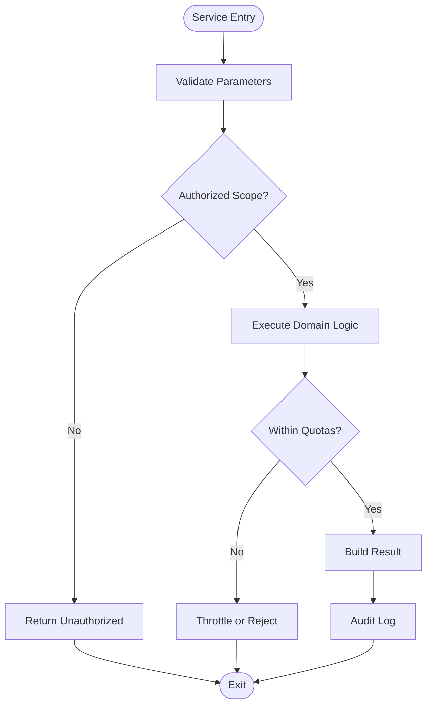
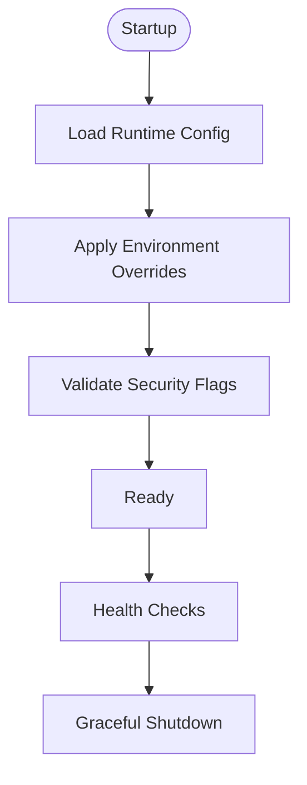
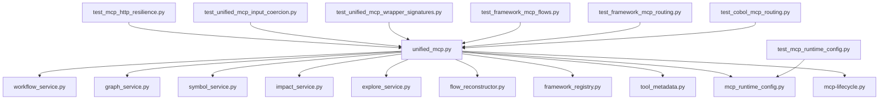

# Security & Authentication

<cite>
**Referenced Files in This Document**
- [ReadMe.md](file://ReadMe.md)
- [mcp.md](file://docs/specs/mcp.md)
- [MCP_CAPABILITY_ACCEPTANCE_MATRIX.md](file://docs/MCP_CAPABILITY_ACCEPTANCE_MATRIX.md)
- [test_mcp_http_resilience.py](file://tests/test_mcp_http_resilience.py)
- [test_mcp_runtime_config.py](file://tests/test_mcp_runtime_config.py)
- [test_unified_mcp_input_coercion.py](file://tests/test_unified_mcp_input_coercion.py)
- [test_unified_mcp_wrapper_signatures.py](file://tests/test_unified_mcp_wrapper_signatures.py)
- [test_framework_mcp_flows.py](file://tests/test_framework_mcp_flows.py)
- [test_framework_mcp_routing.py](file://tests/test_framework_mcp_routing.py)
- [test_cobol_mcp_routing.py](file://tests/test_cobol_mcp_routing.py)
- [scripts/mcp-lifecycle.py](file://scripts/mcp-lifecycle.py)
- [scripts/mcp_runtime_config.py](file://scripts/mcp_runtime_config.py)
- [code-tiny/mcp/unified_mcp.py](file://code-tiny/mcp/unified_mcp.py)
- [code-tiny/mcp/fastmcp_server.py](file://code-tiny/mcp/fastmcp_server.py)
- [code-tiny/mcp/framework_registry.py](file://code-tiny/mcp/framework_registry.py)
- [code-tiny/mcp/tool_metadata.py](file://code-tiny/mcp/tool_metadata.py)
- [code-tiny/mcp/services/workflow_service.py](file://code-tiny/mcp/services/workflow_service.py)
- [code-tiny/mcp/services/graph_service.py](file://code-tiny/mcp/services/graph_service.py)
- [code-tiny/mcp/services/impact_service.py](file://code-tiny/mcp/services/impact_service.py)
- [code-tiny/mcp/services/symbol_service.py](file://code-tiny/mcp/services/symbol_service.py)
- [code-tiny/mcp/services/explore_service.py](file://code-tiny/mcp/services/explore_service.py)
- [code-tiny/mcp/services/flow_reconstructor.py](file://code-tiny/mcp/services/flow_reconstructor.py)
- [code-tiny/mcp/semantic_graph_expansion.py](file://code-tiny/mcp/semantic_graph_expansion.py)
- [harness/templates/config.yaml](file://harness/templates/config.yaml)
- [installers/common/config_manager.py](file://installers/common/config_manager.py)
- [cortex_harness/dev.py](file://cortex_harness/dev.py)
</cite>

## Table of Contents
1. [Introduction](#introduction)
2. [Project Structure](#project-structure)
3. [Core Components](#core-components)
4. [Architecture Overview](#architecture-overview)
5. [Detailed Component Analysis](#detailed-component-analysis)
6. [Dependency Analysis](#dependency-analysis)
7. [Performance Considerations](#performance-considerations)
8. [Troubleshooting Guide](#troubleshooting-guide)
9. [Conclusion](#conclusion)
10. [Appendices](#appendices)

## Introduction
This document provides comprehensive security documentation for Model Context Protocol (MCP) integration within Cortex Harness. It focuses on authentication mechanisms, authorization models, access control patterns, secure connection establishment, token management, and credential handling. It also includes configuration examples for local development, team environments, and production deployments, along with best practices, common vulnerabilities, mitigation strategies, audit logging, security monitoring, compliance considerations, and guidance for implementing custom authentication providers and integrating with enterprise identity systems.

## Project Structure
The MCP integration spans multiple modules:
- Unified MCP wrapper and server entry points
- Service layer implementations for graph, workflow, symbol, impact, explore, and flow reconstruction
- Framework registry and tool metadata
- Runtime configuration and lifecycle scripts
- Tests validating HTTP resilience, runtime configuration, input coercion, and routing flows

**Diagram sources**
- [code-tiny/mcp/unified_mcp.py](file://code-tiny/mcp/unified_mcp.py)
- [code-tiny/mcp/fastmcp_server.py](file://code-tiny/mcp/fastmcp_server.py)
- [code-tiny/mcp/framework_registry.py](file://code-tiny/mcp/framework_registry.py)
- [code-tiny/mcp/tool_metadata.py](file://code-tiny/mcp/tool_metadata.py)
- [code-tiny/mcp/services/workflow_service.py](file://code-tiny/mcp/services/workflow_service.py)
- [code-tiny/mcp/services/graph_service.py](file://code-tiny/mcp/services/graph_service.py)
- [code-tiny/mcp/services/symbol_service.py](file://code-tiny/mcp/services/symbol_service.py)
- [code-tiny/mcp/services/impact_service.py](file://code-tiny/mcp/services/impact_service.py)
- [code-tiny/mcp/services/explore_service.py](file://code-tiny/mcp/services/explore_service.py)
- [code-tiny/mcp/services/flow_reconstructor.py](file://code-tiny/mcp/services/flow_reconstructor.py)
- [scripts/mcp_runtime_config.py](file://scripts/mcp_runtime_config.py)
- [scripts/mcp-lifecycle.py](file://scripts/mcp-lifecycle.py)
- [harness/templates/config.yaml](file://harness/templates/config.yaml)

**Section sources**
- [ReadMe.md](file://ReadMe.md)
- [mcp.md](file://docs/specs/mcp.md)
- [MCP_CAPABILITY_ACCEPTANCE_MATRIX.md](file://docs/MCP_CAPABILITY_ACCEPTANCE_MATRIX.md)

## Core Components
- Unified MCP Wrapper: Orchestrates MCP capabilities, routes requests to services, and enforces validation and metadata.
- FastMCP Server: Provides the transport layer for MCP over HTTP or other transports.
- Framework Registry: Discovers and registers framework-specific MCP tools and handlers.
- Tool Metadata: Defines schemas, descriptions, and constraints for MCP tools.
- Services: Implement domain logic for workflows, graphs, symbols, impacts, exploration, and flow reconstruction.
- Runtime Configuration: Loads environment-based settings for MCP endpoints, timeouts, and security toggles.
- Lifecycle Scripts: Manage MCP process lifecycle, health checks, and graceful shutdown.

Security-relevant responsibilities:
- Input validation and schema enforcement at the MCP boundary
- Secure transport configuration (TLS, CORS, rate limiting)
- Credential loading from environment or secret managers
- Authorization gating based on user context and scopes
- Audit logging of MCP calls and outcomes

**Section sources**
- [code-tiny/mcp/unified_mcp.py](file://code-tiny/mcp/unified_mcp.py)
- [code-tiny/mcp/fastmcp_server.py](file://code-tiny/mcp/fastmcp_server.py)
- [code-tiny/mcp/framework_registry.py](file://code-tiny/mcp/framework_registry.py)
- [code-tiny/mcp/tool_metadata.py](file://code-tiny/mcp/tool_metadata.py)
- [code-tiny/mcp/services/workflow_service.py](file://code-tiny/mcp/services/workflow_service.py)
- [code-tiny/mcp/services/graph_service.py](file://code-tiny/mcp/services/graph_service.py)
- [code-tiny/mcp/services/symbol_service.py](file://code-tiny/mcp/services/symbol_service.py)
- [code-tiny/mcp/services/impact_service.py](file://code-tiny/mcp/services/impact_service.py)
- [code-tiny/mcp/services/explore_service.py](file://code-tiny/mcp/services/explore_service.py)
- [code-tiny/mcp/services/flow_reconstructor.py](file://code-tiny/mcp/services/flow_reconstructor.py)
- [scripts/mcp_runtime_config.py](file://scripts/mcp_runtime_config.py)
- [scripts/mcp-lifecycle.py](file://scripts/mcp-lifecycle.py)

## Architecture Overview
The MCP architecture integrates a server layer with service implementations and runtime configuration. Security controls are applied at the transport boundary, request validation, and service execution layers.

**Diagram sources**
- [code-tiny/mcp/fastmcp_server.py](file://code-tiny/mcp/fastmcp_server.py)
- [code-tiny/mcp/unified_mcp.py](file://code-tiny/mcp/unified_mcp.py)
- [code-tiny/mcp/framework_registry.py](file://code-tiny/mcp/framework_registry.py)
- [scripts/mcp_runtime_config.py](file://scripts/mcp_runtime_config.py)

## Detailed Component Analysis

### Unified MCP Wrapper
Responsibilities:
- Centralizes MCP capability orchestration
- Enforces input validation using tool metadata schemas
- Applies authorization checks before invoking services
- Aggregates audit logs for each call

Security considerations:
- Validate all inputs against strict schemas to prevent injection
- Reject unknown or deprecated tools
- Ensure least privilege by scoping tool access per user role
- Log sensitive fields with redaction policies

**Diagram sources**
- [code-tiny/mcp/unified_mcp.py](file://code-tiny/mcp/unified_mcp.py)
- [code-tiny/mcp/tool_metadata.py](file://code-tiny/mcp/tool_metadata.py)
- [code-tiny/mcp/framework_registry.py](file://code-tiny/mcp/framework_registry.py)

**Section sources**
- [code-tiny/mcp/unified_mcp.py](file://code-tiny/mcp/unified_mcp.py)
- [code-tiny/mcp/tool_metadata.py](file://code-tiny/mcp/tool_metadata.py)
- [code-tiny/mcp/framework_registry.py](file://code-tiny/mcp/framework_registry.py)

### FastMCP Server
Responsibilities:
- Exposes MCP endpoints over HTTP
- Handles TLS termination and CORS policy
- Implements rate limiting and request size limits
- Integrates middleware for authentication and authorization

Security considerations:
- Enforce HTTPS only in non-development environments
- Configure CORS to restrict origins and methods
- Apply rate limiting to mitigate abuse
- Integrate JWT/OIDC verification middleware

**Diagram sources**
- [code-tiny/mcp/fastmcp_server.py](file://code-tiny/mcp/fastmcp_server.py)
- [code-tiny/mcp/unified_mcp.py](file://code-tiny/mcp/unified_mcp.py)

**Section sources**
- [code-tiny/mcp/fastmcp_server.py](file://code-tiny/mcp/fastmcp_server.py)

### Service Layer
Responsibilities:
- Workflow orchestration and state management
- Graph traversal and analysis
- Symbol resolution and lookup
- Impact assessment and propagation
- Exploration queries and flow reconstruction

Security considerations:
- Scope data access by project/workspace boundaries
- Validate query parameters to prevent excessive traversal
- Redact sensitive identifiers in logs
- Enforce timeouts and resource quotas

**Diagram sources**
- [code-tiny/mcp/services/workflow_service.py](file://code-tiny/mcp/services/workflow_service.py)
- [code-tiny/mcp/services/graph_service.py](file://code-tiny/mcp/services/graph_service.py)
- [code-tiny/mcp/services/symbol_service.py](file://code-tiny/mcp/services/symbol_service.py)
- [code-tiny/mcp/services/impact_service.py](file://code-tiny/mcp/services/impact_service.py)
- [code-tiny/mcp/services/explore_service.py](file://code-tiny/mcp/services/explore_service.py)
- [code-tiny/mcp/services/flow_reconstructor.py](file://code-tiny/mcp/services/flow_reconstructor.py)

**Section sources**
- [code-tiny/mcp/services/workflow_service.py](file://code-tiny/mcp/services/workflow_service.py)
- [code-tiny/mcp/services/graph_service.py](file://code-tiny/mcp/services/graph_service.py)
- [code-tiny/mcp/services/symbol_service.py](file://code-tiny/mcp/services/symbol_service.py)
- [code-tiny/mcp/services/impact_service.py](file://code-tiny/mcp/services/impact_service.py)
- [code-tiny/mcp/services/explore_service.py](file://code-tiny/mcp/services/explore_service.py)
- [code-tiny/mcp/services/flow_reconstructor.py](file://code-tiny/mcp/services/flow_reconstructor.py)

### Runtime Configuration and Lifecycle
Responsibilities:
- Load MCP endpoint URLs, timeouts, and security flags
- Provide environment-specific overrides
- Manage process lifecycle, health checks, and graceful shutdown

Security considerations:
- Prefer secrets managers over plaintext config files
- Restrict file permissions for configuration storage
- Enable TLS and disable insecure protocols
- Rotate credentials regularly

**Diagram sources**
- [scripts/mcp_runtime_config.py](file://scripts/mcp_runtime_config.py)
- [scripts/mcp-lifecycle.py](file://scripts/mcp-lifecycle.py)
- [harness/templates/config.yaml](file://harness/templates/config.yaml)

**Section sources**
- [scripts/mcp_runtime_config.py](file://scripts/mcp_runtime_config.py)
- [scripts/mcp-lifecycle.py](file://scripts/mcp-lifecycle.py)
- [harness/templates/config.yaml](file://harness/templates/config.yaml)

## Dependency Analysis
The MCP subsystem depends on configuration, lifecycle management, and test suites that validate behavior under various conditions.

**Diagram sources**
- [code-tiny/mcp/unified_mcp.py](file://code-tiny/mcp/unified_mcp.py)
- [code-tiny/mcp/services/workflow_service.py](file://code-tiny/mcp/services/workflow_service.py)
- [code-tiny/mcp/services/graph_service.py](file://code-tiny/mcp/services/graph_service.py)
- [code-tiny/mcp/services/symbol_service.py](file://code-tiny/mcp/services/symbol_service.py)
- [code-tiny/mcp/services/impact_service.py](file://code-tiny/mcp/services/impact_service.py)
- [code-tiny/mcp/services/explore_service.py](file://code-tiny/mcp/services/explore_service.py)
- [code-tiny/mcp/services/flow_reconstructor.py](file://code-tiny/mcp/services/flow_reconstructor.py)
- [code-tiny/mcp/framework_registry.py](file://code-tiny/mcp/framework_registry.py)
- [code-tiny/mcp/tool_metadata.py](file://code-tiny/mcp/tool_metadata.py)
- [scripts/mcp_runtime_config.py](file://scripts/mcp_runtime_config.py)
- [scripts/mcp-lifecycle.py](file://scripts/mcp-lifecycle.py)
- [tests/test_mcp_http_resilience.py](file://tests/test_mcp_http_resilience.py)
- [tests/test_mcp_runtime_config.py](file://tests/test_mcp_runtime_config.py)
- [tests/test_unified_mcp_input_coercion.py](file://tests/test_unified_mcp_input_coercion.py)
- [tests/test_unified_mcp_wrapper_signatures.py](file://tests/test_unified_mcp_wrapper_signatures.py)
- [tests/test_framework_mcp_flows.py](file://tests/test_framework_mcp_flows.py)
- [tests/test_framework_mcp_routing.py](file://tests/test_framework_mcp_routing.py)
- [tests/test_cobol_mcp_routing.py](file://tests/test_cobol_mcp_routing.py)

**Section sources**
- [tests/test_mcp_http_resilience.py](file://tests/test_mcp_http_resilience.py)
- [tests/test_mcp_runtime_config.py](file://tests/test_mcp_runtime_config.py)
- [tests/test_unified_mcp_input_coercion.py](file://tests/test_unified_mcp_input_coercion.py)
- [tests/test_unified_mcp_wrapper_signatures.py](file://tests/test_unified_mcp_wrapper_signatures.py)
- [tests/test_framework_mcp_flows.py](file://tests/test_framework_mcp_flows.py)
- [tests/test_framework_mcp_routing.py](file://tests/test_framework_mcp_routing.py)
- [tests/test_cobol_mcp_routing.py](file://tests/test_cobol_mcp_routing.py)

## Performance Considerations
- Use connection pooling for downstream services and databases
- Apply request batching where appropriate to reduce overhead
- Enforce timeouts and circuit breakers to avoid cascading failures
- Cache frequently accessed metadata and tool schemas
- Monitor CPU, memory, and network utilization; set alerts for anomalies

[No sources needed since this section provides general guidance]

## Troubleshooting Guide
Common issues and mitigations:
- Authentication failures: Verify token format, issuer, audience, and expiration; ensure OIDC discovery URL is reachable
- Authorization denials: Confirm user roles and scopes match required permissions for the requested tool
- Input validation errors: Check tool metadata schemas and coerce types accordingly
- Rate limiting: Adjust quotas or implement backoff strategies
- TLS handshake errors: Validate certificates and cipher suites; ensure proper CA chain

Operational checks:
- Health endpoints should return success when dependencies are healthy
- Audit logs must capture request IDs, user identities, and outcomes
- Error responses should not leak stack traces or internal details

**Section sources**
- [tests/test_mcp_http_resilience.py](file://tests/test_mcp_http_resilience.py)
- [tests/test_mcp_runtime_config.py](file://tests/test_mcp_runtime_config.py)
- [tests/test_unified_mcp_input_coercion.py](file://tests/test_unified_mcp_input_coercion.py)
- [tests/test_unified_mcp_wrapper_signatures.py](file://tests/test_unified_mcp_wrapper_signatures.py)

## Conclusion
Securing MCP integration requires layered controls across transport, request validation, authorization, and service execution. By enforcing strict schemas, scoping access, managing credentials securely, and enabling robust audit logging, Cortex Harness can provide a safe and compliant MCP experience across development, team, and production environments.

[No sources needed since this section summarizes without analyzing specific files]

## Appendices

### Configuration Examples

- Local Development
  - Disable TLS if necessary behind a reverse proxy
  - Allow localhost origins in CORS
  - Use short-lived tokens and minimal scopes
  - Enable verbose audit logging

- Team Environments
  - Enforce HTTPS and strong ciphers
  - Integrate with corporate OIDC provider
  - Apply role-based access control and scope restrictions
  - Enable centralized log aggregation and alerting

- Production Deployments
  - Require mutual TLS for inter-service communication
  - Store secrets in a vault; never commit to repositories
  - Set strict rate limits and request size caps
  - Enable tamper-evident audit logs and retention policies

[No sources needed since this section provides general guidance]

### Best Practices
- Validate and sanitize all inputs at the MCP boundary
- Use least privilege principles for tool access
- Rotate credentials and tokens regularly
- Monitor and alert on anomalous access patterns
- Perform regular security reviews and penetration testing

[No sources needed since this section provides general guidance]

### Common Vulnerabilities and Mitigations
- Injection via MCP payloads: Enforce strict schemas and parameterized operations
- Broken object level authorization: Enforce workspace/project scoping
- Excessive data exposure: Redact sensitive fields in responses and logs
- Insecure defaults: Harden configurations and disable unused features
- Insufficient logging and monitoring: Capture comprehensive audit trails and integrate SIEM

[No sources needed since this section provides general guidance]

### Custom Authentication Providers
Steps:
- Implement an OIDC client adapter conforming to expected interfaces
- Register the provider in the auth middleware pipeline
- Map external claims to internal roles and scopes
- Validate tokens against configured issuers and audiences
- Support token refresh and revocation checks

Integration points:
- Auth middleware in the server layer
- User context enrichment before unified MCP dispatch
- Policy engine for fine-grained authorization

[No sources needed since this section provides general guidance]

### Enterprise Identity Integration
Recommendations:
- Use SCIM for provisioning and deprovisioning
- Enforce SSO via SAML or OIDC
- Align group mappings to internal roles
- Honor conditional access policies and device posture checks
- Maintain audit trails aligned with enterprise compliance requirements

[No sources needed since this section provides general guidance]