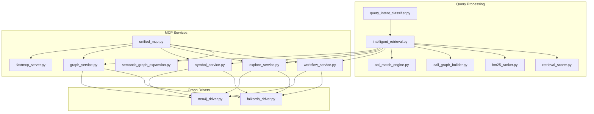
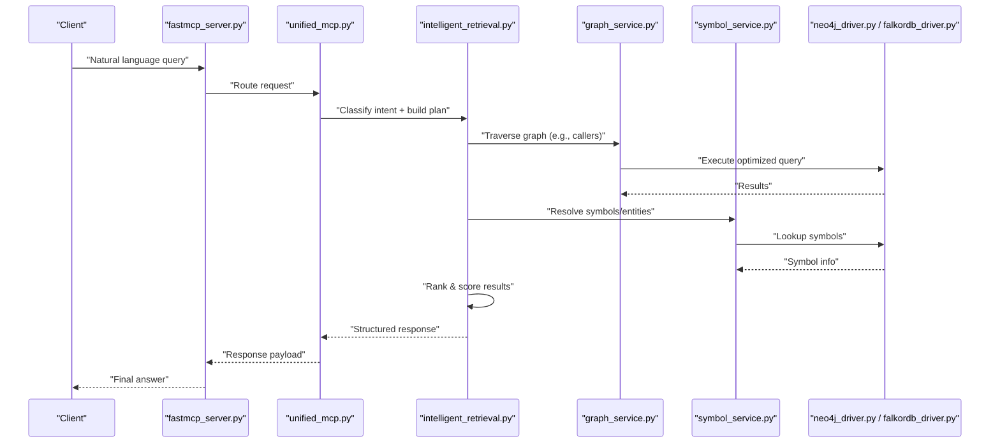
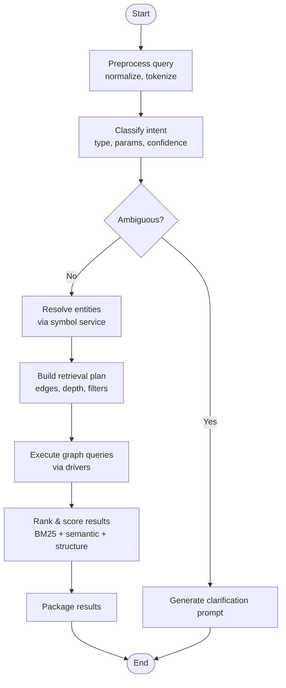
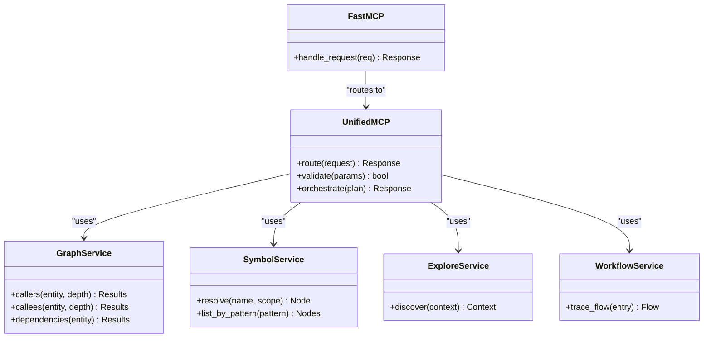
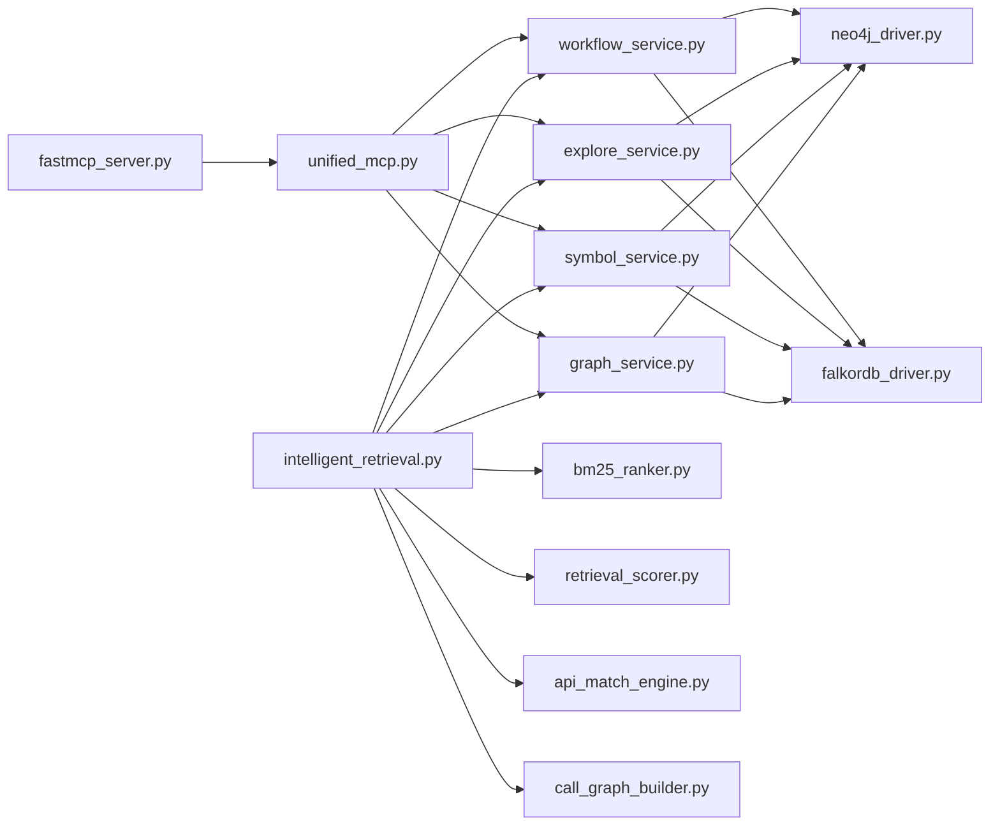

# Natural Language Queries

<cite>
**Referenced Files in This Document**
- [query_intent_classifier.py](file://code-tiny/tools/common/query_intent_classifier.py)
- [intelligent_retrieval.py](file://code-tiny/tools/common/intelligent_retrieval.py)
- [graph_service.py](file://code-tiny/mcp/services/graph_service.py)
- [symbol_service.py](file://code-tiny/mcp/services/symbol_service.py)
- [explore_service.py](file://code-tiny/mcp/services/explore_service.py)
- [workflow_service.py](file://code-tiny/mcp/services/workflow_service.py)
- [unified_mcp.py](file://code-tiny/mcp/unified_mcp.py)
- [fastmcp_server.py](file://code-tiny/mcp/fastmcp_server.py)
- [semantic_graph_expansion.py](file://code-tiny/mcp/semantic_graph_expansion.py)
- [bm25_ranker.py](file://code-tiny/tools/common/bm25_ranker.py)
- [retrieval_scorer.py](file://code-tiny/tools/common/retrieval_scorer.py)
- [api_match_engine.py](file://code-tiny/tools/common/api_match_engine.py)
- [call_graph_builder.py](file://code-tiny/tools/common/call_graph_builder.py)
- [graph_types.py](file://code-tiny/tools/ts/types/graph_types.py)
- [neo4j_driver.py](file://code-tiny/tools/graph/driver/neo4j_driver.py)
- [falkordb_driver.py](file://code-tiny/tools/graph/driver/falkordb_driver.py)
</cite>

## Table of Contents
1. [Introduction](#introduction)
2. [Project Structure](#project-structure)
3. [Core Components](#core-components)
4. [Architecture Overview](#architecture-overview)
5. [Detailed Component Analysis](#detailed-component-analysis)
6. [Dependency Analysis](#dependency-analysis)
7. [Performance Considerations](#performance-considerations)
8. [Troubleshooting Guide](#troubleshooting-guide)
9. [Conclusion](#conclusion)

## Introduction
This document explains how Cortex Harness processes natural language queries to retrieve code and graph data. It covers intent classification, query understanding, entity extraction, semantic search, and the intelligent retrieval pipeline that transforms user questions into optimized graph database operations. It also provides examples for common patterns such as finding callers of a function, listing dependencies of a class, and locating similar code blocks, along with guidance on handling ambiguity and improving accuracy.

## Project Structure
The natural language query system spans several modules:
- Intent classification and query understanding live in shared tools.
- MCP services expose capabilities (graph traversal, symbol lookup, exploration, workflow).
- A unified MCP layer routes requests to providers and orchestrates responses.
- Graph drivers abstract Neo4j or FalkorDB backends.
- Retrieval utilities provide ranking, scoring, and API matching.

**Diagram sources**
- [query_intent_classifier.py:1-200](file://code-tiny/tools/common/query_intent_classifier.py#L1-L200)
- [intelligent_retrieval.py:1-200](file://code-tiny/tools/common/intelligent_retrieval.py#L1-L200)
- [graph_service.py:1-200](file://code-tiny/mcp/services/graph_service.py#L1-L200)
- [symbol_service.py:1-200](file://code-tiny/mcp/services/symbol_service.py#L1-L200)
- [explore_service.py:1-200](file://code-tiny/mcp/services/explore_service.py#L1-L200)
- [workflow_service.py:1-200](file://code-tiny/mcp/services/workflow_service.py#L1-L200)
- [unified_mcp.py:1-200](file://code-tiny/mcp/unified_mcp.py#L1-L200)
- [fastmcp_server.py:1-200](file://code-tiny/mcp/fastmcp_server.py#L1-L200)
- [semantic_graph_expansion.py:1-200](file://code-tiny/mcp/semantic_graph_expansion.py#L1-L200)
- [bm25_ranker.py:1-200](file://code-tiny/tools/common/bm25_ranker.py#L1-L200)
- [retrieval_scorer.py:1-200](file://code-tiny/tools/common/retrieval_scorer.py#L1-L200)
- [api_match_engine.py:1-200](file://code-tiny/tools/common/api_match_engine.py#L1-L200)
- [call_graph_builder.py:1-200](file://code-tiny/tools/common/call_graph_builder.py#L1-L200)
- [neo4j_driver.py:1-200](file://code-tiny/tools/graph/driver/neo4j_driver.py#L1-L200)
- [falkordb_driver.py:1-200](file://code-tiny/tools/graph/driver/falkordb_driver.py#L1-L200)

**Section sources**
- [query_intent_classifier.py:1-200](file://code-tiny/tools/common/query_intent_classifier.py#L1-L200)
- [intelligent_retrieval.py:1-200](file://code-tiny/tools/common/intelligent_retrieval.py#L1-L200)
- [graph_service.py:1-200](file://code-tiny/mcp/services/graph_service.py#L1-L200)
- [symbol_service.py:1-200](file://code-tiny/mcp/services/symbol_service.py#L1-L200)
- [explore_service.py:1-200](file://code-tiny/mcp/services/explore_service.py#L1-L200)
- [workflow_service.py:1-200](file://code-tiny/mcp/services/workflow_service.py#L1-L200)
- [unified_mcp.py:1-200](file://code-tiny/mcp/unified_mcp.py#L1-L200)
- [fastmcp_server.py:1-200](file://code-tiny/mcp/fastmcp_server.py#L1-L200)
- [semantic_graph_expansion.py:1-200](file://code-tiny/mcp/semantic_graph_expansion.py#L1-L200)
- [bm25_ranker.py:1-200](file://code-tiny/tools/common/bm25_ranker.py#L1-L200)
- [retrieval_scorer.py:1-200](file://code-tiny/tools/common/retrieval_scorer.py#L1-L200)
- [api_match_engine.py:1-200](file://code-tiny/tools/common/api_match_engine.py#L1-L200)
- [call_graph_builder.py:1-200](file://code-tiny/tools/common/call_graph_builder.py#L1-L200)
- [neo4j_driver.py:1-200](file://code-tiny/tools/graph/driver/neo4j_driver.py#L1-L200)
- [falkordb_driver.py:1-200](file://code-tiny/tools/graph/driver/falkordb_driver.py#L1-L200)

## Core Components
- Intent classifier: Parses natural language input to determine search intent, query type, and required parameters.
- Intelligent retrieval: Translates classified intents into optimized graph queries using services and drivers.
- MCP services: Provide concrete operations like graph traversal, symbol resolution, exploration, and workflow analysis.
- Ranking and scoring: Combine BM25 text relevance with semantic similarity and structural signals.
- API match engine and call graph builder: Enhance precision by leveraging API catalogs and call relationships.

Key responsibilities:
- Preprocessing and normalization of user queries.
- Entity extraction and disambiguation.
- Semantic understanding via embeddings and vector search.
- Query plan selection and execution path optimization.
- Clarification prompts when inputs are ambiguous.

**Section sources**
- [query_intent_classifier.py:1-200](file://code-tiny/tools/common/query_intent_classifier.py#L1-L200)
- [intelligent_retrieval.py:1-200](file://code-tiny/tools/common/intelligent_retrieval.py#L1-L200)
- [bm25_ranker.py:1-200](file://code-tiny/tools/common/bm25_ranker.py#L1-L200)
- [retrieval_scorer.py:1-200](file://code-tiny/tools/common/retrieval_scorer.py#L1-L200)
- [api_match_engine.py:1-200](file://code-tiny/tools/common/api_match_engine.py#L1-L200)
- [call_graph_builder.py:1-200](file://code-tiny/tools/common/call_graph_builder.py#L1-L200)

## Architecture Overview
The system follows a layered architecture:
- User-facing MCP server exposes endpoints.
- Unified MCP routes requests to specialized services.
- Intelligent retrieval composes service calls and applies ranking/scoring.
- Graph drivers execute queries against Neo4j or FalkorDB.

**Diagram sources**
- [fastmcp_server.py:1-200](file://code-tiny/mcp/fastmcp_server.py#L1-L200)
- [unified_mcp.py:1-200](file://code-tiny/mcp/unified_mcp.py#L1-L200)
- [intelligent_retrieval.py:1-200](file://code-tiny/tools/common/intelligent_retrieval.py#L1-L200)
- [graph_service.py:1-200](file://code-tiny/mcp/services/graph_service.py#L1-L200)
- [symbol_service.py:1-200](file://code-tiny/mcp/services/symbol_service.py#L1-L200)
- [neo4j_driver.py:1-200](file://code-tiny/tools/graph/driver/neo4j_driver.py#L1-L200)
- [falkordb_driver.py:1-200](file://code-tiny/tools/graph/driver/falkordb_driver.py#L1-L200)

## Detailed Component Analysis

### Intent Classifier
Purpose:
- Analyze user queries to determine intent (e.g., find callers, show dependencies, locate similar code), query type (graph traversal vs. semantic search), and required parameters (entity names, scopes, filters).

Capabilities:
- Preprocessing: normalize whitespace, detect language hints, strip noise.
- Pattern matching and rules for common phrasing.
- Entity extraction for symbols, files, packages, and frameworks.
- Ambiguity detection and clarification prompt generation.

Typical outputs:
- Intent label and confidence.
- Extracted entities and constraints.
- Recommended retrieval strategy (graph traversal, semantic search, hybrid).

Common patterns supported:
- “find all functions that call calculateTax” -> caller traversal around a symbol.
- “show me dependencies of UserService” -> dependency edges from a class node.
- “locate similar code blocks” -> semantic similarity over embeddings.

**Section sources**
- [query_intent_classifier.py:1-200](file://code-tiny/tools/common/query_intent_classifier.py#L1-L200)

### Intelligent Retrieval Pipeline
Purpose:
- Transform classified intents into optimized graph database queries and combine multiple signals for high-quality results.

Pipeline stages:
- Plan selection: choose traversal depth, edge types, and filters based on intent.
- Entity resolution: map extracted entities to canonical nodes via symbol service.
- Query construction: generate driver-native queries (Cypher or FalkorDB commands).
- Execution: run queries through graph drivers.
- Ranking and scoring: blend BM25 text relevance, semantic similarity, and structural signals.
- Result packaging: format structured responses for clients.

Optimization strategies:
- Early filtering by scope and framework overlays.
- Limiting traversal depth and pruning low-signal paths.
- Using indexes and precomputed vectors where available.
- Parallelizing independent lookups (symbols, vectors).

**Diagram sources**
- [intelligent_retrieval.py:1-200](file://code-tiny/tools/common/intelligent_retrieval.py#L1-L200)
- [bm25_ranker.py:1-200](file://code-tiny/tools/common/bm25_ranker.py#L1-L200)
- [retrieval_scorer.py:1-200](file://code-tiny/tools/common/retrieval_scorer.py#L1-L200)
- [symbol_service.py:1-200](file://code-tiny/mcp/services/symbol_service.py#L1-L200)
- [neo4j_driver.py:1-200](file://code-tiny/tools/graph/driver/neo4j_driver.py#L1-L200)
- [falkordb_driver.py:1-200](file://code-tiny/tools/graph/driver/falkordb_driver.py#L1-L200)

**Section sources**
- [intelligent_retrieval.py:1-200](file://code-tiny/tools/common/intelligent_retrieval.py#L1-L200)
- [bm25_ranker.py:1-200](file://code-tiny/tools/common/bm25_ranker.py#L1-L200)
- [retrieval_scorer.py:1-200](file://code-tiny/tools/common/retrieval_scorer.py#L1-L200)
- [symbol_service.py:1-200](file://code-tiny/mcp/services/symbol_service.py#L1-L200)
- [neo4j_driver.py:1-200](file://code-tiny/tools/graph/driver/neo4j_driver.py#L1-L200)
- [falkordb_driver.py:1-200](file://code-tiny/tools/graph/driver/falkordb_driver.py#L1-L200)

### MCP Services and Unified Layer
Responsibilities:
- Graph service: executes traversal operations (callers, callees, dependencies).
- Symbol service: resolves identifiers to canonical nodes and metadata.
- Explore service: supports broad discovery and context gathering.
- Workflow service: analyzes workflows and cross-cutting flows.
- Unified MCP: coordinates routing, parameter validation, and orchestration.
- FastMCP server: exposes HTTP/MCP endpoints.

**Diagram sources**
- [unified_mcp.py:1-200](file://code-tiny/mcp/unified_mcp.py#L1-L200)
- [graph_service.py:1-200](file://code-tiny/mcp/services/graph_service.py#L1-L200)
- [symbol_service.py:1-200](file://code-tiny/mcp/services/symbol_service.py#L1-L200)
- [explore_service.py:1-200](file://code-tiny/mcp/services/explore_service.py#L1-L200)
- [workflow_service.py:1-200](file://code-tiny/mcp/services/workflow_service.py#L1-L200)
- [fastmcp_server.py:1-200](file://code-tiny/mcp/fastmcp_server.py#L1-L200)

**Section sources**
- [unified_mcp.py:1-200](file://code-tiny/mcp/unified_mcp.py#L1-L200)
- [graph_service.py:1-200](file://code-tiny/mcp/services/graph_service.py#L1-L200)
- [symbol_service.py:1-200](file://code-tiny/mcp/services/symbol_service.py#L1-L200)
- [explore_service.py:1-200](file://code-tiny/mcp/services/explore_service.py#L1-L200)
- [workflow_service.py:1-200](file://code-tiny/mcp/services/workflow_service.py#L1-L200)
- [fastmcp_server.py:1-200](file://code-tiny/mcp/fastmcp_server.py#L1-L200)

### Semantic Graph Expansion
Purpose:
- Enrich queries with semantically related nodes and edges to improve recall without sacrificing precision.

Mechanisms:
- Expand seed entities using embedding similarity thresholds.
- Apply framework-specific overlays to include relevant edges.
- Merge expanded sets while controlling cardinality.

**Section sources**
- [semantic_graph_expansion.py:1-200](file://code-tiny/mcp/semantic_graph_expansion.py#L1-L200)

### Graph Drivers
Purpose:
- Abstract backend differences between Neo4j and FalkorDB.
- Provide typed methods for traversals and lookups used by services.

Key aspects:
- Connection management and query execution.
- Index usage and result streaming.
- Error mapping and retries.

**Section sources**
- [neo4j_driver.py:1-200](file://code-tiny/tools/graph/driver/neo4j_driver.py#L1-L200)
- [falkordb_driver.py:1-200](file://code-tiny/tools/graph/driver/falkordb_driver.py#L1-L200)

### Supporting Utilities
- BM25 ranker: computes lexical relevance scores for text-heavy results.
- Retrieval scorer: blends BM25, semantic similarity, and structural signals.
- API match engine: aligns user mentions with known APIs and signatures.
- Call graph builder: constructs or augments call relationships for precise traversal.

**Section sources**
- [bm25_ranker.py:1-200](file://code-tiny/tools/common/bm25_ranker.py#L1-L200)
- [retrieval_scorer.py:1-200](file://code-tiny/tools/common/retrieval_scorer.py#L1-L200)
- [api_match_engine.py:1-200](file://code-tiny/tools/common/api_match_engine.py#L1-L200)
- [call_graph_builder.py:1-200](file://code-tiny/tools/common/call_graph_builder.py#L1-L200)

## Dependency Analysis
High-level dependencies:
- Intelligent retrieval depends on services and utilities for planning and scoring.
- Services depend on graph drivers for execution.
- Unified MCP depends on services and orchestrates the flow.
- FastMCP server is the entry point for external clients.

**Diagram sources**
- [intelligent_retrieval.py:1-200](file://code-tiny/tools/common/intelligent_retrieval.py#L1-L200)
- [graph_service.py:1-200](file://code-tiny/mcp/services/graph_service.py#L1-L200)
- [symbol_service.py:1-200](file://code-tiny/mcp/services/symbol_service.py#L1-L200)
- [explore_service.py:1-200](file://code-tiny/mcp/services/explore_service.py#L1-L200)
- [workflow_service.py:1-200](file://code-tiny/mcp/services/workflow_service.py#L1-L200)
- [bm25_ranker.py:1-200](file://code-tiny/tools/common/bm25_ranker.py#L1-L200)
- [retrieval_scorer.py:1-200](file://code-tiny/tools/common/retrieval_scorer.py#L1-L200)
- [api_match_engine.py:1-200](file://code-tiny/tools/common/api_match_engine.py#L1-L200)
- [call_graph_builder.py:1-200](file://code-tiny/tools/common/call_graph_builder.py#L1-L200)
- [neo4j_driver.py:1-200](file://code-tiny/tools/graph/driver/neo4j_driver.py#L1-L200)
- [falkordb_driver.py:1-200](file://code-tiny/tools/graph/driver/falkordb_driver.py#L1-L200)
- [unified_mcp.py:1-200](file://code-tiny/mcp/unified_mcp.py#L1-L200)
- [fastmcp_server.py:1-200](file://code-tiny/mcp/fastmcp_server.py#L1-L200)

**Section sources**
- [intelligent_retrieval.py:1-200](file://code-tiny/tools/common/intelligent_retrieval.py#L1-L200)
- [unified_mcp.py:1-200](file://code-tiny/mcp/unified_mcp.py#L1-L200)
- [fastmcp_server.py:1-200](file://code-tiny/mcp/fastmcp_server.py#L1-L200)

## Performance Considerations
- Prefer targeted traversals with bounded depth to avoid explosion.
- Use indexes and precomputed vectors to reduce latency.
- Parallelize independent lookups (symbols, vectors) where safe.
- Apply early filters (scope, framework overlay) to shrink candidate sets.
- Tune ranking weights to balance precision and recall.
- Stream large result sets and paginate when necessary.

[No sources needed since this section provides general guidance]

## Troubleshooting Guide
Common issues and remedies:
- Low recall for semantic searches:
  - Increase expansion radius or adjust similarity thresholds.
  - Ensure primary vectors are up-to-date.
- Overly broad results:
  - Tighten filters (framework, package, file path).
  - Reduce traversal depth.
- Misresolved entities:
  - Provide fully qualified names or add scope hints.
  - Use symbol resolution explicitly before traversal.
- Slow queries:
  - Verify indexes exist on key properties.
  - Avoid deep multi-hop traversals; break into steps.
- Ambiguous queries:
  - Respond with clarification prompts asking for scope or specific symbols.

Operational checks:
- Confirm graph connectivity and driver health.
- Validate schema and indexes.
- Review logs for failed traversals or timeouts.

**Section sources**
- [intelligent_retrieval.py:1-200](file://code-tiny/tools/common/intelligent_retrieval.py#L1-L200)
- [graph_service.py:1-200](file://code-tiny/mcp/services/graph_service.py#L1-L200)
- [symbol_service.py:1-200](file://code-tiny/mcp/services/symbol_service.py#L1-L200)
- [neo4j_driver.py:1-200](file://code-tiny/tools/graph/driver/neo4j_driver.py#L1-L200)
- [falkordb_driver.py:1-200](file://code-tiny/tools/graph/driver/falkordb_driver.py#L1-L200)

## Conclusion
Cortex Harness integrates intent classification, entity resolution, semantic search, and graph traversal to deliver accurate and efficient natural language query processing. By composing MCP services with robust ranking and scoring, it adapts to diverse query patterns while maintaining performance and reliability. For best results, provide clear entity names and scopes, leverage clarification prompts, and tune retrieval parameters to your project’s scale and complexity.