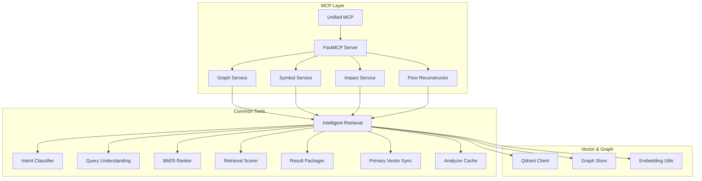
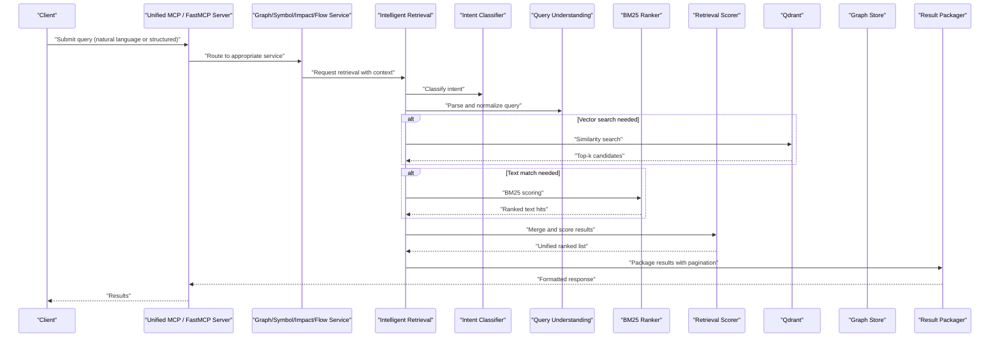
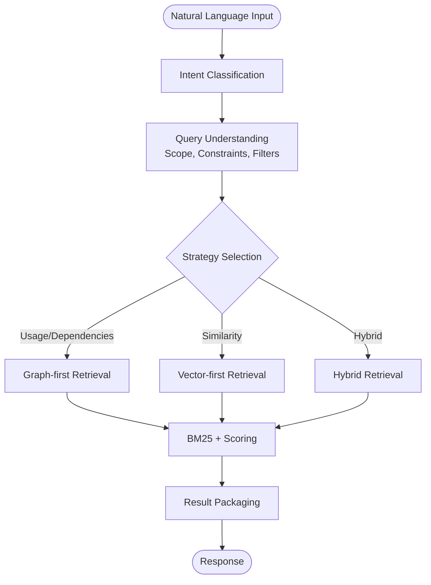
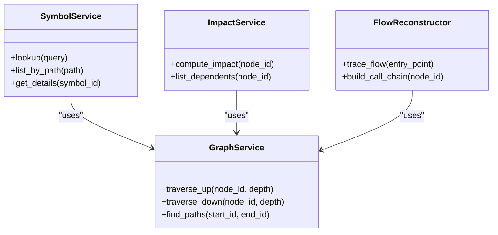
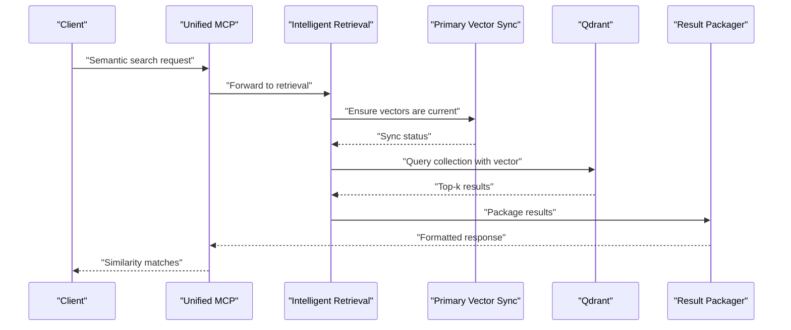
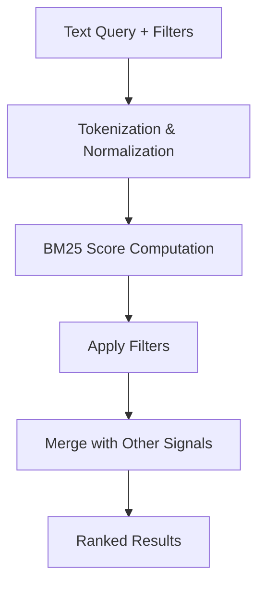
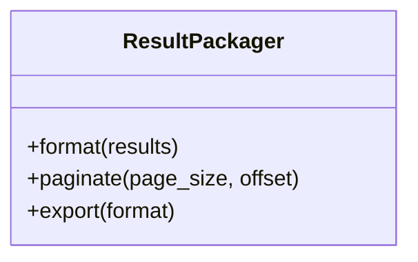
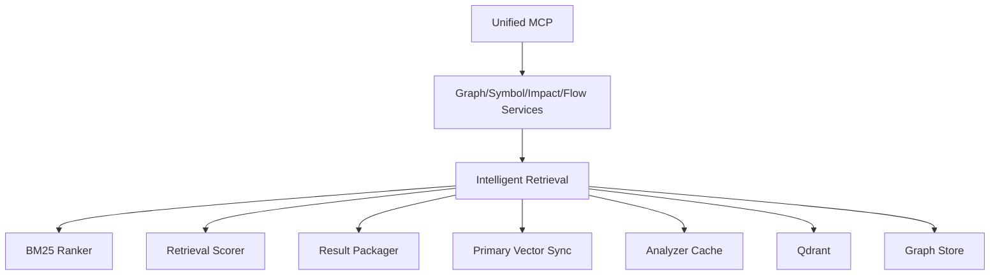

# Query Interface & Search

<cite>
**Referenced Files in This Document**
- [ReadMe.md](file://ReadMe.md)
- [mcp.md](file://docs/specs/mcp.md)
- [intelligent_retrieval.py](file://code-tiny/tools/common/intelligent_retrieval.py)
- [query_intent_classifier.py](file://code-tiny/tools/common/query_intent_classifier.py)
- [query_understanding.py](file://code-tiny/tools/common/query_understanding.py)
- [bm25_ranker.py](file://code-tiny/tools/common/bm25_ranker.py)
- [retrieval_scorer.py](file://code-tiny/tools/common/retrieval_scorer.py)
- [result_packager.py](file://code-tiny/tools/common/result_packager.py)
- [graph_service.py](file://code-tiny/mcp/services/graph_service.py)
- [symbol_service.py](file://code-tiny/mcp/services/symbol_service.py)
- [impact_service.py](file://code-tiny/mcp/services/impact_service.py)
- [flow_reconstructor.py](file://code-tiny/mcp/services/flow_reconstructor.py)
- [unified_mcp.py](file://code-tiny/mcp/unified_mcp.py)
- [fastmcp_server.py](file://code-tiny/mcp/fastmcp_server.py)
- [test_framework_mcp_search.py](file://tests/test_framework_mcp_search.py)
- [test_cobol_qdrant_contract.py](file://tests/test_cobol_qdrant_contract.py)
- [qdrant.py](file://code-tiny/tools/cobol/qdrant.py)
- [primary_vector_sync.py](file://code-tiny/tools/common/primary_vector_sync.py)
- [analyzer_cache.py](file://code-tiny/tools/common/analyzer_cache.py)
- [graph_store.py](file://doc-tiny/graph_store.py)
- [embedding_utils.py](file://doc-tiny/embedding_utils.py)
</cite>

## Table of Contents
1. [Introduction](#introduction)
2. [Project Structure](#project-structure)
3. [Core Components](#core-components)
4. [Architecture Overview](#architecture-overview)
5. [Detailed Component Analysis](#detailed-component-analysis)
6. [Dependency Analysis](#dependency-analysis)
7. [Performance Considerations](#performance-considerations)
8. [Troubleshooting Guide](#troubleshooting-guide)
9. [Conclusion](#conclusion)
10. [Appendices](#appendices)

## Introduction
This document describes the query interface and search capabilities of Cortex Harness, focusing on:
- Natural language query processing via intent classification, semantic understanding, and query optimization
- Structured query support for precise code element searches, dependency queries, and relationship traversals
- Vector-based semantic search using Qdrant for similarity matching and code pattern recognition
- BM25 ranking algorithms for relevance scoring and result filtering options
- Common query patterns with examples (e.g., find all usages of a function, identify similar code blocks, trace execution flows)
- Result formatting, pagination, and export options
- Performance optimization techniques, caching strategies, and query monitoring
- Troubleshooting guides for performance issues and accuracy problems

The system integrates graph-based analysis, vector retrieval, and text ranking to deliver accurate and fast results across multiple languages and frameworks.

## Project Structure
Cortex Harness organizes query-related functionality across shared tools, MCP services, and tests:
- Shared tools implement core retrieval logic, ranking, packaging, and intent classification
- MCP services expose structured APIs for symbol lookup, graph traversal, impact analysis, and flow reconstruction
- Tests validate MCP search behavior and Qdrant contracts
- Supporting utilities provide embedding generation, graph store access, and primary vector synchronization

**Diagram sources**
- [unified_mcp.py](file://code-tiny/mcp/unified_mcp.py)
- [fastmcp_server.py](file://code-tiny/mcp/fastmcp_server.py)
- [graph_service.py](file://code-tiny/mcp/services/graph_service.py)
- [symbol_service.py](file://code-tiny/mcp/services/symbol_service.py)
- [impact_service.py](file://code-tiny/mcp/services/impact_service.py)
- [flow_reconstructor.py](file://code-tiny/mcp/services/flow_reconstructor.py)
- [intelligent_retrieval.py](file://code-tiny/tools/common/intelligent_retrieval.py)
- [query_intent_classifier.py](file://code-tiny/tools/common/query_intent_classifier.py)
- [query_understanding.py](file://code-tiny/tools/common/query_understanding.py)
- [bm25_ranker.py](file://code-tiny/tools/common/bm25_ranker.py)
- [retrieval_scorer.py](file://code-tiny/tools/common/retrieval_scorer.py)
- [result_packager.py](file://code-tiny/tools/common/result_packager.py)
- [primary_vector_sync.py](file://code-tiny/tools/common/primary_vector_sync.py)
- [analyzer_cache.py](file://code-tiny/tools/common/analyzer_cache.py)
- [qdrant.py](file://code-tiny/tools/cobol/qdrant.py)
- [graph_store.py](file://doc-tiny/graph_store.py)
- [embedding_utils.py](file://doc-tiny/embedding_utils.py)

**Section sources**
- [ReadMe.md](file://ReadMe.md)
- [mcp.md](file://docs/specs/mcp.md)

## Core Components
- Intelligent Retrieval Orchestrator: Coordinates multi-modal retrieval by combining graph queries, vector similarity, and BM25 ranking; applies filters and scoring; packages results.
- Intent Classifier: Determines user intent from natural language (e.g., usage search, similarity, flow tracing) to select appropriate retrieval strategy.
- Query Understanding: Parses and normalizes queries into structured parameters (scopes, constraints, filters).
- BM25 Ranker: Computes term-frequency based relevance scores for text matches and supports filtering.
- Retrieval Scorer: Merges signals from graph proximity, vector similarity, and BM25 into a unified score.
- Result Packager: Formats results with pagination metadata and export-friendly structures.
- Primary Vector Sync: Ensures vector embeddings are up-to-date for efficient semantic search.
- Analyzer Cache: Caches analyzer outputs to reduce redundant work and improve latency.
- MCP Services: Provide structured APIs for symbol lookups, graph traversals, impact analysis, and flow reconstruction.

**Section sources**
- [intelligent_retrieval.py](file://code-tiny/tools/common/intelligent_retrieval.py)
- [query_intent_classifier.py](file://code-tiny/tools/common/query_intent_classifier.py)
- [query_understanding.py](file://code-tiny/tools/common/query_understanding.py)
- [bm25_ranker.py](file://code-tiny/tools/common/bm25_ranker.py)
- [retrieval_scorer.py](file://code-tiny/tools/common/retrieval_scorer.py)
- [result_packager.py](file://code-tiny/tools/common/result_packager.py)
- [primary_vector_sync.py](file://code-tiny/tools/common/primary_vector_sync.py)
- [analyzer_cache.py](file://code-tiny/tools/common/analyzer_cache.py)
- [graph_service.py](file://code-tiny/mcp/services/graph_service.py)
- [symbol_service.py](file://code-tiny/mcp/services/symbol_service.py)
- [impact_service.py](file://code-tiny/mcp/services/impact_service.py)
- [flow_reconstructor.py](file://code-tiny/mcp/services/flow_reconstructor.py)

## Architecture Overview
The query pipeline transforms natural language or structured inputs into optimized retrieval operations across graph and vector stores, then ranks and formats results.

**Diagram sources**
- [unified_mcp.py](file://code-tiny/mcp/unified_mcp.py)
- [fastmcp_server.py](file://code-tiny/mcp/fastmcp_server.py)
- [graph_service.py](file://code-tiny/mcp/services/graph_service.py)
- [symbol_service.py](file://code-tiny/mcp/services/symbol_service.py)
- [impact_service.py](file://code-tiny/mcp/services/impact_service.py)
- [flow_reconstructor.py](file://code-tiny/mcp/services/flow_reconstructor.py)
- [intelligent_retrieval.py](file://code-tiny/tools/common/intelligent_retrieval.py)
- [query_intent_classifier.py](file://code-tiny/tools/common/query_intent_classifier.py)
- [query_understanding.py](file://code-tiny/tools/common/query_understanding.py)
- [bm25_ranker.py](file://code-tiny/tools/common/bm25_ranker.py)
- [retrieval_scorer.py](file://code-tiny/tools/common/retrieval_scorer.py)
- [result_packager.py](file://code-tiny/tools/common/result_packager.py)
- [qdrant.py](file://code-tiny/tools/cobol/qdrant.py)

## Detailed Component Analysis

### Natural Language Query Processing
- Intent Classification: Determines whether the query targets usage search, similarity, flow tracing, or other intents.
- Query Understanding: Extracts scopes, constraints, and filters; normalizes terms and resolves identifiers where possible.
- Optimization: Chooses between graph-first, vector-first, or hybrid strategies based on intent and available indexes.

**Diagram sources**
- [query_intent_classifier.py](file://code-tiny/tools/common/query_intent_classifier.py)
- [query_understanding.py](file://code-tiny/tools/common/query_understanding.py)
- [intelligent_retrieval.py](file://code-tiny/tools/common/intelligent_retrieval.py)
- [bm25_ranker.py](file://code-tiny/tools/common/bm25_ranker.py)
- [retrieval_scorer.py](file://code-tiny/tools/common/retrieval_scorer.py)
- [result_packager.py](file://code-tiny/tools/common/result_packager.py)

**Section sources**
- [query_intent_classifier.py](file://code-tiny/tools/common/query_intent_classifier.py)
- [query_understanding.py](file://code-tiny/tools/common/query_understanding.py)
- [intelligent_retrieval.py](file://code-tiny/tools/common/intelligent_retrieval.py)

### Structured Query Support
Structured queries enable precise searches over code elements, dependencies, and relationships:
- Symbol Lookup: Find symbols by name, type, scope, and file path constraints.
- Dependency Queries: Traverse call graphs, imports, and framework-specific edges.
- Relationship Traversals: Explore upstream/downstream relationships, impacts, and flows.

**Diagram sources**
- [symbol_service.py](file://code-tiny/mcp/services/symbol_service.py)
- [graph_service.py](file://code-tiny/mcp/services/graph_service.py)
- [impact_service.py](file://code-tiny/mcp/services/impact_service.py)
- [flow_reconstructor.py](file://code-tiny/mcp/services/flow_reconstructor.py)

**Section sources**
- [symbol_service.py](file://code-tiny/mcp/services/symbol_service.py)
- [graph_service.py](file://code-tiny/mcp/services/graph_service.py)
- [impact_service.py](file://code-tiny/mcp/services/impact_service.py)
- [flow_reconstructor.py](file://code-tiny/mcp/services/flow_reconstructor.py)

### Vector-Based Semantic Search with Qdrant
Semantic search leverages Qdrant for similarity matching:
- Embeddings: Generated via embedding utilities and synchronized through primary vector sync.
- Collections: Organized by scope or project; validated by tests.
- Similarity Matching: Returns top-k candidates based on vector distance.

**Diagram sources**
- [unified_mcp.py](file://code-tiny/mcp/unified_mcp.py)
- [intelligent_retrieval.py](file://code-tiny/tools/common/intelligent_retrieval.py)
- [primary_vector_sync.py](file://code-tiny/tools/common/primary_vector_sync.py)
- [qdrant.py](file://code-tiny/tools/cobol/qdrant.py)
- [embedding_utils.py](file://doc-tiny/embedding_utils.py)
- [result_packager.py](file://code-tiny/tools/common/result_packager.py)

**Section sources**
- [qdrant.py](file://code-tiny/tools/cobol/qdrant.py)
- [primary_vector_sync.py](file://code-tiny/tools/common/primary_vector_sync.py)
- [embedding_utils.py](file://doc-tiny/embedding_utils.py)
- [test_cobol_qdrant_contract.py](file://tests/test_cobol_qdrant_contract.py)

### BM25 Ranking and Filtering
BM25 provides text-based relevance scoring:
- Term Frequency Weighting: Scores documents based on term frequency and inverse document frequency.
- Filtering Options: Supports scope, file path, and content-type filters.
- Integration: Combined with vector and graph signals in the unified scorer.

**Diagram sources**
- [bm25_ranker.py](file://code-tiny/tools/common/bm25_ranker.py)
- [retrieval_scorer.py](file://code-tiny/tools/common/retrieval_scorer.py)

**Section sources**
- [bm25_ranker.py](file://code-tiny/tools/common/bm25_ranker.py)
- [retrieval_scorer.py](file://code-tiny/tools/common/retrieval_scorer.py)

### Result Formatting, Pagination, and Export
- Formatting: Standardized response schema with metadata, highlights, and provenance.
- Pagination: Supports page size and offset for large result sets.
- Export: Provides export-friendly structures for downstream consumption.

**Diagram sources**
- [result_packager.py](file://code-tiny/tools/common/result_packager.py)

**Section sources**
- [result_packager.py](file://code-tiny/tools/common/result_packager.py)

### Common Query Patterns
- Find All Usages of a Function:
  - Use symbol service to locate the function, then traverse downstream edges to collect callers.
  - Combine with BM25 to rank by contextual relevance if needed.
- Identify Similar Code Blocks:
  - Generate an embedding for the target snippet and query Qdrant for nearest neighbors.
  - Apply filters for language, file scope, and size constraints.
- Trace Execution Flows:
  - Use flow reconstructor to build call chains from entry points or specific nodes.
  - Integrate impact analysis to highlight critical paths.

[No sources needed since this section summarizes common patterns without analyzing specific files]

## Dependency Analysis
The query interface depends on MCP services, shared retrieval tools, and external stores (Qdrant, graph store).

**Diagram sources**
- [unified_mcp.py](file://code-tiny/mcp/unified_mcp.py)
- [graph_service.py](file://code-tiny/mcp/services/graph_service.py)
- [symbol_service.py](file://code-tiny/mcp/services/symbol_service.py)
- [impact_service.py](file://code-tiny/mcp/services/impact_service.py)
- [flow_reconstructor.py](file://code-tiny/mcp/services/flow_reconstructor.py)
- [intelligent_retrieval.py](file://code-tiny/tools/common/intelligent_retrieval.py)
- [bm25_ranker.py](file://code-tiny/tools/common/bm25_ranker.py)
- [retrieval_scorer.py](file://code-tiny/tools/common/retrieval_scorer.py)
- [result_packager.py](file://code-tiny/tools/common/result_packager.py)
- [primary_vector_sync.py](file://code-tiny/tools/common/primary_vector_sync.py)
- [analyzer_cache.py](file://code-tiny/tools/common/analyzer_cache.py)
- [qdrant.py](file://code-tiny/tools/cobol/qdrant.py)
- [graph_store.py](file://doc-tiny/graph_store.py)

**Section sources**
- [test_framework_mcp_search.py](file://tests/test_framework_mcp_search.py)

## Performance Considerations
- Caching Strategies:
  - Analyzer cache reduces repeated parsing and analysis overhead.
  - Primary vector sync ensures embeddings are fresh while avoiding unnecessary recomputation.
- Indexing and Vector Management:
  - Maintain dedicated Qdrant collections per scope/project for faster lookups.
  - Regularly rebuild or incrementally update vectors after code changes.
- Query Optimization:
  - Prefer graph-first for exact structural queries; use vector-first for semantic similarity.
  - Apply filters early to reduce candidate set size before ranking.
- Monitoring:
  - Track latency and throughput at MCP layer and retrieval stage.
  - Log intent classification outcomes and strategy selection for diagnostics.

[No sources needed since this section provides general guidance]

## Troubleshooting Guide
- Query Performance Issues:
  - Verify vector sync status and collection sizes; consider increasing batch sizes or enabling incremental updates.
  - Check analyzer cache hit rates; clear stale entries if necessary.
  - Narrow scopes and add filters to reduce candidate sets.
- Result Accuracy Problems:
  - Review intent classification results; adjust query phrasing or constraints.
  - Tune BM25 parameters and filter thresholds; ensure tokenization aligns with code structure.
  - Validate graph edges and symbol resolution; re-run analysis if code changed significantly.
- MCP Integration:
  - Confirm service routing and payload schemas; consult acceptance tests for expected behaviors.

**Section sources**
- [test_framework_mcp_search.py](file://tests/test_framework_mcp_search.py)
- [test_cobol_qdrant_contract.py](file://tests/test_cobol_qdrant_contract.py)

## Conclusion
Cortex Harness delivers a robust, multi-modal query interface that combines graph traversal, vector similarity, and BM25 ranking to answer both precise and semantic code queries. By leveraging intent classification, structured services, and efficient indexing, it provides scalable and accurate search experiences. Proper caching, vector maintenance, and monitoring further enhance performance and reliability.

[No sources needed since this section summarizes without analyzing specific files]

## Appendices
- API References:
  - MCP specification and capability matrix for supported operations.
- Example Requests:
  - See test fixtures and acceptance tests for sample payloads and responses.

**Section sources**
- [mcp.md](file://docs/specs/mcp.md)
- [test_framework_mcp_search.py](file://tests/test_framework_mcp_search.py)