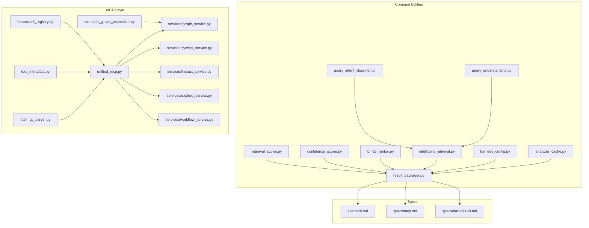
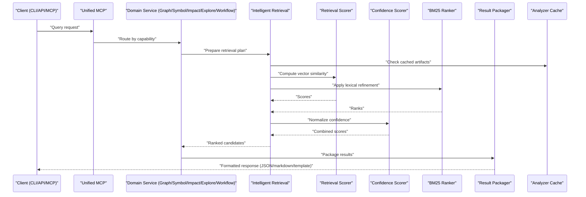
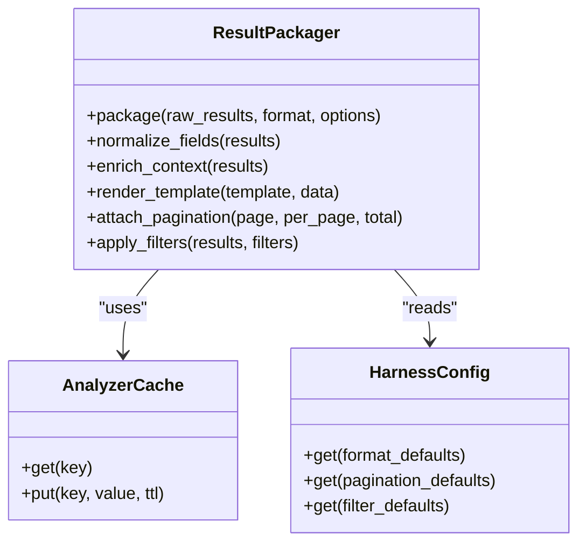
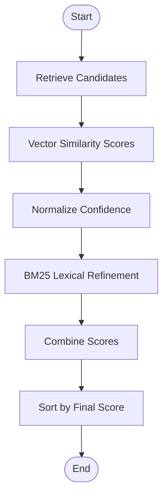
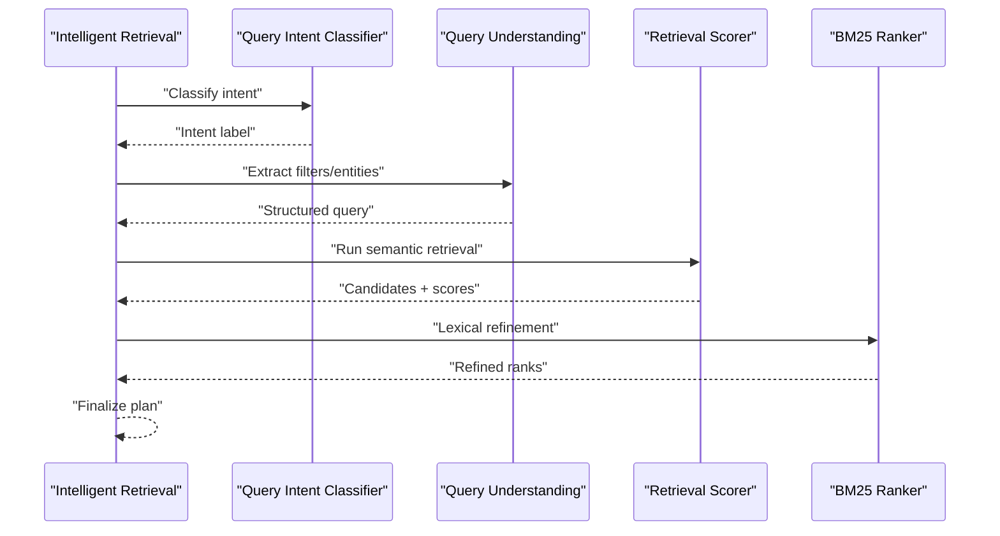
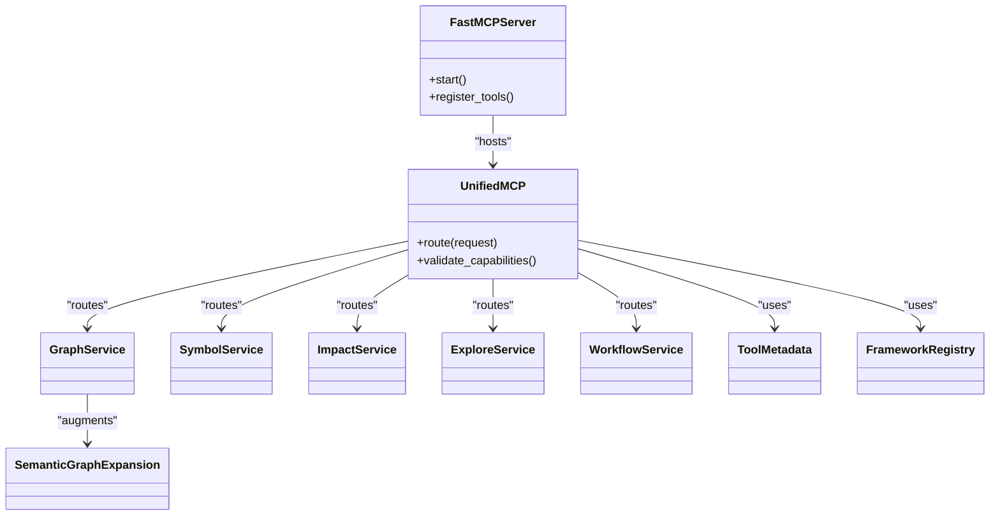
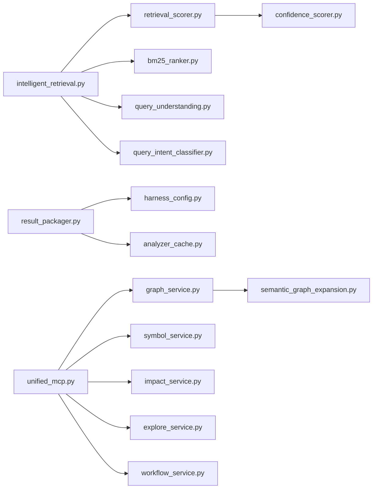

# Query Results & Formatting

<cite>
**Referenced Files in This Document**
- [result_packager.py](file://code-tiny/tools/common/result_packager.py)
- [retrieval_scorer.py](file://code-tiny/tools/common/retrieval_scorer.py)
- [confidence_scorer.py](file://code-tiny/tools/common/confidence_scorer.py)
- [bm25_ranker.py](file://code-tiny/tools/common/bm25_ranker.py)
- [intelligent_retrieval.py](file://code-tiny/tools/common/intelligent_retrieval.py)
- [query_intent_classifier.py](file://code-tiny/tools/common/query_intent_classifier.py)
- [query_understanding.py](file://code-tiny/tools/common/query_understanding.py)
- [unified_mcp.py](file://code-tiny/mcp/unified_mcp.py)
- [fastmcp_server.py](file://code-tiny/mcp/fastmcp_server.py)
- [graph_service.py](file://code-tiny/mcp/services/graph_service.py)
- [symbol_service.py](file://code-tiny/mcp/services/symbol_service.py)
- [impact_service.py](file://code-tiny/mcp/services/impact_service.py)
- [explore_service.py](file://code-tiny/mcp/services/explore_service.py)
- [workflow_service.py](file://code-tiny/mcp/services/workflow_service.py)
- [tool_metadata.py](file://code-tiny/mcp/tool_metadata.py)
- [framework_registry.py](file://code-tiny/mcp/framework_registry.py)
- [semantic_graph_expansion.py](file://code-tiny/mcp/semantic_graph_expansion.py)
- [harness_config.py](file://code-tiny/tools/common/harness_config.py)
- [analyzer_cache.py](file://code-tiny/tools/common/analyzer_cache.py)
- [cli.md](file://docs/specs/cli.md)
- [mcp.md](file://docs/specs/mcp.md)
- [harness-cli.md](file://docs/specs/harness-cli.md)
</cite>

## Table of Contents
1. [Introduction](#introduction)
2. [Project Structure](#project-structure)
3. [Core Components](#core-components)
4. [Architecture Overview](#architecture-overview)
5. [Detailed Component Analysis](#detailed-component-analysis)
6. [Dependency Analysis](#dependency-analysis)
7. [Performance Considerations](#performance-considerations)
8. [Troubleshooting Guide](#troubleshooting-guide)
9. [Conclusion](#conclusion)
10. [Appendices](#appendices)

## Introduction
This document explains how Cortex Harness processes, formats, and presents query results for multiple consumers (CLI, API, MCP). It covers result packaging, scoring and ranking, output formatting options, pagination and filtering, export capabilities, caching strategies, performance optimizations, customization guidelines, and troubleshooting techniques. The goal is to provide a clear mental model and practical guidance for integrating with external tools and tailoring result presentation.

## Project Structure
The query result pipeline spans shared analysis utilities, MCP services, and specification documents:
- Shared utilities under code-tiny/tools/common implement retrieval, scoring, ranking, and result packaging.
- MCP integration lives under code-tiny/mcp, including unified entry points, service implementations, and tool metadata.
- Specifications under docs/specs define CLI and MCP contracts that shape result presentation.

**Diagram sources**
- [result_packager.py](file://code-tiny/tools/common/result_packager.py)
- [retrieval_scorer.py](file://code-tiny/tools/common/retrieval_scorer.py)
- [confidence_scorer.py](file://code-tiny/tools/common/confidence_scorer.py)
- [bm25_ranker.py](file://code-tiny/tools/common/bm25_ranker.py)
- [intelligent_retrieval.py](file://code-tiny/tools/common/intelligent_retrieval.py)
- [query_intent_classifier.py](file://code-tiny/tools/common/query_intent_classifier.py)
- [query_understanding.py](file://code-tiny/tools/common/query_understanding.py)
- [harness_config.py](file://code-tiny/tools/common/harness_config.py)
- [analyzer_cache.py](file://code-tiny/tools/common/analyzer_cache.py)
- [unified_mcp.py](file://code-tiny/mcp/unified_mcp.py)
- [fastmcp_server.py](file://code-tiny/mcp/fastmcp_server.py)
- [graph_service.py](file://code-tiny/mcp/services/graph_service.py)
- [symbol_service.py](file://code-tiny/mcp/services/symbol_service.py)
- [impact_service.py](file://code-tiny/mcp/services/impact_service.py)
- [explore_service.py](file://code-tiny/mcp/services/explore_service.py)
- [workflow_service.py](file://code-tiny/mcp/services/workflow_service.py)
- [tool_metadata.py](file://code-tiny/mcp/tool_metadata.py)
- [framework_registry.py](file://code-tiny/mcp/framework_registry.py)
- [semantic_graph_expansion.py](file://code-tiny/mcp/semantic_graph_expansion.py)
- [cli.md](file://docs/specs/cli.md)
- [mcp.md](file://docs/specs/mcp.md)
- [harness-cli.md](file://docs/specs/harness-cli.md)

**Section sources**
- [result_packager.py](file://code-tiny/tools/common/result_packager.py)
- [retrieval_scorer.py](file://code-tiny/tools/common/retrieval_scorer.py)
- [confidence_scorer.py](file://code-tiny/tools/common/confidence_scorer.py)
- [bm25_ranker.py](file://code-tiny/tools/common/bm25_ranker.py)
- [intelligent_retrieval.py](file://code-tiny/tools/common/intelligent_retrieval.py)
- [query_intent_classifier.py](file://code-tiny/tools/common/query_intent_classifier.py)
- [query_understanding.py](file://code-tiny/tools/common/query_understanding.py)
- [unified_mcp.py](file://code-tiny/mcp/unified_mcp.py)
- [fastmcp_server.py](file://code-tiny/mcp/fastmcp_server.py)
- [graph_service.py](file://code-tiny/mcp/services/graph_service.py)
- [symbol_service.py](file://code-tiny/mcp/services/symbol_service.py)
- [impact_service.py](file://code-tiny/mcp/services/impact_service.py)
- [explore_service.py](file://code-tiny/mcp/services/explore_service.py)
- [workflow_service.py](file://code-tiny/mcp/services/workflow_service.py)
- [tool_metadata.py](file://code-tiny/mcp/tool_metadata.py)
- [framework_registry.py](file://code-tiny/mcp/framework_registry.py)
- [semantic_graph_expansion.py](file://code-tiny/mcp/semantic_graph_expansion.py)
- [cli.md](file://docs/specs/cli.md)
- [mcp.md](file://docs/specs/mcp.md)
- [harness-cli.md](file://docs/specs/harness-cli.md)

## Core Components
- Result Packaging: Transforms raw matches into structured responses tailored for CLI, API, or MCP consumers. Handles field normalization, enrichment, and serialization.
- Retrieval Scoring: Computes relevance scores from vector similarity and other signals.
- Confidence Scoring: Normalizes and combines confidence across heterogeneous sources.
- BM25 Ranking: Applies lexical matching to refine rankings when appropriate.
- Intelligent Retrieval: Orchestrates retrieval strategies based on query intent and understanding.
- Query Intent Classifier: Classifies queries to select optimal retrieval and ranking paths.
- Query Understanding: Extracts entities, filters, and constraints to improve precision.
- MCP Services: Provide domain-specific query endpoints (graph, symbol, impact, explore, workflow) that consume the common utilities and return standardized results.
- Configuration and Caching: Harness configuration and analyzer cache influence retrieval behavior and performance.

**Section sources**
- [result_packager.py](file://code-tiny/tools/common/result_packager.py)
- [retrieval_scorer.py](file://code-tiny/tools/common/retrieval_scorer.py)
- [confidence_scorer.py](file://code-tiny/tools/common/confidence_scorer.py)
- [bm25_ranker.py](file://code-tiny/tools/common/bm25_ranker.py)
- [intelligent_retrieval.py](file://code-tiny/tools/common/intelligent_retrieval.py)
- [query_intent_classifier.py](file://code-tiny/tools/common/query_intent_classifier.py)
- [query_understanding.py](file://code-tiny/tools/common/query_understanding.py)
- [unified_mcp.py](file://code-tiny/mcp/unified_mcp.py)
- [fastmcp_server.py](file://code-tiny/mcp/fastmcp_server.py)
- [graph_service.py](file://code-tiny/mcp/services/graph_service.py)
- [symbol_service.py](file://code-tiny/mcp/services/symbol_service.py)
- [impact_service.py](file://code-tiny/mcp/services/impact_service.py)
- [explore_service.py](file://code-tiny/mcp/services/explore_service.py)
- [workflow_service.py](file://code-tiny/mcp/services/workflow_service.py)
- [harness_config.py](file://code-tiny/tools/common/harness_config.py)
- [analyzer_cache.py](file://code-tiny/tools/common/analyzer_cache.py)

## Architecture Overview
The system follows a layered architecture:
- Ingestion and Indexing: Analyzers populate graph/vector stores.
- Query Path: Client requests enter via CLI or MCP; MCP routes to specialized services.
- Retrieval and Ranking: Intelligent retrieval orchestrates vector and lexical search; scoring and ranking produce ordered candidates.
- Packaging and Presentation: Results are packaged into consumer-specific formats (JSON, markdown, templates).
- Caching and Performance: Analyzer cache and configuration optimize repeated queries.

**Diagram sources**
- [unified_mcp.py](file://code-tiny/mcp/unified_mcp.py)
- [graph_service.py](file://code-tiny/mcp/services/graph_service.py)
- [symbol_service.py](file://code-tiny/mcp/services/symbol_service.py)
- [impact_service.py](file://code-tiny/mcp/services/impact_service.py)
- [explore_service.py](file://code-tiny/mcp/services/explore_service.py)
- [workflow_service.py](file://code-tiny/mcp/services/workflow_service.py)
- [intelligent_retrieval.py](file://code-tiny/tools/common/intelligent_retrieval.py)
- [retrieval_scorer.py](file://code-tiny/tools/common/retrieval_scorer.py)
- [confidence_scorer.py](file://code-tiny/tools/common/confidence_scorer.py)
- [bm25_ranker.py](file://code-tiny/tools/common/bm25_ranker.py)
- [result_packager.py](file://code-tiny/tools/common/result_packager.py)
- [analyzer_cache.py](file://code-tiny/tools/common/analyzer_cache.py)

## Detailed Component Analysis

### Result Packaging
Responsibilities:
- Normalize fields across sources (e.g., ids, labels, snippets).
- Enrich results with context (e.g., file paths, symbols, relationships).
- Serialize to target formats (JSON, markdown, custom templates).
- Attach metadata (pagination, filters applied, total counts).

Key behaviors:
- Consumer-aware formatting for CLI, API, and MCP outputs.
- Template-based rendering for consistent presentation.
- Export hooks for downstream consumption.

**Diagram sources**
- [result_packager.py](file://code-tiny/tools/common/result_packager.py)
- [analyzer_cache.py](file://code-tiny/tools/common/analyzer_cache.py)
- [harness_config.py](file://code-tiny/tools/common/harness_config.py)

**Section sources**
- [result_packager.py](file://code-tiny/tools/common/result_packager.py)
- [analyzer_cache.py](file://code-tiny/tools/common/analyzer_cache.py)
- [harness_config.py](file://code-tiny/tools/common/harness_config.py)

### Retrieval Scoring and Ranking
Scoring:
- Vector similarity scores capture semantic relevance.
- Confidence scoring normalizes heterogeneous signals into a unified scale.

Ranking:
- BM25 refines ordering using lexical overlap for keyword-heavy queries.
- Combined ranking blends semantic and lexical signals.

**Diagram sources**
- [retrieval_scorer.py](file://code-tiny/tools/common/retrieval_scorer.py)
- [confidence_scorer.py](file://code-tiny/tools/common/confidence_scorer.py)
- [bm25_ranker.py](file://code-tiny/tools/common/bm25_ranker.py)

**Section sources**
- [retrieval_scorer.py](file://code-tiny/tools/common/retrieval_scorer.py)
- [confidence_scorer.py](file://code-tiny/tools/common/confidence_scorer.py)
- [bm25_ranker.py](file://code-tiny/tools/common/bm25_ranker.py)

### Intelligent Retrieval Orchestration
Orchestrates retrieval strategy selection based on query intent and understanding:
- Intent classification selects retrieval modes (semantic, lexical, hybrid).
- Query understanding extracts filters, scopes, and constraints.
- Coordinates scoring and ranking components.

**Diagram sources**
- [intelligent_retrieval.py](file://code-tiny/tools/common/intelligent_retrieval.py)
- [query_intent_classifier.py](file://code-tiny/tools/common/query_intent_classifier.py)
- [query_understanding.py](file://code-tiny/tools/common/query_understanding.py)
- [retrieval_scorer.py](file://code-tiny/tools/common/retrieval_scorer.py)
- [bm25_ranker.py](file://code-tiny/tools/common/bm25_ranker.py)

**Section sources**
- [intelligent_retrieval.py](file://code-tiny/tools/common/intelligent_retrieval.py)
- [query_intent_classifier.py](file://code-tiny/tools/common/query_intent_classifier.py)
- [query_understanding.py](file://code-tiny/tools/common/query_understanding.py)
- [retrieval_scorer.py](file://code-tiny/tools/common/retrieval_scorer.py)
- [bm25_ranker.py](file://code-tiny/tools/common/bm25_ranker.py)

### MCP Integration and Services
Unified MCP entry point routes requests to domain services:
- Graph service: traverses and returns graph-based results.
- Symbol service: resolves and returns symbol-centric results.
- Impact service: computes and returns impact-related results.
- Explore service: provides exploratory navigation results.
- Workflow service: returns workflow-oriented results.

Tool metadata and framework registry support capability discovery and routing. Semantic graph expansion augments results with contextual relationships.

**Diagram sources**
- [unified_mcp.py](file://code-tiny/mcp/unified_mcp.py)
- [fastmcp_server.py](file://code-tiny/mcp/fastmcp_server.py)
- [graph_service.py](file://code-tiny/mcp/services/graph_service.py)
- [symbol_service.py](file://code-tiny/mcp/services/symbol_service.py)
- [impact_service.py](file://code-tiny/mcp/services/impact_service.py)
- [explore_service.py](file://code-tiny/mcp/services/explore_service.py)
- [workflow_service.py](file://code-tiny/mcp/services/workflow_service.py)
- [tool_metadata.py](file://code-tiny/mcp/tool_metadata.py)
- [framework_registry.py](file://code-tiny/mcp/framework_registry.py)
- [semantic_graph_expansion.py](file://code-tiny/mcp/semantic_graph_expansion.py)

**Section sources**
- [unified_mcp.py](file://code-tiny/mcp/unified_mcp.py)
- [fastmcp_server.py](file://code-tiny/mcp/fastmcp_server.py)
- [graph_service.py](file://code-tiny/mcp/services/graph_service.py)
- [symbol_service.py](file://code-tiny/mcp/services/symbol_service.py)
- [impact_service.py](file://code-tiny/mcp/services/impact_service.py)
- [explore_service.py](file://code-tiny/mcp/services/explore_service.py)
- [workflow_service.py](file://code-tiny/mcp/services/workflow_service.py)
- [tool_metadata.py](file://code-tiny/mcp/tool_metadata.py)
- [framework_registry.py](file://code-tiny/mcp/framework_registry.py)
- [semantic_graph_expansion.py](file://code-tiny/mcp/semantic_graph_expansion.py)

### Output Formats and Templates
Supported formats:
- JSON: machine-readable payloads for APIs and automation.
- Markdown: human-friendly summaries for CLI and documentation.
- Custom templates: render results according to project-specific layouts.

Formatting controls:
- Format selection via configuration or request parameters.
- Template variables include normalized fields, scores, and metadata.
- Pagination and filter metadata included for UIs and downstream tools.

**Section sources**
- [result_packager.py](file://code-tiny/tools/common/result_packager.py)
- [harness_config.py](file://code-tiny/tools/common/harness_config.py)
- [cli.md](file://docs/specs/cli.md)
- [mcp.md](file://docs/specs/mcp.md)
- [harness-cli.md](file://docs/specs/harness-cli.md)

### Pagination, Filtering, and Export
Pagination:
- Page number and page size parameters control result windows.
- Total count and next/previous links provided where applicable.

Filtering:
- Filters derived from query understanding (scopes, types, tags).
- Explicit filter parameters override defaults.

Export:
- Export hooks allow exporting results to files or external systems.
- Export formats align with packaging formats (JSON, markdown).

**Section sources**
- [result_packager.py](file://code-tiny/tools/common/result_packager.py)
- [query_understanding.py](file://code-tiny/tools/common/query_understanding.py)
- [harness_config.py](file://code-tiny/tools/common/harness_config.py)

### Caching Strategies and Performance Optimization
Caching:
- Analyzer cache stores intermediate artifacts to avoid recomputation.
- TTL-based expiration balances freshness and performance.

Optimization techniques:
- Hybrid retrieval reduces expensive operations by leveraging fast lexical pre-filtering.
- Confidence normalization prevents score skew across sources.
- BM25 refinement improves precision without full re-ranking overhead.
- Configuration-driven defaults tune performance vs. accuracy trade-offs.

**Section sources**
- [analyzer_cache.py](file://code-tiny/tools/common/analyzer_cache.py)
- [intelligent_retrieval.py](file://code-tiny/tools/common/intelligent_retrieval.py)
- [retrieval_scorer.py](file://code-tiny/tools/common/retrieval_scorer.py)
- [confidence_scorer.py](file://code-tiny/tools/common/confidence_scorer.py)
- [bm25_ranker.py](file://code-tiny/tools/common/bm25_ranker.py)
- [harness_config.py](file://code-tiny/tools/common/harness_config.py)

## Dependency Analysis
The following diagram highlights key dependencies among result processing components and MCP services.

**Diagram sources**
- [intelligent_retrieval.py](file://code-tiny/tools/common/intelligent_retrieval.py)
- [retrieval_scorer.py](file://code-tiny/tools/common/retrieval_scorer.py)
- [bm25_ranker.py](file://code-tiny/tools/common/bm25_ranker.py)
- [query_understanding.py](file://code-tiny/tools/common/query_understanding.py)
- [query_intent_classifier.py](file://code-tiny/tools/common/query_intent_classifier.py)
- [confidence_scorer.py](file://code-tiny/tools/common/confidence_scorer.py)
- [result_packager.py](file://code-tiny/tools/common/result_packager.py)
- [harness_config.py](file://code-tiny/tools/common/harness_config.py)
- [analyzer_cache.py](file://code-tiny/tools/common/analyzer_cache.py)
- [unified_mcp.py](file://code-tiny/mcp/unified_mcp.py)
- [graph_service.py](file://code-tiny/mcp/services/graph_service.py)
- [symbol_service.py](file://code-tiny/mcp/services/symbol_service.py)
- [impact_service.py](file://code-tiny/mcp/services/impact_service.py)
- [explore_service.py](file://code-tiny/mcp/services/explore_service.py)
- [workflow_service.py](file://code-tiny/mcp/services/workflow_service.py)
- [semantic_graph_expansion.py](file://code-tiny/mcp/semantic_graph_expansion.py)

**Section sources**
- [intelligent_retrieval.py](file://code-tiny/tools/common/intelligent_retrieval.py)
- [retrieval_scorer.py](file://code-tiny/tools/common/retrieval_scorer.py)
- [bm25_ranker.py](file://code-tiny/tools/common/bm25_ranker.py)
- [query_understanding.py](file://code-tiny/tools/common/query_understanding.py)
- [query_intent_classifier.py](file://code-tiny/tools/common/query_intent_classifier.py)
- [confidence_scorer.py](file://code-tiny/tools/common/confidence_scorer.py)
- [result_packager.py](file://code-tiny/tools/common/result_packager.py)
- [harness_config.py](file://code-tiny/tools/common/harness_config.py)
- [analyzer_cache.py](file://code-tiny/tools/common/analyzer_cache.py)
- [unified_mcp.py](file://code-tiny/mcp/unified_mcp.py)
- [graph_service.py](file://code-tiny/mcp/services/graph_service.py)
- [symbol_service.py](file://code-tiny/mcp/services/symbol_service.py)
- [impact_service.py](file://code-tiny/mcp/services/impact_service.py)
- [explore_service.py](file://code-tiny/mcp/services/explore_service.py)
- [workflow_service.py](file://code-tiny/mcp/services/workflow_service.py)
- [semantic_graph_expansion.py](file://code-tiny/mcp/semantic_graph_expansion.py)

## Performance Considerations
- Prefer hybrid retrieval to reduce reliance on expensive semantic-only searches.
- Use analyzer cache to avoid redundant computation across similar queries.
- Tune confidence normalization weights to stabilize rankings across diverse sources.
- Apply BM25 refinement selectively for keyword-dominant queries.
- Configure pagination sizes to balance latency and usability.
- Monitor template rendering costs for large result sets; consider streaming or chunked rendering.

[No sources needed since this section provides general guidance]

## Troubleshooting Guide
Common issues and resolutions:
- Accuracy problems:
  - Verify query understanding extracted correct filters and entities.
  - Check intent classification selected the appropriate retrieval mode.
  - Inspect confidence normalization to ensure balanced weighting.
- Performance bottlenecks:
  - Confirm analyzer cache hits for repeated queries.
  - Reduce page sizes or enable pre-filtering to limit payload size.
  - Profile BM25 refinement usage; disable if not beneficial for specific queries.
- Formatting errors:
  - Validate template variables match normalized fields.
  - Ensure pagination metadata is attached consistently.
  - Review configuration defaults for format-specific settings.

**Section sources**
- [query_understanding.py](file://code-tiny/tools/common/query_understanding.py)
- [query_intent_classifier.py](file://code-tiny/tools/common/query_intent_classifier.py)
- [confidence_scorer.py](file://code-tiny/tools/common/confidence_scorer.py)
- [analyzer_cache.py](file://code-tiny/tools/common/analyzer_cache.py)
- [bm25_ranker.py](file://code-tiny/tools/common/bm25_ranker.py)
- [result_packager.py](file://code-tiny/tools/common/result_packager.py)
- [harness_config.py](file://code-tiny/tools/common/harness_config.py)

## Conclusion
Cortex Harness provides a robust, extensible pipeline for transforming raw query results into structured, consumer-ready outputs. By combining semantic and lexical signals, normalizing confidence, and offering flexible packaging and formatting, it supports CLI, API, and MCP integrations. With caching, configurable defaults, and clear extension points, teams can tailor result presentation and integrate with external tools while maintaining performance and accuracy.

[No sources needed since this section summarizes without analyzing specific files]

## Appendices

### Example Output Formats
- JSON: Structured payloads suitable for programmatic consumption.
- Markdown: Human-readable summaries for CLI and documentation.
- Custom templates: Project-specific layouts driven by template variables.

[No sources needed since this section provides general guidance]

### Integration Guidelines
- Use MCP services for domain-specific queries and rely on unified routing.
- Leverage tool metadata and framework registry for capability discovery.
- Integrate with external tools by consuming packaged results and applying client-side filters or exports.

**Section sources**
- [unified_mcp.py](file://code-tiny/mcp/unified_mcp.py)
- [tool_metadata.py](file://code-tiny/mcp/tool_metadata.py)
- [framework_registry.py](file://code-tiny/mcp/framework_registry.py)