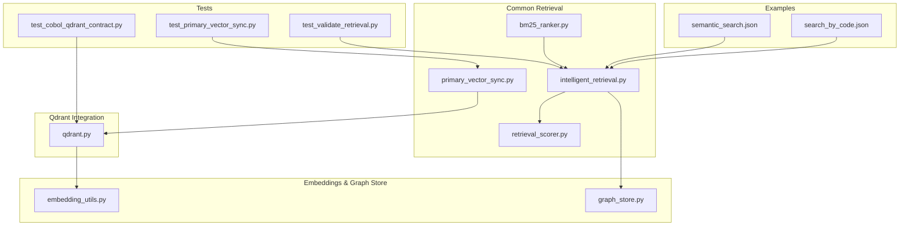
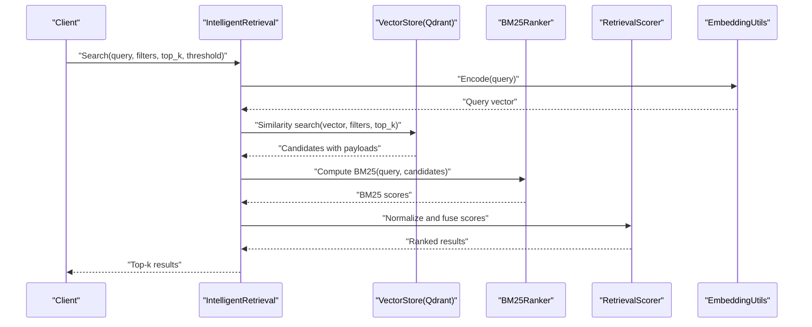
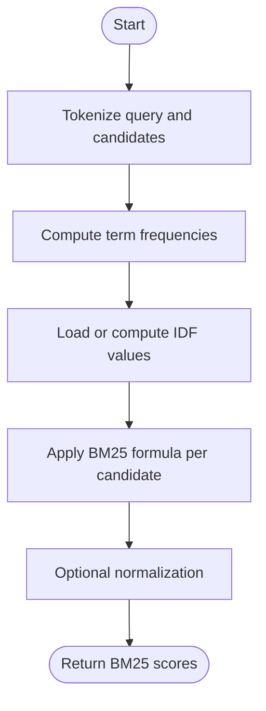
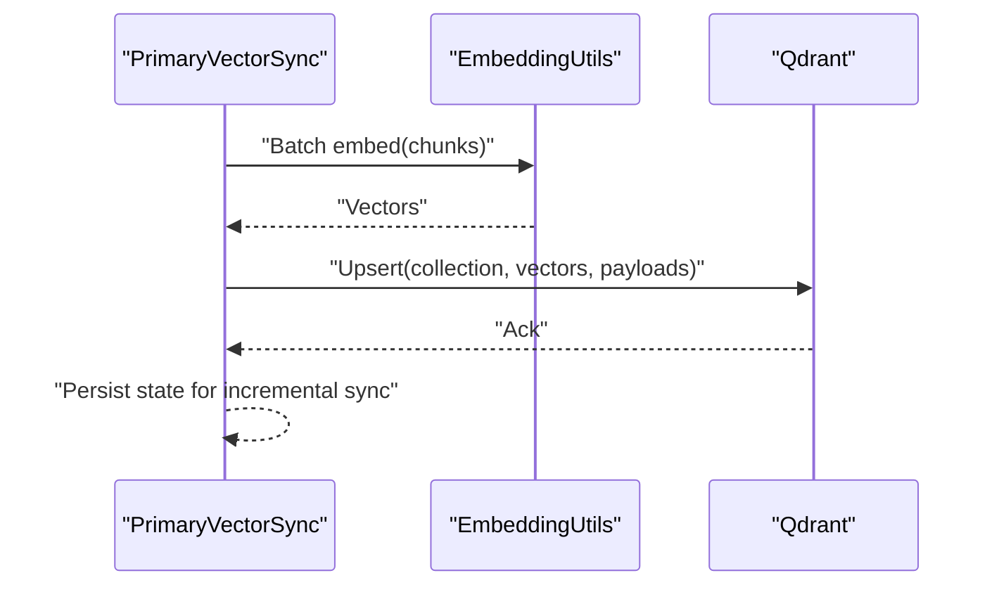
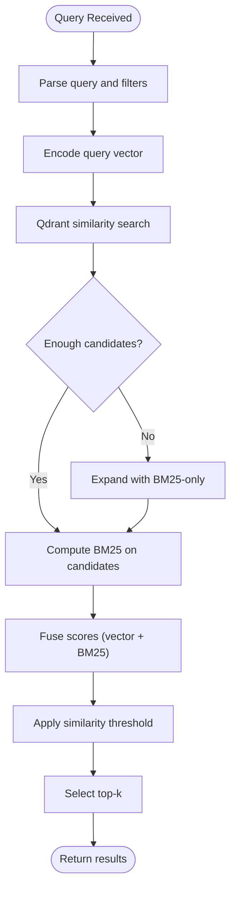
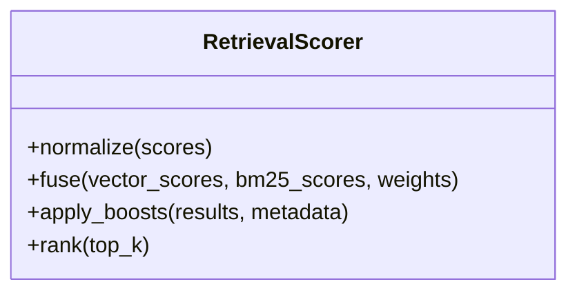
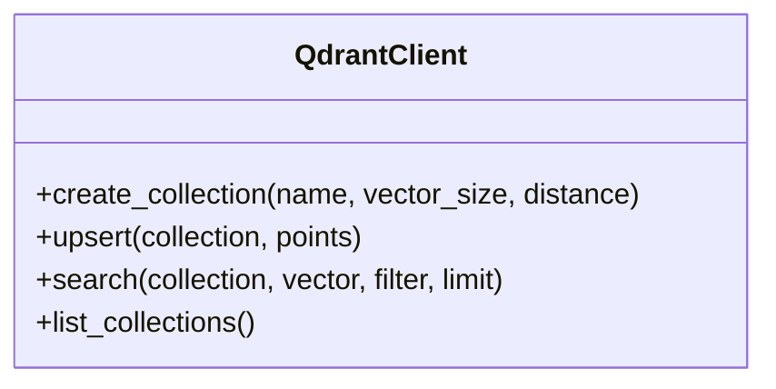
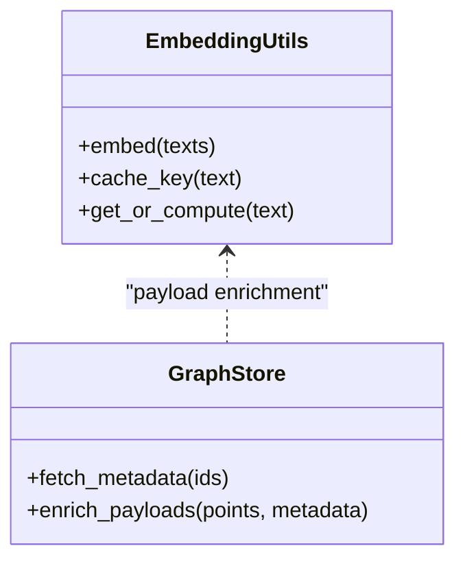
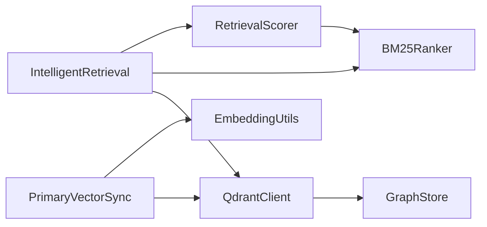

# Semantic Vector Search

<cite>
**Referenced Files in This Document**
- [bm25_ranker.py](file://code-tiny/tools/common/bm25_ranker.py)
- [primary_vector_sync.py](file://code-tiny/tools/common/primary_vector_sync.py)
- [intelligent_retrieval.py](file://code-tiny/tools/common/intelligent_retrieval.py)
- [retrieval_scorer.py](file://code-tiny/tools/common/retrieval_scorer.py)
- [qdrant.py](file://code-tiny/tools/cobol/qdrant.py)
- [test_cobol_qdrant_contract.py](file://tests/test_cobol_qdrant_contract.py)
- [test_primary_vector_sync.py](file://tests/test_primary_vector_sync.py)
- [test_validate_retrieval.py](file://tests/test_validate_retrieval.py)
- [embedding_utils.py](file://doc-tiny/embedding_utils.py)
- [graph_store.py](file://doc-tiny/graph_store.py)
- [semantic_search.json](file://code-tiny/testtool/input_exam/semantic_search.json)
- [search_by_code.json](file://code-tiny/testtool/input_exam/search_by_code.json)
</cite>

## Table of Contents
1. [Introduction](#introduction)
2. [Project Structure](#project-structure)
3. [Core Components](#core-components)
4. [Architecture Overview](#architecture-overview)
5. [Detailed Component Analysis](#detailed-component-analysis)
6. [Dependency Analysis](#dependency-analysis)
7. [Performance Considerations](#performance-considerations)
8. [Troubleshooting Guide](#troubleshooting-guide)
9. [Conclusion](#conclusion)
10. [Appendices](#appendices)

## Introduction
This document explains Cortex Harness vector-based semantic search powered by Qdrant. It covers how code embeddings are generated and stored for similarity matching, the BM25 ranking algorithm implementation for relevance scoring, and result optimization strategies. It also documents hybrid search combining semantic and keyword matching, vector similarity thresholds, filtering options, performance tuning parameters, indexing strategies, cache management, and troubleshooting guidance for improving accuracy and handling large codebases.

## Project Structure
The semantic search capability spans shared tools, language-specific integrations (e.g., Cobol), tests, and example payloads:
- Shared retrieval and ranking components under code-tiny/tools/common
- Qdrant integration for a specific analyzer under code-tiny/tools/cobol
- Tests validating contracts and behavior under tests
- Example payloads demonstrating search inputs under code-tiny/testtool/input_exam
- Embedding utilities and graph store helpers under doc-tiny

**Diagram sources**
- [bm25_ranker.py](file://code-tiny/tools/common/bm25_ranker.py)
- [primary_vector_sync.py](file://code-tiny/tools/common/primary_vector_sync.py)
- [intelligent_retrieval.py](file://code-tiny/tools/common/intelligent_retrieval.py)
- [retrieval_scorer.py](file://code-tiny/tools/common/retrieval_scorer.py)
- [qdrant.py](file://code-tiny/tools/cobol/qdrant.py)
- [embedding_utils.py](file://doc-tiny/embedding_utils.py)
- [graph_store.py](file://doc-tiny/graph_store.py)
- [test_cobol_qdrant_contract.py](file://tests/test_cobol_qdrant_contract.py)
- [test_primary_vector_sync.py](file://tests/test_primary_vector_sync.py)
- [test_validate_retrieval.py](file://tests/test_validate_retrieval.py)
- [semantic_search.json](file://code-tiny/testtool/input_exam/semantic_search.json)
- [search_by_code.json](file://code-tiny/testtool/input_exam/search_by_code.json)

**Section sources**
- [bm25_ranker.py](file://code-tiny/tools/common/bm25_ranker.py)
- [primary_vector_sync.py](file://code-tiny/tools/common/primary_vector_sync.py)
- [intelligent_retrieval.py](file://code-tiny/tools/common/intelligent_retrieval.py)
- [retrieval_scorer.py](file://code-tiny/tools/common/retrieval_scorer.py)
- [qdrant.py](file://code-tiny/tools/cobol/qdrant.py)
- [embedding_utils.py](file://doc-tiny/embedding_utils.py)
- [graph_store.py](file://doc-tiny/graph_store.py)
- [test_cobol_qdrant_contract.py](file://tests/test_cobol_qdrant_contract.py)
- [test_primary_vector_sync.py](file://tests/test_primary_vector_sync.py)
- [test_validate_retrieval.py](file://tests/test_validate_retrieval.py)
- [semantic_search.json](file://code-tiny/testtool/input_exam/semantic_search.json)
- [search_by_code.json](file://code-tiny/testtool/input_exam/search_by_code.json)

## Core Components
- BM25 Ranker: Implements term-frequency based relevance scoring to rank text snippets or metadata against query terms. Used to complement vector similarity with lexical precision.
- Primary Vector Sync: Orchestrates embedding generation and ingestion into Qdrant collections, managing upserts and collection scoping.
- Intelligent Retrieval: Coordinates hybrid search workflows, combining semantic vectors from Qdrant with BM25 scores and applying filters and thresholds.
- Retrieval Scorer: Normalizes and merges multiple signals (vector similarity, BM25, metadata boosts) into final ranked results.
- Qdrant Integration: Provides client operations for creating/updating collections, inserting vectors with payloads, and performing similarity searches with filters.
- Embedding Utilities: Encapsulates model selection, normalization, batching, and caching of embeddings for code chunks.
- Graph Store Helpers: Bridges between graph metadata and vector payloads, enabling rich filtering and context enrichment.

Key responsibilities and interactions:
- Embedding pipeline produces vectors for code segments and stores them alongside structured payloads (file paths, symbols, scopes).
- Query-time retrieval uses vector similarity as a broad recall mechanism and BM25 for precise lexical matches; scores are fused for final ranking.
- Filters include file path patterns, symbol types, language tags, and custom metadata fields.
- Thresholding controls minimum similarity to include results, reducing noise.

**Section sources**
- [bm25_ranker.py](file://code-tiny/tools/common/bm25_ranker.py)
- [primary_vector_sync.py](file://code-tiny/tools/common/primary_vector_sync.py)
- [intelligent_retrieval.py](file://code-tiny/tools/common/intelligent_retrieval.py)
- [retrieval_scorer.py](file://code-tiny/tools/common/retrieval_scorer.py)
- [qdrant.py](file://code-tiny/tools/cobol/qdrant.py)
- [embedding_utils.py](file://doc-tiny/embedding_utils.py)
- [graph_store.py](file://doc-tiny/graph_store.py)

## Architecture Overview
The system follows a hybrid retrieval architecture:
- Ingestion: Code is chunked, embedded, and upserted into Qdrant with payloads containing identifiers and metadata.
- Query: Queries are transformed into vectors and executed via Qdrant similarity search; BM25 is computed over candidate texts; scores are normalized and merged; filters and thresholds are applied; top-k results are returned.

**Diagram sources**
- [intelligent_retrieval.py](file://code-tiny/tools/common/intelligent_retrieval.py)
- [qdrant.py](file://code-tiny/tools/cobol/qdrant.py)
- [bm25_ranker.py](file://code-tiny/tools/common/bm25_ranker.py)
- [retrieval_scorer.py](file://code-tiny/tools/common/retrieval_scorer.py)
- [embedding_utils.py](file://doc-tiny/embedding_utils.py)

## Detailed Component Analysis

### BM25 Ranking Algorithm
- Purpose: Lexical relevance scoring using term frequency and inverse document frequency to complement vector similarity.
- Inputs: Query tokens, candidate texts/metadata, optional field weights.
- Outputs: Per-candidate BM25 score used in fusion.
- Optimization: Tokenization and IDF caching across queries; precomputed statistics per collection.

**Diagram sources**
- [bm25_ranker.py](file://code-tiny/tools/common/bm25_ranker.py)

**Section sources**
- [bm25_ranker.py](file://code-tiny/tools/common/bm25_ranker.py)

### Primary Vector Sync (Embedding Generation and Storage)
- Responsibilities:
  - Chunking source files into semantically coherent units.
  - Generating embeddings via configured models.
  - Upserting vectors into Qdrant with payloads (file path, symbol info, scope, language).
  - Managing collection lifecycle and indexes.
- Performance considerations:
  - Batched embedding calls.
  - Idempotent upserts keyed by stable IDs.
  - Incremental sync to minimize re-ingestion.

**Diagram sources**
- [primary_vector_sync.py](file://code-tiny/tools/common/primary_vector_sync.py)
- [qdrant.py](file://code-tiny/tools/cobol/qdrant.py)
- [embedding_utils.py](file://doc-tiny/embedding_utils.py)

**Section sources**
- [primary_vector_sync.py](file://code-tiny/tools/common/primary_vector_sync.py)
- [qdrant.py](file://code-tiny/tools/cobol/qdrant.py)
- [embedding_utils.py](file://doc-tiny/embedding_utils.py)

### Intelligent Retrieval (Hybrid Search Orchestration)
- Workflow:
  - Parse query and filters.
  - Encode query into vector.
  - Execute vector similarity search on Qdrant with filters.
  - Compute BM25 scores for retrieved candidates.
  - Fuse scores using RetrievalScorer.
  - Apply thresholding and return top-k.
- Filtering options:
  - File path patterns, symbol types, language tags, project scopes.
- Thresholds:
  - Minimum similarity cutoff to reduce false positives.

**Diagram sources**
- [intelligent_retrieval.py](file://code-tiny/tools/common/intelligent_retrieval.py)
- [bm25_ranker.py](file://code-tiny/tools/common/bm25_ranker.py)
- [retrieval_scorer.py](file://code-tiny/tools/common/retrieval_scorer.py)

**Section sources**
- [intelligent_retrieval.py](file://code-tiny/tools/common/intelligent_retrieval.py)
- [bm25_ranker.py](file://code-tiny/tools/common/bm25_ranker.py)
- [retrieval_scorer.py](file://code-tiny/tools/common/retrieval_scorer.py)

### Retrieval Scorer (Score Fusion and Normalization)
- Functions:
  - Normalize vector similarity and BM25 scores to common scale.
  - Weighted fusion configurable per use case.
  - Optional boosting for metadata fields (e.g., recent edits, high-importance symbols).
- Output: Final ranked list with composite scores.

**Diagram sources**
- [retrieval_scorer.py](file://code-tiny/tools/common/retrieval_scorer.py)

**Section sources**
- [retrieval_scorer.py](file://code-tiny/tools/common/retrieval_scorer.py)

### Qdrant Integration
- Capabilities:
  - Collection creation and configuration (vectors size, distance metric).
  - Upserting vectors with payloads.
  - Similarity search with filters and limit.
  - Listing collections for discovery and maintenance.
- Contracts validated by tests.

**Diagram sources**
- [qdrant.py](file://code-tiny/tools/cobol/qdrant.py)
- [test_cobol_qdrant_contract.py](file://tests/test_cobol_qdrant_contract.py)

**Section sources**
- [qdrant.py](file://code-tiny/tools/cobol/qdrant.py)
- [test_cobol_qdrant_contract.py](file://tests/test_cobol_qdrant_contract.py)

### Embedding Utilities and Graph Store
- Embedding Utils:
  - Model selection and parameterization.
  - Batching and caching to avoid redundant computations.
  - Normalization of vectors for consistent similarity.
- Graph Store:
  - Bridges graph metadata to vector payloads.
  - Enables filtering by graph-derived attributes.

**Diagram sources**
- [embedding_utils.py](file://doc-tiny/embedding_utils.py)
- [graph_store.py](file://doc-tiny/graph_store.py)

**Section sources**
- [embedding_utils.py](file://doc-tiny/embedding_utils.py)
- [graph_store.py](file://doc-tiny/graph_store.py)

## Dependency Analysis
- Cohesion:
  - BM25 and RetrievalScorer focus purely on scoring and fusion.
  - PrimaryVectorSync encapsulates ingestion and persistence.
  - IntelligentRetrieval orchestrates cross-component workflow.
- Coupling:
  - IntelligentRetrieval depends on QdrantClient, BM25Ranker, and RetrievalScorer.
  - PrimaryVectorSync depends on EmbeddingUtils and QdrantClient.
- External Dependencies:
  - Qdrant for vector storage and similarity search.
  - Embedding models for vector generation.

**Diagram sources**
- [intelligent_retrieval.py](file://code-tiny/tools/common/intelligent_retrieval.py)
- [bm25_ranker.py](file://code-tiny/tools/common/bm25_ranker.py)
- [retrieval_scorer.py](file://code-tiny/tools/common/retrieval_scorer.py)
- [primary_vector_sync.py](file://code-tiny/tools/common/primary_vector_sync.py)
- [qdrant.py](file://code-tiny/tools/cobol/qdrant.py)
- [embedding_utils.py](file://doc-tiny/embedding_utils.py)
- [graph_store.py](file://doc-tiny/graph_store.py)

**Section sources**
- [intelligent_retrieval.py](file://code-tiny/tools/common/intelligent_retrieval.py)
- [bm25_ranker.py](file://code-tiny/tools/common/bm25_ranker.py)
- [retrieval_scorer.py](file://code-tiny/tools/common/retrieval_scorer.py)
- [primary_vector_sync.py](file://code-tiny/tools/common/primary_vector_sync.py)
- [qdrant.py](file://code-tiny/tools/cobol/qdrant.py)
- [embedding_utils.py](file://doc-tiny/embedding_utils.py)
- [graph_store.py](file://doc-tiny/graph_store.py)

## Performance Considerations
- Indexing Strategies:
  - Choose appropriate vector dimensionality and distance metric during collection creation.
  - Use payload indexes for frequent filters (e.g., language, file path prefixes).
- Cache Management:
  - Enable embedding cache to avoid recomputation for unchanged chunks.
  - Cache BM25 IDF statistics per collection to reduce overhead.
- Batch Operations:
  - Batch embedding requests and Qdrant upserts to minimize network round-trips.
- Hybrid Tuning:
  - Adjust fusion weights to balance semantic recall vs lexical precision.
  - Tune similarity thresholds to control result density.
- Incremental Sync:
  - Track change timestamps and content hashes to update only affected chunks.

[No sources needed since this section provides general guidance]

## Troubleshooting Guide
- Low Recall:
  - Increase top_k and relax similarity threshold.
  - Expand candidate set by disabling strict filters temporarily.
- Poor Precision:
  - Raise similarity threshold and increase BM25 weight in fusion.
  - Refine tokenization and add stopword removal if applicable.
- Slow Queries:
  - Ensure payload indexes exist for filtered fields.
  - Reduce top_k and apply stricter filters.
- Stale Results:
  - Re-run primary vector sync for changed files.
  - Validate collection integrity and point counts.
- Accuracy Validation:
  - Use provided test scripts to validate retrieval quality and contracts.

**Section sources**
- [test_validate_retrieval.py](file://tests/test_validate_retrieval.py)
- [test_primary_vector_sync.py](file://tests/test_primary_vector_sync.py)
- [test_cobol_qdrant_contract.py](file://tests/test_cobol_qdrant_contract.py)

## Conclusion
Cortex Harness implements a robust hybrid semantic search system leveraging Qdrant for vector similarity and BM25 for lexical relevance. The modular design separates ingestion, orchestration, scoring, and storage concerns, enabling fine-grained tuning of thresholds, filters, and fusion weights. With proper indexing, caching, and incremental sync strategies, the system scales effectively to large codebases while maintaining high accuracy and responsiveness.

[No sources needed since this section summarizes without analyzing specific files]

## Appendices

### Semantic Search Use Cases
- Find similar code implementations:
  - Provide a code snippet or description; rely on vector similarity to locate analogous functions or modules.
- Locate code with similar functionality:
  - Describe intent or behavior; hybrid search returns candidates with both semantic and keyword matches.
- Identify code patterns across files:
  - Use filters to target languages or directories; combine BM25 for pattern keywords with vector similarity for structural resemblance.

Example payloads:
- [semantic_search.json](file://code-tiny/testtool/input_exam/semantic_search.json)
- [search_by_code.json](file://code-tiny/testtool/input_exam/search_by_code.json)

**Section sources**
- [semantic_search.json](file://code-tiny/testtool/input_exam/semantic_search.json)
- [search_by_code.json](file://code-tiny/testtool/input_exam/search_by_code.json)