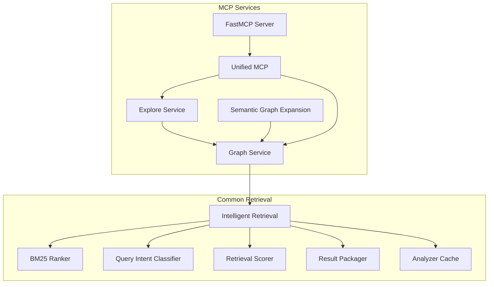
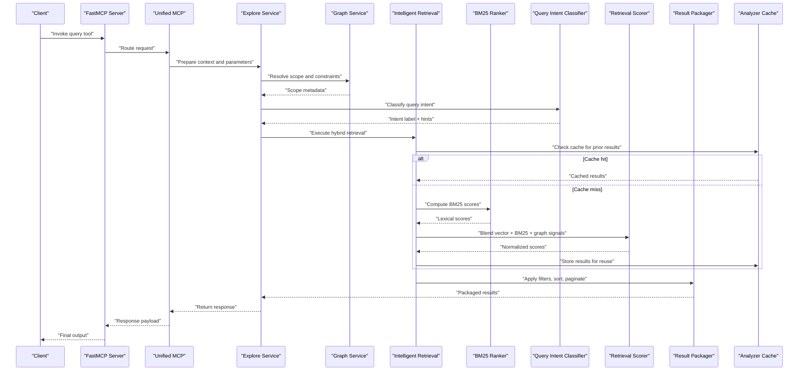
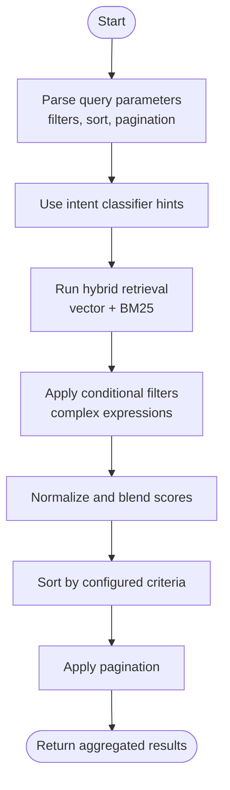
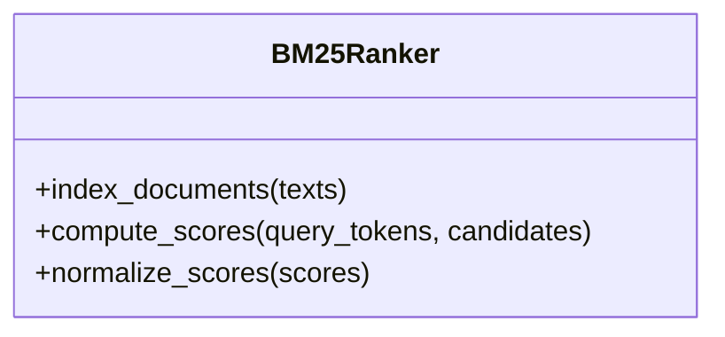
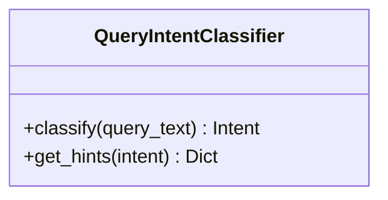
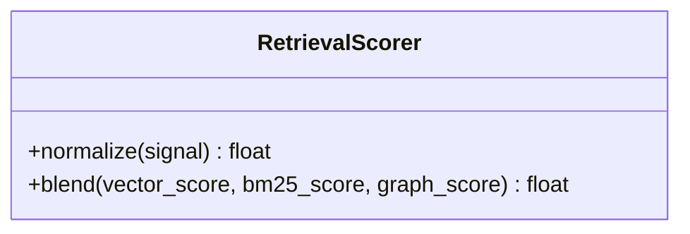
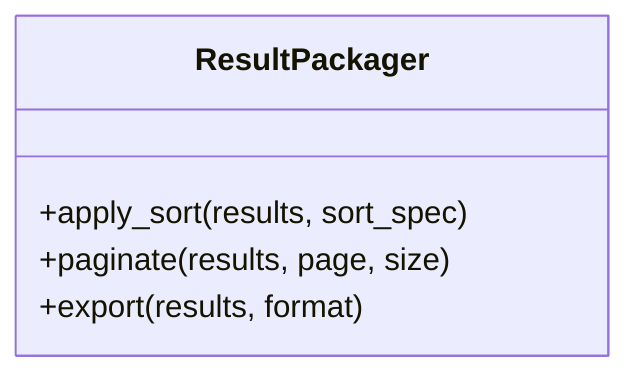
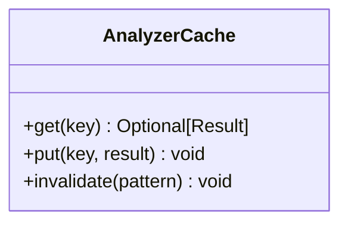
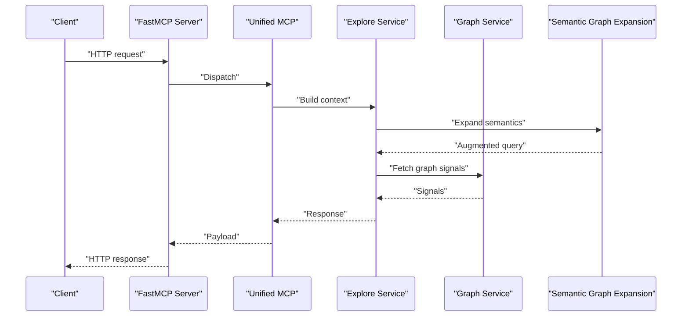
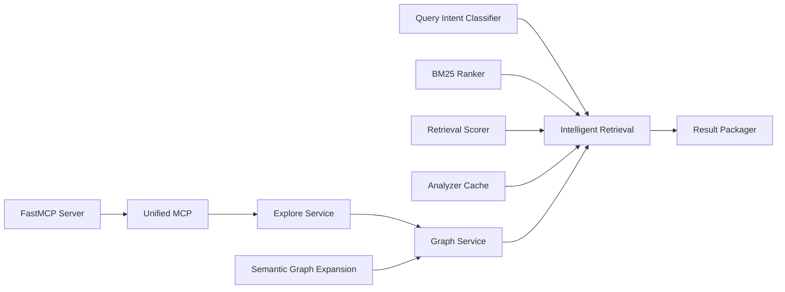

# Advanced Query Features

<cite>
**Referenced Files in This Document**
- [intelligent_retrieval.py](file://code-tiny/tools/common/intelligent_retrieval.py)
- [bm25_ranker.py](file://code-tiny/tools/common/bm25_ranker.py)
- [query_intent_classifier.py](file://code-tiny/tools/common/query_intent_classifier.py)
- [retrieval_scorer.py](file://code-tiny/tools/common/retrieval_scorer.py)
- [result_packager.py](file://code-tiny/tools/common/result_packager.py)
- [analyzer_cache.py](file://code-tiny/tools/common/analyzer_cache.py)
- [graph_service.py](file://code-tiny/mcp/services/graph_service.py)
- [explore_service.py](file://code-tiny/mcp/services/explore_service.py)
- [semantic_graph_expansion.py](file://code-tiny/mcp/semantic_graph_expansion.py)
- [unified_mcp.py](file://code-tiny/mcp/unified_mcp.py)
- [fastmcp_server.py](file://code-tiny/mcp/fastmcp_server.py)
- [validate_retrieval.py](file://scripts/validate_retrieval.py)
</cite>

## Table of Contents
1. [Introduction](#introduction)
2. [Project Structure](#project-structure)
3. [Core Components](#core-components)
4. [Architecture Overview](#architecture-overview)
5. [Detailed Component Analysis](#detailed-component-analysis)
6. [Dependency Analysis](#dependency-analysis)
7. [Performance Considerations](#performance-considerations)
8. [Troubleshooting Guide](#troubleshooting-guide)
9. [Conclusion](#conclusion)
10. [Appendices](#appendices)

## Introduction
This document explains advanced query features in Cortex Harness with a focus on intelligent retrieval, semantic search, BM25 ranking, and query intent classification. It covers result aggregation, pagination, export formats, conditional filtering with complex expressions, sorting options, performance optimization techniques, caching and memoization strategies, error handling, and debugging tools. The goal is to help developers build sophisticated code analysis queries that combine multiple retrieval and ranking capabilities for high-quality results.

## Project Structure
The advanced query features are implemented across shared common modules and MCP services:
- Common retrieval and ranking components live under the common tools directory.
- MCP services orchestrate graph-based exploration and semantic expansion.
- A validation script provides acceptance tests for retrieval behavior.

**Diagram sources**
- [intelligent_retrieval.py](file://code-tiny/tools/common/intelligent_retrieval.py)
- [bm25_ranker.py](file://code-tiny/tools/common/bm25_ranker.py)
- [query_intent_classifier.py](file://code-tiny/tools/common/query_intent_classifier.py)
- [retrieval_scorer.py](file://code-tiny/tools/common/retrieval_scorer.py)
- [result_packager.py](file://code-tiny/tools/common/result_packager.py)
- [analyzer_cache.py](file://code-tiny/tools/common/analyzer_cache.py)
- [graph_service.py](file://code-tiny/mcp/services/graph_service.py)
- [explore_service.py](file://code-tiny/mcp/services/explore_service.py)
- [semantic_graph_expansion.py](file://code-tiny/mcp/semantic_graph_expansion.py)
- [unified_mcp.py](file://code-tiny/mcp/unified_mcp.py)
- [fastmcp_server.py](file://code-tiny/mcp/fastmcp_server.py)

**Section sources**
- [intelligent_retrieval.py](file://code-tiny/tools/common/intelligent_retrieval.py)
- [bm25_ranker.py](file://code-tiny/tools/common/bm25_ranker.py)
- [query_intent_classifier.py](file://code-tiny/tools/common/query_intent_classifier.py)
- [retrieval_scorer.py](file://code-tiny/tools/common/retrieval_scorer.py)
- [result_packager.py](file://code-tiny/tools/common/result_packager.py)
- [analyzer_cache.py](file://code-tiny/tools/common/analyzer_cache.py)
- [graph_service.py](file://code-tiny/mcp/services/graph_service.py)
- [explore_service.py](file://code-tiny/mcp/services/explore_service.py)
- [semantic_graph_expansion.py](file://code-tiny/mcp/semantic_graph_expansion.py)
- [unified_mcp.py](file://code-tiny/mcp/unified_mcp.py)
- [fastmcp_server.py](file://code-tiny/mcp/fastmcp_server.py)

## Core Components
- Intelligent Retrieval: Orchestrates multi-modal retrieval combining vector similarity and lexical matching, applies filters and sorting, aggregates results, and packages outputs.
- BM25 Ranker: Provides lexical relevance scoring using BM25 over tokenized text fields.
- Query Intent Classifier: Classifies user queries into intents (e.g., symbol lookup, code snippet search, dependency traversal) to guide retrieval strategy.
- Retrieval Scorer: Normalizes and blends scores from different signals (vector similarity, BM25, graph proximity).
- Result Packager: Applies pagination, sorting, and export formatting (e.g., JSON, CSV) to final results.
- Analyzer Cache: Caches intermediate retrieval results and computed embeddings to reduce redundant work.
- MCP Services: Provide higher-level APIs for graph exploration and semantic expansion, integrating with the common retrieval stack.

Key responsibilities and interactions:
- Query enters via MCP service layer, passes through intent classification, then to intelligent retrieval.
- Retrieval uses BM25 and vector similarity; scorer merges signals; packager paginates and exports.
- Cache layers speed up repeated or overlapping queries.

**Section sources**
- [intelligent_retrieval.py](file://code-tiny/tools/common/intelligent_retrieval.py)
- [bm25_ranker.py](file://code-tiny/tools/common/bm25_ranker.py)
- [query_intent_classifier.py](file://code-tiny/tools/common/query_intent_classifier.py)
- [retrieval_scorer.py](file://code-tiny/tools/common/retrieval_scorer.py)
- [result_packager.py](file://code-tiny/tools/common/result_packager.py)
- [analyzer_cache.py](file://code-tiny/tools/common/analyzer_cache.py)
- [graph_service.py](file://code-tiny/mcp/services/graph_service.py)
- [explore_service.py](file://code-tiny/mcp/services/explore_service.py)
- [semantic_graph_expansion.py](file://code-tiny/mcp/semantic_graph_expansion.py)
- [unified_mcp.py](file://code-tiny/mcp/unified_mcp.py)
- [fastmcp_server.py](file://code-tiny/mcp/fastmcp_server.py)

## Architecture Overview
The advanced query pipeline integrates intent classification, hybrid retrieval, scoring, and packaging within an MCP-driven architecture.

**Diagram sources**
- [fastmcp_server.py](file://code-tiny/mcp/fastmcp_server.py)
- [unified_mcp.py](file://code-tiny/mcp/unified_mcp.py)
- [explore_service.py](file://code-tiny/mcp/services/explore_service.py)
- [graph_service.py](file://code-tiny/mcp/services/graph_service.py)
- [intelligent_retrieval.py](file://code-tiny/tools/common/intelligent_retrieval.py)
- [bm25_ranker.py](file://code-tiny/tools/common/bm25_ranker.py)
- [query_intent_classifier.py](file://code-tiny/tools/common/query_intent_classifier.py)
- [retrieval_scorer.py](file://code-tiny/tools/common/retrieval_scorer.py)
- [result_packager.py](file://code-tiny/tools/common/result_packager.py)
- [analyzer_cache.py](file://code-tiny/tools/common/analyzer_cache.py)

## Detailed Component Analysis

### Intelligent Retrieval
Responsibilities:
- Accepts query parameters including filters, sort options, and pagination.
- Coordinates BM25 and vector similarity retrieval.
- Applies conditional filtering with complex expressions.
- Aggregates and normalizes results before packaging.

**Diagram sources**
- [intelligent_retrieval.py](file://code-tiny/tools/common/intelligent_retrieval.py)
- [bm25_ranker.py](file://code-tiny/tools/common/bm25_ranker.py)
- [retrieval_scorer.py](file://code-tiny/tools/common/retrieval_scorer.py)
- [result_packager.py](file://code-tiny/tools/common/result_packager.py)

**Section sources**
- [intelligent_retrieval.py](file://code-tiny/tools/common/intelligent_retrieval.py)
- [bm25_ranker.py](file://code-tiny/tools/common/bm25_ranker.py)
- [retrieval_scorer.py](file://code-tiny/tools/common/retrieval_scorer.py)
- [result_packager.py](file://code-tiny/tools/common/result_packager.py)

### BM25 Ranker
Responsibilities:
- Tokenizes input text and candidate documents.
- Computes BM25 scores based on term frequency and inverse document frequency.
- Returns normalized lexical relevance scores for blending.

**Diagram sources**
- [bm25_ranker.py](file://code-tiny/tools/common/bm25_ranker.py)

**Section sources**
- [bm25_ranker.py](file://code-tiny/tools/common/bm25_ranker.py)

### Query Intent Classifier
Responsibilities:
- Classifies incoming queries into predefined intents.
- Provides hints to retrieval strategy (e.g., prioritize symbol resolution vs. free-text search).
- Supports extensibility for new intent types.

**Diagram sources**
- [query_intent_classifier.py](file://code-tiny/tools/common/query_intent_classifier.py)

**Section sources**
- [query_intent_classifier.py](file://code-tiny/tools/common/query_intent_classifier.py)

### Retrieval Scorer
Responsibilities:
- Normalizes heterogeneous signals (vector similarity, BM25, graph proximity).
- Blends scores using configurable weights.
- Ensures consistent ranking across diverse retrieval sources.

**Diagram sources**
- [retrieval_scorer.py](file://code-tiny/tools/common/retrieval_scorer.py)

**Section sources**
- [retrieval_scorer.py](file://code-tiny/tools/common/retrieval_scorer.py)

### Result Packager
Responsibilities:
- Applies sorting and pagination.
- Formats results for export (JSON, CSV).
- Adds metadata such as total count and page info.

**Diagram sources**
- [result_packager.py](file://code-tiny/tools/common/result_packager.py)

**Section sources**
- [result_packager.py](file://code-tiny/tools/common/result_packager.py)

### Analyzer Cache
Responsibilities:
- Stores intermediate retrieval results and computed embeddings.
- Memoizes expensive computations keyed by query fingerprints.
- Evicts stale entries based on configuration.

**Diagram sources**
- [analyzer_cache.py](file://code-tiny/tools/common/analyzer_cache.py)

**Section sources**
- [analyzer_cache.py](file://code-tiny/tools/common/analyzer_cache.py)

### MCP Services Integration
Responsibilities:
- Graph Service: Resolves scopes, constraints, and graph-based signals.
- Explore Service: Prepares context, coordinates retrieval, and returns structured responses.
- Semantic Graph Expansion: Augments queries with semantic relationships.
- Unified MCP: Routes requests and standardizes payloads.
- FastMCP Server: Exposes HTTP endpoints for clients.

**Diagram sources**
- [fastmcp_server.py](file://code-tiny/mcp/fastmcp_server.py)
- [unified_mcp.py](file://code-tiny/mcp/unified_mcp.py)
- [explore_service.py](file://code-tiny/mcp/services/explore_service.py)
- [graph_service.py](file://code-tiny/mcp/services/graph_service.py)
- [semantic_graph_expansion.py](file://code-tiny/mcp/semantic_graph_expansion.py)

**Section sources**
- [graph_service.py](file://code-tiny/mcp/services/graph_service.py)
- [explore_service.py](file://code-tiny/mcp/services/explore_service.py)
- [semantic_graph_expansion.py](file://code-tiny/mcp/semantic_graph_expansion.py)
- [unified_mcp.py](file://code-tiny/mcp/unified_mcp.py)
- [fastmcp_server.py](file://code-tiny/mcp/fastmcp_server.py)

## Dependency Analysis
High-level dependencies among core components:

**Diagram sources**
- [intelligent_retrieval.py](file://code-tiny/tools/common/intelligent_retrieval.py)
- [bm25_ranker.py](file://code-tiny/tools/common/bm25_ranker.py)
- [query_intent_classifier.py](file://code-tiny/tools/common/query_intent_classifier.py)
- [retrieval_scorer.py](file://code-tiny/tools/common/retrieval_scorer.py)
- [result_packager.py](file://code-tiny/tools/common/result_packager.py)
- [analyzer_cache.py](file://code-tiny/tools/common/analyzer_cache.py)
- [graph_service.py](file://code-tiny/mcp/services/graph_service.py)
- [explore_service.py](file://code-tiny/mcp/services/explore_service.py)
- [semantic_graph_expansion.py](file://code-tiny/mcp/semantic_graph_expansion.py)
- [unified_mcp.py](file://code-tiny/mcp/unified_mcp.py)
- [fastmcp_server.py](file://code-tiny/mcp/fastmcp_server.py)

**Section sources**
- [intelligent_retrieval.py](file://code-tiny/tools/common/intelligent_retrieval.py)
- [bm25_ranker.py](file://code-tiny/tools/common/bm25_ranker.py)
- [query_intent_classifier.py](file://code-tiny/tools/common/query_intent_classifier.py)
- [retrieval_scorer.py](file://code-tiny/tools/common/retrieval_scorer.py)
- [result_packager.py](file://code-tiny/tools/common/result_packager.py)
- [analyzer_cache.py](file://code-tiny/tools/common/analyzer_cache.py)
- [graph_service.py](file://code-tiny/mcp/services/graph_service.py)
- [explore_service.py](file://code-tiny/mcp/services/explore_service.py)
- [semantic_graph_expansion.py](file://code-tiny/mcp/semantic_graph_expansion.py)
- [unified_mcp.py](file://code-tiny/mcp/unified_mcp.py)
- [fastmcp_server.py](file://code-tiny/mcp/fastmcp_server.py)

## Performance Considerations
- Use analyzer cache to memoize expensive retrievals and embeddings; key by stable query fingerprints to maximize hits.
- Prefer intent-driven retrieval paths to avoid unnecessary computation when the query type is clear.
- Tune blending weights in the retrieval scorer to balance vector and BM25 contributions based on dataset characteristics.
- Apply strict filters early to reduce candidate set size before scoring.
- Limit pagination sizes for interactive use; batch larger exports asynchronously if needed.
- Reuse graph signals where possible to avoid repeated traversals.

[No sources needed since this section provides general guidance]

## Troubleshooting Guide
- Validation script: Use the retrieval validation script to run acceptance checks against expected behaviors and edge cases.
- Logging and diagnostics: Inspect MCP server logs and service responses to trace request flow and identify bottlenecks.
- Cache misses: If performance degrades, verify cache keys and eviction policies; consider warming cache with frequent queries.
- Ranking anomalies: Review BM25 tokenization and normalization steps; ensure consistent preprocessing across index and query time.
- Filtering errors: Validate complex expression syntax and field availability; confirm filter conditions match schema.

**Section sources**
- [validate_retrieval.py](file://scripts/validate_retrieval.py)
- [fastmcp_server.py](file://code-tiny/mcp/fastmcp_server.py)
- [unified_mcp.py](file://code-tiny/mcp/unified_mcp.py)
- [explore_service.py](file://code-tiny/mcp/services/explore_service.py)
- [graph_service.py](file://code-tiny/mcp/services/graph_service.py)

## Conclusion
Cortex Harness provides a robust, modular advanced query system combining semantic search, BM25 ranking, intent classification, and graph-aware signals. With caching, pagination, and export support, it enables sophisticated code analysis workflows. By following best practices for filtering, sorting, and performance tuning, teams can achieve accurate and efficient retrieval at scale.

[No sources needed since this section summarizes without analyzing specific files]

## Appendices

### Combining Multiple Query Features: Example Scenarios
- Symbol-focused search: Use intent classification to detect symbol lookups, apply strict name filters, and rely more on graph proximity than BM25.
- Code snippet discovery: Emphasize BM25 for textual matches, blend with vector similarity, and filter by language and file path patterns.
- Impact analysis: Combine graph traversal signals with semantic expansion to find related functions and modules, then rank by combined score and paginate results.

[No sources needed since this section doesn't analyze specific files]