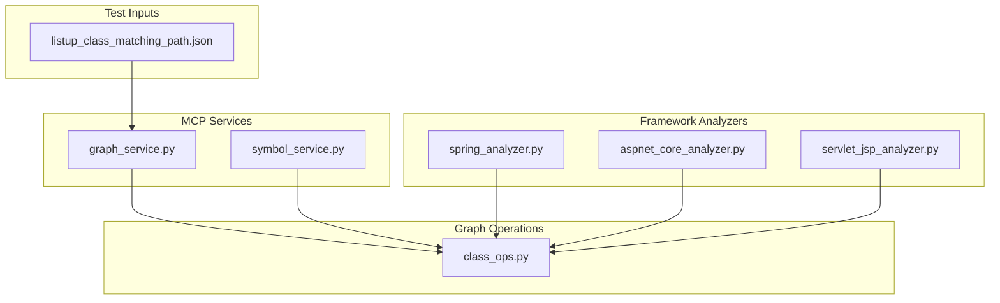
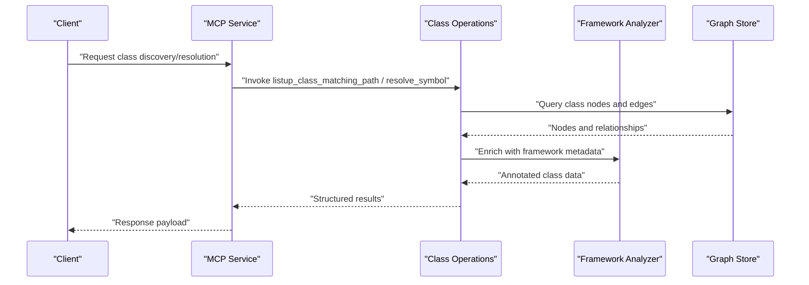
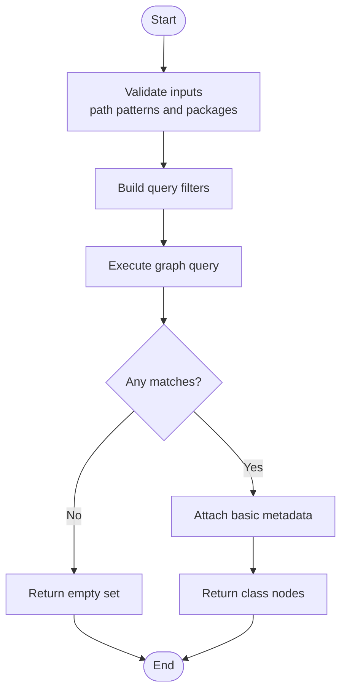
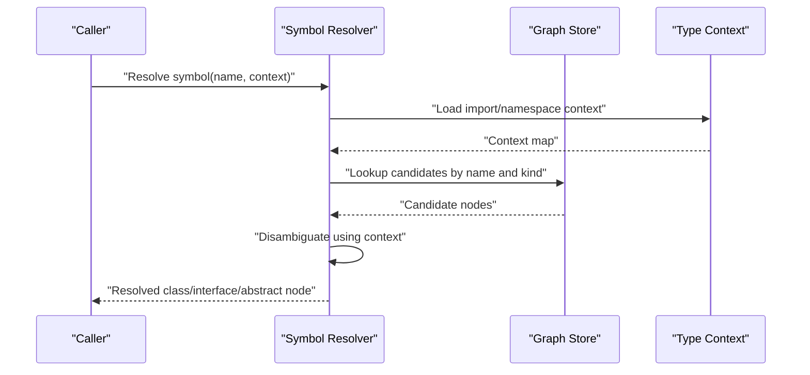
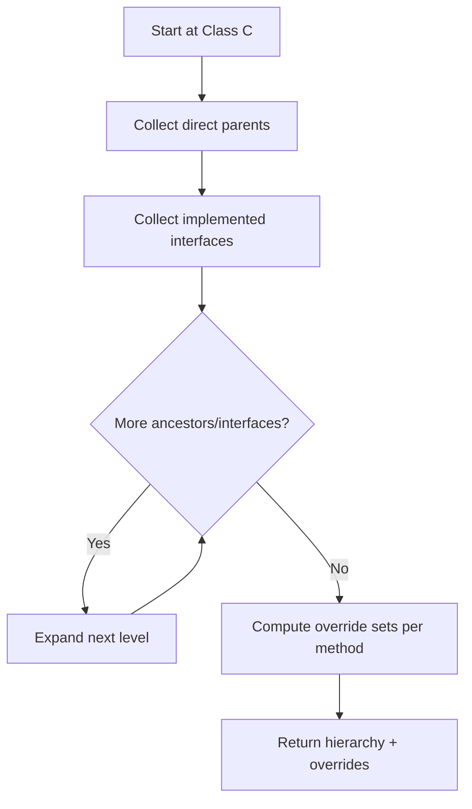
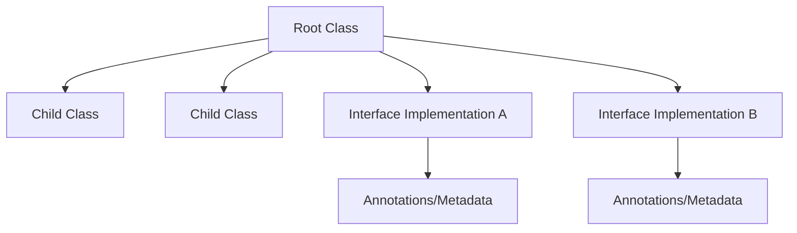
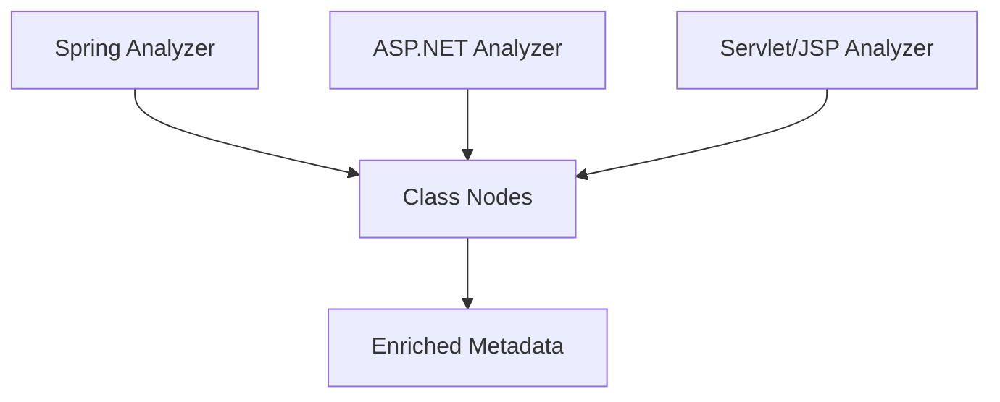
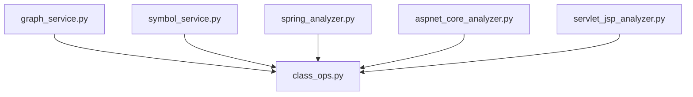

# Class Node Operations

<cite>
**Referenced Files in This Document**
- [class_ops.py](file://code-tiny/tools/graph/operations/class_ops.py)
- [graph_service.py](file://code-tiny/mcp/java/services/graph_service.py)
- [symbol_service.py](file://code-tiny/mcp/java/services/symbol_service.py)
- [spring_analyzer.py](file://code-tiny/tools/spring/spring_analyzer.py)
- [aspnet_core_analyzer.py](file://code-tiny/tools/aspnet_core/aspnet_core_analyzer.py)
- [servlet_jsp_analyzer.py](file://code-tiny/tools/servlet_jsp/servlet_jsp_analyzer.py)
- [listup_class_matching_path.json](file://code-tiny/testtool/input_exam/listup_class_matching_path.json)
</cite>

## Table of Contents
1. [Introduction](#introduction)
2. [Project Structure](#project-structure)
3. [Core Components](#core-components)
4. [Architecture Overview](#architecture-overview)
5. [Detailed Component Analysis](#detailed-component-analysis)
6. [Dependency Analysis](#dependency-analysis)
7. [Performance Considerations](#performance-considerations)
8. [Troubleshooting Guide](#troubleshooting-guide)
9. [Conclusion](#conclusion)
10. [Appendices](#appendices)

## Introduction
This document explains class node operations in Cortex Harness with a focus on:
- Finding classes by file path patterns and package hierarchies using listup_class_matching_path
- Resolving symbols to locate class definitions, interfaces, and abstract classes across the codebase
- Analyzing inheritance relationships including parent-child links, interface implementations, and method overrides
- Traversing class hierarchies, analyzing polymorphic relationships, and extracting class metadata
- Integrating with framework-specific analyzers for Spring Boot, ASP.NET, and other enterprise frameworks
- Performance considerations for deep inheritance tree traversal

The goal is to provide both conceptual understanding and practical guidance for building robust class analysis workflows.

## Project Structure
Cortex Harness organizes graph operations under a dedicated module and exposes them via MCP services. The relevant areas include:
- Graph operations for classes
- MCP service endpoints that orchestrate queries
- Framework analyzers that enrich class nodes with annotations and relationships
- Test fixtures demonstrating input contracts for class discovery

**Diagram sources**
- [class_ops.py](file://code-tiny/tools/graph/operations/class_ops.py)
- [graph_service.py](file://code-tiny/mcp/java/services/graph_service.py)
- [symbol_service.py](file://code-tiny/mcp/java/services/symbol_service.py)
- [spring_analyzer.py](file://code-tiny/tools/spring/spring_analyzer.py)
- [aspnet_core_analyzer.py](file://code-tiny/tools/aspnet_core/aspnet_core_analyzer.py)
- [servlet_jsp_analyzer.py](file://code-tiny/tools/servlet_jsp/servlet_jsp_analyzer.py)
- [listup_class_matching_path.json](file://code-tiny/testtool/input_exam/listup_class_matching_path.json)

**Section sources**
- [class_ops.py](file://code-tiny/tools/graph/operations/class_ops.py)
- [graph_service.py](file://code-tiny/mcp/java/services/graph_service.py)
- [symbol_service.py](file://code-tiny/mcp/java/services/symbol_service.py)
- [spring_analyzer.py](file://code-tiny/tools/spring/spring_analyzer.py)
- [aspnet_core_analyzer.py](file://code-tiny/tools/aspnet_core/aspnet_core_analyzer.py)
- [servlet_jsp_analyzer.py](file://code-tiny/tools/servlet_jsp/servlet_jsp_analyzer.py)
- [listup_class_matching_path.json](file://code-tiny/testtool/input_exam/listup_class_matching_path.json)

## Core Components
- Class operations module provides primitives for discovering and traversing class nodes, including matching by file paths and package hierarchies.
- MCP services expose these operations through well-defined endpoints, handling request parsing, validation, and result packaging.
- Framework analyzers annotate class nodes with framework-specific metadata (e.g., controllers, services, repositories) and wire up relationships such as dependency injection or routing.

Key responsibilities:
- Discovery: Find classes by path patterns and package prefixes
- Resolution: Resolve symbol references to concrete class definitions
- Inheritance: Traverse extends/implements chains and detect overrides
- Metadata: Extract annotations, visibility, and framework roles
- Integration: Coordinate with analyzer pipelines to enrich results

**Section sources**
- [class_ops.py](file://code-tiny/tools/graph/operations/class_ops.py)
- [graph_service.py](file://code-tiny/mcp/java/services/graph_service.py)
- [symbol_service.py](file://code-tiny/mcp/java/services/symbol_service.py)
- [spring_analyzer.py](file://code-tiny/tools/spring/spring_analyzer.py)
- [aspnet_core_analyzer.py](file://code-tiny/tools/aspnet_core/aspnet_core_analyzer.py)
- [servlet_jsp_analyzer.py](file://code-tiny/tools/servlet_jsp/servlet_jsp_analyzer.py)

## Architecture Overview
The class node operation pipeline integrates MCP services with graph operations and framework analyzers. Requests flow from clients into MCP services, which delegate to graph operations. Analyzers contribute additional edges and properties during ingestion or enrichment phases.

**Diagram sources**
- [graph_service.py](file://code-tiny/mcp/java/services/graph_service.py)
- [class_ops.py](file://code-tiny/tools/graph/operations/class_ops.py)
- [spring_analyzer.py](file://code-tiny/tools/spring/spring_analyzer.py)
- [aspnet_core_analyzer.py](file://code-tiny/tools/aspnet_core/aspnet_core_analyzer.py)
- [servlet_jsp_analyzer.py](file://code-tiny/tools/servlet_jsp/servlet_jsp_analyzer.py)

## Detailed Component Analysis

### listup_class_matching_path: Discovering Classes by Path and Package
Purpose:
- Locate class nodes whose source files match given path patterns and/or belong to specified package hierarchies.
- Support flexible matching strategies to narrow down large codebases efficiently.

Typical inputs:
- File path pattern(s)
- Package prefix(es)
- Optional filters (e.g., only public classes, exclude test directories)

Processing logic:
- Normalize and validate input patterns
- Query the graph for class nodes filtered by file path attributes and package hierarchy
- Aggregate results and return structured metadata

Practical example scenarios:
- Find all classes under a specific package prefix
- Match classes by filename patterns across modules
- Combine path and package filters to reduce search space

**Diagram sources**
- [class_ops.py](file://code-tiny/tools/graph/operations/class_ops.py)
- [listup_class_matching_path.json](file://code-tiny/testtool/input_exam/listup_class_matching_path.json)

**Section sources**
- [class_ops.py](file://code-tiny/tools/graph/operations/class_ops.py)
- [listup_class_matching_path.json](file://code-tiny/testtool/input_exam/listup_class_matching_path.json)

### Symbol Resolution: Locating Definitions Across the Codebase
Purpose:
- Resolve symbolic names to concrete class definitions, including support for interfaces and abstract classes.
- Disambiguate overloaded or aliased symbols using context such as imports and namespaces.

Resolution steps:
- Parse symbol reference and extract qualified name components
- Search for candidate definitions by name and type hints
- Apply import and namespace context to select the correct definition
- Return resolved node with location and kind (class/interface/abstract)

Use cases:
- Navigate from usage sites to definitions
- Identify implemented interfaces and abstract base classes
- Support refactoring and impact analysis

**Diagram sources**
- [symbol_service.py](file://code-tiny/mcp/java/services/symbol_service.py)
- [class_ops.py](file://code-tiny/tools/graph/operations/class_ops.py)

**Section sources**
- [symbol_service.py](file://code-tiny/mcp/java/services/symbol_service.py)
- [class_ops.py](file://code-tiny/tools/graph/operations/class_ops.py)

### Inheritance Analysis: Parent-Child Relationships, Implementations, Overrides
Capabilities:
- Traverse extends chains to build full inheritance trees
- Enumerate implemented interfaces and their transitive closure
- Detect method overrides by comparing signatures across the hierarchy

Traversal algorithm:
- Start from a target class node
- Follow parent edges upward to collect ancestors
- Collect interface implementation edges and expand recursively
- For each method, compare signatures against ancestor methods to identify overrides

Practical examples:
- Build a complete inheritance tree for a controller/service class
- List all overridden methods and their original definitions
- Identify interface contracts satisfied by a concrete class

**Diagram sources**
- [class_ops.py](file://code-tiny/tools/graph/operations/class_ops.py)

**Section sources**
- [class_ops.py](file://code-tiny/tools/graph/operations/class_ops.py)

### Traversal and Polymorphism: Walking Hierarchies and Extracting Metadata
Workflows:
- Depth-first or breadth-first traversal of inheritance graphs
- Accumulate metadata such as annotations, visibility, and framework roles
- Map polymorphic relationships where multiple implementations satisfy an interface

Metadata extraction:
- Annotations and attributes attached to class nodes
- Visibility modifiers and documentation comments
- Framework-specific roles (e.g., controller, service, repository)

**Diagram sources**
- [class_ops.py](file://code-tiny/tools/graph/operations/class_ops.py)

**Section sources**
- [class_ops.py](file://code-tiny/tools/graph/operations/class_ops.py)

### Framework-Specific Integration: Spring Boot, ASP.NET, Servlet/JSP
Spring Boot integration:
- Annotate classes with roles like @Controller, @Service, @Repository
- Wire dependency injection relationships and bean scopes
- Surface configuration-driven mappings and lifecycle hooks

ASP.NET integration:
- Identify controllers, pages, and middleware components
- Map routing configurations and attribute-based bindings
- Capture dependency injection registrations and lifetime scopes

Servlet/JSP integration:
- Detect servlets, filters, listeners, and JSP views
- Map web.xml and annotation-based configurations
- Associate view templates with backend handlers

**Diagram sources**
- [spring_analyzer.py](file://code-tiny/tools/spring/spring_analyzer.py)
- [aspnet_core_analyzer.py](file://code-tiny/tools/aspnet_core/aspnet_core_analyzer.py)
- [servlet_jsp_analyzer.py](file://code-tiny/tools/servlet_jsp/servlet_jsp_analyzer.py)

**Section sources**
- [spring_analyzer.py](file://code-tiny/tools/spring/spring_analyzer.py)
- [aspnet_core_analyzer.py](file://code-tiny/tools/aspnet_core/aspnet_core_analyzer.py)
- [servlet_jsp_analyzer.py](file://code-tiny/tools/servlet_jsp/servlet_jsp_analyzer.py)

## Dependency Analysis
Relationships between components:
- MCP services depend on graph operations for querying and assembling results
- Graph operations rely on the underlying graph store for persistence and retrieval
- Framework analyzers contribute enriched metadata and relationships to class nodes

**Diagram sources**
- [graph_service.py](file://code-tiny/mcp/java/services/graph_service.py)
- [symbol_service.py](file://code-tiny/mcp/java/services/symbol_service.py)
- [class_ops.py](file://code-tiny/tools/graph/operations/class_ops.py)
- [spring_analyzer.py](file://code-tiny/tools/spring/spring_analyzer.py)
- [aspnet_core_analyzer.py](file://code-tiny/tools/aspnet_core/aspnet_core_analyzer.py)
- [servlet_jsp_analyzer.py](file://code-tiny/tools/servlet_jsp/servlet_jsp_analyzer.py)

**Section sources**
- [graph_service.py](file://code-tiny/mcp/java/services/graph_service.py)
- [symbol_service.py](file://code-tiny/mcp/java/services/symbol_service.py)
- [class_ops.py](file://code-tiny/tools/graph/operations/class_ops.py)
- [spring_analyzer.py](file://code-tiny/tools/spring/spring_analyzer.py)
- [aspnet_core_analyzer.py](file://code-tiny/tools/aspnet_core/aspnet_core_analyzer.py)
- [servlet_jsp_analyzer.py](file://code-tiny/tools/servlet_jsp/servlet_jsp_analyzer.py)

## Performance Considerations
Deep inheritance tree traversal can be expensive. Recommended practices:
- Limit traversal depth and scope using explicit parameters
- Cache intermediate results for frequently accessed hierarchies
- Use incremental updates to avoid re-traversing unchanged subtrees
- Prefer breadth-first exploration when searching for shallow relationships
- Batch metadata enrichment to minimize repeated graph reads
- Filter early by package and path patterns to reduce candidate sets

[No sources needed since this section provides general guidance]

## Troubleshooting Guide
Common issues and resolutions:
- No matches returned by listup_class_matching_path:
  - Verify path patterns and package prefixes are correctly normalized
  - Ensure the graph contains class nodes for the targeted files
- Ambiguous symbol resolution:
  - Provide more context (imports, namespaces) to disambiguate candidates
  - Check for naming collisions and adjust resolution strategy
- Missing framework metadata:
  - Confirm the appropriate analyzer is enabled and configured
  - Validate that annotations and configurations were ingested successfully

Operational checks:
- Inspect MCP service logs for request payloads and errors
- Validate graph schema consistency for class nodes and edges
- Re-run analyzer pipelines if metadata appears stale

**Section sources**
- [graph_service.py](file://code-tiny/mcp/java/services/graph_service.py)
- [symbol_service.py](file://code-tiny/mcp/java/services/symbol_service.py)
- [class_ops.py](file://code-tiny/tools/graph/operations/class_ops.py)

## Conclusion
Cortex Harness provides robust class node operations for discovery, resolution, and inheritance analysis. By combining graph operations with framework-specific analyzers, it enables comprehensive exploration of class hierarchies, polymorphic relationships, and metadata. Applying performance best practices ensures efficient traversal even in large codebases.

[No sources needed since this section summarizes without analyzing specific files]

## Appendices

### Practical Examples
- Traversing a class hierarchy:
  - Start from a concrete class, collect parents and interfaces, then compute overrides
- Analyzing polymorphic relationships:
  - Identify all implementations of an interface and their annotated behaviors
- Extracting class metadata:
  - Retrieve annotations, visibility, and framework roles for reporting or transformation

[No sources needed since this section doesn't analyze specific files]