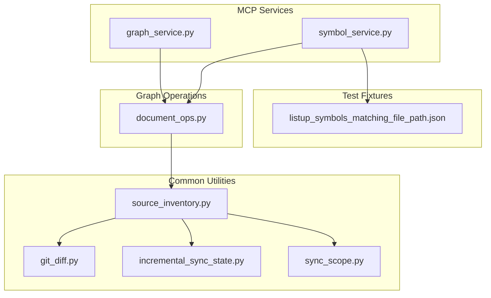
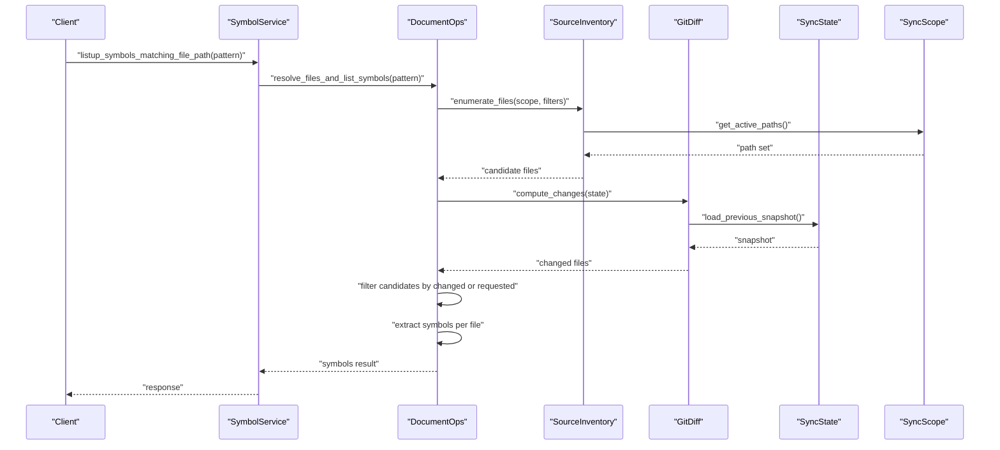
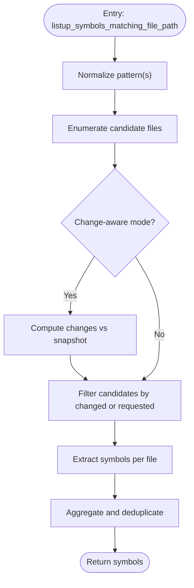
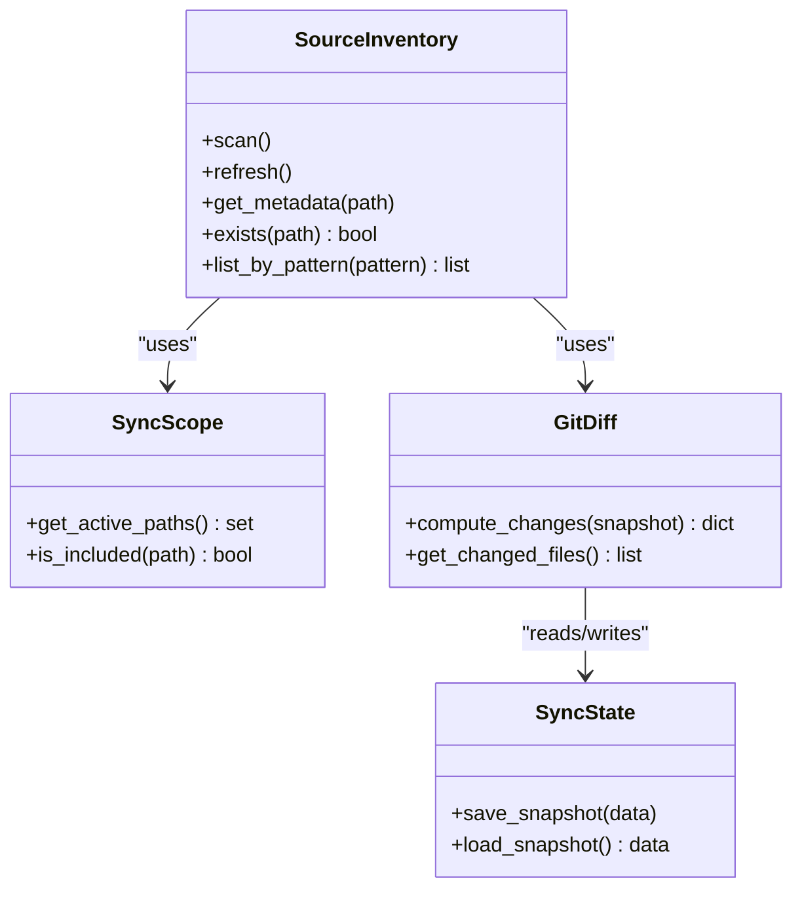
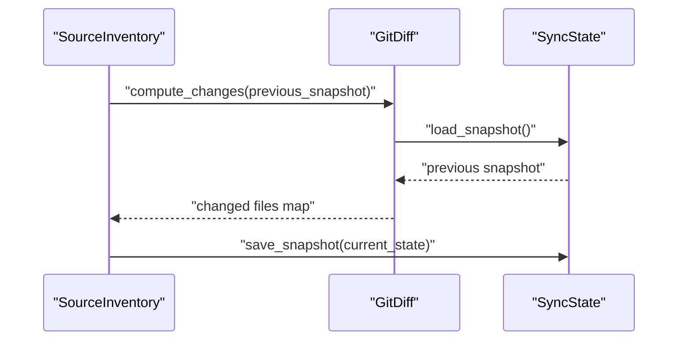
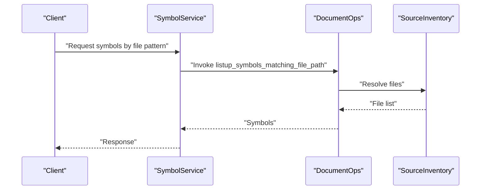
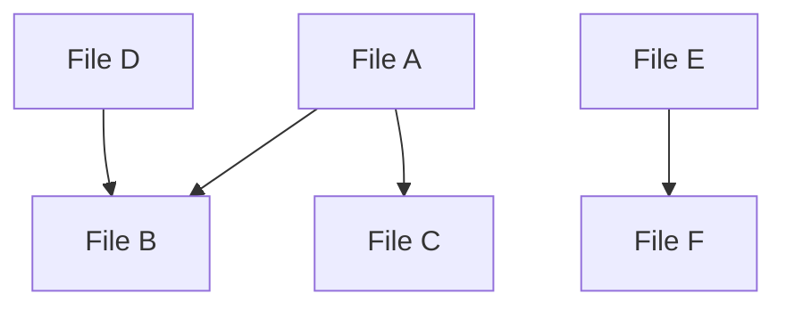
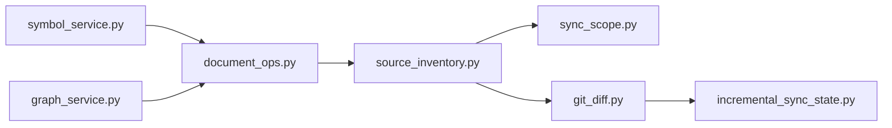

# Document Node Operations

<cite>
**Referenced Files in This Document**
- [document_ops.py](file://code-tiny/tools/graph/operations/document_ops.py)
- [source_inventory.py](file://code-tiny/tools/common/source_inventory.py)
- [git_diff.py](file://code-tiny/tools/common/git_diff.py)
- [incremental_sync_state.py](file://code-tiny/tools/common/incremental_sync_state.py)
- [sync_scope.py](file://code-tiny/tools/common/sync_scope.py)
- [graph_service.py](file://code-tiny/mcp/services/graph_service.py)
- [symbol_service.py](file://code-tiny/mcp/services/symbol_service.py)
- [listup_symbols_matching_file_path.json](file://code-tiny/testtool/input_exam/listup_symbols_matching_file_path.json)
</cite>

## Table of Contents
1. [Introduction](#introduction)
2. [Project Structure](#project-structure)
3. [Core Components](#core-components)
4. [Architecture Overview](#architecture-overview)
5. [Detailed Component Analysis](#detailed-component-analysis)
6. [Dependency Analysis](#dependency-analysis)
7. [Performance Considerations](#performance-considerations)
8. [Troubleshooting Guide](#troubleshooting-guide)
9. [Conclusion](#conclusion)

## Introduction
This document explains how Cortex Harness performs document node operations at the file level, including listing symbols by file path or pattern, building and maintaining a source inventory, analyzing relationships such as imports and includes, and integrating with version control for change detection and incremental analysis. It also provides guidance on performance optimization and memory management strategies for large repositories.

## Project Structure
The relevant implementation is organized into:
- Graph operations for document nodes (listing symbols, querying files)
- Common utilities for source inventory, change detection, and sync scoping
- MCP services that expose these capabilities to clients
- Test fixtures demonstrating input contracts for symbol queries

**Diagram sources**
- [document_ops.py](file://code-tiny/tools/graph/operations/document_ops.py)
- [source_inventory.py](file://code-tiny/tools/common/source_inventory.py)
- [git_diff.py](file://code-tiny/tools/common/git_diff.py)
- [incremental_sync_state.py](file://code-tiny/tools/common/incremental_sync_state.py)
- [sync_scope.py](file://code-tiny/tools/common/sync_scope.py)
- [graph_service.py](file://code-tiny/mcp/services/graph_service.py)
- [symbol_service.py](file://code-tiny/mcp/services/symbol_service.py)
- [listup_symbols_matching_file_path.json](file://code-tiny/testtool/input_exam/listup_symbols_matching_file_path.json)

**Section sources**
- [document_ops.py](file://code-tiny/tools/graph/operations/document_ops.py)
- [source_inventory.py](file://code-tiny/tools/common/source_inventory.py)
- [git_diff.py](file://code-tiny/tools/common/git_diff.py)
- [incremental_sync_state.py](file://code-tiny/tools/common/incremental_sync_state.py)
- [sync_scope.py](file://code-tiny/tools/common/sync_scope.py)
- [graph_service.py](file://code-tiny/mcp/services/graph_service.py)
- [symbol_service.py](file://code-tiny/mcp/services/symbol_service.py)
- [listup_symbols_matching_file_path.json](file://code-tiny/testtool/input_exam/listup_symbols_matching_file_path.json)

## Core Components
- Document operations module exposes file-level queries, notably listing symbols matching a file path or pattern.
- Source inventory builds and maintains a repository-wide catalog of files, their metadata, and change state.
- Git diff integration detects changes between revisions to support incremental analysis.
- Sync state and scope utilities manage what parts of the repository are considered during scans and updates.
- MCP graph and symbol services provide client-facing APIs that orchestrate these components.

Key responsibilities:
- listup_symbols_matching_file_path: resolve file patterns to concrete files and return associated symbols
- Source inventory: enumerate files, track timestamps/checksums, and maintain indices
- Change detection: compute diffs and reconcile with previous snapshots
- Relationship analysis: derive imports/includes and dependency edges from parsed artifacts

**Section sources**
- [document_ops.py](file://code-tiny/tools/graph/operations/document_ops.py)
- [source_inventory.py](file://code-tiny/tools/common/source_inventory.py)
- [git_diff.py](file://code-tiny/tools/common/git_diff.py)
- [incremental_sync_state.py](file://code-tiny/tools/common/incremental_sync_state.py)
- [sync_scope.py](file://code-tiny/tools/common/sync_scope.py)
- [graph_service.py](file://code-tiny/mcp/services/graph_service.py)
- [symbol_service.py](file://code-tiny/mcp/services/symbol_service.py)

## Architecture Overview
The following sequence shows how a client request to list symbols for a file pattern flows through the system.

**Diagram sources**
- [symbol_service.py](file://code-tiny/mcp/services/symbol_service.py)
- [document_ops.py](file://code-tiny/tools/graph/operations/document_ops.py)
- [source_inventory.py](file://code-tiny/tools/common/source_inventory.py)
- [git_diff.py](file://code-tiny/tools/common/git_diff.py)
- [incremental_sync_state.py](file://code-tiny/tools/common/incremental_sync_state.py)
- [sync_scope.py](file://code-tiny/tools/common/sync_scope.py)

## Detailed Component Analysis

### Document Operations: File-Level Symbol Queries
Responsibilities:
- Resolve file paths or glob patterns to concrete files within the active scope
- Extract symbols from matched files and return structured results
- Support filtering by change status when integrated with version control

Operational flow:
- Input validation and normalization of file patterns
- Candidate file enumeration via source inventory
- Optional change-aware filtering using git diff and sync state
- Symbol extraction and aggregation
- Result packaging for MCP consumers

**Diagram sources**
- [document_ops.py](file://code-tiny/tools/graph/operations/document_ops.py)
- [source_inventory.py](file://code-tiny/tools/common/source_inventory.py)
- [git_diff.py](file://code-tiny/tools/common/git_diff.py)
- [incremental_sync_state.py](file://code-tiny/tools/common/incremental_sync_state.py)

**Section sources**
- [document_ops.py](file://code-tiny/tools/graph/operations/document_ops.py)

### Source Inventory: Discovering Files and Tracking Metadata
Responsibilities:
- Build an index of all files under the repository root within configured scopes
- Track file metadata (paths, sizes, timestamps, checksums)
- Provide efficient lookups for file existence and attributes
- Integrate with sync scope to limit scanning to relevant directories

Key behaviors:
- Initial scan populates the index
- Incremental updates refresh only changed entries
- Filters exclude non-source or irrelevant files based on configuration

**Diagram sources**
- [source_inventory.py](file://code-tiny/tools/common/source_inventory.py)
- [sync_scope.py](file://code-tiny/tools/common/sync_scope.py)
- [git_diff.py](file://code-tiny/tools/common/git_diff.py)
- [incremental_sync_state.py](file://code-tiny/tools/common/incremental_sync_state.py)

**Section sources**
- [source_inventory.py](file://code-tiny/tools/common/source_inventory.py)
- [sync_scope.py](file://code-tiny/tools/common/sync_scope.py)
- [git_diff.py](file://code-tiny/tools/common/git_diff.py)
- [incremental_sync_state.py](file://code-tiny/tools/common/incremental_sync_state.py)

### Version Control Integration: Change Detection and Incremental Analysis
Responsibilities:
- Compute differences between current working tree and last known snapshot
- Persist and load snapshots to support incremental runs
- Limit re-analysis to affected files to improve performance

Integration points:
- Git-based diff computation against HEAD or specified refs
- Snapshot serialization for cross-process consistency
- Coordination with sync scope to avoid scanning ignored paths

**Diagram sources**
- [git_diff.py](file://code-tiny/tools/common/git_diff.py)
- [incremental_sync_state.py](file://code-tiny/tools/common/incremental_sync_state.py)
- [source_inventory.py](file://code-tiny/tools/common/source_inventory.py)

**Section sources**
- [git_diff.py](file://code-tiny/tools/common/git_diff.py)
- [incremental_sync_state.py](file://code-tiny/tools/common/incremental_sync_state.py)

### MCP Service Integration: Exposing Document Operations
Responsibilities:
- Receive client requests for symbol queries and file operations
- Delegate to document operations and source inventory
- Package responses conforming to MCP contracts

Example contract fixture:
- The test fixture demonstrates expected inputs for listing symbols by file path/pattern.

**Diagram sources**
- [symbol_service.py](file://code-tiny/mcp/services/symbol_service.py)
- [document_ops.py](file://code-tiny/tools/graph/operations/document_ops.py)
- [source_inventory.py](file://code-tiny/tools/common/source_inventory.py)
- [listup_symbols_matching_file_path.json](file://code-tiny/testtool/input_exam/listup_symbols_matching_file_path.json)

**Section sources**
- [symbol_service.py](file://code-tiny/mcp/services/symbol_service.py)
- [listup_symbols_matching_file_path.json](file://code-tiny/testtool/input_exam/listup_symbols_matching_file_path.json)

### Conceptual Overview: Document Relationships and Dependency Tracking
While specific relationship extraction logic varies by language analyzer, the general approach is:
- Parse source files to identify import/include statements and references
- Create edges between modules/files representing dependencies
- Maintain a graph of file-to-file relationships for impact analysis and navigation

[No sources needed since this diagram shows conceptual workflow, not actual code structure]

## Dependency Analysis
High-level dependencies among core components:
- MCP services depend on document operations and source inventory
- Document operations depend on source inventory and optional change detection
- Source inventory depends on sync scope and may use git diff and sync state

**Diagram sources**
- [symbol_service.py](file://code-tiny/mcp/services/symbol_service.py)
- [graph_service.py](file://code-tiny/mcp/services/graph_service.py)
- [document_ops.py](file://code-tiny/tools/graph/operations/document_ops.py)
- [source_inventory.py](file://code-tiny/tools/common/source_inventory.py)
- [sync_scope.py](file://code-tiny/tools/common/sync_scope.py)
- [git_diff.py](file://code-tiny/tools/common/git_diff.py)
- [incremental_sync_state.py](file://code-tiny/tools/common/incremental_sync_state.py)

**Section sources**
- [symbol_service.py](file://code-tiny/mcp/services/symbol_service.py)
- [graph_service.py](file://code-tiny/mcp/services/graph_service.py)
- [document_ops.py](file://code-tiny/tools/graph/operations/document_ops.py)
- [source_inventory.py](file://code-tiny/tools/common/source_inventory.py)
- [sync_scope.py](file://code-tiny/tools/common/sync_scope.py)
- [git_diff.py](file://code-tiny/tools/common/git_diff.py)
- [incremental_sync_state.py](file://code-tiny/tools/common/incremental_sync_state.py)

## Performance Considerations
- Prefer incremental analysis: rely on change detection to reprocess only modified files
- Use sync scope to restrict scans to relevant directories and reduce I/O
- Batch file enumerations and metadata reads; avoid repeated filesystem calls
- Defer heavy parsing until necessary; cache intermediate results where possible
- Stream results for large symbol lists to minimize memory pressure
- Tune snapshot frequency to balance persistence overhead and recovery speed

[No sources needed since this section provides general guidance]

## Troubleshooting Guide
Common issues and resolutions:
- Pattern resolution returns no files: verify scope inclusion and ignore rules
- Stale symbol results: ensure snapshot is updated after changes and re-run incremental sync
- Slow queries on large repos: enable change-aware mode and narrow scopes
- Memory spikes: paginate or stream outputs and avoid loading entire trees into memory

**Section sources**
- [source_inventory.py](file://code-tiny/tools/common/source_inventory.py)
- [git_diff.py](file://code-tiny/tools/common/git_diff.py)
- [incremental_sync_state.py](file://code-tiny/tools/common/incremental_sync_state.py)
- [sync_scope.py](file://code-tiny/tools/common/sync_scope.py)

## Conclusion
Cortex Harness provides robust document node operations centered on file-level symbol queries, comprehensive source inventory management, and change-aware incremental analysis. By leveraging sync scope, git diff, and persistent snapshots, it scales efficiently across large repositories while exposing clean MCP interfaces for clients. Following the performance and troubleshooting recommendations ensures reliable operation even under demanding workloads.