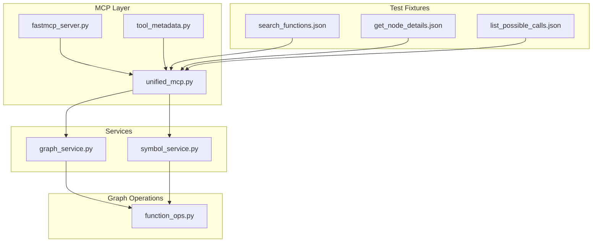
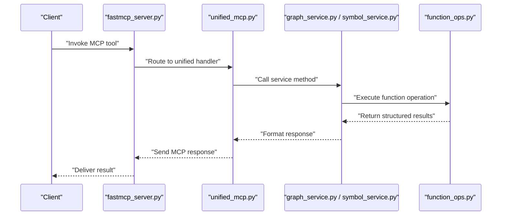
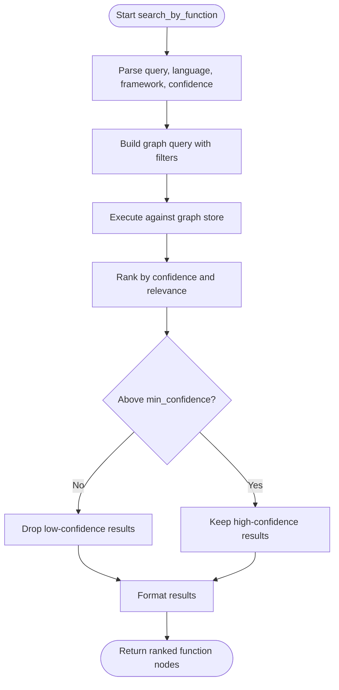
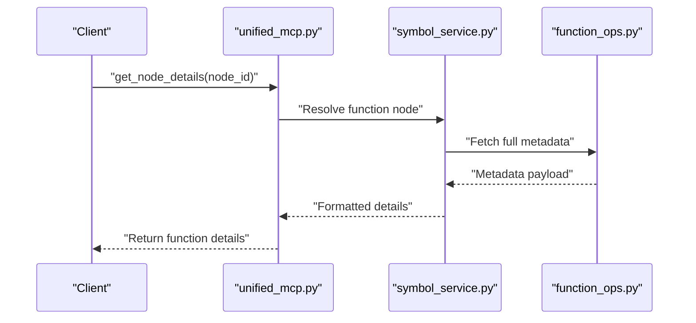
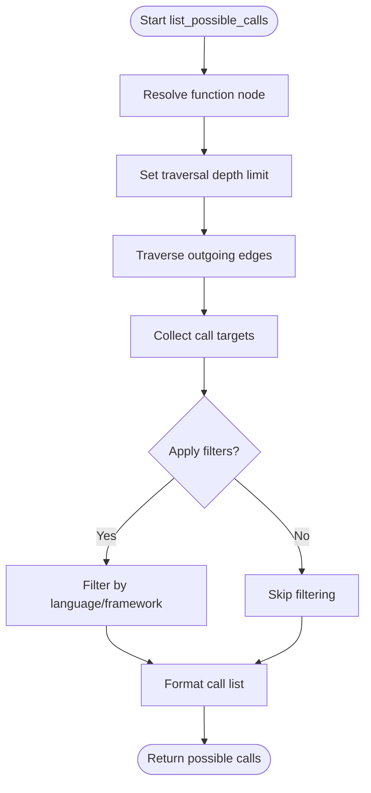
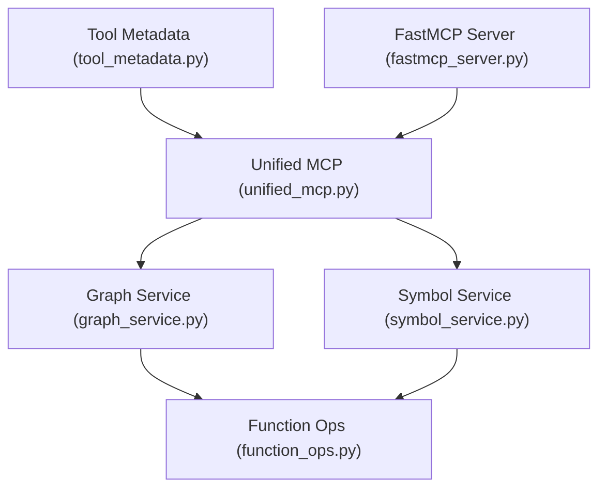

# Function Node Operations

<cite>
**Referenced Files in This Document**
- [function_ops.py](file://code-tiny/tools/graph/operations/function_ops.py)
- [graph_service.py](file://code-tiny/mcp/services/graph_service.py)
- [symbol_service.py](file://code-tiny/mcp/services/symbol_service.py)
- [unified_mcp.py](file://code-tiny/mcp/unified_mcp.py)
- [fastmcp_server.py](file://code-tiny/mcp/fastmcp_server.py)
- [tool_metadata.py](file://code-tiny/mcp/tool_metadata.py)
- [search_functions.json](file://code-tiny/testtool/input_exam/search_functions.json)
- [get_node_details.json](file://code-tiny/testtool/input_exam/get_node_details.json)
- [list_possible_calls.json](file://code-tiny/testtool/input_exam/list_possible_calls.json)
</cite>

## Table of Contents
1. [Introduction](#introduction)
2. [Project Structure](#project-structure)
3. [Core Components](#core-components)
4. [Architecture Overview](#architecture-overview)
5. [Detailed Component Analysis](#detailed-component-analysis)
6. [Dependency Analysis](#dependency-analysis)
7. [Performance Considerations](#performance-considerations)
8. [Troubleshooting Guide](#troubleshooting-guide)
9. [Conclusion](#conclusion)
10. [Appendices](#appendices)

## Introduction
This document explains function node operations in Cortex Harness with a focus on:
- search_by_function: find functions by name, pattern, or signature with filters such as language and confidence thresholds
- get_node_details: retrieve complete function metadata including signatures, parameters, return types, and implementation details
- list_possible_calls: analyze function call relationships and dependencies

It includes concrete examples for extracting signatures, analyzing parameter types, tracing call chains, filtering by language or framework, performance optimization strategies for large codebases, and common troubleshooting patterns.

## Project Structure
Function node operations are implemented in the graph operations layer and exposed via MCP services and tools. The key files involved are:
- Graph operation implementations for functions
- MCP service layers that orchestrate queries and formatting
- Unified MCP entry points and tool metadata
- Test fixtures demonstrating input schemas and usage patterns

**Diagram sources**
- [unified_mcp.py](file://code-tiny/mcp/unified_mcp.py)
- [fastmcp_server.py](file://code-tiny/mcp/fastmcp_server.py)
- [tool_metadata.py](file://code-tiny/mcp/tool_metadata.py)
- [graph_service.py](file://code-tiny/mcp/services/graph_service.py)
- [symbol_service.py](file://code-tiny/mcp/services/symbol_service.py)
- [function_ops.py](file://code-tiny/tools/graph/operations/function_ops.py)
- [search_functions.json](file://code-tiny/testtool/input_exam/search_functions.json)
- [get_node_details.json](file://code-tiny/testtool/input_exam/get_node_details.json)
- [list_possible_calls.json](file://code-tiny/testtool/input_exam/list_possible_calls.json)

**Section sources**
- [function_ops.py](file://code-tiny/tools/graph/operations/function_ops.py)
- [graph_service.py](file://code-tiny/mcp/services/graph_service.py)
- [symbol_service.py](file://code-tiny/mcp/services/symbol_service.py)
- [unified_mcp.py](file://code-tiny/mcp/unified_mcp.py)
- [fastmcp_server.py](file://code-tiny/mcp/fastmcp_server.py)
- [tool_metadata.py](file://code-tiny/mcp/tool_metadata.py)
- [search_functions.json](file://code-tiny/testtool/input_exam/search_functions.json)
- [get_node_details.json](file://code-tiny/testtool/input_exam/get_node_details.json)
- [list_possible_calls.json](file://code-tiny/testtool/input_exam/list_possible_calls.json)

## Core Components
- search_by_function: Provides flexible querying across function nodes using name/pattern matching, signature-based filters, language constraints, and confidence thresholds. It returns ranked results suitable for downstream processing.
- get_node_details: Retrieves comprehensive metadata for a specific function node, including signatures, parameters, return types, and implementation references.
- list_possible_calls: Enumerates potential call targets from a given function, enabling dependency analysis and call chain tracing.

These components are orchestrated by MCP services and exposed through unified endpoints and tool definitions.

**Section sources**
- [function_ops.py](file://code-tiny/tools/graph/operations/function_ops.py)
- [graph_service.py](file://code-tiny/mcp/services/graph_service.py)
- [symbol_service.py](file://code-tiny/mcp/services/symbol_service.py)
- [unified_mcp.py](file://code-tiny/mcp/unified_mcp.py)
- [tool_metadata.py](file://code-tiny/mcp/tool_metadata.py)

## Architecture Overview
The flow from client to graph operations involves MCP routing, service orchestration, and targeted graph queries.

**Diagram sources**
- [fastmcp_server.py](file://code-tiny/mcp/fastmcp_server.py)
- [unified_mcp.py](file://code-tiny/mcp/unified_mcp.py)
- [graph_service.py](file://code-tiny/mcp/services/graph_service.py)
- [symbol_service.py](file://code-tiny/mcp/services/symbol_service.py)
- [function_ops.py](file://code-tiny/tools/graph/operations/function_ops.py)

## Detailed Component Analysis

### search_by_function
Purpose:
- Find functions by name, pattern, or signature
- Filter by language and framework
- Apply confidence thresholds to rank results

Key capabilities:
- Name/pattern matching against function identifiers and descriptions
- Signature-based filtering (e.g., parameter types, return types)
- Language and framework scoping
- Confidence thresholding to reduce noise

Typical inputs:
- query: text describing the function or partial name
- language: filter by programming language
- framework: optional framework constraint
- min_confidence: numeric threshold to filter low-confidence matches

Outputs:
- Ranked list of function nodes with metadata fields such as identifiers, signatures, and confidence scores

Concrete examples:
- Extract function signatures: Provide a query targeting a known API surface; use language and framework filters to narrow scope; inspect returned signatures and parameter lists.
- Analyze parameter types: Use signature-based filters to match functions with specific parameter shapes; review parameter type annotations in the returned metadata.
- Trace call chains: After identifying candidate functions, use list_possible_calls to explore downstream dependencies.

**Diagram sources**
- [function_ops.py](file://code-tiny/tools/graph/operations/function_ops.py)
- [graph_service.py](file://code-tiny/mcp/services/graph_service.py)
- [symbol_service.py](file://code-tiny/mcp/services/symbol_service.py)

**Section sources**
- [function_ops.py](file://code-tiny/tools/graph/operations/function_ops.py)
- [graph_service.py](file://code-tiny/mcp/services/graph_service.py)
- [symbol_service.py](file://code-tiny/mcp/services/symbol_service.py)
- [search_functions.json](file://code-tiny/testtool/input_exam/search_functions.json)

### get_node_details
Purpose:
- Retrieve complete function metadata for a specific node
- Include signatures, parameters, return types, and implementation details

Key capabilities:
- Resolve function node by identifier or path
- Return detailed signature information and parameter types
- Provide implementation references and related context

Typical inputs:
- node_id or function identifier
- Optional flags to include additional context (e.g., callers/callees)

Outputs:
- Rich metadata object containing signatures, parameters, return types, and implementation pointers

Concrete examples:
- Extract function signatures: Request details for a known function ID; parse the returned signature block to understand parameter names and types.
- Analyze parameter types: Inspect parameter annotations and inferred types; validate compatibility with expected interfaces.
- Validate implementation details: Follow implementation references to locate source locations and related artifacts.

**Diagram sources**
- [unified_mcp.py](file://code-tiny/mcp/unified_mcp.py)
- [symbol_service.py](file://code-tiny/mcp/services/symbol_service.py)
- [function_ops.py](file://code-tiny/tools/graph/operations/function_ops.py)

**Section sources**
- [get_node_details.json](file://code-tiny/testtool/input_exam/get_node_details.json)
- [symbol_service.py](file://code-tiny/mcp/services/symbol_service.py)
- [function_ops.py](file://code-tiny/tools/graph/operations/function_ops.py)

### list_possible_calls
Purpose:
- Analyze function call relationships and dependencies
- Identify potential call targets from a given function

Key capabilities:
- Enumerate outgoing calls from a function node
- Support traversal depth limits to control result size
- Provide caller/callee relationships for impact analysis

Typical inputs:
- function_id or node reference
- depth: maximum traversal depth
- filters: optional constraints (e.g., language, framework)

Outputs:
- List of possible call targets with relationship metadata

Concrete examples:
- Trace call chains: Start from an entry point function; iteratively expand callees to map execution paths.
- Dependency analysis: Identify all downstream functions impacted by changes in a target module.
- Framework-aware filtering: Restrict calls to specific frameworks to focus on relevant interactions.

**Diagram sources**
- [function_ops.py](file://code-tiny/tools/graph/operations/function_ops.py)
- [graph_service.py](file://code-tiny/mcp/services/graph_service.py)

**Section sources**
- [list_possible_calls.json](file://code-tiny/testtool/input_exam/list_possible_calls.json)
- [function_ops.py](file://code-tiny/tools/graph/operations/function_ops.py)
- [graph_service.py](file://code-tiny/mcp/services/graph_service.py)

## Dependency Analysis
The following diagram shows how MCP tools route to services and then to graph operations.

**Diagram sources**
- [tool_metadata.py](file://code-tiny/mcp/tool_metadata.py)
- [unified_mcp.py](file://code-tiny/mcp/unified_mcp.py)
- [fastmcp_server.py](file://code-tiny/mcp/fastmcp_server.py)
- [graph_service.py](file://code-tiny/mcp/services/graph_service.py)
- [symbol_service.py](file://code-tiny/mcp/services/symbol_service.py)
- [function_ops.py](file://code-tiny/tools/graph/operations/function_ops.py)

**Section sources**
- [tool_metadata.py](file://code-tiny/mcp/tool_metadata.py)
- [unified_mcp.py](file://code-tiny/mcp/unified_mcp.py)
- [fastmcp_server.py](file://code-tiny/mcp/fastmcp_server.py)
- [graph_service.py](file://code-tiny/mcp/services/graph_service.py)
- [symbol_service.py](file://code-tiny/mcp/services/symbol_service.py)
- [function_ops.py](file://code-tiny/tools/graph/operations/function_ops.py)

## Performance Considerations
For large codebases, optimize function node operations with these strategies:
- Narrow search scope:
  - Use language and framework filters to reduce result sets
  - Apply precise queries instead of broad patterns
- Confidence thresholds:
  - Raise min_confidence to eliminate noisy matches early
- Depth-limited traversal:
  - For list_possible_calls, set reasonable depth limits to avoid exponential blowups
- Caching and indexing:
  - Ensure indexes exist for frequently queried fields (names, signatures, languages)
- Batch requests:
  - Combine multiple lookups where supported to reduce round-trips
- Incremental updates:
  - Leverage incremental sync to keep the graph fresh without full re-ingestion

[No sources needed since this section provides general guidance]

## Troubleshooting Guide
Common issues and resolutions:
- No results returned:
  - Verify query specificity; add language or framework filters
  - Lower confidence threshold temporarily to see if matches exist
- Too many results:
  - Increase min_confidence
  - Refine pattern or signature constraints
- Slow responses:
  - Reduce traversal depth in list_possible_calls
  - Add explicit language/framework filters
  - Check index coverage for queried fields
- Incomplete metadata:
  - Confirm node resolution succeeded before requesting details
  - Ensure required context flags are enabled when fetching extended metadata

**Section sources**
- [function_ops.py](file://code-tiny/tools/graph/operations/function_ops.py)
- [graph_service.py](file://code-tiny/mcp/services/graph_service.py)
- [symbol_service.py](file://code-tiny/mcp/services/symbol_service.py)

## Conclusion
Function node operations in Cortex Harness provide powerful capabilities for searching, retrieving, and analyzing functions across diverse languages and frameworks. By leveraging search_by_function, get_node_details, and list_possible_calls, developers can extract signatures, analyze parameter types, trace call chains, and perform impact analysis efficiently. Applying performance optimizations and troubleshooting patterns ensures reliable operation even at scale.

[No sources needed since this section summarizes without analyzing specific files]

## Appendices

### Example Inputs and Usage Patterns
- search_by_function: See test fixture for typical request structure and parameters.
- get_node_details: See test fixture for node identification and detail retrieval.
- list_possible_calls: See test fixture for call enumeration and traversal options.

**Section sources**
- [search_functions.json](file://code-tiny/testtool/input_exam/search_functions.json)
- [get_node_details.json](file://code-tiny/testtool/input_exam/get_node_details.json)
- [list_possible_calls.json](file://code-tiny/testtool/input_exam/list_possible_calls.json)