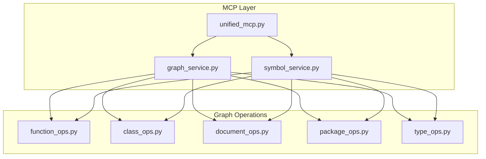
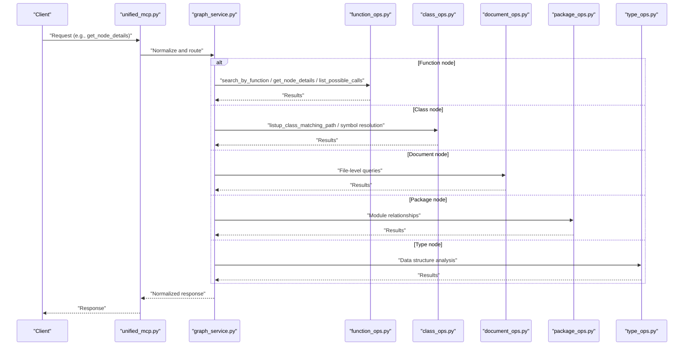
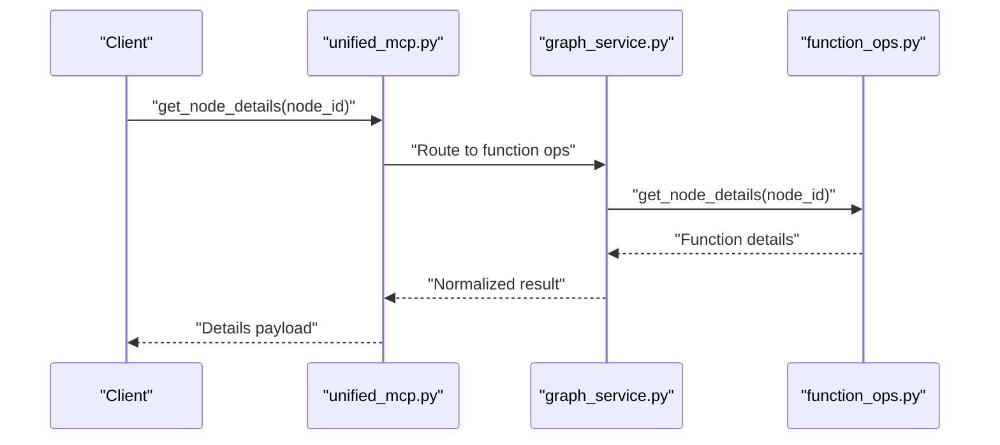
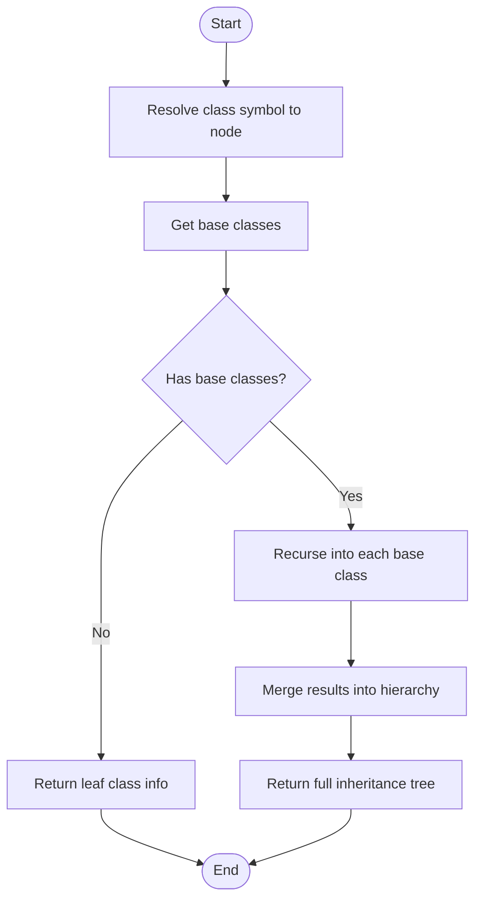
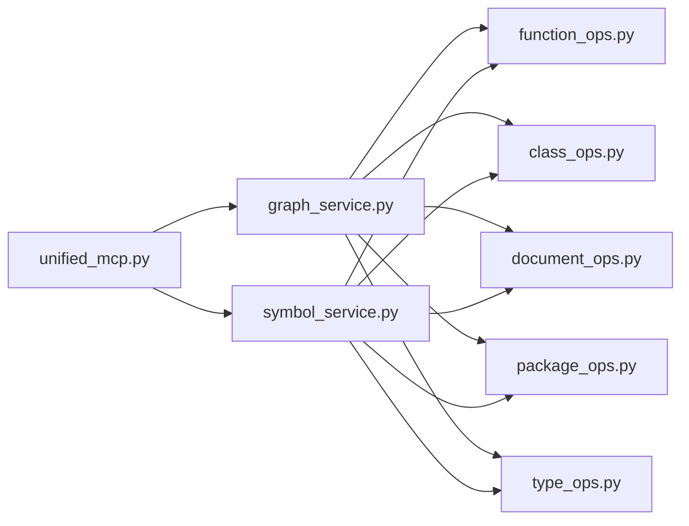

# Node Operations

<cite>
**Referenced Files in This Document**
- [function_ops.py](file://code-tiny/tools/graph/operations/function_ops.py)
- [class_ops.py](file://code-tiny/tools/graph/operations/class_ops.py)
- [document_ops.py](file://code-tiny/tools/graph/operations/document_ops.py)
- [package_ops.py](file://code-tiny/tools/graph/operations/package_ops.py)
- [type_ops.py](file://code-tiny/tools/graph/operations/type_ops.py)
- [graph_service.py](file://code-tiny/mcp/services/graph_service.py)
- [symbol_service.py](file://code-tiny/mcp/services/symbol_service.py)
- [unified_mcp.py](file://code-tiny/mcp/unified_mcp.py)
- [test_get_node_details.json](file://code-tiny/testtool/input_exam/get_node_details.json)
- [test_list_possible_calls.json](file://code-tiny/testtool/input_exam/list_possible_calls.json)
- [test_listup_class_matching_path.json](file://code-tiny/testtool/input_exam/listup_class_matching_path.json)
</cite>

## Table of Contents
1. [Introduction](#introduction)
2. [Project Structure](#project-structure)
3. [Core Components](#core-components)
4. [Architecture Overview](#architecture-overview)
5. [Detailed Component Analysis](#detailed-component-analysis)
6. [Dependency Analysis](#dependency-analysis)
7. [Performance Considerations](#performance-considerations)
8. [Troubleshooting Guide](#troubleshooting-guide)
9. [Conclusion](#conclusion)

## Introduction
This document explains node-specific operations exposed by the Cortex Harness query language and their MCP integration. It focuses on:
- Function node operations: search_by_function, get_node_details, list_possible_calls
- Class node operations: listup_class_matching_path, symbol resolution, inheritance analysis
- Document operations for file-level queries
- Package operations for module relationships
- Type operations for data structure analysis

It also provides concrete examples from the codebase to extract function signatures, analyze class hierarchies, and traverse package dependencies, along with performance considerations for large codebases.

## Project Structure
The relevant implementation is organized under a graph operations layer that exposes typed operations per node kind (function, class, document, package, type). These are consumed by MCP services which route requests to the appropriate operation modules.

**Diagram sources**
- [unified_mcp.py](file://code-tiny/mcp/unified_mcp.py)
- [graph_service.py](file://code-tiny/mcp/services/graph_service.py)
- [symbol_service.py](file://code-tiny/mcp/services/symbol_service.py)
- [function_ops.py](file://code-tiny/tools/graph/operations/function_ops.py)
- [class_ops.py](file://code-tiny/tools/graph/operations/class_ops.py)
- [document_ops.py](file://code-tiny/tools/graph/operations/document_ops.py)
- [package_ops.py](file://code-tiny/tools/graph/operations/package_ops.py)
- [type_ops.py](file://code-tiny/tools/graph/operations/type_ops.py)

**Section sources**
- [unified_mcp.py](file://code-tiny/mcp/unified_mcp.py)
- [graph_service.py](file://code-tiny/mcp/services/graph_service.py)
- [symbol_service.py](file://code-tiny/mcp/services/symbol_service.py)
- [function_ops.py](file://code-tiny/tools/graph/operations/function_ops.py)
- [class_ops.py](file://code-tiny/tools/graph/operations/class_ops.py)
- [document_ops.py](file://code-tiny/tools/graph/operations/document_ops.py)
- [package_ops.py](file://code-tiny/tools/graph/operations/package_ops.py)
- [type_ops.py](file://code-tiny/tools/graph/operations/type_ops.py)

## Core Components
- Function operations: provide search_by_function, get_node_details, list_possible_calls for locating functions, retrieving details, and enumerating call targets.
- Class operations: support listup_class_matching_path, symbol resolution, and inheritance analysis across classes.
- Document operations: enable file-level queries such as listing symbols in a file or finding nodes within a document path.
- Package operations: expose module relationship traversal including imports, exports, and dependency edges.
- Type operations: allow querying types, fields, methods, and relationships between types.

These components are invoked via MCP services that normalize inputs and dispatch to the correct operation module.

**Section sources**
- [function_ops.py](file://code-tiny/tools/graph/operations/function_ops.py)
- [class_ops.py](file://code-tiny/tools/graph/operations/class_ops.py)
- [document_ops.py](file://code-tiny/tools/graph/operations/document_ops.py)
- [package_ops.py](file://code-tiny/tools/graph/operations/package_ops.py)
- [type_ops.py](file://code-tiny/tools/graph/operations/type_ops.py)
- [graph_service.py](file://code-tiny/mcp/services/graph_service.py)
- [symbol_service.py](file://code-tiny/mcp/services/symbol_service.py)

## Architecture Overview
The MCP layer receives client requests, validates parameters, and routes them to the corresponding operation module. The operation modules interact with the underlying graph store to retrieve nodes and edges.

**Diagram sources**
- [unified_mcp.py](file://code-tiny/mcp/unified_mcp.py)
- [graph_service.py](file://code-tiny/mcp/services/graph_service.py)
- [function_ops.py](file://code-tiny/tools/graph/operations/function_ops.py)
- [class_ops.py](file://code-tiny/tools/graph/operations/class_ops.py)
- [document_ops.py](file://code-tiny/tools/graph/operations/document_ops.py)
- [package_ops.py](file://code-tiny/tools/graph/operations/package_ops.py)
- [type_ops.py](file://code-tiny/tools/graph/operations/type_ops.py)

## Detailed Component Analysis

### Function Node Operations
Key operations:
- search_by_function: locate functions by name, signature, or filters; returns matching function nodes and metadata.
- get_node_details: fetch detailed information for a specific function node (signature, parameters, return type, location).
- list_possible_calls: enumerate potential call sites or targets for a given function node.

Typical usage patterns:
- Extract function signatures by searching by name and then requesting details for each result.
- Analyze call relationships by listing possible calls for a function and traversing downstream nodes.

Concrete example references:
- Example payloads for get_node_details and list_possible_calls are provided in test fixtures.

**Section sources**
- [function_ops.py](file://code-tiny/tools/graph/operations/function_ops.py)
- [test_get_node_details.json](file://code-tiny/testtool/input_exam/get_node_details.json)
- [test_list_possible_calls.json](file://code-tiny/testtool/input_exam/list_possible_calls.json)

#### Sequence Diagram: get_node_details Flow

**Diagram sources**
- [unified_mcp.py](file://code-tiny/mcp/unified_mcp.py)
- [graph_service.py](file://code-tiny/mcp/services/graph_service.py)
- [function_ops.py](file://code-tiny/tools/graph/operations/function_ops.py)

### Class Node Operations
Key operations:
- listup_class_matching_path: find classes whose paths match a pattern or filter; useful for scoped exploration.
- Symbol resolution: resolve class symbols to canonical nodes and related entities.
- Inheritance analysis: traverse superclass/subclass relationships to build hierarchy trees.

Typical usage patterns:
- Discover all classes under a package prefix using listup_class_matching_path.
- Build an inheritance tree by resolving base classes and recursively analyzing derived classes.

Concrete example references:
- A test fixture demonstrates listup_class_matching_path usage.

**Section sources**
- [class_ops.py](file://code-tiny/tools/graph/operations/class_ops.py)
- [test_listup_class_matching_path.json](file://code-tiny/testtool/input_exam/listup_class_matching_path.json)

#### Flowchart: Inheritance Analysis

**Diagram sources**
- [class_ops.py](file://code-tiny/tools/graph/operations/class_ops.py)

### Document Operations
Capabilities:
- File-level queries: list symbols in a file, find nodes by document path, retrieve content boundaries.
- Cross-file navigation: jump from a symbol to its definition or usages across files.

Typical usage patterns:
- Enumerate symbols within a specific file path.
- Locate a function or class node by its file path and identifier.

**Section sources**
- [document_ops.py](file://code-tiny/tools/graph/operations/document_ops.py)

### Package Operations
Capabilities:
- Module relationships: imports, exports, and dependency edges between packages/modules.
- Dependency traversal: walk upstream/downstream dependencies to understand coupling.

Typical usage patterns:
- List direct dependencies of a package.
- Compute transitive dependencies for impact analysis.

**Section sources**
- [package_ops.py](file://code-tiny/tools/graph/operations/package_ops.py)

### Type Operations
Capabilities:
- Data structure analysis: query types, fields, methods, and relationships.
- Type inference context: associate types with symbols and nodes for richer semantics.

Typical usage patterns:
- Retrieve all fields and methods of a type.
- Find usages of a type across the codebase.

**Section sources**
- [type_ops.py](file://code-tiny/tools/graph/operations/type_ops.py)

## Dependency Analysis
The MCP services depend on the operation modules, which encapsulate node-specific logic. The unified entry point coordinates routing and normalization.

**Diagram sources**
- [unified_mcp.py](file://code-tiny/mcp/unified_mcp.py)
- [graph_service.py](file://code-tiny/mcp/services/graph_service.py)
- [symbol_service.py](file://code-tiny/mcp/services/symbol_service.py)
- [function_ops.py](file://code-tiny/tools/graph/operations/function_ops.py)
- [class_ops.py](file://code-tiny/tools/graph/operations/class_ops.py)
- [document_ops.py](file://code-tiny/tools/graph/operations/document_ops.py)
- [package_ops.py](file://code-tiny/tools/graph/operations/package_ops.py)
- [type_ops.py](file://code-tiny/tools/graph/operations/type_ops.py)

**Section sources**
- [unified_mcp.py](file://code-tiny/mcp/unified_mcp.py)
- [graph_service.py](file://code-tiny/mcp/services/graph_service.py)
- [symbol_service.py](file://code-tiny/mcp/services/symbol_service.py)
- [function_ops.py](file://code-tiny/tools/graph/operations/function_ops.py)
- [class_ops.py](file://code-tiny/tools/graph/operations/class_ops.py)
- [document_ops.py](file://code-tiny/tools/graph/operations/document_ops.py)
- [package_ops.py](file://code-tiny/tools/graph/operations/package_ops.py)
- [type_ops.py](file://code-tiny/tools/graph/operations/type_ops.py)

## Performance Considerations
- Prefer targeted searches: use precise filters (name, path, scope) to reduce result sets early.
- Paginate and limit results: avoid returning massive lists; request only what you need.
- Cache frequent lookups: reuse resolved symbols and class hierarchies where possible.
- Batch operations: group related queries to minimize round-trips to the graph store.
- Avoid deep recursion without bounds: set depth limits for inheritance and dependency traversal.
- Use indexes effectively: ensure queries leverage existing indexes (e.g., by name, path, type).
- Profile hot paths: measure latency for common operations like list_possible_calls and adjust filters accordingly.

[No sources needed since this section provides general guidance]

## Troubleshooting Guide
Common issues and remedies:
- Empty results: verify input identifiers and scopes; confirm the node exists in the graph.
- Slow responses: refine filters, add pagination, or reduce traversal depth.
- Inconsistent symbol resolution: check symbol naming conventions and ensure proper normalization before lookup.
- Missing inheritance edges: validate that base class relationships were indexed during ingestion.

Operational checks:
- Validate request payloads against known fixtures (e.g., get_node_details, list_possible_calls, listup_class_matching_path).
- Confirm MCP service routing is correctly configured in the unified entry point.

**Section sources**
- [test_get_node_details.json](file://code-tiny/testtool/input_exam/get_node_details.json)
- [test_list_possible_calls.json](file://code-tiny/testtool/input_exam/list_possible_calls.json)
- [test_listup_class_matching_path.json](file://code-tiny/testtool/input_exam/listup_class_matching_path.json)
- [unified_mcp.py](file://code-tiny/mcp/unified_mcp.py)
- [graph_service.py](file://code-tiny/mcp/services/graph_service.py)
- [symbol_service.py](file://code-tiny/mcp/services/symbol_service.py)

## Conclusion
Cortex Harness organizes node-specific operations into focused modules accessible via MCP services. By leveraging function, class, document, package, and type operations, users can extract signatures, analyze hierarchies, and traverse dependencies efficiently. Applying the performance strategies and troubleshooting steps outlined here will help maintain responsiveness and reliability at scale.

[No sources needed since this section summarizes without analyzing specific files]