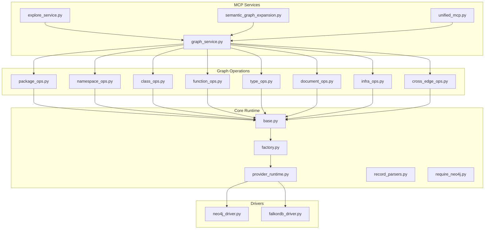
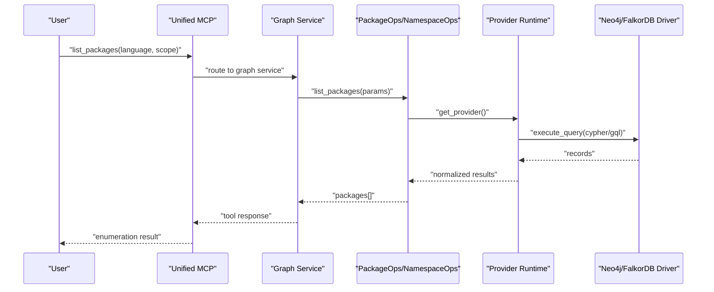
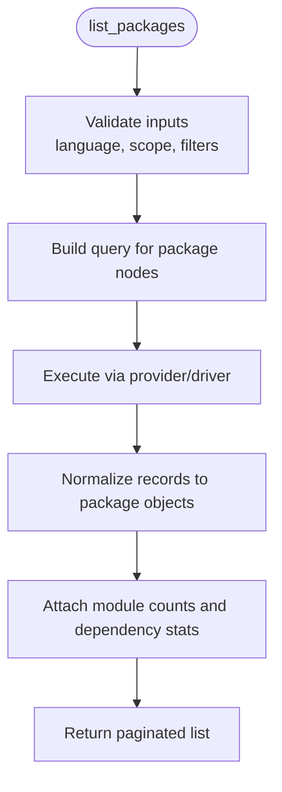
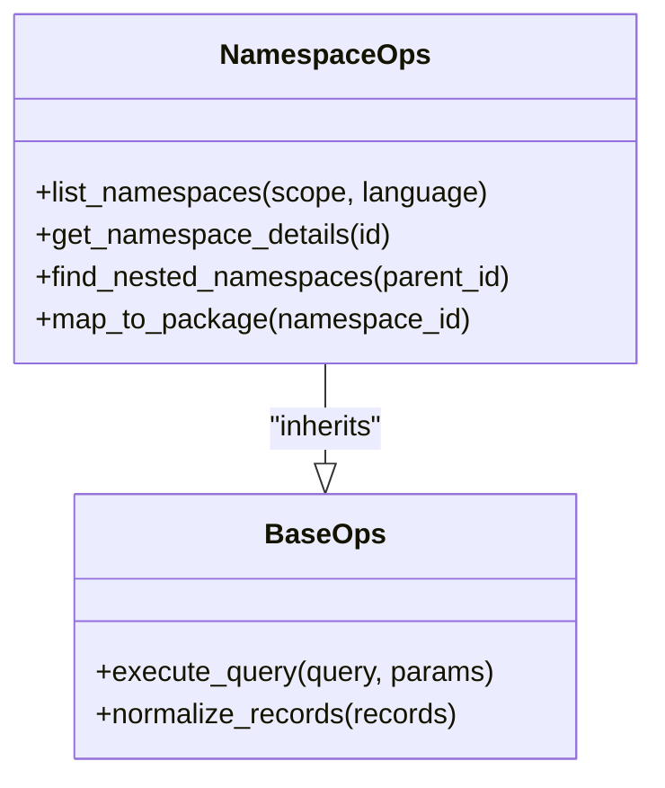
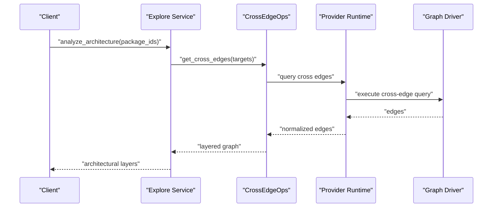
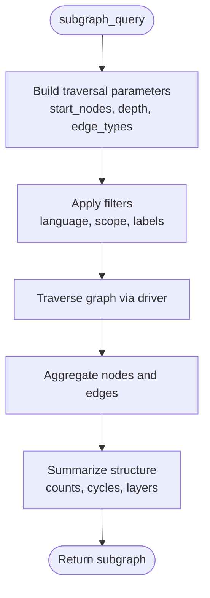
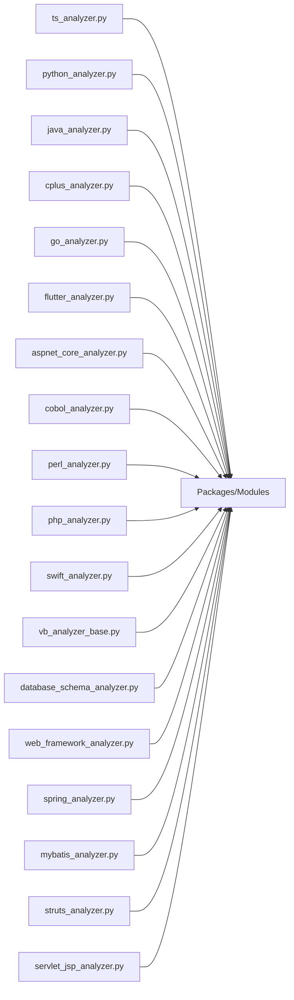
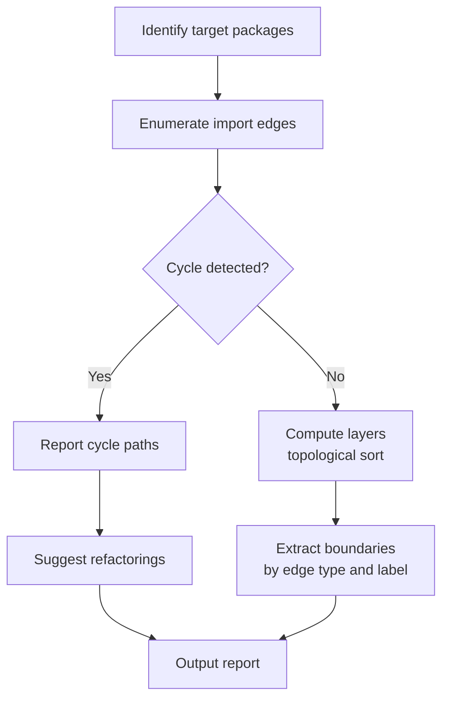

# Package Node Operations

<cite>
**Referenced Files in This Document**
- [package_ops.py](file://code-tiny/tools/graph/operations/package_ops.py)
- [namespace_ops.py](file://code-tiny/tools/graph/operations/namespace_ops.py)
- [class_ops.py](file://code-tiny/tools/graph/operations/class_ops.py)
- [function_ops.py](file://code-tiny/tools/graph/operations/function_ops.py)
- [type_ops.py](file://code-tiny/tools/graph/operations/type_ops.py)
- [document_ops.py](file://code-tiny/tools/graph/operations/document_ops.py)
- [infra_ops.py](file://code-tiny/tools/graph/operations/infra_ops.py)
- [cross_edge_ops.py](file://code-tiny/tools/graph/operations/cross_edge_ops.py)
- [__init__.py](file://code-tiny/tools/graph/operations/__init__.py)
- [base.py](file://code-tiny/tools/graph/core/base.py)
- [factory.py](file://code-tiny/tools/graph/core/factory.py)
- [provider_runtime.py](file://code-tiny/tools/graph/core/provider_runtime.py)
- [record_parsers.py](file://code-tiny/tools/graph/core/record_parsers.py)
- [require_neo4j.py](file://code-tiny/tools/graph/core/require_neo4j.py)
- [neo4j_driver.py](file://code-tiny/tools/graph/driver/neo4j_driver.py)
- [falkordb_driver.py](file://code-tiny/tools/graph/driver/falkordb_driver.py)
- [graph_service.py](file://code-tiny/mcp/services/graph_service.py)
- [explore_service.py](file://code-tiny/mcp/services/explore_service.py)
- [semantic_graph_expansion.py](file://code-tiny/mcp/semantic_graph_expansion.py)
- [unified_mcp.py](file://code-tiny/mcp/unified_mcp.py)
- [ts_analyzer.py](file://code-tiny/tools/ts/ts_analyzer.py)
- [python_analyzer.py](file://code-tiny/tools/python/python_analyzer.py)
- [java_analyzer.py](file://code-tiny/tools/java/java_analyzer.py)
- [cplus_analyzer.py](file://code-tiny/tools/cplus/cplus_analyzer.py)
- [go_analyzer.py](file://code-tiny/tools/go/go_analyzer.py)
- [flutter_analyzer.py](file://code-tiny/tools/flutter/flutter_analyzer.py)
- [aspnet_core_analyzer.py](file://code-tiny/tools/aspnet_core/aspnet_core_analyzer.py)
- [cobol_analyzer.py](file://code-tiny/tools/cobol/cobol_analyzer.py)
- [perl_analyzer.py](file://code-tiny/tools/perl/perl_analyzer.py)
- [php_analyzer.py](file://code-tiny/tools/php/php_analyzer.py)
- [swift_analyzer.py](file://code-tiny/tools/swift/swift_analyzer.py)
- [vb_analyzer_base.py](file://code-tiny/tools/vb/vb_analyzer_base.py)
- [database_schema_analyzer.py](file://code-tiny/tools/database_schema/database_schema_analyzer.py)
- [web_framework_analyzer.py](file://code-tiny/tools/web_framework/web_framework_analyzer.py)
- [spring_analyzer.py](file://code-tiny/tools/spring/spring_analyzer.py)
- [mybatis_analyzer.py](file://code-tiny/tools/mybatis/mybatis_analyzer.py)
- [struts_analyzer.py](file://code-tiny/tools/struts/struts_analyzer.py)
- [servlet_jsp_analyzer.py](file://code-tiny/tools/servlet_jsp/servlet_jsp_analyzer.py)
- [harness_config.py](file://code-tiny/tools/common/harness_config.py)
- [source_inventory.py](file://code-tiny/tools/common/source_inventory.py)
- [sync_scope.py](file://code-tiny/tools/common/sync_scope.py)
- [incremental_sync_state.py](file://code-tiny/tools/common/incremental_sync_state.py)
- [analyzer_cache.py](file://code-tiny/tools/common/analyzer_cache.py)
- [query_understanding.py](file://code-tiny/tools/common/query_understanding.py)
- [intelligent_retrieval.py](file://code-tiny/tools/common/intelligent_retrieval.py)
</cite>

## Table of Contents
1. [Introduction](#introduction)
2. [Project Structure](#project-structure)
3. [Core Components](#core-components)
4. [Architecture Overview](#architecture-overview)
5. [Detailed Component Analysis](#detailed-component-analysis)
6. [Dependency Analysis](#dependency-analysis)
7. [Performance Considerations](#performance-considerations)
8. [Troubleshooting Guide](#troubleshooting-guide)
9. [Conclusion](#conclusion)
10. [Appendices](#appendices)

## Introduction
This document explains package node operations in Cortex Harness with a focus on discovery, enumeration, relationship analysis, and subgraph querying across multiple programming languages. It covers how packages, modules, and namespaces are discovered and listed; how import dependencies and architectural boundaries are modeled; and how to query subgraphs for architecture exploration. Practical examples demonstrate analyzing structures, identifying circular dependencies, and extracting boundaries. The document also addresses language-specific package managers and build systems, and scalability considerations for monorepos and multi-language projects.

## Project Structure
Cortex Harness organizes graph operations under a dedicated module that exposes typed operations for nodes such as packages, namespaces, classes, functions, types, documents, infrastructure, and cross-language edges. These operations are implemented against pluggable graph drivers (Neo4j and FalkorDB). Language analyzers populate the graph with package/module/namespace nodes and their relationships. MCP services expose these capabilities via tools for interactive exploration and automation.

**Diagram sources**
- [package_ops.py:1-200](file://code-tiny/tools/graph/operations/package_ops.py#L1-L200)
- [namespace_ops.py:1-200](file://code-tiny/tools/graph/operations/namespace_ops.py#L1-L200)
- [class_ops.py:1-200](file://code-tiny/tools/graph/operations/class_ops.py#L1-L200)
- [function_ops.py:1-200](file://code-tiny/tools/graph/operations/function_ops.py#L1-L200)
- [type_ops.py:1-200](file://code-tiny/tools/graph/operations/type_ops.py#L1-L200)
- [document_ops.py:1-200](file://code-tiny/tools/graph/operations/document_ops.py#L1-L200)
- [infra_ops.py:1-200](file://code-tiny/tools/graph/operations/infra_ops.py#L1-L200)
- [cross_edge_ops.py:1-200](file://code-tiny/tools/graph/operations/cross_edge_ops.py#L1-L200)
- [base.py:1-200](file://code-tiny/tools/graph/core/base.py#L1-L200)
- [factory.py:1-200](file://code-tiny/tools/graph/core/factory.py#L1-L200)
- [provider_runtime.py:1-200](file://code-tiny/tools/graph/core/provider_runtime.py#L1-L200)
- [record_parsers.py:1-200](file://code-tiny/tools/graph/core/record_parsers.py#L1-L200)
- [require_neo4j.py:1-200](file://code-tiny/tools/graph/core/require_neo4j.py#L1-L200)
- [neo4j_driver.py:1-200](file://code-tiny/tools/graph/driver/neo4j_driver.py#L1-L200)
- [falkordb_driver.py:1-200](file://code-tiny/tools/graph/driver/falkordb_driver.py#L1-L200)
- [graph_service.py:1-200](file://code-tiny/mcp/services/graph_service.py#L1-L200)
- [explore_service.py:1-200](file://code-tiny/mcp/services/explore_service.py#L1-L200)
- [semantic_graph_expansion.py:1-200](file://code-tiny/mcp/semantic_graph_expansion.py#L1-L200)
- [unified_mcp.py:1-200](file://code-tiny/mcp/unified_mcp.py#L1-L200)

**Section sources**
- [package_ops.py:1-200](file://code-tiny/tools/graph/operations/package_ops.py#L1-L200)
- [namespace_ops.py:1-200](file://code-tiny/tools/graph/operations/namespace_ops.py#L1-L200)
- [class_ops.py:1-200](file://code-tiny/tools/graph/operations/class_ops.py#L1-L200)
- [function_ops.py:1-200](file://code-tiny/tools/graph/operations/function_ops.py#L1-L200)
- [type_ops.py:1-200](file://code-tiny/tools/graph/operations/type_ops.py#L1-L200)
- [document_ops.py:1-200](file://code-tiny/tools/graph/operations/document_ops.py#L1-L200)
- [infra_ops.py:1-200](file://code-tiny/tools/graph/operations/infra_ops.py#L1-L200)
- [cross_edge_ops.py:1-200](file://code-tiny/tools/graph/operations/cross_edge_ops.py#L1-L200)
- [base.py:1-200](file://code-tiny/tools/graph/core/base.py#L1-L200)
- [factory.py:1-200](file://code-tiny/tools/graph/core/factory.py#L1-L200)
- [provider_runtime.py:1-200](file://code-tiny/tools/graph/core/provider_runtime.py#L1-L200)
- [record_parsers.py:1-200](file://code-tiny/tools/graph/core/record_parsers.py#L1-L200)
- [require_neo4j.py:1-200](file://code-tiny/tools/graph/core/require_neo4j.py#L1-L200)
- [neo4j_driver.py:1-200](file://code-tiny/tools/graph/driver/neo4j_driver.py#L1-L200)
- [falkordb_driver.py:1-200](file://code-tiny/tools/graph/driver/falkordb_driver.py#L1-L200)
- [graph_service.py:1-200](file://code-tiny/mcp/services/graph_service.py#L1-L200)
- [explore_service.py:1-200](file://code-tiny/mcp/services/explore_service.py#L1-L200)
- [semantic_graph_expansion.py:1-200](file://code-tiny/mcp/semantic_graph_expansion.py#L1-L200)
- [unified_mcp.py:1-200](file://code-tiny/mcp/unified_mcp.py#L1-L200)

## Core Components
- Graph operation modules provide typed APIs for creating, reading, updating, deleting, and traversing package-related nodes and edges. They encapsulate driver calls and normalize results into consistent records.
- Core runtime provides a common base class, a provider factory, and runtime utilities for parsing records and enforcing requirements (e.g., database connectivity).
- Drivers abstract the underlying graph store (Neo4j or FalkorDB), exposing a uniform interface for queries and mutations.
- MCP services wrap operations into tools for listing packages/modules/namespaces, exploring dependencies, and running subgraph queries.

Key responsibilities:
- Discovery and enumeration: list packages, modules, namespaces by language and scope.
- Relationship analysis: model imports, requires, depends-on, and framework overlays.
- Subgraph querying: traverse from packages to files, symbols, and cross-language edges.
- Scalability: support incremental sync, caching, and scoped indexing for large codebases.

**Section sources**
- [package_ops.py:1-200](file://code-tiny/tools/graph/operations/package_ops.py#L1-L200)
- [namespace_ops.py:1-200](file://code-tiny/tools/graph/operations/namespace_ops.py#L1-L200)
- [base.py:1-200](file://code-tiny/tools/graph/core/base.py#L1-L200)
- [factory.py:1-200](file://code-tiny/tools/graph/core/factory.py#L1-L200)
- [provider_runtime.py:1-200](file://code-tiny/tools/graph/core/provider_runtime.py#L1-L200)
- [record_parsers.py:1-200](file://code-tiny/tools/graph/core/record_parsers.py#L1-L200)
- [require_neo4j.py:1-200](file://code-tiny/tools/graph/core/require_neo4j.py#L1-L200)
- [neo4j_driver.py:1-200](file://code-tiny/tools/graph/driver/neo4j_driver.py#L1-L200)
- [falkordb_driver.py:1-200](file://code-tiny/tools/graph/driver/falkordb_driver.py#L1-L200)
- [graph_service.py:1-200](file://code-tiny/mcp/services/graph_service.py#L1-L200)
- [explore_service.py:1-200](file://code-tiny/mcp/services/explore_service.py#L1-L200)

## Architecture Overview
The system follows a layered architecture:
- Analyzers parse source code and build package/module/namespace nodes and edges.
- Graph operations provide CRUD and traversal APIs over these nodes.
- Providers route requests to the selected graph driver.
- MCP services expose tool endpoints for discovery, enumeration, and subgraph queries.

**Diagram sources**
- [unified_mcp.py:1-200](file://code-tiny/mcp/unified_mcp.py#L1-L200)
- [graph_service.py:1-200](file://code-tiny/mcp/services/graph_service.py#L1-L200)
- [package_ops.py:1-200](file://code-tiny/tools/graph/operations/package_ops.py#L1-L200)
- [namespace_ops.py:1-200](file://code-tiny/tools/graph/operations/namespace_ops.py#L1-L200)
- [provider_runtime.py:1-200](file://code-tiny/tools/graph/core/provider_runtime.py#L1-L200)
- [neo4j_driver.py:1-200](file://code-tiny/tools/graph/driver/neo4j_driver.py#L1-L200)
- [falkordb_driver.py:1-200](file://code-tiny/tools/graph/driver/falkordb_driver.py#L1-L200)

## Detailed Component Analysis

### Package Operations
Package operations implement discovery and enumeration of packages, modules, and related metadata. Typical capabilities include:
- Listing packages by language, path prefix, or project root.
- Enumerating modules within a package.
- Resolving package-level attributes (language, version, manifest references).
- Traversing import dependencies at the package boundary.

**Diagram sources**
- [package_ops.py:1-200](file://code-tiny/tools/graph/operations/package_ops.py#L1-L200)
- [provider_runtime.py:1-200](file://code-tiny/tools/graph/core/provider_runtime.py#L1-L200)
- [record_parsers.py:1-200](file://code-tiny/tools/graph/core/record_parsers.py#L1-L200)

**Section sources**
- [package_ops.py:1-200](file://code-tiny/tools/graph/operations/package_ops.py#L1-L200)
- [record_parsers.py:1-200](file://code-tiny/tools/graph/core/record_parsers.py#L1-L200)

### Namespace Operations
Namespace operations handle hierarchical scoping for languages that use namespaces (e.g., C#, PHP, Swift). Capabilities include:
- Listing namespaces under a package or module.
- Enumerating nested namespaces.
- Mapping namespace-to-package/module boundaries.

**Diagram sources**
- [namespace_ops.py:1-200](file://code-tiny/tools/graph/operations/namespace_ops.py#L1-L200)
- [base.py:1-200](file://code-tiny/tools/graph/core/base.py#L1-L200)

**Section sources**
- [namespace_ops.py:1-200](file://code-tiny/tools/graph/operations/namespace_ops.py#L1-L200)
- [base.py:1-200](file://code-tiny/tools/graph/core/base.py#L1-L200)

### Cross-Language Edges and Architectural Layering
Cross-edge operations model relationships between packages/modules across languages and frameworks. This enables architectural layering analysis (e.g., UI -> API -> Data).

**Diagram sources**
- [cross_edge_ops.py:1-200](file://code-tiny/tools/graph/operations/cross_edge_ops.py#L1-L200)
- [explore_service.py:1-200](file://code-tiny/mcp/services/explore_service.py#L1-L200)
- [provider_runtime.py:1-200](file://code-tiny/tools/graph/core/provider_runtime.py#L1-L200)
- [neo4j_driver.py:1-200](file://code-tiny/tools/graph/driver/neo4j_driver.py#L1-L200)
- [falkordb_driver.py:1-200](file://code-tiny/tools/graph/driver/falkordb_driver.py#L1-L200)

**Section sources**
- [cross_edge_ops.py:1-200](file://code-tiny/tools/graph/operations/cross_edge_ops.py#L1-L200)
- [explore_service.py:1-200](file://code-tiny/mcp/services/explore_service.py#L1-L200)

### Subgraph Querying for Architecture Exploration
Subgraph queries allow targeted exploration around packages, modules, and namespaces. Use cases include:
- Finding all direct and transitive import dependencies of a package.
- Identifying upstream/downstream consumers.
- Extracting architectural boundaries by filtering edge types.

**Diagram sources**
- [graph_service.py:1-200](file://code-tiny/mcp/services/graph_service.py#L1-L200)
- [semantic_graph_expansion.py:1-200](file://code-tiny/mcp/semantic_graph_expansion.py#L1-L200)
- [package_ops.py:1-200](file://code-tiny/tools/graph/operations/package_ops.py#L1-L200)
- [namespace_ops.py:1-200](file://code-tiny/tools/graph/operations/namespace_ops.py#L1-L200)

**Section sources**
- [graph_service.py:1-200](file://code-tiny/mcp/services/graph_service.py#L1-L200)
- [semantic_graph_expansion.py:1-200](file://code-tiny/mcp/semantic_graph_expansion.py#L1-L200)
- [package_ops.py:1-200](file://code-tiny/tools/graph/operations/package_ops.py#L1-L200)
- [namespace_ops.py:1-200](file://code-tiny/tools/graph/operations/namespace_ops.py#L1-L200)

### Language-Specific Support and Build Systems
Language analyzers detect and enumerate packages/modules/namespaces using language-specific conventions and build artifacts. Examples include:
- TypeScript/JavaScript: project detection and module resolution.
- Python: package discovery via manifests and import graphs.
- Java/Kotlin/Spring: Maven/Gradle integration and annotation-driven mapping.
- .NET/ASP.NET Core: MSBuild/project file parsing.
- Go: go.mod-based module enumeration.
- Flutter/Dart: pubspec.yaml and analyzer integration.
- C/C++: compile_commands.json and header includes.
- COBOL/Perl/PHP/Swift/VB: dialect-specific parsers and resolvers.
- Database schemas and web frameworks: overlay semantics for additional boundaries.

**Diagram sources**
- [ts_analyzer.py:1-200](file://code-tiny/tools/ts/ts_analyzer.py#L1-L200)
- [python_analyzer.py:1-200](file://code-tiny/tools/python/python_analyzer.py#L1-L200)
- [java_analyzer.py:1-200](file://code-tiny/tools/java/java_analyzer.py#L1-L200)
- [cplus_analyzer.py:1-200](file://code-tiny/tools/cplus/cplus_analyzer.py#L1-L200)
- [go_analyzer.py:1-200](file://code-tiny/tools/go/go_analyzer.py#L1-L200)
- [flutter_analyzer.py:1-200](file://code-tiny/tools/flutter/flutter_analyzer.py#L1-L200)
- [aspnet_core_analyzer.py:1-200](file://code-tiny/tools/aspnet_core/aspnet_core_analyzer.py#L1-L200)
- [cobol_analyzer.py:1-200](file://code-tiny/tools/cobol/cobol_analyzer.py#L1-L200)
- [perl_analyzer.py:1-200](file://code-tiny/tools/perl/perl_analyzer.py#L1-L200)
- [php_analyzer.py:1-200](file://code-tiny/tools/php/php_analyzer.py#L1-L200)
- [swift_analyzer.py:1-200](file://code-tiny/tools/swift/swift_analyzer.py#L1-L200)
- [vb_analyzer_base.py:1-200](file://code-tiny/tools/vb/vb_analyzer_base.py#L1-L200)
- [database_schema_analyzer.py:1-200](file://code-tiny/tools/database_schema/database_schema_analyzer.py#L1-L200)
- [web_framework_analyzer.py:1-200](file://code-tiny/tools/web_framework/web_framework_analyzer.py#L1-L200)
- [spring_analyzer.py:1-200](file://code-tiny/tools/spring/spring_analyzer.py#L1-L200)
- [mybatis_analyzer.py:1-200](file://code-tiny/tools/mybatis/mybatis_analyzer.py#L1-L200)
- [struts_analyzer.py:1-200](file://code-tiny/tools/struts/struts_analyzer.py#L1-L200)
- [servlet_jsp_analyzer.py:1-200](file://code-tiny/tools/servlet_jsp/servlet_jsp_analyzer.py#L1-L200)

**Section sources**
- [ts_analyzer.py:1-200](file://code-tiny/tools/ts/ts_analyzer.py#L1-L200)
- [python_analyzer.py:1-200](file://code-tiny/tools/python/python_analyzer.py#L1-L200)
- [java_analyzer.py:1-200](file://code-tiny/tools/java/java_analyzer.py#L1-L200)
- [cplus_analyzer.py:1-200](file://code-tiny/tools/cplus/cplus_analyzer.py#L1-L200)
- [go_analyzer.py:1-200](file://code-tiny/tools/go/go_analyzer.py#L1-L200)
- [flutter_analyzer.py:1-200](file://code-tiny/tools/flutter/flutter_analyzer.py#L1-L200)
- [aspnet_core_analyzer.py:1-200](file://code-tiny/tools/aspnet_core/aspnet_core_analyzer.py#L1-L200)
- [cobol_analyzer.py:1-200](file://code-tiny/tools/cobol/cobol_analyzer.py#L1-L200)
- [perl_analyzer.py:1-200](file://code-tiny/tools/perl/perl_analyzer.py#L1-L200)
- [php_analyzer.py:1-200](file://code-tiny/tools/php/php_analyzer.py#L1-L200)
- [swift_analyzer.py:1-200](file://code-tiny/tools/swift/swift_analyzer.py#L1-L200)
- [vb_analyzer_base.py:1-200](file://code-tiny/tools/vb/vb_analyzer_base.py#L1-L200)
- [database_schema_analyzer.py:1-200](file://code-tiny/tools/database_schema/database_schema_analyzer.py#L1-L200)
- [web_framework_analyzer.py:1-200](file://code-tiny/tools/web_framework/web_framework_analyzer.py#L1-L200)
- [spring_analyzer.py:1-200](file://code-tiny/tools/spring/spring_analyzer.py#L1-L200)
- [mybatis_analyzer.py:1-200](file://code-tiny/tools/mybatis/mybatis_analyzer.py#L1-L200)
- [struts_analyzer.py:1-200](file://code-tiny/tools/struts/struts_analyzer.py#L1-L200)
- [servlet_jsp_analyzer.py:1-200](file://code-tiny/tools/servlet_jsp/servlet_jsp_analyzer.py#L1-L200)

## Dependency Analysis
Package-level dependency analysis leverages import edges and cross-language relations to identify architectural boundaries and potential issues like circular dependencies.

**Diagram sources**
- [package_ops.py:1-200](file://code-tiny/tools/graph/operations/package_ops.py#L1-L200)
- [cross_edge_ops.py:1-200](file://code-tiny/tools/graph/operations/cross_edge_ops.py#L1-L200)
- [explore_service.py:1-200](file://code-tiny/mcp/services/explore_service.py#L1-L200)

Practical examples:
- Analyze package structures: list packages per language, then drill into modules and namespaces.
- Identify circular dependencies: run subgraph queries centered on suspected packages and inspect cycles.
- Extract architectural boundaries: filter edges by type (import, requires, depends-on) and group by layer labels.

**Section sources**
- [package_ops.py:1-200](file://code-tiny/tools/graph/operations/package_ops.py#L1-L200)
- [cross_edge_ops.py:1-200](file://code-tiny/tools/graph/operations/cross_edge_ops.py#L1-L200)
- [explore_service.py:1-200](file://code-tiny/mcp/services/explore_service.py#L1-L200)

## Performance Considerations
Scalability strategies for monorepo and multi-language environments:
- Incremental synchronization: update only changed packages/modules to reduce scan time.
- Caching: cache resolved manifests and parsed artifacts to avoid repeated work.
- Scoped indexing: limit queries to specific languages, roots, or path prefixes.
- Pagination and batching: return large enumerations in pages and batch subgraph traversals.
- Driver selection: choose FalkorDB for high-throughput graph operations when appropriate.

Supporting components:
- Source inventory and sync scope management for efficient change detection.
- Analyzer cache for storing intermediate results.
- Provider runtime abstraction to switch drivers without changing operation logic.

**Section sources**
- [source_inventory.py:1-200](file://code-tiny/tools/common/source_inventory.py#L1-L200)
- [sync_scope.py:1-200](file://code-tiny/tools/common/sync_scope.py#L1-L200)
- [incremental_sync_state.py:1-200](file://code-tiny/tools/common/incremental_sync_state.py#L1-L200)
- [analyzer_cache.py:1-200](file://code-tiny/tools/common/analyzer_cache.py#L1-L200)
- [provider_runtime.py:1-200](file://code-tiny/tools/graph/core/provider_runtime.py#L1-L200)
- [neo4j_driver.py:1-200](file://code-tiny/tools/graph/driver/neo4j_driver.py#L1-L200)
- [falkordb_driver.py:1-200](file://code-tiny/tools/graph/driver/falkordb_driver.py#L1-L200)

## Troubleshooting Guide
Common issues and resolutions:
- Missing graph provider: ensure the required driver is configured and reachable.
- Incomplete package discovery: verify language analyzers are enabled and build artifacts exist (e.g., lockfiles, manifests).
- Slow enumeration: apply scopes and pagination; enable caching and incremental sync.
- Incorrect boundaries: review cross-edge types and framework overlays; adjust filters in subgraph queries.

Operational checks:
- Validate configuration and environment variables for harness settings.
- Confirm indexes and constraints exist for performance-critical queries.
- Inspect logs for analyzer errors and recovery behavior.

**Section sources**
- [harness_config.py:1-200](file://code-tiny/tools/common/harness_config.py#L1-L200)
- [require_neo4j.py:1-200](file://code-tiny/tools/graph/core/require_neo4j.py#L1-L200)
- [graph_service.py:1-200](file://code-tiny/mcp/services/graph_service.py#L1-L200)

## Conclusion
Cortex Harness provides robust package node operations for discovery, enumeration, and relationship analysis across many languages. By leveraging graph operations, providers, and MCP services, teams can explore architectures, detect circular dependencies, and extract meaningful boundaries. With incremental sync, caching, and scoped queries, the system scales effectively for monorepos and multi-language projects.

## Appendices

### Practical Examples

- List packages by language and scope:
  - Use the package listing tool to enumerate packages filtered by language and path prefix.
  - Reference: [graph_service.py:1-200](file://code-tiny/mcp/services/graph_service.py#L1-L200), [package_ops.py:1-200](file://code-tiny/tools/graph/operations/package_ops.py#L1-L200)

- Enumerate modules and namespaces:
  - Drill down from packages to modules and namespaces using namespace operations.
  - Reference: [namespace_ops.py:1-200](file://code-tiny/tools/graph/operations/namespace_ops.py#L1-L200)

- Analyze import dependencies:
  - Run subgraph queries to collect import edges and compute layers.
  - Reference: [explore_service.py:1-200](file://code-tiny/mcp/services/explore_service.py#L1-L200), [cross_edge_ops.py:1-200](file://code-tiny/tools/graph/operations/cross_edge_ops.py#L1-L200)

- Identify circular dependencies:
  - Focus subgraph queries on suspect packages and inspect cycles in returned edges.
  - Reference: [semantic_graph_expansion.py:1-200](file://code-tiny/mcp/semantic_graph_expansion.py#L1-L200)

- Extract architectural boundaries:
  - Filter edges by type and labels to separate UI, API, and data layers.
  - Reference: [graph_service.py:1-200](file://code-tiny/mcp/services/graph_service.py#L1-L200)

- Multi-language setup:
  - Ensure relevant analyzers are active and build artifacts are present for each language.
  - Reference: [ts_analyzer.py:1-200](file://code-tiny/tools/ts/ts_analyzer.py#L1-L200), [python_analyzer.py:1-200](file://code-tiny/tools/python/python_analyzer.py#L1-L200), [java_analyzer.py:1-200](file://code-tiny/tools/java/java_analyzer.py#L1-L200), [cplus_analyzer.py:1-200](file://code-tiny/tools/cplus/cplus_analyzer.py#L1-L200), [go_analyzer.py:1-200](file://code-tiny/tools/go/go_analyzer.py#L1-L200), [flutter_analyzer.py:1-200](file://code-tiny/tools/flutter/flutter_analyzer.py#L1-L200), [aspnet_core_analyzer.py:1-200](file://code-tiny/tools/aspnet_core/aspnet_core_analyzer.py#L1-L200), [cobol_analyzer.py:1-200](file://code-tiny/tools/cobol/cobol_analyzer.py#L1-L200), [perl_analyzer.py:1-200](file://code-tiny/tools/perl/perl_analyzer.py#L1-L200), [php_analyzer.py:1-200](file://code-tiny/tools/php/php_analyzer.py#L1-L200), [swift_analyzer.py:1-200](file://code-tiny/tools/swift/swift_analyzer.py#L1-L200), [vb_analyzer_base.py:1-200](file://code-tiny/tools/vb/vb_analyzer_base.py#L1-L200), [database_schema_analyzer.py:1-200](file://code-tiny/tools/database_schema/database_schema_analyzer.py#L1-L200), [web_framework_analyzer.py:1-200](file://code-tiny/tools/web_framework/web_framework_analyzer.py#L1-L200), [spring_analyzer.py:1-200](file://code-tiny/tools/spring/spring_analyzer.py#L1-L200), [mybatis_analyzer.py:1-200](file://code-tiny/tools/mybatis/mybatis_analyzer.py#L1-L200), [struts_analyzer.py:1-200](file://code-tiny/tools/struts/struts_analyzer.py#L1-L200), [servlet_jsp_analyzer.py:1-200](file://code-tiny/tools/servlet_jsp/servlet_jsp_analyzer.py#L1-L200)