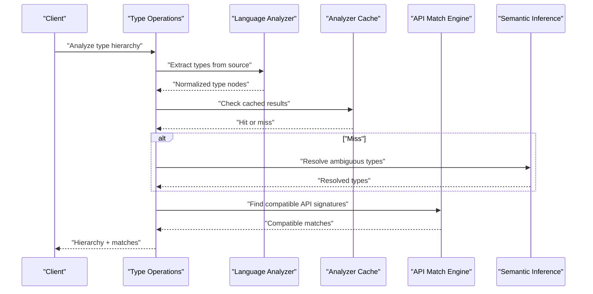
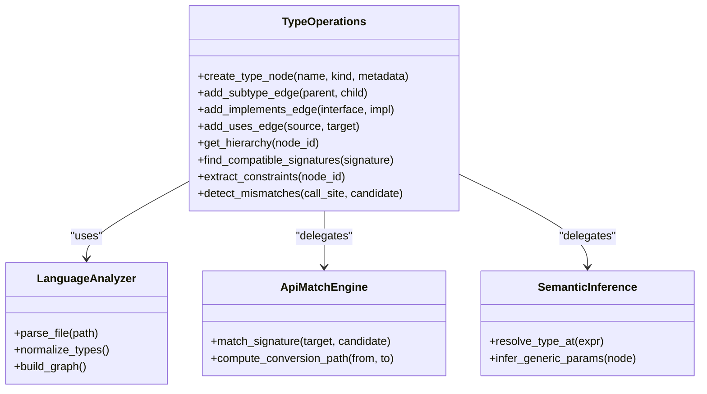
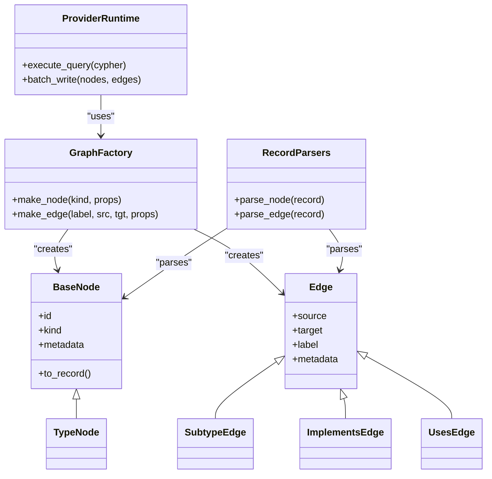
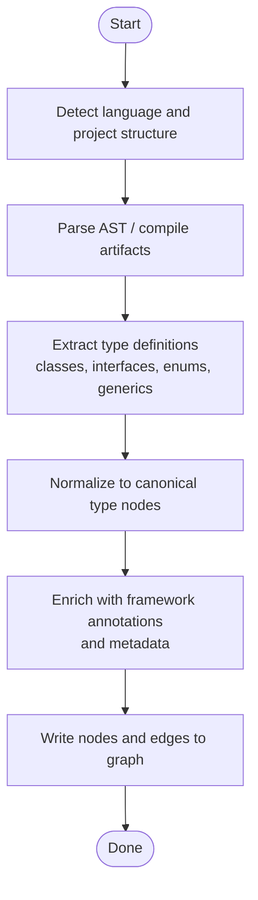
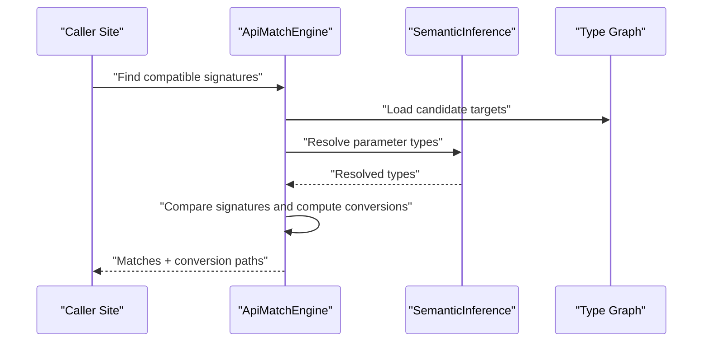
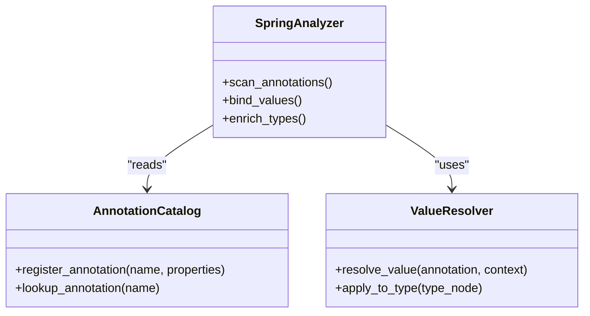

# Type Node Operations

<cite>
**Referenced Files in This Document**
- [type_ops.py](file://code-tiny/tools/graph/operations/type_ops.py)
- [base.py](file://code-tiny/tools/graph/core/base.py)
- [factory.py](file://code-tiny/tools/graph/core/factory.py)
- [provider_runtime.py](file://code-tiny/tools/graph/core/provider_runtime.py)
- [record_parsers.py](file://code-tiny/tools/graph/core/record_parsers.py)
- [api_match_engine.py](file://code-tiny/tools/common/api_match_engine.py)
- [analyzer_cache.py](file://code-tiny/tools/common/analyzer_cache.py)
- [semantic_inference.py](file://code-tiny/tools/common/semantic_inference.py)
- [ts_analyzer.py](file://code-tiny/tools/ts/ts_analyzer.py)
- [ast_types.py](file://code-tiny/tools/ts/types/ast_types.py)
- [graph_types.py](file://code-tiny/tools/ts/types/graph_types.py)
- [flutter_analyzer.py](file://code-tiny/tools/flutter/flutter_analyzer.py)
- [dart_parser.py](file://code-tiny/tools/flutter/dart_parser.py)
- [models.py](file://code-tiny/tools/flutter/models.py)
- [cplus_analyzer.py](file://code-tiny/tools/cplus/cplus_analyzer.py)
- [clang_parser.py](file://code-tiny/tools/cplus/clang_parser.py)
- [java_analyzer.py](file://code-tiny/tools/java/java_analyzer.py)
- [kotlin_analyzer.py](file://code-tiny/tools/kotlin/kotlin_analyzer.py)
- [python_analyzer.py](file://code-tiny/tools/python/python_analyzer.py)
- [go_analyzer.py](file://code-tiny/tools/go/go_analyzer.py)
- [csharp_analyzer.py](file://code-tiny/tools/csharp/csharp_analyzer.py)
- [spring_analyzer.py](file://code-tiny/tools/spring/spring_analyzer.py)
- [annotation_catalog.py](file://code-tiny/tools/spring/annotation_catalog.py)
- [value_resolver.py](file://code-tiny/tools/spring/value_resolver.py)
</cite>

## Table of Contents
1. [Introduction](#introduction)
2. [Project Structure](#project-structure)
3. [Core Components](#core-components)
4. [Architecture Overview](#architecture-overview)
5. [Detailed Component Analysis](#detailed-component-analysis)
6. [Dependency Analysis](#dependency-analysis)
7. [Performance Considerations](#performance-considerations)
8. [Troubleshooting Guide](#troubleshooting-guide)
9. [Conclusion](#conclusion)
10. [Appendices](#appendices)

## Introduction
This document explains type node operations in Cortex Harness, focusing on how the system models and analyzes types across multiple languages. It covers data structures for types (data structures, enums, interfaces, generics), type inference and resolution for both static and dynamic typing scenarios, API matching capabilities to identify compatible types and conversion paths, and integration with language-specific type systems and framework annotations. It also includes examples for analyzing type hierarchies, detecting mismatches, extracting constraints, and discusses performance optimization and caching strategies for complex type analysis.

## Project Structure
Type-related functionality is implemented across shared graph operations, language analyzers, and common utilities:
- Graph core provides base abstractions, runtime, factory, and record parsing utilities used by all analyzers.
- Language analyzers implement type extraction and normalization into a unified graph model.
- Common utilities provide API matching, semantic inference, and caching mechanisms.
- TypeScript and Flutter modules include dedicated type modeling and parsing components.

```mermaid
graph TB
subgraph "Graph Core"
Base["base.py"]
Factory["factory.py"]
ProviderRuntime["provider_runtime.py"]
RecordParsers["record_parsers.py"]
end
subgraph "Operations"
TypeOps["type_ops.py"]
end
subgraph "Common"
ApiMatch["api_match_engine.py"]
AnalyzerCache["analyzer_cache.py"]
SemanticInf["semantic_inference.py"]
end
subgraph "Language Analyzers"
TS["ts_analyzer.py"]
Dart["dart_parser.py"]
Flutter["flutter_analyzer.py"]
CPlus["cplus_analyzer.py"]
Clang["clang_parser.py"]
Java["java_analyzer.py"]
Kotlin["kotlin_analyzer.py"]
Python["python_analyzer.py"]
Go["go_analyzer.py"]
CSharp["csharp_analyzer.py"]
Spring["spring_analyzer.py"]
end
subgraph "TS Types"
AstTypes["ast_types.py"]
GraphTypes["graph_types.py"]
end
subgraph "Spring Annotations"
AnnotationCatalog["annotation_catalog.py"]
ValueResolver["value_resolver.py"]
end
Base --> TypeOps
Factory --> TypeOps
ProviderRuntime --> TypeOps
RecordParsers --> TypeOps
TypeOps --> ApiMatch
TypeOps --> SemanticInf
TypeOps --> AnalyzerCache
TS --> AstTypes
TS --> GraphTypes
Flutter --> Dart
Flutter --> Models["models.py"]
CPlus --> Clang
Spring --> AnnotationCatalog
Spring --> ValueResolver
```

**Diagram sources**
- [type_ops.py](file://code-tiny/tools/graph/operations/type_ops.py)
- [base.py](file://code-tiny/tools/graph/core/base.py)
- [factory.py](file://code-tiny/tools/graph/core/factory.py)
- [provider_runtime.py](file://code-tiny/tools/graph/core/provider_runtime.py)
- [record_parsers.py](file://code-tiny/tools/graph/core/record_parsers.py)
- [api_match_engine.py](file://code-tiny/tools/common/api_match_engine.py)
- [analyzer_cache.py](file://code-tiny/tools/common/analyzer_cache.py)
- [semantic_inference.py](file://code-tiny/tools/common/semantic_inference.py)
- [ts_analyzer.py](file://code-tiny/tools/ts/ts_analyzer.py)
- [ast_types.py](file://code-tiny/tools/ts/types/ast_types.py)
- [graph_types.py](file://code-tiny/tools/ts/types/graph_types.py)
- [flutter_analyzer.py](file://code-tiny/tools/flutter/flutter_analyzer.py)
- [dart_parser.py](file://code-tiny/tools/flutter/dart_parser.py)
- [models.py](file://code-tiny/tools/flutter/models.py)
- [cplus_analyzer.py](file://code-tiny/tools/cplus/cplus_analyzer.py)
- [clang_parser.py](file://code-tiny/tools/cplus/clang_parser.py)
- [java_analyzer.py](file://code-tiny/tools/java/java_analyzer.py)
- [kotlin_antractor.py](file://code-tiny/tools/kotlin/kotlin_analyzer.py)
- [python_analyzer.py](file://code-tiny/tools/python/python_analyzer.py)
- [go_analyzer.py](file://code-tiny/tools/go/go_analyzer.py)
- [csharp_analyzer.py](file://code-tiny/tools/csharp/csharp_analyzer.py)
- [spring_analyzer.py](file://code-tiny/tools/spring/spring_analyzer.py)
- [annotation_catalog.py](file://code-tiny/tools/spring/annotation_catalog.py)
- [value_resolver.py](file://code-tiny/tools/spring/value_resolver.py)

**Section sources**
- [type_ops.py](file://code-tiny/tools/graph/operations/type_ops.py)
- [base.py](file://code-tiny/tools/graph/core/base.py)
- [factory.py](file://code-tiny/tools/graph/core/factory.py)
- [provider_runtime.py](file://code-tiny/tools/graph/core/provider_runtime.py)
- [record_parsers.py](file://code-tiny/tools/graph/core/record_parsers.py)
- [api_match_engine.py](file://code-tiny/tools/common/api_match_engine.py)
- [analyzer_cache.py](file://code-tiny/tools/common/analyzer_cache.py)
- [semantic_inference.py](file://code-tiny/tools/common/semantic_inference.py)
- [ts_analyzer.py](file://code-tiny/tools/ts/ts_analyzer.py)
- [ast_types.py](file://code-tiny/tools/ts/types/ast_types.py)
- [graph_types.py](file://code-tiny/tools/ts/types/graph_types.py)
- [flutter_analyzer.py](file://code-tiny/tools/flutter/flutter_analyzer.py)
- [dart_parser.py](file://code-tiny/tools/flutter/dart_parser.py)
- [models.py](file://code-tiny/tools/flutter/models.py)
- [cplus_analyzer.py](file://code-tiny/tools/cplus/cplus_analyzer.py)
- [clang_parser.py](file://code-tiny/tools/cplus/clang_parser.py)
- [java_analyzer.py](file://code-tiny/tools/java/java_analyzer.py)
- [kotlin_analyzer.py](file://code-tiny/tools/kotlin/kotlin_analyzer.py)
- [python_analyzer.py](file://code-tiny/tools/python/python_analyzer.py)
- [go_analyzer.py](file://code-tiny/tools/go/go_analyzer.py)
- [csharp_analyzer.py](file://code-tiny/tools/csharp/csharp_analyzer.py)
- [spring_analyzer.py](file://code-tiny/tools/spring/spring_analyzer.py)
- [annotation_catalog.py](file://code-tiny/tools/spring/annotation_catalog.py)
- [value_resolver.py](file://code-tiny/tools/spring/value_resolver.py)

## Core Components
- Type operations layer exposes methods to create, query, and traverse type nodes and edges in the graph. It integrates with language analyzers that normalize language-specific types into a canonical representation.
- The graph core provides base classes and runtime utilities for consistent node/edge handling, factory patterns for constructing typed entities, and parsers for converting records into graph objects.
- Common utilities support API matching between signatures, semantic inference for resolving ambiguous types, and caching to reduce repeated analysis costs.

Key responsibilities:
- Normalize and unify type representations across languages.
- Provide APIs to analyze type hierarchies, detect mismatches, and extract constraints.
- Support generic type parameters and variance where applicable.
- Integrate with framework annotations to enrich type information.

**Section sources**
- [type_ops.py](file://code-tiny/tools/graph/operations/type_ops.py)
- [base.py](file://code-tiny/tools/graph/core/base.py)
- [factory.py](file://code-tiny/tools/graph/core/factory.py)
- [provider_runtime.py](file://code-tiny/tools/graph/core/provider_runtime.py)
- [record_parsers.py](file://code-tiny/tools/graph/core/record_parsers.py)
- [api_match_engine.py](file://code-tiny/tools/common/api_match_engine.py)
- [semantic_inference.py](file://code-tiny/tools/common/semantic_inference.py)
- [analyzer_cache.py](file://code-tiny/tools/common/analyzer_cache.py)

## Architecture Overview
The type system architecture centers around a normalized type graph. Language analyzers parse source code and produce type nodes and relationships; type operations expose queries and transformations; common utilities enhance matching and inference; caching reduces recomputation.

**Diagram sources**
- [type_ops.py](file://code-tiny/tools/graph/operations/type_ops.py)
- [analyzer_cache.py](file://code-tiny/tools/common/analyzer_cache.py)
- [api_match_engine.py](file://code-tiny/tools/common/api_match_engine.py)
- [semantic_inference.py](file://code-tiny/tools/common/semantic_inference.py)

## Detailed Component Analysis

### Type Operations Layer
The type operations module provides the primary interface for working with type nodes and edges. It coordinates with language analyzers to build a unified type graph and supports querying for hierarchies, constraints, and compatibility.

Responsibilities:
- Create and update type nodes representing classes, interfaces, enums, structs, unions, and generic instantiations.
- Establish subtype/supertype, implements, and uses edges.
- Extract and normalize generic parameters and constraints.
- Expose APIs for mismatch detection and conversion path discovery.

**Diagram sources**
- [type_ops.py](file://code-tiny/tools/graph/operations/type_ops.py)
- [api_match_engine.py](file://code-tiny/tools/common/api_match_engine.py)
- [semantic_inference.py](file://code-tiny/tools/common/semantic_inference.py)

**Section sources**
- [type_ops.py](file://code-tiny/tools/graph/operations/type_ops.py)

### Graph Core Abstractions
The graph core defines base classes and runtime utilities used by all analyzers and operations. It ensures consistent node/edge semantics, provides factory methods for creating typed entities, and parses records into graph objects.

**Diagram sources**
- [base.py](file://code-tiny/tools/graph/core/base.py)
- [factory.py](file://code-tiny/tools/graph/core/factory.py)
- [provider_runtime.py](file://code-tiny/tools/graph/core/provider_runtime.py)
- [record_parsers.py](file://code-tiny/tools/graph/core/record_parsers.py)

**Section sources**
- [base.py](file://code-tiny/tools/graph/core/base.py)
- [factory.py](file://code-tiny/tools/graph/core/factory.py)
- [provider_runtime.py](file://code-tiny/tools/graph/core/provider_runtime.py)
- [record_parsers.py](file://code-tiny/tools/graph/core/record_parsers.py)

### Language-Specific Type Systems Integration
Each language analyzer extracts types according to its language semantics and normalizes them into the unified graph model. Examples include TypeScript, Dart/Flutter, C++, Java, Kotlin, Python, Go, and C#.

**Diagram sources**
- [ts_analyzer.py](file://code-tiny/tools/ts/ts_analyzer.py)
- [ast_types.py](file://code-tiny/tools/ts/types/ast_types.py)
- [graph_types.py](file://code-tiny/tools/ts/types/graph_types.py)
- [flutter_analyzer.py](file://code-tiny/tools/flutter/flutter_analyzer.py)
- [dart_parser.py](file://code-tiny/tools/flutter/dart_parser.py)
- [models.py](file://code-tiny/tools/flutter/models.py)
- [cplus_analyzer.py](file://code-tiny/tools/cplus/cplus_analyzer.py)
- [clang_parser.py](file://code-tiny/tools/cplus/clang_parser.py)
- [java_analyzer.py](file://code-tiny/tools/java/java_analyzer.py)
- [kotlin_analyzer.py](file://code-tiny/tools/kotlin/kotlin_analyzer.py)
- [python_analyzer.py](file://code-tiny/tools/python/python_analyzer.py)
- [go_analyzer.py](file://code-tiny/tools/go/go_analyzer.py)
- [csharp_analyzer.py](file://code-tiny/tools/csharp/csharp_analyzer.py)

**Section sources**
- [ts_analyzer.py](file://code-tiny/tools/ts/ts_analyzer.py)
- [ast_types.py](file://code-tiny/tools/ts/types/ast_types.py)
- [graph_types.py](file://code-tiny/tools/ts/types/graph_types.py)
- [flutter_analyzer.py](file://code-tiny/tools/flutter/flutter_analyzer.py)
- [dart_parser.py](file://code-tiny/tools/flutter/dart_parser.py)
- [models.py](file://code-tiny/tools/flutter/models.py)
- [cplus_analyzer.py](file://code-tiny/tools/cplus/cplus_analyzer.py)
- [clang_parser.py](file://code-tiny/tools/cplus/clang_parser.py)
- [java_analyzer.py](file://code-tiny/tools/java/java_analyzer.py)
- [kotlin_analyzer.py](file://code-tiny/tools/kotlin/kotlin_analyzer.py)
- [python_analyzer.py](file://code-tiny/tools/python/python_analyzer.py)
- [go_analyzer.py](file://code-tiny/tools/go/go_analyzer.py)
- [csharp_analyzer.py](file://code-tiny/tools/csharp/csharp_analyzer.py)

### API Matching and Conversion Paths
The API match engine identifies compatible function/method signatures and computes conversion paths between types. It supports static signature comparison and dynamic coercion rules inferred from context.

**Diagram sources**
- [api_match_engine.py](file://code-tiny/tools/common/api_match_engine.py)
- [semantic_inference.py](file://code-tiny/tools/common/semantic_inference.py)

**Section sources**
- [api_match_engine.py](file://code-tiny/tools/common/api_match_engine.py)
- [semantic_inference.py](file://code-tiny/tools/common/semantic_inference.py)

### Framework Annotations Integration
Framework-specific analyzers integrate annotation catalogs and value resolvers to enrich type information. For example, Spring annotations inform dependency injection and configuration binding, which affect type constraints and compatibility.

**Diagram sources**
- [spring_analyzer.py](file://code-tiny/tools/spring/spring_analyzer.py)
- [annotation_catalog.py](file://code-tiny/tools/spring/annotation_catalog.py)
- [value_resolver.py](file://code-tiny/tools/spring/value_resolver.py)

**Section sources**
- [spring_analyzer.py](file://code-tiny/tools/spring/spring_analyzer.py)
- [annotation_catalog.py](file://code-tiny/tools/spring/annotation_catalog.py)
- [value_resolver.py](file://code-tiny/tools/spring/value_resolver.py)

### Examples: Analyzing Type Hierarchies, Mismatches, and Constraints
- Analyze type hierarchies: Use type operations to retrieve subtype/supertype chains for a given type node, including generic instantiations and trait/interface implementations.
- Detect type mismatches: Compare call-site parameter types with candidate method signatures using the API match engine; report incompatible assignments and missing conversions.
- Extract type constraints: Query constraint edges and metadata attached to generic parameters, union members, and enum variants to understand allowed values and bounds.

These workflows rely on the type operations layer, semantic inference for resolution, and the API match engine for compatibility checks.

**Section sources**
- [type_ops.py](file://code-tiny/tools/graph/operations/type_ops.py)
- [api_match_engine.py](file://code-tiny/tools/common/api_match_engine.py)
- [semantic_inference.py](file://code-tiny/tools/common/semantic_inference.py)

## Dependency Analysis
The type system depends on the graph core for consistent node/edge semantics, language analyzers for extraction and normalization, and common utilities for matching and inference. Caching decouples repeated analysis from live computation.

```mermaid
graph TB
TypeOps["type_ops.py"] --> Base["base.py"]
TypeOps --> Factory["factory.py"]
TypeOps --> ProviderRuntime["provider_runtime.py"]
TypeOps --> RecordParsers["record_parsers.py"]
TypeOps --> ApiMatch["api_match_engine.py"]
TypeOps --> SemanticInf["semantic_inference.py"]
TypeOps --> AnalyzerCache["analyzer_cache.py"]
Ts["ts_analyzer.py"] --> AstTypes["ast_types.py"]
Ts --> GraphTypes["graph_types.py"]
Flutter["flutter_analyzer.py"] --> Dart["dart_parser.py"]
Flutter --> Models["models.py"]
CPlus["cplus_analyzer.py"] --> Clang["clang_parser.py"]
Spring["spring_analyzer.py"] --> AnnotationCatalog["annotation_catalog.py"]
Spring --> ValueResolver["value_resolver.py"]
```

**Diagram sources**
- [type_ops.py](file://code-tiny/tools/graph/operations/type_ops.py)
- [base.py](file://code-tiny/tools/graph/core/base.py)
- [factory.py](file://code-tiny/tools/graph/core/factory.py)
- [provider_runtime.py](file://code-tiny/tools/graph/core/provider_runtime.py)
- [record_parsers.py](file://code-tiny/tools/graph/core/record_parsers.py)
- [api_match_engine.py](file://code-tiny/tools/common/api_match_engine.py)
- [semantic_inference.py](file://code-tiny/tools/common/semantic_inference.py)
- [analyzer_cache.py](file://code-tiny/tools/common/analyzer_cache.py)
- [ts_analyzer.py](file://code-tiny/tools/ts/ts_analyzer.py)
- [ast_types.py](file://code-tiny/tools/ts/types/ast_types.py)
- [graph_types.py](file://code-tiny/tools/ts/types/graph_types.py)
- [flutter_analyzer.py](file://code-tiny/tools/flutter/flutter_analyzer.py)
- [dart_parser.py](file://code-tiny/tools/flutter/dart_parser.py)
- [models.py](file://code-tiny/tools/flutter/models.py)
- [cplus_analyzer.py](file://code-tiny/tools/cplus/cplus_analyzer.py)
- [clang_parser.py](file://code-tiny/tools/cplus/clang_parser.py)
- [spring_analyzer.py](file://code-tiny/tools/spring/spring_analyzer.py)
- [annotation_catalog.py](file://code-tiny/tools/spring/annotation_catalog.py)
- [value_resolver.py](file://code-tiny/tools/spring/value_resolver.py)

**Section sources**
- [type_ops.py](file://code-tiny/tools/graph/operations/type_ops.py)
- [analyzer_cache.py](file://code-tiny/tools/common/analyzer_cache.py)

## Performance Considerations
- Caching: Use the analyzer cache to store normalized type graphs and frequently accessed type information. Invalidate caches when source files change or when incremental sync detects updates.
- Incremental analysis: Prefer incremental parsing and resolution to avoid full reanalysis. Leverage file-level change detection and scope-aware updates.
- Batch writes: Group node and edge writes via the provider runtime to minimize round-trips and improve throughput.
- Indexing: Ensure indexes exist on commonly queried fields such as type names, kinds, and labels to speed up hierarchy traversal and API matching.
- Lazy loading: Defer heavy computations (e.g., deep generic resolution) until needed, and memoize results within a session.

[No sources needed since this section provides general guidance]

## Troubleshooting Guide
Common issues and resolutions:
- Stale type information: Clear or refresh the analyzer cache after major refactors or dependency updates.
- Missing annotations: Verify that framework scanners are enabled and configured for the target project; ensure annotation catalogs include required entries.
- Slow queries: Check database indexes and consider narrowing scopes (files, packages) during analysis.
- Generic resolution failures: Inspect semantic inference logs and validate that generic constraints are present in the graph.

**Section sources**
- [analyzer_cache.py](file://code-tiny/tools/common/analyzer_cache.py)
- [semantic_inference.py](file://code-tiny/tools/common/semantic_inference.py)

## Conclusion
Cortex Harness unifies type analysis across languages through a normalized type graph, robust operations layer, and integrations with language-specific analyzers and framework annotations. By leveraging API matching, semantic inference, and caching, it enables efficient analysis of type hierarchies, mismatch detection, and constraint extraction. Proper indexing and incremental strategies further optimize performance for large codebases.

[No sources needed since this section summarizes without analyzing specific files]

## Appendices
- Best practices:
  - Keep language analyzers focused on extraction and normalization; delegate matching and inference to common utilities.
  - Maintain clear contracts for type node metadata to facilitate cross-language compatibility checks.
  - Regularly review cache invalidation policies to balance freshness and performance.

[No sources needed since this section provides general guidance]