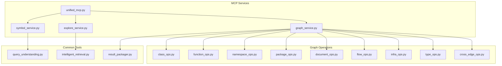
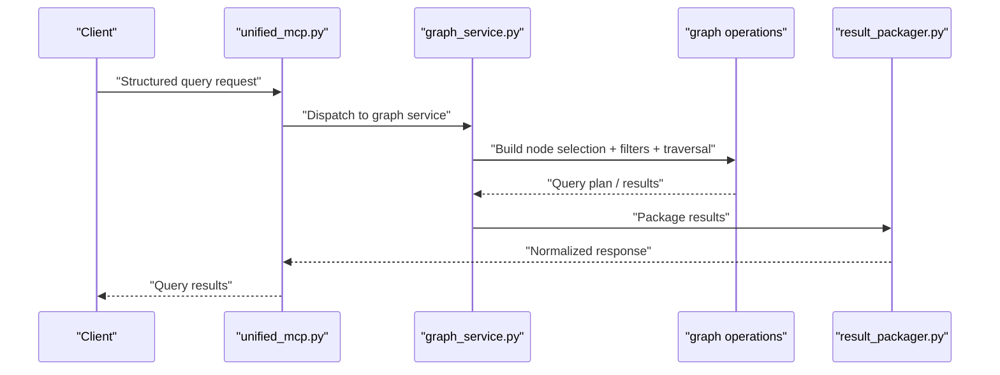
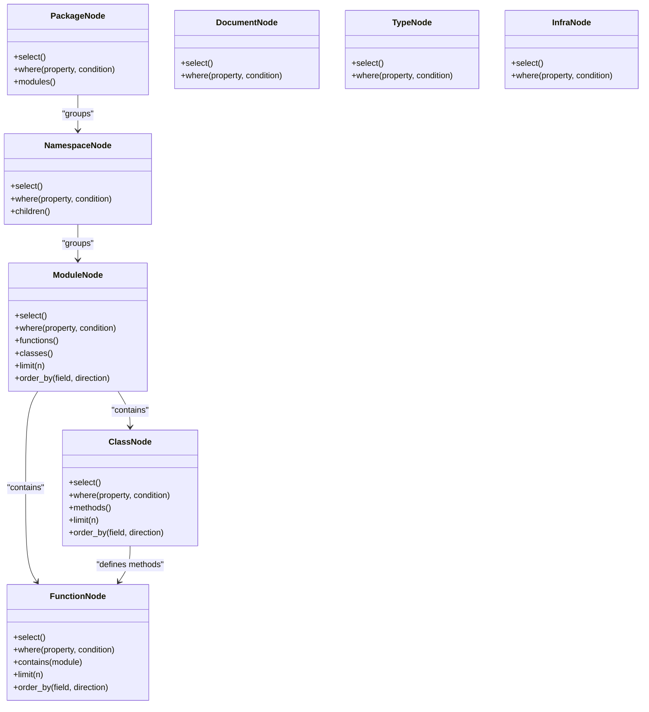
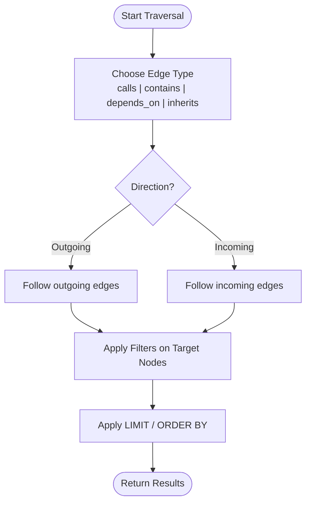
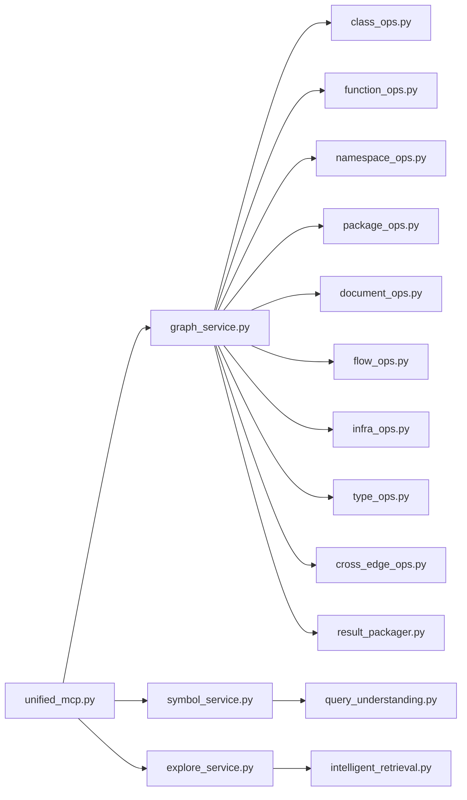

# Query Syntax Basics

<cite>
**Referenced Files in This Document**
- [QUERY_BUILDER_SOLUTION.md](file://code-tiny/tools/graph/docs/QUERY_BUILDER_SOLUTION.md)
- [QUICK_REFERENCE.md](file://code-tiny/tools/graph/docs/QUICK_REFERENCE.md)
- [class_ops.py](file://code-tiny/tools/graph/operations/class_ops.py)
- [function_ops.py](file://code-tiny/tools/graph/operations/function_ops.py)
- [namespace_ops.py](file://code-tiny/tools/graph/operations/namespace_ops.py)
- [package_ops.py](file://code-tiny/tools/graph/operations/package_ops.py)
- [document_ops.py](file://code-tiny/tools/graph/operations/document_ops.py)
- [flow_ops.py](file://code-tiny/tools/graph/operations/flow_ops.py)
- [infra_ops.py](file://code-tiny/tools/graph/operations/infra_ops.py)
- [type_ops.py](file://code-tiny/tools/graph/operations/type_ops.py)
- [cross_edge_ops.py](file://code-tiny/tools/graph/operations/cross_edge_ops.py)
- [graph_service.py](file://code-tiny/mcp/services/graph_service.py)
- [symbol_service.py](file://code-tiny/mcp/services/symbol_service.py)
- [explore_service.py](file://code-tiny/mcp/services/explore_service.py)
- [query_understanding.py](file://code-tiny/tools/common/query_understanding.py)
- [intelligent_retrieval.py](file://code-tiny/tools/common/intelligent_retrieval.py)
- [result_packager.py](file://code-tiny/tools/common/result_packager.py)
- [unified_mcp.py](file://code-tiny/mcp/unified_mcp.py)
</cite>

## Table of Contents
1. [Introduction](#introduction)
2. [Project Structure](#project-structure)
3. [Core Components](#core-components)
4. [Architecture Overview](#architecture-overview)
5. [Detailed Component Analysis](#detailed-component-analysis)
6. [Dependency Analysis](#dependency-analysis)
7. [Performance Considerations](#performance-considerations)
8. [Troubleshooting Guide](#troubleshooting-guide)
9. [Conclusion](#conclusion)
10. [Appendices](#appendices)

## Introduction
This document explains the basics of Cortex Harness structured query language (SQL-like) syntax for querying code graphs. It focuses on fundamental query structure, node selection patterns, and basic filtering conditions. You will learn how to select nodes by type (FunctionNode, ClassNode, ModuleNode), traverse relationships, access properties, and apply common clauses such as WHERE, LIMIT, and ORDER BY. Practical examples are provided for typical tasks like finding all functions in a module, selecting classes by name pattern, and filtering nodes by properties. The document also covers error handling and query validation techniques used across the system.

## Project Structure
The query capabilities are implemented through a graph operations layer that exposes typed builders for different node types and relationship traversals. These builders are consumed by MCP services which translate user queries into graph operations and return results.

**Diagram sources**
- [unified_mcp.py](file://code-tiny/mcp/unified_mcp.py)
- [graph_service.py](file://code-tiny/mcp/services/graph_service.py)
- [symbol_service.py](file://code-tiny/mcp/services/symbol_service.py)
- [explore_service.py](file://code-tiny/mcp/services/explore_service.py)
- [class_ops.py](file://code-tiny/tools/graph/operations/class_ops.py)
- [function_ops.py](file://code-tiny/tools/graph/operations/function_ops.py)
- [namespace_ops.py](file://code-tiny/tools/graph/operations/namespace_ops.py)
- [package_ops.py](file://code-tiny/tools/graph/operations/package_ops.py)
- [document_ops.py](file://code-tiny/tools/graph/operations/document_ops.py)
- [flow_ops.py](file://code-tiny/tools/graph/operations/flow_ops.py)
- [infra_ops.py](file://code-tiny/tools/graph/operations/infra_ops.py)
- [type_ops.py](file://code-tiny/tools/graph/operations/type_ops.py)
- [cross_edge_ops.py](file://code-tiny/tools/graph/operations/cross_edge_ops.py)
- [query_understanding.py](file://code-tiny/tools/common/query_understanding.py)
- [intelligent_retrieval.py](file://code-tiny/tools/common/intelligent_retrieval.py)
- [result_packager.py](file://code-tiny/tools/common/result_packager.py)

**Section sources**
- [QUICK_REFERENCE.md](file://code-tiny/tools/graph/docs/QUICK_REFERENCE.md)
- [QUERY_BUILDER_SOLUTION.md](file://code-tiny/tools/graph/docs/QUERY_BUILDER_SOLUTION.md)

## Core Components
- Node selection builders: Typed builders for FunctionNode, ClassNode, ModuleNode, NamespaceNode, PackageNode, DocumentNode, TypeNode, and infrastructure nodes. Each builder supports property filters, traversal, and result shaping.
- Relationship traversal operators: Methods to follow outgoing/incoming edges between nodes (e.g., calls, contains, depends_on).
- Property access patterns: Dot notation or key-based accessors to filter and project node properties.
- Common clauses: WHERE for filtering, LIMIT for pagination, ORDER BY for sorting.

Practical examples include:
- Find all functions in a module: Select FunctionNode with a containment relationship to a ModuleNode filtered by module path/name.
- Select classes by name pattern: Select ClassNode with a WHERE clause matching a substring or regex on the class name property.
- Filter nodes by properties: Use equality, inequality, range, and string match conditions on properties.

**Section sources**
- [class_ops.py](file://code-tiny/tools/graph/operations/class_ops.py)
- [function_ops.py](file://code-tiny/tools/graph/operations/function_ops.py)
- [namespace_ops.py](file://code-tiny/tools/graph/operations/namespace_ops.py)
- [package_ops.py](file://code-tiny/tools/graph/operations/package_ops.py)
- [document_ops.py](file://code-tiny/tools/graph/operations/document_ops.py)
- [flow_ops.py](file://code-tiny/tools/graph/operations/flow_ops.py)
- [infra_ops.py](file://code-tiny/tools/graph/operations/infra_ops.py)
- [type_ops.py](file://code-tiny/tools/graph/operations/type_ops.py)
- [cross_edge_ops.py](file://code-tiny/tools/graph/operations/cross_edge_ops.py)
- [QUICK_REFERENCE.md](file://code-tiny/tools/graph/docs/QUICK_REFERENCE.md)
- [QUERY_BUILDER_SOLUTION.md](file://code-tiny/tools/graph/docs/QUERY_BUILDER_SOLUTION.md)

## Architecture Overview
The query flow begins at the MCP entry point, which routes requests to specialized services. Graph service composes operations from the graph operations layer, while symbol and explore services add semantic understanding and retrieval enhancements. Results are packaged before returning to the caller.

**Diagram sources**
- [unified_mcp.py](file://code-tiny/mcp/unified_mcp.py)
- [graph_service.py](file://code-tiny/mcp/services/graph_service.py)
- [result_packager.py](file://code-tiny/tools/common/result_packager.py)

## Detailed Component Analysis

### Node Selection Patterns
- FunctionNode: Select functions with optional containment under a module or package. Supports property filters such as function name, signature hints, and file path.
- ClassNode: Select classes by name pattern or other attributes; can traverse to methods and fields.
- ModuleNode: Select modules by path or name; often used as context for narrowing function/class searches.
- NamespaceNode and PackageNode: Grouping constructs to scope queries.
- DocumentNode: For documentation artifacts linked to code elements.
- TypeNode: For type definitions and relationships.
- Infrastructure nodes: For non-code entities (e.g., configuration, schema).

Traversal operators allow moving between related nodes (e.g., function calls, class inheritance, module containment). Property access enables precise filtering and projection.

**Diagram sources**
- [function_ops.py](file://code-tiny/tools/graph/operations/function_ops.py)
- [class_ops.py](file://code-tiny/tools/graph/operations/class_ops.py)
- [namespace_ops.py](file://code-tiny/tools/graph/operations/namespace_ops.py)
- [package_ops.py](file://code-tiny/tools/graph/operations/package_ops.py)
- [document_ops.py](file://code-tiny/tools/graph/operations/document_ops.py)
- [type_ops.py](file://code-tiny/tools/graph/operations/type_ops.py)
- [infra_ops.py](file://code-tiny/tools/graph/operations/infra_ops.py)

**Section sources**
- [function_ops.py](file://code-tiny/tools/graph/operations/function_ops.py)
- [class_ops.py](file://code-tiny/tools/graph/operations/class_ops.py)
- [namespace_ops.py](file://code-tiny/tools/graph/operations/namespace_ops.py)
- [package_ops.py](file://code-tiny/tools/graph/operations/package_ops.py)
- [document_ops.py](file://code-tiny/tools/graph/operations/document_ops.py)
- [type_ops.py](file://code-tiny/tools/graph/operations/type_ops.py)
- [infra_ops.py](file://code-tiny/tools/graph/operations/infra_ops.py)

### Relationship Traversal Operators
Traversal methods connect nodes via known edge types such as calls, contains, depends_on, and inheritance. They enable multi-hop queries like “find callers of a function” or “list dependencies of a class.”

**Diagram sources**
- [cross_edge_ops.py](file://code-tiny/tools/graph/operations/cross_edge_ops.py)
- [flow_ops.py](file://code-tiny/tools/graph/operations/flow_ops.py)

**Section sources**
- [cross_edge_ops.py](file://code-tiny/tools/graph/operations/cross_edge_ops.py)
- [flow_ops.py](file://code-tiny/tools/graph/operations/flow_ops.py)

### Property Access Patterns
Property access allows filtering and projecting node attributes. Typical patterns include:
- Equality and inequality checks on string or numeric properties.
- Substring or prefix matches for names and paths.
- Range comparisons for numeric or timestamp properties.
- Boolean flags for presence/absence of features.

These patterns are applied within WHERE clauses and can be combined using logical operators.

**Section sources**
- [QUICK_REFERENCE.md](file://code-tiny/tools/graph/docs/QUICK_REFERENCE.md)
- [QUERY_BUILDER_SOLUTION.md](file://code-tiny/tools/graph/docs/QUERY_BUILDER_SOLUTION.md)

### WHERE Clauses, LIMIT Statements, and Ordering
WHERE clauses support conditions on node properties. LIMIT restricts the number of returned nodes. ORDER BY sorts results by one or more fields in ascending or descending order. These clauses compose with selections and traversals to produce concise, targeted results.

**Section sources**
- [QUICK_REFERENCE.md](file://code-tiny/tools/graph/docs/QUICK_REFERENCE.md)
- [QUERY_BUILDER_SOLUTION.md](file://code-tiny/tools/graph/docs/QUERY_BUILDER_SOLUTION.md)

### Practical Examples
- Find all functions in a module:
  - Select FunctionNode and constrain it to be contained by a ModuleNode whose path or name matches the target module.
- Select classes by name pattern:
  - Select ClassNode and apply a WHERE condition matching the class name property with a substring or regex pattern.
- Filter nodes by properties:
  - Combine multiple conditions on properties such as file path, visibility, or annotations to narrow results.

**Section sources**
- [function_ops.py](file://code-tiny/tools/graph/operations/function_ops.py)
- [class_ops.py](file://code-tiny/tools/graph/operations/class_ops.py)
- [module_ops_path] N/A (use ModuleNode via namespace/package ops)
- [QUICK_REFERENCE.md](file://code-tiny/tools/graph/docs/QUICK_REFERENCE.md)

## Dependency Analysis
The MCP services depend on graph operations to build queries. Symbol and explore services enhance queries with semantic understanding and retrieval strategies. Result packaging normalizes outputs.

**Diagram sources**
- [unified_mcp.py](file://code-tiny/mcp/unified_mcp.py)
- [graph_service.py](file://code-tiny/mcp/services/graph_service.py)
- [symbol_service.py](file://code-tiny/mcp/services/symbol_service.py)
- [explore_service.py](file://code-tiny/mcp/services/explore_service.py)
- [class_ops.py](file://code-tiny/tools/graph/operations/class_ops.py)
- [function_ops.py](file://code-tiny/tools/graph/operations/function_ops.py)
- [namespace_ops.py](file://code-tiny/tools/graph/operations/namespace_ops.py)
- [package_ops.py](file://code-tiny/tools/graph/operations/package_ops.py)
- [document_ops.py](file://code-tiny/tools/graph/operations/document_ops.py)
- [flow_ops.py](file://code-tiny/tools/graph/operations/flow_ops.py)
- [infra_ops.py](file://code-tiny/tools/graph/operations/infra_ops.py)
- [type_ops.py](file://code-tiny/tools/graph/operations/type_ops.py)
- [cross_edge_ops.py](file://code-tiny/tools/graph/operations/cross_edge_ops.py)
- [query_understanding.py](file://code-tiny/tools/common/query_understanding.py)
- [intelligent_retrieval.py](file://code-tiny/tools/common/intelligent_retrieval.py)
- [result_packager.py](file://code-tiny/tools/common/result_packager.py)

**Section sources**
- [unified_mcp.py](file://code-tiny/mcp/unified_mcp.py)
- [graph_service.py](file://code-tiny/mcp/services/graph_service.py)
- [symbol_service.py](file://code-tiny/mcp/services/symbol_service.py)
- [explore_service.py](file://code-tiny/mcp/services/explore_service.py)
- [result_packager.py](file://code-tiny/tools/common/result_packager.py)

## Performance Considerations
- Prefer specific selections (e.g., FunctionNode under a ModuleNode) to reduce search space.
- Use LIMIT to cap result sizes when exploring large graphs.
- Apply WHERE early to filter nodes before traversal.
- Avoid deep multi-hop traversals without constraints.
- Order results only when necessary; sorting can be expensive on large sets.

[No sources needed since this section provides general guidance]

## Troubleshooting Guide
Common issues and remedies:
- Invalid node type or property: Ensure the selected node type exists and the property is valid for that type.
- Empty results: Check if filters are too restrictive; relax conditions or broaden context (e.g., remove unnecessary containment).
- Excessive results: Add LIMIT and refine WHERE conditions; consider scoping by module or package.
- Traversal errors: Verify edge types exist between selected nodes; use cross-edge operations carefully.
- Query validation: Use query understanding utilities to normalize and validate intent before execution.

Error handling and validation techniques:
- Validate input parameters and normalize strings before building queries.
- Wrap graph operations with try/catch blocks to capture runtime errors and return meaningful messages.
- Log query plans and filters for debugging.

**Section sources**
- [query_understanding.py](file://code-tiny/tools/common/query_understanding.py)
- [intelligent_retrieval.py](file://code-tiny/tools/common/intelligent_retrieval.py)
- [result_packager.py](file://code-tiny/tools/common/result_packager.py)

## Conclusion
Cortex Harness structured query language basics center on typed node selections, relationship traversals, and property-based filtering. By combining FunctionNode, ClassNode, and ModuleNode with WHERE, LIMIT, and ORDER BY, you can express concise and powerful queries over code graphs. Follow best practices for performance and robustness, and leverage query understanding and result packaging for reliable outcomes.

[No sources needed since this section summarizes without analyzing specific files]

## Appendices

### Syntax Reference Summary
- Node selection: FunctionNode, ClassNode, ModuleNode, NamespaceNode, PackageNode, DocumentNode, TypeNode, InfraNode.
- Filtering: WHERE with equality, inequality, substring/prefix, range, boolean checks.
- Traversal: calls, contains, depends_on, inherits (outgoing/incoming).
- Result shaping: LIMIT, ORDER BY.
- Property access: dot notation or key-based accessors for filtering and projection.

**Section sources**
- [QUICK_REFERENCE.md](file://code-tiny/tools/graph/docs/QUICK_REFERENCE.md)
- [QUERY_BUILDER_SOLUTION.md](file://code-tiny/tools/graph/docs/QUERY_BUILDER_SOLUTION.md)