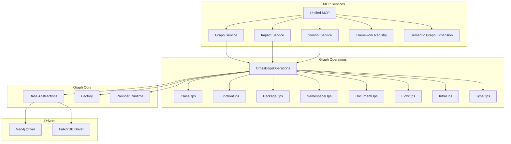
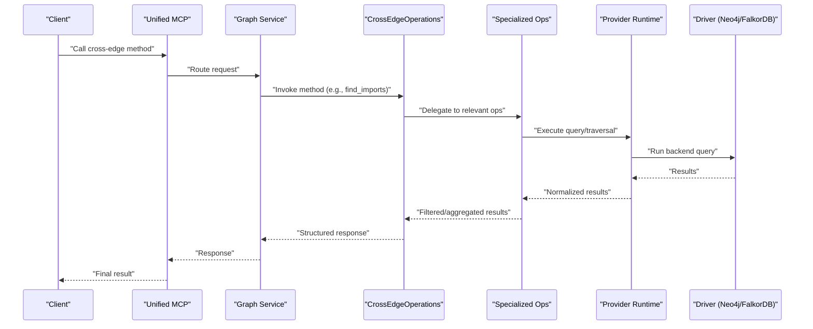
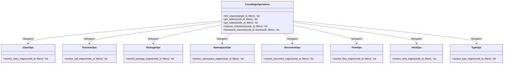
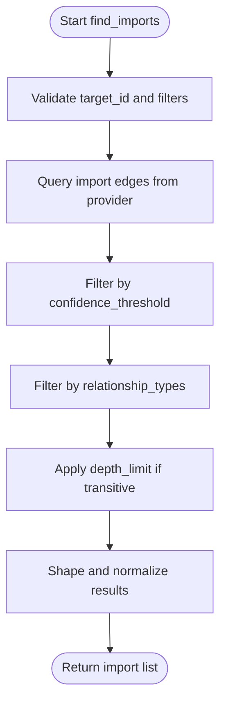
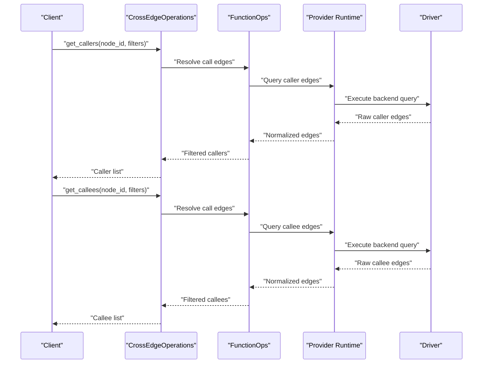
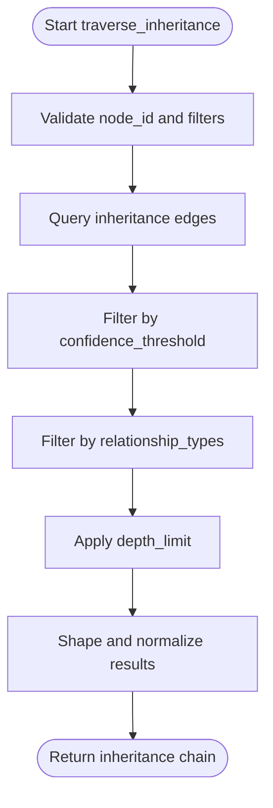
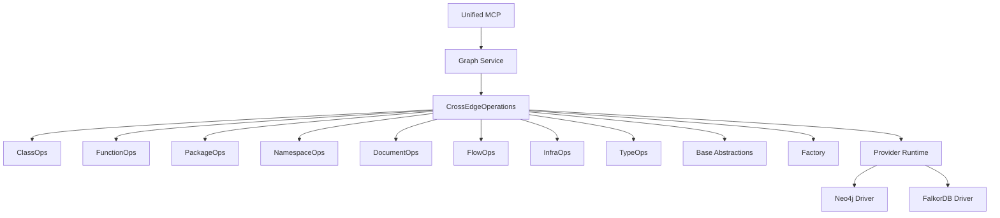

# Cross-Edge Operations

<cite>
**Referenced Files in This Document**
- [cross_edge_ops.py](file://code-tiny/tools/graph/operations/cross_edge_ops.py)
- [class_ops.py](file://code-tiny/tools/graph/operations/class_ops.py)
- [function_ops.py](file://code-tiny/tools/graph/operations/function_ops.py)
- [package_ops.py](file://code-tiny/tools/graph/operations/package_ops.py)
- [namespace_ops.py](file://code-tiny/tools/graph/operations/namespace_ops.py)
- [document_ops.py](file://code-tiny/tools/graph/operations/document_ops.py)
- [flow_ops.py](file://code-tiny/tools/graph/operations/flow_ops.py)
- [infra_ops.py](file://code-tiny/tools/graph/operations/infra_ops.py)
- [type_ops.py](file://code-tiny/tools/graph/operations/type_ops.py)
- [__init__.py](file://code-tiny/tools/graph/operations/__init__.py)
- [graph_service.py](file://code-tiny/mcp/services/graph_service.py)
- [impact_service.py](file://code-tiny/mcp/services/impact_service.py)
- [symbol_service.py](file://code-tiny/mcp/services/symbol_service.py)
- [unified_mcp.py](file://code-tiny/mcp/unified_mcp.py)
- [framework_registry.py](file://code-tiny/mcp/framework_registry.py)
- [semantic_graph_expansion.py](file://code-tiny/mcp/semantic_graph_expansion.py)
- [base.py](file://code-tiny/tools/graph/core/base.py)
- [factory.py](file://code-tiny/tools/graph/core/factory.py)
- [provider_runtime.py](file://code-tiny/tools/graph/core/provider_runtime.py)
- [neo4j_driver.py](file://code-tiny/tools/graph/driver/neo4j_driver.py)
- [falkordb_driver.py](file://code-tiny/tools/graph/driver/falkordb_driver.py)
</cite>

## Table of Contents
1. [Introduction](#introduction)
2. [Project Structure](#project-structure)
3. [Core Components](#core-components)
4. [Architecture Overview](#architecture-overview)
5. [Detailed Component Analysis](#detailed-component-analysis)
6. [Dependency Analysis](#dependency-analysis)
7. [Performance Considerations](#performance-considerations)
8. [Troubleshooting Guide](#troubleshooting-guide)
9. [Conclusion](#conclusion)
10. [Appendices](#appendices)

## Introduction
This document explains cross-edge operations in Cortex Harness graph traversal, focusing on the CrossEdgeOperations class and its methods for traversing different relationship types between nodes across languages and frameworks. It covers import relationships, call dependencies, inheritance chains, and framework-specific connections. You will learn how to use methods such as find_imports(), get_callers(), get_callees(), and traverse_inheritance(), including parameter options for filtering by confidence scores, relationship types, and depth limits. Practical examples demonstrate finding all files that import a specific module, identifying dependency cycles across language boundaries, and analyzing framework-specific relationships. Performance optimization tips and memory management considerations are provided for large codebases and deep traversal queries.

## Project Structure
Cross-edge operations are implemented under the graph operations layer and exposed via MCP services. The key components include:
- CrossEdgeOperations: central API for cross-language and cross-framework edge traversal
- Specialized operation modules: class, function, package, namespace, document, flow, infra, type
- Graph core: base abstractions, factory, provider runtime
- Drivers: Neo4j and FalkorDB implementations
- MCP services: graph, impact, symbol, unified entrypoint, framework registry, semantic expansion

**Diagram sources**
- [cross_edge_ops.py](file://code-tiny/tools/graph/operations/cross_edge_ops.py)
- [class_ops.py](file://code-tiny/tools/graph/operations/class_ops.py)
- [function_ops.py](file://code-tiny/tools/graph/operations/function_ops.py)
- [package_ops.py](file://code-tiny/tools/graph/operations/package_ops.py)
- [namespace_ops.py](file://code-tiny/tools/graph/operations/namespace_ops.py)
- [document_ops.py](file://code-tiny/tools/graph/operations/document_ops.py)
- [flow_ops.py](file://code-tiny/tools/graph/operations/flow_ops.py)
- [infra_ops.py](file://code-tiny/tools/graph/operations/infra_ops.py)
- [type_ops.py](file://code-tiny/tools/graph/operations/type_ops.py)
- [base.py](file://code-tiny/tools/graph/core/base.py)
- [factory.py](file://code-tiny/tools/graph/core/factory.py)
- [provider_runtime.py](file://code-tiny/tools/graph/core/provider_runtime.py)
- [neo4j_driver.py](file://code-tiny/tools/graph/driver/neo4j_driver.py)
- [falkordb_driver.py](file://code-tiny/tools/graph/driver/falkordb_driver.py)
- [graph_service.py](file://code-tiny/mcp/services/graph_service.py)
- [impact_service.py](file://code-tiny/mcp/services/impact_service.py)
- [symbol_service.py](file://code-tiny/mcp/services/symbol_service.py)
- [unified_mcp.py](file://code-tiny/mcp/unified_mcp.py)
- [framework_registry.py](file://code-tiny/mcp/framework_registry.py)
- [semantic_graph_expansion.py](file://code-tiny/mcp/semantic_graph_expansion.py)

**Section sources**
- [cross_edge_ops.py](file://code-tiny/tools/graph/operations/cross_edge_ops.py)
- [__init__.py](file://code-tiny/tools/graph/operations/__init__.py)
- [graph_service.py](file://code-tiny/mcp/services/graph_service.py)
- [unified_mcp.py](file://code-tiny/mcp/unified_mcp.py)

## Core Components
- CrossEdgeOperations: Provides high-level APIs for cross-language and cross-framework traversal, including imports, callers/callees, inheritance, and framework-specific edges. It coordinates specialized operation modules and underlying graph providers.
- Specialized Operation Modules: Implement domain-specific traversal logic (classes, functions, packages, namespaces, documents, flows, infrastructure, types).
- Graph Core: Defines base interfaces, provider selection, and runtime configuration used by operations.
- Drivers: Concrete implementations for Neo4j and FalkorDB backends.
- MCP Services: Expose cross-edge operations through MCP endpoints and orchestrate calls with framework registries and semantic expansion utilities.

Key responsibilities:
- Normalize node identifiers across languages and frameworks
- Apply filters (confidence thresholds, relationship types, depth limits)
- Manage traversal state and memory usage for deep queries
- Return structured results suitable for downstream analysis

**Section sources**
- [cross_edge_ops.py](file://code-tiny/tools/graph/operations/cross_edge_ops.py)
- [class_ops.py](file://code-tiny/tools/graph/operations/class_ops.py)
- [function_ops.py](file://code-tiny/tools/graph/operations/function_ops.py)
- [package_ops.py](file://code-tiny/tools/graph/operations/package_ops.py)
- [namespace_ops.py](file://code-tiny/tools/graph/operations/namespace_ops.py)
- [document_ops.py](file://code-tiny/tools/graph/operations/document_ops.py)
- [flow_ops.py](file://code-tiny/tools/graph/operations/flow_ops.py)
- [infra_ops.py](file://code-tiny/tools/graph/operations/infra_ops.py)
- [type_ops.py](file://code-tiny/tools/graph/operations/type_ops.py)
- [base.py](file://code-tiny/tools/graph/core/base.py)
- [factory.py](file://code-tiny/tools/graph/core/factory.py)
- [provider_runtime.py](file://code-tiny/tools/graph/core/provider_runtime.py)

## Architecture Overview
The cross-edge traversal architecture layers operations over a provider abstraction, which selects a driver (Neo4j or FalkorDB). MCP services act as the entry point for clients, delegating to CrossEdgeOperations and specialized modules. Framework registries and semantic expansion enhance traversal with framework-specific knowledge.

**Diagram sources**
- [unified_mcp.py](file://code-tiny/mcp/unified_mcp.py)
- [graph_service.py](file://code-tiny/mcp/services/graph_service.py)
- [cross_edge_ops.py](file://code-tiny/tools/graph/operations/cross_edge_ops.py)
- [provider_runtime.py](file://code-tiny/tools/graph/core/provider_runtime.py)
- [neo4j_driver.py](file://code-tiny/tools/graph/driver/neo4j_driver.py)
- [falkordb_driver.py](file://code-tiny/tools/graph/driver/falkordb_driver.py)

## Detailed Component Analysis

### CrossEdgeOperations Class
CrossEdgeOperations is the primary interface for cross-language and cross-framework traversal. It exposes methods for:
- Import relationships: find_imports()
- Call dependencies: get_callers(), get_callees()
- Inheritance chains: traverse_inheritance()
- Framework-specific connections: framework-aware traversal helpers

Parameters commonly supported:
- Confidence threshold: filter low-confidence edges
- Relationship types: restrict to specific edge labels or categories
- Depth limits: cap traversal depth to control performance
- Node filters: scope by language, framework, path patterns
- Result shaping: include/exclude metadata, limit returned fields

Typical usage patterns:
- Find all files importing a module: call find_imports() with target node identifier and confidence threshold
- Identify dependency cycles across languages: combine get_callers() and get_callees() with depth limits and cycle detection post-processing
- Analyze framework-specific relationships: use framework-aware helpers to resolve annotations, decorators, or configuration-driven links

**Diagram sources**
- [cross_edge_ops.py](file://code-tiny/tools/graph/operations/cross_edge_ops.py)
- [class_ops.py](file://code-tiny/tools/graph/operations/class_ops.py)
- [function_ops.py](file://code-tiny/tools/graph/operations/function_ops.py)
- [package_ops.py](file://code-tiny/tools/graph/operations/package_ops.py)
- [namespace_ops.py](file://code-tiny/tools/graph/operations/namespace_ops.py)
- [document_ops.py](file://code-tiny/tools/graph/operations/document_ops.py)
- [flow_ops.py](file://code-tiny/tools/graph/operations/flow_ops.py)
- [infra_ops.py](file://code-tiny/tools/graph/operations/infra_ops.py)
- [type_ops.py](file://code-tiny/tools/graph/operations/type_ops.py)

**Section sources**
- [cross_edge_ops.py](file://code-tiny/tools/graph/operations/cross_edge_ops.py)
- [class_ops.py](file://code-tiny/tools/graph/operations/class_ops.py)
- [function_ops.py](file://code-tiny/tools/graph/operations/function_ops.py)
- [package_ops.py](file://code-tiny/tools/graph/operations/package_ops.py)
- [namespace_ops.py](file://code-tiny/tools/graph/operations/namespace_ops.py)
- [document_ops.py](file://code-tiny/tools/graph/operations/document_ops.py)
- [flow_ops.py](file://code-tiny/tools/graph/operations/flow_ops.py)
- [infra_ops.py](file://code-tiny/tools/graph/operations/infra_ops.py)
- [type_ops.py](file://code-tiny/tools/graph/operations/type_ops.py)

### Import Relationships: find_imports()
Purpose:
- Discover all nodes that import a given target node, including cross-language and cross-framework imports.

Common parameters:
- target_id: identifier of the target node
- confidence_threshold: minimum confidence score for edges
- relationship_types: subset of import-related edge labels
- depth_limit: maximum traversal depth (useful for transitive imports)
- node_filters: language, framework, path pattern constraints

Practical example:
- Finding all files that import a specific module:
  - Call find_imports() with the module’s node identifier and set confidence_threshold to exclude weak signals
  - Optionally constrain relationship_types to direct imports only
  - Use node_filters to restrict to certain languages or directories

**Diagram sources**
- [cross_edge_ops.py](file://code-tiny/tools/graph/operations/cross_edge_ops.py)
- [provider_runtime.py](file://code-tiny/tools/graph/core/provider_runtime.py)
- [neo4j_driver.py](file://code-tiny/tools/graph/driver/neo4j_driver.py)
- [falkordb_driver.py](file://code-tiny/tools/graph/driver/falkordb_driver.py)

**Section sources**
- [cross_edge_ops.py](file://code-tiny/tools/graph/operations/cross_edge_ops.py)

### Call Dependencies: get_callers() and get_callees()
Purpose:
- Traverse call edges to identify callers (who calls a node) and callees (what a node calls), supporting cross-language calls when present.

Common parameters:
- node_id: identifier of the focal node
- confidence_threshold: minimum confidence score
- relationship_types: call-related edge labels
- depth_limit: maximum recursion depth
- node_filters: language, framework, path patterns

Practical example:
- Identifying dependency cycles across language boundaries:
  - Use get_callers() and get_callees() with moderate depth_limit
  - Post-process results to detect cycles (e.g., using visited sets)
  - Apply confidence_threshold to reduce noise from dynamic or heuristic calls

**Diagram sources**
- [cross_edge_ops.py](file://code-tiny/tools/graph/operations/cross_edge_ops.py)
- [function_ops.py](file://code-tiny/tools/graph/operations/function_ops.py)
- [provider_runtime.py](file://code-tiny/tools/graph/core/provider_runtime.py)
- [neo4j_driver.py](file://code-tiny/tools/graph/driver/neo4j_driver.py)
- [falkordb_driver.py](file://code-tiny/tools/graph/driver/falkordb_driver.py)

**Section sources**
- [cross_edge_ops.py](file://code-tiny/tools/graph/operations/cross_edge_ops.py)
- [function_ops.py](file://code-tiny/tools/graph/operations/function_ops.py)

### Inheritance Chains: traverse_inheritance()
Purpose:
- Traverse class inheritance hierarchies, including cross-language inheritance where applicable (e.g., wrappers or adapters).

Common parameters:
- node_id: identifier of the starting class
- confidence_threshold: minimum confidence score
- relationship_types: inheritance-related edge labels
- depth_limit: maximum hierarchy depth
- node_filters: language, framework constraints

Practical example:
- Analyzing framework-specific relationships:
  - Combine traverse_inheritance() with framework-aware helpers to resolve annotation-driven inheritance or proxy classes
  - Use depth_limit to avoid deep framework hierarchies

**Diagram sources**
- [cross_edge_ops.py](file://code-tiny/tools/graph/operations/cross_edge_ops.py)
- [class_ops.py](file://code-tiny/tools/graph/operations/class_ops.py)
- [provider_runtime.py](file://code-tiny/tools/graph/core/provider_runtime.py)
- [neo4j_driver.py](file://code-tiny/tools/graph/driver/neo4j_driver.py)
- [falkordb_driver.py](file://code-tiny/tools/graph/driver/falkordb_driver.py)

**Section sources**
- [cross_edge_ops.py](file://code-tiny/tools/graph/operations/cross_edge_ops.py)
- [class_ops.py](file://code-tiny/tools/graph/operations/class_ops.py)

### Framework-Specific Connections
Purpose:
- Resolve framework-specific edges such as Spring annotations, ASP.NET routes, Flutter widgets, etc., often mediated by framework registries and semantic expansion.

Approach:
- Use CrossEdgeOperations.framework_traverse() or specialized helpers to incorporate framework semantics
- Leverage framework_registry.py to select appropriate analyzers and resolvers
- Combine with semantic_graph_expansion.py to augment edges based on configuration or annotations

Practical example:
- Analyzing Spring MVC controllers and service wiring:
  - Invoke framework_traverse() with framework="spring" and relationship_types=["controller_mapping", "service_injection"]
  - Apply confidence_threshold to focus on strong annotations
  - Use depth_limit to bound traversal within controller/service layers

**Section sources**
- [cross_edge_ops.py](file://code-tiny/tools/graph/operations/cross_edge_ops.py)
- [framework_registry.py](file://code-tiny/mcp/framework_registry.py)
- [semantic_graph_expansion.py](file://code-tiny/mcp/semantic_graph_expansion.py)

## Dependency Analysis
CrossEdgeOperations depends on specialized operation modules and the graph core abstraction. MCP services expose these capabilities via HTTP/MCP endpoints.

**Diagram sources**
- [cross_edge_ops.py](file://code-tiny/tools/graph/operations/cross_edge_ops.py)
- [class_ops.py](file://code-tiny/tools/graph/operations/class_ops.py)
- [function_ops.py](file://code-tiny/tools/graph/operations/function_ops.py)
- [package_ops.py](file://code-tiny/tools/graph/operations/package_ops.py)
- [namespace_ops.py](file://code-tiny/tools/graph/operations/namespace_ops.py)
- [document_ops.py](file://code-tiny/tools/graph/operations/document_ops.py)
- [flow_ops.py](file://code-tiny/tools/graph/operations/flow_ops.py)
- [infra_ops.py](file://code-tiny/tools/graph/operations/infra_ops.py)
- [type_ops.py](file://code-tiny/tools/graph/operations/type_ops.py)
- [base.py](file://code-tiny/tools/graph/core/base.py)
- [factory.py](file://code-tiny/tools/graph/core/factory.py)
- [provider_runtime.py](file://code-tiny/tools/graph/core/provider_runtime.py)
- [neo4j_driver.py](file://code-tiny/tools/graph/driver/neo4j_driver.py)
- [falkordb_driver.py](file://code-tiny/tools/graph/driver/falkordb_driver.py)
- [unified_mcp.py](file://code-tiny/mcp/unified_mcp.py)
- [graph_service.py](file://code-tiny/mcp/services/graph_service.py)

**Section sources**
- [cross_edge_ops.py](file://code-tiny/tools/graph/operations/cross_edge_ops.py)
- [unified_mcp.py](file://code-tiny/mcp/unified_mcp.py)
- [graph_service.py](file://code-tiny/mcp/services/graph_service.py)

## Performance Considerations
Optimization strategies for large codebases and deep traversal queries:
- Use confidence_threshold to prune low-signal edges early
- Limit depth_limit to prevent exponential growth in traversal
- Apply node_filters to narrow scope by language, framework, or path patterns
- Prefer direct relationship_types instead of broad traversal
- Batch requests and reuse provider sessions where possible
- Stream results and avoid materializing entire subgraphs in memory
- Choose the appropriate driver (Neo4j vs FalkorDB) based on workload characteristics
- Cache frequently accessed nodes and edges at the application layer if safe

Memory management considerations:
- Avoid holding large result sets in memory; process incrementally
- Release references to intermediate structures after aggregation
- Use pagination or cursors for deep traversals
- Monitor driver connection pools and query timeouts

[No sources needed since this section provides general guidance]

## Troubleshooting Guide
Common issues and resolutions:
- Empty results: verify node_id normalization and ensure correct language/framework context
- High latency: reduce depth_limit and increase confidence_threshold; check driver performance
- Incorrect edges: review relationship_types and framework-specific mappings
- Memory pressure: implement streaming and incremental processing; reduce result size

Operational checks:
- Confirm provider runtime configuration and driver availability
- Validate indexes and constraints in the graph database
- Inspect MCP routing and unified entrypoint logs for errors

**Section sources**
- [provider_runtime.py](file://code-tiny/tools/graph/core/provider_runtime.py)
- [neo4j_driver.py](file://code-tiny/tools/graph/driver/neo4j_driver.py)
- [falkordb_driver.py](file://code-tiny/tools/graph/driver/falkordb_driver.py)
- [unified_mcp.py](file://code-tiny/mcp/unified_mcp.py)

## Conclusion
CrossEdgeOperations provides a robust, framework-aware API for traversing cross-language and cross-framework relationships in Cortex Harness. By leveraging confidence thresholds, relationship type filters, and depth limits, you can efficiently explore imports, call dependencies, inheritance chains, and framework-specific connections. Applying the performance and memory management recommendations ensures scalable analysis even on large codebases.

[No sources needed since this section summarizes without analyzing specific files]

## Appendices

### Practical Examples Summary
- Find all files that import a specific module:
  - Use find_imports() with target_id, confidence_threshold, and optional relationship_types
- Identify dependency cycles across language boundaries:
  - Combine get_callers() and get_callees() with depth_limit and post-process for cycles
- Analyze framework-specific relationships:
  - Use framework_traverse() with framework and relationship_types tailored to the target framework

[No sources needed since this section aggregates previously analyzed content]