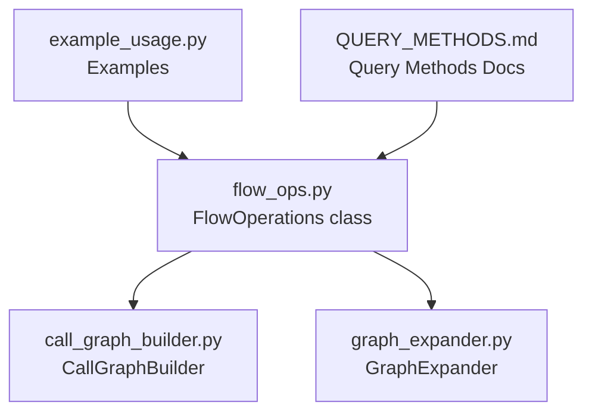
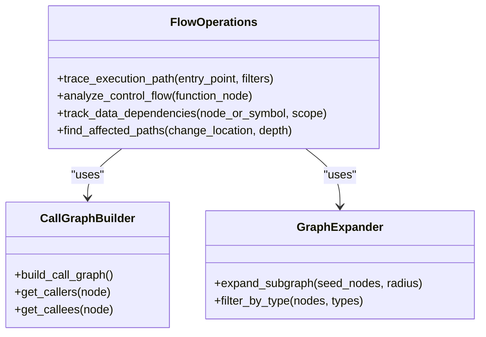
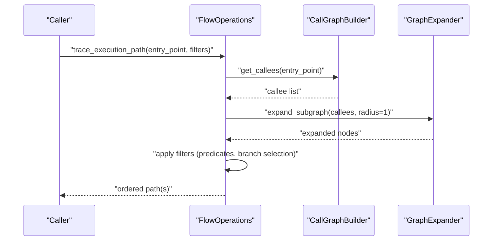
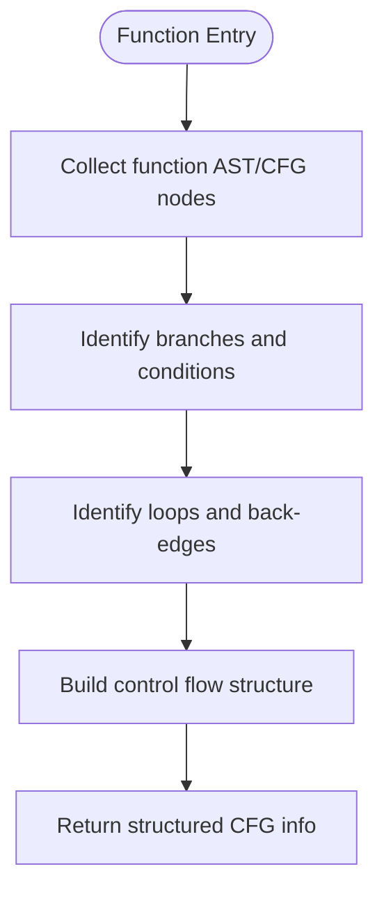
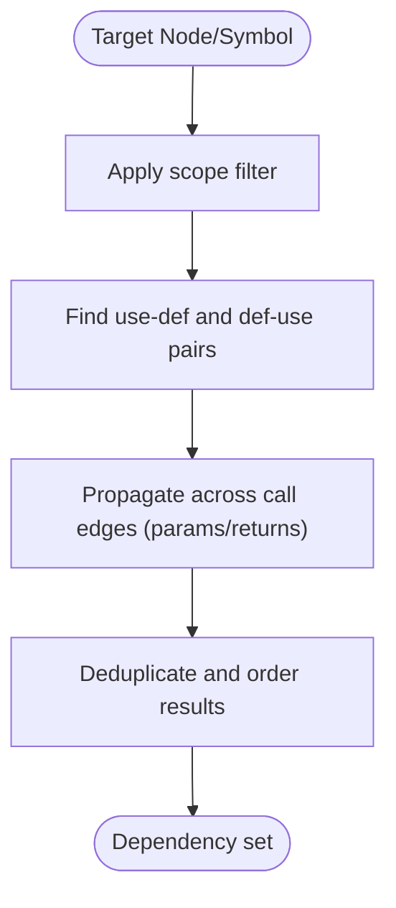
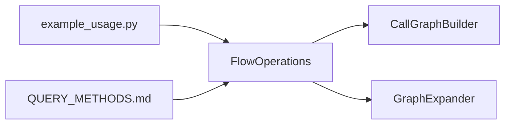

# Flow Operations

<cite>
**Referenced Files in This Document**
- [flow_ops.py](file://code-tiny/tools/graph/operations/flow_ops.py)
- [call_graph_builder.py](file://code-tiny/tools/common/call_graph_builder.py)
- [graph_expander.py](file://code-tiny/tools/common/graph_expander.py)
- [query_methods.md](file://code-tiny/tools/graph/docs/QUERY_METHODS.md)
- [example_usage.py](file://code-tiny/tools/graph/examples/example_usage.py)
</cite>

## Table of Contents
1. [Introduction](#introduction)
2. [Project Structure](#project-structure)
3. [Core Components](#core-components)
4. [Architecture Overview](#architecture-overview)
5. [Detailed Component Analysis](#detailed-component-analysis)
6. [Dependency Analysis](#dependency-analysis)
7. [Performance Considerations](#performance-considerations)
8. [Troubleshooting Guide](#troubleshooting-guide)
9. [Conclusion](#conclusion)
10. [Appendices](#appendices)

## Introduction
This document explains flow operations in Cortex Harness code analysis with a focus on the FlowOperations class and its methods for tracing execution paths, analyzing control flow, tracking data dependencies, and finding affected paths across functions and modules. It provides practical usage guidance, advanced features such as conditional path filtering, loop detection, and recursive function handling, and performance optimization strategies for large codebases.

## Project Structure
Flow operations are implemented under the graph operations layer and integrate with shared utilities for call graph construction and graph expansion. The key files include:
- Flow operations API and implementation
- Call graph builder used by flow operations
- Graph expander for expanding subgraphs during traversal
- Documentation describing query methods
- Example usage demonstrating typical workflows

**Diagram sources**
- [flow_ops.py](file://code-tiny/tools/graph/operations/flow_ops.py)
- [call_graph_builder.py](file://code-tiny/tools/common/call_graph_builder.py)
- [graph_expander.py](file://code-tiny/tools/common/graph_expander.py)
- [example_usage.py](file://code-tiny/tools/graph/examples/example_usage.py)
- [query_methods.md](file://code-tiny/tools/graph/docs/QUERY_METHODS.md)

**Section sources**
- [flow_ops.py](file://code-tiny/tools/graph/operations/flow_ops.py)
- [call_graph_builder.py](file://code-tiny/tools/common/call_graph_builder.py)
- [graph_expander.py](file://code-tiny/tools/common/graph_expander.py)
- [query_methods.md](file://code-tiny/tools/graph/docs/QUERY_METHODS.md)
- [example_usage.py](file://code-tiny/tools/graph/examples/example_usage.py)

## Core Components
The FlowOperations class exposes high-level APIs to analyze program flow:
- trace_execution_path(): Trace one or more execution paths from an entry point through call edges, optionally constrained by filters.
- analyze_control_flow(): Build and inspect control flow within a function (branches, loops, returns), returning structured CFG-like information.
- track_data_dependencies(): Identify variable/data dependencies across calls and assignments, including parameter passing and return values.
- find_affected_paths(): Given a change location, compute downstream paths that may be impacted, considering both call and data dependencies.

These methods typically rely on:
- CallGraphBuilder to resolve caller/callee relationships
- GraphExpander to expand relevant subgraphs for traversal
- Query methods documented in the graph docs to retrieve nodes and edges efficiently

Practical usage patterns:
- Follow function call chains from entry points (e.g., HTTP handlers, main functions)
- Identify critical path dependencies between modules
- Analyze impact of changes on downstream components

Advanced features:
- Conditional path filtering (e.g., only then-branches, specific predicates)
- Loop detection and safe traversal limits
- Recursive function handling with cycle-aware traversal

**Section sources**
- [flow_ops.py](file://code-tiny/tools/graph/operations/flow_ops.py)
- [call_graph_builder.py](file://code-tiny/tools/common/call_graph_builder.py)
- [graph_expander.py](file://code-tiny/tools/common/graph_expander.py)
- [query_methods.md](file://code-tiny/tools/graph/docs/QUERY_METHODS.md)

## Architecture Overview
The flow operations layer composes lower-level graph services and builders to provide end-to-end analysis capabilities.

**Diagram sources**
- [flow_ops.py](file://code-tiny/tools/graph/operations/flow_ops.py)
- [call_graph_builder.py](file://code-tiny/tools/common/call_graph_builder.py)
- [graph_expander.py](file://code-tiny/tools/common/graph_expander.py)

## Detailed Component Analysis

### FlowOperations Class
Responsibilities:
- Orchestrate traversal over call and data dependency graphs
- Provide user-friendly APIs for common flow analysis tasks
- Apply filters and constraints to limit result sets
- Handle recursion and cycles safely

Key methods overview:
- trace_execution_path(): Returns ordered sequences of nodes representing possible execution paths from an entry point. Supports optional predicate filters to select branches.
- analyze_control_flow(): Produces a structured representation of control flow for a given function, including branch conditions and loop constructs.
- track_data_dependencies(): Enumerates variables and symbols whose values influence or are influenced by a target node/symbol within a specified scope.
- find_affected_paths(): Computes downstream paths impacted by a change at a given location, combining call and data dependency edges.

Usage examples (paths only):
- Following call chains from entry points: see example usage file
- Identifying critical path dependencies: see example usage file
- Impact analysis after a change: see example usage file

**Section sources**
- [flow_ops.py](file://code-tiny/tools/graph/operations/flow_ops.py)
- [example_usage.py](file://code-tiny/tools/graph/examples/example_usage.py)

#### Sequence Diagram: Tracing Execution Path

**Diagram sources**
- [flow_ops.py](file://code-tiny/tools/graph/operations/flow_ops.py)
- [call_graph_builder.py](file://code-tiny/tools/common/call_graph_builder.py)
- [graph_expander.py](file://code-tiny/tools/common/graph_expander.py)

#### Flowchart: Control Flow Analysis

**Diagram sources**
- [flow_ops.py](file://code-tiny/tools/graph/operations/flow_ops.py)

#### Data Dependencies Tracking
Data dependency tracking combines assignment/use edges and parameter/return value propagation across call boundaries.

**Diagram sources**
- [flow_ops.py](file://code-tiny/tools/graph/operations/flow_ops.py)
- [call_graph_builder.py](file://code-tiny/tools/common/call_graph_builder.py)

### CallGraphBuilder Integration
CallGraphBuilder provides:
- Caller/callee resolution
- Edge metadata (e.g., argument mapping)
- Batch queries for efficient traversal

FlowOperations uses these capabilities to:
- Resolve immediate successors/predecessors
- Expand multi-hop neighborhoods
- Filter by symbol names, file paths, or framework-specific roles

**Section sources**
- [call_graph_builder.py](file://code-tiny/tools/common/call_graph_builder.py)
- [flow_ops.py](file://code-tiny/tools/graph/operations/flow_ops.py)

### GraphExpander Integration
GraphExpander supports:
- Subgraph expansion around seed nodes
- Type-based filtering
- Radius-limited traversal to bound cost

FlowOperations leverages this to:
- Limit exploration depth
- Focus on relevant regions of the graph
- Combine multiple seeds (e.g., entry points) into a single expanded view

**Section sources**
- [graph_expander.py](file://code-tiny/tools/common/graph_expander.py)
- [flow_ops.py](file://code-tiny/tools/graph/operations/flow_ops.py)

## Dependency Analysis
High-level dependencies among flow-related components:

**Diagram sources**
- [flow_ops.py](file://code-tiny/tools/graph/operations/flow_ops.py)
- [call_graph_builder.py](file://code-tiny/tools/common/call_graph_builder.py)
- [graph_expander.py](file://code-tiny/tools/common/graph_expander.py)
- [example_usage.py](file://code-tiny/tools/graph/examples/example_usage.py)
- [query_methods.md](file://code-tiny/tools/graph/docs/QUERY_METHODS.md)

**Section sources**
- [flow_ops.py](file://code-tiny/tools/graph/operations/flow_ops.py)
- [call_graph_builder.py](file://code-tiny/tools/common/call_graph_builder.py)
- [graph_expander.py](file://code-tiny/tools/common/graph_expander.py)
- [example_usage.py](file://code-tiny/tools/graph/examples/example_usage.py)
- [query_methods.md](file://code-tiny/tools/graph/docs/QUERY_METHODS.md)

## Performance Considerations
Guidelines for optimizing flow analysis queries on large codebases:
- Prefer bounded expansions: Use radius limits when calling expand_subgraph to avoid exploring the entire graph.
- Filter early: Apply type, file, or symbol filters before traversal to reduce edge counts.
- Cache repeated lookups: Reuse results from get_callers/get_callees when performing multi-hop analyses.
- Parallelize independent roots: For multiple entry points, fan out calls and merge results.
- Avoid deep recursion: Set maximum depths for find_affected_paths and trace_execution_path; prefer iterative traversal where possible.
- Use targeted scopes: In track_data_dependencies, restrict scope to a function or module to minimize cross-module noise.
- Leverage indexes: Ensure underlying graph stores have appropriate indexes for frequently queried labels and properties.

Trade-offs:
- Accuracy vs. performance: Deeper traversals and broader scopes increase recall but also runtime and memory usage.
- Completeness vs. latency: Full control flow analysis is precise but expensive; sampling or heuristic pruning can speed up responses at the cost of missing rare paths.

[No sources needed since this section provides general guidance]

## Troubleshooting Guide
Common issues and resolutions:
- Infinite loops in traversal: Ensure cycle detection is enabled and max depth is configured. If paths repeat, apply visited-set checks.
- Missing callees: Verify call graph completeness for the language/framework; some dynamic dispatch patterns may require additional heuristics or annotations.
- Excessive result size: Tighten filters (by file, symbol, or type) and reduce expansion radius.
- Slow data dependency tracking: Narrow scope and pre-filter candidate variables using local symbol tables.
- Incorrect branch selection: Validate predicate filters against known condition shapes; consider relaxing or widening filters if too strict.

Operational tips:
- Log intermediate node counts per hop to detect runaway growth.
- Benchmark different radii and filter combinations to find optimal settings for your workload.
- Use example usage scripts as templates for consistent invocation patterns.

**Section sources**
- [flow_ops.py](file://code-tiny/tools/graph/operations/flow_ops.py)
- [example_usage.py](file://code-tiny/tools/graph/examples/example_usage.py)

## Conclusion
FlowOperations centralizes flow analysis capabilities in Cortex Harness, enabling robust tracing, control flow inspection, data dependency tracking, and impact analysis. By combining call graph resolution with controlled graph expansion and careful filtering, it delivers accurate insights while remaining scalable. Adopting the recommended practices ensures reliable results even in large, complex codebases.

[No sources needed since this section summarizes without analyzing specific files]

## Appendices

### Practical Usage References
- Example workflows and method invocations:
  - [example_usage.py](file://code-tiny/tools/graph/examples/example_usage.py)
- Query methods reference:
  - [query_methods.md](file://code-tiny/tools/graph/docs/QUERY_METHODS.md)

**Section sources**
- [example_usage.py](file://code-tiny/tools/graph/examples/example_usage.py)
- [query_methods.md](file://code-tiny/tools/graph/docs/QUERY_METHODS.md)