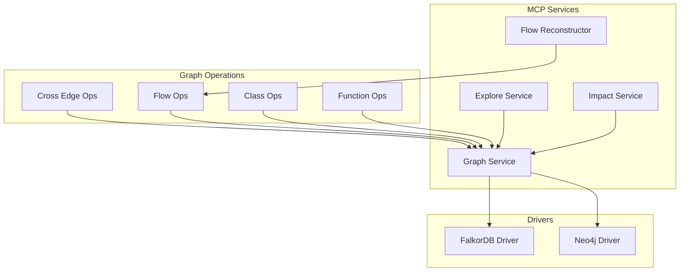
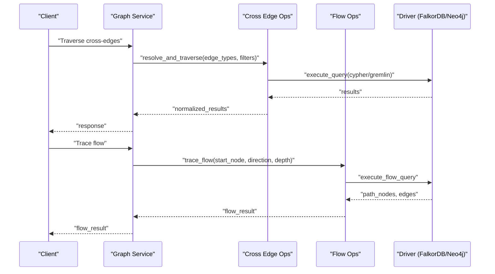
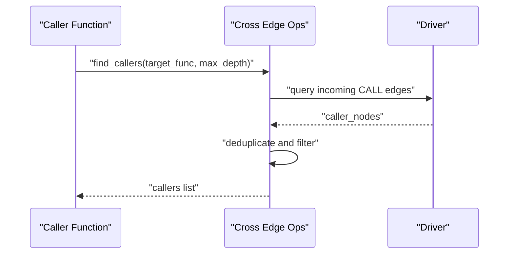
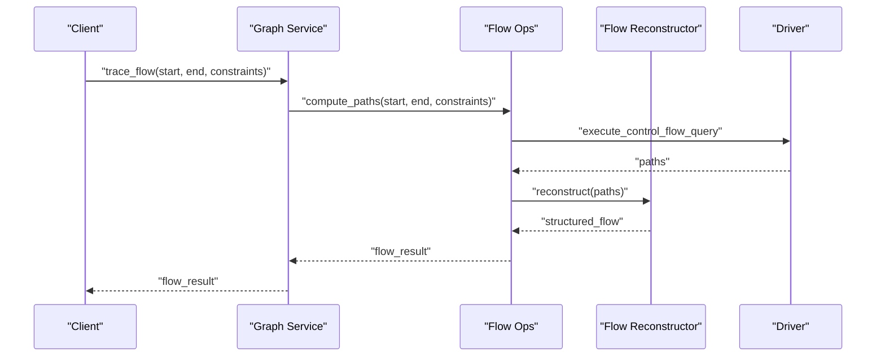
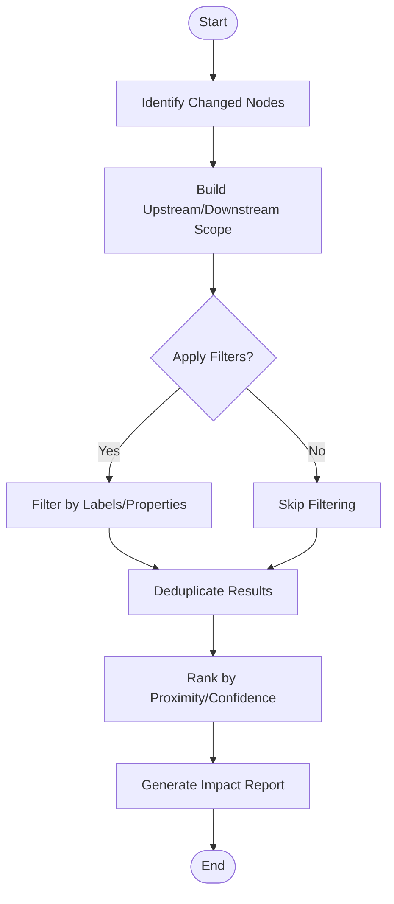
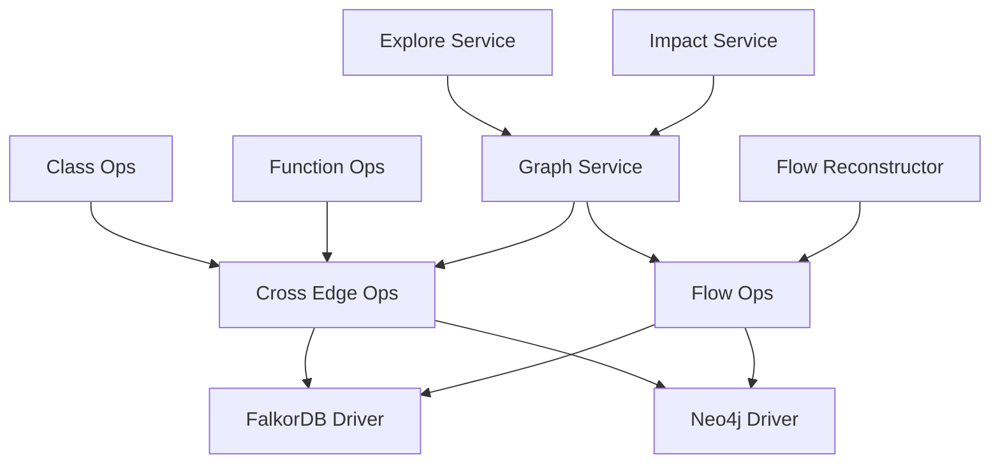

# Relationship Traversal

<cite>
**Referenced Files in This Document**
- [cross_edge_ops.py](file://code-tiny/tools/graph/operations/cross_edge_ops.py)
- [flow_ops.py](file://code-tiny/tools/graph/operations/flow_ops.py)
- [class_ops.py](file://code-tiny/tools/graph/operations/class_ops.py)
- [function_ops.py](file://code-tiny/tools/graph/operations/function_ops.py)
- [graph_service.py](file://code-tiny/mcp/services/graph_service.py)
- [impact_service.py](file://code-tiny/mcp/services/impact_service.py)
- [explore_service.py](file://code-tiny/mcp/services/explore_service.py)
- [flow_reconstructor.py](file://code-tiny/mcp/services/flow_reconstructor.py)
- [query_methods.md](file://code-tiny/tools/graph/docs/QUERY_METHODS.md)
- [quick_reference.md](file://code-tiny/tools/graph/docs/QUICK_REFERENCE.md)
- [falkordb_driver.py](file://code-tiny/tools/graph/driver/falkordb_driver.py)
- [neo4j_driver.py](file://code-tiny/tools/graph/driver/neo4j_driver.py)
</cite>

## Table of Contents
1. [Introduction](#introduction)
2. [Project Structure](#project-structure)
3. [Core Components](#core-components)
4. [Architecture Overview](#architecture-overview)
5. [Detailed Component Analysis](#detailed-component-analysis)
6. [Dependency Analysis](#dependency-analysis)
7. [Performance Considerations](#performance-considerations)
8. [Troubleshooting Guide](#troubleshooting-guide)
9. [Conclusion](#conclusion)
10. [Appendices](#appendices)

## Introduction
This document explains relationship traversal patterns in Cortex Harness queries with a focus on:
- Cross-edge operations for traversing different relationship types between nodes (imports, calls, inheritance).
- Flow operations for tracing execution paths, control flow analysis, and data flow tracking.
- Practical examples such as finding all callers of a function, identifying dependency cycles, and analyzing impact of code changes.
- Advanced traversal patterns including multi-hop relationships, conditional path filtering, and cycle detection.
- Performance optimization tips for deep traversal queries and memory management considerations.

The goal is to help both new and experienced users build efficient, correct graph queries that traverse code semantics across languages and frameworks.

## Project Structure
Cortex Harness organizes traversal capabilities under the graph operations layer and exposes them via MCP services. The key areas are:
- Graph operations: cross-edge, flow, class, function, package, namespace, type, infra, and document operations.
- Drivers: FalkorDB and Neo4j drivers abstracting underlying graph databases.
- MCP services: graph, explore, impact, and flow reconstruction services exposing query APIs.

**Diagram sources**
- [cross_edge_ops.py](file://code-tiny/tools/graph/operations/cross_edge_ops.py)
- [flow_ops.py](file://code-tiny/tools/graph/operations/flow_ops.py)
- [class_ops.py](file://code-tiny/tools/graph/operations/class_ops.py)
- [function_ops.py](file://code-tiny/tools/graph/operations/function_ops.py)
- [graph_service.py](file://code-tiny/mcp/services/graph_service.py)
- [explore_service.py](file://code-tiny/mcp/services/explore_service.py)
- [impact_service.py](file://code-tiny/mcp/services/impact_service.py)
- [flow_reconstructor.py](file://code-tiny/mcp/services/flow_reconstructor.py)
- [falkordb_driver.py](file://code-tiny/tools/graph/driver/falkordb_driver.py)
- [neo4j_driver.py](file://code-tiny/tools/graph/driver/neo4j_driver.py)

**Section sources**
- [cross_edge_ops.py](file://code-tiny/tools/graph/operations/cross_edge_ops.py)
- [flow_ops.py](file://code-tiny/tools/graph/operations/flow_ops.py)
- [class_ops.py](file://code-tiny/tools/graph/operations/class_ops.py)
- [function_ops.py](file://code-tiny/tools/graph/operations/function_ops.py)
- [graph_service.py](file://code-tiny/mcp/services/graph_service.py)
- [explore_service.py](file://code-tiny/mcp/services/explore_service.py)
- [impact_service.py](file://code-tiny/mcp/services/impact_service.py)
- [flow_reconstructor.py](file://code-tiny/mcp/services/flow_reconstructor.py)
- [falkordb_driver.py](file://code-tiny/tools/graph/driver/falkordb_driver.py)
- [neo4j_driver.py](file://code-tiny/tools/graph/driver/neo4j_driver.py)

## Core Components
- Cross-edge operations provide unified methods to traverse heterogeneous edges (imports, calls, inheritance, etc.) across language-specific graphs.
- Flow operations implement control-flow and data-flow traversal primitives for reconstructing execution paths and tracing variable usage.
- Class and function operations encapsulate common semantic traversals like inheritance chains and call graphs.
- MCP services expose these operations through well-defined APIs for clients and tools.
- Drivers abstract database-specific query execution and result handling.

Key responsibilities:
- Cross-edge ops: resolve edge types, apply filters, and return normalized results.
- Flow ops: compute reachable nodes along control/data edges, support depth limits, and detect cycles.
- Impact service: aggregate upstream/downstream effects for change impact analysis.
- Explore service: high-level discovery and exploration helpers combining multiple operations.

**Section sources**
- [cross_edge_ops.py](file://code-tiny/tools/graph/operations/cross_edge_ops.py)
- [flow_ops.py](file://code-tiny/tools/graph/operations/flow_ops.py)
- [class_ops.py](file://code-tiny/tools/graph/operations/class_ops.py)
- [function_ops.py](file://code-tiny/tools/graph/operations/function_ops.py)
- [graph_service.py](file://code-tiny/mcp/services/graph_service.py)
- [explore_service.py](file://code-tiny/mcp/services/explore_service.py)
- [impact_service.py](file://code-tiny/mcp/services/impact_service.py)
- [flow_reconstructor.py](file://code-tiny/mcp/services/flow_reconstructor.py)

## Architecture Overview
The traversal architecture layers operations over a driver abstraction, enabling consistent behavior across FalkorDB and Neo4j backends.

**Diagram sources**
- [graph_service.py](file://code-tiny/mcp/services/graph_service.py)
- [cross_edge_ops.py](file://code-tiny/tools/graph/operations/cross_edge_ops.py)
- [flow_ops.py](file://code-tiny/tools/graph/operations/flow_ops.py)
- [falkordb_driver.py](file://code-tiny/tools/graph/driver/falkordb_driver.py)
- [neo4j_driver.py](file://code-tiny/tools/graph/driver/neo4j_driver.py)

## Detailed Component Analysis

### Cross-Edge Traversal Patterns
Cross-edge operations enable traversing different relationship types uniformly. Typical patterns include:
- Import relationships: follow import edges from modules/files to dependencies.
- Call dependencies: traverse call edges to find callers and callees.
- Inheritance chains: walk superclass/superinterface edges up or down.

Practical examples:
- Find all callers of a function: traverse incoming call edges recursively with depth limit and deduplication.
- Identify dependency cycles: perform DFS/BFS with visited set and back-edge detection; return minimal cycles.
- Analyze impact of code changes: compute downstream reachability from changed nodes using import/call edges.

Optimization tips:
- Use bounded depth and early termination when possible.
- Filter by node labels or properties before expanding edges.
- Prefer batched traversals and server-side filtering where supported.

**Section sources**
- [cross_edge_ops.py](file://code-tiny/tools/graph/operations/cross_edge_ops.py)
- [function_ops.py](file://code-tiny/tools/graph/operations/function_ops.py)
- [class_ops.py](file://code-tiny/tools/graph/operations/class_ops.py)
- [graph_service.py](file://code-tiny/mcp/services/graph_service.py)

#### Cross-Edge Sequence Diagram

**Diagram sources**
- [cross_edge_ops.py](file://code-tiny/tools/graph/operations/cross_edge_ops.py)
- [function_ops.py](file://code-tiny/tools/graph/operations/function_ops.py)
- [falkordb_driver.py](file://code-tiny/tools/graph/driver/falkordb_driver.py)
- [neo4j_driver.py](file://code-tiny/tools/graph/driver/neo4j_driver.py)

### Flow Operations and Execution Path Tracing
Flow operations support:
- Control flow tracing: follow CFG edges to reconstruct execution paths.
- Data flow tracking: propagate variable definitions to uses across statements/functions.
- Path reconstruction: assemble human-readable sequences of nodes and edges.

Advanced patterns:
- Multi-hop relationships: chain multiple edge types (e.g., call -> import -> definition).
- Conditional path filtering: restrict paths based on node/edge properties (e.g., only public APIs).
- Cycle detection: identify loops in control/data flow to avoid infinite expansion.

Practical examples:
- Trace execution path from entry point to target function.
- Track data propagation from input parameters to outputs.
- Validate that certain conditions hold along all paths (e.g., security checks present).

**Section sources**
- [flow_ops.py](file://code-tiny/tools/graph/operations/flow_ops.py)
- [flow_reconstructor.py](file://code-tiny/mcp/services/flow_reconstructor.py)
- [graph_service.py](file://code-tiny/mcp/services/graph_service.py)

#### Flow Tracing Sequence Diagram

**Diagram sources**
- [flow_ops.py](file://code-tiny/tools/graph/operations/flow_ops.py)
- [flow_reconstructor.py](file://code-tiny/mcp/services/flow_reconstructor.py)
- [graph_service.py](file://code-tiny/mcp/services/graph_service.py)
- [falkordb_driver.py](file://code-tiny/tools/graph/driver/falkordb_driver.py)
- [neo4j_driver.py](file://code-tiny/tools/graph/driver/neo4j_driver.py)

### Impact Analysis and Change Propagation
Impact analysis leverages cross-edge and flow operations to determine how changes affect the system:
- Upstream impact: who depends on the changed element?
- Downstream impact: what will break if the changed element is modified?
- Scope estimation: combine import and call graphs to estimate blast radius.

Practical examples:
- Given a file change, list affected functions and classes.
- Compute transitive dependencies for a module to plan refactors.
- Generate change reports for reviewers highlighting risky paths.

**Section sources**
- [impact_service.py](file://code-tiny/mcp/services/impact_service.py)
- [cross_edge_ops.py](file://code-tiny/tools/graph/operations/cross_edge_ops.py)
- [graph_service.py](file://code-tiny/mcp/services/graph_service.py)

#### Impact Analysis Flowchart

[No sources needed since this diagram shows conceptual workflow, not actual code structure]

### Exploration and Discovery Helpers
Explore service provides higher-level utilities for discovering symbols, files, and relationships:
- Symbol lookup and matching.
- File-to-symbol mapping.
- Subgraph extraction around a seed node.

These helpers often compose cross-edge and flow operations to deliver user-friendly answers.

**Section sources**
- [explore_service.py](file://code-tiny/mcp/services/explore_service.py)
- [graph_service.py](file://code-tiny/mcp/services/graph_service.py)

## Dependency Analysis
Traversal components depend on drivers for query execution and on each other for composing complex analyses.

**Diagram sources**
- [cross_edge_ops.py](file://code-tiny/tools/graph/operations/cross_edge_ops.py)
- [flow_ops.py](file://code-tiny/tools/graph/operations/flow_ops.py)
- [class_ops.py](file://code-tiny/tools/graph/operations/class_ops.py)
- [function_ops.py](file://code-tiny/tools/graph/operations/function_ops.py)
- [graph_service.py](file://code-tiny/mcp/services/graph_service.py)
- [explore_service.py](file://code-tiny/mcp/services/explore_service.py)
- [impact_service.py](file://code-tiny/mcp/services/impact_service.py)
- [flow_reconstructor.py](file://code-tiny/mcp/services/flow_reconstructor.py)
- [falkordb_driver.py](file://code-tiny/tools/graph/driver/falkordb_driver.py)
- [neo4j_driver.py](file://code-tiny/tools/graph/driver/neo4j_driver.py)

**Section sources**
- [cross_edge_ops.py](file://code-tiny/tools/graph/operations/cross_edge_ops.py)
- [flow_ops.py](file://code-tiny/tools/graph/operations/flow_ops.py)
- [class_ops.py](file://code-tiny/tools/graph/operations/class_ops.py)
- [function_ops.py](file://code-tiny/tools/graph/operations/function_ops.py)
- [graph_service.py](file://code-tiny/mcp/services/graph_service.py)
- [explore_service.py](file://code-tiny/mcp/services/explore_service.py)
- [impact_service.py](file://code-tiny/mcp/services/impact_service.py)
- [flow_reconstructor.py](file://code-tiny/mcp/services/flow_reconstructor.py)
- [falkordb_driver.py](file://code-tiny/tools/graph/driver/falkordb_driver.py)
- [neo4j_driver.py](file://code-tiny/tools/graph/driver/neo4j_driver.py)

## Performance Considerations
- Depth limiting: constrain traversal depth to prevent exponential blowups.
- Early filtering: apply label/property filters at the start to reduce branching factor.
- Batched queries: prefer single-pass traversals over multiple round-trips.
- Server-side processing: leverage database-native features (indexes, computed properties) when available.
- Result streaming: process large result sets incrementally to avoid memory spikes.
- Deduplication: maintain visited sets to avoid revisiting nodes in cyclic graphs.
- Caching: cache frequently used subgraphs or intermediate results for repeated queries.
- Index awareness: ensure indexes exist on commonly filtered fields (e.g., symbol names, file paths).

Memory management considerations:
- Avoid materializing entire subgraphs in client memory; stream and discard as needed.
- Use cursors or paginated reads for large traversals.
- Release references promptly after processing to allow garbage collection.
- Monitor driver connection pools and result buffers.

[No sources needed since this section provides general guidance]

## Troubleshooting Guide
Common issues and remedies:
- Infinite loops in traversal: implement visited tracking and cycle detection; enforce maximum depth.
- Slow queries: add filters, use indexes, and reduce fan-out by narrowing starting nodes.
- Missing relationships: verify schema coverage and analyzer completeness for the language/framework.
- Driver errors: check connectivity, credentials, and compatibility with the selected backend.
- Large result sets: paginate or limit output; refine search criteria.

Operational checks:
- Validate that required indexes exist.
- Confirm that graph ingestion completed successfully for relevant modules.
- Inspect logs for driver timeouts or memory pressure.

**Section sources**
- [falkordb_driver.py](file://code-tiny/tools/graph/driver/falkordb_driver.py)
- [neo4j_driver.py](file://code-tiny/tools/graph/driver/neo4j_driver.py)
- [graph_service.py](file://code-tiny/mcp/services/graph_service.py)

## Conclusion
Cortex Harness provides robust traversal primitives for cross-edge and flow-based analysis. By combining cross-edge operations with flow reconstruction and impact analysis, you can answer complex questions about callers, dependencies, and change impact efficiently. Applying performance best practices—depth limits, filtering, batching, and streaming—ensures scalable operation even on large codebases.

[No sources needed since this section summarizes without analyzing specific files]

## Appendices

### Quick Reference and Query Methods
For concise API summaries and method descriptions, consult the documentation files:
- [Query Methods](file://code-tiny/tools/graph/docs/QUERY_METHODS.md)
- [Quick Reference](file://code-tiny/tools/graph/docs/QUICK_REFERENCE.md)

**Section sources**
- [query_methods.md](file://code-tiny/tools/graph/docs/QUERY_METHODS.md)
- [quick_reference.md](file://code-tiny/tools/graph/docs/QUICK_REFERENCE.md)