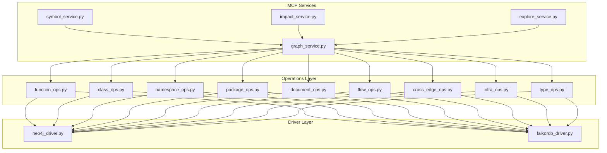
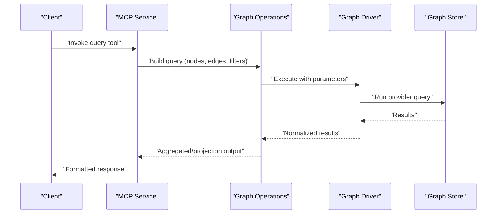
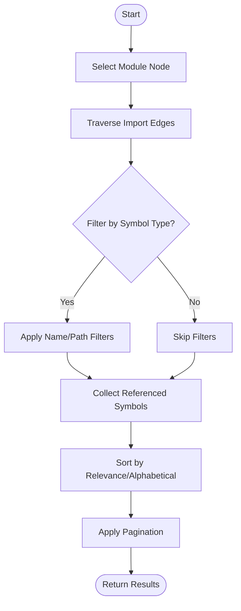
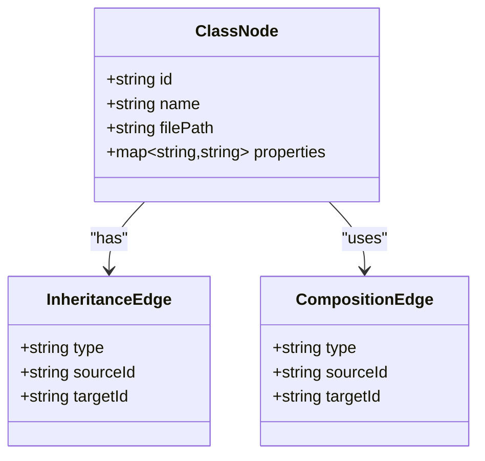
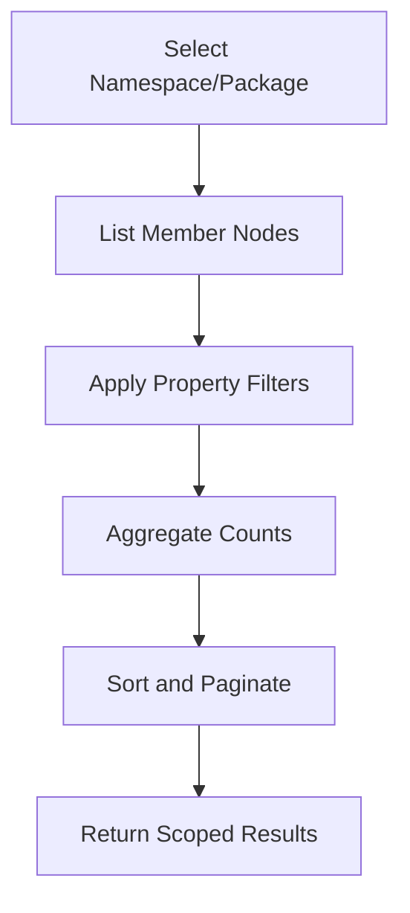
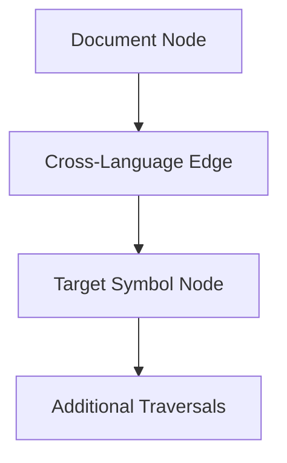
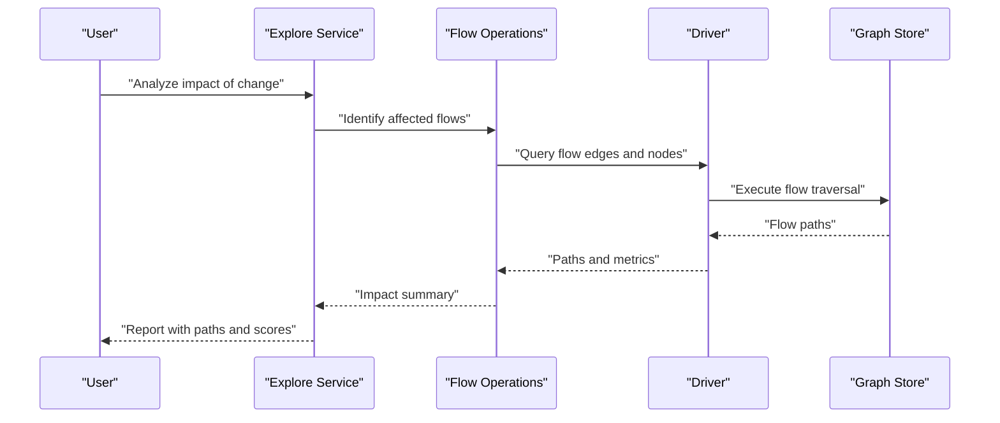
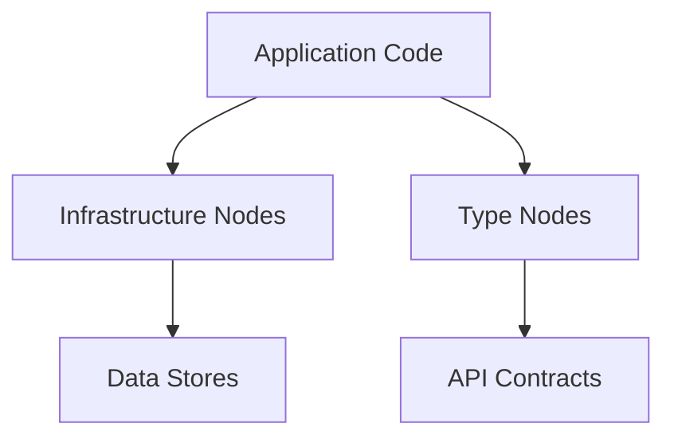
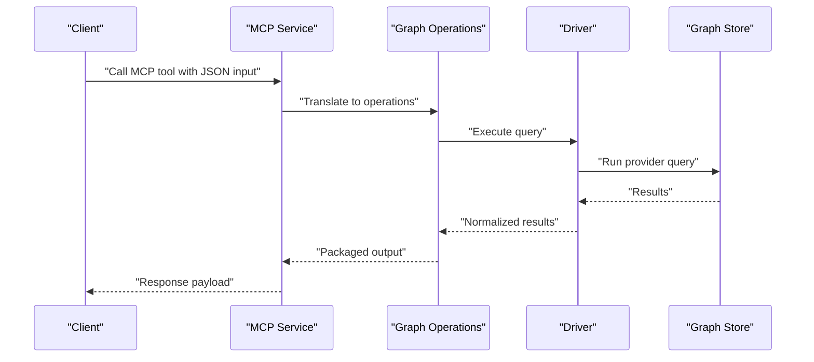
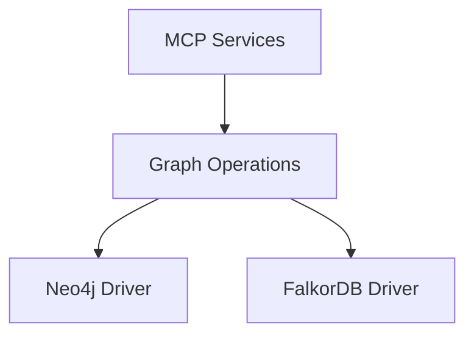

# Structured Query Language

<cite>
**Referenced Files in This Document**
- [README.md](file://code-tiny/skills/code-graph-ingest/README.md)
- [SKILL.md](file://code-tiny/skills/code-graph-ingest/SKILL.md)
- [examples.md](file://code-tiny/skills/code-graph-ingest/references/examples.md)
- [QUERY_METHODS.md](file://code-tiny/tools/graph/docs/QUERY_METHODS.md)
- [QUICK_REFERENCE.md](file://code-tiny/tools/graph/docs/QUICK_REFERENCE.md)
- [QUERY_BUILDER_SOLUTION.md](file://code-tiny/tools/graph/docs/QUERY_BUILDER_SOLUTION.md)
- [IMPLEMENTATION_SUMMARY.md](file://code-tiny/tools/graph/docs/IMPLEMENTATION_SUMMARY.md)
- [MIGRATION_GUIDE.py](file://code-tiny/tools/graph/docs/MIGRATION_GUIDE.py)
- [falkordb_driver.py](file://code-tiny/tools/graph/driver/falkordb_driver.py)
- [neo4j_driver.py](file://code-tiny/tools/graph/driver/neo4j_driver.py)
- [class_ops.py](file://code-tiny/tools/graph/operations/class_ops.py)
- [function_ops.py](file://code-tiny/tools/graph/operations/function_ops.py)
- [namespace_ops.py](file://code-tiny/tools/graph/operations/namespace_ops.py)
- [package_ops.py](file://code-tiny/tools/graph/operations/package_ops.py)
- [document_ops.py](file://code-tiny/tools/graph/operations/document_ops.py)
- [flow_ops.py](file://code-tiny/tools/graph/operations/flow_ops.py)
- [cross_edge_ops.py](file://code-tiny/tools/graph/operations/cross_edge_ops.py)
- [infra_ops.py](file://code-tiny/tools/graph/operations/infra_ops.py)
- [type_ops.py](file://code-tiny/tools/graph/operations/type_ops.py)
- [graph_service.py](file://code-tiny/mcp/services/graph_service.py)
- [symbol_service.py](file://code-tiny/mcp/services/symbol_service.py)
- [impact_service.py](file://code-tiny/mcp/services/impact_service.py)
- [explore_service.py](file://code-tiny/mcp/services/explore_service.py)
- [test_find_path.json](file://code-tiny/testtool/input_exam/test_find_path.json)
- [find_paths.json](file://code-tiny/testtool/input_exam/find_paths.json)
- [query_subgraph.json](file://code-tiny/testtool/input_exam/query_subgraph.json)
- [search_functions.json](file://code-tiny/testtool/input_exam/search_functions.json)
- [trace_flow.json](file://code-tiny/testtool/input_exam/trace_flow.json)
</cite>

## Table of Contents
1. [Introduction](#introduction)
2. [Project Structure](#project-structure)
3. [Core Components](#core-components)
4. [Architecture Overview](#architecture-overview)
5. [Detailed Component Analysis](#detailed-component-analysis)
6. [Dependency Analysis](#dependency-analysis)
7. [Performance Considerations](#performance-considerations)
8. [Troubleshooting Guide](#troubleshooting-guide)
9. [Conclusion](#conclusion)
10. [Appendices](#appendices)

## Introduction
This document explains the structured query language (SQL-like and graph traversal) capabilities exposed by Cortex Harness for querying code elements such as functions, classes, modules, and their relationships. It covers node and edge traversal patterns, filtering conditions, result aggregation, pagination, sorting, and export formats. Practical examples include finding all imports of a module, tracing function call chains, identifying unused code, and analyzing dependency graphs. Advanced features like conditional filtering, execution plans, performance optimization tips, error handling strategies, and debugging techniques are also documented.

## Project Structure
Cortex Harness organizes its graph query capabilities across several layers:
- Graph operations layer: typed operations for nodes and edges (functions, classes, namespaces, packages, documents, flows, cross-language edges, infrastructure, types).
- Driver layer: database drivers that execute queries against Neo4j or FalkorDB.
- MCP services: high-level services that expose query capabilities via MCP tools.
- Documentation and references: guides, quick reference, and example inputs used by tests.

**Diagram sources**
- [function_ops.py](file://code-tiny/tools/graph/operations/function_ops.py)
- [class_ops.py](file://code-tiny/tools/graph/operations/class_ops.py)
- [namespace_ops.py](file://code-tiny/tools/graph/operations/namespace_ops.py)
- [package_ops.py](file://code-tiny/tools/graph/operations/package_ops.py)
- [document_ops.py](file://code-tiny/tools/graph/operations/document_ops.py)
- [flow_ops.py](file://code-tiny/tools/graph/operations/flow_ops.py)
- [cross_edge_ops.py](file://code-tiny/tools/graph/operations/cross_edge_ops.py)
- [infra_ops.py](file://code-tiny/tools/graph/operations/infra_ops.py)
- [type_ops.py](file://code-tiny/tools/graph/operations/type_ops.py)
- [neo4j_driver.py](file://code-tiny/tools/graph/driver/neo4j_driver.py)
- [falkordb_driver.py](file://code-tiny/tools/graph/driver/falkordb_driver.py)
- [graph_service.py](file://code-tiny/mcp/services/graph_service.py)
- [symbol_service.py](file://code-tiny/mcp/services/symbol_service.py)
- [impact_service.py](file://code-tiny/mcp/services/impact_service.py)
- [explore_service.py](file://code-tiny/mcp/services/explore_service.py)

**Section sources**
- [README.md](file://code-tiny/skills/code-graph-ingest/README.md)
- [SKILL.md](file://code-tiny/skills/code-graph-ingest/SKILL.md)
- [examples.md](file://code-tiny/skills/code-graph-ingest/references/examples.md)
- [QUERY_METHODS.md](file://code-tiny/tools/graph/docs/QUERY_METHODS.md)
- [QUICK_REFERENCE.md](file://code-tiny/tools/graph/docs/QUICK_REFERENCE.md)
- [QUERY_BUILDER_SOLUTION.md](file://code-tiny/tools/graph/docs/QUERY_BUILDER_SOLUTION.md)
- [IMPLEMENTATION_SUMMARY.md](file://code-tiny/tools/graph/docs/IMPLEMENTATION_SUMMARY.md)
- [MIGRATION_GUIDE.py](file://code-tiny/tools/graph/docs/MIGRATION_GUIDE.py)

## Core Components
- Operations API: Provides typed methods to query nodes and traverse edges for functions, classes, namespaces, packages, documents, flows, cross-language edges, infrastructure, and types. These encapsulate query construction and parameterization.
- Drivers: Implement query execution against Neo4j or FalkorDB, translating operation calls into provider-specific queries.
- MCP Services: Expose higher-level query capabilities through MCP tools, including symbol lookup, impact analysis, and exploration workflows.

Key responsibilities:
- Node selection and filtering by labels and properties.
- Edge traversal with directionality and relationship types.
- Aggregation and projection of results.
- Pagination and sorting parameters.
- Export formatting options.

**Section sources**
- [QUERY_METHODS.md](file://code-tiny/tools/graph/docs/QUERY_METHODS.md)
- [QUICK_REFERENCE.md](file://code-tiny/tools/graph/docs/QUICK_REFERENCE.md)
- [QUERY_BUILDER_SOLUTION.md](file://code-tiny/tools/graph/docs/QUERY_BUILDER_SOLUTION.md)
- [IMPLEMENTATION_SUMMARY.md](file://code-tiny/tools/graph/docs/IMPLEMENTATION_SUMMARY.md)

## Architecture Overview
The query stack is layered:
- MCP Services orchestrate user requests and map them to operations.
- Operations compose queries using typed APIs.
- Drivers execute queries against the selected graph store.

**Diagram sources**
- [graph_service.py](file://code-tiny/mcp/services/graph_service.py)
- [function_ops.py](file://code-tiny/tools/graph/operations/function_ops.py)
- [neo4j_driver.py](file://code-tiny/tools/graph/driver/neo4j_driver.py)
- [falkordb_driver.py](file://code-tiny/tools/graph/driver/falkordb_driver.py)

## Detailed Component Analysis

### Functions and Call Chains
- Function discovery and filtering by name, signature, file path, and metadata.
- Traversal of call edges to build call chains and identify callers/callees.
- Aggregation of call counts and depths; optional pagination and sorting by relevance or metrics.

Practical scenarios:
- Find all imports of a module by traversing import edges from module nodes to referenced symbols.
- Trace function call chains starting from an entry point up to a specified depth.

**Diagram sources**
- [function_ops.py](file://code-tiny/tools/graph/operations/function_ops.py)
- [namespace_ops.py](file://code-tiny/tools/graph/operations/namespace_ops.py)
- [package_ops.py](file://code-tiny/tools/graph/operations/package_ops.py)
- [cross_edge_ops.py](file://code-tiny/tools/graph/operations/cross_edge_ops.py)

**Section sources**
- [function_ops.py](file://code-tiny/tools/graph/operations/function_ops.py)
- [namespace_ops.py](file://code-tiny/tools/graph/operations/namespace_ops.py)
- [package_ops.py](file://code-tiny/tools/graph/operations/package_ops.py)
- [cross_edge_ops.py](file://code-tiny/tools/graph/operations/cross_edge_ops.py)
- [test_find_path.json](file://code-tiny/testtool/input_exam/test_find_path.json)
- [find_paths.json](file://code-tiny/testtool/input_exam/find_paths.json)
- [trace_flow.json](file://code-tiny/testtool/input_exam/trace_flow.json)

### Classes and Inheritance Hierarchies
- Class node selection with label and property filters.
- Traversal of inheritance and composition edges to build hierarchy trees.
- Aggregation of class usage metrics and method coverage.

**Diagram sources**
- [class_ops.py](file://code-tiny/tools/graph/operations/class_ops.py)

**Section sources**
- [class_ops.py](file://code-tiny/tools/graph/operations/class_ops.py)

### Namespaces and Packages
- Namespace and package scoping for narrowing search domains.
- Traversal of containment edges to list members within scopes.
- Filtering by naming conventions and visibility attributes.

**Diagram sources**
- [namespace_ops.py](file://code-tiny/tools/graph/operations/namespace_ops.py)
- [package_ops.py](file://code-tiny/tools/graph/operations/package_ops.py)

**Section sources**
- [namespace_ops.py](file://code-tiny/tools/graph/operations/namespace_ops.py)
- [package_ops.py](file://code-tiny/tools/graph/operations/package_ops.py)

### Documents and Cross-Language Edges
- Document nodes representing files or artifacts.
- Cross-language edges linking symbols across different languages or frameworks.
- Use cases: trace dependencies spanning multiple languages and frameworks.

**Diagram sources**
- [document_ops.py](file://code-tiny/tools/graph/operations/document_ops.py)
- [cross_edge_ops.py](file://code-tiny/tools/graph/operations/cross_edge_ops.py)

**Section sources**
- [document_ops.py](file://code-tiny/tools/graph/operations/document_ops.py)
- [cross_edge_ops.py](file://code-tiny/tools/graph/operations/cross_edge_ops.py)

### Flows and Impact Analysis
- Flow edges capture control/data flow between functions and components.
- Impact analysis identifies downstream effects of changes.
- Aggregates impact scores and propagation paths.

**Diagram sources**
- [flow_ops.py](file://code-tiny/tools/graph/operations/flow_ops.py)
- [impact_service.py](file://code-tiny/mcp/services/impact_service.py)
- [explore_service.py](file://code-tiny/mcp/services/explore_service.py)
- [neo4j_driver.py](file://code-tiny/tools/graph/driver/neo4j_driver.py)
- [falkordb_driver.py](file://code-tiny/tools/graph/driver/falkordb_driver.py)

**Section sources**
- [flow_ops.py](file://code-tiny/tools/graph/operations/flow_ops.py)
- [impact_service.py](file://code-tiny/mcp/services/impact_service.py)
- [explore_service.py](file://code-tiny/mcp/services/explore_service.py)

### Infrastructure and Types
- Infrastructure nodes represent external systems, databases, and services.
- Type nodes model data schemas and interfaces.
- Queries link application code to infrastructure and types for holistic analysis.

**Diagram sources**
- [infra_ops.py](file://code-tiny/tools/graph/operations/infra_ops.py)
- [type_ops.py](file://code-tiny/tools/graph/operations/type_ops.py)

**Section sources**
- [infra_ops.py](file://code-tiny/tools/graph/operations/infra_ops.py)
- [type_ops.py](file://code-tiny/tools/graph/operations/type_ops.py)

### MCP Integration and Tool Usage
- MCP services wrap operations to provide consistent tool interfaces.
- Inputs are validated and coerced; outputs are packaged for clients.
- Example inputs demonstrate common queries like path finding, subgraph queries, and function searches.

**Diagram sources**
- [graph_service.py](file://code-tiny/mcp/services/graph_service.py)
- [symbol_service.py](file://code-tiny/mcp/services/symbol_service.py)
- [test_find_path.json](file://code-tiny/testtool/input_exam/test_find_path.json)
- [find_paths.json](file://code-tiny/testtool/input_exam/find_paths.json)
- [query_subgraph.json](file://code-tiny/testtool/input_exam/query_subgraph.json)
- [search_functions.json](file://code-tiny/testtool/input_exam/search_functions.json)
- [trace_flow.json](file://code-tiny/testtool/input_exam/trace_flow.json)

**Section sources**
- [graph_service.py](file://code-tiny/mcp/services/graph_service.py)
- [symbol_service.py](file://code-tiny/mcp/services/symbol_service.py)
- [test_find_path.json](file://code-tiny/testtool/input_exam/test_find_path.json)
- [find_paths.json](file://code-tiny/testtool/input_exam/find_paths.json)
- [query_subgraph.json](file://code-tiny/testtool/input_exam/query_subgraph.json)
- [search_functions.json](file://code-tiny/testtool/input_exam/search_functions.json)
- [trace_flow.json](file://code-tiny/testtool/input_exam/trace_flow.json)

## Dependency Analysis
The operations layer depends on driver implementations, which abstract the underlying graph store. MCP services depend on operations to construct and execute queries.

**Diagram sources**
- [function_ops.py](file://code-tiny/tools/graph/operations/function_ops.py)
- [class_ops.py](file://code-tiny/tools/graph/operations/class_ops.py)
- [namespace_ops.py](file://code-tiny/tools/graph/operations/namespace_ops.py)
- [package_ops.py](file://code-tiny/tools/graph/operations/package_ops.py)
- [document_ops.py](file://code-tiny/tools/graph/operations/document_ops.py)
- [flow_ops.py](file://code-tiny/tools/graph/operations/flow_ops.py)
- [cross_edge_ops.py](file://code-tiny/tools/graph/operations/cross_edge_ops.py)
- [infra_ops.py](file://code-tiny/tools/graph/operations/infra_ops.py)
- [type_ops.py](file://code-tiny/tools/graph/operations/type_ops.py)
- [neo4j_driver.py](file://code-tiny/tools/graph/driver/neo4j_driver.py)
- [falkordb_driver.py](file://code-tiny/tools/graph/driver/falkordb_driver.py)
- [graph_service.py](file://code-tiny/mcp/services/graph_service.py)

**Section sources**
- [QUERY_METHODS.md](file://code-tiny/tools/graph/docs/QUERY_METHODS.md)
- [QUICK_REFERENCE.md](file://code-tiny/tools/graph/docs/QUICK_REFERENCE.md)
- [QUERY_BUILDER_SOLUTION.md](file://code-tiny/tools/graph/docs/QUERY_BUILDER_SOLUTION.md)
- [IMPLEMENTATION_SUMMARY.md](file://code-tiny/tools/graph/docs/IMPLEMENTATION_SUMMARY.md)

## Performance Considerations
- Prefer scoped queries using namespace/package filters to reduce result sets.
- Limit traversal depth for call chains and impact analysis to avoid exponential growth.
- Use property indexes where available (e.g., name, filePath) to speed up node selection.
- Apply pagination and sorting at the server side when supported by the driver.
- Choose the appropriate driver (Neo4j vs FalkorDB) based on workload characteristics and migration status.
- Aggregate results in batches to manage memory usage for large graphs.
- Avoid overly broad wildcard filters; use precise patterns instead.

[No sources needed since this section provides general guidance]

## Troubleshooting Guide
- Validate MCP tool inputs using provided example JSONs to ensure correct schema and required fields.
- Inspect operation logs to understand query construction and parameter binding.
- Check driver connectivity and configuration for Neo4j/FalkorDB endpoints.
- For complex queries, break them into smaller steps and verify intermediate results.
- Use targeted filters (labels, properties) to narrow down results before expanding scope.
- Review migration notes when switching between drivers to account for differences in query semantics.

**Section sources**
- [test_find_path.json](file://code-tiny/testtool/input_exam/test_find_path.json)
- [find_paths.json](file://code-tiny/testtool/input_exam/find_paths.json)
- [query_subgraph.json](file://code-tiny/testtool/input_exam/query_subgraph.json)
- [search_functions.json](file://code-tiny/testtool/input_exam/search_functions.json)
- [trace_flow.json](file://code-tiny/testtool/input_exam/trace_flow.json)
- [MIGRATION_GUIDE.py](file://code-tiny/tools/graph/docs/MIGRATION_GUIDE.py)

## Conclusion
Cortex Harness provides a robust, layered query system for exploring code graphs. The operations API offers typed access to nodes and edges, while drivers abstract provider-specific execution. MCP services deliver consistent tool interfaces for practical scenarios like import discovery, call chain tracing, unused code identification, and dependency analysis. By applying scoped filters, limiting traversal depth, leveraging indexes, and using pagination, users can achieve efficient and reliable results across large codebases.

[No sources needed since this section summarizes without analyzing specific files]

## Appendices

### Common Scenarios and Examples
- Finding all imports of a module:
  - Use module selection followed by traversal of import edges and filtering by symbol type.
  - Reference example inputs for path and subgraph queries to adapt patterns.
- Tracing function call chains:
  - Start from an entry function and traverse call edges up to a defined depth.
  - Use flow operations and impact services to aggregate metrics.
- Identifying unused code:
  - Locate nodes with no incoming edges from relevant relationship types.
  - Combine with namespace/package scoping to focus on specific areas.
- Analyzing dependency graphs:
  - Build subgraphs around key modules and traverse cross-language edges for multi-language projects.

**Section sources**
- [examples.md](file://code-tiny/skills/code-graph-ingest/references/examples.md)
- [test_find_path.json](file://code-tiny/testtool/input_exam/test_find_path.json)
- [find_paths.json](file://code-tiny/testtool/input_exam/find_paths.json)
- [query_subgraph.json](file://code-tiny/testtool/input_exam/query_subgraph.json)
- [search_functions.json](file://code-tiny/testtool/input_exam/search_functions.json)
- [trace_flow.json](file://code-tiny/testtool/input_exam/trace_flow.json)

### Advanced Features
- Conditional filtering:
  - Combine multiple property predicates and logical operators to refine results.
- Result sorting:
  - Specify sort keys (e.g., name, relevance score) and order (ascending/descending).
- Pagination:
  - Use offset and limit parameters to page through large result sets.
- Export formats:
  - Request responses in structured formats suitable for downstream processing.

**Section sources**
- [QUERY_METHODS.md](file://code-tiny/tools/graph/docs/QUERY_METHODS.md)
- [QUICK_REFERENCE.md](file://code-tiny/tools/graph/docs/QUICK_REFERENCE.md)
- [QUERY_BUILDER_SOLUTION.md](file://code-tiny/tools/graph/docs/QUERY_BUILDER_SOLUTION.md)

### Query Execution Plans
- Understand how operations translate to provider queries via drivers.
- Review implementation summaries for details on query composition and optimization hints.
- When migrating drivers, consult migration guides to adjust query constructs accordingly.

**Section sources**
- [IMPLEMENTATION_SUMMARY.md](file://code-tiny/tools/graph/docs/IMPLEMENTATION_SUMMARY.md)
- [MIGRATION_GUIDE.py](file://code-tiny/tools/graph/docs/MIGRATION_GUIDE.py)