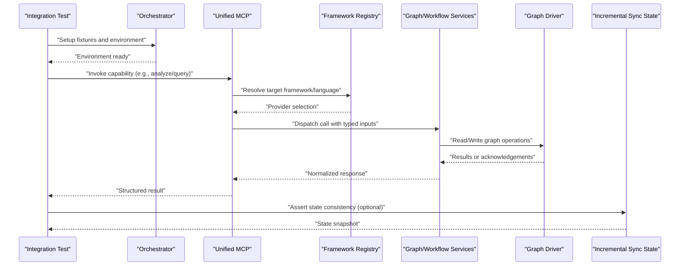
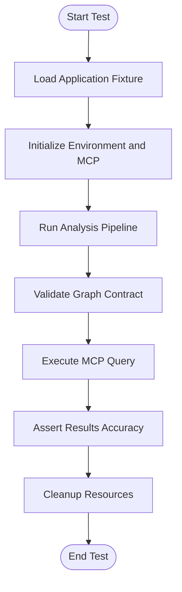
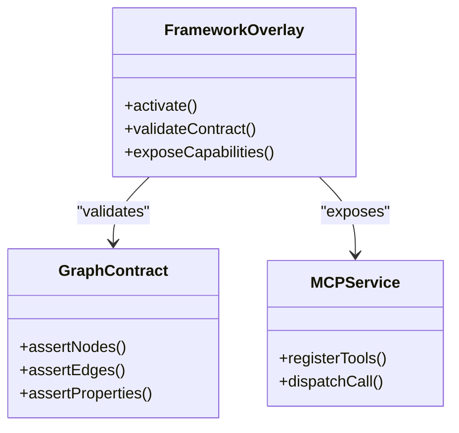
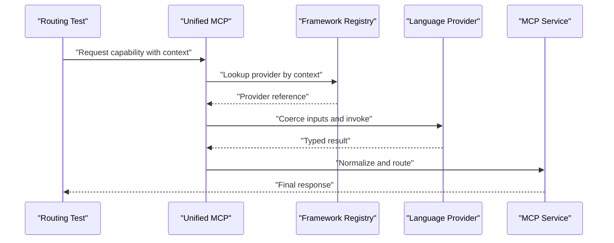
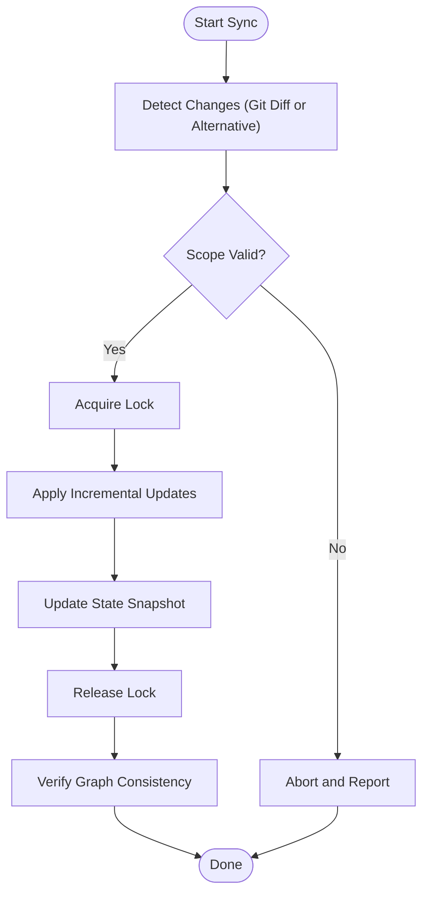
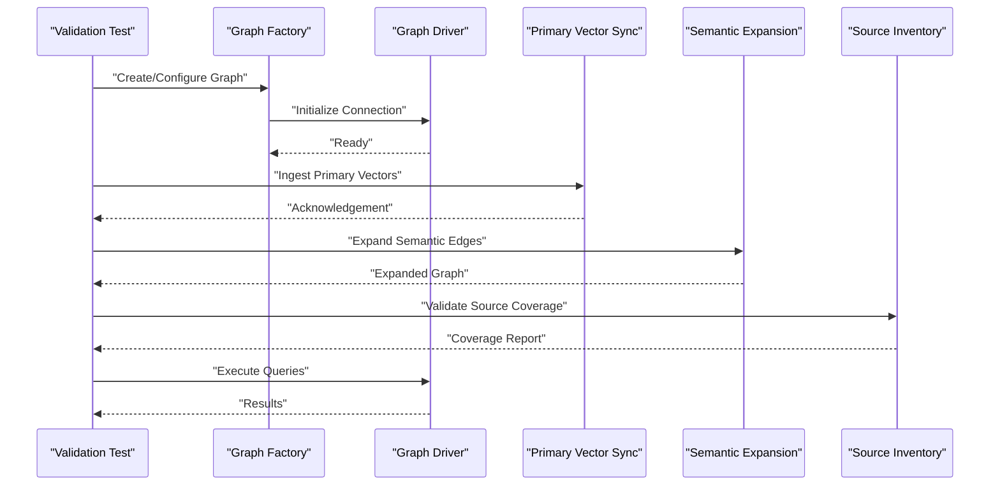
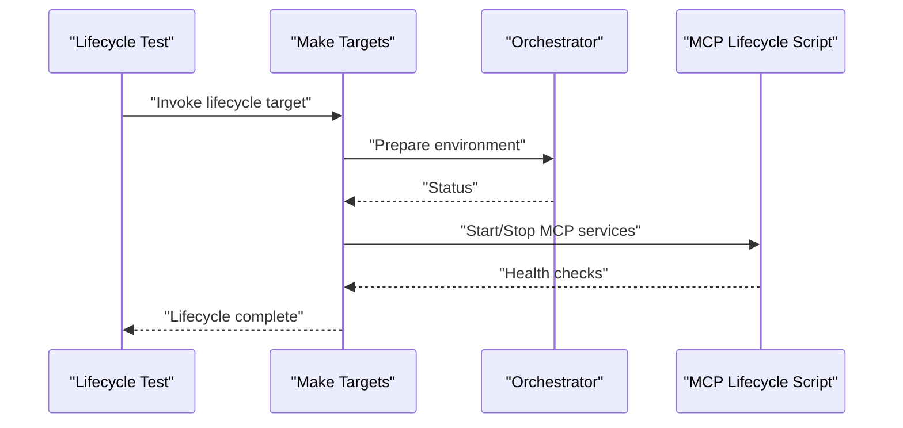
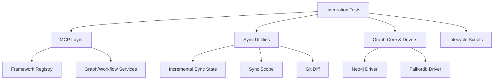

# Integration Testing Workflows

<cite>
**Referenced Files in This Document**
- [test_incremental_sync_bootstrap.py](file://tests/test_incremental_sync_bootstrap.py)
- [test_incremental_sync_cobol.py](file://tests/test_incremental_sync_cobol.py)
- [test_incremental_sync_framework_overlays.py](file://tests/test_incremental_sync_framework_overlays.py)
- [test_incremental_sync_graph_setup.py](file://tests/test_incremental_sync_graph_setup.py)
- [test_incremental_sync_lock.py](file://tests/test_incremental_sync_lock.py)
- [test_incremental_sync_non_git.py](file://tests/test_incremental_sync_non_git.py)
- [test_incremental_sync_state_migration.py](file://tests/test_incremental_sync_state_migration.py)
- [test_incremental_sync_submodules.py](file://tests/test_incremental_sync_submodules.py)
- [test_incremental_sync_worktree.py](file://tests/test_incremental_sync_worktree.py)
- [test_framework_fixture_analysis.py](file://tests/test_framework_fixture_analysis.py)
- [test_framework_graph_contract.py](file://tests/test_framework_graph_contract.py)
- [test_framework_mcp_flows.py](file://tests/test_framework_mcp_flows.py)
- [test_framework_mcp_routing.py](file://tests/test_framework_mcp_routing.py)
- [test_framework_mcp_search.py](file://tests/test_framework_mcp_search.py)
- [test_aspnet_fixture_analysis.py](file://tests/test_aspnet_fixture_analysis.py)
- [test_aspnet_graph_contract.py](file://tests/test_aspnet_graph_contract.py)
- [test_aspnet_integration.py](file://tests/test_aspnet_integration.py)
- [test_cobol_fixture_analysis.py](file://tests/test_cobol_fixture_analysis.py)
- [test_cobol_graph_contract.py](file://tests/test_cobol_graph_contract.py)
- [test_cobol_mcp_routing.py](file://tests/test_cobol_mcp_routing.py)
- [test_perl_integration.py](file://tests/test_perl_integration.py)
- [test_primary_vector_sync.py](file://tests/test_primary_vector_sync.py)
- [test_semantic_graph_expansion.py](file://tests/test_semantic_graph_expansion.py)
- [test_source_inventory.py](file://tests/test_source_inventory.py)
- [test_dev_sync_reliability.py](file://tests/test_dev_sync_reliability.py)
- [test_make_lifecycle.py](file://tests/test_make_lifecycle.py)
- [test_mcp_acceptance_matrix.py](file://tests/test_mcp_acceptance_matrix.py)
- [test_mcp_http_resilience.py](file://tests/test_mcp_http_resilience.py)
- [test_unified_mcp_input_coercion.py](file://tests/test_unified_mcp_input_coercion.py)
- [test_unified_mcp_wrapper_signatures.py](file://tests/test_unified_mcp_wrapper_signatures.py)
- [scripts/mcp-lifecycle.py](file://scripts/mcp-lifecycle.py)
- [harness/scripts/orchestrator.py](file://harness/scripts/orchestrator.py)
- [code-tiny/mcp/unified_mcp.py](file://code-tiny/mcp/unified_mcp.py)
- [code-tiny/mcp/framework_registry.py](file://code-tiny/mcp/framework_registry.py)
- [code-tiny/mcp/services/graph_service.py](file://code-tiny/mcp/services/graph_service.py)
- [code-tiny/mcp/services/workflow_service.py](file://code-tiny/mcp/services/workflow_service.py)
- [code-tiny/tools/common/incremental_sync_state.py](file://code-tiny/tools/common/incremental_sync_state.py)
- [code-tiny/tools/common/sync_scope.py](file://code-tiny/tools/common/sync_scope.py)
- [code-tiny/tools/common/git_diff.py](file://code-tiny/tools/common/git_diff.py)
- [code-tiny/tools/common/source_inventory.py](file://code-tiny/tools/common/source_inventory.py)
- [code-tiny/tools/graph/core/factory.py](file://code-tiny/tools/graph/core/factory.py)
- [code-tiny/tools/graph/driver/neo4j_driver.py](file://code-tiny/tools/graph/driver/neo4j_driver.py)
- [code-tiny/tools/graph/driver/falkordb_driver.py](file://code-tiny/tools/graph/driver/falkordb_driver.py)
</cite>

## Table of Contents
1. [Introduction](#introduction)
2. [Project Structure](#project-structure)
3. [Core Components](#core-components)
4. [Architecture Overview](#architecture-overview)
5. [Detailed Component Analysis](#detailed-component-analysis)
6. [Dependency Analysis](#dependency-analysis)
7. [Performance Considerations](#performance-considerations)
8. [Troubleshooting Guide](#troubleshooting-guide)
9. [Conclusion](#conclusion)
10. [Appendices](#appendices)

## Introduction
This document explains how to design and run integration tests for end-to-end workflows in Cortex Harness. It focuses on validating complete analysis pipelines, framework overlays, and MCP capability routing using fixture-based testing across multiple languages. It also covers graph construction validation, query accuracy, incremental sync workflows (including change detection and state management), and guidelines for setting up realistic test environments that exercise complex interactions between components.

## Project Structure
The repository organizes integration tests under a dedicated tests directory with fixtures representing real-world applications across frameworks and languages. Supporting scripts orchestrate lifecycle tasks, while the MCP layer provides capability routing and service interfaces used by tests. Graph drivers and core utilities are exercised through targeted tests to validate data persistence and retrieval.

```mermaid
graph TB
subgraph "Tests"
T1["test_incremental_sync_*.py"]
T2["test_framework_*.py"]
T3["test_aspnet_*.py"]
T4["test_cobol_*.py"]
T5["test_perl_integration.py"]
T6["test_primary_vector_sync.py"]
T7["test_semantic_graph_expansion.py"]
T8["test_source_inventory.py"]
T9["test_dev_sync_reliability.py"]
T10["test_make_lifecycle.py"]
T11["test_mcp_*.py"]
end
subgraph "MCP Layer"
U["unified_mcp.py"]
FR["framework_registry.py"]
GS["services/graph_service.py"]
WS["services/workflow_service.py"]
end
subgraph "Graph Core"
GF["tools/graph/core/factory.py"]
N4J["tools/graph/driver/neo4j_driver.py"]
FDB["tools/graph/driver/falkordb_driver.py"]
end
subgraph "Sync & Utilities"
ISS["tools/common/incremental_sync_state.py"]
SS["tools/common/sync_scope.py"]
GD["tools/common/git_diff.py"]
SI["tools/common/source_inventory.py"]
end
subgraph "Orchestration"
ORCH["harness/scripts/orchestrator.py"]
MCL["scripts/mcp-lifecycle.py"]
end
T1 --> ISS
T1 --> SS
T1 --> GD
T2 --> FR
T2 --> U
T3 --> U
T4 --> U
T5 --> U
T6 --> N4J
T6 --> FDB
T7 --> GF
T8 --> SI
T9 --> ISS
T10 --> ORCH
T11 --> U
T11 --> GS
T11 --> WS
```

**Diagram sources**
- [test_incremental_sync_bootstrap.py:1-50](file://tests/test_incremental_sync_bootstrap.py#L1-L50)
- [test_framework_mcp_routing.py:1-50](file://tests/test_framework_mcp_routing.py#L1-L50)
- [test_aspnet_integration.py:1-50](file://tests/test_aspnet_integration.py#L1-L50)
- [test_cobol_mcp_routing.py:1-50](file://tests/test_cobol_mcp_routing.py#L1-L50)
- [test_primary_vector_sync.py:1-50](file://tests/test_primary_vector_sync.py#L1-L50)
- [test_semantic_graph_expansion.py:1-50](file://tests/test_semantic_graph_expansion.py#L1-L50)
- [test_source_inventory.py:1-50](file://tests/test_source_inventory.py#L1-L50)
- [test_dev_sync_reliability.py:1-50](file://tests/test_dev_sync_reliability.py#L1-L50)
- [test_make_lifecycle.py:1-50](file://tests/test_make_lifecycle.py#L1-L50)
- [test_mcp_acceptance_matrix.py:1-50](file://tests/test_mcp_acceptance_matrix.py#L1-L50)
- [test_mcp_http_resilience.py:1-50](file://tests/test_mcp_http_resilience.py#L1-L50)
- [unified_mcp.py:1-50](file://code-tiny/mcp/unified_mcp.py#L1-L50)
- [framework_registry.py:1-50](file://code-tiny/mcp/framework_registry.py#L1-L50)
- [graph_service.py:1-50](file://code-tiny/mcp/services/graph_service.py#L1-L50)
- [workflow_service.py:1-50](file://code-tiny/mcp/services/workflow_service.py#L1-L50)
- [incremental_sync_state.py:1-50](file://code-tiny/tools/common/incremental_sync_state.py#L1-L50)
- [sync_scope.py:1-50](file://code-tiny/tools/common/sync_scope.py#L1-L50)
- [git_diff.py:1-50](file://code-tiny/tools/common/git_diff.py#L1-L50)
- [source_inventory.py:1-50](file://code-tiny/tools/common/source_inventory.py#L1-L50)
- [factory.py:1-50](file://code-tiny/tools/graph/core/factory.py#L1-L50)
- [neo4j_driver.py:1-50](file://code-tiny/tools/graph/driver/neo4j_driver.py#L1-L50)
- [falkordb_driver.py:1-50](file://code-tiny/tools/graph/driver/falkordb_driver.py#L1-L50)
- [orchestrator.py:1-50](file://harness/scripts/orchestrator.py#L1-L50)
- [mcp-lifecycle.py:1-50](file://scripts/mcp-lifecycle.py#L1-L50)

**Section sources**
- [test_incremental_sync_bootstrap.py:1-50](file://tests/test_incremental_sync_bootstrap.py#L1-L50)
- [test_framework_mcp_routing.py:1-50](file://tests/test_framework_mcp_routing.py#L1-L50)
- [test_aspnet_integration.py:1-50](file://tests/test_aspnet_integration.py#L1-L50)
- [test_cobol_mcp_routing.py:1-50](file://tests/test_cobol_mcp_routing.py#L1-L50)
- [test_primary_vector_sync.py:1-50](file://tests/test_primary_vector_sync.py#L1-L50)
- [test_semantic_graph_expansion.py:1-50](file://tests/test_semantic_graph_expansion.py#L1-L50)
- [test_source_inventory.py:1-50](file://tests/test_source_inventory.py#L1-L50)
- [test_dev_sync_reliability.py:1-50](file://tests/test_dev_sync_reliability.py#L1-L50)
- [test_make_lifecycle.py:1-50](file://tests/test_make_lifecycle.py#L1-L50)
- [test_mcp_acceptance_matrix.py:1-50](file://tests/test_mcp_acceptance_matrix.py#L1-L50)
- [test_mcp_http_resilience.py:1-50](file://tests/test_mcp_http_resilience.py#L1-L50)
- [unified_mcp.py:1-50](file://code-tiny/mcp/unified_mcp.py#L1-L50)
- [framework_registry.py:1-50](file://code-tiny/mcp/framework_registry.py#L1-L50)
- [graph_service.py:1-50](file://code-tiny/mcp/services/graph_service.py#L1-L50)
- [workflow_service.py:1-50](file://code-tiny/mcp/services/workflow_service.py#L1-L50)
- [incremental_sync_state.py:1-50](file://code-tiny/tools/common/incremental_sync_state.py#L1-L50)
- [sync_scope.py:1-50](file://code-tiny/tools/common/sync_scope.py#L1-L50)
- [git_diff.py:1-50](file://code-tiny/tools/common/git_diff.py#L1-L50)
- [source_inventory.py:1-50](file://code-tiny/tools/common/source_inventory.py#L1-L50)
- [factory.py:1-50](file://code-tiny/tools/graph/core/factory.py#L1-L50)
- [neo4j_driver.py:1-50](file://code-tiny/tools/graph/driver/neo4j_driver.py#L1-L50)
- [falkordb_driver.py:1-50](file://code-tiny/tools/graph/driver/falkordb_driver.py#1-L50)
- [orchestrator.py:1-50](file://harness/scripts/orchestrator.py#L1-L50)
- [mcp-lifecycle.py:1-50](file://scripts/mcp-lifecycle.py#L1-L50)

## Core Components
- Fixture-based multi-language scenarios: Tests use application fixtures to drive end-to-end flows across ASP.NET, Cobol, Perl, and web frameworks. These validate analyzer imports, graph contracts, and MCP routing paths.
- Framework overlays: Tests verify overlay behavior and graph contract compliance for framework-specific analyzers.
- MCP capability routing: Tests assert correct dispatching of queries and tool calls via unified MCP wrappers and registry-driven routing.
- Incremental sync: Tests cover bootstrap, lock semantics, non-Git repositories, submodules, worktrees, state migration, and reliability under dev conditions.
- Graph construction and query accuracy: Tests validate primary vector ingestion, semantic expansion, source inventory completeness, and driver compatibility.

**Section sources**
- [test_aspnet_fixture_analysis.py:1-50](file://tests/test_aspnet_fixture_analysis.py#L1-L50)
- [test_aspnet_graph_contract.py:1-50](file://tests/test_aspnet_graph_contract.py#L1-L50)
- [test_aspnet_integration.py:1-50](file://tests/test_aspnet_integration.py#L1-L50)
- [test_cobol_fixture_analysis.py:1-50](file://tests/test_cobol_fixture_analysis.py#L1-L50)
- [test_cobol_graph_contract.py:1-50](file://tests/test_cobol_graph_contract.py#L1-L50)
- [test_cobol_mcp_routing.py:1-50](file://tests/test_cobol_mcp_routing.py#L1-L50)
- [test_perl_integration.py:1-50](file://tests/test_perl_integration.py#L1-L50)
- [test_framework_fixture_analysis.py:1-50](file://tests/test_framework_fixture_analysis.py#L1-L50)
- [test_framework_graph_contract.py:1-50](file://tests/test_framework_graph_contract.py#L1-L50)
- [test_framework_mcp_flows.py:1-50](file://tests/test_framework_mcp_flows.py#L1-L50)
- [test_framework_mcp_routing.py:1-50](file://tests/test_framework_mcp_routing.py#L1-L50)
- [test_framework_mcp_search.py:1-50](file://tests/test_framework_mcp_search.py#L1-L50)
- [test_incremental_sync_bootstrap.py:1-50](file://tests/test_incremental_sync_bootstrap.py#L1-L50)
- [test_incremental_sync_cobol.py:1-50](file://tests/test_incremental_sync_cobol.py#L1-L50)
- [test_incremental_sync_framework_overlays.py:1-50](file://tests/test_incremental_sync_framework_overlays.py#L1-L50)
- [test_incremental_sync_graph_setup.py:1-50](file://tests/test_incremental_sync_graph_setup.py#L1-L50)
- [test_incremental_sync_lock.py:1-50](file://tests/test_incremental_sync_lock.py#L1-L50)
- [test_incremental_sync_non_git.py:1-50](file://tests/test_incremental_sync_non_git.py#L1-L50)
- [test_incremental_sync_state_migration.py:1-50](file://tests/test_incremental_sync_state_migration.py#L1-L50)
- [test_incremental_sync_submodules.py:1-50](file://tests/test_incremental_sync_submodules.py#L1-L50)
- [test_incremental_sync_worktree.py:1-50](file://tests/test_incremental_sync_worktree.py#L1-L50)
- [test_primary_vector_sync.py:1-50](file://tests/test_primary_vector_sync.py#L1-L50)
- [test_semantic_graph_expansion.py:1-50](file://tests/test_semantic_graph_expansion.py#L1-L50)
- [test_source_inventory.py:1-50](file://tests/test_source_inventory.py#L1-L50)
- [test_dev_sync_reliability.py:1-50](file://tests/test_dev_sync_reliability.py#L1-L50)
- [test_make_lifecycle.py:1-50](file://tests/test_make_lifecycle.py#L1-L50)
- [test_mcp_acceptance_matrix.py:1-50](file://tests/test_mcp_acceptance_matrix.py#L1-L50)
- [test_mcp_http_resilience.py:1-50](file://tests/test_mcp_http_resilience.py#L1-L50)
- [test_unified_mcp_input_coercion.py:1-50](file://tests/test_unified_mcp_input_coercion.py#L1-L50)
- [test_unified_mcp_wrapper_signatures.py:1-50](file://tests/test_unified_mcp_wrapper_signatures.py#L1-L50)

## Architecture Overview
End-to-end integration tests exercise the following flow:
- Test harness initializes fixtures and environment.
- MCP orchestrates capability routing based on framework/language context.
- Analyzers and overlays construct or update the graph.
- Sync utilities detect changes and manage state.
- Drivers persist and serve graph data.
- Queries traverse the graph and return results validated by assertions.

**Diagram sources**
- [test_framework_mcp_flows.py:1-50](file://tests/test_framework_mcp_flows.py#L1-L50)
- [test_framework_mcp_routing.py:1-50](file://tests/test_framework_mcp_routing.py#L1-L50)
- [unified_mcp.py:1-50](file://code-tiny/mcp/unified_mcp.py#L1-L50)
- [framework_registry.py:1-50](file://code-tiny/mcp/framework_registry.py#L1-L50)
- [graph_service.py:1-50](file://code-tiny/mcp/services/graph_service.py#L1-L50)
- [workflow_service.py:1-50](file://code-tiny/mcp/services/workflow_service.py#L1-L50)
- [neo4j_driver.py:1-50](file://code-tiny/tools/graph/driver/neo4j_driver.py#L1-L50)
- [falkordb_driver.py:1-50](file://code-tiny/tools/graph/driver/falkordb_driver.py#L1-L50)
- [incremental_sync_state.py:1-50](file://code-tiny/tools/common/incremental_sync_state.py#L1-L50)
- [orchestrator.py:1-50](file://harness/scripts/orchestrator.py#L1-L50)

## Detailed Component Analysis

### End-to-End Pipeline Testing with Fixtures
Fixture-based tests initialize sample projects (ASP.NET, Cobol, Perl, web frameworks) and execute full analysis pipelines. They validate:
- Analyzer import resolution and runtime discovery.
- Graph contract adherence (nodes, edges, properties).
- MCP routing correctness for language-specific capabilities.
- Query accuracy against known structures.

**Diagram sources**
- [test_aspnet_fixture_analysis.py:1-50](file://tests/test_aspnet_fixture_analysis.py#L1-L50)
- [test_aspnet_graph_contract.py:1-50](file://tests/test_aspnet_graph_contract.py#L1-L50)
- [test_aspnet_integration.py:1-50](file://tests/test_aspnet_integration.py#L1-L50)
- [test_cobol_fixture_analysis.py:1-50](file://tests/test_cobol_fixture_analysis.py#L1-L50)
- [test_cobol_graph_contract.py:1-50](file://tests/test_cobol_graph_contract.py#L1-L50)
- [test_cobol_mcp_routing.py:1-50](file://tests/test_cobol_mcp_routing.py#L1-L50)
- [test_perl_integration.py:1-50](file://tests/test_perl_integration.py#L1-L50)

**Section sources**
- [test_aspnet_fixture_analysis.py:1-50](file://tests/test_aspnet_fixture_analysis.py#L1-L50)
- [test_aspnet_graph_contract.py:1-50](file://tests/test_aspnet_graph_contract.py#L1-L50)
- [test_aspnet_integration.py:1-50](file://tests/test_aspnet_integration.py#L1-L50)
- [test_cobol_fixture_analysis.py:1-50](file://tests/test_cobol_fixture_analysis.py#L1-L50)
- [test_cobol_graph_contract.py:1-50](file://tests/test_cobol_graph_contract.py#L1-L50)
- [test_cobol_mcp_routing.py:1-50](file://tests/test_cobol_mcp_routing.py#L1-L50)
- [test_perl_integration.py:1-50](file://tests/test_perl_integration.py#L1-L50)

### Framework Overlay Validation
Overlay tests ensure framework-specific analyzers integrate correctly with shared graph contracts and MCP services. They verify:
- Overlay registration and activation.
- Graph schema compliance after overlay execution.
- Capability exposure via MCP endpoints.

**Diagram sources**
- [test_framework_fixture_analysis.py:1-50](file://tests/test_framework_fixture_analysis.py#L1-L50)
- [test_framework_graph_contract.py:1-50](file://tests/test_framework_graph_contract.py#L1-L50)
- [test_framework_mcp_flows.py:1-50](file://tests/test_framework_mcp_flows.py#L1-L50)
- [test_framework_mcp_routing.py:1-50](file://tests/test_framework_mcp_routing.py#L1-L50)
- [test_framework_mcp_search.py:1-50](file://tests/test_framework_mcp_search.py#L1-L50)

**Section sources**
- [test_framework_fixture_analysis.py:1-50](file://tests/test_framework_fixture_analysis.py#L1-L50)
- [test_framework_graph_contract.py:1-50](file://tests/test_framework_graph_contract.py#L1-L50)
- [test_framework_mcp_flows.py:1-50](file://tests/test_framework_mcp_flows.py#L1-L50)
- [test_framework_mcp_routing.py:1-50](file://tests/test_framework_mcp_routing.py#L1-L50)
- [test_framework_mcp_search.py:1-50](file://tests/test_framework_mcp_search.py#L1-L50)

### MCP Capability Routing and Acceptance
Routing tests assert that MCP correctly selects providers based on framework/language context and validates input coercion and wrapper signatures. They also include acceptance matrix coverage and HTTP resilience checks.

**Diagram sources**
- [test_framework_mcp_routing.py:1-50](file://tests/test_framework_mcp_routing.py#L1-L50)
- [test_cobol_mcp_routing.py:1-50](file://tests/test_cobol_mcp_routing.py#L1-L50)
- [test_unified_mcp_input_coercion.py:1-50](file://tests/test_unified_mcp_input_coercion.py#L1-L50)
- [test_unified_mcp_wrapper_signatures.py:1-50](file://tests/test_unified_mcp_wrapper_signatures.py#L1-L50)
- [test_mcp_acceptance_matrix.py:1-50](file://tests/test_mcp_acceptance_matrix.py#L1-L50)
- [test_mcp_http_resilience.py:1-50](file://tests/test_mcp_http_resilience.py#L1-L50)
- [unified_mcp.py:1-50](file://code-tiny/mcp/unified_mcp.py#L1-L50)
- [framework_registry.py:1-50](file://code-tiny/mcp/framework_registry.py#L1-L50)
- [graph_service.py:1-50](file://code-tiny/mcp/services/graph_service.py#L1-L50)
- [workflow_service.py:1-50](file://code-tiny/mcp/services/workflow_service.py#L1-L50)

**Section sources**
- [test_framework_mcp_routing.py:1-50](file://tests/test_framework_mcp_routing.py#L1-L50)
- [test_cobol_mcp_routing.py:1-50](file://tests/test_cobol_mcp_routing.py#L1-L50)
- [test_unified_mcp_input_coercion.py:1-50](file://tests/test_unified_mcp_input_coercion.py#L1-L50)
- [test_unified_mcp_wrapper_signatures.py:1-50](file://tests/test_unified_mcp_wrapper_signatures.py#L1-L50)
- [test_mcp_acceptance_matrix.py:1-50](file://tests/test_mcp_acceptance_matrix.py#L1-L50)
- [test_mcp_http_resilience.py:1-50](file://tests/test_mcp_http_resilience.py#L1-L50)
- [unified_mcp.py:1-50](file://code-tiny/mcp/unified_mcp.py#L1-L50)
- [framework_registry.py:1-50](file://code-tiny/mcp/framework_registry.py#L1-L50)
- [graph_service.py:1-50](file://code-tiny/mcp/services/graph_service.py#L1-L50)
- [workflow_service.py:1-50](file://code-tiny/mcp/services/workflow_service.py#L1-L50)

### Incremental Sync Workflows: Change Detection and State Management
Incremental sync tests cover bootstrap, locking, non-Git repos, submodules, worktrees, state migration, and reliability. The workflow includes:
- Detecting changes via Git diff or alternative mechanisms.
- Managing locks to prevent concurrent modifications.
- Persisting and migrating state across runs.
- Validating scope boundaries and submodule handling.

**Diagram sources**
- [test_incremental_sync_bootstrap.py:1-50](file://tests/test_incremental_sync_bootstrap.py#L1-L50)
- [test_incremental_sync_lock.py:1-50](file://tests/test_incremental_sync_lock.py#L1-L50)
- [test_incremental_sync_non_git.py:1-50](file://tests/test_incremental_sync_non_git.py#L1-L50)
- [test_incremental_sync_submodules.py:1-50](file://tests/test_incremental_sync_submodules.py#L1-L50)
- [test_incremental_sync_worktree.py:1-50](file://tests/test_incremental_sync_worktree.py#L1-L50)
- [test_incremental_sync_state_migration.py:1-50](file://tests/test_incremental_sync_state_migration.py#L1-L50)
- [test_incremental_sync_cobol.py:1-50](file://tests/test_incremental_sync_cobol.py#L1-L50)
- [test_incremental_sync_framework_overlays.py:1-50](file://tests/test_incremental_sync_framework_overlays.py#L1-L50)
- [test_incremental_sync_graph_setup.py:1-50](file://tests/test_incremental_sync_graph_setup.py#L1-L50)
- [test_dev_sync_reliability.py:1-50](file://tests/test_dev_sync_reliability.py#L1-L50)
- [incremental_sync_state.py:1-50](file://code-tiny/tools/common/incremental_sync_state.py#L1-L50)
- [sync_scope.py:1-50](file://code-tiny/tools/common/sync_scope.py#L1-L50)
- [git_diff.py:1-50](file://code-tiny/tools/common/git_diff.py#L1-L50)

**Section sources**
- [test_incremental_sync_bootstrap.py:1-50](file://tests/test_incremental_sync_bootstrap.py#L1-L50)
- [test_incremental_sync_lock.py:1-50](file://tests/test_incremental_sync_lock.py#L1-L50)
- [test_incremental_sync_non_git.py:1-50](file://tests/test_incremental_sync_non_git.py#L1-L50)
- [test_incremental_sync_submodules.py:1-50](file://tests/test_incremental_sync_submodules.py#L1-L50)
- [test_incremental_sync_worktree.py:1-50](file://tests/test_incremental_sync_worktree.py#L1-L50)
- [test_incremental_sync_state_migration.py:1-50](file://tests/test_incremental_sync_state_migration.py#L1-L50)
- [test_incremental_sync_cobol.py:1-50](file://tests/test_incremental_sync_cobol.py#L1-L50)
- [test_incremental_sync_framework_overlays.py:1-50](file://tests/test_incremental_sync_framework_overlays.py#L1-L50)
- [test_incremental_sync_graph_setup.py:1-50](file://tests/test_incremental_sync_graph_setup.py#L1-L50)
- [test_dev_sync_reliability.py:1-50](file://tests/test_dev_sync_reliability.py#L1-L50)
- [incremental_sync_state.py:1-50](file://code-tiny/tools/common/incremental_sync_state.py#L1-L50)
- [sync_scope.py:1-50](file://code-tiny/tools/common/sync_scope.py#L1-L50)
- [git_diff.py:1-50](file://code-tiny/tools/common/git_diff.py#L1-L50)

### Graph Construction Validation and Query Accuracy
These tests validate primary vector ingestion, semantic graph expansion, and source inventory completeness. They also check driver compatibility and query correctness.

**Diagram sources**
- [test_primary_vector_sync.py:1-50](file://tests/test_primary_vector_sync.py#L1-L50)
- [test_semantic_graph_expansion.py:1-50](file://tests/test_semantic_graph_expansion.py#L1-L50)
- [test_source_inventory.py:1-50](file://tests/test_source_inventory.py#L1-L50)
- [factory.py:1-50](file://code-tiny/tools/graph/core/factory.py#L1-L50)
- [neo4j_driver.py:1-50](file://code-tiny/tools/graph/driver/neo4j_driver.py#L1-L50)
- [falkordb_driver.py:1-50](file://code-tiny/tools/graph/driver/falkordb_driver.py#L1-L50)

**Section sources**
- [test_primary_vector_sync.py:1-50](file://tests/test_primary_vector_sync.py#L1-L50)
- [test_semantic_graph_expansion.py:1-50](file://tests/test_semantic_graph_expansion.py#L1-L50)
- [test_source_inventory.py:1-50](file://tests/test_source_inventory.py#L1-L50)
- [factory.py:1-50](file://code-tiny/tools/graph/core/factory.py#L1-L50)
- [neo4j_driver.py:1-50](file://code-tiny/tools/graph/driver/neo4j_driver.py#L1-L50)
- [falkordb_driver.py:1-50](file://code-tiny/tools/graph/driver/falkordb_driver.py#L1-L50)

### Lifecycle Orchestration and Make Targets
Lifecycle tests exercise make targets and MCP lifecycle scripts to ensure consistent setup, teardown, and environment readiness.

**Diagram sources**
- [test_make_lifecycle.py:1-50](file://tests/test_make_lifecycle.py#L1-L50)
- [orchestrator.py:1-50](file://harness/scripts/orchestrator.py#L1-L50)
- [mcp-lifecycle.py:1-50](file://scripts/mcp-lifecycle.py#L1-L50)

**Section sources**
- [test_make_lifecycle.py:1-50](file://tests/test_make_lifecycle.py#L1-L50)
- [orchestrator.py:1-50](file://harness/scripts/orchestrator.py#L1-L50)
- [mcp-lifecycle.py:1-50](file://scripts/mcp-lifecycle.py#L1-L50)

## Dependency Analysis
Integration tests depend on:
- MCP layer for capability routing and service invocation.
- Graph core and drivers for persistence and traversal.
- Sync utilities for change detection and state management.
- Orchestration scripts for environment lifecycle.

**Diagram sources**
- [test_framework_mcp_routing.py:1-50](file://tests/test_framework_mcp_routing.py#L1-L50)
- [test_incremental_sync_bootstrap.py:1-50](file://tests/test_incremental_sync_bootstrap.py#L1-L50)
- [test_primary_vector_sync.py:1-50](file://tests/test_primary_vector_sync.py#L1-L50)
- [test_make_lifecycle.py:1-50](file://tests/test_make_lifecycle.py#L1-L50)
- [unified_mcp.py:1-50](file://code-tiny/mcp/unified_mcp.py#L1-L50)
- [framework_registry.py:1-50](file://code-tiny/mcp/framework_registry.py#L1-L50)
- [graph_service.py:1-50](file://code-tiny/mcp/services/graph_service.py#L1-L50)
- [workflow_service.py:1-50](file://code-tiny/mcp/services/workflow_service.py#L1-L50)
- [neo4j_driver.py:1-50](file://code-tiny/tools/graph/driver/neo4j_driver.py#L1-L50)
- [falkordb_driver.py:1-50](file://code-tiny/tools/graph/driver/falkordb_driver.py#L1-L50)
- [incremental_sync_state.py:1-50](file://code-tiny/tools/common/incremental_sync_state.py#L1-L50)
- [sync_scope.py:1-50](file://code-tiny/tools/common/sync_scope.py#L1-L50)
- [git_diff.py:1-50](file://code-tiny/tools/common/git_diff.py#L1-L50)

**Section sources**
- [test_framework_mcp_routing.py:1-50](file://tests/test_framework_mcp_routing.py#L1-L50)
- [test_incremental_sync_bootstrap.py:1-50](file://tests/test_incremental_sync_bootstrap.py#L1-L50)
- [test_primary_vector_sync.py:1-50](file://tests/test_primary_vector_sync.py#L1-L50)
- [test_make_lifecycle.py:1-50](file://tests/test_make_lifecycle.py#L1-L50)
- [unified_mcp.py:1-50](file://code-tiny/mcp/unified_mcp.py#L1-L50)
- [framework_registry.py:1-50](file://code-tiny/mcp/framework_registry.py#L1-L50)
- [graph_service.py:1-50](file://code-tiny/mcp/services/graph_service.py#L1-L50)
- [workflow_service.py:1-50](file://code-tiny/mcp/services/workflow_service.py#L1-L50)
- [neo4j_driver.py:1-50](file://code-tiny/tools/graph/driver/neo4j_driver.py#L1-L50)
- [falkordb_driver.py:1-50](file://code-tiny/tools/graph/driver/falkordb_driver.py#L1-L50)
- [incremental_sync_state.py:1-50](file://code-tiny/tools/common/incremental_sync_state.py#L1-L50)
- [sync_scope.py:1-50](file://code-tiny/tools/common/sync_scope.py#L1-L50)
- [git_diff.py:1-50](file://code-tiny/tools/common/git_diff.py#L1-L50)

## Performance Considerations
- Prefer fixture isolation to avoid cross-test interference and reduce setup overhead.
- Use targeted scopes in incremental sync to minimize reprocessing.
- Cache MCP provider initialization where safe to reduce latency.
- Validate driver connection pooling and query batching for large graphs.
- Monitor memory usage during semantic expansion and vector ingestion.

[No sources needed since this section provides general guidance]

## Troubleshooting Guide
Common issues and resolutions:
- MCP routing failures: Verify framework registry entries and input coercion; consult acceptance matrix and HTTP resilience tests.
- Incremental sync conflicts: Check lock acquisition and release; review state migration logs and scope definitions.
- Graph inconsistencies: Re-run graph factory initialization and driver connectivity checks; validate primary vector ingestion and semantic expansion outputs.
- Lifecycle misconfiguration: Ensure make targets and orchestrator scripts are invoked in the correct order and environment variables are set.

**Section sources**
- [test_mcp_acceptance_matrix.py:1-50](file://tests/test_mcp_acceptance_matrix.py#L1-L50)
- [test_mcp_http_resilience.py:1-50](file://tests/test_mcp_http_resilience.py#L1-L50)
- [test_incremental_sync_lock.py:1-50](file://tests/test_incremental_sync_lock.py#L1-L50)
- [test_incremental_sync_state_migration.py:1-50](file://tests/test_incremental_sync_state_migration.py#L1-L50)
- [test_primary_vector_sync.py:1-50](file://tests/test_primary_vector_sync.py#L1-L50)
- [test_semantic_graph_expansion.py:1-50](file://tests/test_semantic_graph_expansion.py#L1-L50)
- [test_make_lifecycle.py:1-50](file://tests/test_make_lifecycle.py#L1-L50)

## Conclusion
Cortex Harness integration tests provide comprehensive coverage of end-to-end analysis pipelines, framework overlays, and MCP capability routing. Fixture-based scenarios across multiple languages validate graph contracts and query accuracy. Incremental sync tests ensure robust change detection, locking, and state management. By following the guidelines and leveraging the provided diagrams and references, teams can confidently maintain and extend these workflows.

[No sources needed since this section summarizes without analyzing specific files]

## Appendices
- Example test categories:
  - Multi-language pipeline validation: ASP.NET, Cobol, Perl, web frameworks.
  - Framework overlay and graph contract compliance.
  - MCP routing, input coercion, and wrapper signature validation.
  - Incremental sync bootstrap, locking, non-Git, submodules, worktrees, state migration, reliability.
  - Primary vector sync, semantic expansion, source inventory completeness.
  - Lifecycle orchestration via make targets and MCP lifecycle scripts.

[No sources needed since this section aggregates information without direct file analysis]