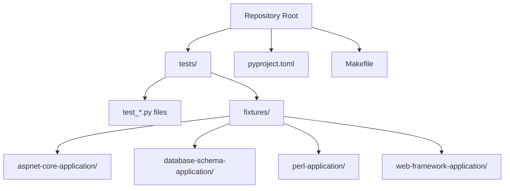
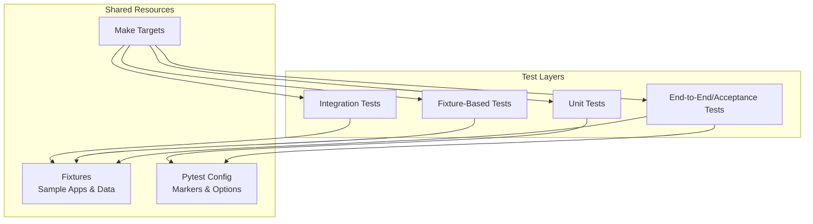
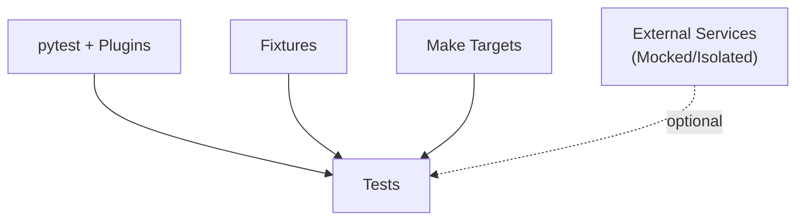

# Test Suite Architecture

<cite>
**Referenced Files in This Document**
- [pyproject.toml](file://pyproject.toml)
- [Makefile](file://Makefile)
- [tests/test_aspnet_integration.py](file://tests/test_aspnet_integration.py)
- [tests/test_cobol_analyzer_imports.py](file://tests/test_cobol_analyzer_imports.py)
- [tests/test_framework_mcp_routing.py](file://tests/test_framework_mcp_routing.py)
- [tests/test_incremental_sync_lock.py](file://tests/test_incremental_sync_lock.py)
- [tests/fixtures/aspnet-core-application/Program.cs](file://tests/fixtures/aspnet-core-application/Program.cs)
- [tests/fixtures/database-schema-application/schema.sql](file://tests/fixtures/database-schema-application/schema.sql)
</cite>

## Table of Contents
1. [Introduction](#introduction)
2. [Project Structure](#project-structure)
3. [Core Components](#core-components)
4. [Architecture Overview](#architecture-overview)
5. [Detailed Component Analysis](#detailed-component-analysis)
6. [Dependency Analysis](#dependency-analysis)
7. [Performance Considerations](#performance-considerations)
8. [Troubleshooting Guide](#troubleshooting-guide)
9. [Conclusion](#conclusion)
10. [Appendices](#appendices)

## Introduction
This document explains the Cortex Harness test suite architecture and testing strategy. It covers unit tests, integration tests, and fixture-based approaches; pytest configuration and markers; shared utilities and fixtures; environment setup; database mocking strategies; external service isolation; how to run specific suites and filter by markers; and guidelines for organizing new tests following established patterns.

## Project Structure
The repository organizes tests under a top-level tests directory with a fixtures subdirectory containing sample applications and data used by integration and end-to-end scenarios. Configuration for Python tooling (including pytest) is centralized in pyproject.toml. The Makefile provides convenience targets for running tests and related tasks.

**Diagram sources**
- [pyproject.toml](file://pyproject.toml)
- [Makefile](file://Makefile)
- [tests/test_aspnet_integration.py](file://tests/test_aspnet_integration.py)
- [tests/fixtures/aspnet-core-application/Program.cs](file://tests/fixtures/aspnet-core-application/Program.cs)
- [tests/fixtures/database-schema-application/schema.sql](file://tests/fixtures/database-schema-application/schema.sql)

**Section sources**
- [pyproject.toml](file://pyproject.toml)
- [Makefile](file://Makefile)
- [tests/test_aspnet_integration.py](file://tests/test_aspnet_integration.py)
- [tests/fixtures/aspnet-core-application/Program.cs](file://tests/fixtures/aspnet-core-application/Program.cs)
- [tests/fixtures/database-schema-application/schema.sql](file://tests/fixtures/database-schema-application/schema.sql)

## Core Components
- Pytest configuration: Centralized in pyproject.toml, including plugin settings, markers, and default options.
- Shared fixtures: Located under tests/fixtures/, providing reusable sample projects and data for integration tests.
- Unit tests: Small, focused tests validating single functions or modules without external dependencies.
- Integration tests: Tests that exercise multiple components together, often using fixtures and isolated environments.
- End-to-end and acceptance tests: Higher-level flows that validate complete workflows, frequently leveraging MCP routing and orchestration.

Key responsibilities:
- Isolation: Each test should be independent and deterministic.
- Reusability: Fixtures and helpers minimize duplication across tests.
- Clarity: Naming and organization follow consistent conventions.

**Section sources**
- [pyproject.toml](file://pyproject.toml)
- [tests/test_cobol_analyzer_imports.py](file://tests/test_cobol_analyzer_imports.py)
- [tests/test_framework_mcp_routing.py](file://tests/test_framework_mcp_routing.py)
- [tests/test_incremental_sync_lock.py](file://tests/test_incremental_sync_lock.py)
- [tests/fixtures/aspnet-core-application/Program.cs](file://tests/fixtures/aspnet-core-application/Program.cs)
- [tests/fixtures/database-schema-application/schema.sql](file://tests/fixtures/database-schema-application/schema.sql)

## Architecture Overview
The test suite follows a layered approach:
- Unit layer: Fast, pure-Python tests targeting logic with no side effects.
- Integration layer: Tests that coordinate multiple subsystems (e.g., analyzers, graph providers, MCP services).
- Fixture-driven layer: Tests that rely on sample applications and schemas to simulate realistic scenarios.
- Orchestration layer: Tests that drive higher-level workflows via CLI or internal APIs.

[No sources needed since this diagram shows conceptual workflow, not actual code structure]

## Detailed Component Analysis

### Pytest Configuration and Markers
- Configuration location: pyproject.toml contains pytest settings, plugins, and marker definitions.
- Common markers:
  - slow: Marks long-running tests to allow selective execution.
  - integration: Marks tests requiring external resources or longer setup.
  - mcp: Marks tests exercising MCP routing and protocol behaviors.
  - db: Marks tests interacting with databases or schema fixtures.
- Default behavior:
  - Skip slow/integration tests by default unless explicitly requested.
  - Configure logging verbosity and output formatting.

Usage examples:
- Run all tests: standard pytest invocation.
- Include slow tests: use marker selection.
- Filter by category: select integration or mcp markers.

**Section sources**
- [pyproject.toml](file://pyproject.toml)

### Fixtures and Sample Applications
- Location: tests/fixtures/
- Purpose: Provide stable, versioned sample projects and data for reproducible tests.
- Examples:
  - aspnet-core-application: Minimal ASP.NET Core app used to validate analyzer outputs and graph contracts.
  - database-schema-application: SQL schema and scripts for DB-related tests.
  - perl-application: Sample Perl project for parser and incremental sync tests.
  - web-framework-application: Multi-language web samples for overlay and framework detection tests.

Best practices:
- Keep fixtures minimal and focused on the scenario being tested.
- Use descriptive names and include README notes when necessary.
- Avoid secrets or sensitive data in fixtures.

**Section sources**
- [tests/fixtures/aspnet-core-application/Program.cs](file://tests/fixtures/aspnet-core-application/Program.cs)
- [tests/fixtures/database-schema-application/schema.sql](file://tests/fixtures/database-schema-application/schema.sql)

### Unit Tests
Characteristics:
- No external dependencies (no network, no real DB).
- Deterministic and fast.
- Focus on single units of logic.

Examples:
- Import validation tests ensure module availability and correct entry points.
- Utility function tests validate parsing, normalization, and transformation logic.

Guidelines:
- Name files as test_<module>.py.
- Group related tests into classes where appropriate.
- Use parameterization for multiple inputs/outputs.

**Section sources**
- [tests/test_cobol_analyzer_imports.py](file://tests/test_cobol_analyzer_imports.py)

### Integration Tests
Characteristics:
- Coordinate multiple components (analyzers, graph providers, MCP services).
- May require temporary directories, mock services, or lightweight containers.
- Often use fixtures to set up realistic scenarios.

Examples:
- ASP.NET integration tests validate end-to-end analysis pipelines against the ASP.NET Core fixture.
- Incremental sync lock tests verify concurrency control and state consistency.

Guidelines:
- Mark integration tests with an integration marker.
- Use context managers or fixtures to manage lifecycle (setup/teardown).
- Prefer in-memory or ephemeral resources to avoid flakiness.

**Section sources**
- [tests/test_aspnet_integration.py](file://tests/test_aspnet_integration.py)
- [tests/test_incremental_sync_lock.py](file://tests/test_incremental_sync_lock.py)

### MCP Routing and Protocol Tests
Characteristics:
- Validate MCP capability routing, request/response coercion, and resilience.
- Often use mocks for external services and HTTP layers.
- Ensure backward compatibility and contract adherence.

Examples:
- Framework MCP routing tests confirm correct dispatch based on capabilities.
- Acceptance matrix tests assert feature coverage across frameworks.

Guidelines:
- Use dedicated markers (e.g., mcp) to categorize these tests.
- Mock network calls and external state.
- Assert both success paths and error handling.

**Section sources**
- [tests/test_framework_mcp_routing.py](file://tests/test_framework_mcp_routing.py)

### Database Mocking Strategies
Approaches:
- In-memory databases or lightweight embedded stores for speed and isolation.
- Temporary file-backed stores to simulate persistence without external servers.
- Schema fixtures to initialize expected structures before tests.

Recommendations:
- Always reset state between tests.
- Use fixtures to create and tear down DB instances.
- Validate schema migrations and constraints with dedicated tests.

**Section sources**
- [tests/fixtures/database-schema-application/schema.sql](file://tests/fixtures/database-schema-application/schema.sql)

### External Service Isolation
Strategies:
- Mock HTTP clients and network sockets.
- Use local echo servers or stubs for MCP endpoints during tests.
- Environment variables to toggle real vs. mocked backends.

Recommendations:
- Keep network calls out of unit tests.
- Provide clear markers for tests that require external services.
- Fail fast with informative messages when required services are unavailable.

**Section sources**
- [tests/test_framework_mcp_routing.py](file://tests/test_framework_mcp_routing.py)

### Running Specific Test Suites and Filtering by Markers
Common commands:
- Run all tests: invoke pytest from the repository root.
- Include slow tests: select slow marker.
- Run integration tests only: select integration marker.
- Run MCP-related tests: select mcp marker.
- Combine markers: e.g., integration and slow.
- Exclude markers: e.g., skip slow tests.

Makefile targets:
- Provide shortcuts for common runs (e.g., unit-only, integration-only, full suite).
- Allow passing extra pytest arguments for verbosity or parallelism.

**Section sources**
- [pyproject.toml](file://pyproject.toml)
- [Makefile](file://Makefile)

### Organizing New Tests
Conventions:
- Place unit tests next to the module under test or under tests/unit if preferred.
- Place integration tests under tests/integration or co-located with relevant features.
- Use descriptive test names that convey the scenario and expectation.
- Leverage existing fixtures rather than duplicating setup logic.
- Apply markers consistently to enable filtering and CI optimization.

Checklist:
- Is the test deterministic?
- Does it isolate external dependencies?
- Are fixtures reused appropriately?
- Is the marker applied correctly?
- Are assertions explicit and helpful on failure?

**Section sources**
- [tests/test_aspnet_integration.py](file://tests/test_aspnet_integration.py)
- [tests/test_incremental_sync_lock.py](file://tests/test_incremental_sync_lock.py)
- [tests/test_framework_mcp_routing.py](file://tests/test_framework_mcp_routing.py)

## Dependency Analysis
The test suite depends on:
- Pytest and configured plugins for discovery, collection, and reporting.
- Fixtures for sample applications and data.
- Optional external services (MCP endpoints, databases) which are mocked or isolated in most cases.

[No sources needed since this diagram shows conceptual relationships, not actual code structure]

**Section sources**
- [pyproject.toml](file://pyproject.toml)
- [Makefile](file://Makefile)

## Performance Considerations
- Prefer unit tests for fast feedback; mark heavy tests with slow.
- Use fixtures to reduce repeated setup overhead.
- Parallelize where safe; ensure tests do not share mutable global state.
- Minimize disk I/O and network calls; prefer in-memory alternatives.
- Cache expensive computations within a test session when appropriate.

[No sources needed since this section provides general guidance]

## Troubleshooting Guide
Common issues and resolutions:
- Missing markers: Ensure markers are defined in configuration and applied consistently.
- Flaky integration tests: Add retries or timeouts; isolate shared state; use ephemeral resources.
- Fixture path errors: Verify relative paths and working directory expectations.
- External service failures: Confirm mocks are active; check environment toggles; provide clear error messages.

Debugging tips:
- Increase verbosity to capture detailed logs.
- Use markers to narrow down failing subsets.
- Inspect temporary directories created by tests.

**Section sources**
- [pyproject.toml](file://pyproject.toml)
- [Makefile](file://Makefile)

## Conclusion
The Cortex Harness test suite employs a layered strategy combining unit, integration, and fixture-driven tests, governed by centralized pytest configuration and supported by Makefile targets. Consistent use of markers, fixtures, and isolation techniques ensures reliability and performance. Following the provided guidelines will help maintain clarity, reusability, and scalability as the test suite grows.

[No sources needed since this section summarizes without analyzing specific files]

## Appendices

### Quick Reference: Running Tests
- All tests: pytest
- Slow tests: pytest -m slow
- Integration tests: pytest -m integration
- MCP tests: pytest -m mcp
- Exclude slow: pytest -m "not slow"
- Verbose output: pytest -v
- Parallel execution: pytest -n auto (if configured)

**Section sources**
- [pyproject.toml](file://pyproject.toml)
- [Makefile](file://Makefile)