# Testing & Development Workflow

<cite>
**Referenced Files in This Document**
- [Makefile](file://Makefile)
- [ReadMe.md](file://ReadMe.md)
- [.github/workflows/cobol-macos.yml](file://.github/workflows/cobol-macos.yml)
- [.github/workflows/lifecycle-macos.yml](file://.github/workflows/lifecycle-macos.yml)
- [tests/test_make_lifecycle.py](file://tests/test_make_lifecycle.py)
- [harness/scripts/orchestrator.py](file://harness/scripts/orchestrator.py)
- [harness/scripts/verify.sh](file://harness/scripts/verify.sh)
- [scripts/mcp-lifecycle.py](file://scripts/mcp-lifecycle.py)
- [scripts/mcp-lifecycle.ps1](file://scripts/mcp-lifecycle.ps1)
- [cortex_harness/dev.py](file://cortex_harness/dev.py)
- [dev-global.cmd](file://dev-global.cmd)
- [dev.bat](file://dev.bat)
- [dev.ps1](file://dev.ps1)
- [dev.sh](file://dev.sh)
- [install-windows.bat](file://install-windows.bat)
- [install-windows.ps1](file://install-windows.ps1)
- [requirements.txt](file://requirements.txt)
- [pyproject.toml](file://pyproject.toml)
- [tests/fixtures/web-framework-application/python/fastapi_app.py](file://tests/fixtures/web-framework-application/python/fastapi_app.py)
- [tests/test_mcp_http_resilience.py](file://tests/test_mcp_http_resilience.py)
- [tests/test_framework_fixture_analysis.py](file://tests/test_framework_fixture_analysis.py)
- [tests/test_incremental_sync_lock.py](file://tests/test_incremental_sync_lock.py)
- [tests/test_primary_vector_sync.py](file://tests/test_primary_vector_sync.py)
</cite>

## Table of Contents
1. [Introduction](#introduction)
2. [Project Structure](#project-structure)
3. [Core Components](#core-components)
4. [Architecture Overview](#architecture-overview)
5. [Detailed Component Analysis](#detailed-component-analysis)
6. [Dependency Analysis](#dependency-analysis)
7. [Performance Considerations](#performance-considerations)
8. [Troubleshooting Guide](#troubleshooting-guide)
9. [Conclusion](#conclusion)
10. [Appendices](#appendices)

## Introduction
This document explains how to set up and run continuous integration, automated testing pipelines, and quality gates for Cortex Harness. It also provides local development testing practices, debugging techniques for test failures, performance profiling methods, guidelines for writing maintainable tests, managing test data, handling flaky tests, and troubleshooting common issues with environment setup and CI/CD pipeline failures.

## Project Structure
The repository organizes testing and development workflows across several areas:
- GitHub Actions workflows under .github/workflows define CI jobs for macOS environments.
- A top-level Makefile exposes lifecycle targets that orchestrate tasks such as linting, testing, and verification.
- The harness/scripts directory contains orchestrators and verification scripts used by both local and CI flows.
- The scripts directory includes cross-platform lifecycle helpers (Python and PowerShell).
- The tests directory contains unit, integration, and fixture-based tests.
- Platform-specific installers and dev entry points support local development on Windows and Unix-like systems.

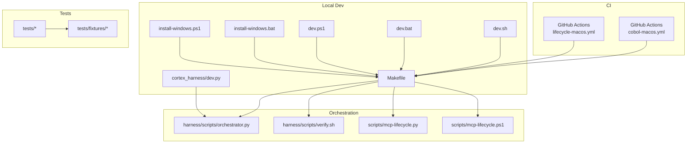

**Diagram sources**
- [.github/workflows/cobol-macos.yml](file://.github/workflows/cobol-macos.yml)
- [.github/workflows/lifecycle-macos.yml](file://.github/workflows/lifecycle-macos.yml)
- [Makefile](file://Makefile)
- [harness/scripts/orchestrator.py](file://harness/scripts/orchestrator.py)
- [harness/scripts/verify.sh](file://harness/scripts/verify.sh)
- [scripts/mcp-lifecycle.py](file://scripts/mcp-lifecycle.py)
- [scripts/mcp-lifecycle.ps1](file://scripts/mcp-lifecycle.ps1)
- [cortex_harness/dev.py](file://cortex_harness/dev.py)
- [dev.sh](file://dev.sh)
- [dev.bat](file://dev.bat)
- [dev.ps1](file://dev.ps1)
- [install-windows.bat](file://install-windows.bat)
- [install-windows.ps1](file://install-windows.ps1)
- [tests/test_make_lifecycle.py](file://tests/test_make_lifecycle.py)

**Section sources**
- [ReadMe.md](file://ReadMe.md)
- [Makefile](file://Makefile)
- [.github/workflows/cobol-macos.yml](file://.github/workflows/cobol-macos.yml)
- [.github/workflows/lifecycle-macos.yml](file://.github/workflows/lifecycle-macos.yml)

## Core Components
- CI Workflows: Define job steps for dependency installation, running tests, and reporting results on macOS runners.
- Makefile Targets: Provide a unified interface for developers to run linters, tests, and verification scripts consistently across platforms.
- Orchestrator and Verification Scripts: Centralize task execution and validation logic used by both local and CI flows.
- Cross-Platform Lifecycle Helpers: Python and PowerShell utilities to standardize MCP-related lifecycle operations.
- Test Suite: Unit and integration tests covering analyzers, graph contracts, MCP routing, incremental sync, and more.
- Fixtures: Reusable sample projects and inputs to drive deterministic tests.

Key responsibilities:
- CI Workflows ensure consistent builds and tests on remote runners.
- Makefile targets abstract platform differences and provide quick commands for daily work.
- Orchestrator and verify scripts encapsulate reusable logic for complex operations.
- Tests validate correctness, compatibility, and resilience of core features.
- Fixtures enable repeatable scenarios without external dependencies.

**Section sources**
- [Makefile](file://Makefile)
- [harness/scripts/orchestrator.py](file://harness/scripts/orchestrator.py)
- [harness/scripts/verify.sh](file://harness/scripts/verify.sh)
- [scripts/mcp-lifecycle.py](file://scripts/mcp-lifecycle.py)
- [scripts/mcp-lifecycle.ps1](file://scripts/mcp-lifecycle.ps1)
- [tests/test_make_lifecycle.py](file://tests/test_make_lifecycle.py)

## Architecture Overview
The development and CI architecture integrates GitHub Actions with local Makefile-driven workflows. Developers invoke Make targets to run the same checks executed in CI. Orchestration scripts centralize behavior, while tests validate functionality against fixtures.

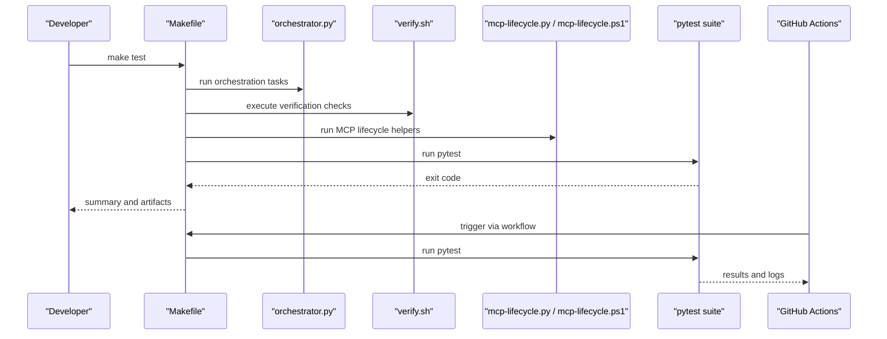

**Diagram sources**
- [Makefile](file://Makefile)
- [harness/scripts/orchestrator.py](file://harness/scripts/orchestrator.py)
- [harness/scripts/verify.sh](file://harness/scripts/verify.sh)
- [scripts/mcp-lifecycle.py](file://scripts/mcp-lifecycle.py)
- [scripts/mcp-lifecycle.ps1](file://scripts/mcp-lifecycle.ps1)
- [.github/workflows/lifecycle-macos.yml](file://.github/workflows/lifecycle-macos.yml)

## Detailed Component Analysis

### Continuous Integration Setup
- GitHub Actions workflows define macOS jobs that install dependencies, run tests, and report outcomes.
- Workflows are organized per feature area (e.g., Cobol) and general lifecycle tasks.
- Jobs typically use pinned runner images and cache dependencies to speed up runs.

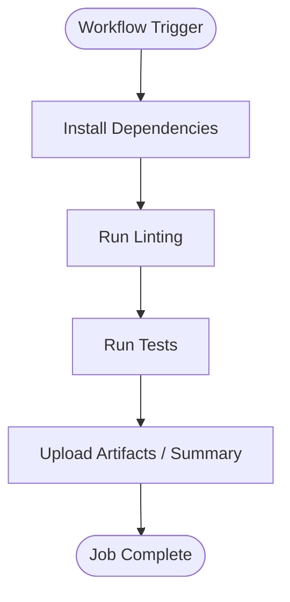

**Diagram sources**
- [.github/workflows/cobol-macos.yml](file://.github/workflows/cobol-macos.yml)
- [.github/workflows/lifecycle-macos.yml](file://.github/workflows/lifecycle-macos.yml)

**Section sources**
- [.github/workflows/cobol-macos.yml](file://.github/workflows/cobol-macos.yml)
- [.github/workflows/lifecycle-macos.yml](file://.github/workflows/lifecycle-macos.yml)

### Automated Testing Pipelines
- The Makefile exposes a test target that invokes the test runner and any required setup.
- Tests cover analyzer imports, graph contracts, MCP routing, HTTP resilience, incremental sync, and more.
- Fixture-based tests use sample applications to validate parsing and analysis pipelines deterministically.

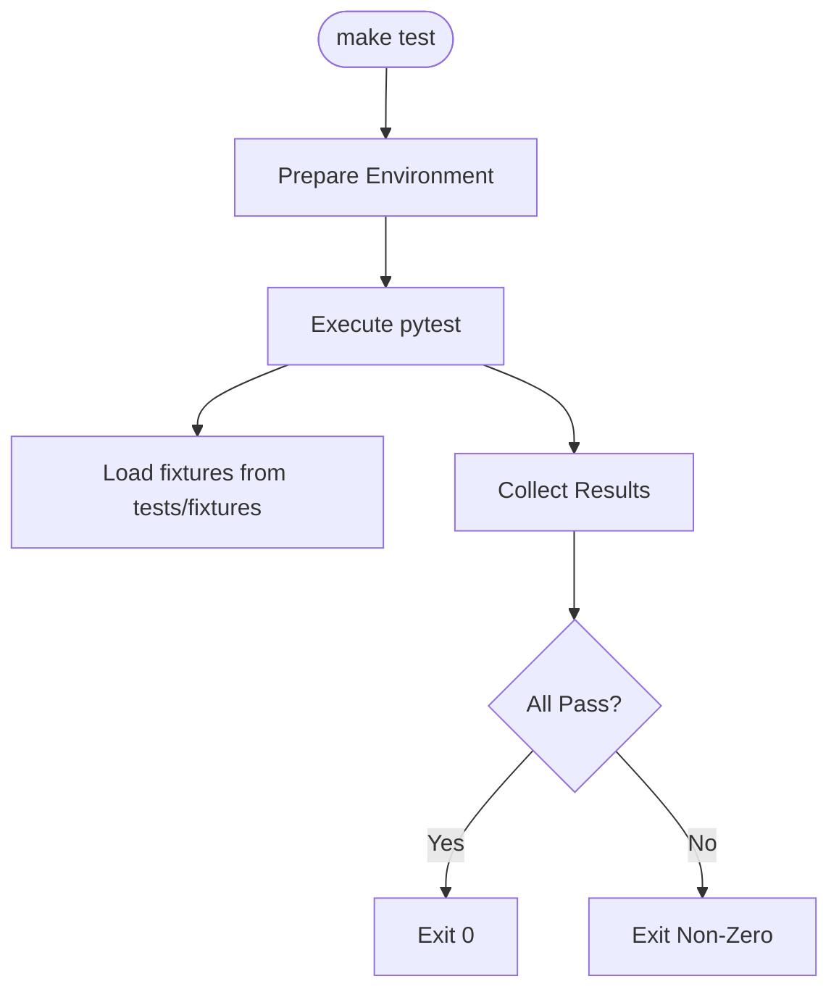

**Diagram sources**
- [Makefile](file://Makefile)
- [tests/test_make_lifecycle.py](file://tests/test_make_lifecycle.py)
- [tests/fixtures/web-framework-application/python/fastapi_app.py](file://tests/fixtures/web-framework-application/python/fastapi_app.py)

**Section sources**
- [Makefile](file://Makefile)
- [tests/test_make_lifecycle.py](file://tests/test_make_lifecycle.py)
- [tests/fixtures/web-framework-application/python/fastapi_app.py](file://tests/fixtures/web-framework-application/python/fastapi_app.py)

### Quality Assurance Gates
- Verification script enforces preconditions and postconditions for critical operations.
- Makefile targets can gate merges by requiring successful verification runs.
- Tests assert protocol contracts, security properties, and behavioral expectations.

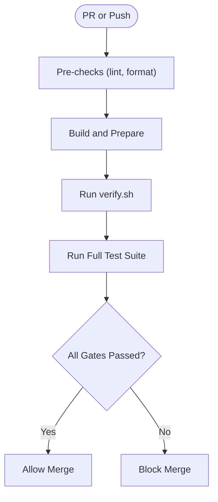

**Diagram sources**
- [harness/scripts/verify.sh](file://harness/scripts/verify.sh)
- [Makefile](file://Makefile)

**Section sources**
- [harness/scripts/verify.sh](file://harness/scripts/verify.sh)
- [Makefile](file://Makefile)

### Local Development Testing Practices
- Use the Makefile to run standardized tasks locally, mirroring CI behavior.
- Leverage platform-specific dev entry points to bootstrap services and tools.
- Utilize fixtures to simulate real-world scenarios without external dependencies.

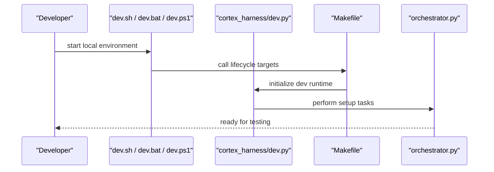

**Diagram sources**
- [dev.sh](file://dev.sh)
- [dev.bat](file://dev.bat)
- [dev.ps1](file://dev.ps1)
- [cortex_harness/dev.py](file://cortex_harness/dev.py)
- [Makefile](file://Makefile)
- [harness/scripts/orchestrator.py](file://harness/scripts/orchestrator.py)

**Section sources**
- [dev.sh](file://dev.sh)
- [dev.bat](file://dev.bat)
- [dev.ps1](file://dev.ps1)
- [cortex_harness/dev.py](file://cortex_harness/dev.py)
- [Makefile](file://Makefile)
- [harness/scripts/orchestrator.py](file://harness/scripts/orchestrator.py)

### Debugging Techniques for Test Failures
- Isolate failing tests using targeted invocation patterns supported by the test runner.
- Inspect logs produced by orchestration and verification scripts to identify root causes.
- Validate fixtures and environment state before re-running tests.

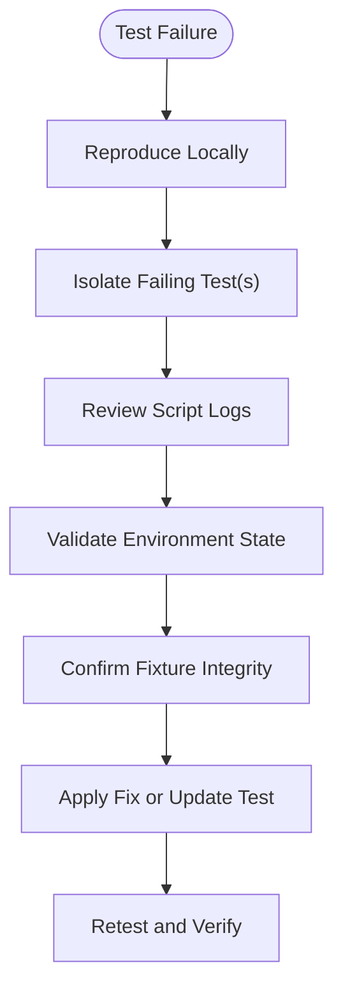

[No sources needed since this section provides general guidance]

### Performance Profiling Methods
- Profile long-running tests or heavy operations using the language’s built-in profilers.
- Measure I/O-bound operations (e.g., vector sync) to identify bottlenecks.
- Use timing markers around critical sections to quantify improvements.

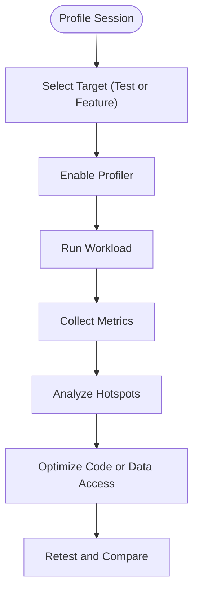

[No sources needed since this section provides general guidance]

### Guidelines for Writing Maintainable Tests
- Keep tests focused on a single responsibility and avoid coupling to implementation details.
- Prefer deterministic fixtures over live network calls; mock external services when necessary.
- Use descriptive names and clear assertions to communicate intent.
- Organize tests by feature area and keep shared helpers in dedicated modules.

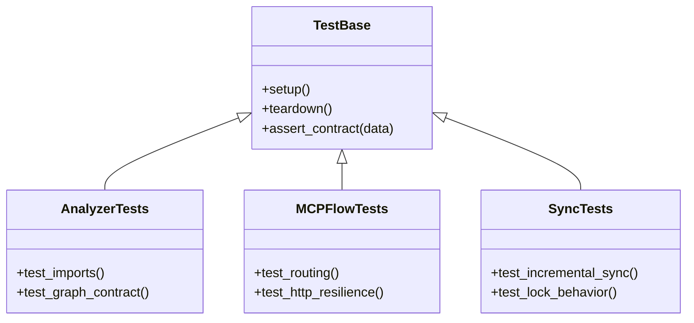

**Diagram sources**
- [tests/test_framework_fixture_analysis.py](file://tests/test_framework_fixture_analysis.py)
- [tests/test_mcp_http_resilience.py](file://tests/test_mcp_http_resilience.py)
- [tests/test_incremental_sync_lock.py](file://tests/test_incremental_sync_lock.py)
- [tests/test_primary_vector_sync.py](file://tests/test_primary_vector_sync.py)

**Section sources**
- [tests/test_framework_fixture_analysis.py](file://tests/test_framework_fixture_analysis.py)
- [tests/test_mcp_http_resilience.py](file://tests/test_mcp_http_resilience.py)
- [tests/test_incremental_sync_lock.py](file://tests/test_incremental_sync_lock.py)
- [tests/test_primary_vector_sync.py](file://tests/test_primary_vector_sync.py)

### Managing Test Data
- Store sample projects and inputs under tests/fixtures to ensure reproducibility.
- Version fixtures alongside code changes to prevent drift.
- Provide minimal datasets that exercise key paths without unnecessary complexity.

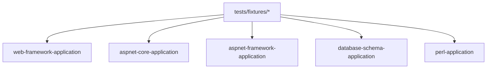

**Diagram sources**
- [tests/fixtures/web-framework-application/python/fastapi_app.py](file://tests/fixtures/web-framework-application/python/fastapi_app.py)

**Section sources**
- [tests/fixtures/web-framework-application/python/fastapi_app.py](file://tests/fixtures/web-framework-application/python/fastapi_app.py)

### Handling Flaky Tests
- Identify intermittent failures by examining CI logs and timestamps.
- Add retries only for known transient conditions; prefer fixing root causes.
- Stabilize time-dependent logic by mocking clocks or using fixed seeds.
- Separate slow or unstable tests into dedicated suites to reduce noise.

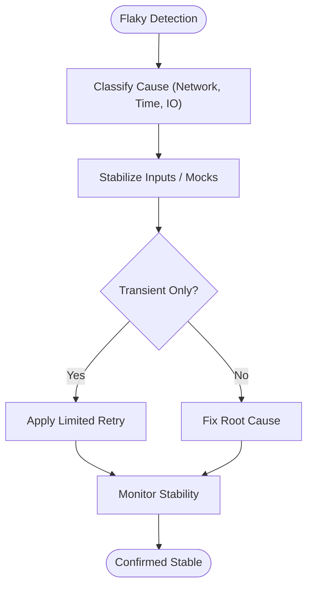

[No sources needed since this section provides general guidance]

## Dependency Analysis
The testing and development workflow depends on:
- Python packages defined in requirements files and project configuration.
- Platform-specific installers and dev scripts for bootstrapping.
- Orchestration and verification scripts invoked by Makefile targets.
- GitHub Actions runners configured for macOS.

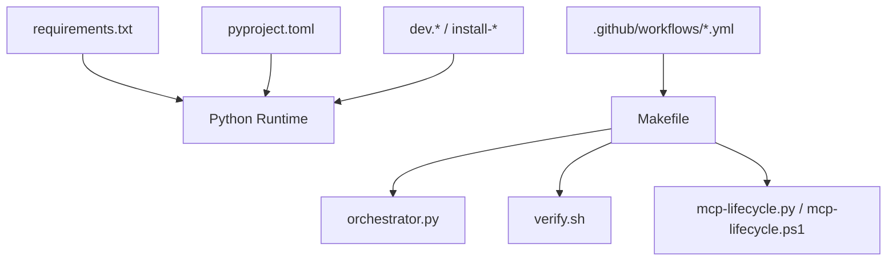

**Diagram sources**
- [requirements.txt](file://requirements.txt)
- [pyproject.toml](file://pyproject.toml)
- [dev-global.cmd](file://dev-global.cmd)
- [dev.bat](file://dev.bat)
- [dev.ps1](file://dev.ps1)
- [dev.sh](file://dev.sh)
- [install-windows.bat](file://install-windows.bat)
- [install-windows.ps1](file://install-windows.ps1)
- [Makefile](file://Makefile)
- [harness/scripts/orchestrator.py](file://harness/scripts/orchestrator.py)
- [harness/scripts/verify.sh](file://harness/scripts/verify.sh)
- [scripts/mcp-lifecycle.py](file://scripts/mcp-lifecycle.py)
- [scripts/mcp-lifecycle.ps1](file://scripts/mcp-lifecycle.ps1)
- [.github/workflows/cobol-macos.yml](file://.github/workflows/cobol-macos.yml)
- [.github/workflows/lifecycle-macos.yml](file://.github/workflows/lifecycle-macos.yml)

**Section sources**
- [requirements.txt](file://requirements.txt)
- [pyproject.toml](file://pyproject.toml)
- [Makefile](file://Makefile)
- [harness/scripts/orchestrator.py](file://harness/scripts/orchestrator.py)
- [harness/scripts/verify.sh](file://harness/scripts/verify.sh)
- [scripts/mcp-lifecycle.py](file://scripts/mcp-lifecycle.py)
- [scripts/mcp-lifecycle.ps1](file://scripts/mcp-lifecycle.ps1)
- [.github/workflows/cobol-macos.yml](file://.github/workflows/cobol-macos.yml)
- [.github/workflows/lifecycle-macos.yml](file://.github/workflows/lifecycle-macos.yml)

## Performance Considerations
- Cache dependencies in CI to reduce startup times.
- Parallelize independent test groups where possible.
- Avoid heavy I/O in hot paths; prefer in-memory structures for intermediate results.
- Profile vector synchronization and graph operations to identify optimization opportunities.

[No sources needed since this section provides general guidance]

## Troubleshooting Guide
Common issues and resolutions:
- Environment setup problems: Ensure platform-specific installers and dev scripts are executed prior to running tests.
- Missing dependencies: Align local environment with requirements and project configuration.
- CI failures: Review workflow logs and compare with local runs to isolate environment differences.
- Fixture mismatches: Update fixtures to reflect current schemas and expected outputs.

Actionable steps:
- Re-run the failing target locally with verbose output.
- Validate prerequisites using the verification script.
- Check for recent changes in orchestration or lifecycle helpers.
- Confirm that fixtures are present and unmodified unless intentionally updated.

**Section sources**
- [harness/scripts/verify.sh](file://harness/scripts/verify.sh)
- [Makefile](file://Makefile)
- [install-windows.bat](file://install-windows.bat)
- [install-windows.ps1](file://install-windows.ps1)
- [dev-global.cmd](file://dev-global.cmd)

## Conclusion
Cortex Harness integrates CI, local development, and testing through a cohesive set of Makefile targets, orchestration scripts, and GitHub Actions workflows. By following the practices outlined here—using fixtures, stabilizing tests, profiling performance, and leveraging verification gates—you can maintain a reliable and efficient development workflow.

[No sources needed since this section summarizes without analyzing specific files]

## Appendices
- Quick reference for common commands:
  - Run tests locally: use the Makefile test target.
  - Bootstrap local environment: use platform-specific dev scripts.
  - Execute verification checks: use the verification script.
  - Trigger MCP lifecycle tasks: use the provided Python or PowerShell helpers.

[No sources needed since this section provides general guidance]