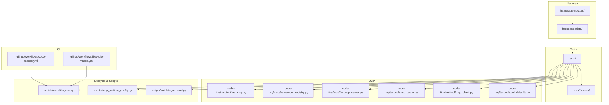
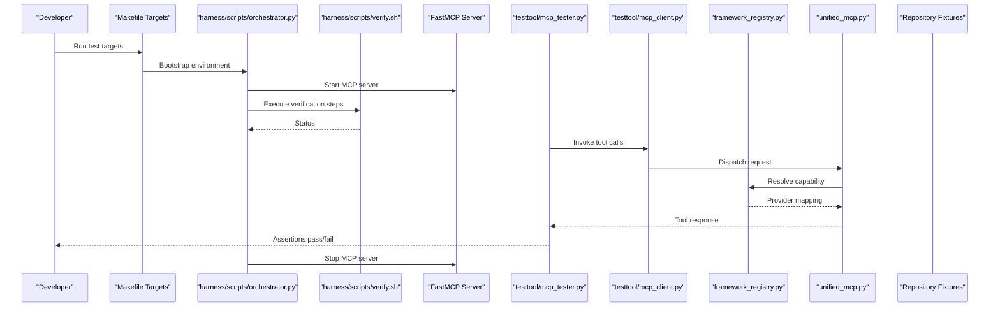
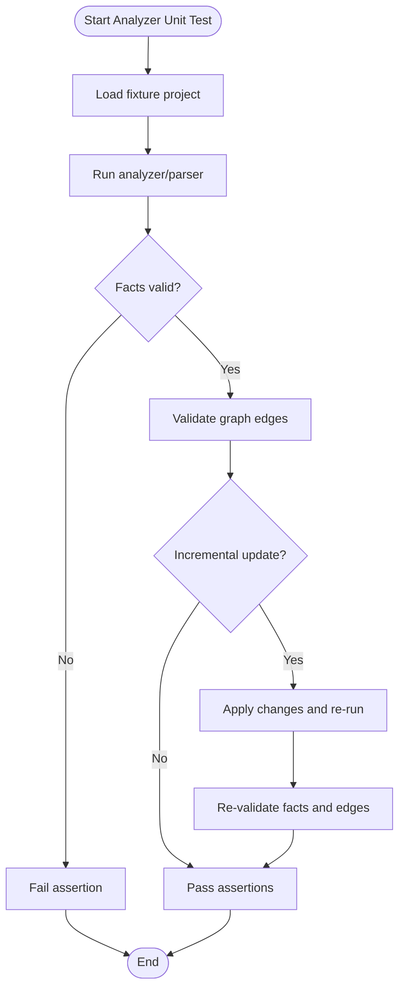
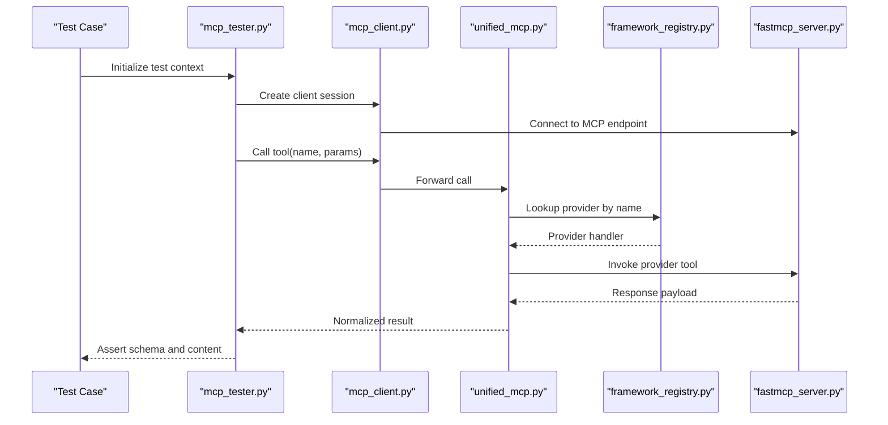
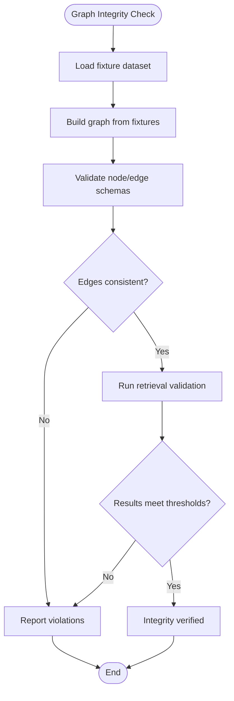
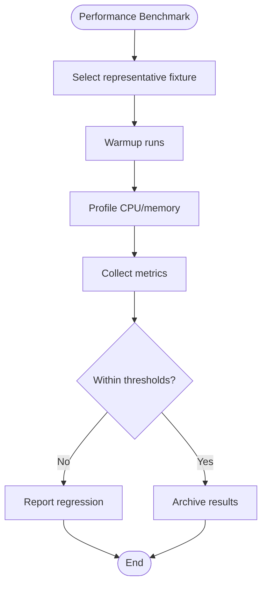
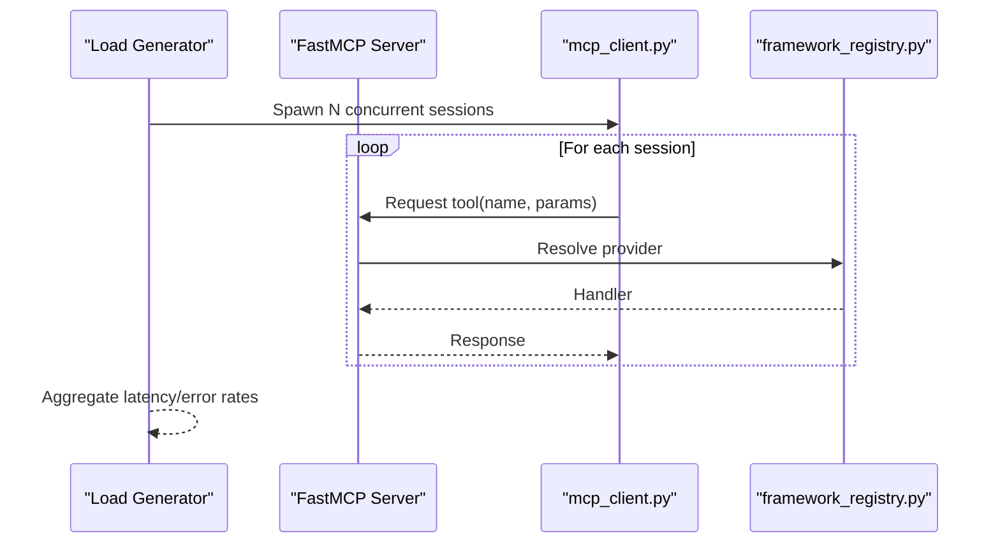
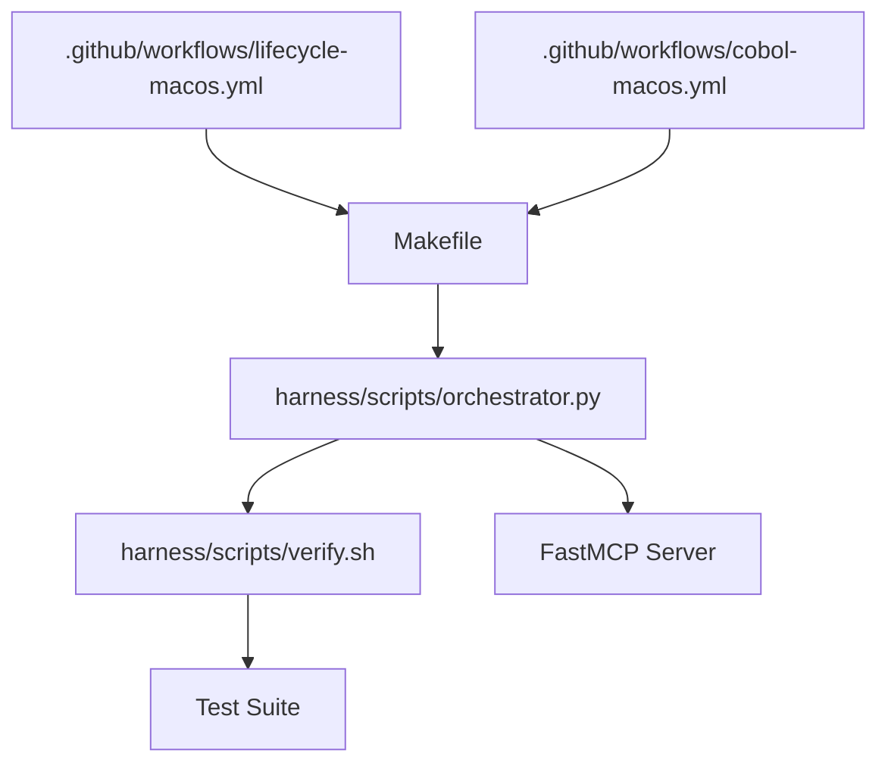
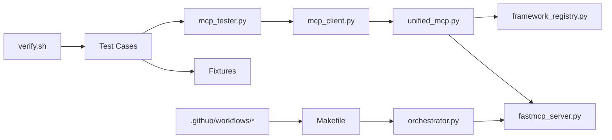

# Testing & Validation

<cite>
**Referenced Files in This Document**
- [ReadMe.md](file://ReadMe.md)
- [Makefile](file://Makefile)
- [pyproject.toml](file://pyproject.toml)
- [requirements.txt](file://requirements.txt)
- [dev.sh](file://dev.sh)
- [dev.bat](file://dev.bat)
- [dev.ps1](file://dev.ps1)
- [cortex_harness/dev.py](file://cortex_harness/dev.py)
- [harness/scripts/orchestrator.py](file://harness/scripts/orchestrator.py)
- [harness/scripts/verify.sh](file://harness/scripts/verify.sh)
- [harness/templates/config.yaml](file://harness/templates/config.yaml)
- [code-tiny/mcp/unified_mcp.py](file://code-tiny/mcp/unified_mcp.py)
- [code-tiny/mcp/framework_registry.py](file://code-tiny/mcp/framework_registry.py)
- [code-tiny/mcp/fastmcp_server.py](file://code-tiny/mcp/fastmcp_server.py)
- [code-tiny/testtool/mcp_tester.py](file://code-tiny/testtool/mcp_tester.py)
- [code-tiny/testtool/mcp_client.py](file://code-tiny/testtool/mcp_client.py)
- [code-tiny/testtool/tool_defaults.py](file://code-tiny/testtool/tool_defaults.py)
- [scripts/mcp-lifecycle.py](file://scripts/mcp-lifecycle.py)
- [scripts/mcp_runtime_config.py](file://scripts/mcp_runtime_config.py)
- [scripts/validate_retrieval.py](file://scripts/validate_retrieval.py)
- [.github/workflows/lifecycle-macos.yml](file:.github/workflows/lifecycle-macos.yml)
- [.github/workflows/cobol-macos.yml](file:.github/workflows/cobol-macos.yml)
- [tests/fixtures/web-framework-application/python/fastapi_app.py](file://tests/fixtures/web-framework-application/python/fastapi_app.py)
- [tests/fixtures/web-framework-application/php/UserController.php](file://tests/fixtures/web-framework-application/php/UserController.php)
- [tests/fixtures/database-schema-application/schema.sql](file://tests/fixtures/database-schema-application/schema.sql)
- [tests/test_framework_fixture_analysis.py](file://tests/test_framework_fixture_analysis.py)
- [tests/test_framework_graph_contract.py](file://tests/test_framework_graph_contract.py)
- [tests/test_framework_mcp_flows.py](file://tests/test_framework_mcp_flows.py)
- [tests/test_framework_mcp_routing.py](file://tests/test_framework_mcp_routing.py)
- [tests/test_framework_mcp_search.py](file://tests/test_framework_mcp_search.py)
- [tests/test_cobol_analyzer_imports.py](file://tests/test_cobol_analyzer_imports.py)
- [tests/test_cobol_error_recovery.py](file://tests/test_cobol_error_recovery.py)
- [tests/test_cobol_fact_contract.py](file://tests/test_cobol_fact_contract.py)
- [tests/test_cobol_fixture_analysis.py](file://tests/test_cobol_fixture_analysis.py)
- [tests/test_cobol_graph_contract.py](file://tests/test_cobol_graph_contract.py)
- [tests/test_cobol_incremental_resolution.py](file://tests/test_cobol_incremental_resolution.py)
- [tests/test_cobol_mcp_routing.py](file://tests/test_cobol_mcp_routing.py)
- [tests/test_cobol_parser_runtime.py](file://tests/test_cobol_parser_runtime.py)
- [tests/test_cobol_performance.py](file://tests/test_cobol_performance.py)
- [tests/test_cobol_qdrant_contract.py](file://tests/test_cobol_qdrant_contract.py)
- [tests/test_cobol_source_formats.py](file://tests/test_cobol_source_formats.py)
- [tests/test_aspnet_fixture_analysis.py](file://tests/test_aspnet_fixture_analysis.py)
- [tests/test_aspnet_graph_contract.py](file://tests/test_aspnet_graph_contract.py)
- [tests/test_aspnet_integration.py](file://tests/test_aspnet_integration.py)
- [tests/test_aspnet_protocol_and_security.py](file://tests/test_aspnet_protocol_and_security.py)
- [tests/test_dart_fixture_analysis.py](file://tests/test_dart_fixture_analysis.py)
- [tests/test_dart_incremental_resolution.py](file://tests/test_dart_incremental_resolution.py)
- [tests/test_database_schema_overlay.py](file://tests/test_database_schema_overlay.py)
- [tests/test_dev_cobol_parser_discovery.py](file://tests/test_dev_cobol_parser_discovery.py)
- [tests/test_dev_framework_parser_discovery.py](file://tests/test_dev_framework_parser_discovery.py)
- [tests/test_dev_init_graph_provider.py](file://tests/test_dev_init_graph_provider.py)
- [tests/test_dev_lifecycle_commands.py](file://tests/test_dev_lifecycle_commands.py)
- [tests/test_dev_sync_reliability.py](file://tests/test_dev_sync_reliability.py)
- [tests/test_doc_graph_store.py](file://tests/test_doc_graph_store.py)
- [tests/test_explore_graph_falkor_compat.py](file://tests/test_explore_graph_falkor_compat.py)
- [tests/test_falkordb_driver.py](file://tests/test_falkordb_driver.py)
- [tests/test_flutter_analyzer_imports.py](file://tests/test_flutter_analyzer_imports.py)
- [tests/test_flutter_project_detection.py](file://tests/test_flutter_project_detection.py)
- [tests/test_flutter_protocol.py](file://tests/test_flutter_protocol.py)
- [tests/test_framework_analyzer_imports.py](file://tests/test_framework_analyzer_imports.py)
- [tests/test_git_change_detection.py](file://tests/test_git_change_detection.py)
- [tests/test_graphrag_ingest_langextract.py](file://tests/test_graphrag_ingest_lang_*.py)
- [tests/test_incremental_sync_bootstrap.py](file://tests/test_incremental_sync_bootstrap.py)
- [tests/test_incremental_sync_cobol.py](file://tests/test_incremental_sync_cobol.py)
- [tests/test_incremental_sync_framework_overlays.py](file://tests/test_incremental_sync_framework_overlays.py)
- [tests/test_incremental_sync_graph_setup.py](file://tests/test_incremental_sync_graph_setup.py)
- [tests/test_incremental_sync_lock.py](file://tests/test_incremental_sync_lock.py)
- [tests/test_incremental_sync_non_git.py](file://tests/test_incremental_sync_non_git.py)
- [tests/test_incremental_sync_state_migration.py](file://tests/test_incremental_sync_state_migration.py)
- [tests/test_incremental_sync_submodules.py](file://tests/test_incremental_sync_submodules.py)
- [tests/test_incremental_sync_worktree.py](file://tests/test_incremental_sync_worktree.py)
- [tests/test_make_lifecycle.py](file://tests/test_make_lifecycle.py)
- [tests/test_mcp_acceptance_matrix.py](file://tests/test_mcp_acceptance_matrix.py)
- [tests/test_mcp_http_resilience.py](file://tests/test_mcp_http_resilience.py)
- [tests/test_mcp_runtime_config.py](file://tests/test_mcp_runtime_config.py)
- [tests/test_perl_integration.py](file://tests/test_perl_integration.py)
- [tests/test_primary_analyzer_vector_contract.py](file://tests/test_primary_analyzer_vector_contract.py)
- [tests/test_primary_vector_sync.py](file://tests/test_primary_vector_sync.py)
- [tests/test_qdrant_collection_scope.py](file://tests/test_qdrant_collection_scope.py)
- [tests/test_semantic_graph_expansion.py](file://tests/test_semantic_graph_expansion.py)
- [tests/test_source_inventory.py](file://tests/test_source_inventory.py)
- [tests/test_struts_common_integration.py](file://tests/test_struts_common_integration.py)
- [tests/test_struts_scan_filtering.py](file://tests/test_struts_scan_filtering.py)
- [tests/test_unified_mcp_input_coercion.py](file://tests/test_unified_mcp_input_coercion.py)
- [tests/test_unified_mcp_wrapper_signatures.py](file://tests/test_unified_mcp_wrapper_signatures.py)
- [tests/test_validate_retrieval.py](file://tests/test_validate_retrieval.py)
- [tests/test_web_framework_overlay.py](file://tests/test_web_framework_overlay.py)
</cite>

## Table of Contents
1. [Introduction](#introduction)
2. [Project Structure](#project-structure)
3. [Core Components](#core-components)
4. [Architecture Overview](#architecture-overview)
5. [Detailed Component Analysis](#detailed-component-analysis)
6. [Dependency Analysis](#dependency-analysis)
7. [Performance Considerations](#performance-considerations)
8. [Troubleshooting Guide](#troubleshooting-guide)
9. [Conclusion](#conclusion)
10. [Appendices](#appendices)

## Introduction
This document defines the testing and validation strategy for Cortex Harness development and quality assurance. It covers unit tests for individual analyzers, integration tests for end-to-end workflows, fixture-based multi-language scenarios, test data management, mock implementations, environment setup, graph integrity checks, query accuracy validation, performance benchmarks, guidelines for writing custom tests (analyzers, framework overlays, MCP capabilities), regression and load testing patterns, continuous integration setup, debugging techniques, acceptance criteria, code coverage requirements, and quality gates.

## Project Structure
The repository organizes tests under a dedicated directory with fixtures for multiple languages and frameworks. Supporting scripts orchestrate lifecycle tasks, MCP runtime configuration, retrieval validation, and CI workflows. The harness templates provide default configurations used by orchestrators and verification steps.

**Diagram sources**
- [tests/test_framework_fixture_analysis.py](file://tests/test_framework_fixture_analysis.py)
- [tests/test_framework_graph_contract.py](file://tests/test_framework_graph_contract.py)
- [tests/test_framework_mcp_flows.py](file://tests/test_framework_mcp_flows.py)
- [tests/test_framework_mcp_routing.py](file://tests/test_framework_mcp_routing.py)
- [tests/test_framework_mcp_search.py](file://tests/test_framework_mcp_search.py)
- [tests/test_cobol_fixture_analysis.py](file://tests/test_cobol_fixture_analysis.py)
- [tests/test_cobol_graph_contract.py](file://tests/test_cobol_graph_contract.py)
- [tests/test_cobol_mcp_routing.py](file://tests/test_cobol_mcp_routing.py)
- [tests/test_aspnet_fixture_analysis.py](file://tests/test_aspnet_fixture_analysis.py)
- [tests/test_aspnet_graph_contract.py](file://tests/test_aspnet_graph_contract.py)
- [tests/test_dart_fixture_analysis.py](file://tests/test_dart_fixture_analysis.py)
- [tests/test_database_schema_overlay.py](file://tests/test_database_schema_overlay.py)
- [tests/test_mcp_acceptance_matrix.py](file://tests/test_mcp_acceptance_matrix.py)
- [tests/test_mcp_http_resilience.py](file://tests/test_mcp_http_resilience.py)
- [tests/test_mcp_runtime_config.py](file://tests/test_mcp_runtime_config.py)
- [tests/test_validate_retrieval.py](file://tests/test_validate_retrieval.py)
- [harness/scripts/orchestrator.py](file://harness/scripts/orchestrator.py)
- [harness/scripts/verify.sh](file://harness/scripts/verify.sh)
- [harness/templates/config.yaml](file://harness/templates/config.yaml)
- [code-tiny/mcp/unified_mcp.py](file://code-tiny/mcp/unified_mcp.py)
- [code-tiny/mcp/framework_registry.py](file://code-tiny/mcp/framework_registry.py)
- [code-tiny/mcp/fastmcp_server.py](file://code-tiny/mcp/fastmcp_server.py)
- [code-tiny/testtool/mcp_tester.py](file://code-tiny/testtool/mcp_tester.py)
- [code-tiny/testtool/mcp_client.py](file://code-tiny/testtool/mcp_client.py)
- [code-tiny/testtool/tool_defaults.py](file://code-tiny/testtool/tool_defaults.py)
- [scripts/mcp-lifecycle.py](file://scripts/mcp-lifecycle.py)
- [scripts/mcp_runtime_config.py](file://scripts/mcp_runtime_config.py)
- [scripts/validate_retrieval.py](file://scripts/validate_retrieval.py)
- [.github/workflows/lifecycle-macos.yml](file:.github/workflows/lifecycle-macos.yml)
- [.github/workflows/cobol-macos.yml](file:.github/workflows/cobol-macos.yml)

**Section sources**
- [ReadMe.md](file://ReadMe.md)
- [Makefile](file://Makefile)
- [pyproject.toml](file://pyproject.toml)
- [requirements.txt](file://requirements.txt)
- [dev.sh](file://dev.sh)
- [dev.bat](file://dev.bat)
- [dev.ps1](file://dev.ps1)
- [cortex_harness/dev.py](file://cortex_harness/dev.py)
- [harness/scripts/orchestrator.py](file://harness/scripts/orchestrator.py)
- [harness/scripts/verify.sh](file://harness/scripts/verify.sh)
- [harness/templates/config.yaml](file://harness/templates/config.yaml)

## Core Components
- Test suite organization:
  - Unit tests per analyzer or component (e.g., Cobol, ASP.NET, Dart, Flutter, Perl).
  - Integration tests validating end-to-end flows across MCP routing, search, and graph contracts.
  - Fixture-based tests using sample applications to exercise multi-language scenarios.
- MCP testing stack:
  - Unified MCP wrapper and registry for capability discovery and dispatch.
  - FastMCP server entrypoint for local testing.
  - Test tool client and tester utilities for invoking tools and asserting responses.
- Lifecycle and validation scripts:
  - MCP lifecycle automation for start/stop and health checks.
  - Runtime configuration loader for consistent test environments.
  - Retrieval validation script for query accuracy checks.
- Harness orchestration:
  - Orchestrator and verify scripts to bootstrap, run, and validate test runs.
  - Template configuration for reproducible setups.

**Section sources**
- [tests/test_framework_mcp_flows.py](file://tests/test_framework_mcp_flows.py)
- [tests/test_framework_mcp_routing.py](file://tests/test_framework_mcp_routing.py)
- [tests/test_framework_mcp_search.py](file://tests/test_framework_mcp_search.py)
- [tests/test_mcp_acceptance_matrix.py](file://tests/test_mcp_acceptance_matrix.py)
- [tests/test_mcp_http_resilience.py](file://tests/test_mcp_http_resilience.py)
- [tests/test_mcp_runtime_config.py](file://tests/test_mcp_runtime_config.py)
- [tests/test_validate_retrieval.py](file://tests/test_validate_retrieval.py)
- [code-tiny/mcp/unified_mcp.py](file://code-tiny/mcp/unified_mcp.py)
- [code-tiny/mcp/framework_registry.py](file://code-tiny/mcp/framework_registry.py)
- [code-tiny/mcp/fastmcp_server.py](file://code-tiny/mcp/fastmcp_server.py)
- [code-tiny/testtool/mcp_tester.py](file://code-tiny/testtool/mcp_tester.py)
- [code-tiny/testtool/mcp_client.py](file://code-tiny/testtool/mcp_client.py)
- [code-tiny/testtool/tool_defaults.py](file://code-tiny/testtool/tool_defaults.py)
- [scripts/mcp-lifecycle.py](file://scripts/mcp-lifecycle.py)
- [scripts/mcp_runtime_config.py](file://scripts/mcp_runtime_config.py)
- [scripts/validate_retrieval.py](file://scripts/validate_retrieval.py)
- [harness/scripts/orchestrator.py](file://harness/scripts/orchestrator.py)
- [harness/scripts/verify.sh](file://harness/scripts/verify.sh)
- [harness/templates/config.yaml](file://harness/templates/config.yaml)

## Architecture Overview
The testing architecture integrates analyzer-specific tests, MCP capability tests, and harness orchestration. Fixtures represent real-world projects; MCP components are exercised via a local server and client; lifecycle scripts manage process control; CI pipelines trigger relevant subsets.

**Diagram sources**
- [Makefile](file://Makefile)
- [harness/scripts/orchestrator.py](file://harness/scripts/orchestrator.py)
- [harness/scripts/verify.sh](file://harness/scripts/verify.sh)
- [code-tiny/mcp/fastmcp_server.py](file://code-tiny/mcp/fastmcp_server.py)
- [code-tiny/testtool/mcp_tester.py](file://code-tiny/testtool/mcp_tester.py)
- [code-tiny/testtool/mcp_client.py](file://code-tiny/testtool/mcp_client.py)
- [code-tiny/mcp/framework_registry.py](file://code-tiny/mcp/framework_registry.py)
- [code-tiny/mcp/unified_mcp.py](file://code-tiny/mcp/unified_mcp.py)

## Detailed Component Analysis

### Analyzer Unit Tests
- Purpose: Validate imports, parsing behavior, error recovery, fact contracts, source formats, incremental resolution, and provider compatibility.
- Examples:
  - Cobol: import checks, error recovery, fact contract, fixture analysis, graph contract, incremental resolution, parser runtime, performance, Qdrant contract, source formats.
  - ASP.NET: fixture analysis, graph contract, integration, protocol/security.
  - Dart: fixture analysis, incremental resolution.
  - Flutter: analyzer imports, project detection, protocol.
  - Perl: integration.
  - Framework: analyzer imports.
- Patterns:
  - Use small, focused fixtures to isolate behavior.
  - Assert on parsed facts and graph edges.
  - Exercise incremental updates and change detection.

**Diagram sources**
- [tests/test_cobol_analyzer_imports.py](file://tests/test_cobol_analyzer_imports.py)
- [tests/test_cobol_error_recovery.py](file://tests/test_cobol_error_recovery.py)
- [tests/test_cobol_fact_contract.py](file://tests/test_cobol_fact_contract.py)
- [tests/test_cobol_fixture_analysis.py](file://tests/test_cobol_fixture_analysis.py)
- [tests/test_cobol_graph_contract.py](file://tests/test_cobol_graph_contract.py)
- [tests/test_cobol_incremental_resolution.py](file://tests/test_cobol_incremental_resolution.py)
- [tests/test_cobol_parser_runtime.py](file://tests/test_cobol_parser_runtime.py)
- [tests/test_cobol_performance.py](file://tests/test_cobol_performance.py)
- [tests/test_cobol_qdrant_contract.py](file://tests/test_cobol_qdrant_contract.py)
- [tests/test_cobol_source_formats.py](file://tests/test_cobol_source_formats.py)
- [tests/test_aspnet_fixture_analysis.py](file://tests/test_aspnet_fixture_analysis.py)
- [tests/test_aspnet_graph_contract.py](file://tests/test_aspnet_graph_contract.py)
- [tests/test_aspnet_integration.py](file://tests/test_aspnet_integration.py)
- [tests/test_aspnet_protocol_and_security.py](file://tests/test_aspnet_protocol_and_security.py)
- [tests/test_dart_fixture_analysis.py](file://tests/test_dart_fixture_analysis.py)
- [tests/test_dart_incremental_resolution.py](file://tests/test_dart_incremental_resolution.py)
- [tests/test_flutter_analyzer_imports.py](file://tests/test_flutter_analyzer_imports.py)
- [tests/test_flutter_project_detection.py](file://tests/test_flutter_project_detection.py)
- [tests/test_flutter_protocol.py](file://tests/test_flutter_protocol.py)
- [tests/test_perl_integration.py](file://tests/test_perl_integration.py)
- [tests/test_framework_analyzer_imports.py](file://tests/test_framework_analyzer_imports.py)

**Section sources**
- [tests/test_cobol_analyzer_imports.py](file://tests/test_cobol_analyzer_imports.py)
- [tests/test_cobol_error_recovery.py](file://tests/test_cobol_error_recovery.py)
- [tests/test_cobol_fact_contract.py](file://tests/test_cobol_fact_contract.py)
- [tests/test_cobol_fixture_analysis.py](file://tests/test_cobol_fixture_analysis.py)
- [tests/test_cobol_graph_contract.py](file://tests/test_cobol_graph_contract.py)
- [tests/test_cobol_incremental_resolution.py](file://tests/test_cobol_incremental_resolution.py)
- [tests/test_cobol_parser_runtime.py](file://tests/test_cobol_parser_runtime.py)
- [tests/test_cobol_performance.py](file://tests/test_cobol_performance.py)
- [tests/test_cobol_qdrant_contract.py](file://tests/test_cobol_qdrant_contract.py)
- [tests/test_cobol_source_formats.py](file://tests/test_cobol_source_formats.py)
- [tests/test_aspnet_fixture_analysis.py](file://tests/test_aspnet_fixture_analysis.py)
- [tests/test_aspnet_graph_contract.py](file://tests/test_aspnet_graph_contract.py)
- [tests/test_aspnet_integration.py](file://tests/test_aspnet_integration.py)
- [tests/test_aspnet_protocol_and_security.py](file://tests/test_aspnet_protocol_and_security.py)
- [tests/test_dart_fixture_analysis.py](file://tests/test_dart_fixture_analysis.py)
- [tests/test_dart_incremental_resolution.py](file://tests/test_dart_incremental_resolution.py)
- [tests/test_flutter_analyzer_imports.py](file://tests/test_flutter_analyzer_imports.py)
- [tests/test_flutter_project_detection.py](file://tests/test_flutter_project_detection.py)
- [tests/test_flutter_protocol.py](file://tests/test_flutter_protocol.py)
- [tests/test_perl_integration.py](file://tests/test_perl_integration.py)
- [tests/test_framework_analyzer_imports.py](file://tests/test_framework_analyzer_imports.py)

### MCP Capability Tests
- Purpose: Validate MCP routing, search flows, HTTP resilience, input coercion, wrapper signatures, and acceptance matrix compliance.
- Key components:
  - Unified MCP wrapper for dispatch.
  - Framework registry for capability mapping.
  - FastMCP server for local execution.
  - Test tool client and tester for invoking tools and asserting outcomes.
- Typical flow:
  - Start MCP server.
  - Send tool requests via client.
  - Router resolves provider via registry.
  - Execute tool and assert response schema/content.

**Diagram sources**
- [tests/test_framework_mcp_flows.py](file://tests/test_framework_mcp_flows.py)
- [tests/test_framework_mcp_routing.py](file://tests/test_framework_mcp_routing.py)
- [tests/test_framework_mcp_search.py](file://tests/test_framework_mcp_search.py)
- [tests/test_mcp_acceptance_matrix.py](file://tests/test_mcp_acceptance_matrix.py)
- [tests/test_mcp_http_resilience.py](file://tests/test_mcp_http_resilience.py)
- [tests/test_unified_mcp_input_coercion.py](file://tests/test_unified_mcp_input_coercion.py)
- [tests/test_unified_mcp_wrapper_signatures.py](file://tests/test_unified_mcp_wrapper_signatures.py)
- [code-tiny/mcp/unified_mcp.py](file://code-tiny/mcp/unified_mcp.py)
- [code-tiny/mcp/framework_registry.py](file://code-tiny/mcp/framework_registry.py)
- [code-tiny/mcp/fastmcp_server.py](file://code-tiny/mcp/fastmcp_server.py)
- [code-tiny/testtool/mcp_tester.py](file://code-tiny/testtool/mcp_tester.py)
- [code-tiny/testtool/mcp_client.py](file://code-tiny/testtool/mcp_client.py)

**Section sources**
- [tests/test_framework_mcp_flows.py](file://tests/test_framework_mcp_flows.py)
- [tests/test_framework_mcp_routing.py](file://tests/test_framework_mcp_routing.py)
- [tests/test_framework_mcp_search.py](file://tests/test_framework_mcp_search.py)
- [tests/test_mcp_acceptance_matrix.py](file://tests/test_mcp_acceptance_matrix.py)
- [tests/test_mcp_http_resilience.py](file://tests/test_mcp_http_resilience.py)
- [tests/test_unified_mcp_input_coercion.py](file://tests/test_unified_mcp_input_coercion.py)
- [tests/test_unified_mcp_wrapper_signatures.py](file://tests/test_unified_mcp_wrapper_signatures.py)
- [code-tiny/mcp/unified_mcp.py](file://code-tiny/mcp/unified_mcp.py)
- [code-tiny/mcp/framework_registry.py](file://code-tiny/mcp/framework_registry.py)
- [code-tiny/mcp/fastmcp_server.py](file://code-tiny/mcp/fastmcp_server.py)
- [code-tiny/testtool/mcp_tester.py](file://code-tiny/testtool/mcp_tester.py)
- [code-tiny/testtool/mcp_client.py](file://code-tiny/testtool/mcp_client.py)

### Graph Integrity and Query Accuracy
- Graph integrity:
  - Contract tests ensure nodes and edges conform to expected schemas.
  - Cross-analyzer consistency validated via shared contracts.
- Query accuracy:
  - Retrieval validation script exercises queries against populated graphs.
  - Acceptance matrix tests confirm capability coverage across providers.

**Diagram sources**
- [tests/test_framework_graph_contract.py](file://tests/test_framework_graph_contract.py)
- [tests/test_cobol_graph_contract.py](file://tests/test_cobol_graph_contract.py)
- [tests/test_aspnet_graph_contract.py](file://tests/test_aspnet_graph_contract.py)
- [tests/test_validate_retrieval.py](file://tests/test_validate_retrieval.py)
- [scripts/validate_retrieval.py](file://scripts/validate_retrieval.py)
- [tests/test_mcp_acceptance_matrix.py](file://tests/test_mcp_acceptance_matrix.py)

**Section sources**
- [tests/test_framework_graph_contract.py](file://tests/test_framework_graph_contract.py)
- [tests/test_cobol_graph_contract.py](file://tests/test_cobol_graph_contract.py)
- [tests/test_aspnet_graph_contract.py](file://tests/test_aspnet_graph_contract.py)
- [tests/test_validate_retrieval.py](file://tests/test_validate_retrieval.py)
- [scripts/validate_retrieval.py](file://scripts/validate_retrieval.py)
- [tests/test_mcp_acceptance_matrix.py](file://tests/test_mcp_acceptance_matrix.py)

### Performance Benchmarks
- Focus areas:
  - Parser/runtime performance (Cobol).
  - Primary vector sync and Qdrant contract throughput.
  - Incremental scan reliability and lock contention.
- Techniques:
  - Measure time/memory for large fixtures.
  - Compare baseline vs. feature branches.
  - Use deterministic inputs to reduce variance.

**Diagram sources**
- [tests/test_cobol_performance.py](file://tests/test_cobol_performance.py)
- [tests/test_primary_vector_sync.py](file://tests/test_primary_vector_sync.py)
- [tests/test_cobol_qdrant_contract.py](file://tests/test_cobol_qdrant_contract.py)
- [tests/test_incremental_sync_lock.py](file://tests/test_incremental_sync_lock.py)

**Section sources**
- [tests/test_cobol_performance.py](file://tests/test_cobol_performance.py)
- [tests/test_primary_vector_sync.py](file://tests/test_primary_vector_sync.py)
- [tests/test_cobol_qdrant_contract.py](file://tests/test_cobol_qdrant_contract.py)
- [tests/test_incremental_sync_lock.py](file://tests/test_incremental_sync_lock.py)

### Regression and Load Testing
- Regression:
  - Stable fixtures and deterministic assertions guard against regressions.
  - MCP acceptance matrix ensures new features do not break existing capabilities.
- Load:
  - Stress MCP endpoints with concurrent requests.
  - Validate resilience and error handling under load.

**Diagram sources**
- [tests/test_mcp_http_resilience.py](file://tests/test_mcp_http_resilience.py)
- [tests/test_mcp_acceptance_matrix.py](file://tests/test_mcp_acceptance_matrix.py)
- [code-tiny/mcp/fastmcp_server.py](file://code-tiny/mcp/fastmcp_server.py)
- [code-tiny/mcp/framework_registry.py](file://code-tiny/mcp/framework_registry.py)
- [code-tiny/testtool/mcp_client.py](file://code-tiny/testtool/mcp_client.py)

**Section sources**
- [tests/test_mcp_http_resilience.py](file://tests/test_mcp_http_resilience.py)
- [tests/test_mcp_acceptance_matrix.py](file://tests/test_mcp_acceptance_matrix.py)
- [code-tiny/mcp/fastmcp_server.py](file://code-tiny/mcp/fastmcp_server.py)
- [code-tiny/mcp/framework_registry.py](file://code-tiny/mcp/framework_registry.py)
- [code-tiny/testtool/mcp_client.py](file://code-tiny/testtool/mcp_client.py)

### Continuous Integration Setup
- Workflows:
  - Lifecycle workflow triggers make targets and orchestrates MCP lifecycle.
  - Cobol-specific workflow validates parser/runtime and related tests.
- Artifacts:
  - Logs and reports produced by verify and validation scripts.

**Diagram sources**
- [.github/workflows/lifecycle-macos.yml](file:.github/workflows/lifecycle-macos.yml)
- [.github/workflows/cobol-macos.yml](file:.github/workflows/cobol-macos.yml)
- [Makefile](file://Makefile)
- [harness/scripts/orchestrator.py](file://harness/scripts/orchestrator.py)
- [harness/scripts/verify.sh](file://harness/scripts/verify.sh)

**Section sources**
- [.github/workflows/lifecycle-macos.yml](file:.github/workflows/lifecycle-macos.yml)
- [.github/workflows/cobol-macos.yml](file:.github/workflows/cobol-macos.yml)
- [Makefile](file://Makefile)
- [harness/scripts/orchestrator.py](file://harness/scripts/orchestrator.py)
- [harness/scripts/verify.sh](file://harness/scripts/verify.sh)

## Dependency Analysis
Key dependencies among test components:
- MCP tests depend on unified wrapper, registry, server, and client.
- Analyzer tests depend on fixtures and graph contracts.
- Lifecycle and verification scripts coordinate environment and MCP processes.
- CI workflows invoke make targets that orchestrate tests and MCP lifecycle.

**Diagram sources**
- [code-tiny/mcp/unified_mcp.py](file://code-tiny/mcp/unified_mcp.py)
- [code-tiny/mcp/framework_registry.py](file://code-tiny/mcp/framework_registry.py)
- [code-tiny/mcp/fastmcp_server.py](file://code-tiny/mcp/fastmcp_server.py)
- [code-tiny/testtool/mcp_tester.py](file://code-tiny/testtool/mcp_tester.py)
- [code-tiny/testtool/mcp_client.py](file://code-tiny/testtool/mcp_client.py)
- [harness/scripts/orchestrator.py](file://harness/scripts/orchestrator.py)
- [harness/scripts/verify.sh](file://harness/scripts/verify.sh)
- [.github/workflows/lifecycle-macos.yml](file:.github/workflows/lifecycle-macos.yml)
- [.github/workflows/cobol-macos.yml](file:.github/workflows/cobol-macos.yml)
- [Makefile](file://Makefile)

**Section sources**
- [code-tiny/mcp/unified_mcp.py](file://code-tiny/mcp/unified_mcp.py)
- [code-tiny/mcp/framework_registry.py](file://code-tiny/mcp/framework_registry.py)
- [code-tiny/mcp/fastmcp_server.py](file://code-tiny/mcp/fastmcp_server.py)
- [code-tiny/testtool/mcp_tester.py](file://code-tiny/testtool/mcp_tester.py)
- [code-tiny/testtool/mcp_client.py](file://code-tiny/testtool/mcp_client.py)
- [harness/scripts/orchestrator.py](file://harness/scripts/orchestrator.py)
- [harness/scripts/verify.sh](file://harness/scripts/verify.sh)
- [.github/workflows/lifecycle-macos.yml](file:.github/workflows/lifecycle-macos.yml)
- [.github/workflows/cobol-macos.yml](file:.github/workflows/cobol-macos.yml)
- [Makefile](file://Makefile)

## Performance Considerations
- Use minimal, representative fixtures to keep tests fast while covering critical paths.
- Cache expensive operations where safe (e.g., prebuilt graphs) and invalidate deterministically.
- Isolate I/O-bound tests (MCP network calls) and use timeouts and retries.
- Monitor memory usage during long-running suites; prefer streaming or chunked processing when applicable.
- Establish baselines for performance-sensitive tests and fail builds on regressions.

[No sources needed since this section provides general guidance]

## Troubleshooting Guide
Common issues and resolutions:
- MCP server startup failures:
  - Ensure lifecycle scripts are invoked correctly and ports are available.
  - Validate runtime configuration files and environment variables.
- Fixture path errors:
  - Confirm fixtures exist and are accessible from test working directories.
- Graph contract mismatches:
  - Align node/edge schemas between analyzer outputs and contract tests.
- Network timeouts:
  - Increase timeouts for MCP client calls and add retry logic in tests.
- Environment setup problems:
  - Use dev scripts to initialize consistent environments across platforms.

**Section sources**
- [scripts/mcp-lifecycle.py](file://scripts/mcp-lifecycle.py)
- [scripts/mcp_runtime_config.py](file://scripts/mcp_runtime_config.py)
- [harness/scripts/orchestrator.py](file://harness/scripts/orchestrator.py)
- [harness/scripts/verify.sh](file://harness/scripts/verify.sh)
- [tests/test_mcp_runtime_config.py](file://tests/test_mcp_runtime_config.py)
- [tests/test_mcp_http_resilience.py](file://tests/test_mcp_http_resilience.py)
- [tests/test_framework_graph_contract.py](file://tests/test_framework_graph_contract.py)
- [tests/test_cobol_graph_contract.py](file://tests/test_cobol_graph_contract.py)
- [tests/test_aspnet_graph_contract.py](file://tests/test_aspnet_graph_contract.py)

## Conclusion
The Cortex Harness test suite combines unit, integration, and fixture-driven tests to validate analyzers, MCP capabilities, and graph integrity. Lifecycle and verification scripts streamline environment setup and execution, while CI workflows enforce quality gates. By following the guidelines herein—covering test design, performance benchmarking, regression/load testing, debugging, and acceptance criteria—teams can maintain high confidence in feature delivery and system reliability.

[No sources needed since this section summarizes without analyzing specific files]

## Appendices

### Guidelines for Writing Custom Tests
- Analyzer tests:
  - Provide small fixtures representing typical and edge-case inputs.
  - Assert on parsed facts, graph edges, and incremental updates.
  - Include error recovery and source format variations.
- Framework overlay tests:
  - Validate overlay application and resulting graph modifications.
  - Ensure compatibility with base analyzer outputs.
- MCP capability tests:
  - Cover routing, search flows, input coercion, and signature correctness.
  - Add resilience tests for HTTP failures and timeouts.
- Graph integrity and query accuracy:
  - Define contracts for nodes/edges and validate them post-ingestion.
  - Use retrieval validation to check query results against known answers.

**Section sources**
- [tests/test_framework_fixture_analysis.py](file://tests/test_framework_fixture_analysis.py)
- [tests/test_web_framework_overlay.py](file://tests/test_web_framework_overlay.py)
- [tests/test_unified_mcp_input_coercion.py](file://tests/test_unified_mcp_input_coercion.py)
- [tests/test_unified_mcp_wrapper_signatures.py](file://tests/test_unified_mcp_wrapper_signatures.py)
- [tests/test_validate_retrieval.py](file://tests/test_validate_retrieval.py)

### Test Data Management
- Fixtures:
  - Multi-language samples under tests/fixtures (web framework, database schema, etc.).
  - Keep fixtures minimal and deterministic.
- Mocks:
  - Replace external services (MCP servers, databases) with lightweight mocks or local instances.
- Environment setup:
  - Use dev scripts and harness templates to standardize environments.

**Section sources**
- [tests/fixtures/web-framework-application/python/fastapi_app.py](file://tests/fixtures/web-framework-application/python/fastapi_app.py)
- [tests/fixtures/web-framework-application/php/UserController.php](file://tests/fixtures/web-framework-application/php/UserController.php)
- [tests/fixtures/database-schema-application/schema.sql](file://tests/fixtures/database-schema-application/schema.sql)
- [harness/templates/config.yaml](file://harness/templates/config.yaml)
- [dev.sh](file://dev.sh)
- [dev.bat](file://dev.bat)
- [dev.ps1](file://dev.ps1)

### Acceptance Criteria and Quality Gates
- Acceptance criteria:
  - All MCP capability tests pass according to acceptance matrix.
  - Graph contracts satisfied for all supported analyzers.
  - Retrieval validation meets accuracy thresholds.
- Code coverage:
  - Enforce minimum coverage thresholds for core modules.
- Quality gates:
  - CI must succeed for lifecycle and language-specific workflows.
  - Performance baselines must not regress beyond defined limits.

**Section sources**
- [tests/test_mcp_acceptance_matrix.py](file://tests/test_mcp_acceptance_matrix.py)
- [tests/test_framework_graph_contract.py](file://tests/test_framework_graph_contract.py)
- [tests/test_cobol_graph_contract.py](file://tests/test_cobol_graph_contract.py)
- [tests/test_aspnet_graph_contract.py](file://tests/test_aspnet_graph_contract.py)
- [tests/test_validate_retrieval.py](file://tests/test_validate_retrieval.py)
- [.github/workflows/lifecycle-macos.yml](file:.github/workflows/lifecycle-macos.yml)
- [.github/workflows/cobol-macos.yml](file:.github/workflows/cobol-macos.yml)