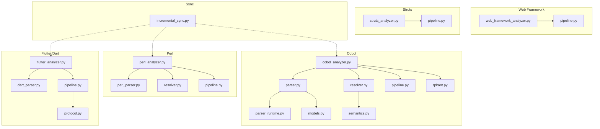
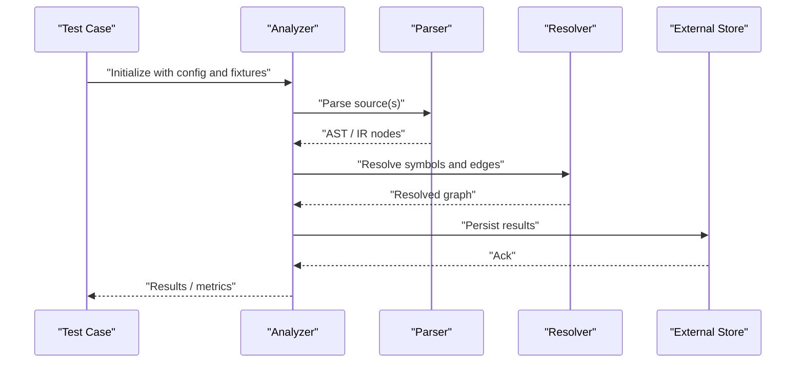
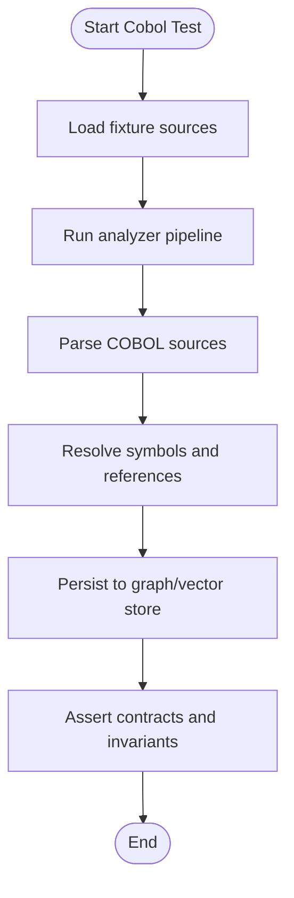
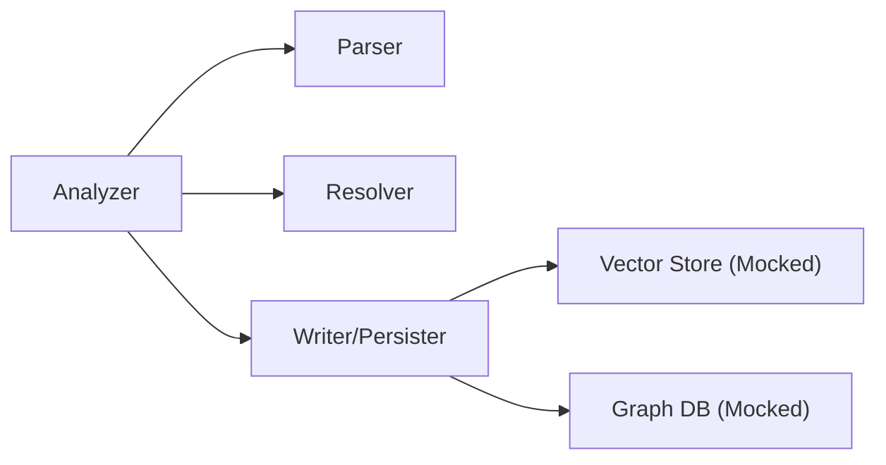

# Unit Testing Analyzers

<cite>
**Referenced Files in This Document**
- [test_cobol_analyzer_imports.py](file://tests/test_cobol_analyzer_imports.py)
- [test_cobol_error_recovery.py](file://tests/test_cobol_error_recovery.py)
- [test_cobol_fact_contract.py](file://tests/test_cobol_fact_contract.py)
- [test_cobol_fixture_analysis.py](file://tests/test_cobol_fixture_analysis.py)
- [test_cobol_graph_contract.py](file://tests/test_cobol_graph_contract.py)
- [test_cobol_incremental_resolution.py](file://tests/test_cobol_incremental_resolution.py)
- [test_cobol_mcp_routing.py](file://tests/test_cobol_mcp_routing.py)
- [test_cobol_parser_runtime.py](file://tests/test_cobol_parser_runtime.py)
- [test_cobol_performance.py](file://tests/test_cobol_performance.py)
- [test_cobol_qdrant_contract.py](file://tests/test_cobol_qdrant_contract.py)
- [test_cobol_source_formats.py](file://tests/test_cobol_source_formats.py)
- [cobol_analyzer.py](file://code-tiny/tools/cobol/cobol_analyzer.py)
- [parser.py](file://code-tiny/tools/cobol/parser.py)
- [parser_runtime.py](file://code-tiny/tools/cobol/parser_runtime.py)
- [resolver.py](file://code-tiny/tools/cobol/resolver.py)
- [pipeline.py](file://code-tiny/tools/cobol/pipeline.py)
- [models.py](file://code-tiny/tools/cobol/models.py)
- [semantics.py](file://code-tiny/tools/cobol/semantics.py)
- [qdrant.py](file://code-tiny/tools/cobol/qdrant.py)
- [test_perl_parser.py](file://tests/test_perl_parser.py)
- [perl_analyzer.py](file://code-tiny/tools/perl/perl_analyzer.py)
- [perl_parser.py](file://code-tiny/tools/perl/perl_parser.py)
- [perl_resolver.py](file://code-tiny/tools/perl/resolver.py)
- [perl_pipeline.py](file://code-tiny/tools/perl/pipeline.py)
- [test_dart_fixture_analysis.py](file://tests/test_dart_fixture_analysis.py)
- [dart_parser.py](file://code-tiny/tools/flutter/dart_parser.py)
- [flutter_analyzer.py](file://code-tiny/tools/flutter/flutter_analyzer.py)
- [flutter_pipeline.py](file://code-tiny/tools/flutter/pipeline.py)
- [test_flutter_protocol.py](file://tests/test_flutter_protocol.py)
- [flutter_protocol.py](file://code-tiny/tools/flutter/protocol.py)
- [test_framework_fixture_analysis.py](file://tests/test_framework_fixture_analysis.py)
- [web_framework_analyzer.py](file://code-tiny/tools/web_framework/web_framework_analyzer.py)
- [framework_pipeline.py](file://code-tiny/tools/web_framework/pipeline.py)
- [test_struts_scan_filtering.py](file://tests/test_struts_scan_filtering.py)
- [struts_analyzer.py](file://code-tiny/tools/struts/struts_analyzer.py)
- [struts_pipeline.py](file://code-tiny/tools/struts/pipeline.py)
- [test_incremental_sync_cobol.py](file://tests/test_incremental_sync_cobol.py)
- [incremental_sync.py](file://code-tiny/tools/sync/incremental_sync.py)
</cite>

## Table of Contents
1. [Introduction](#introduction)
2. [Project Structure](#project-structure)
3. [Core Components](#core-components)
4. [Architecture Overview](#architecture-overview)
5. [Detailed Component Analysis](#detailed-component-analysis)
6. [Dependency Analysis](#dependency-analysis)
7. [Performance Considerations](#performance-considerations)
8. [Troubleshooting Guide](#troubleshooting-guide)
9. [Conclusion](#conclusion)
10. [Appendices](#appendices)

## Introduction
This document explains how to write unit tests for individual analyzers in Cortex Harness, focusing on language-specific analyzers, parser components, and resolution logic. It covers mock strategies for external dependencies, AST generation testing, symbol resolution validation, error recovery, edge cases, and performance constraints. It also provides reusable templates for creating analyzer unit tests with proper assertions and test data management.

## Project Structure
The repository organizes analyzers by language under code-tiny/tools/<language>, with corresponding tests under tests/. Cobol, Perl, Flutter/Dart, Web Framework, and Struts are representative examples that demonstrate common patterns:
- Analyzer entry points orchestrate parsing, semantic analysis, and graph writing.
- Parsers produce AST-like structures consumed by resolvers and writers.
- Resolvers perform cross-file symbol resolution and dependency inference.
- Pipelines coordinate incremental scanning and state synchronization.
- Tests validate contracts, fixtures, runtime behavior, and performance.

**Diagram sources**
- [cobol_analyzer.py](file://code-tiny/tools/cobol/cobol_analyzer.py)
- [parser.py](file://code-tiny/tools/cobol/parser.py)
- [parser_runtime.py](file://code-tiny/tools/cobol/parser_runtime.py)
- [resolver.py](file://code-tiny/tools/cobol/resolver.py)
- [pipeline.py](file://code-tiny/tools/cobol/pipeline.py)
- [models.py](file://code-tiny/tools/cobol/models.py)
- [semantics.py](file://code-tiny/tools/cobol/semantics.py)
- [qdrant.py](file://code-tiny/tools/cobol/qdrant.py)
- [perl_analyzer.py](file://code-tiny/tools/perl/perl_analyzer.py)
- [perl_parser.py](file://code-tiny/tools/perl/perl_parser.py)
- [perl_resolver.py](file://code-tiny/tools/perl/resolver.py)
- [perl_pipeline.py](file://code-tiny/tools/perl/pipeline.py)
- [flutter_analyzer.py](file://code-tiny/tools/flutter/flutter_analyzer.py)
- [dart_parser.py](file://code-tiny/tools/flutter/dart_parser.py)
- [flutter_pipeline.py](file://code-tiny/tools/flutter/pipeline.py)
- [flutter_protocol.py](file://code-tiny/tools/flutter/protocol.py)
- [web_framework_analyzer.py](file://code-tiny/tools/web_framework/web_framework_analyzer.py)
- [framework_pipeline.py](file://code-tiny/tools/web_framework/pipeline.py)
- [struts_analyzer.py](file://code-tiny/tools/struts/struts_analyzer.py)
- [struts_pipeline.py](file://code-tiny/tools/struts/pipeline.py)
- [incremental_sync.py](file://code-tiny/tools/sync/incremental_sync.py)

**Section sources**
- [test_cobol_analyzer_imports.py](file://tests/test_cobol_analyzer_imports.py)
- [test_cobol_fixture_analysis.py](file://tests/test_cobol_fixture_analysis.py)
- [test_perl_parser.py](file://tests/test_perl_parser.py)
- [test_dart_fixture_analysis.py](file://tests/test_dart_fixture_analysis.py)
- [test_framework_fixture_analysis.py](file://tests/test_framework_fixture_analysis.py)
- [test_struts_scan_filtering.py](file://tests/test_struts_scan_filtering.py)

## Core Components
This section outlines the key building blocks you will typically unit test:
- Analyzer orchestrators: Initialize context, discover sources, run pipelines, and persist results.
- Parsers: Transform source files into structured representations (AST or intermediate forms).
- Resolvers: Resolve symbols across files and build dependency graphs.
- Pipelines: Coordinate stages including discovery, parsing, resolution, and writing.
- External integrations: Vector stores (e.g., Qdrant), graph databases, and file system utilities.

Testing focus areas:
- Contract validation: Ensure outputs match expected schemas and invariants.
- Error recovery: Verify graceful handling of malformed inputs and partial failures.
- Incremental behavior: Validate change detection and reprocessing scope.
- Performance: Measure time/memory budgets and guard against regressions.

**Section sources**
- [cobol_analyzer.py](file://code-tiny/tools/cobol/cobol_analyzer.py)
- [parser.py](file://code-tiny/tools/cobol/parser.py)
- [resolver.py](file://code-tiny/tools/cobol/resolver.py)
- [pipeline.py](file://code-tiny/tools/cobol/pipeline.py)
- [qdrant.py](file://code-tiny/tools/cobol/qdrant.py)
- [perl_analyzer.py](file://code-tiny/tools/perl/perl_analyzer.py)
- [perl_parser.py](file://code-tiny/tools/perl/perl_parser.py)
- [perl_resolver.py](file://code-tiny/tools/perl/resolver.py)
- [perl_pipeline.py](file://code-tiny/tools/perl/pipeline.py)
- [flutter_analyzer.py](file://code-tiny/tools/flutter/flutter_analyzer.py)
- [dart_parser.py](file://code-tiny/tools/flutter/dart_parser.py)
- [flutter_pipeline.py](file://code-tiny/tools/flutter/pipeline.py)
- [web_framework_analyzer.py](file://code-tiny/tools/web_framework/web_framework_analyzer.py)
- [framework_pipeline.py](file://code-tiny/tools/web_framework/pipeline.py)
- [struts_analyzer.py](file://code-tiny/tools/struts/struts_analyzer.py)
- [struts_pipeline.py](file://code-tiny/tools/struts/pipeline.py)
- [incremental_sync.py](file://code-tiny/tools/sync/incremental_sync.py)

## Architecture Overview
Unit tests should exercise the analyzer pipeline from input to output while isolating external systems. The following sequence shows a typical flow for a language analyzer:

**Diagram sources**
- [cobol_analyzer.py](file://code-tiny/tools/cobol/cobol_analyzer.py)
- [parser.py](file://code-tiny/tools/cobol/parser.py)
- [resolver.py](file://code-tiny/tools/cobol/resolver.py)
- [qdrant.py](file://code-tiny/tools/cobol/qdrant.py)

## Detailed Component Analysis

### Cobol Analyzer Unit Testing
Focus areas:
- Import and initialization checks.
- Fixture-based analysis and contract validation.
- Parser runtime behavior and error recovery.
- Symbol resolution and incremental updates.
- Graph and vector store contracts.
- Source format variations and performance.

Recommended test categories:
- Imports and configuration loading.
- Fixture-driven end-to-end runs with assertions on node/edge counts and types.
- Parser error recovery paths using malformed inputs.
- Resolution correctness across copybooks and includes.
- Incremental sync boundaries and delta processing.
- Qdrant collection scoping and payload shapes.
- Performance thresholds for large programs.

**Diagram sources**
- [test_cobol_fixture_analysis.py](file://tests/test_cobol_fixture_analysis.py)
- [cobol_analyzer.py](file://code-tiny/tools/cobol/cobol_analyzer.py)
- [parser.py](file://code-tiny/tools/cobol/parser.py)
- [resolver.py](file://code-tiny/tools/cobol/resolver.py)
- [qdrant.py](file://code-tiny/tools/cobol/qdrant.py)

**Section sources**
- [test_cobol_analyzer_imports.py](file://tests/test_cobol_analyzer_imports.py)
- [test_cobol_fact_contract.py](file://tests/test_cobol_fact_contract.py)
- [test_cobol_fixture_analysis.py](file://tests/test_cobol_fixture_analysis.py)
- [test_cobol_graph_contract.py](file://tests/test_cobol_graph_contract.py)
- [test_cobol_parser_runtime.py](file://tests/test_cobol_parser_runtime.py)
- [test_cobol_error_recovery.py](file://tests/test_cobol_error_recovery.py)
- [test_cobol_incremental_resolution.py](file://tests/test_cobol_incremental_resolution.py)
- [test_cobol_qdrant_contract.py](file://tests/test_cobol_qdrant_contract.py)
- [test_cobol_source_formats.py](file://tests/test_cobol_source_formats.py)
- [test_cobol_performance.py](file://tests/test_cobol_performance.py)
- [cobol_analyzer.py](file://code-tiny/tools/cobol/cobol_analyzer.py)
- [parser.py](file://code-tiny/tools/cobol/parser.py)
- [parser_runtime.py](file://code-tiny/tools/cobol/parser_runtime.py)
- [resolver.py](file://code-tiny/tools/cobol/resolver.py)
- [pipeline.py](file://code-tiny/tools/cobol/pipeline.py)
- [models.py](file://code-tiny/tools/cobol/models.py)
- [semantics.py](file://code-tiny/tools/cobol/semantics.py)
- [qdrant.py](file://code-tiny/tools/cobol/qdrant.py)

### Perl Analyzer Unit Testing
Focus areas:
- Parser correctness on sample modules and scripts.
- Symbol extraction and reference mapping.
- Pipeline integration and result shape.

Suggested tests:
- Parse representative .pm and .pl files and assert presence of expected constructs.
- Validate symbol tables and call relationships.
- Confirm pipeline outputs conform to expected contracts.

**Section sources**
- [test_perl_parser.py](file://tests/test_perl_parser.py)
- [perl_analyzer.py](file://code-tiny/tools/perl/perl_analyzer.py)
- [perl_parser.py](file://code-tiny/tools/perl/perl_parser.py)
- [perl_resolver.py](file://code-tiny/tools/perl/resolver.py)
- [perl_pipeline.py](file://code-tiny/tools/perl/pipeline.py)

### Flutter/Dart Analyzer Unit Testing
Focus areas:
- Dart parsing and protocol messages.
- Fixture-based analysis and pipeline execution.
- Protocol schema validation.

Suggested tests:
- Parse Dart sources and verify AST/IR elements.
- Validate protocol payloads and message shapes.
- Run pipeline over fixture projects and assert outcomes.

**Section sources**
- [test_dart_fixture_analysis.py](file://tests/test_dart_fixture_analysis.py)
- [test_flutter_protocol.py](file://tests/test_flutter_protocol.py)
- [flutter_analyzer.py](file://code-tiny/tools/flutter/flutter_analyzer.py)
- [dart_parser.py](file://code-tiny/tools/flutter/dart_parser.py)
- [flutter_pipeline.py](file://code-tiny/tools/flutter/pipeline.py)
- [flutter_protocol.py](file://code-tiny/tools/flutter/protocol.py)

### Web Framework Overlay Unit Testing
Focus areas:
- Cross-language framework overlay detection and enrichment.
- Fixture-based validation of discovered routes/controllers/services.

Suggested tests:
- Run overlay on mixed-language fixtures and assert enriched nodes/edges.
- Validate filtering rules and priority of overlays.

**Section sources**
- [test_framework_fixture_analysis.py](file://tests/test_framework_fixture_analysis.py)
- [web_framework_analyzer.py](file://code-tiny/tools/web_framework/web_framework_analyzer.py)
- [framework_pipeline.py](file://code-tiny/tools/web_framework/pipeline.py)

### Struts Scan Filtering Unit Testing
Focus areas:
- File-level scan filters and exclusion rules.
- Impact on downstream parsing and resolution.

Suggested tests:
- Provide fixtures with varied file layouts and assert filtered sets.
- Validate that excluded files do not contribute to results.

**Section sources**
- [test_struts_scan_filtering.py](file://tests/test_struts_scan_filtering.py)
- [struts_analyzer.py](file://code-tiny/tools/struts/struts_analyzer.py)
- [struts_pipeline.py](file://code-tiny/tools/struts/pipeline.py)

### Incremental Sync Integration Testing
Focus areas:
- Change detection and delta processing.
- State migration and lock semantics.

Suggested tests:
- Simulate file changes and assert only affected modules are reprocessed.
- Validate state consistency after interruptions.

**Section sources**
- [test_incremental_sync_cobol.py](file://tests/test_incremental_sync_cobol.py)
- [incremental_sync.py](file://code-tiny/tools/sync/incremental_sync.py)

## Dependency Analysis
Unit tests should isolate external dependencies such as vector stores and graph databases. Use mocks or in-memory substitutes where possible. For example, when validating Qdrant interactions, mock client calls and assert request payloads and response handling.

Guidance:
- Mock I/O-bound operations (network, disk) to ensure deterministic tests.
- Replace real clients with lightweight stubs that record calls and return controlled responses.
- Validate both success and failure paths for external calls.

[No sources needed since this section provides general guidance]

## Performance Considerations
Include performance-oriented tests to prevent regressions:
- Time-bounded tests for large inputs.
- Memory usage guards for heavy parsers/resolvers.
- Throughput checks for batch processing.

Recommendations:
- Use small but representative fixtures for fast unit tests.
- Add separate slow/performance tests gated behind markers.
- Record baseline metrics and fail if thresholds are exceeded.

[No sources needed since this section provides general guidance]

## Troubleshooting Guide
Common issues and remedies:
- Missing imports or misconfigured paths: Ensure test fixtures are discoverable and module paths are correct.
- Flaky network-dependent tests: Always mock external services; avoid live calls.
- Non-deterministic ordering: Sort collections before asserting equality.
- Incomplete error coverage: Add explicit tests for malformed inputs and partial failures.
- Slow tests: Split into fast unit tests and slower integration suites.

**Section sources**
- [test_cobol_error_recovery.py](file://tests/test_cobol_error_recovery.py)
- [test_cobol_performance.py](file://tests/test_cobol_performance.py)

## Conclusion
Effective unit testing for Cortex Harness analyzers combines fixture-driven validation, strict contract assertions, robust mocking of external dependencies, and targeted coverage of error and performance scenarios. By following the patterns demonstrated across Cobol, Perl, Flutter/Dart, Web Framework, and Struts analyzers, you can maintain high confidence in analyzer correctness and stability.

## Appendices

### Templates and Patterns

#### Analyzer Unit Test Template
- Setup: Create temporary directory with fixture sources.
- Configure: Initialize analyzer with minimal config and mocked external stores.
- Execute: Run pipeline over fixtures.
- Assert: Validate node/edge counts, symbol resolution, and payload shapes.
- Cleanup: Remove temp directories and reset mocks.

#### Parser Unit Test Template
- Input: Provide representative source snippets.
- Parse: Invoke parser and capture AST/IR.
- Assert: Check presence of expected nodes, attributes, and relationships.
- Edge Cases: Include malformed inputs and assert error recovery behavior.

#### Resolver Unit Test Template
- Context: Build minimal symbol table from parsed nodes.
- Resolve: Run resolver to infer cross-file references.
- Assert: Validate resolved edges and symbol identities.

#### Mocking External Dependencies
- Vector Store: Mock client methods and assert payloads.
- Graph DB: Stub write operations and verify transaction boundaries.
- File System: Use in-memory filesystem or temporary directories.

#### Test Data Management
- Keep fixtures small and focused per test case.
- Organize fixtures by feature or language component.
- Version control fixtures alongside tests for reproducibility.

[No sources needed since this section provides general guidance]