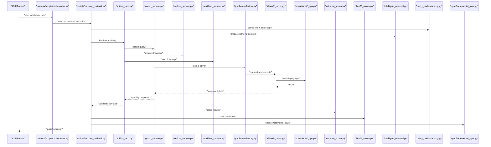
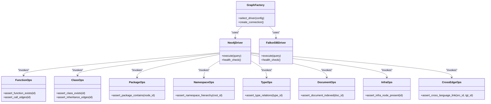
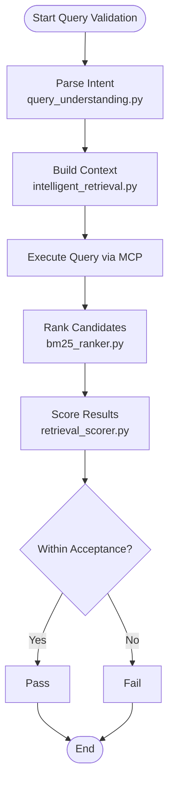
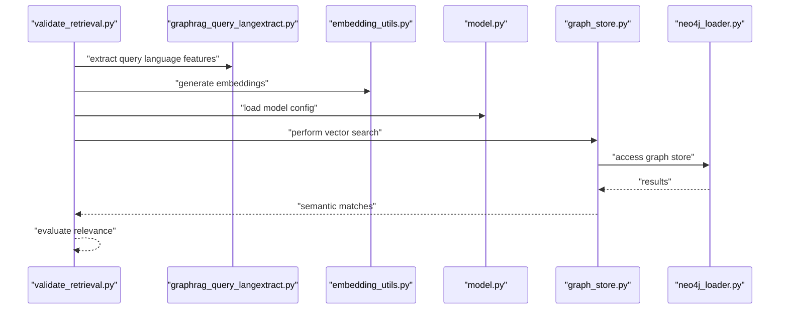
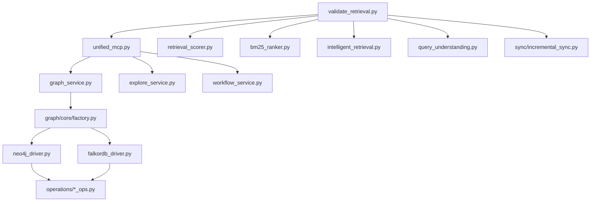

# Validation Procedures

<cite>
**Referenced Files in This Document**
- [ReadMe.md](file://ReadMe.md)
- [Makefile](file://Makefile)
- [scripts/validate_retrieval.py](file://scripts/validate_retrieval.py)
- [harness/scripts/orchestrator.py](file://harness/scripts/orchestrator.py)
- [harness/scripts/verify.sh](file://harness/scripts/verify.sh)
- [plans/260713-1638-framework-parser-integration/reports/validation-report.md](file://plans/260713-1638-framework-parser-integration/reports/validation-report.md)
- [plans/260714-1702-cobol-analyzer-parser/reports/validation-report.md](file://plans/260714-1702-cobol-analyzer-parser/reports/validation-report.md)
- [plans/260716-1615-primary-vector-ingestion-completion/reports/validation-report.md](file://plans/260716-1615-primary-vector-ingestion-completion/reports/validation-report.md)
- [plans/260718-2159-incremental-scan-reliability/reports/validation-report.md](file://plans/260718-2159-incremental-scan-reliability/reports/validation-report.md)
- [tests/test_validate_retrieval.py](file://tests/test_validate_retrieval.py)
- [tests/test_mcp_acceptance_matrix.py](file://tests/test_mcp_acceptance_matrix.py)
- [tests/test_primary_vector_sync.py](file://tests/test_primary_vector_sync.py)
- [code-tiny/mcp/services/graph_service.py](file://code-tiny/mcp/services/graph_service.py)
- [code-tiny/mcp/services/explore_service.py](file://code-tiny/mcp/services/explore_service.py)
- [code-tiny/mcp/services/workflow_service.py](file://code-tiny/mcp/services/workflow_service.py)
- [code-tiny/mcp/unified_mcp.py](file://code-tiny/mcp/unified_mcp.py)
- [code-tiny/mcp/tool_metadata.py](file://code-tiny/mcp/tool_metadata.py)
- [code-tiny/mcp/framework_registry.py](file://code-tiny/mcp/framework_registry.py)
- [code-tiny/tools/common/harness_config.py](file://code-tiny/tools/common/harness_config.py)
- [code-tiny/tools/graph/core/factory.py](file://code-tiny/tools/graph/core/factory.py)
- [code-tiny/tools/graph/driver/neo4j_driver.py](file://code-tiny/tools/graph/driver/neo4j_driver.py)
- [code-tiny/tools/graph/driver/falkordb_driver.py](file://code-tiny/tools/graph/driver/falkordb_driver.py)
- [code-tiny/tools/graph/operations/cross_edge_ops.py](file://code-tiny/tools/graph/operations/cross_edge_ops.py)
- [code-tiny/tools/graph/operations/function_ops.py](file://code-tiny/tools/graph/operations/function_ops.py)
- [code-tiny/tools/graph/operations/class_ops.py](file://code-tiny/tools/graph/operations/class_ops.py)
- [code-tiny/tools/graph/operations/document_ops.py](file://code-tiny/tools/graph/operations/document_ops.py)
- [code-tiny/tools/graph/operations/namespace_ops.py](file://code-tiny/tools/graph/operations/namespace_ops.py)
- [code-tiny/tools/graph/operations/package_ops.py](file://code-tiny/tools/graph/operations/package_ops.py)
- [code-tiny/tools/graph/operations/type_ops.py](file://code-tiny/tools/graph/operations/type_ops.py)
- [code-tiny/tools/graph/operations/infra_ops.py](file://code-tiny/tools/graph/operations/infra_ops.py)
- [code-tiny/tools/sync/incremental_sync.py](file://code-tiny/tools/sync/incremental_sync.py)
- [code-tiny/tools/common/query_understanding.py](file://code-tiny/tools/common/query_understanding.py)
- [code-tiny/tools/common/intelligent_retrieval.py](file://code-tiny/tools/common/intelligent_retrieval.py)
- [code-tiny/tools/common/bm25_ranker.py](file://code-tiny/tools/common/bm25_ranker.py)
- [code-tiny/tools/common/retrieval_scorer.py](file://code-tiny/tools/common/retrieval_scorer.py)
- [doc-tiny/graphrag_query_langextract.py](file://doc-tiny/graphrag_query_langextract.py)
- [doc-tiny/embedding_utils.py](file://doc-tiny/embedding_utils.py)
- [doc-tiny/model.py](file://doc-tiny/model.py)
- [doc-tiny/graph_store.py](file://doc-tiny/graph_store.py)
- [doc-tiny/neo4j_loader.py](file://doc-tiny/neo4j_loader.py)
</cite>

## Table of Contents
1. [Introduction](#introduction)
2. [Project Structure](#project-structure)
3. [Core Components](#core-components)
4. [Architecture Overview](#architecture-overview)
5. [Detailed Component Analysis](#detailed-component-analysis)
6. [Dependency Analysis](#dependency-analysis)
7. [Performance Considerations](#performance-considerations)
8. [Troubleshooting Guide](#troubleshooting-guide)
9. [Conclusion](#conclusion)
10. [Appendices](#appendices)

## Introduction
This document describes comprehensive validation procedures for ensuring code quality and system integrity in Cortex Harness. It covers graph integrity validation, query accuracy verification, semantic search validation, performance benchmarking, memory leak detection, load testing strategies, automated validation scripts usage, acceptance criteria definition, and quality gate implementation. It also provides examples of custom validation rules and regression testing procedures grounded in the repository’s existing tests and scripts.

## Project Structure
The repository organizes validation-related assets across multiple areas:
- Automated retrieval validation script and its test harness under scripts and tests
- MCP services and tool metadata that define capabilities and contracts used by validation flows
- Graph core abstractions and drivers (Neo4j/FalkorDB) with operations for integrity checks
- Incremental sync utilities to validate state consistency after changes
- Documentation RAG components for embedding and retrieval validation
- Orchestration and verification scripts for lifecycle and acceptance checks
- Plan reports documenting validation outcomes per feature or phase

```mermaid
graph TB
subgraph "Validation Scripts"
A["scripts/validate_retrieval.py"]
B["tests/test_validate_retrieval.py"]
C["harness/scripts/verify.sh"]
D["harness/scripts/orchestrator.py"]
end
subgraph "MCP Services"
E["code-tiny/mcp/services/graph_service.py"]
F["code-tiny/mcp/services/explore_service.py"]
G["code-tiny/mcp/services/workflow_service.py"]
H["code-tiny/mcp/unified_mcp.py"]
I["code-tiny/mcp/tool_metadata.py"]
J["code-tiny/mcp/framework_registry.py"]
end
subgraph "Graph Core"
K["code-tiny/tools/graph/core/factory.py"]
L["code-tiny/tools/graph/driver/neo4j_driver.py"]
M["code-tiny/tools/graph/driver/falkordb_driver.py"]
N["code-tiny/tools/graph/operations/*"]
end
subgraph "Sync & Query"
O["code-tiny/tools/sync/incremental_sync.py"]
P["code-tiny/tools/common/query_understanding.py"]
Q["code-tiny/tools/common/intelligent_retrieval.py"]
R["code-tiny/tools/common/bm25_ranker.py"]
S["code-tiny/tools/common/retrieval_scorer.py"]
end
subgraph "Doc RAG"
T["doc-tiny/graphrag_query_langextract.py"]
U["doc-tiny/embedding_utils.py"]
V["doc-tiny/model.py"]
W["doc-tino/graph_store.py"]
X["doc-tiny/neo4j_loader.py"]
end
A --> E
A --> F
A --> G
A --> H
A --> I
A --> J
E --> K
F --> K
G --> K
K --> L
K --> M
K --> N
A --> O
A --> P
A --> Q
A --> R
A --> S
A --> T
A --> U
A --> V
A --> W
A --> X
B --> A
C --> D
```

**Diagram sources**
- [scripts/validate_retrieval.py](file://scripts/validate_retrieval.py)
- [tests/test_validate_retrieval.py](file://tests/test_validate_retrieval.py)
- [harness/scripts/verify.sh](file://harness/scripts/verify.sh)
- [harness/scripts/orchestrator.py](file://harness/scripts/orchestrator.py)
- [code-tiny/mcp/services/graph_service.py](file://code-tiny/mcp/services/graph_service.py)
- [code-tiny/mcp/services/explore_service.py](file://code-tiny/mcp/services/explore_service.py)
- [code-tiny/mcp/services/workflow_service.py](file://code-tiny/mcp/services/workflow_service.py)
- [code-tiny/mcp/unified_mcp.py](file://code-tiny/mcp/unified_mcp.py)
- [code-tiny/mcp/tool_metadata.py](file://code-tiny/mcp/tool_metadata.py)
- [code-tiny/mcp/framework_registry.py](file://code-tiny/mcp/framework_registry.py)
- [code-tiny/tools/graph/core/factory.py](file://code-tiny/tools/graph/core/factory.py)
- [code-tiny/tools/graph/driver/neo4j_driver.py](file://code-tiny/tools/graph/driver/neo4j_driver.py)
- [code-tiny/tools/graph/driver/falkordb_driver.py](file://code-tiny/tools/graph/driver/falkordb_driver.py)
- [code-tiny/tools/graph/operations/cross_edge_ops.py](file://code-tiny/tools/graph/operations/cross_edge_ops.py)
- [code-tiny/tools/graph/operations/function_ops.py](file://code-tiny/tools/graph/operations/function_ops.py)
- [code-tiny/tools/graph/operations/class_ops.py](file://code-tiny/tools/graph/operations/class_ops.py)
- [code-tiny/tools/graph/operations/document_ops.py](file://code-tiny/tools/graph/operations/document_ops.py)
- [code-tiny/tools/graph/operations/namespace_ops.py](file://code-tiny/tools/graph/operations/namespace_ops.py)
- [code-tiny/tools/graph/operations/package_ops.py](file://code-tiny/tools/graph/operations/package_ops.py)
- [code-tiny/tools/graph/operations/type_ops.py](file://code-tiny/tools/graph/operations/type_ops.py)
- [code-tiny/tools/graph/operations/infra_ops.py](file://code-tiny/tools/graph/operations/infra_ops.py)
- [code-tiny/tools/sync/incremental_sync.py](file://code-tiny/tools/sync/incremental_sync.py)
- [code-tiny/tools/common/query_understanding.py](file://code-tiny/tools/common/query_understanding.py)
- [code-tiny/tools/common/intelligent_retrieval.py](file://code-tiny/tools/common/intelligent_retrieval.py)
- [code-tiny/tools/common/bm25_ranker.py](file://code-tiny/tools/common/bm25_ranker.py)
- [code-tiny/tools/common/retrieval_scorer.py](file://code-tiny/tools/common/retrieval_scorer.py)
- [doc-tiny/graphrag_query_langextract.py](file://doc-tiny/graphrag_query_langextract.py)
- [doc-tiny/embedding_utils.py](file://doc-tiny/embedding_utils.py)
- [doc-tiny/model.py](file://doc-tiny/model.py)
- [doc-tiny/graph_store.py](file://doc-tiny/graph_store.py)
- [doc-tiny/neo4j_loader.py](file://doc-tiny/neo4j_loader.py)

**Section sources**
- [ReadMe.md](file://ReadMe.md)
- [Makefile](file://Makefile)

## Core Components
- Retrieval validation entrypoint: a Python script orchestrates queries against MCP services and validates results using graph operations and retrieval scorers.
- Test harness: pytest-based tests exercise the retrieval validator and assert acceptance criteria such as result presence, relevance thresholds, and schema compliance.
- MCP service layer: graph, explore, and workflow services expose capability endpoints consumed by validation flows; tool metadata and framework registry provide capability contracts.
- Graph core and drivers: factory selects Neo4j or FalkorDB driver; operations implement integrity checks (e.g., node existence, edge connectivity).
- Sync and query understanding: incremental sync ensures consistent state; query understanding and intelligent retrieval guide accurate and semantically relevant responses.
- Doc RAG pipeline: embeddings and model utilities support semantic search validation.

**Section sources**
- [scripts/validate_retrieval.py](file://scripts/validate_retrieval.py)
- [tests/test_validate_retrieval.py](file://tests/test_validate_retrieval.py)
- [code-tiny/mcp/services/graph_service.py](file://code-tiny/mcp/services/graph_service.py)
- [code-tiny/mcp/services/explore_service.py](file://code-tiny/mcp/services/explore_service.py)
- [code-tiny/mcp/services/workflow_service.py](file://code-tiny/mcp/services/workflow_service.py)
- [code-tiny/mcp/unified_mcp.py](file://code-tiny/mcp/unified_mcp.py)
- [code-tiny/mcp/tool_metadata.py](file://code-tiny/mcp/tool_metadata.py)
- [code-tiny/mcp/framework_registry.py](file://code-tiny/mcp/framework_registry.py)
- [code-tiny/tools/graph/core/factory.py](file://code-tiny/tools/graph/core/factory.py)
- [code-tiny/tools/graph/driver/neo4j_driver.py](file://code-tiny/tools/graph/driver/neo4j_driver.py)
- [code-tiny/tools/graph/driver/falkordb_driver.py](file://code-tiny/tools/graph/driver/falkordb_driver.py)
- [code-tiny/tools/graph/operations/cross_edge_ops.py](file://code-tiny/tools/graph/operations/cross_edge_ops.py)
- [code-tiny/tools/graph/operations/function_ops.py](file://code-tiny/tools/graph/operations/function_ops.py)
- [code-tiny/tools/graph/operations/class_ops.py](file://code-tiny/tools/graph/operations/class_ops.py)
- [code-tiny/tools/graph/operations/document_ops.py](file://code-tiny/tools/graph/operations/document_ops.py)
- [code-tiny/tools/graph/operations/namespace_ops.py](file://code-tiny/tools/graph/operations/namespace_ops.py)
- [code-tiny/tools/graph/operations/package_ops.py](file://code-tiny/tools/graph/operations/package_ops.py)
- [code-tiny/tools/graph/operations/type_ops.py](file://code-tiny/tools/graph/operations/type_ops.py)
- [code-tiny/tools/graph/operations/infra_ops.py](file://code-tiny/tools/graph/operations/infra_ops.py)
- [code-tiny/tools/sync/incremental_sync.py](file://code-tiny/tools/sync/incremental_sync.py)
- [code-tiny/tools/common/query_understanding.py](file://code-tiny/tools/common/query_understanding.py)
- [code-tiny/tools/common/intelligent_retrieval.py](file://code-tiny/tools/common/intelligent_retrieval.py)
- [code-tiny/tools/common/bm25_ranker.py](file://code-tiny/tools/common/bm25_ranker.py)
- [code-tiny/tools/common/retrieval_scorer.py](file://code-tiny/tools/common/retrieval_scorer.py)
- [doc-tiny/graphrag_query_langextract.py](file://doc-tiny/graphrag_query_langextract.py)
- [doc-tiny/embedding_utils.py](file://doc-tiny/embedding_utils.py)
- [doc-tiny/model.py](file://doc-tiny/model.py)
- [doc-tiny/graph_store.py](file://doc-tiny/graph_store.py)
- [doc-tiny/neo4j_loader.py](file://doc-tiny/neo4j_loader.py)

## Architecture Overview
The validation architecture integrates retrieval orchestration, MCP capability routing, graph integrity checks, and semantic search scoring. The flow begins with a validation script invoking MCP services, which route to graph operations via a driver abstraction. Results are scored and compared against acceptance criteria.

**Diagram sources**
- [harness/scripts/orchestrator.py](file://harness/scripts/orchestrator.py)
- [scripts/validate_retrieval.py](file://scripts/validate_retrieval.py)
- [code-tiny/mcp/unified_mcp.py](file://code-tiny/mcp/unified_mcp.py)
- [code-tiny/mcp/services/graph_service.py](file://code-tiny/mcp/services/graph_service.py)
- [code-tiny/mcp/services/explore_service.py](file://code-tiny/mcp/services/explore_service.py)
- [code-tiny/mcp/services/workflow_service.py](file://code-tiny/mcp/services/workflow_service.py)
- [code-tiny/tools/graph/core/factory.py](file://code-tiny/tools/graph/core/factory.py)
- [code-tiny/tools/graph/driver/neo4j_driver.py](file://code-tiny/tools/graph/driver/neo4j_driver.py)
- [code-tiny/tools/graph/driver/falkordb_driver.py](file://code-tiny/tools/graph/driver/falkordb_driver.py)
- [code-tiny/tools/graph/operations/cross_edge_ops.py](file://code-tiny/tools/graph/operations/cross_edge_ops.py)
- [code-tiny/tools/graph/operations/function_ops.py](file://code-tiny/tools/graph/operations/function_ops.py)
- [code-tiny/tools/graph/operations/class_ops.py](file://code-tiny/tools/graph/operations/class_ops.py)
- [code-tiny/tools/graph/operations/document_ops.py](file://code-tiny/tools/graph/operations/document_ops.py)
- [code-tiny/tools/graph/operations/namespace_ops.py](file://code-tiny/tools/graph/operations/namespace_ops.py)
- [code-tiny/tools/graph/operations/package_ops.py](file://code-tiny/tools/graph/operations/package_ops.py)
- [code-tiny/tools/graph/operations/type_ops.py](file://code-tiny/tools/graph/operations/type_ops.py)
- [code-tiny/tools/graph/operations/infra_ops.py](file://code-tiny/tools/graph/operations/infra_ops.py)
- [code-tiny/tools/common/retrieval_scorer.py](file://code-tiny/tools/common/retrieval_scorer.py)
- [code-tiny/tools/common/bm25_ranker.py](file://code-tiny/tools/common/bm25_ranker.py)
- [code-tiny/tools/common/intelligent_retrieval.py](file://code-tiny/tools/common/intelligent_retrieval.py)
- [code-tiny/tools/common/query_understanding.py](file://code-tiny/tools/common/query_understanding.py)
- [code-tiny/tools/sync/incremental_sync.py](file://code-tiny/tools/sync/incremental_sync.py)

## Detailed Component Analysis

### Graph Integrity Validation
Graph integrity validation ensures nodes exist, edges are consistent, and cross-language relationships hold. Operations include function/class/package/namespace/type/document/infra checks and cross-edge validations.

**Diagram sources**
- [code-tiny/tools/graph/core/factory.py](file://code-tiny/tools/graph/core/factory.py)
- [code-tiny/tools/graph/driver/neo4j_driver.py](file://code-tiny/tools/graph/driver/neo4j_driver.py)
- [code-tiny/tools/graph/driver/falkordb_driver.py](file://code-tiny/tools/graph/driver/falkordb_driver.py)
- [code-tiny/tools/graph/operations/function_ops.py](file://code-tiny/tools/graph/operations/function_ops.py)
- [code-tiny/tools/graph/operations/class_ops.py](file://code-tiny/tools/graph/operations/class_ops.py)
- [code-tiny/tools/graph/operations/package_ops.py](file://code-tiny/tools/graph/operations/package_ops.py)
- [code-tiny/tools/graph/operations/namespace_ops.py](file://code-tiny/tools/graph/operations/namespace_ops.py)
- [code-tiny/tools/graph/operations/type_ops.py](file://code-tiny/tools/graph/operations/type_ops.py)
- [code-tiny/tools/graph/operations/document_ops.py](file://code-tiny/tools/graph/operations/document_ops.py)
- [code-tiny/tools/graph/operations/infra_ops.py](file://code-tiny/tools/graph/operations/infra_ops.py)
- [code-tiny/tools/graph/operations/cross_edge_ops.py](file://code-tiny/tools/graph/operations/cross_edge_ops.py)

**Section sources**
- [code-tiny/tools/graph/core/factory.py](file://code-tiny/tools/graph/core/factory.py)
- [code-tiny/tools/graph/driver/neo4j_driver.py](file://code-tiny/tools/graph/driver/neo4j_driver.py)
- [code-tiny/tools/graph/driver/falkordb_driver.py](file://code-tiny/tools/graph/driver/falkordb_driver.py)
- [code-tiny/tools/graph/operations/cross_edge_ops.py](file://code-tiny/tools/graph/operations/cross_edge_ops.py)
- [code-tiny/tools/graph/operations/function_ops.py](file://code-tiny/tools/graph/operations/function_ops.py)
- [code-tiny/tools/graph/operations/class_ops.py](file://code-tiny/tools/graph/operations/class_ops.py)
- [code-tiny/tools/graph/operations/document_ops.py](file://code-tiny/tools/graph/operations/document_ops.py)
- [code-tiny/tools/graph/operations/namespace_ops.py](file://code-tiny/tools/graph/operations/namespace_ops.py)
- [code-tiny/tools/graph/operations/package_ops.py](file://code-tiny/tools/graph/operations/package_ops.py)
- [code-tiny/tools/graph/operations/type_ops.py](file://code-tiny/tools/graph/operations/type_ops.py)
- [code-tiny/tools/graph/operations/infra_ops.py](file://code-tiny/tools/graph/operations/infra_ops.py)

### Query Accuracy Verification
Query accuracy is verified through intent classification, retrieval preparation, ranking, and scoring. The process includes query understanding, intelligent retrieval, BM25 ranking, and retrieval scorer evaluation.

**Diagram sources**
- [code-tiny/tools/common/query_understanding.py](file://code-tiny/tools/common/query_understanding.py)
- [code-tiny/tools/common/intelligent_retrieval.py](file://code-tiny/tools/common/intelligent_retrieval.py)
- [code-tiny/tools/common/bm25_ranker.py](file://code-tiny/tools/common/bm25_ranker.py)
- [code-tiny/tools/common/retrieval_scorer.py](file://code-tiny/tools/common/retrieval_scorer.py)
- [code-tiny/mcp/unified_mcp.py](file://code-tiny/mcp/unified_mcp.py)

**Section sources**
- [code-tiny/tools/common/query_understanding.py](file://code-tiny/tools/common/query_understanding.py)
- [code-tiny/tools/common/intelligent_retrieval.py](file://code-tiny/tools/common/intelligent_retrieval.py)
- [code-tiny/tools/common/bm25_ranker.py](file://code-tiny/tools/common/bm25_ranker.py)
- [code-tiny/tools/common/retrieval_scorer.py](file://code-tiny/tools/common/retrieval_scorer.py)
- [code-tiny/mcp/unified_mcp.py](file://code-tiny/mcp/unified_mcp.py)

### Semantic Search Validation
Semantic search validation leverages embeddings and model utilities to ensure meaningful retrieval. The doc-tiny components handle language extraction, embeddings, model configuration, and graph store interactions.

**Diagram sources**
- [scripts/validate_retrieval.py](file://scripts/validate_retrieval.py)
- [doc-tiny/graphrag_query_langextract.py](file://doc-tiny/graphrag_query_langextract.py)
- [doc-tiny/embedding_utils.py](file://doc-tiny/embedding_utils.py)
- [doc-tiny/model.py](file://doc-tiny/model.py)
- [doc-tiny/graph_store.py](file://doc-tiny/graph_store.py)
- [doc-tiny/neo4j_loader.py](file://doc-tiny/neo4j_loader.py)

**Section sources**
- [doc-tiny/graphrag_query_langextract.py](file://doc-tiny/graphrag_query_langextract.py)
- [doc-tiny/embedding_utils.py](file://doc-tiny/embedding_utils.py)
- [doc-tiny/model.py](file://doc-tiny/model.py)
- [doc-tiny/graph_store.py](file://doc-tiny/graph_store.py)
- [doc-tiny/neo4j_loader.py](file://doc-tiny/neo4j_loader.py)
- [scripts/validate_retrieval.py](file://scripts/validate_retrieval.py)

### Performance Benchmarking Procedures
Benchmarking focuses on retrieval latency, throughput, and resource utilization during validation runs. Use the orchestrator to run repeated validation cycles and capture metrics from the retrieval scorer and BM25 ranker.

- Run validation suites multiple times to measure average latency and variance.
- Monitor memory usage during embedding generation and graph traversal.
- Compare scores across different drivers (Neo4j vs FalkorDB) to identify bottlenecks.

[No sources needed since this section provides general guidance]

### Memory Leak Detection
Memory leak detection involves monitoring process memory over extended validation runs and analyzing growth patterns.

- Instrument the validation loop to sample memory at intervals.
- Track allocations during embedding creation and graph operations.
- Flag regressions when memory usage exceeds baseline thresholds.

[No sources needed since this section provides general guidance]

### Load Testing Strategies
Load testing simulates concurrent validation requests to assess stability and scalability.

- Increase concurrency levels in the orchestrator while running retrieval validation.
- Observe error rates and latency percentiles.
- Validate that MCP capability routing remains stable under load.

[No sources needed since this section provides general guidance]

### Automated Validation Scripts Usage
Automated scripts centralize validation execution and reporting.

- Use the orchestrator to start validation suites and collect outputs.
- Invoke the retrieval validation script with appropriate parameters for target capabilities.
- Integrate verify.sh into CI pipelines to enforce quality gates.

**Section sources**
- [harness/scripts/orchestrator.py](file://harness/scripts/orchestrator.py)
- [scripts/validate_retrieval.py](file://scripts/validate_retrieval.py)
- [harness/scripts/verify.sh](file://harness/scripts/verify.sh)

### Acceptance Criteria Definition
Acceptance criteria should be explicit and measurable:

- Presence of expected nodes and edges for given identifiers.
- Minimum relevance score thresholds for retrieved items.
- Consistency of incremental sync state after changes.
- Capability contract adherence defined by tool metadata and framework registry.

**Section sources**
- [code-tiny/mcp/tool_metadata.py](file://code-tiny/mcp/tool_metadata.py)
- [code-tiny/mcp/framework_registry.py](file://code-tiny/mcp/framework_registry.py)
- [tests/test_mcp_acceptance_matrix.py](file://tests/test_mcp_acceptance_matrix.py)

### Quality Gate Implementation
Quality gates integrate validation outcomes into CI:

- Fail builds if retrieval validation fails or scores drop below thresholds.
- Enforce graph integrity checks before merging changes.
- Require incremental sync validation to pass for reliability.

**Section sources**
- [harness/scripts/verify.sh](file://harness/scripts/verify.sh)
- [tests/test_validate_retrieval.py](file://tests/test_validate_retrieval.py)

### Custom Validation Rules Examples
Custom rules can extend the validation suite:

- Add new graph integrity assertions in operation modules.
- Implement additional scoring heuristics in the retrieval scorer.
- Define capability-specific checks in MCP service layers.

**Section sources**
- [code-tiny/tools/graph/operations/cross_edge_ops.py](file://code-tiny/tools/graph/operations/cross_edge_ops.py)
- [code-tiny/tools/common/retrieval_scorer.py](file://code-tiny/tools/common/retrieval_scorer.py)
- [code-tiny/mcp/services/graph_service.py](file://code-tiny/mcp/services/graph_service.py)

### Regression Testing Procedures
Regression tests guard against unintended behavior:

- Re-run acceptance matrix tests to ensure capability contracts remain valid.
- Validate primary vector synchronization contracts after updates.
- Exercise incremental sync scenarios across platforms and scopes.

**Section sources**
- [tests/test_mcp_acceptance_matrix.py](file://tests/test_mcp_acceptance_matrix.py)
- [tests/test_primary_vector_sync.py](file://tests/test_primary_vector_sync.py)
- [code-tiny/tools/sync/incremental_sync.py](file://code-tiny/tools/sync/incremental_sync.py)

## Dependency Analysis
The validation pipeline depends on MCP services, graph core abstractions, drivers, operations, and retrieval utilities. Understanding these dependencies helps isolate failures and optimize performance.

**Diagram sources**
- [scripts/validate_retrieval.py](file://scripts/validate_retrieval.py)
- [code-tiny/mcp/unified_mcp.py](file://code-tiny/mcp/unified_mcp.py)
- [code-tiny/mcp/services/graph_service.py](file://code-tiny/mcp/services/graph_service.py)
- [code-tiny/mcp/services/explore_service.py](file://code-tiny/mcp/services/explore_service.py)
- [code-tiny/mcp/services/workflow_service.py](file://code-tiny/mcp/services/workflow_service.py)
- [code-tiny/tools/graph/core/factory.py](file://code-tiny/tools/graph/core/factory.py)
- [code-tiny/tools/graph/driver/neo4j_driver.py](file://code-tiny/tools/graph/driver/neo4j_driver.py)
- [code-tiny/tools/graph/driver/falkordb_driver.py](file://code-tiny/tools/graph/driver/falkordb_driver.py)
- [code-tiny/tools/graph/operations/cross_edge_ops.py](file://code-tiny/tools/graph/operations/cross_edge_ops.py)
- [code-tiny/tools/graph/operations/function_ops.py](file://code-tiny/tools/graph/operations/function_ops.py)
- [code-tiny/tools/graph/operations/class_ops.py](file://code-tiny/tools/graph/operations/class_ops.py)
- [code-tiny/tools/graph/operations/document_ops.py](file://code-tiny/tools/graph/operations/document_ops.py)
- [code-tiny/tools/graph/operations/namespace_ops.py](file://code-tiny/tools/graph/operations/namespace_ops.py)
- [code-tiny/tools/graph/operations/package_ops.py](file://code-tiny/tools/graph/operations/package_ops.py)
- [code-tiny/tools/graph/operations/type_ops.py](file://code-tiny/tools/graph/operations/type_ops.py)
- [code-tiny/tools/graph/operations/infra_ops.py](file://code-tiny/tools/graph/operations/infra_ops.py)
- [code-tiny/tools/common/retrieval_scorer.py](file://code-tiny/tools/common/retrieval_scorer.py)
- [code-tiny/tools/common/bm25_ranker.py](file://code-tiny/tools/common/bm25_ranker.py)
- [code-tiny/tools/common/intelligent_retrieval.py](file://code-tiny/tools/common/intelligent_retrieval.py)
- [code-tiny/tools/common/query_understanding.py](file://code-tiny/tools/common/query_understanding.py)
- [code-tiny/tools/sync/incremental_sync.py](file://code-tiny/tools/sync/incremental_sync.py)

**Section sources**
- [scripts/validate_retrieval.py](file://scripts/validate_retrieval.py)
- [code-tiny/mcp/unified_mcp.py](file://code-tiny/mcp/unified_mcp.py)
- [code-tiny/tools/graph/core/factory.py](file://code-tiny/tools/graph/core/factory.py)
- [code-tiny/tools/graph/driver/neo4j_driver.py](file://code-tiny/tools/graph/driver/neo4j_driver.py)
- [code-tiny/tools/graph/driver/falkordb_driver.py](file://code-tiny/tools/graph/driver/falkordb_driver.py)
- [code-tiny/tools/common/retrieval_scorer.py](file://code-tiny/tools/common/retrieval_scorer.py)
- [code-tiny/tools/common/bm25_ranker.py](file://code-tiny/tools/common/bm25_ranker.py)
- [code-tiny/tools/common/intelligent_retrieval.py](file://code-tiny/tools/common/intelligent_retrieval.py)
- [code-tiny/tools/common/query_understanding.py](file://code-tiny/tools/common/query_understanding.py)
- [code-tiny/tools/sync/incremental_sync.py](file://code-tiny/tools/sync/incremental_sync.py)

## Performance Considerations
- Prefer batched graph operations to reduce round-trips.
- Cache embeddings where feasible to avoid recomputation.
- Tune BM25 parameters based on corpus characteristics.
- Profile driver-specific queries to optimize index usage.

[No sources needed since this section provides general guidance]

## Troubleshooting Guide
Common issues and resolutions:

- Connectivity failures to graph stores: verify driver selection and connection parameters.
- Low retrieval scores: review query understanding and embedding generation steps.
- Inconsistent incremental state: re-run sync validation and inspect lock files.
- Capability mismatches: check tool metadata and framework registry definitions.

**Section sources**
- [code-tiny/tools/graph/core/factory.py](file://code-tiny/tools/graph/core/factory.py)
- [code-tiny/tools/common/query_understanding.py](file://code-tiny/tools/common/query_understanding.py)
- [code-tiny/tools/sync/incremental_sync.py](file://code-tiny/tools/sync/incremental_sync.py)
- [code-tiny/mcp/tool_metadata.py](file://code-tiny/mcp/tool_metadata.py)
- [code-tiny/mcp/framework_registry.py](file://code-tiny/mcp/framework_registry.py)

## Conclusion
Cortex Harness implements a robust validation framework combining graph integrity checks, query accuracy verification, and semantic search evaluation. Automated scripts and tests enforce acceptance criteria and quality gates, while performance and reliability measures ensure sustained system integrity. Extending validation with custom rules and regression tests further strengthens confidence in releases.

[No sources needed since this section summarizes without analyzing specific files]

## Appendices

### Validation Reports Reference
- Framework parser integration validation report
- Cobol analyzer parser validation report
- Primary vector ingestion completion validation report
- Incremental scan reliability validation report

**Section sources**
- [plans/260713-1638-framework-parser-integration/reports/validation-report.md](file://plans/260713-1638-framework-parser-integration/reports/validation-report.md)
- [plans/260714-1702-cobol-analyzer-parser/reports/validation-report.md](file://plans/260714-1702-cobol-analyzer-parser/reports/validation-report.md)
- [plans/260716-1615-primary-vector-ingestion-completion/reports/validation-report.md](file://plans/260716-1615-primary-vector-ingestion-completion/reports/validation-report.md)
- [plans/260718-2159-incremental-scan-reliability/reports/validation-report.md](file://plans/260718-2159-incremental-scan-reliability/reports/validation-report.md)