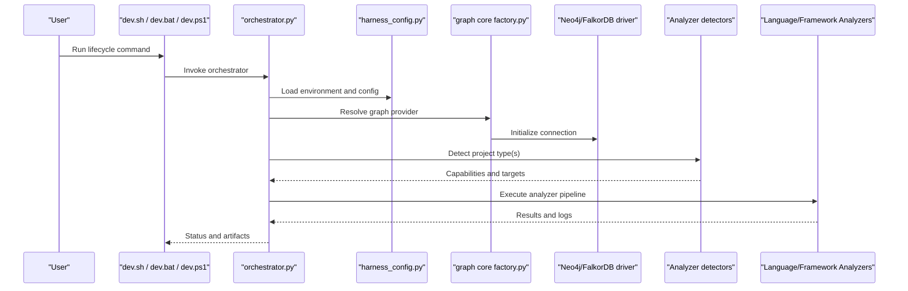
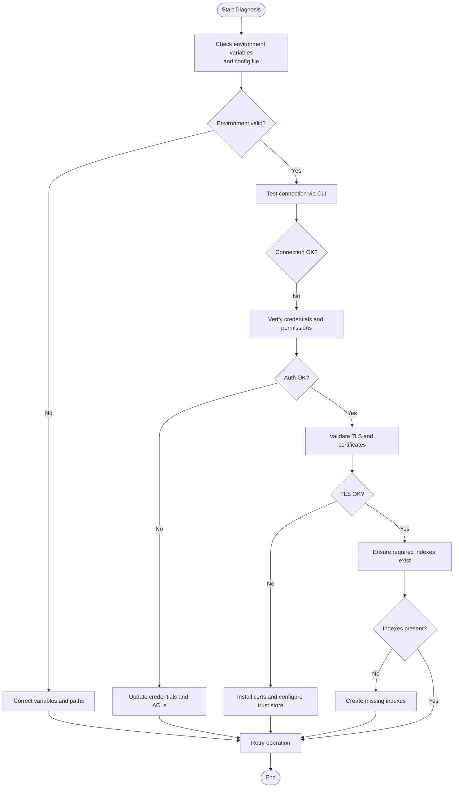
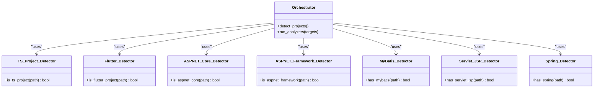
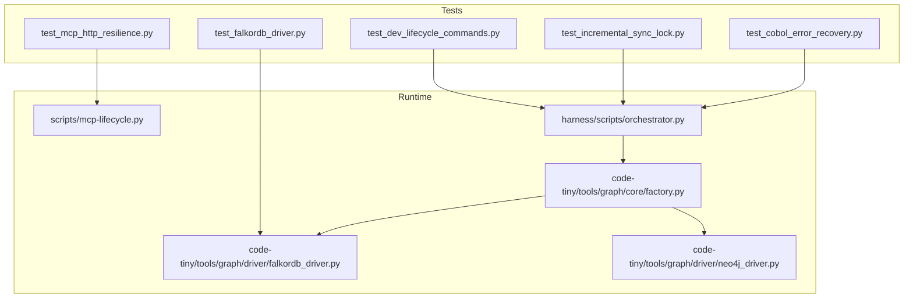

# Common Issues & Solutions

<cite>
**Referenced Files in This Document**
- [ReadMe.md](file://ReadMe.md)
- [INSTALLER_GUIDE.md](file://INSTALLER_GUIDE.md)
- [Makefile](file://Makefile)
- [dev.sh](file://dev.sh)
- [dev.bat](file://dev.bat)
- [dev.ps1](file://dev.ps1)
- [install-windows.bat](file://install-windows.bat)
- [install-windows.ps1](file://install-windows.ps1)
- [scripts/mcp-lifecycle.py](file://scripts/mcp-lifecycle.py)
- [scripts/mcp-lifecycle.ps1](file://scripts/mcp-lifecycle.ps1)
- [harness/scripts/orchestrator.py](file://harness/scripts/orchestrator.py)
- [harness/scripts/init.sh](file://harness/scripts/init.sh)
- [harness/scripts/verify.sh](file://harness/scripts/verify.sh)
- [cortex_harness/dev.py](file://cortex_harness/dev.py)
- [code-tiny/skills/code-graph-ingest/references/env.md](file://code-tiny/skills/code-graph-ingest/references/env.md)
- [code-tiny/skills/code-graph-ingest/references/analyzers.md](file://code-tiny/skills/code-graph-ingest/references/analyzers.md)
- [code-tiny/skills/code-graph-ingest/references/examples.md](file://code-tiny/skills/code-graph-ingest/references/examples.md)
- [code-tiny/tools/common/harness_config.py](file://code-tiny/tools/common/harness_config.py)
- [code-tiny/tools/graph/core/factory.py](file://code-tiny/tools/graph/core/factory.py)
- [code-tiny/tools/graph/driver/neo4j_driver.py](file://code-tiny/tools/graph/driver/neo4j_driver.py)
- [code-tiny/tools/graph/driver/falkordb_driver.py](file://code-tiny/tools/graph/driver/falkordb_driver.py)
- [code-tiny/tools/graph/core/require_neo4j.py](file://code-tiny/tools/graph/core/require_neo4j.py)
- [code-tiny/tools/graph/cli.py](file://code-tiny/tools/graph/cli.py)
- [code-tiny/tools/ts/ts_project_detector.py](file://code-tiny/tools/ts/ts_project_detector.py)
- [code-tiny/tools/flutter/detector.py](file://code-tiny/tools/flutter/detector.py)
- [code-tiny/tools/aspnet_core/detector.py](file://code-tiny/tools/aspnet_core/detector.py)
- [code-tiny/tools/aspnet_framework/detector.py](file://code-tiny/tools/aspnet_framework/detector.py)
- [code-tiny/tools/mybatis/detector.py](file://code-tiny/tools/mybatis/detector.py)
- [code-tiny/tools/servlet_jsp/detector.py](file://code-tiny/tools/servlet_jsp/detector.py)
- [code-tiny/tools/spring/detector.py](file://code-tiny/tools/spring/detector.py)
- [code-tiny/tools/vb/roslyn_adapter.py](file://code-tiny/tools/vb/roslyn_adapter.py)
- [code-tiny/tools/cplus/windows_resource_parser.py](file://code-tiny/tools/cplus/windows_resource_parser.py)
- [code-tiny/tools/perl/parser_runtime.py](file://code-tiny/tools/perl/parser_runtime.py)
- [code-tiny/tools/database_schema/pipeline.py](file://code-tiny/tools/database_schema/pipeline.py)
- [doc-tiny/.env-sample](file://doc-tiny/.env-sample)
- [doc-tiny/neo4j_loader.py](file://doc-tiny/neo4j_loader.py)
- [doc-tiny/embedding_utils.py](file://doc-tiny/embedding_utils.py)
- [plans/neo4j-to-falkordb-migration/plan.md](file://plans/neo4j-to-falkordb-migration/plan.md)
- [plans/neo4j-to-falkordb-migration/validation.md](file://plans/neo4j-to-falkordb-migration/validation.md)
- [plans/260718-2159-incremental-scan-reliability/phase-02-cross-platform-lock-and-scope.md](file://plans/260718-2159-incremental-scan-reliability/phase-02-cross-platform-lock-and-scope.md)
- [plans/260718-2159-incremental-scan-reliability/phase-03-hybrid-change-detection.md](file://plans/260718-2159-incremental-scan-reliability/phase-03-hybrid-change-detection.md)
- [plans/260718-2159-incremental-scan-reliability/phase-05-cli-observability-and-docs.md](file://plans/260718-2159-incremental-scan-reliability/phase-05-cli-observability-and-docs.md)
- [tests/test_mcp_http_resilience.py](file://tests/test_mcp_http_resilience.py)
- [tests/test_dev_lifecycle_commands.py](file://tests/test_dev_lifecycle_commands.py)
- [tests/test_incremental_sync_lock.py](file://tests/test_incremental_sync_lock.py)
- [tests/test_falkordb_driver.py](file://tests/test_falkordb_driver.py)
- [tests/test_cobol_error_recovery.py](file://tests/test_cobol_error_recovery.py)
</cite>

## Table of Contents
1. [Introduction](#introduction)
2. [Project Structure](#project-structure)
3. [Core Components](#core-components)
4. [Architecture Overview](#architecture-overview)
5. [Detailed Component Analysis](#detailed-component-analysis)
6. [Dependency Analysis](#dependency-analysis)
7. [Performance Considerations](#performance-considerations)
8. [Troubleshooting Guide](#troubleshooting-guide)
9. [Conclusion](#conclusion)
10. [Appendices](#appendices)

## Introduction
This document consolidates common issues and their solutions across installation, configuration, and operation phases of Cortex Harness. It focuses on database connectivity failures, analyzer detection issues, permission problems, environment-specific behaviors (Windows, macOS, Linux), Python version compatibility, graph database differences, and known limitations with practical workarounds. Each section includes diagnostic commands and log analysis techniques to identify root causes quickly.

## Project Structure
Cortex Harness integrates a CLI, orchestrators, analyzers for multiple languages/frameworks, and graph drivers for Neo4j and FalkorDB. The repository contains platform installers, lifecycle scripts, and tests that reflect operational realities and edge cases.

```mermaid
graph TB
subgraph "CLI and Lifecycle"
A["dev.sh"]
B["dev.bat"]
C["dev.ps1"]
D["Makefile"]
E["scripts/mcp-lifecycle.py"]
F["scripts/mcp-lifecycle.ps1"]
end
subgraph "Orchestration"
G["harness/scripts/orchestrator.py"]
H["harness/scripts/init.sh"]
I["harness/scripts/verify.sh"]
end
subgraph "Graph Core"
J["code-tiny/tools/graph/core/factory.py"]
K["code-tiny/tools/graph/driver/neo4j_driver.py"]
L["code-tiny/tools/graph/driver/falkordb_driver.py"]
M["code-tiny/tools/graph/core/require_neo4j.py"]
N["code-tiny/tools/graph/cli.py"]
end
subgraph "Analyzers and Detectors"
O["code-tiny/tools/ts/ts_project_detector.py"]
P["code-tiny/tools/flutter/detector.py"]
Q["code-tiny/tools/aspnet_core/detector.py"]
R["code-tiny/tools/aspnet_framework/detector.py"]
S["code-tiny/tools/mybatis/detector.py"]
T["code-tiny/tools/servlet_jsp/detector.py"]
U["code-tiny/tools/spring/detector.py"]
V["code-tiny/tools/vb/roslyn_adapter.py"]
W["code-tiny/tools/cplus/windows_resource_parser.py"]
X["code-tiny/tools/perl/parser_runtime.py"]
end
subgraph "Config and Environment"
Y["code-tiny/tools/common/harness_config.py"]
Z["doc-tiny/.env-sample"]
end
A --> G
B --> G
C --> G
D --> G
E --> G
F --> G
G --> J
J --> K
J --> L
J --> M
G --> Y
Y --> Z
G --> O
G --> P
G --> Q
G --> R
G --> S
G --> T
G --> U
G --> V
G --> W
G --> X
```

**Diagram sources**
- [dev.sh](file://dev.sh)
- [dev.bat](file://dev.bat)
- [dev.ps1](file://dev.ps1)
- [Makefile](file://Makefile)
- [scripts/mcp-lifecycle.py](file://scripts/mcp-lifecycle.py)
- [scripts/mcp-lifecycle.ps1](file://scripts/mcp-lifecycle.ps1)
- [harness/scripts/orchestrator.py](file://harness/scripts/orchestrator.py)
- [harness/scripts/init.sh](file://harness/scripts/init.sh)
- [harness/scripts/verify.sh](file://harness/scripts/verify.sh)
- [code-tiny/tools/graph/core/factory.py](file://code-tiny/tools/graph/core/factory.py)
- [code-tiny/tools/graph/driver/neo4j_driver.py](file://code-tiny/tools/graph/driver/neo4j_driver.py)
- [code-tiny/tools/graph/driver/falkordb_driver.py](file://code-tiny/tools/graph/driver/falkordb_driver.py)
- [code-tiny/tools/graph/core/require_neo4j.py](file://code-tiny/tools/graph/core/require_neo4j.py)
- [code-tiny/tools/graph/cli.py](file://code-tiny/tools/graph/cli.py)
- [code-tiny/tools/ts/ts_project_detector.py](file://code-tiny/tools/ts/ts_project_detector.py)
- [code-tiny/tools/flutter/detector.py](file://code-tiny/tools/flutter/detector.py)
- [code-tiny/tools/aspnet_core/detector.py](file://code-tiny/tools/aspnet_core/detector.py)
- [code-tiny/tools/aspnet_framework/detector.py](file://code-tiny/tools/aspnet_framework/detector.py)
- [code-tiny/tools/mybatis/detector.py](file://code-tiny/tools/mybatis/detector.py)
- [code-tiny/tools/servlet_jsp/detector.py](file://code-tiny/tools/servlet_jsp/detector.py)
- [code-tiny/tools/spring/detector.py](file://code-tiny/tools/spring/detector.py)
- [code-tiny/tools/vb/roslyn_adapter.py](file://code-tiny/tools/vb/roslyn_adapter.py)
- [code-tiny/tools/cplus/windows_resource_parser.py](file://code-tiny/tools/cplus/windows_resource_parser.py)
- [code-tiny/tools/perl/parser_runtime.py](file://code-tiny/tools/perl/parser_runtime.py)
- [code-tiny/tools/common/harness_config.py](file://code-tiny/tools/common/harness_config.py)
- [doc-tiny/.env-sample](file://doc-tiny/.env-sample)

**Section sources**
- [ReadMe.md](file://ReadMe.md)
- [INSTALLER_GUIDE.md](file://INSTALLER_GUIDE.md)
- [Makefile](file://Makefile)
- [dev.sh](file://dev.sh)
- [dev.bat](file://dev.bat)
- [dev.ps1](file://dev.ps1)
- [install-windows.bat](file://install-windows.bat)
- [install-windows.ps1](file://install-windows.ps1)
- [scripts/mcp-lifecycle.py](file://scripts/mcp-lifecycle.py)
- [scripts/mcp-lifecycle.ps1](file://scripts/mcp-lifecycle.ps1)
- [harness/scripts/orchestrator.py](file://harness/scripts/orchestrator.py)
- [harness/scripts/init.sh](file://harness/scripts/init.sh)
- [harness/scripts/verify.sh](file://harness/scripts/verify.sh)
- [code-tiny/tools/common/harness_config.py](file://code-tiny/tools/common/harness_config.py)
- [doc-tiny/.env-sample](file://doc-tiny/.env-sample)

## Core Components
- Graph core and driver selection: Factory resolves the active graph provider and enforces requirements such as Neo4j presence when needed. Drivers encapsulate connection logic and operations for Neo4j and FalkorDB.
- Orchestrator and lifecycle: Scripts and Make targets coordinate initialization, verification, and MCP lifecycle tasks. They call into the orchestrator which configures harness settings and invokes analyzers.
- Analyzer detectors: Language and framework detectors determine project types and capabilities before running specific analyzers. Some rely on external tools or SDKs (e.g., Roslyn).
- Configuration and environment: Harness configuration is loaded from environment variables and config files; sample environment templates are provided.

Key responsibilities:
- Provider resolution and requirement checks
- Connection setup and error handling
- Analyzer discovery and capability gating
- Cross-platform orchestration and logging

**Section sources**
- [code-tiny/tools/graph/core/factory.py](file://code-tiny/tools/graph/core/factory.py)
- [code-tiny/tools/graph/driver/neo4j_driver.py](file://code-tiny/tools/graph/driver/neo4j_driver.py)
- [code-tiny/tools/graph/driver/falkordb_driver.py](file://code-tiny/tools/graph/driver/falkordb_driver.py)
- [code-tiny/tools/graph/core/require_neo4j.py](file://code-tiny/tools/graph/core/require_neo4j.py)
- [harness/scripts/orchestrator.py](file://harness/scripts/orchestrator.py)
- [harness/scripts/init.sh](file://harness/scripts/init.sh)
- [harness/scripts/verify.sh](file://harness/scripts/verify.sh)
- [code-tiny/tools/common/harness_config.py](file://code-tiny/tools/common/harness_config.py)
- [doc-tiny/.env-sample](file://doc-tiny/.env-sample)

## Architecture Overview
The runtime flow begins with a platform-appropriate entry point (shell or PowerShell) invoking the orchestrator. The orchestrator loads harness configuration, selects a graph provider via factory, validates prerequisites, and then dispatches to analyzers based on detected projects.

**Diagram sources**
- [dev.sh](file://dev.sh)
- [dev.bat](file://dev.bat)
- [dev.ps1](file://dev.ps1)
- [harness/scripts/orchestrator.py](file://harness/scripts/orchestrator.py)
- [code-tiny/tools/common/harness_config.py](file://code-tiny/tools/common/harness_config.py)
- [code-tiny/tools/graph/core/factory.py](file://code-tiny/tools/graph/core/factory.py)
- [code-tiny/tools/graph/driver/neo4j_driver.py](file://code-tiny/tools/graph/driver/neo4j_driver.py)
- [code-tiny/tools/graph/driver/falkordb_driver.py](file://code-tiny/tools/graph/driver/falkordb_driver.py)
- [code-tiny/tools/ts/ts_project_detector.py](file://code-tiny/tools/ts/ts_project_detector.py)
- [code-tiny/tools/flutter/detector.py](file://code-tiny/tools/flutter/detector.py)
- [code-tiny/tools/aspnet_core/detector.py](file://code-tiny/tools/aspnet_core/detector.py)
- [code-tiny/tools/aspnet_framework/detector.py](file://code-tiny/tools/aspnet_framework/detector.py)
- [code-tiny/tools/mybatis/detector.py](file://code-tiny/tools/mybatis/detector.py)
- [code-tiny/tools/servlet_jsp/detector.py](file://code-tiny/tools/servlet_jsp/detector.py)
- [code-tiny/tools/spring/detector.py](file://code-tiny/tools/spring/detector.py)

## Detailed Component Analysis

### Database Connectivity Failures
Common symptoms include connection timeouts, authentication errors, TLS handshake failures, and missing indexes. Root causes often involve incorrect endpoints, credentials, firewall rules, or incompatible driver versions.

Resolution steps:
- Validate endpoint, port, and protocol against environment configuration.
- Confirm credentials and access policies for the selected graph database.
- Ensure required indexes exist for performance-critical queries.
- For migration scenarios, verify provider selection and schema compatibility.

Diagnostic commands and checks:
- Use the graph CLI to test connectivity and run basic queries.
- Inspect driver initialization logs for connection attempts and errors.
- Review environment samples to ensure correct variable names and values.

**Diagram sources**
- [code-tiny/tools/graph/cli.py](file://code-tiny/tools/graph/cli.py)
- [code-tiny/tools/graph/driver/neo4j_driver.py](file://code-tiny/tools/graph/driver/neo4j_driver.py)
- [code-tiny/tools/graph/driver/falkordb_driver.py](file://code-tiny/tools/graph/driver/falkordb_driver.py)
- [doc-tiny/.env-sample](file://doc-tiny/.env-sample)
- [doc-tiny/neo4j_loader.py](file://doc-tiny/neo4j_loader.py)

**Section sources**
- [code-tiny/tools/graph/driver/neo4j_driver.py](file://code-tiny/tools/graph/driver/neo4j_driver.py)
- [code-tiny/tools/graph/driver/falkordb_driver.py](file://code-tiny/tools/graph/driver/falkordb_driver.py)
- [code-tiny/tools/graph/cli.py](file://code-tiny/tools/graph/cli.py)
- [doc-tiny/.env-sample](file://doc-tiny/.env-sample)
- [doc-tiny/neo4j_loader.py](file://doc-tiny/neo4j_loader.py)
- [plans/neo4j-to-falkordb-migration/plan.md](file://plans/neo4j-to-falkordb-migration/plan.md)
- [plans/neo4j-to-falkordb-migration/validation.md](file://plans/neo4j-to-falkordb-migration/validation.md)

### Analyzer Detection Issues
Symptoms include analyzers not being invoked, partial detections, or capability mismatches. Causes can be missing project markers, unsupported language versions, or absent toolchains.

Resolution steps:
- Verify project structure matches detector expectations (e.g., TypeScript tsconfig, Flutter pubspec, ASP.NET project files, MyBatis mappers, Spring annotations).
- Ensure required SDKs and tools are installed and discoverable by the host process.
- For Windows-only components (e.g., Roslyn-based VB analyzers), confirm platform availability.

Diagnostic commands and checks:
- Run detection-focused commands to list discovered projects and capabilities.
- Inspect logs for detector decisions and skipped analyzers.
- Validate environment prerequisites per analyzer documentation.

**Diagram sources**
- [harness/scripts/orchestrator.py](file://harness/scripts/orchestrator.py)
- [code-tiny/tools/ts/ts_project_detector.py](file://code-tiny/tools/ts/ts_project_detector.py)
- [code-tiny/tools/flutter/detector.py](file://code-tiny/tools/flutter/detector.py)
- [code-tiny/tools/aspnet_core/detector.py](file://code-tiny/tools/aspnet_core/detector.py)
- [code-tiny/tools/aspnet_framework/detector.py](file://code-tiny/tools/aspnet_framework/detector.py)
- [code-tiny/tools/mybatis/detector.py](file://code-tiny/tools/mybatis/detector.py)
- [code-tiny/tools/servlet_jsp/detector.py](file://code-tiny/tools/servlet_jsp/detector.py)
- [code-tiny/tools/spring/detector.py](file://code-tiny/tools/spring/detector.py)

**Section sources**
- [code-tiny/tools/ts/ts_project_detector.py](file://code-tiny/tools/ts/ts_project_detector.py)
- [code-tiny/tools/flutter/detector.py](file://code-tiny/tools/flutter/detector.py)
- [code-tiny/tools/aspnet_core/detector.py](file://code-tiny/tools/aspnet_core/detector.py)
- [code-tiny/tools/aspnet_framework/detector.py](file://code-tiny/tools/aspnet_framework/detector.py)
- [code-tiny/tools/mybatis/detector.py](file://code-tiny/tools/mybatis/detector.py)
- [code-tiny/tools/servlet_jsp/detector.py](file://code-tiny/tools/servlet_jsp/detector.py)
- [code-tiny/tools/spring/detector.py](file://code-tiny/tools/spring/detector.py)
- [code-tiny/tools/vb/roslyn_adapter.py](file://code-tiny/tools/vb/roslyn_adapter.py)
- [code-tiny/tools/cplus/windows_resource_parser.py](file://code-tiny/tools/cplus/windows_resource_parser.py)
- [code-tiny/tools/perl/parser_runtime.py](file://code-tiny/tools/perl/parser_runtime.py)

### Permission Problems
Typical issues include inability to write to output directories, read-only source trees, or restricted registry entries during installation.

Resolution steps:
- Run installers and lifecycle commands with appropriate privileges.
- Adjust directory permissions for outputs and caches.
- On Windows, ensure installer has rights to modify registry keys and system paths.

Diagnostic commands and checks:
- Attempt to create and delete a temporary file in target directories.
- Review installer logs for denied operations.
- Validate PATH and environment variables visibility for the current user context.

**Section sources**
- [install-windows.bat](file://install-windows.bat)
- [install-windows.ps1](file://install-windows.ps1)
- [harness/scripts/init.sh](file://harness/scripts/init.sh)
- [harness/scripts/verify.sh](file://harness/scripts/verify.sh)

### Platform-Specific Issues
- Windows:
  - Roslyn-dependent analyzers require .NET SDK and Visual Studio build tools.
  - Resource parsing utilities may depend on Windows-specific APIs.
  - Installers manage registry entries and shortcuts; ensure admin rights if needed.
- macOS:
  - Shell scripts assume POSIX utilities; verify coreutils availability.
  - Package builds use platform-specific packaging tools.
- Linux:
  - Dependency managers and package managers must be available.
  - Filesystem semantics differ; ensure case-sensitive paths where applicable.

Workarounds:
- Use cross-platform entry points (Makefile targets) to abstract OS differences.
- Provide environment overrides for toolchain locations.
- Prefer containerized environments for consistent tooling across platforms.

**Section sources**
- [dev.sh](file://dev.sh)
- [dev.bat](file://dev.bat)
- [dev.ps1](file://dev.ps1)
- [Makefile](file://Makefile)
- [code-tiny/tools/vb/roslyn_adapter.py](file://code-tiny/tools/vb/roslyn_adapter.py)
- [code-tiny/tools/cplus/windows_resource_parser.py](file://code-tiny/tools/cplus/windows_resource_parser.py)
- [install-windows.bat](file://install-windows.bat)
- [install-windows.ps1](file://install-windows.ps1)

### Python Version Compatibility
Issues arise when dependencies require specific Python versions or when native extensions fail to compile.

Resolution steps:
- Use the documented Python version range.
- Rebuild or reinstall packages after switching interpreters.
- Pin dependency versions using the project’s constraints or requirements.

Diagnostic commands and checks:
- Report interpreter version and location.
- List installed packages and detect conflicts.
- Validate import chains for analyzers and drivers.

**Section sources**
- [requirements.txt](file://requirements.txt)
- [pyproject.toml](file://pyproject.toml)
- [code-tiny/tools/perl/parser_runtime.py](file://code-tiny/tools/perl/parser_runtime.py)

### Graph Database Differences (Neo4j vs FalkorDB)
Migration and compatibility considerations include schema changes, query dialect differences, and index strategies.

Resolution steps:
- Select the intended provider via configuration.
- Apply migration scripts and validate schema parity.
- Update queries and writers to match provider capabilities.

Diagnostic commands and checks:
- Use the graph CLI to inspect collections/nodes and edges.
- Compare index definitions between providers.
- Run validation suites to ensure data integrity post-migration.

**Section sources**
- [code-tiny/tools/graph/core/factory.py](file://code-tiny/tools/graph/core/factory.py)
- [code-tiny/tools/graph/driver/neo4j_driver.py](file://code-tiny/tools/graph/driver/neo4j_driver.py)
- [code-tiny/tools/graph/driver/falkordb_driver.py](file://code-tiny/tools/graph/driver/falkordb_driver.py)
- [code-tiny/tools/graph/core/require_neo4j.py](file://code-tiny/tools/graph/core/require_neo4j.py)
- [plans/neo4j-to-falkordb-migration/plan.md](file://plans/neo4j-to-falkordb-migration/plan.md)
- [plans/neo4j-to-falkordb-migration/validation.md](file://plans/neo4j-to-falkordb-migration/validation.md)

## Dependency Analysis
Operational stability depends on correct orchestration, configuration loading, and provider initialization. Tests cover HTTP resilience, lifecycle commands, incremental sync locking, and driver behavior.

**Diagram sources**
- [tests/test_mcp_http_resilience.py](file://tests/test_mcp_http_resilience.py)
- [tests/test_dev_lifecycle_commands.py](file://tests/test_dev_lifecycle_commands.py)
- [tests/test_incremental_sync_lock.py](file://tests/test_incremental_sync_lock.py)
- [tests/test_falkordb_driver.py](file://tests/test_falkordb_driver.py)
- [tests/test_cobol_error_recovery.py](file://tests/test_cobol_error_recovery.py)
- [scripts/mcp-lifecycle.py](file://scripts/mcp-lifecycle.py)
- [harness/scripts/orchestrator.py](file://harness/scripts/orchestrator.py)
- [code-tiny/tools/graph/core/factory.py](file://code-tiny/tools/graph/core/factory.py)
- [code-tiny/tools/graph/driver/falkordb_driver.py](file://code-tiny/tools/graph/driver/falkordb_driver.py)
- [code-tiny/tools/graph/driver/neo4j_driver.py](file://code-tiny/tools/graph/driver/neo4j_driver.py)

**Section sources**
- [tests/test_mcp_http_resilience.py](file://tests/test_mcp_http_resilience.py)
- [tests/test_dev_lifecycle_commands.py](file://tests/test_dev_lifecycle_commands.py)
- [tests/test_incremental_sync_lock.py](file://tests/test_incremental_sync_lock.py)
- [tests/test_falkordb_driver.py](file://tests/test_falkordb_driver.py)
- [tests/test_cobol_error_recovery.py](file://tests/test_cobol_error_recovery.py)
- [scripts/mcp-lifecycle.py](file://scripts/mcp-lifecycle.py)
- [harness/scripts/orchestrator.py](file://harness/scripts/orchestrator.py)
- [code-tiny/tools/graph/core/factory.py](file://code-tiny/tools/graph/core/factory.py)
- [code-tiny/tools/graph/driver/falkordb_driver.py](file://code-tiny/tools/graph/driver/falkordb_driver.py)
- [code-tiny/tools/graph/driver/neo4j_driver.py](file://code-tiny/tools/graph/driver/neo4j_driver.py)

## Performance Considerations
- Prefer incremental scans to reduce processing time and resource usage.
- Ensure graph indexes are optimized for frequent query patterns.
- Avoid unnecessary full re-indexing unless schema changes require it.
- Monitor memory and CPU usage during large codebase scans; consider parallelization limits.

[No sources needed since this section provides general guidance]

## Troubleshooting Guide

### Installation Phase
- Symptom: Installer fails to register components or set PATH.
  - Actions:
    - Run installer with elevated privileges.
    - Verify registry modifications and PATH updates.
    - Re-run installer to repair broken state.
- Symptom: Missing dependencies or conflicting versions.
  - Actions:
    - Reinstall using pinned requirements.
    - Isolate environment per project.

**Section sources**
- [install-windows.bat](file://install-windows.bat)
- [install-windows.ps1](file://install-windows.ps1)
- [requirements.txt](file://requirements.txt)
- [pyproject.toml](file://pyproject.toml)

### Configuration Phase
- Symptom: Environment variables not applied.
  - Actions:
    - Confirm variable names and scope (user vs system).
    - Reload shell or restart processes.
- Symptom: Graph provider misconfiguration.
  - Actions:
    - Validate endpoint, credentials, and TLS settings.
    - Switch provider via configuration and reinitialize.

**Section sources**
- [doc-tiny/.env-sample](file://doc-tiny/.env-sample)
- [code-tiny/tools/common/harness_config.py](file://code-tiny/tools/common/harness_config.py)
- [code-tiny/tools/graph/core/factory.py](file://code-tiny/tools/graph/core/factory.py)

### Operation Phase
- Symptom: MCP lifecycle commands hang or fail.
  - Actions:
    - Inspect lifecycle script logs.
    - Validate network reachability and service health.
- Symptom: Incremental sync lock contention.
  - Actions:
    - Clear stale locks safely.
    - Ensure single-writer policy across processes.

**Section sources**
- [scripts/mcp-lifecycle.py](file://scripts/mcp-lifecycle.py)
- [scripts/mcp-lifecycle.ps1](file://scripts/mcp-lifecycle.ps1)
- [tests/test_incremental_sync_lock.py](file://tests/test_incremental_sync_lock.py)

### Log Analysis Techniques
- Locate logs produced by orchestrator and lifecycle scripts.
- Search for connection errors, auth failures, and timeout messages.
- Correlate timestamps with external service status (graph DB, MCP services).

**Section sources**
- [harness/scripts/orchestrator.py](file://harness/scripts/orchestrator.py)
- [harness/scripts/init.sh](file://harness/scripts/init.sh)
- [harness/scripts/verify.sh](file://harness/scripts/verify.sh)

## Conclusion
By systematically validating environment configuration, ensuring platform prerequisites, and leveraging diagnostics and tests, most installation, configuration, and operational issues can be resolved efficiently. Pay special attention to graph provider selection and indexes, analyzer detection prerequisites, and permission boundaries. Use the provided commands and logs to pinpoint root causes and apply targeted fixes.

[No sources needed since this section summarizes without analyzing specific files]

## Appendices

### Diagnostic Commands Reference
- Graph CLI connectivity and schema inspection.
- Lifecycle commands for MCP services.
- Verification and initialization scripts.

**Section sources**
- [code-tiny/tools/graph/cli.py](file://code-tiny/tools/graph/cli.py)
- [scripts/mcp-lifecycle.py](file://scripts/mcp-lifecycle.py)
- [scripts/mcp-lifecycle.ps1](file://scripts/mcp-lifecycle.ps1)
- [harness/scripts/verify.sh](file://harness/scripts/verify.sh)
- [harness/scripts/init.sh](file://harness/scripts/init.sh)

### Environment Variables and Samples
- Review sample environment template for required keys.
- Align local environment with deployment configurations.

**Section sources**
- [doc-tiny/.env-sample](file://doc-tiny/.env-sample)
- [code-tiny/skills/code-graph-ingest/references/env.md](file://code-tiny/skills/code-graph-ingest/references/env.md)

### Analyzer Prerequisites and Examples
- Consult analyzer references for toolchain requirements and example workflows.
- Validate project structures expected by detectors.

**Section sources**
- [code-tiny/skills/code-graph-ingest/references/analyzers.md](file://code-tiny/skills/code-graph-ingest/references/analyzers.md)
- [code-tiny/skills/code-graph-ingest/references/examples.md](file://code-tiny/skills/code-graph-ingest/references/examples.md)

### Migration Notes
- Follow migration plan and validation steps when switching graph providers.
- Re-validate schemas and indexes post-migration.

**Section sources**
- [plans/neo4j-to-falkordb-migration/plan.md](file://plans/neo4j-to-falkordb-migration/plan.md)
- [plans/neo4j-to-falkordb-migration/validation.md](file://plans/neo4j-to-falkordb-migration/validation.md)

### Incremental Scan Reliability
- Understand cross-platform locking and hybrid change detection mechanisms.
- Use CLI observability features to diagnose scan inconsistencies.

**Section sources**
- [plans/260718-2159-incremental-scan-reliability/phase-02-cross-platform-lock-and-scope.md](file://plans/260718-2159-incremental-scan-reliability/phase-02-cross-platform-lock-and-scope.md)
- [plans/260718-2159-incremental-scan-reliability/phase-03-hybrid-change-detection.md](file://plans/260718-2159-incremental-scan-reliability/phase-03-hybrid-change-detection.md)
- [plans/260718-2159-incremental-scan-reliability/phase-05-cli-observability-and-docs.md](file://plans/260718-2159-incremental-scan-reliability/phase-05-cli-observability-and-docs.md)