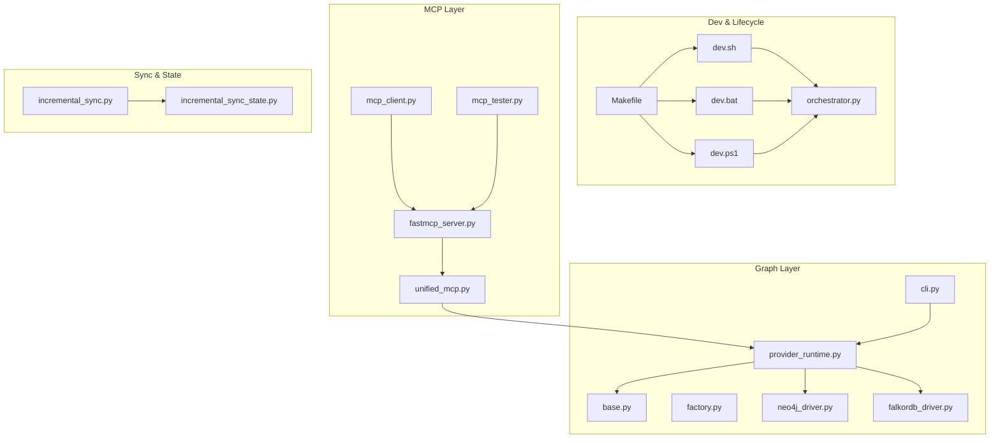
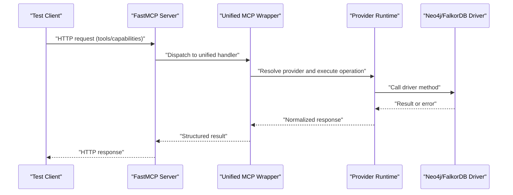
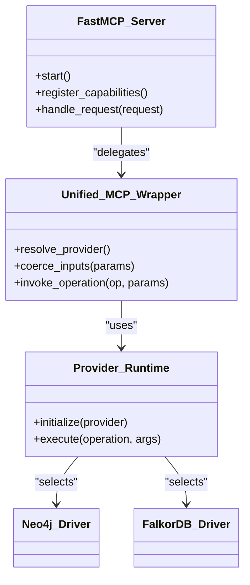
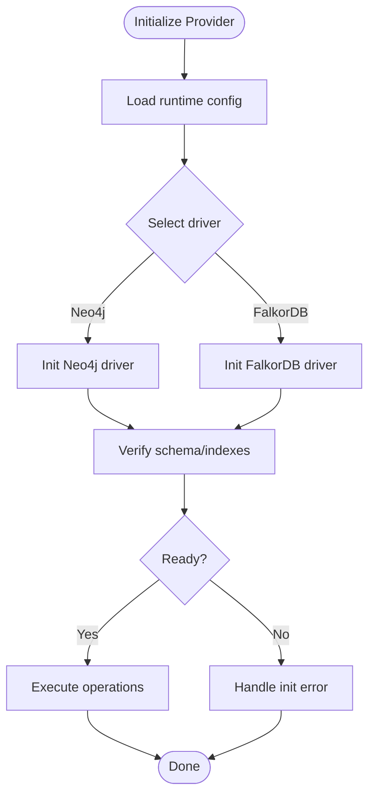
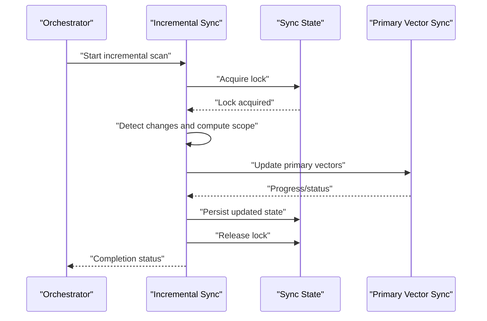
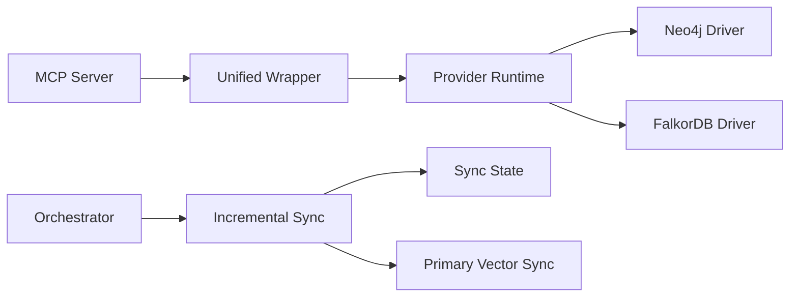

# Debugging Guides

<cite>
**Referenced Files in This Document**
- [ReadMe.md](file://ReadMe.md)
- [Makefile](file://Makefile)
- [dev.sh](file://dev.sh)
- [dev.bat](file://dev.bat)
- [dev.ps1](file://dev.ps1)
- [cortex_harness/dev.py](file://cortex_harness/dev.py)
- [scripts/mcp-lifecycle.py](file://scripts/mcp-lifecycle.py)
- [scripts/mcp_runtime_config.py](file://scripts/mcp_runtime_config.py)
- [code-tiny/mcp/fastmcp_server.py](file://code-tiny/mcp/fastmcp_server.py)
- [code-tiny/mcp/unified_mcp.py](file://code-tiny/mcp/unified_mcp.py)
- [code-tiny/tools/common/harness_config.py](file://code-tiny/tools/common/harness_config.py)
- [code-tiny/tools/sync/incremental_sync.py](file://code-tiny/tools/sync/incremental_sync.py)
- [code-tiny/tools/common/incremental_sync_state.py](file://code-tiny/tools/common/incremental_sync_state.py)
- [code-tiny/tools/graph/driver/neo4j_driver.py](file://code-tiny/tools/graph/driver/neo4j_driver.py)
- [code-tiny/tools/graph/driver/falkordb_driver.py](file://code-tiny/tools/graph/driver/falkordb_driver.py)
- [code-tiny/tools/graph/core/provider_runtime.py](file://code-tiny/tools/graph/core/provider_runtime.py)
- [code-tiny/tools/graph/core/base.py](file://code-tiny/tools/graph/core/base.py)
- [code-tiny/tools/graph/core/factory.py](file://code-tiny/tools/graph/core/factory.py)
- [code-tiny/tools/graph/cli.py](file://code-tiny/tools/graph/cli.py)
- [code-tiny/scripts/setup_graph_project.py](file://code-tiny/scripts/setup_graph_project.py)
- [code-tiny/scripts/cleanup_repo_graph.py](file://code-tiny/scripts/cleanup_repo_graph.py)
- [code-tiny/testtool/mcp_client.py](file://code-tiny/testtool/mcp_client.py)
- [code-tiny/testtool/mcp_tester.py](file://code-tiny/testtool/mcp_tester.py)
- [tests/test_dev_lifecycle_commands.py](file://tests/test_dev_lifecycle_commands.py)
- [tests/test_mcp_http_resilience.py](file://tests/test_mcp_http_resilience.py)
- [tests/test_incremental_sync_lock.py](file://tests/test_incremental_sync_lock.py)
- [tests/test_falkordb_driver.py](file://tests/test_falkordb_driver.py)
- [tests/test_cobol_error_recovery.py](file://tests/test_cobol_error_recovery.py)
- [tests/test_framework_mcp_flows.py](file://tests/test_framework_mcp_flows.py)
- [tests/test_unified_mcp_input_coercion.py](file://tests/test_unified_mcp_input_coercion.py)
- [tests/test_primary_vector_sync.py](file://tests/test_primary_vector_sync.py)
- [harness/scripts/orchestrator.py](file://harness/scripts/orchestrator.py)
- [harness/scripts/init.sh](file://harness/scripts/init.sh)
- [installers/windows/scripts/wrapper.bat](file://installers/windows/scripts/wrapper.bat)
</cite>

## Table of Contents
1. Introduction
2. Project Structure
3. Core Components
4. Architecture Overview
5. Detailed Component Analysis
6. Dependency Analysis
7. Performance Considerations
8. Troubleshooting Guide
9. Conclusion
10. Appendices

## Introduction
This document provides comprehensive debugging guides for Cortex Harness development and production issues. It focuses on:
- Analyzer failures
- MCP server problems
- Graph corruption scenarios
- Logging configuration, debug flags, and trace collection
- Step-by-step workflows for incremental sync issues, query routing problems, and data consistency errors
- IDE setup for debugging, breakpoint strategies, and remote debugging capabilities
- Error code reference, exception stack analysis, and log pattern recognition for common failure modes

The guidance is grounded in the repository’s runtime scripts, MCP server components, graph drivers, and test suites that exercise these paths.

## Project Structure
Cortex Harness integrates multiple subsystems:
- Lifecycle and dev tooling (Make targets, shell/PowerShell wrappers)
- MCP server entrypoints and unified wrapper
- Graph provider abstraction with Neo4j and FalkorDB drivers
- Incremental sync state management and lock handling
- Test harnesses for MCP resilience and input coercion

**Diagram sources**
- [Makefile](file://Makefile)
- [dev.sh](file://dev.sh)
- [dev.bat](file://dev.bat)
- [dev.ps1](file://dev.ps1)
- [harness/scripts/orchestrator.py](file://harness/scripts/orchestrator.py)
- [code-tiny/mcp/fastmcp_server.py](file://code-tiny/mcp/fastmcp_server.py)
- [code-tiny/mcp/unified_mcp.py](file://code-tiny/mcp/unified_mcp.py)
- [code-tiny/tools/graph/core/base.py](file://code-tiny/tools/graph/core/base.py)
- [code-tiny/tools/graph/core/factory.py](file://code-tiny/tools/graph/core/factory.py)
- [code-tiny/tools/graph/core/provider_runtime.py](file://code-tiny/tools/graph/core/provider_runtime.py)
- [code-tiny/tools/graph/driver/neo4j_driver.py](file://code-tiny/tools/graph/driver/neo4j_driver.py)
- [code-tiny/tools/graph/driver/falkordb_driver.py](file://code-tiny/tools/graph/driver/falkordb_driver.py)
- [code-tiny/tools/graph/cli.py](file://code-tiny/tools/graph/cli.py)
- [code-tiny/tools/sync/incremental_sync.py](file://code-tiny/tools/sync/incremental_sync.py)
- [code-tiny/tools/common/incremental_sync_state.py](file://code-tiny/tools/common/incremental_sync_state.py)
- [code-tiny/testtool/mcp_client.py](file://code-tiny/testtool/mcp_client.py)
- [code-tiny/testtool/mcp_tester.py](file://code-tiny/testtool/mcp_tester.py)

**Section sources**
- [ReadMe.md](file://ReadMe.md)
- [Makefile](file://Makefile)
- [dev.sh](file://dev.sh)
- [dev.bat](file://dev.bat)
- [dev.ps1](file://dev.ps1)

## Core Components
Key areas to focus on when debugging:
- MCP server lifecycle and HTTP resilience
- Graph provider initialization and driver selection
- Incremental sync state and locking
- Configuration loading and environment variables
- CLI orchestration and test utilities

Relevant files:
- MCP server entrypoint and unified wrapper
- Graph core and drivers
- Sync state and lock handling
- Runtime config loader
- Dev lifecycle scripts and orchestrator

**Section sources**
- [code-tiny/mcp/fastmcp_server.py](file://code-tiny/mcp/fastmcp_server.py)
- [code-tiny/mcp/unified_mcp.py](file://code-tiny/mcp/unified_mcp.py)
- [code-tiny/tools/graph/core/provider_runtime.py](file://code-tiny/tools/graph/core/provider_runtime.py)
- [code-tiny/tools/graph/driver/neo4j_driver.py](file://code-tiny/tools/graph/driver/neo4j_driver.py)
- [code-tiny/tools/graph/driver/falkordb_driver.py](file://code-tiny/tools/graph/driver/falkordb_driver.py)
- [code-tiny/tools/sync/incremental_sync.py](file://code-tiny/tools/sync/incremental_sync.py)
- [code-tiny/tools/common/incremental_sync_state.py](file://code-tiny/tools/common/incremental_sync_state.py)
- [scripts/mcp_runtime_config.py](file://scripts/mcp_runtime_config.py)
- [harness/scripts/orchestrator.py](file://harness/scripts/orchestrator.py)

## Architecture Overview
The MCP layer exposes tools and queries over HTTP. The unified wrapper coordinates capability routing and invokes graph operations via a provider runtime that abstracts the underlying database driver.

**Diagram sources**
- [code-tiny/mcp/fastmcp_server.py](file://code-tiny/mcp/fastmcp_server.py)
- [code-tiny/mcp/unified_mcp.py](file://code-tiny/mcp/unified_mcp.py)
- [code-tiny/tools/graph/core/provider_runtime.py](file://code-tiny/tools/graph/core/provider_runtime.py)
- [code-tiny/tools/graph/driver/neo4j_driver.py](file://code-tiny/tools/graph/driver/neo4j_driver.py)
- [code-tiny/tools/graph/driver/falkordb_driver.py](file://code-tiny/tools/graph/driver/falkordb_driver.py)

## Detailed Component Analysis

### MCP Server and Unified Wrapper
Focus areas:
- Server startup and health checks
- Capability registration and routing
- Input coercion and validation
- HTTP resilience and retries

Debugging tips:
- Inspect server logs for capability registration and route dispatch
- Validate inputs using the unified wrapper’s coercion logic
- Use the MCP client and tester utilities to reproduce issues deterministically

**Diagram sources**
- [code-tiny/mcp/fastmcp_server.py](file://code-tiny/mcp/fastmcp_server.py)
- [code-tiny/mcp/unified_mcp.py](file://code-tiny/mcp/unified_mcp.py)
- [code-tiny/tools/graph/core/provider_runtime.py](file://code-tiny/tools/graph/core/provider_runtime.py)
- [code-tiny/tools/graph/driver/neo4j_driver.py](file://code-tiny/tools/graph/driver/neo4j_driver.py)
- [code-tiny/tools/graph/driver/falkordb_driver.py](file://code-tiny/tools/graph/driver/falkordb_driver.py)

**Section sources**
- [code-tiny/mcp/fastmcp_server.py](file://code-tiny/mcp/fastmcp_server.py)
- [code-tiny/mcp/unified_mcp.py](file://code-tiny/mcp/unified_mcp.py)
- [code-tiny/testtool/mcp_client.py](file://code-tiny/testtool/mcp_client.py)
- [code-tiny/testtool/mcp_tester.py](file://code-tiny/testtool/mcp_tester.py)
- [tests/test_mcp_http_resilience.py](file://tests/test_mcp_http_resilience.py)
- [tests/test_unified_mcp_input_coercion.py](file://tests/test_unified_mcp_input_coercion.py)

### Graph Provider and Drivers
Focus areas:
- Provider initialization and connection lifecycle
- Driver-specific error handling and retry behavior
- Schema and index verification
- Data migration and cleanup utilities

Debugging tips:
- Verify connectivity and credentials before running operations
- Check driver logs for connection timeouts and query failures
- Use CLI commands to validate schema and indexes
- Run cleanup scripts to recover from partial migrations

**Diagram sources**
- [code-tiny/tools/graph/core/provider_runtime.py](file://code-tiny/tools/graph/core/provider_runtime.py)
- [code-tiny/tools/graph/core/base.py](file://code-tiny/tools/graph/core/base.py)
- [code-tiny/tools/graph/core/factory.py](file://code-tiny/tools/graph/core/factory.py)
- [code-tiny/tools/graph/driver/neo4j_driver.py](file://code-tiny/tools/graph/driver/neo4j_driver.py)
- [code-tiny/tools/graph/driver/falkordb_driver.py](file://code-tiny/tools/graph/driver/falkordb_driver.py)
- [code-tiny/tools/graph/cli.py](file://code-tiny/tools/graph/cli.py)
- [code-tiny/scripts/setup_graph_project.py](file://code-tiny/scripts/setup_graph_project.py)
- [code-tiny/scripts/cleanup_repo_graph.py](file://code-tiny/scripts/cleanup_repo_graph.py)

**Section sources**
- [code-tiny/tools/graph/core/provider_runtime.py](file://code-tiny/tools/graph/core/provider_runtime.py)
- [code-tiny/tools/graph/driver/neo4j_driver.py](file://code-tiny/tools/graph/driver/neo4j_driver.py)
- [code-tiny/tools/graph/driver/falkordb_driver.py](file://code-tiny/tools/graph/driver/falkordb_driver.py)
- [code-tiny/tools/graph/cli.py](file://code-tiny/tools/graph/cli.py)
- [code-tiny/scripts/setup_graph_project.py](file://code-tiny/scripts/setup_graph_project.py)
- [code-tiny/scripts/cleanup_repo_graph.py](file://code-tiny/scripts/cleanup_repo_graph.py)
- [tests/test_falkordb_driver.py](file://tests/test_falkordb_driver.py)

### Incremental Sync and Locking
Focus areas:
- Change detection and scope calculation
- State persistence and migration
- Lock acquisition and contention handling
- Primary vector synchronization

Debugging tips:
- Inspect sync state files and locks for stale entries
- Validate change detection against known diffs
- Reproduce with deterministic fixtures and minimal scopes
- Monitor primary vector sync progress and failures

**Diagram sources**
- [harness/scripts/orchestrator.py](file://harness/scripts/orchestrator.py)
- [code-tiny/tools/sync/incremental_sync.py](file://code-tiny/tools/sync/incremental_sync.py)
- [code-tiny/tools/common/incremental_sync_state.py](file://code-tiny/tools/common/incremental_sync_state.py)
- [tests/test_primary_vector_sync.py](file://tests/test_primary_vector_sync.py)

**Section sources**
- [code-tiny/tools/sync/incremental_sync.py](file://code-tiny/tools/sync/incremental_sync.py)
- [code-tiny/tools/common/incremental_sync_state.py](file://code-tiny/tools/common/incremental_sync_state.py)
- [harness/scripts/orchestrator.py](file://harness/scripts/orchestrator.py)
- [tests/test_incremental_sync_lock.py](file://tests/test_incremental_sync_lock.py)
- [tests/test_primary_vector_sync.py](file://tests/test_primary_vector_sync.py)

### Configuration and Environment
Focus areas:
- Runtime configuration loading
- Environment variable precedence
- Harness configuration defaults

Debugging tips:
- Dump effective configuration at startup
- Validate required keys and types
- Ensure consistent environment across dev/prod

**Section sources**
- [scripts/mcp_runtime_config.py](file://scripts/mcp_runtime_config.py)
- [code-tiny/tools/common/harness_config.py](file://code-tiny/tools/common/harness_config.py)

## Dependency Analysis
High-level dependencies relevant to debugging:
- MCP server depends on unified wrapper and provider runtime
- Provider runtime selects between Neo4j and FalkorDB drivers
- Incremental sync depends on state management and primary vector sync
- Dev lifecycle scripts orchestrate server and graph setup

**Diagram sources**
- [code-tiny/mcp/fastmcp_server.py](file://code-tiny/mcp/fastmcp_server.py)
- [code-tiny/mcp/unified_mcp.py](file://code-tiny/mcp/unified_mcp.py)
- [code-tiny/tools/graph/core/provider_runtime.py](file://code-tiny/tools/graph/core/provider_runtime.py)
- [code-tiny/tools/graph/driver/neo4j_driver.py](file://code-tiny/tools/graph/driver/neo4j_driver.py)
- [code-tiny/tools/graph/driver/falkordb_driver.py](file://code-tiny/tools/graph/driver/falkordb_driver.py)
- [harness/scripts/orchestrator.py](file://harness/scripts/orchestrator.py)
- [code-tiny/tools/sync/incremental_sync.py](file://code-tiny/tools/sync/incremental_sync.py)
- [code-tiny/tools/common/incremental_sync_state.py](file://code-tiny/tools/common/incremental_sync_state.py)
- [tests/test_primary_vector_sync.py](file://tests/test_primary_vector_sync.py)

**Section sources**
- [code-tiny/mcp/fastmcp_server.py](file://code-tiny/mcp/fastmcp_server.py)
- [code-tiny/mcp/unified_mcp.py](file://code-tiny/mcp/unified_mcp.py)
- [code-tiny/tools/graph/core/provider_runtime.py](file://code-tiny/tools/graph/core/provider_runtime.py)
- [code-tiny/tools/graph/driver/neo4j_driver.py](file://code-tiny/tools/graph/driver/neo4j_driver.py)
- [code-tiny/tools/graph/driver/falkordb_driver.py](file://code-tiny/tools/graph/driver/falkordb_driver.py)
- [harness/scripts/orchestrator.py](file://harness/scripts/orchestrator.py)
- [code-tiny/tools/sync/incremental_sync.py](file://code-tiny/tools/sync/incremental_sync.py)
- [code-tiny/tools/common/incremental_sync_state.py](file://code-tiny/tools/common/incremental_sync_state.py)
- [tests/test_primary_vector_sync.py](file://tests/test_primary_vector_sync.py)

## Performance Considerations
- Prefer incremental scans over full re-indexing; verify change detection accuracy
- Tune driver connection pools and timeouts based on workload
- Avoid excessive logging in hot paths; use structured logs and sampling
- Validate indexes and constraints to ensure query performance
- Profile primary vector sync throughput and batch sizes

[No sources needed since this section provides general guidance]

## Troubleshooting Guide

### Analyzer Failures
Common symptoms:
- Unexpected exceptions during parsing or semantic analysis
- Missing symbols or incorrect relationships
- Inconsistent results across runs

Step-by-step workflow:
- Isolate the analyzer by running targeted tests or fixtures
- Enable detailed logs around parser and resolver stages
- Compare outputs against expected contracts and fixtures
- Validate environment and dependencies for the specific language/framework

Log patterns to recognize:
- Parser errors and recovery messages
- Resolver warnings about ambiguous references
- Semantic inference notes and confidence scores

Exception stack analysis:
- Identify top-level exceptions and their origins
- Trace through analyzer pipeline stages
- Correlate with source file locations and line numbers

IDE setup:
- Configure breakpoints at analyzer entry points and key pipeline stages
- Use conditional breakpoints for large inputs
- Attach debugger to long-running processes if necessary

Remote debugging:
- Launch analyzers with debug ports exposed
- Connect IDE debugger remotely
- Capture thread dumps and heap snapshots under load

**Section sources**
- [tests/test_cobol_error_recovery.py](file://tests/test_cobol_error_recovery.py)
- [code-tiny/tools/common/harness_config.py](file://code-tiny/tools/common/harness_config.py)

### MCP Server Problems
Common symptoms:
- HTTP 5xx responses or timeouts
- Capability not found or routing errors
- Input coercion failures

Step-by-step workflow:
- Start the MCP server and verify health endpoints
- Use the MCP client and tester utilities to send requests
- Inspect server logs for capability registration and dispatch
- Validate input schemas and coerce parameters explicitly

Log patterns to recognize:
- Capability registration events
- Route resolution and parameter coercion steps
- HTTP error codes and stack traces

Exception stack analysis:
- Focus on dispatcher and wrapper layers
- Check driver invocation and normalization steps

IDE setup:
- Breakpoints at server start, capability registration, and request handlers
- Conditional breakpoints on specific routes or operations

Remote debugging:
- Expose debug port for the server process
- Attach IDE debugger and capture call stacks

**Section sources**
- [code-tiny/mcp/fastmcp_server.py](file://code-tiny/mcp/fastmcp_server.py)
- [code-tiny/mcp/unified_mcp.py](file://code-tiny/mcp/unified_mcp.py)
- [code-tiny/testtool/mcp_client.py](file://code-tiny/testtool/mcp_client.py)
- [code-tiny/testtool/mcp_tester.py](file://code-tiny/testtool/mcp_tester.py)
- [tests/test_mcp_http_resilience.py](file://tests/test_mcp_http_resilience.py)
- [tests/test_unified_mcp_input_coercion.py](file://tests/test_unified_mcp_input_coercion.py)

### Graph Corruption Scenarios
Common symptoms:
- Schema mismatch errors
- Index missing or inconsistent
- Partial migrations after crashes

Step-by-step workflow:
- Verify provider initialization and driver connectivity
- Run CLI commands to check schema and indexes
- Use setup script to initialize project graph
- If corrupted, run cleanup script and re-initialize

Log patterns to recognize:
- Connection errors and authentication failures
- Schema validation errors and migration steps
- Cleanup and reset operations

Exception stack analysis:
- Identify driver-level failures vs. application-level validations
- Trace migration and setup flows

IDE setup:
- Breakpoints at provider initialization and driver methods
- Inspect connection states and transaction boundaries

Remote debugging:
- Attach debugger to graph setup and migration processes
- Capture state snapshots before and after operations

**Section sources**
- [code-tiny/tools/graph/core/provider_runtime.py](file://code-tiny/tools/graph/core/provider_runtime.py)
- [code-tiny/tools/graph/driver/neo4j_driver.py](file://code-tiny/tools/graph/driver/neo4j_driver.py)
- [code-tiny/tools/graph/driver/falkordb_driver.py](file://code-tiny/tools/graph/driver/falkordb_driver.py)
- [code-tiny/tools/graph/cli.py](file://code-tiny/tools/graph/cli.py)
- [code-tiny/scripts/setup_graph_project.py](file://code-tiny/scripts/setup_graph_project.py)
- [code-tiny/scripts/cleanup_repo_graph.py](file://code-tiny/scripts/cleanup_repo_graph.py)
- [tests/test_falkordb_driver.py](file://tests/test_falkordb_driver.py)

### Incremental Sync Issues
Common symptoms:
- Stale state or locks preventing updates
- Missed changes or redundant scans
- Primary vector sync stalls

Step-by-step workflow:
- Acquire and inspect sync state and lock files
- Validate change detection against known diffs
- Re-run incremental scan with reduced scope
- Monitor primary vector sync progress and errors

Log patterns to recognize:
- Lock acquisition and release events
- Change detection summaries and scope calculations
- Vector sync progress and completion markers

Exception stack analysis:
- Focus on sync orchestration and state persistence
- Identify contention and timeout issues

IDE setup:
- Breakpoints at lock acquisition, change detection, and state persistence
- Inspect computed scopes and deltas

Remote debugging:
- Attach debugger to long-running sync jobs
- Capture thread states and resource usage

**Section sources**
- [code-tiny/tools/sync/incremental_sync.py](file://code-tiny/tools/sync/incremental_sync.py)
- [code-tiny/tools/common/incremental_sync_state.py](file://code-tiny/tools/common/incremental_sync_state.py)
- [harness/scripts/orchestrator.py](file://harness/scripts/orchestrator.py)
- [tests/test_incremental_sync_lock.py](file://tests/test_incremental_sync_lock.py)
- [tests/test_primary_vector_sync.py](file://tests/test_primary_vector_sync.py)

### Query Routing Problems
Common symptoms:
- Requests routed to wrong provider or capability
- Parameter coercion mismatches
- Inconsistent results across providers

Step-by-step workflow:
- Verify capability registration and routing tables
- Inspect unified wrapper’s input coercion logic
- Compare responses across Neo4j and FalkorDB drivers
- Use test utilities to assert expected behaviors

Log patterns to recognize:
- Capability resolution and dispatch decisions
- Coercion warnings and type conversions
- Provider-specific execution details

Exception stack analysis:
- Focus on routing and coercion layers
- Trace provider-specific error propagation

IDE setup:
- Breakpoints at capability registry and router
- Inspect resolved provider and coerced parameters

Remote debugging:
- Attach debugger to request processing pipeline
- Capture full call stacks for failed routes

**Section sources**
- [code-tiny/mcp/unified_mcp.py](file://code-tiny/mcp/unified_mcp.py)
- [code-tiny/tools/graph/core/provider_runtime.py](file://code-tiny/tools/graph/core/provider_runtime.py)
- [code-tiny/tools/graph/driver/neo4j_driver.py](file://code-tiny/tools/graph/driver/neo4j_driver.py)
- [code-tiny/tools/graph/driver/falkordb_driver.py](file://code-tiny/tools/graph/driver/falkordb_driver.py)
- [tests/test_framework_mcp_flows.py](file://tests/test_framework_mcp_flows.py)

### Data Consistency Errors
Common symptoms:
- Mismatched counts or missing nodes/edges
- Inconsistent schema versions
- Partial writes after failures

Step-by-step workflow:
- Validate schema and indexes using CLI
- Re-run setup and cleanup scripts to restore baseline
- Inspect driver transactions and rollback behavior
- Compare results across providers to isolate inconsistencies

Log patterns to recognize:
- Transaction begin/commit/rollback events
- Schema validation and migration outcomes
- Cleanup and reset operations

Exception stack analysis:
- Identify driver-level failures and application-level validations
- Trace write paths and rollback triggers

IDE setup:
- Breakpoints at transaction boundaries and schema validation
- Inspect in-memory state before and after writes

Remote debugging:
- Attach debugger to write-heavy operations
- Capture snapshots and diffs for comparison

**Section sources**
- [code-tiny/tools/graph/cli.py](file://code-tiny/tools/graph/cli.py)
- [code-tiny/scripts/setup_graph_project.py](file://code-tiny/scripts/setup_graph_project.py)
- [code-tiny/scripts/cleanup_repo_graph.py](file://code-tiny/scripts/cleanup_repo_graph.py)
- [code-tiny/tools/graph/driver/neo4j_driver.py](file://code-tiny/tools/graph/driver/neo4j_driver.py)
- [code-tiny/tools/graph/driver/falkordb_driver.py](file://code-tiny/tools/graph/driver/falkordb_driver.py)

### Logging Configuration, Debug Flags, and Trace Collection
Recommendations:
- Enable structured logging at appropriate levels per component
- Use debug flags to increase verbosity for failing paths
- Collect traces around MCP requests, provider calls, and sync operations
- Aggregate logs centrally and correlate by request IDs

Practical steps:
- Start server with increased log level and debug flags
- Instrument critical paths with trace spans
- Export logs and traces for analysis

**Section sources**
- [scripts/mcp_runtime_config.py](file://scripts/mcp_runtime_config.py)
- [code-tiny/tools/common/harness_config.py](file://code-tiny/tools/common/harness_config.py)
- [code-tiny/mcp/fastmcp_server.py](file://code-tiny/mcp/fastmcp_server.py)

### IDE Setup, Breakpoint Strategies, and Remote Debugging
Guidance:
- Configure launch profiles for MCP server and graph setup
- Set breakpoints at entry points and critical decision points
- Use conditional breakpoints for specific inputs or routes
- Attach to running processes for production-like debugging

Remote debugging:
- Expose debug ports for server and long-running tasks
- Connect IDE debugger and capture call stacks
- Use thread dumps and heap snapshots for performance issues

**Section sources**
- [dev.sh](file://dev.sh)
- [dev.bat](file://dev.bat)
- [dev.ps1](file://dev.ps1)
- [cortex_harness/dev.py](file://cortex_harness/dev.py)
- [installers/windows/scripts/wrapper.bat](file://installers/windows/scripts/wrapper.bat)

### Error Code Reference and Log Pattern Recognition
Approach:
- Map HTTP status codes to MCP error categories
- Catalog common exception types and their contexts
- Recognize recurring log patterns for failures
- Maintain a living reference aligned with tests and server behavior

Examples:
- HTTP 5xx for server-side failures
- Capability not found for routing errors
- Schema mismatch for graph initialization issues

**Section sources**
- [tests/test_mcp_http_resilience.py](file://tests/test_mcp_http_resilience.py)
- [tests/test_unified_mcp_input_coercion.py](file://tests/test_unified_mcp_input_coercion.py)
- [tests/test_falkordb_driver.py](file://tests/test_falkordb_driver.py)

## Conclusion
Effective debugging in Cortex Harness requires understanding the MCP server flow, graph provider abstractions, and incremental sync mechanisms. By leveraging structured logs, targeted breakpoints, and test utilities, you can quickly isolate issues across analyzers, routing, and data consistency. Use the provided workflows and diagrams to guide your investigations and maintain reliable development and production operations.

[No sources needed since this section summarizes without analyzing specific files]

## Appendices

### Quick Start Commands
- Initialize graph project and verify schema
- Start MCP server with debug logging
- Run MCP client tests to validate capabilities

**Section sources**
- [code-tiny/scripts/setup_graph_project.py](file://code-tiny/scripts/setup_graph_project.py)
- [code-tiny/testtool/mcp_client.py](file://code-tiny/testtool/mcp_client.py)
- [code-tiny/testtool/mcp_tester.py](file://code-tiny/testtool/mcp_tester.py)
- [Makefile](file://Makefile)
- [dev.sh](file://dev.sh)
- [dev.bat](file://dev.bat)
- [dev.ps1](file://dev.ps1)

### Lifecycle and Orchestration
- Use orchestrator scripts to manage server and graph lifecycle
- Validate environment and configuration before starting services

**Section sources**
- [harness/scripts/orchestrator.py](file://harness/scripts/orchestrator.py)
- [harness/scripts/init.sh](file://harness/scripts/init.sh)
- [scripts/mcp-lifecycle.py](file://scripts/mcp-lifecycle.py)
- [tests/test_dev_lifecycle_commands.py](file://tests/test_dev_lifecycle_commands.py)