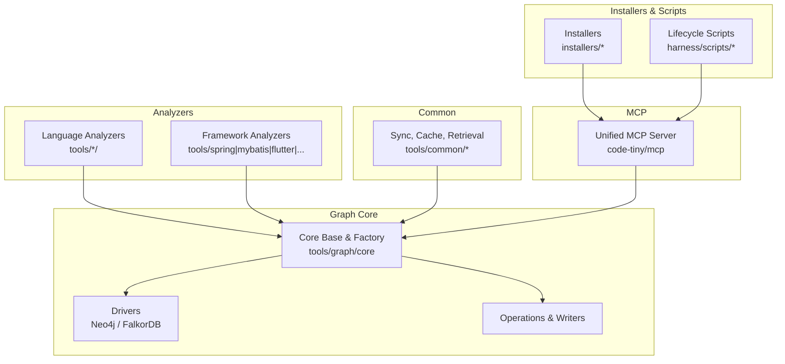
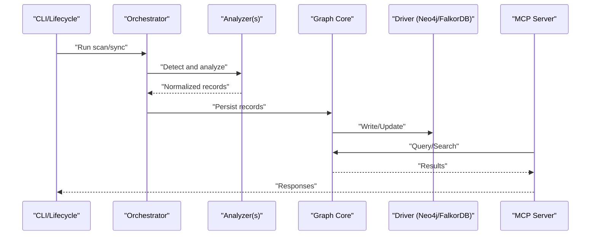
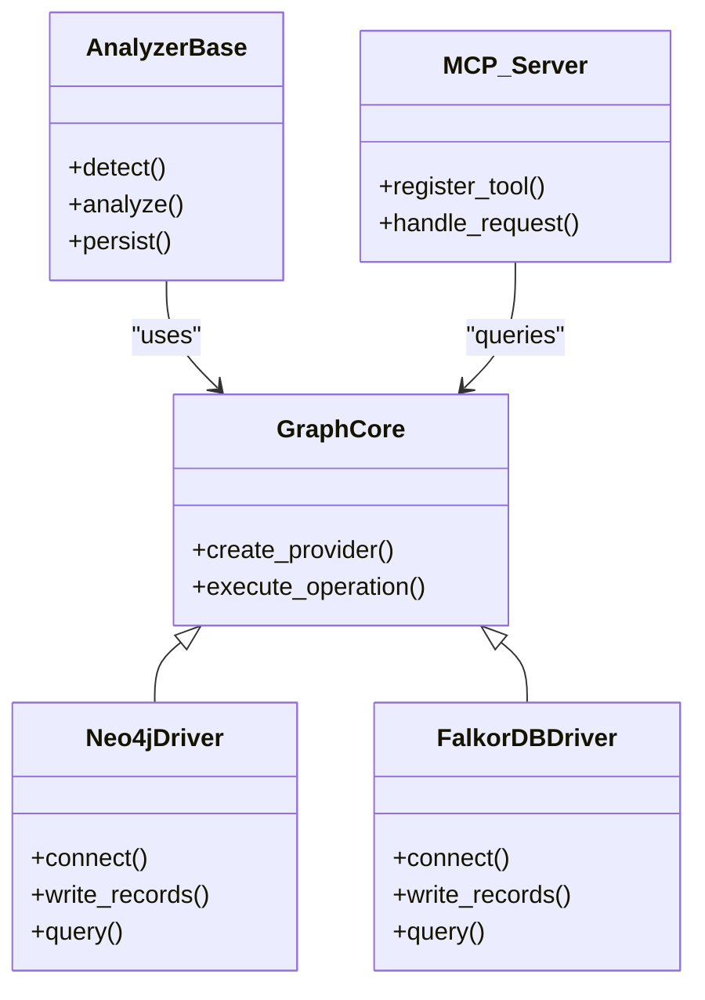

# Frequently Asked Questions

<cite>
**Referenced Files in This Document**
- [ReadMe.md](file://ReadMe.md)
- [INSTALLER_GUIDE.md](file://INSTALLER_GUIDE.md)
- [Makefile](file://Makefile)
- [pyproject.toml](file://pyproject.toml)
- [requirements.txt](file://requirements.txt)
- [dev.sh](file://dev.sh)
- [dev.bat](file://dev.bat)
- [dev.ps1](file://dev.ps1)
- [install-windows.bat](file://install-windows.bat)
- [install-windows.ps1](file://install-windows.ps1)
- [cortex-harness.sln](file://cortex-harness.sln)
- [harness/templates/config.yaml](file://harness/templates/config.yaml)
- [code-tiny/mcp/Readme.md](file://code-tiny/mcp/Readme.md)
- [code-tiny/tools/aspnet_core/README.md](file://code-tiny/tools/aspnet_core/README.md)
- [code-tiny/tools/cobol/README.md](file://code-tiny/tools/cobol/README.md)
- [code-tiny/tools/flutter/README.md](file://code-tiny/tools/flutter/README.md)
- [code-tiny/tools/perl/README.md](file://code-tiny/tools/perl/README.md)
- [code-tiny/tools/servlet_jsp/README.md](file://code-tiny/tools/servlet_jsp/README.md)
- [code-tiny/tools/struts/README.md](file://code-tiny/tools/struts/README.md)
- [code-tiny/tools/vb/README.md](file://code-tiny/tools/vb/README.md)
- [code-tiny/tools/common/harness_config.py](file://code-tiny/tools/common/harness_config.py)
- [code-tiny/tools/graph/driver/neo4j_driver.py](file://code-tiny/tools/graph/driver/neo4j_driver.py)
- [code-tiny/tools/graph/driver/falkordb_driver.py](file://code-tiny/tools/graph/driver/falkordb_driver.py)
- [code-tiny/tools/graph/core/provider_runtime.py](file://code-tiny/tools/graph/core/provider_runtime.py)
- [code-tiny/tools/graph/core/base.py](file://code-tiny/tools/graph/core/base.py)
- [code-tiny/tools/graph/core/factory.py](file://code-tiny/tools/graph/core/factory.py)
- [code-tiny/tools/graph/cli.py](file://code-tiny/tools/graph/cli.py)
- [code-tiny/tools/ts/ts_project_detector.py](file://code-tiny/tools/ts/ts_project_detector.py)
- [code-tiny/tools/spring/detector.py](file://code-tiny/tools/spring/detector.py)
- [code-tiny/tools/mybatis/detector.py](file://code-tiny/tools/mybatis/detector.py)
- [code-tiny/tools/flutter/detector.py](file://code-tiny/tools/flutter/detector.py)
- [code-tiny/tools/aspnet_core/detector.py](file://code-tiny/tools/aspnet_core/detector.py)
- [code-tiny/tools/aspnet_framework/detector.py](file://code-tiny/tools/aspnet_framework/detector.py)
- [code-tiny/tools/servlet_jsp/detector.py](file://code-tiny/tools/servlet_jsp/detector.py)
- [code-tiny/tools/struts/detector.py](file://code-tiny/tools/struts/detector.py)
- [code-tiny/tools/database_schema/__init__.py](file://code-tiny/tools/database_schema/__init__.py)
- [code-tiny/tools/web_framework/pipeline.py](file://code-tiny/tools/web_framework/pipeline.py)
- [code-tiny/tools/web_framework/web_framework_analyzer.py](file://code-tiny/tools/web_framework/web_framework_analyzer.py)
- [code-tiny/tools/sync/incremental_sync.py](file://code-tiny/tools/sync/incremental_sync.py)
- [code-tiny/tools/sync/build_owner_manifests.py](file://code-tiny/tools/sync/build_owner_manifests.py)
- [code-tiny/tools/sync/dead_code_report.py](file://code-tiny/tools/sync/dead_code_report.py)
- [code-tiny/tools/sync/message_scan.py](file://code-tiny/tools/sync/message_scan.py)
- [code-tiny/tools/sync/owner_manifest.py](file://code-tiny/tools/sync/owner_manifest.py)
- [code-tiny/tools/common/analyzer_cache.py](file://code-tiny/tools/common/analyzer_cache.py)
- [code-tiny/tools/common/source_inventory.py](file://code-tiny/tools/common/source_inventory.py)
- [code-tiny/tools/common/git_diff.py](file://code-tiny/tools/common/git_diff.py)
- [code-tiny/tools/common/incremental_cleanup.py](file://code-tiny/tools/common/incremental_cleanup.py)
- [code-tiny/tools/common/incremental_sync_state.py](file://code-tiny/tools/common/incremental_sync_state.py)
- [code-tiny/tools/common/sync_scope.py](file://code-tiny/tools/common/sync_scope.py)
- [code-tiny/tools/common/result_packager.py](file://code-tiny/tools/common/result_packager.py)
- [code-tiny/tools/common/bm25_ranker.py](file://code-tiny/tools/common/bm25_ranker.py)
- [code-tiny/tools/common/intelligent_retrieval.py](file://code-tiny/tools/common/intelligent_retrieval.py)
- [code-tiny/tools/common/query_intent_classifier.py](file://code-tiny/tools/common/query_intent_classifier.py)
- [code-tiny/tools/common/query_understanding.py](file://code-tiny/tools/common/query_understanding.py)
- [code-tiny/tools/common/react_role_classifier.py](file://code-tiny/tools/common/react_role_classifier.py)
- [code-tiny/tools/common/workflow_classifier.py](file://code-tiny/tools/common/workflow_classifier.py)
- [code-tiny/tools/common/workflow_impact_scorer.py](file://code-tiny/tools/common/workflow_impact_scorer.py)
- [code-tiny/tools/common/api_match_engine.py](file://code-tiny/tools/common/api_match_engine.py)
- [code-tiny/tools/common/call_graph_builder.py](file://code-tiny/tools/common/call_graph_builder.py)
- [code-tiny/tools/common/confidence_scorer.py](file://code-tiny/tools/common/confidence_scorer.py)
- [code-tiny/tools/common/frontend_relationship_extractor.py](file://code-tiny/tools/common/frontend_relationship_extractor.py)
- [code-tiny/tools/common/graph_expander.py](file://code-tiny/tools/common/graph_expander.py)
- [code-tiny/tools/common/llm_summary.py](file://code-tiny/tools/common/llm_summary.py)
- [code-tiny/tools/common/message_scan.py](file://code-tiny/tools/common/message_scan.py)
- [code-tiny/tools/common/primary_vector_sync.py](file://code-tiny/tools/common/primary_vector_sync.py)
- [code-tiny/tools/common/signal_normalizer.py](file://code-tiny/tools/common/signal_normalizer.py)
- [code-tiny/tools/common/url_normalizer.py](file://code-tiny/tools/common/url_normalizer.py)
- [code-tiny/tools/common/cloc_stats.py](file://code-tiny/tools/common/cloc_stats.py)
- [code-tiny/tools/common/message_detectors/android.py](file://code-tiny/tools/common/message_detectors/android.py)
- [code-tiny/tools/common/message_detectors/cplus.py](file://code-tiny/tools/common/message_detectors/cplus.py)
- [code-tiny/tools/common/message_detectors/csharp.py](file://code-tiny/tools/common/message_detectors/csharp.py)
- [code-tiny/tools/common/message_detectors/delphi.py](file://code-tiny/tools/common/message_detectors/delphi.py)
- [code-tiny/tools/common/message_detectors/java.py](file://code-tiny/tools/common/message_detectors/java.py)
- [code-tiny/tools/common/message_detectors/js.py](file://code-tiny/tools/common/message_detectors/js.py)
- [code-tiny/tools/common/message_detectors/kotlin.py](file://code-tiny/tools/common/message_detectors/kotlin.py)
- [code-tiny/tools/common/message_detectors/php.py](file://code-tiny/tools/common/message_detectors/php.py)
- [code-tiny/tools/common/message_detectors/plsql.py](file://code-tiny/tools/common/message_detectors/plsql.py)
- [code-tiny/tools/common/message_detectors/python.py](file://code-t tiny/tools/common/message_detectors/python.py)
- [code-tiny/tools/common/message_detectors/sql.py](file://code-tiny/tools/common/message_detectors/sql.py)
- [code-tiny/tools/common/message_detectors/ts.py](file://code-tiny/tools/common/message_detectors/ts.py)
- [code-tiny/tools/common/message_detectors/vb6.py](file://code-tiny/tools/common/message_detectors/vb6.py)
- [code-tiny/tools/common/message_detectors/vba.py](file://code-tiny/tools/common/message_detectors/vba.py)
- [code-tiny/tools/common/message_detectors/vbnet.py](file://code-tiny/tools/common/message_detectors/vbnet.py)
- [code-tiny/tools/common/message_detectors/vbscript.py](file://code-tiny/tools/common/message_detectors/vbscript.py)
- [code-tiny/tools/graph/writer/language_writer.py](file://code-tiny/tools/graph/writer/language_writer.py)
- [code-tiny/tools/graph/writer/aspnet_writer.py](file://code-tiny/tools/graph/writer/aspnet_writer.py)
- [code-tiny/tools/graph/writer/database_schema_writer.py](file://code-tiny/tools/graph/writer/database_schema_writer.py)
- [code-tiny/tools/graph/writer/mybatis_writer.py](file://code-tiny/tools/graph/writer/mybatis_writer.py)
- [code-tiny/tools/graph/writer/servlet_jsp_writer.py](file://code-tiny/tools/graph/writer/servlet_jsp_writer.py)
- [code-tiny/tools/graph/writer/spring_writer.py](file://code-tiny/tools/graph/writer/spring_writer.py)
- [code-tiny/tools/graph/writer/web_framework_writer.py](file://code-tiny/tools/graph/writer/web_framework_writer.py)
- [code-tiny/tools/graph/operations/class_ops.py](file://code-tiny/tools/graph/operations/class_ops.py)
- [code-tiny/tools/graph/operations/function_ops.py](file://code-tiny/tools/graph/operations/function_ops.py)
- [code-tiny/tools/graph/operations/package_ops.py](file://code-tiny/tools/graph/operations/package_ops.py)
- [code-tiny/tools/graph/operations/type_ops.py](file://code-tiny/tools/graph/operations/namespace_ops.py)
- [code-tiny/tools/graph/operations/document_ops.py](file://code-tiny/tools/graph/operations/document_ops.py)
- [code-tiny/tools/graph/operations/flow_ops.py](file://code-tiny/tools/graph/operations/flow_ops.py)
- [code-tiny/tools/graph/operations/infra_ops.py](file://code-tiny/tools/graph/operations/infra_ops.py)
- [code-tiny/tools/graph/operations/cross_edge_ops.py](file://code-tiny/tools/graph/operations/cross_edge_ops.py)
- [code-tiny/tools/graph/examples/example_usage.py](file://code-tiny/tools/graph/examples/example_usage.py)
- [code-tiny/tools/graph/docs/QUICK_REFERENCE.md](file://code-tiny/tools/graph/docs/QUICK_REFERENCE.md)
- [code-tiny/tools/graph/docs/QUERY_METHODS.md](file://code-tiny/tools/graph/docs/QUERY_METHODS.md)
- [code-tiny/tools/graph/docs/IMPLEMENTATION_SUMMARY.md](file://code-tiny/tools/graph/docs/IMPLEMENTATION_SUMMARY.md)
- [code-tiny/tools/graph/docs/MIGRATION_EXAMPLE.md](file://code-tiny/tools/graph/docs/MIGRATION_EXAMPLE.md)
- [code-tiny/tools/graph/docs/MIGRATION_GUIDE.py](file://code-tiny/tools/graph/docs/MIGRATION_GUIDE.py)
- [code-tiny/tools/graph/docs/STRUCTURE.md](file://code-tiny/tools/graph/docs/STRUCTURE.md)
- [code-tiny/tools/graph/STRUCTURE.md](file://code-tiny/tools/graph/STRUCTURE.md)
- [code-tiny/tools/graph/__init__.py](file://code-tiny/tools/graph/__init__.py)
- [code-tiny/tools/graph/core/record_parsers.py](file://code-tiny/tools/graph/core/record_parsers.py)
- [code-tiny/tools/graph/core/require_neo4j.py](file://code-tiny/tools/graph/core/require_neo4j.py)
- [code-tiny/tools/graph/operations/__init__.py](file://code-tiny/tools/graph/operations/__init__.py)
- [code-tiny/tools/graph/writer/__init__.py](file://code-tiny/tools/graph/writer/__init__.py)
- [code-tiny/tools/graph/driver/__init__.py](file://code-tiny/tools/graph/driver/__init__.py)
- [code-tiny/tools/graph/core/__init__.py](file://code-tiny/tools/graph/core/__init__.py)
- [code-tiny/tools/graph/operations/class_ops.py](file://code-tiny/tools/graph/operations/class_ops.py)
- [code-tiny/tools/graph/operations/function_ops.py](file://code-tiny/tools/graph/operations/function_ops.py)
- [code-tiny/tools/graph/operations/package_ops.py](file://code-tiny/tools/graph/operations/package_ops.py)
- [code-tiny/tools/graph/operations/type_ops.py](file://code-tiny/tools/graph/operations/type_ops.py)
- [code-tiny/tools/graph/operations/namespace_ops.py](file://code-tiny/tools/graph/operations/namespace_ops.py)
- [code-tiny/tools/graph/operations/document_ops.py](file://code-tiny/tools/graph/operations/document_ops.py)
- [code-tiny/tools/graph/operations/flow_ops.py](file://code-tiny/tools/graph/operations/flow_ops.py)
- [code-tiny/tools/graph/operations/infra_ops.py](file://code-tiny/tools/graph/operations/infra_ops.py)
- [code-tiny/tools/graph/operations/cross_edge_ops.py](file://code-tiny/tools/graph/operations/cross_edge_ops.py)
- [code-tiny/tools/graph/writer/language_writer.py](file://code-tiny/tools/graph/writer/language_writer.py)
- [code-tiny/tools/graph/writer/aspnet_writer.py](file://code-tiny/tools/graph/writer/aspnet_writer.py)
- [code-tiny/tools/graph/writer/database_schema_writer.py](file://code-tiny/tools/graph/writer/database_schema_writer.py)
- [code-tiny/tools/graph/writer/mybatis_writer.py](file://code-tiny/tools/graph/writer/mybatis_writer.py)
- [code-tiny/tools/graph/writer/servlet_jsp_writer.py](file://code-tiny/tools/graph/writer/servlet_jsp_writer.py)
- [code-tiny/tools/graph/writer/spring_writer.py](file://code-tiny/tools/graph/writer/spring_writer.py)
- [code-tiny/tools/graph/writer/web_framework_writer.py](file://code-tiny/tools/graph/writer/web_framework_writer.py)
- [code-tiny/tools/graph/driver/neo4j_driver.py](file://code-tiny/tools/graph/driver/neo4j_driver.py)
- [code-tiny/tools/graph/driver/falkordb_driver.py](file://code-tiny/tools/graph/driver/falkordb_driver.py)
- [code-tiny/tools/graph/core/base.py](file://code-tiny/tools/graph/core/base.py)
- [code-tiny/tools/graph/core/factory.py](file://code-tiny/tools/graph/core/factory.py)
- [code-tiny/tools/graph/core/provider_runtime.py](file://code-tiny/tools/graph/core/provider_runtime.py)
- [code-tiny/tools/graph/core/record_parsers.py](file://code-tiny/tools/graph/core/record_parsers.py)
- [code-tiny/tools/graph/core/require_neo4j.py](file://code-tiny/tools/graph/core/require_neo4j.py)
- [code-tiny/tools/graph/cli.py](file://code-tiny/tools/graph/cli.py)
- [code-tiny/tools/graph/examples/example_usage.py](file://code-tiny/tools/graph/examples/example_usage.py)
- [code-tiny/tools/graph/docs/QUICK_REFERENCE.md](file://code-tiny/tools/graph/docs/QUICK_REFERENCE.md)
- [code-tiny/tools/graph/docs/QUERY_METHODS.md](file://code-tiny/tools/graph/docs/QUERY_METHODS.md)
- [code-tiny/tools/graph/docs/IMPLEMENTATION_SUMMARY.md](file://code-tiny/tools/graph/docs/IMPLEMENTATION_SUMMARY.md)
- [code-tiny/tools/graph/docs/MIGRATION_EXAMPLE.md](file://code-tiny/tools/graph/docs/MIGRATION_EXAMPLE.md)
- [code-tiny/tools/graph/docs/MIGRATION_GUIDE.py](file://code-tiny/tools/graph/docs/MIGRATION_GUIDE.py)
- [code-tiny/tools/graph/docs/STRUCTURE.md](file://code-tiny/tools/graph/docs/STRUCTURE.md)
- [code-tiny/tools/graph/STRUCTURE.md](file://code-tiny/tools/graph/STRUCTURE.md)
- [code-tiny/tools/graph/__init__.py](file://code-tiny/tools/graph/__init__.py)
- [code-tiny/tools/graph/operations/__init__.py](file://code-tiny/tools/graph/operations/__init__.py)
- [code-tiny/tools/graph/writer/__init__.py](file://code-tiny/tools/graph/writer/__init__.py)
- [code-tiny/tools/graph/driver/__init__.py](file://code-tiny/tools/graph/driver/__init__.py)
- [code-tiny/tools/graph/core/__init__.py](file://code-tiny/tools/graph/core/__init__.py)
</cite>

## Table of Contents
1. [Introduction](#introduction)
2. [Project Structure](#project-structure)
3. [Core Components](#core-components)
4. [Architecture Overview](#architecture-overview)
5. [Detailed Component Analysis](#detailed-component-analysis)
6. [Dependency Analysis](#dependency-analysis)
7. [Performance Considerations](#performance-considerations)
8. [Troubleshooting Guide](#troubleshooting-guide)
9. [Conclusion](#conclusion)
10. [Appendices](#appendices)

## Introduction
This FAQ provides quick, practical answers to common questions about Cortex Harness: supported languages and frameworks, performance expectations, resource requirements, licensing, deployment options, integration possibilities, upgrade procedures, customization and extension points, community contributions, operational defaults, and best practices. Where applicable, links are provided to relevant documentation sections for deeper reading.

## Project Structure
Cortex Harness is a multi-language code analysis and graph ingestion platform with:
- Language and framework analyzers under tools/<language_or_framework>
- A shared graph core and drivers (Neo4j/FalkorDB) under tools/graph
- Common utilities for caching, retrieval, and sync under tools/common
- MCP tooling and services under code-tiny/mcp
- Installers and lifecycle scripts under installers and harness/scripts
- Documentation and specs under docs and code-tiny/livingdoc

[No sources needed since this diagram shows conceptual structure]

## Core Components
- Language and Framework Analyzers: Detect projects and extract semantic information into a unified graph model.
- Graph Core and Drivers: Provide a provider abstraction over Neo4j and FalkorDB, with operations and writers.
- Common Utilities: Caching, incremental sync, source inventory, retrieval, and result packaging.
- MCP Integration: Unified server exposing capabilities across analyzers and graph operations.
- Installers and Lifecycle: Cross-platform installers and dev/test lifecycle targets.

Key configuration entrypoints and templates:
- Default harness configuration template: [config.yaml](file://harness/templates/config.yaml)
- Python project metadata and dependencies: [pyproject.toml](file://pyproject.toml), [requirements.txt](file://requirements.txt)
- Developer lifecycle and Make targets: [Makefile](file://Makefile)

**Section sources**
- [harness/templates/config.yaml](file://harness/templates/config.yaml)
- [pyproject.toml](file://pyproject.toml)
- [requirements.txt](file://requirements.txt)
- [Makefile](file://Makefile)

## Architecture Overview
The system follows a modular analyzer architecture with a pluggable graph backend:
- Analyzers detect language/framework artifacts and produce normalized records.
- The graph core abstracts the underlying database via drivers.
- Common modules provide caching, incremental synchronization, and retrieval.
- MCP exposes a unified interface for querying and orchestration.

[No sources needed since this diagram shows conceptual workflow]

## Detailed Component Analysis

### Supported Languages and Frameworks
- Languages: C/C++, Java, Kotlin, JavaScript/TypeScript, Python, Go, PHP, Ruby, Perl, Swift, Rust, Cobol, PL/SQL, SQL, VB/VB.NET/VBA/VBS, Delphi, Android (Java/Kotlin), ASP.NET Core/Framework, Spring, MyBatis, Servlet/JSP, Struts, Flutter/Dart.
- Detection is typically file or manifest-based per analyzer.

Quick references by feature:
- ASP.NET Core: [README](file://code-tiny/tools/aspnet_core/README.md), detector: [detector.py](file://code-tiny/tools/aspnet_core/detector.py)
- ASP.NET Framework: [README](file://code-tiny/tools/aspnet_framework/README.md), detector: [detector.py](file://code-tiny/tools/aspnet_framework/detector.py)
- Cobol: [README](file://code-tiny/tools/cobol/README.md)
- Flutter/Dart: [README](file://code-tiny/tools/flutter/README.md), detector: [detector.py](file://code-tiny/tools/flutter/detector.py)
- Perl: [README](file://code-tiny/tools/perl/README.md)
- Servlet/JSP: [README](file://code-tiny/tools/servlet_jsp/README.md), detector: [detector.py](file://code-tiny/tools/servlet_jsp/detector.py)
- Struts: [README](file://code-tiny/tools/struts/README.md), detector: [detector.py](file://code-tiny/tools/struts/detector.py)
- VB family: [README](file://code-tiny/tools/vb/README.md)
- TypeScript project detection: [ts_project_detector.py](file://code-tiny/tools/ts/ts_project_detector.py)
- Spring: detector: [detector.py](file://code-tiny/tools/spring/detector.py)
- MyBatis: detector: [detector.py](file://code-tiny/tools/mybatis/detector.py)
- Database schema overlay: [__init__.py](file://code-tiny/tools/database_schema/__init__.py)
- Web framework overlay pipeline: [pipeline.py](file://code-tiny/tools/web_framework/pipeline.py), analyzer: [web_framework_analyzer.py](file://code-tiny/tools/web_framework/web_framework_analyzer.py)

**Section sources**
- [code-tiny/tools/aspnet_core/README.md](file://code-tiny/tools/aspnet_core/README.md)
- [code-tiny/tools/aspnet_core/detector.py](file://code-tiny/tools/aspnet_core/detector.py)
- [code-tiny/tools/aspnet_framework/README.md](file://code-tiny/tools/aspnet_framework/README.md)
- [code-tiny/tools/aspnet_framework/detector.py](file://code-tiny/tools/aspnet_framework/detector.py)
- [code-tiny/tools/cobol/README.md](file://code-tiny/tools/cobol/README.md)
- [code-tiny/tools/flutter/README.md](file://code-tiny/tools/flutter/README.md)
- [code-tiny/tools/flutter/detector.py](file://code-tiny/tools/flutter/detector.py)
- [code-tiny/tools/perl/README.md](file://code-tiny/tools/perl/README.md)
- [code-tiny/tools/servlet_jsp/README.md](file://code-tiny/tools/servlet_jsp/README.md)
- [code-tiny/tools/servlet_jsp/detector.py](file://code-tiny/tools/servlet_jsp/detector.py)
- [code-tiny/tools/struts/README.md](file://code-tiny/tools/struts/README.md)
- [code-tiny/tools/struts/detector.py](file://code-tiny/tools/struts/detector.py)
- [code-tiny/tools/vb/README.md](file://code-tiny/tools/vb/README.md)
- [code-tiny/tools/ts/ts_project_detector.py](file://code-tiny/tools/ts/ts_project_detector.py)
- [code-tiny/tools/spring/detector.py](file://code-tiny/tools/spring/detector.py)
- [code-tiny/tools/mybatis/detector.py](file://code-tiny/tools/mybatis/detector.py)
- [code-tiny/tools/database_schema/__init__.py](file://code-tiny/tools/database_schema/__init__.py)
- [code-tiny/tools/web_framework/pipeline.py](file://code-tiny/tools/web_framework/pipeline.py)
- [code-tiny/tools/web_framework/web_framework_analyzer.py](file://code-tiny/tools/web_framework/web_framework_analyzer.py)

### Framework Compatibility
- Web frameworks: ASP.NET Core/Framework, Spring, MyBatis, Servlet/JSP, Struts, Flutter/Dart.
- Overlay support allows cross-cutting semantics (e.g., web routing, persistence).
- See overlay pipeline and analyzer for how overlays integrate with language analyzers.

**Section sources**
- [code-tiny/tools/web_framework/pipeline.py](file://code-tiny/tools/web_framework/pipeline.py)
- [code-tiny/tools/web_framework/web_framework_analyzer.py](file://code-tiny/tools/web_framework/web_framework_analyzer.py)

### Performance Expectations
- Incremental scanning reduces rework by tracking changes and state.
- Caching layers speed up repeated queries and analyses.
- Primary vector indexing supports fast retrieval.

Operational levers:
- Enable/disable cache and incremental modes via harness config.
- Use targeted scopes to limit analysis breadth.

**Section sources**
- [code-tiny/tools/common/analyzer_cache.py](file://code-tiny/tools/common/analyzer_cache.py)
- [code-tiny/tools/common/incremental_sync_state.py](file://code-tiny/tools/common/incremental_sync_state.py)
- [code-tiny/tools/common/primary_vector_sync.py](file://code-tiny/tools/common/primary_vector_sync.py)
- [harness/templates/config.yaml](file://harness/templates/config.yaml)

### Resource Requirements
- Python runtime and dependencies defined in project metadata.
- Optional external graph backends: Neo4j or FalkorDB.
- Disk space depends on repository size and graph data volume.

Checklist:
- Ensure Python environment matches project requirements.
- Provision graph store according to scale (Neo4j/FalkorDB).
- Allocate sufficient disk for caches and indexes.

**Section sources**
- [pyproject.toml](file://pyproject.toml)
- [requirements.txt](file://requirements.txt)
- [code-tiny/tools/graph/driver/neo4j_driver.py](file://code-tiny/tools/graph/driver/neo4j_driver.py)
- [code-tiny/tools/graph/driver/falkordb_driver.py](file://code-tiny/tools/graph/driver/falkordb_driver.py)

### Licensing
- Review top-level license and third-party notices in project metadata and installers.
- For enterprise features or commercial terms, consult official channels referenced in documentation.

**Section sources**
- [ReadMe.md](file://ReadMe.md)
- [INSTALLER_GUIDE.md](file://INSTALLER_GUIDE.md)

### Deployment Options
- Local development using provided scripts.
- Cross-platform installers for Windows, macOS, Ubuntu.
- Containerization can be achieved by packaging Python runtime and dependencies.

Options:
- Windows: [install-windows.bat](file://install-windows.bat), [install-windows.ps1](file://install-windows.ps1)
- macOS/Linux: [dev.sh](file://dev.sh), [Makefile](file://Makefile)
- Installers: [INSTALLER_GUIDE.md](file://INSTALLER_GUIDE.md)

**Section sources**
- [dev.sh](file://dev.sh)
- [dev.bat](file://dev.bat)
- [dev.ps1](file://dev.ps1)
- [install-windows.bat](file://install-windows.bat)
- [install-windows.ps1](file://install-windows.ps1)
- [Makefile](file://Makefile)
- [INSTALLER_GUIDE.md](file://INSTALLER_GUIDE.md)

### Integration Possibilities
- MCP server exposes capabilities for programmatic access.
- Graph drivers allow swapping backends (Neo4j/FalkorDB).
- Overlays extend semantics for web frameworks and databases.

Integration points:
- MCP overview: [code-tiny/mcp/Readme.md](file://code-tiny/mcp/Readme.md)
- Graph driver factory and runtime: [factory.py](file://code-tiny/tools/graph/core/factory.py), [provider_runtime.py](file://code-tiny/tools/graph/core/provider_runtime.py)
- Web framework overlay: [web_framework_analyzer.py](file://code-tiny/tools/web_framework/web_framework_analyzer.py)

**Section sources**
- [code-tiny/mcp/Readme.md](file://code-tiny/mcp/Readme.md)
- [code-tiny/tools/graph/core/factory.py](file://code-tiny/tools/graph/core/factory.py)
- [code-tiny/tools/graph/core/provider_runtime.py](file://code-tiny/tools/graph/core/provider_runtime.py)
- [code-tiny/tools/web_framework/web_framework_analyzer.py](file://code-tiny/tools/web_framework/web_framework_analyzer.py)

### Upgrade Procedures
- Update Python dependencies and reinstall if necessary.
- Validate graph compatibility when switching drivers or upgrading versions.
- Re-run incremental sync to refresh state after upgrades.

Steps:
- Refresh requirements and rebuild caches.
- Verify MCP endpoints and graph connectivity.
- Run a full sync once post-upgrade to stabilize state.

**Section sources**
- [requirements.txt](file://requirements.txt)
- [pyproject.toml](file://pyproject.toml)
- [code-tiny/tools/common/incremental_sync_state.py](file://code-tiny/tools/common/incremental_sync_state.py)

### Customization Capabilities and Extension Points
- Add new language/framework analyzers following existing patterns.
- Implement custom graph writers and operations.
- Extend MCP capabilities by registering new tools.

Extension areas:
- Analyzer base and registry patterns: [base.py](file://code-tiny/tools/graph/core/base.py)
- Writers: [language_writer.py](file://code-tiny/tools/graph/writer/language_writer.py)
- Operations: [class_ops.py](file://code-tiny/tools/graph/operations/class_ops.py), [function_ops.py](file://code-tiny/tools/graph/operations/function_ops.py)
- MCP registration and routing: [unified_mcp.py](file://code-tiny/mcp/unified_mcp.py), [fastmcp_server.py](file://code-tiny/mcp/fastmcp_server.py)

**Section sources**
- [code-tiny/tools/graph/core/base.py](file://code-tiny/tools/graph/core/base.py)
- [code-tiny/tools/graph/writer/language_writer.py](file://code-tiny/tools/graph/writer/language_writer.py)
- [code-tiny/tools/graph/operations/class_ops.py](file://code-tiny/tools/graph/operations/class_ops.py)
- [code-tiny/tools/graph/operations/function_ops.py](file://code-tiny/tools/graph/operations/function_ops.py)
- [code-tiny/mcp/unified_mcp.py](file://code-tiny/mcp/unified_mcp.py)
- [code-tiny/mcp/fastmcp_server.py](file://code-tiny/mcp/fastmcp_server.py)

### Community Contributions
- Follow coding standards and include tests for new analyzers or features.
- Document new capabilities and update READMEs where appropriate.
- Submit pull requests with clear descriptions and validation reports.

Guidance:
- Refer to living documentation and plans for ongoing work.
- Align with acceptance matrices and spec documents.

**Section sources**
- [code-tiny/livingdoc/README.md](file://code-tiny/livingdoc/README.md)
- [docs/specs/mcp.md](file://docs/specs/mcp.md)

### Operational Quick Answers
- How do I run locally? Use dev scripts or Make targets.
- How do I switch graph backends? Configure driver selection in harness config.
- How do I enable incremental scans? Set flags in harness config and ensure state directory exists.
- How do I verify MCP availability? Call MCP health/status endpoints exposed by the server.

Defaults and tips:
- Inspect default harness config template for baseline values.
- Use targeted scopes to reduce analysis time.

**Section sources**
- [dev.sh](file://dev.sh)
- [Makefile](file://Makefile)
- [harness/templates/config.yaml](file://harness/templates/config.yaml)

### Configuration Defaults and Best Practices
- Start from the harness config template and override only what you need.
- Prefer incremental mode for large repositories.
- Keep caches warm; avoid frequent full resets unless necessary.
- Pin dependency versions for reproducibility.

Best practices:
- Scope scans to specific directories or modules.
- Monitor graph storage growth and prune stale data periodically.
- Validate MCP responses against capability matrix.

**Section sources**
- [harness/templates/config.yaml](file://harness/templates/config.yaml)
- [code-tiny/tools/common/analyzer_cache.py](file://code-tiny/tools/common/analyzer_cache.py)
- [docs/MCP_CAPABILITY_ACCEPTANCE_MATRIX.md](file://docs/MCP_CAPABILITY_ACCEPTANCE_MATRIX.md)

## Dependency Analysis
Cortex Harness composes analyzers, graph core, and MCP through well-defined interfaces. The graph core abstracts drivers, enabling backend swaps without changing analyzer logic.

**Diagram sources**
- [code-tiny/tools/graph/core/base.py](file://code-tiny/tools/graph/core/base.py)
- [code-tiny/tools/graph/driver/neo4j_driver.py](file://code-tiny/tools/graph/driver/neo4j_driver.py)
- [code-tiny/tools/graph/driver/falkordb_driver.py](file://code-tiny/tools/graph/driver/falkordb_driver.py)
- [code-tiny/mcp/fastmcp_server.py](file://code-tiny/mcp/fastmcp_server.py)

**Section sources**
- [code-tiny/tools/graph/core/base.py](file://code-tiny/tools/graph/core/base.py)
- [code-tiny/tools/graph/driver/neo4j_driver.py](file://code-tiny/tools/graph/driver/neo4j_driver.py)
- [code-tiny/tools/graph/driver/falkordb_driver.py](file://code-tiny/tools/graph/driver/falkordb_driver.py)
- [code-tiny/mcp/fastmcp_server.py](file://code-tiny/mcp/fastmcp_server.py)

## Performance Considerations
- Prefer incremental scans and scoped runs to minimize overhead.
- Leverage caching for repeated operations.
- Choose the appropriate graph backend based on workload characteristics.
- Tune primary vector indexing for retrieval-heavy use cases.

[No sources needed since this section provides general guidance]

## Troubleshooting Guide
- MCP connectivity issues: verify server status and endpoint reachability.
- Graph connection failures: check driver configuration and credentials.
- Slow scans: enable incremental mode, narrow scope, and validate cache usage.
- Inconsistent results: reset incremental state and re-sync after upgrades.

Useful references:
- MCP capability matrix and acceptance tests.
- Graph driver implementations and migration guides.

**Section sources**
- [docs/MCP_CAPABILITY_ACCEPTANCE_MATRIX.md](file://docs/MCP_CAPABILITY_ACCEPTANCE_MATRIX.md)
- [code-tiny/tools/graph/driver/neo4j_driver.py](file://code-tiny/tools/graph/driver/neo4j_driver.py)
- [code-tiny/tools/graph/driver/falkordb_driver.py](file://code-tiny/tools/graph/driver/falkordb_driver.py)

## Conclusion
Cortex Harness offers a flexible, extensible platform for multi-language and multi-framework code analysis with pluggable graph backends and MCP integration. By leveraging incremental scanning, caching, and targeted scopes, teams can achieve efficient and reliable insights at scale.

[No sources needed since this section summarizes without analyzing specific files]

## Appendices

### Appendix A: Key Entry Points and Scripts
- Development lifecycle: [Makefile](file://Makefile)
- Platform-specific scripts: [dev.sh](file://dev.sh), [dev.bat](file://dev.bat), [dev.ps1](file://dev.ps1)
- Windows installers: [install-windows.bat](file://install-windows.bat), [install-windows.ps1](file://install-windows.ps1)
- Solution file: [cortex-harness.sln](file://cortex-harness.sln)

**Section sources**
- [Makefile](file://Makefile)
- [dev.sh](file://dev.sh)
- [dev.bat](file://dev.bat)
- [dev.ps1](file://dev.ps1)
- [install-windows.bat](file://install-windows.bat)
- [install-windows.ps1](file://install-windows.ps1)
- [cortex-harness.sln](file://cortex-harness.sln)

### Appendix B: Graph Core and Operations Reference
- Core base and factory: [base.py](file://code-tiny/tools/graph/core/base.py), [factory.py](file://code-tiny/tools/graph/core/factory.py)
- Providers and runtime: [provider_runtime.py](file://code-tiny/tools/graph/core/provider_runtime.py)
- Operations: [class_ops.py](file://code-tiny/tools/graph/operations/class_ops.py), [function_ops.py](file://code-tiny/tools/graph/operations/function_ops.py), [package_ops.py](file://code-tiny/tools/graph/operations/package_ops.py), [type_ops.py](file://code-tiny/tools/graph/operations/type_ops.py), [document_ops.py](file://code-tiny/tools/graph/operations/document_ops.py), [flow_ops.py](file://code-tiny/tools/graph/operations/flow_ops.py), [infra_ops.py](file://code-tiny/tools/graph/operations/infra_ops.py), [cross_edge_ops.py](file://code-tiny/tools/graph/operations/cross_edge_ops.py)
- Writers: [language_writer.py](file://code-tiny/tools/graph/writer/language_writer.py), [aspnet_writer.py](file://code-tiny/tools/graph/writer/aspnet_writer.py), [database_schema_writer.py](file://code-tiny/tools/graph/writer/database_schema_writer.py), [mybatis_writer.py](file://code-tiny/tools/graph/writer/mybatis_writer.py), [servlet_jsp_writer.py](file://code-tiny/tools/graph/writer/servlet_jsp_writer.py), [spring_writer.py](file://code-tiny/tools/graph/writer/spring_writer.py), [web_framework_writer.py](file://code-tiny/tools/graph/writer/web_framework_writer.py)
- CLI and examples: [cli.py](file://code-tiny/tools/graph/cli.py), [example_usage.py](file://code-tiny/tools/graph/examples/example_usage.py)
- Docs and structure: [QUICK_REFERENCE.md](file://code-tiny/tools/graph/docs/QUICK_REFERENCE.md), [QUERY_METHODS.md](file://code-tiny/tools/graph/docs/QUERY_METHODS.md), [STRUCTURE.md](file://code-tiny/tools/graph/STRUCTURE.md)

**Section sources**
- [code-tiny/tools/graph/core/base.py](file://code-tiny/tools/graph/core/base.py)
- [code-tiny/tools/graph/core/factory.py](file://code-tiny/tools/graph/core/factory.py)
- [code-tiny/tools/graph/core/provider_runtime.py](file://code-tiny/tools/graph/core/provider_runtime.py)
- [code-tiny/tools/graph/operations/class_ops.py](file://code-tiny/tools/graph/operations/class_ops.py)
- [code-tiny/tools/graph/operations/function_ops.py](file://code-tiny/tools/graph/operations/function_ops.py)
- [code-tiny/tools/graph/operations/package_ops.py](file://code-tiny/tools/graph/operations/package_ops.py)
- [code-tiny/tools/graph/operations/type_ops.py](file://code-tiny/tools/graph/operations/type_ops.py)
- [code-tiny/tools/graph/operations/document_ops.py](file://code-tiny/tools/graph/operations/document_ops.py)
- [code-tiny/tools/graph/operations/flow_ops.py](file://code-tiny/tools/graph/operations/flow_ops.py)
- [code-tiny/tools/graph/operations/infra_ops.py](file://code-tiny/tools/graph/operations/infra_ops.py)
- [code-tiny/tools/graph/operations/cross_edge_ops.py](file://code-tiny/tools/graph/operations/cross_edge_ops.py)
- [code-tiny/tools/graph/writer/language_writer.py](file://code-tiny/tools/graph/writer/language_writer.py)
- [code-tiny/tools/graph/writer/aspnet_writer.py](file://code-tiny/tools/graph/writer/aspnet_writer.py)
- [code-tiny/tools/graph/writer/database_schema_writer.py](file://code-tiny/tools/graph/writer/database_schema_writer.py)
- [code-tiny/tools/graph/writer/mybatis_writer.py](file://code-tiny/tools/graph/writer/mybatis_writer.py)
- [code-tiny/tools/graph/writer/servlet_jsp_writer.py](file://code-tiny/tools/graph/writer/servlet_jsp_writer.py)
- [code-tiny/tools/graph/writer/spring_writer.py](file://code-tiny/tools/graph/writer/spring_writer.py)
- [code-tiny/tools/graph/writer/web_framework_writer.py](file://code-tiny/tools/graph/writer/web_framework_writer.py)
- [code-tiny/tools/graph/cli.py](file://code-tiny/tools/graph/cli.py)
- [code-tiny/tools/graph/examples/example_usage.py](file://code-tiny/tools/graph/examples/example_usage.py)
- [code-tiny/tools/graph/docs/QUICK_REFERENCE.md](file://code-tiny/tools/graph/docs/QUICK_REFERENCE.md)
- [code-tiny/tools/graph/docs/QUERY_METHODS.md](file://code-tiny/tools/graph/docs/QUERY_METHODS.md)
- [code-tiny/tools/graph/STRUCTURE.md](file://code-tiny/tools/graph/STRUCTURE.md)

### Appendix C: Sync and Common Utilities
- Incremental sync: [incremental_sync.py](file://code-tiny/tools/sync/incremental_sync.py)
- Owner manifests and dead code reporting: [build_owner_manifests.py](file://code-tiny/tools/sync/build_owner_manifests.py), [dead_code_report.py](file://code-tiny/tools/sync/dead_code_report.py)
- Message scanning: [message_scan.py](file://code-tiny/tools/sync/message_scan.py), [owner_manifest.py](file://code-tiny/tools/sync/owner_manifest.py)
- Caching and retrieval: [analyzer_cache.py](file://code-tiny/tools/common/analyzer_cache.py), [bm25_ranker.py](file://code-tiny/tools/common/bm25_ranker.py), [intelligent_retrieval.py](file://code-tiny/tools/common/intelligent_retrieval.py)
- Source inventory and change detection: [source_inventory.py](file://code-tiny/tools/common/source_inventory.py), [git_diff.py](file://code-tiny/tools/common/git_diff.py)
- Result packaging and normalization: [result_packager.py](file://code-tiny/tools/common/result_packager.py), [signal_normalizer.py](file://code-tiny/tools/common/signal_normalizer.py), [url_normalizer.py](file://code-tiny/tools/common/url_normalizer.py)
- Query understanding and intent classification: [query_understanding.py](file://code-tiny/tools/common/query_understanding.py), [query_intent_classifier.py](file://code-tiny/tools/common/query_intent_classifier.py)
- Workflow classification and impact scoring: [workflow_classifier.py](file://code-tiny/tools/common/workflow_classifier.py), [workflow_impact_scorer.py](file://code-tiny/tools/common/workflow_impact_scorer.py)
- API matching and call graphs: [api_match_engine.py](file://code-tiny/tools/common/api_match_engine.py), [call_graph_builder.py](file://code-tiny/tools/common/call_graph_builder.py)
- Confidence scoring and frontend relationships: [confidence_scorer.py](file://code-tiny/tools/common/confidence_scorer.py), [frontend_relationship_extractor.py](file://code-tiny/tools/common/frontend_relationship_extractor.py)
- Graph expansion and LLM summaries: [graph_expander.py](file://code-tiny/tools/common/graph_expander.py), [llm_summary.py](file://code-tiny/tools/common/llm_summary.py)
- React role classification: [react_role_classifier.py](file://code-tiny/tools/common/react_role_classifier.py)
- Primary vector sync: [primary_vector_sync.py](file://code-tiny/tools/common/primary_vector_sync.py)
- Code line counts: [cloc_stats.py](file://code-tiny/tools/common/cloc_stats.py)
- Message detectors by language: [android.py](file://code-tiny/tools/common/message_detectors/android.py), [cplus.py](file://code-tiny/tools/common/message_detectors/cplus.py), [csharp.py](file://code-tiny/tools/common/message_detectors/csharp.py), [delphi.py](file://code-tiny/tools/common/message_detectors/delphi.py), [java.py](file://code-tiny/tools/common/message_detectors/java.py), [js.py](file://code-tiny/tools/common/message_detectors/js.py), [kotlin.py](file://code-tiny/tools/common/message_detectors/kotlin.py), [php.py](file://code-tiny/tools/common/message_detectors/php.py), [plsql.py](file://code-tiny/tools/common/message_detectors/plsql.py), [python.py](file://code-tiny/tools/common/message_detectors/python.py), [sql.py](file://code-tiny/tools/common/message_detectors/sql.py), [ts.py](file://code-tiny/tools/common/message_detectors/ts.py), [vb6.py](file://code-tiny/tools/common/message_detectors/vb6.py), [vba.py](file://code-tiny/tools/common/message_detectors/vba.py), [vbnet.py](file://code-tiny/tools/common/message_detectors/vbnet.py), [vbscript.py](file://code-tiny/tools/common/message_detectors/vbscript.py)

**Section sources**
- [code-tiny/tools/sync/incremental_sync.py](file://code-tiny/tools/sync/incremental_sync.py)
- [code-tiny/tools/sync/build_owner_manifests.py](file://code-tiny/tools/sync/build_owner_manifests.py)
- [code-tiny/tools/sync/dead_code_report.py](file://code-tiny/tools/sync/dead_code_report.py)
- [code-tiny/tools/sync/message_scan.py](file://code-tiny/tools/sync/message_scan.py)
- [code-tiny/tools/sync/owner_manifest.py](file://code-tiny/tools/sync/owner_manifest.py)
- [code-tiny/tools/common/analyzer_cache.py](file://code-tiny/tools/common/analyzer_cache.py)
- [code-tiny/tools/common/bm25_ranker.py](file://code-tiny/tools/common/bm25_ranker.py)
- [code-tiny/tools/common/intelligent_retrieval.py](file://code-tiny/tools/common/intelligent_retrieval.py)
- [code-tiny/tools/common/source_inventory.py](file://code-tiny/tools/common/source_inventory.py)
- [code-tiny/tools/common/git_diff.py](file://code-tiny/tools/common/git_diff.py)
- [code-tiny/tools/common/result_packager.py](file://code-tiny/tools/common/result_packager.py)
- [code-tiny/tools/common/signal_normalizer.py](file://code-tiny/tools/common/signal_normalizer.py)
- [code-tiny/tools/common/url_normalizer.py](file://code-tiny/tools/common/url_normalizer.py)
- [code-tiny/tools/common/query_understanding.py](file://code-tiny/tools/common/query_understanding.py)
- [code-tiny/tools/common/query_intent_classifier.py](file://code-tiny/tools/common/query_intent_classifier.py)
- [code-tiny/tools/common/workflow_classifier.py](file://code-tiny/tools/common/workflow_classifier.py)
- [code-tiny/tools/common/workflow_impact_scorer.py](file://code-tiny/tools/common/workflow_impact_scorer.py)
- [code-tiny/tools/common/api_match_engine.py](file://code-tiny/tools/common/api_match_engine.py)
- [code-tiny/tools/common/call_graph_builder.py](file://code-tiny/tools/common/call_graph_builder.py)
- [code-tiny/tools/common/confidence_scorer.py](file://code-tiny/tools/common/confidence_scorer.py)
- [code-tiny/tools/common/frontend_relationship_extractor.py](file://code-tiny/tools/common/frontend_relationship_extractor.py)
- [code-tiny/tools/common/graph_expander.py](file://code-tiny/tools/common/graph_expander.py)
- [code-tiny/tools/common/llm_summary.py](file://code-tiny/tools/common/llm_summary.py)
- [code-tiny/tools/common/react_role_classifier.py](file://code-tiny/tools/common/react_role_classifier.py)
- [code-tiny/tools/common/primary_vector_sync.py](file://code-tiny/tools/common/primary_vector_sync.py)
- [code-tiny/tools/common/cloc_stats.py](file://code-tiny/tools/common/cloc_stats.py)
- [code-tiny/tools/common/message_detectors/android.py](file://code-tiny/tools/common/message_detectors/android.py)
- [code-tiny/tools/common/message_detectors/cplus.py](file://code-tiny/tools/common/message_detectors/cplus.py)
- [code-tiny/tools/common/message_detectors/csharp.py](file://code-tiny/tools/common/message_detectors/csharp.py)
- [code-tiny/tools/common/message_detectors/delphi.py](file://code-tiny/tools/common/message_detectors/delphi.py)
- [code-tiny/tools/common/message_detectors/java.py](file://code-tiny/tools/common/message_detectors/java.py)
- [code-tiny/tools/common/message_detectors/js.py](file://code-tiny/tools/common/message_detectors/js.py)
- [code-tiny/tools/common/message_detectors/kotlin.py](file://code-tiny/tools/common/message_detectors/kotlin.py)
- [code-tiny/tools/common/message_detectors/php.py](file://code-tiny/tools/common/message_detectors/php.py)
- [code-tiny/tools/common/message_detectors/plsql.py](file://code-tiny/tools/common/message_detectors/plsql.py)
- [code-tiny/tools/common/message_detectors/python.py](file://code-tiny/tools/common/message_detectors/python.py)
- [code-tiny/tools/common/message_detectors/sql.py](file://code-tiny/tools/common/message_detectors/sql.py)
- [code-tiny/tools/common/message_detectors/ts.py](file://code-tiny/tools/common/message_detectors/ts.py)
- [code-tiny/tools/common/message_detectors/vb6.py](file://code-tiny/tools/common/message_detectors/vb6.py)
- [code-tiny/tools/common/message_detectors/vba.py](file://code-tiny/tools/common/message_detectors/vba.py)
- [code-tiny/tools/common/message_detectors/vbnet.py](file://code-tiny/tools/common/message_detectors/vbnet.py)
- [code-tiny/tools/common/message_detectors/vbscript.py](file://code-tiny/tools/common/message_detectors/vbscript.py)