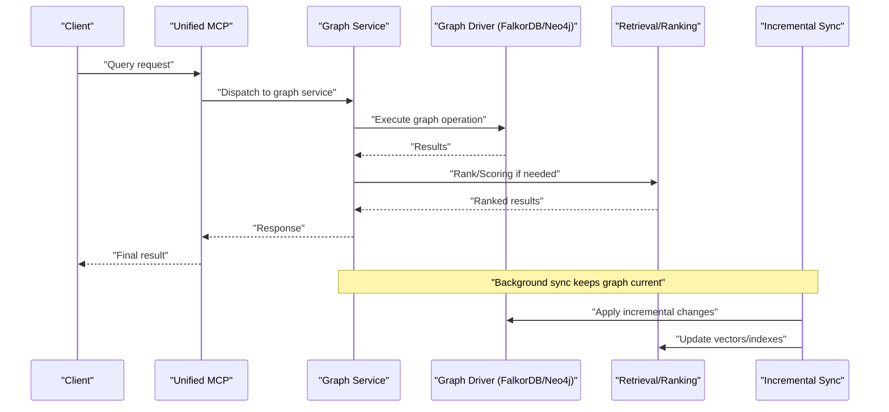
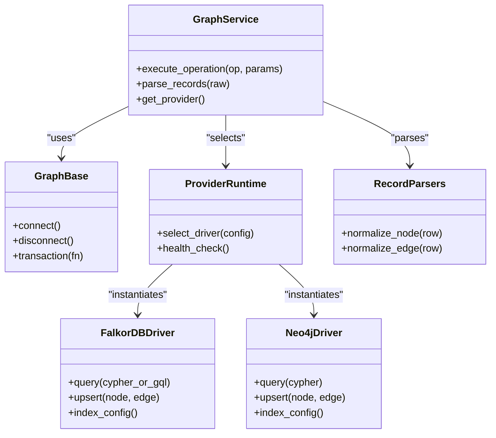
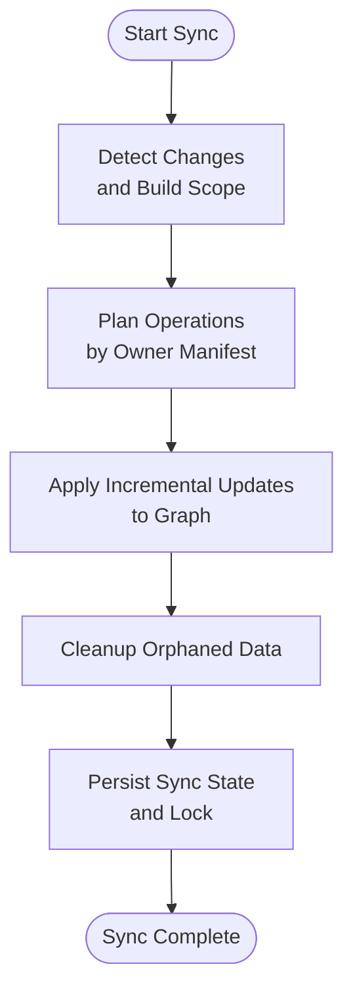
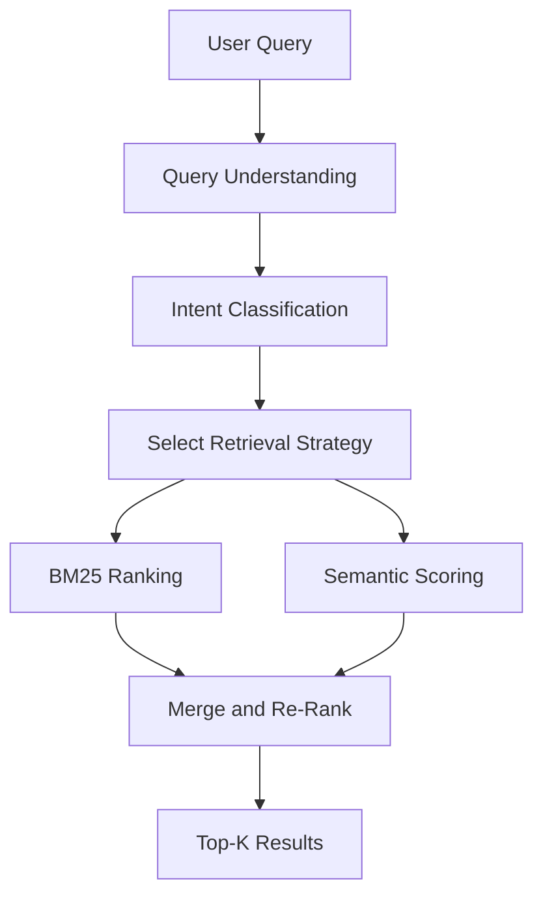
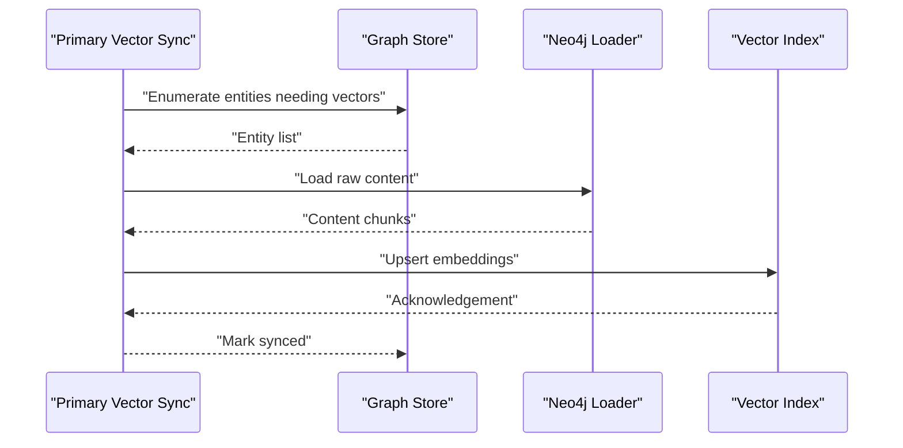
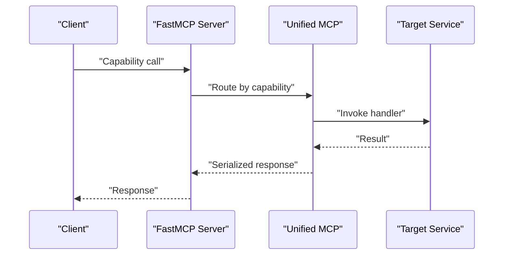
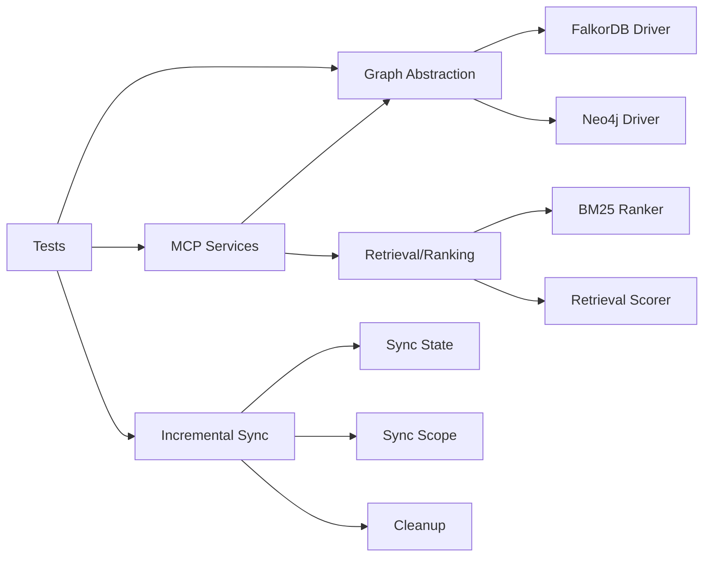

# Performance Troubleshooting

<cite>
**Referenced Files in This Document**
- [ReadMe.md](file://ReadMe.md)
- [Makefile](file://Makefile)
- [requirements.txt](file://requirements.txt)
- [pyproject.toml](file://pyproject.toml)
- [cortex_harness/dev.py](file://cortex_harness/dev.py)
- [harness/scripts/orchestrator.py](file://harness/scripts/orchestrator.py)
- [harness/scripts/init.sh](file://harness/scripts/init.sh)
- [harness/scripts/verify.sh](file://harness/scripts/verify.sh)
- [code-tiny/mcp/services/graph_service.py](file://code-tiny/mcp/services/graph_service.py)
- [code-tiny/mcp/services/workflow_service.py](file://code-tiny/mcp/services/workflow_service.py)
- [code-tiny/mcp/services/explore_service.py](file://code-tiny/mcp/services/explore_service.py)
- [code-tiny/mcp/services/symbol_service.py](file://code-tiny/mcp/services/symbol_service.py)
- [code-tiny/mcp/services/impact_service.py](file://code-tiny/mcp/services/impact_service.py)
- [code-tiny/mcp/unified_mcp.py](file://code-tiny/mcp/unified_mcp.py)
- [code-tiny/mcp/fastmcp_server.py](file://code-tiny/mcp/fastmcp_server.py)
- [code-tiny/tools/common/analyzer_cache.py](file://code-tiny/tools/common/analyzer_cache.py)
- [code-tiny/tools/common/incremental_sync_state.py](file://code-tiny/tools/common/incremental_sync_state.py)
- [code-tiny/tools/common/incremental_cleanup.py](file://code-tiny/tools/common/incremental_cleanup.py)
- [code-tiny/tools/common/sync_scope.py](file://code-tiny/tools/common/sync_scope.py)
- [code-tino/tools/common/bm25_ranker.py](file://code-tiny/tools/common/bm25_ranker.py)
- [code-tiny/tools/common/intelligent_retrieval.py](file://code-tiny/tools/common/intelligent_retrieval.py)
- [code-tiny/tools/common/retrieval_scorer.py](file://code-tiny/tools/common/retrieval_scorer.py)
- [code-tiny/tools/common/query_intent_classifier.py](file://code-tiny/tools/common/query_intent_classifier.py)
- [code-tiny/tools/common/query_understanding.py](file://code-tiny/tools/common/query_understanding.py)
- [code-tiny/tools/graph/driver/falkordb_driver.py](file://code-tiny/tools/graph/driver/falkordb_driver.py)
- [code-tiny/tools/graph/driver/neo4j_driver.py](file://code-tiny/tools/graph/driver/neo4j_driver.py)
- [code-tiny/tools/graph/core/base.py](file://code-tiny/tools/graph/core/base.py)
- [code-tiny/tools/graph/core/factory.py](file://code-tiny/tools/graph/core/factory.py)
- [code-tiny/tools/graph/core/provider_runtime.py](file://code-tiny/tools/graph/core/provider_runtime.py)
- [code-tiny/tools/graph/core/record_parsers.py](file://code-tiny/tools/graph/core/record_parsers.py)
- [code-tiny/tools/graph/core/require_neo4j.py](file://code-tiny/tools/graph/core/require_neo4j.py)
- [code-tiny/tools/graph/operations/class_ops.py](file://code-tiny/tools/graph/operations/class_ops.py)
- [code-tiny/tools/graph/operations/function_ops.py](file://code-tiny/tools/graph/operations/function_ops.py)
- [code-tiny/tools/graph/operations/document_ops.py](file://code-tiny/tools/graph/operations/document_ops.py)
- [code-tiny/tools/graph/operations/cross_edge_ops.py](file://code-tiny/tools/graph/operations/cross_edge_ops.py)
- [code-tiny/tools/graph/operations/namespace_ops.py](file://code-tiny/tools/graph/operations/namespace_ops.py)
- [code-tiny/tools/graph/operations/package_ops.py](file://code-tiny/tools/graph/operations/package_ops.py)
- [code-tiny/tools/graph/operations/type_ops.py](file://code-tiny/tools/graph/operations/type_ops.py)
- [code-tiny/tools/graph/operations/infra_ops.py](file://code-tiny/tools/graph/operations/infra_ops.py)
- [code-tiny/tools/graph/cli.py](file://code-tiny/tools/graph/cli.py)
- [code-tiny/tools/sync/incremental_sync.py](file://code-tiny/tools/sync/incremental_sync.py)
- [code-tiny/tools/sync/message_scan.py](file://code-tiny/tools/sync/message_scan.py)
- [code-tiny/tools/sync/build_owner_manifests.py](file://code-tiny/tools/sync/build_owner_manifests.py)
- [code-tiny/tools/sync/owner_manifest.py](file://code-tiny/tools/sync/owner_manifest.py)
- [code-tiny/tools/sync/dead_code_report.py](file://code-tiny/tools/sync/dead_code_report.py)
- [code-tiny/tools/common/primary_vector_sync.py](file://code-tiny/tools/common/primary_vector_sync.py)
- [doc-tiny/graph_store.py](file://doc-tiny/graph_store.py)
- [doc-tiny/neo4j_loader.py](file://doc-tiny/neo4j_loader.py)
- [scripts/validate_retrieval.py](file://scripts/validate_retrieval.py)
- [tests/test_cobol_performance.py](file://tests/test_cobol_performance.py)
- [tests/test_primary_vector_sync.py](file://tests/test_primary_vector_sync.py)
- [tests/test_incremental_sync_lock.py](file://tests/test_incremental_sync_lock.py)
- [tests/test_falkordb_driver.py](file://tests/test_falkordb_driver.py)
- [tests/test_graphrag_ingest_langextract.py](file://tests/test_graphrag_ingest_langextract.py)
- [tests/test_validate_retrieval.py](file://tests/test_validate_retrieval.py)
</cite>

## Table of Contents
1. [Introduction](#introduction)
2. [Project Structure](#project-structure)
3. [Core Components](#core-components)
4. [Architecture Overview](#architecture-overview)
5. [Detailed Component Analysis](#detailed-component-analysis)
6. [Dependency Analysis](#dependency-analysis)
7. [Performance Considerations](#performance-considerations)
8. [Troubleshooting Guide](#troubleshooting-guide)
9. [Conclusion](#conclusion)
10. [Appendices](#appendices)

## Introduction
This document provides a comprehensive performance troubleshooting guide for Cortex Harness optimization. It focuses on:
- Analyzing slow queries across graph and vector search paths
- Profiling memory usage patterns and CPU bottlenecks
- Monitoring techniques for graph database performance, vector search efficiency, and incremental sync operations
- Resource allocation tuning, cache configuration optimization, and query profiling
- Identifying performance regressions, benchmarking procedures, and capacity planning guidelines
- Specific metrics to monitor, alert thresholds, and automated validation scripts

The guidance is grounded in the repository’s MCP services, graph drivers, synchronization subsystems, caching layers, and test harnesses that exercise performance-sensitive paths.

## Project Structure
Cortex Harness integrates multiple components relevant to performance:
- MCP service layer exposing graph, workflow, explore, symbol, and impact capabilities
- Graph abstraction with FalkorDB and Neo4j drivers
- Incremental sync pipeline and state management
- Caching and retrieval scorers for BM25 and semantic search
- Vector ingestion and primary vector synchronization
- Validation and performance tests

```mermaid
graph TB
subgraph "MCP Services"
U["unified_mcp.py"]
F["fastmcp_server.py"]
GS["graph_service.py"]
WS["workflow_service.py"]
ES["explore_service.py"]
SS["symbol_service.py"]
IS["impact_service.py"]
end
subgraph "Graph Layer"
Base["core/base.py"]
Fact["core/factory.py"]
PR["core/provider_runtime.py"]
RP["core/record_parsers.py"]
RN["core/require_neo4j.py"]
FD["driver/falkordb_driver.py"]
ND["driver/neo4j_driver.py"]
OPS["operations/*_ops.py"]
end
subgraph "Sync & Cache"
ISC["common/incremental_sync_state.py"]
ICL["common/incremental_cleanup.py"]
SCOPE["common/sync_scope.py"]
PVS["common/primary_vector_sync.py"]
AC["common/analyzer_cache.py"]
end
subgraph "Retrieval"
BM25["common/bm25_ranker.py"]
IR["common/intelligent_retrieval.py"]
RS["common/retrieval_scorer.py"]
QIC["common/query_intent_classifier.py"]
QU["common/query_understanding.py"]
end
subgraph "Validation & Tests"
VR["scripts/validate_retrieval.py"]
TPERF["tests/test_cobol_performance.py"]
TPVS["tests/test_primary_vector_sync.py"]
TLOCK["tests/test_incremental_sync_lock.py"]
TFALK["tests/test_falkordb_driver.py"]
TVR["tests/test_validate_retrieval.py"]
end
U --> GS
U --> WS
U --> ES
U --> SS
U --> IS
GS --> Base
GS --> Fact
GS --> PR
GS --> RP
GS --> FD
GS --> ND
GS --> OPS
WS --> ISC
WS --> ICL
WS --> SCOPE
WS --> PVS
ES --> BM25
ES --> IR
ES --> RS
ES --> QIC
ES --> QU
VR --> U
TPERF --> GS
TPVS --> PVS
TLOCK --> ISC
TFALK --> FD
TVR --> VR
```

**Diagram sources**
- [code-tiny/mcp/unified_mcp.py](file://code-tiny/mcp/unified_mcp.py)
- [code-tiny/mcp/fastmcp_server.py](file://code-tiny/mcp/fastmcp_server.py)
- [code-tiny/mcp/services/graph_service.py](file://code-tiny/mcp/services/graph_service.py)
- [code-tiny/mcp/services/workflow_service.py](file://code-tiny/mcp/services/workflow_service.py)
- [code-tiny/mcp/services/explore_service.py](file://code-tiny/mcp/services/explore_service.py)
- [code-tiny/mcp/services/symbol_service.py](file://code-tiny/mcp/services/symbol_service.py)
- [code-tiny/mcp/services/impact_service.py](file://code-tiny/mcp/services/impact_service.py)
- [code-tiny/tools/graph/core/base.py](file://code-tiny/tools/graph/core/base.py)
- [code-tiny/tools/graph/core/factory.py](file://code-tiny/tools/graph/core/factory.py)
- [code-tiny/tools/graph/core/provider_runtime.py](file://code-tiny/tools/graph/core/provider_runtime.py)
- [code-tiny/tools/graph/core/record_parsers.py](file://code-tiny/tools/graph/core/record_parsers.py)
- [code-tiny/tools/graph/core/require_neo4j.py](file://code-tiny/tools/graph/core/require_neo4j.py)
- [code-tiny/tools/graph/driver/falkordb_driver.py](file://code-tiny/tools/graph/driver/falkordb_driver.py)
- [code-tiny/tools/graph/driver/neo4j_driver.py](file://code-tiny/tools/graph/driver/neo4j_driver.py)
- [code-tiny/tools/graph/operations/class_ops.py](file://code-tiny/tools/graph/operations/class_ops.py)
- [code-tiny/tools/graph/operations/function_ops.py](file://code-tiny/tools/graph/operations/function_ops.py)
- [code-tiny/tools/graph/operations/document_ops.py](file://code-tiny/tools/graph/operations/document_ops.py)
- [code-tiny/tools/graph/operations/cross_edge_ops.py](file://code-tiny/tools/graph/operations/cross_edge_ops.py)
- [code-tiny/tools/graph/operations/namespace_ops.py](file://code-tiny/tools/graph/operations/namespace_ops.py)
- [code-tiny/tools/graph/operations/package_ops.py](file://code-tiny/tools/graph/operations/package_ops.py)
- [code-tiny/tools/graph/operations/type_ops.py](file://code-tiny/tools/graph/operations/type_ops.py)
- [code-tiny/tools/graph/operations/infra_ops.py](file://code-tiny/tools/graph/operations/infra_ops.py)
- [code-tiny/tools/common/incremental_sync_state.py](file://code-tiny/tools/common/incremental_sync_state.py)
- [code-tiny/tools/common/incremental_cleanup.py](file://code-tiny/tools/common/incremental_cleanup.py)
- [code-tiny/tools/common/sync_scope.py](file://code-tiny/tools/common/sync_scope.py)
- [code-tiny/tools/common/primary_vector_sync.py](file://code-tiny/tools/common/primary_vector_sync.py)
- [code-tiny/tools/common/analyzer_cache.py](file://code-tiny/tools/common/analyzer_cache.py)
- [code-tiny/tools/common/bm25_ranker.py](file://code-tiny/tools/common/bm25_ranker.py)
- [code-tiny/tools/common/intelligent_retrieval.py](file://code-tiny/tools/common/intelligent_retrieval.py)
- [code-tiny/tools/common/retrieval_scorer.py](file://code-tiny/tools/common/retrieval_scorer.py)
- [code-tiny/tools/common/query_intent_classifier.py](file://code-tiny/tools/common/query_intent_classifier.py)
- [code-tiny/tools/common/query_understanding.py](file://code-tiny/tools/common/query_understanding.py)
- [scripts/validate_retrieval.py](file://scripts/validate_retrieval.py)
- [tests/test_cobol_performance.py](file://tests/test_cobol_performance.py)
- [tests/test_primary_vector_sync.py](file://tests/test_primary_vector_sync.py)
- [tests/test_incremental_sync_lock.py](file://tests/test_incremental_sync_lock.py)
- [tests/test_falkordb_driver.py](file://tests/test_falkordb_driver.py)
- [tests/test_validate_retrieval.py](file://tests/test_validate_retrieval.py)

**Section sources**
- [ReadMe.md](file://ReadMe.md)
- [Makefile](file://Makefile)
- [requirements.txt](file://requirements.txt)
- [pyproject.toml](file://pyproject.toml)
- [cortex_harness/dev.py](file://cortex_harness/dev.py)
- [harness/scripts/orchestrator.py](file://harness/scripts/orchestrator.py)
- [harness/scripts/init.sh](file://harness/scripts/init.sh)
- [harness/scripts/verify.sh](file://harness/scripts/verify.sh)

## Core Components
- MCP Service Layer: Orchestrates requests to graph, workflow, explore, symbol, and impact services. These are key entry points for performance-sensitive operations.
- Graph Abstraction and Drivers: Provides a unified interface over FalkorDB and Neo4j, including runtime provider selection and record parsing utilities.
- Incremental Sync Pipeline: Manages change detection, scope definition, cleanup, and owner manifests to keep the graph up-to-date efficiently.
- Retrieval and Ranking: BM25 ranking, intelligent retrieval, scoring, intent classification, and query understanding shape vector and text search performance.
- Primary Vector Sync: Coordinates vector embedding ingestion and updates for efficient similarity search.
- Validation and Tests: Scripts and tests validate retrieval quality and performance characteristics across components.

**Section sources**
- [code-tiny/mcp/unified_mcp.py](file://code-tiny/mcp/unified_mcp.py)
- [code-tiny/mcp/services/graph_service.py](file://code-tiny/mcp/services/graph_service.py)
- [code-tiny/tools/graph/core/base.py](file://code-tiny/tools/graph/core/base.py)
- [code-tiny/tools/graph/driver/falkordb_driver.py](file://code-tiny/tools/graph/driver/falkordb_driver.py)
- [code-tiny/tools/graph/driver/neo4j_driver.py](file://code-tiny/tools/graph/driver/neo4j_driver.py)
- [code-tiny/tools/common/incremental_sync_state.py](file://code-tiny/tools/common/incremental_sync_state.py)
- [code-tiny/tools/common/primary_vector_sync.py](file://code-tiny/tools/common/primary_vector_sync.py)
- [code-tiny/tools/common/bm25_ranker.py](file://code-tiny/tools/common/bm25_ranker.py)
- [code-tiny/tools/common/intelligent_retrieval.py](file://code-tiny/tools/common/intelligent_retrieval.py)
- [scripts/validate_retrieval.py](file://scripts/validate_retrieval.py)
- [tests/test_cobol_performance.py](file://tests/test_cobol_performance.py)

## Architecture Overview
The system routes user queries through MCP services into graph operations or retrieval pipelines. Graph operations interact with FalkorDB or Neo4j via typed drivers. Retrieval uses BM25 and semantic scorers, while incremental sync maintains data freshness with minimal overhead.

**Diagram sources**
- [code-tiny/mcp/unified_mcp.py](file://code-tiny/mcp/unified_mcp.py)
- [code-tiny/mcp/services/graph_service.py](file://code-tiny/mcp/services/graph_service.py)
- [code-tiny/tools/graph/driver/falkordb_driver.py](file://code-tiny/tools/graph/driver/falkordb_driver.py)
- [code-tiny/tools/graph/driver/neo4j_driver.py](file://code-tiny/tools/graph/driver/neo4j_driver.py)
- [code-tiny/tools/common/intelligent_retrieval.py](file://code-tiny/tools/common/intelligent_retrieval.py)
- [code-tiny/tools/common/bm25_ranker.py](file://code-tiny/tools/common/bm25_ranker.py)
- [code-tiny/tools/common/incremental_sync_state.py](file://code-tiny/tools/common/incremental_sync_state.py)

## Detailed Component Analysis

### Graph Service and Drivers
- Responsibilities: Translate high-level graph operations into driver-specific calls; manage connection/runtime context; parse records consistently.
- Key files:
  - Graph service orchestration
  - Driver implementations for FalkorDB and Neo4j
  - Core base, factory, provider runtime, record parsers, and requirement checks
  - Operation modules for classes, functions, documents, cross edges, namespaces, packages, types, and infrastructure nodes

**Diagram sources**
- [code-tiny/mcp/services/graph_service.py](file://code-tiny/mcp/services/graph_service.py)
- [code-tiny/tools/graph/core/base.py](file://code-tiny/tools/graph/core/base.py)
- [code-tiny/tools/graph/core/factory.py](file://code-tiny/tools/graph/core/factory.py)
- [code-tiny/tools/graph/core/provider_runtime.py](file://code-tiny/tools/graph/core/provider_runtime.py)
- [code-tiny/tools/graph/core/record_parsers.py](file://code-tiny/tools/graph/core/record_parsers.py)
- [code-tiny/tools/graph/driver/falkordb_driver.py](file://code-tiny/tools/graph/driver/falkordb_driver.py)
- [code-tiny/tools/graph/driver/neo4j_driver.py](file://code-tiny/tools/graph/driver/neo4j_driver.py)

**Section sources**
- [code-tiny/mcp/services/graph_service.py](file://code-tiny/mcp/services/graph_service.py)
- [code-tiny/tools/graph/core/base.py](file://code-tiny/tools/graph/core/base.py)
- [code-tiny/tools/graph/core/factory.py](file://code-tiny/tools/graph/core/factory.py)
- [code-tiny/tools/graph/core/provider_runtime.py](file://code-tiny/tools/graph/core/provider_runtime.py)
- [code-tiny/tools/graph/core/record_parsers.py](file://code-tiny/tools/graph/core/record_parsers.py)
- [code-tiny/tools/graph/driver/falkordb_driver.py](file://code-tiny/tools/graph/driver/falkordb_driver.py)
- [code-tiny/tools/graph/driver/neo4j_driver.py](file://code-tiny/tools/graph/driver/neo4j_driver.py)
- [code-tiny/tools/graph/operations/class_ops.py](file://code-tiny/tools/graph/operations/class_ops.py)
- [code-tiny/tools/graph/operations/function_ops.py](file://code-tiny/tools/graph/operations/function_ops.py)
- [code-tiny/tools/graph/operations/document_ops.py](file://code-tiny/tools/graph/operations/document_ops.py)
- [code-tiny/tools/graph/operations/cross_edge_ops.py](file://code-tiny/tools/graph/operations/cross_edge_ops.py)
- [code-tiny/tools/graph/operations/namespace_ops.py](file://code-tiny/tools/graph/operations/namespace_ops.py)
- [code-tiny/tools/graph/operations/package_ops.py](file://code-tiny/tools/graph/operations/package_ops.py)
- [code-tiny/tools/graph/operations/type_ops.py](file://code-tiny/tools/graph/operations/type_ops.py)
- [code-tiny/tools/graph/operations/infra_ops.py](file://code-tiny/tools/graph/operations/infra_ops.py)

### Incremental Sync and State Management
- Responsibilities: Track changes, define sync scopes, perform cleanup, and maintain owner manifests to minimize rework.
- Key files:
  - Incremental sync orchestrator and message scanning
  - State persistence and lock handling
  - Cleanup routines and scope definitions
  - Owner manifest builders and reports

**Diagram sources**
- [code-tiny/tools/sync/incremental_sync.py](file://code-tiny/tools/sync/incremental_sync.py)
- [code-tiny/tools/sync/message_scan.py](file://code-tiny/tools/sync/message_scan.py)
- [code-tiny/tools/common/incremental_sync_state.py](file://code-tiny/tools/common/incremental_sync_state.py)
- [code-tiny/tools/common/incremental_cleanup.py](file://code-tiny/tools/common/incremental_cleanup.py)
- [code-tiny/tools/common/sync_scope.py](file://code-tiny/tools/common/sync_scope.py)
- [code-tiny/tools/sync/build_owner_manifests.py](file://code-tiny/tools/sync/build_owner_manifests.py)
- [code-tiny/tools/sync/owner_manifest.py](file://code-tiny/tools/sync/owner_manifest.py)
- [code-tiny/tools/sync/dead_code_report.py](file://code-tiny/tools/sync/dead_code_report.py)

**Section sources**
- [code-tiny/tools/sync/incremental_sync.py](file://code-tiny/tools/sync/incremental_sync.py)
- [code-tiny/tools/sync/message_scan.py](file://code-tiny/tools/sync/message_scan.py)
- [code-tiny/tools/common/incremental_sync_state.py](file://code-tiny/tools/common/incremental_sync_state.py)
- [code-tiny/tools/common/incremental_cleanup.py](file://code-tiny/tools/common/incremental_cleanup.py)
- [code-tiny/tools/common/sync_scope.py](file://code-tiny/tools/common/sync_scope.py)
- [code-tiny/tools/sync/build_owner_manifests.py](file://code-tiny/tools/sync/build_owner_manifests.py)
- [code-tiny/tools/sync/owner_manifest.py](file://code-tiny/tools/sync/owner_manifest.py)
- [code-tiny/tools/sync/dead_code_report.py](file://code-tiny/tools/sync/dead_code_report.py)

### Retrieval, Ranking, and Query Understanding
- Responsibilities: Classify query intent, understand semantics, rank results using BM25 and custom scorers, and assemble intelligent retrieval strategies.
- Key files:
  - BM25 ranker
  - Intelligent retrieval orchestrator
  - Retrieval scorer
  - Query intent classifier
  - Query understanding module

**Diagram sources**
- [code-tiny/tools/common/query_understanding.py](file://code-tiny/tools/common/query_understanding.py)
- [code-tiny/tools/common/query_intent_classifier.py](file://code-tiny/tools/common/query_intent_classifier.py)
- [code-tiny/tools/common/bm25_ranker.py](file://code-tiny/tools/common/bm25_ranker.py)
- [code-tiny/tools/common/intelligent_retrieval.py](file://code-tiny/tools/common/intelligent_retrieval.py)
- [code-tiny/tools/common/retrieval_scorer.py](file://code-tiny/tools/common/retrieval_scorer.py)

**Section sources**
- [code-tiny/tools/common/bm25_ranker.py](file://code-tiny/tools/common/bm25_ranker.py)
- [code-tiny/tools/common/intelligent_retrieval.py](file://code-tiny/tools/common/intelligent_retrieval.py)
- [code-tiny/tools/common/retrieval_scorer.py](file://code-tiny/tools/common/retrieval_scorer.py)
- [code-tiny/tools/common/query_intent_classifier.py](file://code-tiny/tools/common/query_intent_classifier.py)
- [code-tiny/tools/common/query_understanding.py](file://code-tiny/tools/common/query_understanding.py)

### Primary Vector Sync
- Responsibilities: Coordinate vector embedding ingestion and updates for efficient similarity search.
- Key files:
  - Primary vector synchronization logic
  - Integration with graph store and loaders

**Diagram sources**
- [code-tiny/tools/common/primary_vector_sync.py](file://code-tiny/tools/common/primary_vector_sync.py)
- [doc-tiny/graph_store.py](file://doc-tiny/graph_store.py)
- [doc-tiny/neo4j_loader.py](file://doc-tiny/neo4j_loader.py)

**Section sources**
- [code-tiny/tools/common/primary_vector_sync.py](file://code-tiny/tools/common/primary_vector_sync.py)
- [doc-tiny/graph_store.py](file://doc-tiny/graph_store.py)
- [doc-tiny/neo4j_loader.py](file://doc-tiny/neo4j_loader.py)

### MCP Server and Unified Routing
- Responsibilities: Expose capabilities via FastMCP server and route requests to appropriate services.
- Key files:
  - Unified MCP router
  - FastMCP server bootstrap

**Diagram sources**
- [code-tiny/mcp/fastmcp_server.py](file://code-tiny/mcp/fastmcp_server.py)
- [code-tiny/mcp/unified_mcp.py](file://code-tiny/mcp/unified_mcp.py)

**Section sources**
- [code-tiny/mcp/fastmcp_server.py](file://code-tiny/mcp/fastmcp_server.py)
- [code-tiny/mcp/unified_mcp.py](file://code-tiny/mcp/unified_mcp.py)

## Dependency Analysis
Key dependencies include:
- MCP services depend on graph abstractions and drivers
- Retrieval depends on BM25 and scoring modules
- Sync depends on state, scope, and cleanup utilities
- Tests validate performance and correctness across drivers and sync flows

**Diagram sources**
- [code-tiny/mcp/unified_mcp.py](file://code-tiny/mcp/unified_mcp.py)
- [code-tiny/tools/graph/core/base.py](file://code-tiny/tools/graph/core/base.py)
- [code-tiny/tools/graph/driver/falkordb_driver.py](file://code-tiny/tools/graph/driver/falkordb_driver.py)
- [code-tiny/tools/graph/driver/neo4j_driver.py](file://code-tiny/tools/graph/driver/neo4j_driver.py)
- [code-tiny/tools/common/bm25_ranker.py](file://code-tiny/tools/common/bm25_ranker.py)
- [code-tiny/tools/common/retrieval_scorer.py](file://code-tiny/tools/common/retrieval_scorer.py)
- [code-tiny/tools/common/incremental_sync_state.py](file://code-tiny/tools/common/incremental_sync_state.py)
- [code-tiny/tools/common/sync_scope.py](file://code-tiny/tools/common/sync_scope.py)
- [code-tiny/tools/common/incremental_cleanup.py](file://code-tiny/tools/common/incremental_cleanup.py)
- [tests/test_falkordb_driver.py](file://tests/test_falkordb_driver.py)
- [tests/test_incremental_sync_lock.py](file://tests/test_incremental_sync_lock.py)

**Section sources**
- [code-tiny/mcp/unified_mcp.py](file://code-tiny/mcp/unified_mcp.py)
- [code-tiny/tools/graph/core/base.py](file://code-tiny/tools/graph/core/base.py)
- [code-tiny/tools/graph/driver/falkordb_driver.py](file://code-tiny/tools/graph/driver/falkordb_driver.py)
- [code-tiny/tools/graph/driver/neo4j_driver.py](file://code-tiny/tools/graph/driver/neo4j_driver.py)
- [code-tiny/tools/common/bm25_ranker.py](file://code-tiny/tools/common/bm25_ranker.py)
- [code-tiny/tools/common/retrieval_scorer.py](file://code-tiny/tools/common/retrieval_scorer.py)
- [code-tiny/tools/common/incremental_sync_state.py](file://code-tiny/tools/common/incremental_sync_state.py)
- [code-tiny/tools/common/sync_scope.py](file://code-tiny/tools/common/sync_scope.py)
- [code-tiny/tools/common/incremental_cleanup.py](file://code-tiny/tools/common/incremental_cleanup.py)
- [tests/test_falkordb_driver.py](file://tests/test_falkordb_driver.py)
- [tests/test_incremental_sync_lock.py](file://tests/test_incremental_sync_lock.py)

## Performance Considerations
- Slow Query Analysis
  - Profile graph operations at the driver level to identify expensive traversals and missing indexes.
  - Use intent classification and query understanding to refine retrieval strategies and reduce unnecessary work.
  - Validate BM25 parameters and scoring weights to avoid heavy re-ranking.

- Memory Usage Patterns
  - Monitor analyzer cache size and eviction policies to prevent unbounded growth.
  - Inspect record parsing and normalization for large object retention.
  - Evaluate vector embedding batch sizes during primary vector sync to balance throughput and memory pressure.

- CPU Bottlenecks
  - Focus on scoring and ranking loops; consider precomputing stable features where possible.
  - Optimize loop hotspots in incremental sync planning and cleanup phases.
  - Ensure provider runtime selection avoids repeated initialization overhead.

- Monitoring Techniques
  - Track latency percentiles for MCP endpoints and graph driver calls.
  - Measure vector index update rates and failure counts during primary vector sync.
  - Observe incremental sync duration, change set size, and lock contention.

- Resource Allocation Tuning
  - Adjust concurrency limits for graph transactions and vector indexing.
  - Tune connection pool sizes for FalkorDB/Neo4j based on workload profiles.
  - Allocate sufficient memory for embedding models and caches.

- Cache Configuration Optimization
  - Set appropriate TTL and max entries for analyzer cache.
  - Pre-warm frequently accessed indices and caches during startup.
  - Monitor cache hit ratios and adjust sizing accordingly.

- Query Performance Profiling
  - Instrument MCP routing and service dispatch to capture per-operation timings.
  - Add timing hooks around driver queries and record parsing.
  - Correlate retrieval strategy choices with observed latencies.

[No sources needed since this section provides general guidance]

## Troubleshooting Guide
- Slow Queries
  - Identify hot operations in graph service and drivers; check for full scans or missing indexes.
  - Validate retrieval strategy selection and BM25 parameters.
  - Use validation script to reproduce and measure regression.

- Memory Leaks
  - Inspect analyzer cache growth and eviction behavior.
  - Review record parsers for large object accumulation.
  - Check primary vector sync batching and temporary buffers.

- CPU Spikes
  - Profile scoring and ranking loops; consider simplification or caching.
  - Investigate sync planning and cleanup complexity.
  - Reduce redundant provider initialization.

- Incremental Sync Issues
  - Verify lock acquisition and state persistence.
  - Confirm scope boundaries and owner manifests are accurate.
  - Monitor dead code report outputs for unexpected churn.

- Vector Search Degradation
  - Validate embedding consistency and index health.
  - Check primary vector sync logs for failures or backlogs.
  - Compare BM25 vs semantic scoring outcomes.

- Automated Validation
  - Run retrieval validation script to assert quality and latency targets.
  - Execute performance tests for Cobol analysis and FalkorDB driver.
  - Use incremental sync lock tests to ensure robustness under contention.

**Section sources**
- [code-tiny/mcp/services/graph_service.py](file://code-tiny/mcp/services/graph_service.py)
- [code-tiny/tools/common/analyzer_cache.py](file://code-tiny/tools/common/analyzer_cache.py)
- [code-tiny/tools/common/primary_vector_sync.py](file://code-tiny/tools/common/primary_vector_sync.py)
- [code-tiny/tools/common/bm25_ranker.py](file://code-tiny/tools/common/bm25_ranker.py)
- [code-tiny/tools/common/incremental_sync_state.py](file://code-tiny/tools/common/incremental_sync_state.py)
- [code-tiny/tools/common/sync_scope.py](file://code-tiny/tools/common/sync_scope.py)
- [code-tiny/tools/common/incremental_cleanup.py](file://code-tiny/tools/common/incremental_cleanup.py)
- [code-tiny/tools/sync/dead_code_report.py](file://code-tiny/tools/sync/dead_code_report.py)
- [scripts/validate_retrieval.py](file://scripts/validate_retrieval.py)
- [tests/test_cobol_performance.py](file://tests/test_cobol_performance.py)
- [tests/test_falkordb_driver.py](file://tests/test_falkordb_driver.py)
- [tests/test_incremental_sync_lock.py](file://tests/test_incremental_sync_lock.py)

## Conclusion
Effective performance troubleshooting in Cortex Harness requires coordinated monitoring across MCP services, graph drivers, retrieval pipelines, and incremental sync processes. By profiling queries, managing memory and CPU hotspots, tuning resources and caches, and validating with automated scripts, teams can detect regressions early and maintain optimal performance.

[No sources needed since this section summarizes without analyzing specific files]

## Appendices

### Metrics to Monitor
- Latency percentiles for MCP endpoints and graph driver calls
- Throughput for vector index updates during primary vector sync
- Incremental sync duration, change set size, and lock contention
- Analyzer cache hit ratio and memory footprint
- BM25 and semantic scoring times

### Alert Thresholds
- P95 query latency exceeding baseline by a defined percentage
- Vector sync backlog growing beyond acceptable lag
- Sync lock wait time spikes indicating contention
- Cache miss rate above target threshold
- Scoring time outliers relative to historical norms

### Benchmarking Procedures
- Reproduce representative queries and retrieve top-K results
- Measure end-to-end latency and resource utilization
- Compare BM25 vs semantic scoring strategies
- Validate incremental sync performance under realistic change loads

### Capacity Planning Guidelines
- Estimate peak concurrent users and query volume
- Size connection pools and worker threads accordingly
- Provision memory for caches and embedding models
- Plan storage for graph and vector indexes with growth projections

### Automated Performance Validation Scripts
- Retrieval validation script to assert quality and latency
- Performance tests for Cobol analysis and FalkorDB driver
- Incremental sync lock tests for robustness under contention

**Section sources**
- [scripts/validate_retrieval.py](file://scripts/validate_retrieval.py)
- [tests/test_cobol_performance.py](file://tests/test_cobol_performance.py)
- [tests/test_falkordb_driver.py](file://tests/test_falkordb_driver.py)
- [tests/test_incremental_sync_lock.py](file://tests/test_incremental_sync_lock.py)
- [tests/test_primary_vector_sync.py](file://tests/test_primary_vector_sync.py)
- [tests/test_graphrag_ingest_langextract.py](file://tests/test_graphrag_ingest_langextract.py)
- [tests/test_validate_retrieval.py](file://tests/test_validate_retrieval.py)