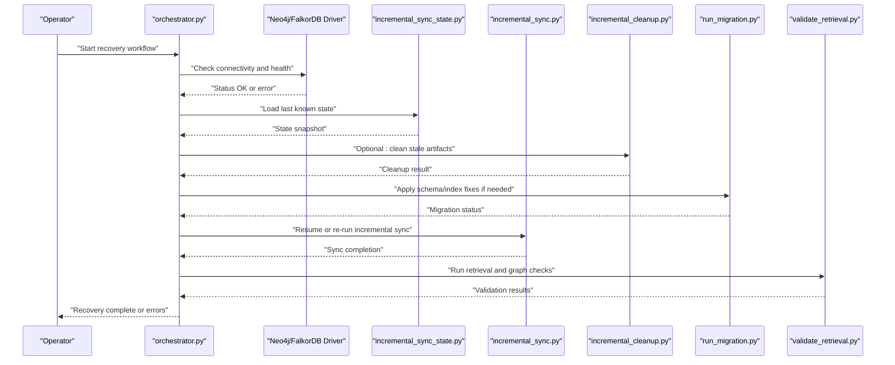
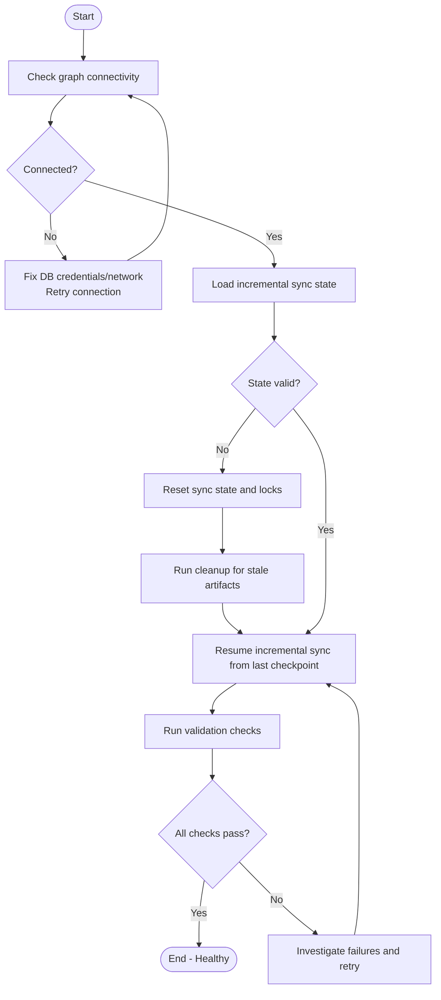
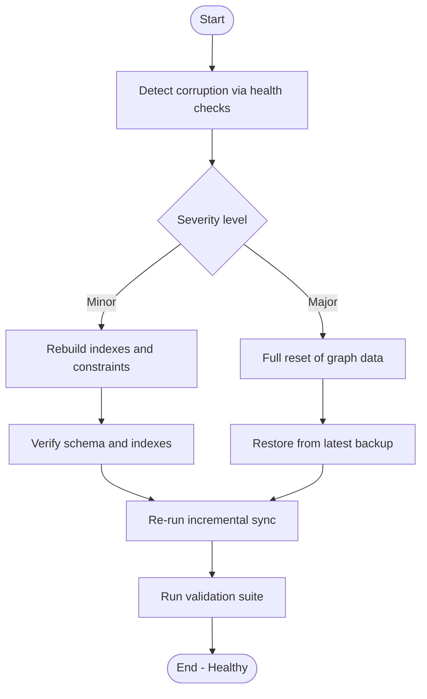
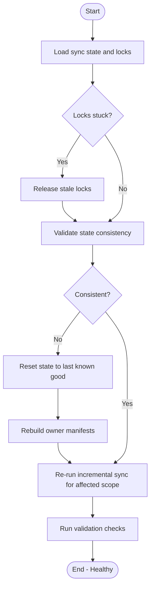
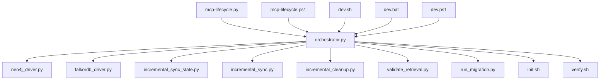

# Recovery Procedures

<cite>
**Referenced Files in This Document**
- [ReadMe.md](file://ReadMe.md)
- [Makefile](file://Makefile)
- [dev.sh](file://dev.sh)
- [dev.bat](file://dev.bat)
- [dev.ps1](file://dev.ps1)
- [install-windows.bat](file://install-windows.bat)
- [install-windows.ps1](file://install-windows.ps1)
- [harness/scripts/orchestrator.py](file://harness/scripts/orchestrator.py)
- [harness/scripts/init.sh](file://harness/scripts/init.sh)
- [harness/scripts/verify.sh](file://harness/scripts/verify.sh)
- [code-tiny/scripts/cleanup_repo_graph.py](file://code-tiny/scripts/cleanup_repo_graph.py)
- [code-tiny/scripts/migrate_repo_file_edges.py](file://code-tiny/scripts/migrate_repo_file_edges.py)
- [code-tiny/run_migration.py](file://code-tiny/run_migration.py)
- [doc-tiny/0_reset_all.py](file://doc-tiny/0_reset_all.py)
- [doc-tiny/6_setup_indexes.py](file://doc-tiny/6_setup_indexes.py)
- [cortex_harness/dev.py](file://cortex_harness/dev.py)
- [scripts/mcp-lifecycle.py](file://scripts/mcp-lifecycle.py)
- [scripts/mcp-lifecycle.ps1](file://scripts/mcp-lifecycle.ps1)
- [scripts/mcp_runtime_config.py](file://scripts/mcp_runtime_config.py)
- [scripts/validate_retrieval.py](file://scripts/validate_retrieval.py)
- [code-tiny/tools/common/incremental_sync_state.py](file://code-tiny/tools/common/incremental_sync_state.py)
- [code-tiny/tools/common/incremental_cleanup.py](file://code-tiny/tools/common/incremental_cleanup.py)
- [code-tiny/tools/graph/driver/neo4j_driver.py](file://code-tiny/tools/graph/driver/neo4j_driver.py)
- [code-tiny/tools/graph/driver/falkordb_driver.py](file://code-tiny/tools/graph/driver/falkordb_driver.py)
- [code-tiny/tools/graph/core/require_neo4j.py](file://code-tiny/tools/graph/core/require_neo4j.py)
- [code-tiny/tools/sync/incremental_sync.py](file://code-tiny/tools/sync/incremental_sync.py)
- [code-tiny/tools/sync/build_owner_manifests.py](file://code-tiny/tools/sync/build_owner_manifests.py)
- [code-tiny/tools/sync/dead_code_report.py](file://code-tiny/tools/sync/dead_code_report.py)
- [code-tiny/tools/sync/message_scan.py](file://code-tiny/tools/sync/message_scan.py)
- [code-tiny/tools/common/source_inventory.py](file://code-tiny/tools/common/source_inventory.py)
- [code-tiny/tools/common/analyzer_cache.py](file://code-tiny/tools/common/analyzer_cache.py)
- [tests/test_incremental_sync_bootstrap.py](file://tests/test_incremental_sync_bootstrap.py)
- [tests/test_incremental_sync_lock.py](file://tests/test_incremental_sync_lock.py)
- [tests/test_incremental_sync_state_migration.py](file://tests/test_incremental_sync_state_migration.py)
- [tests/test_dev_lifecycle_commands.py](file://tests/test_dev_lifecycle_commands.py)
- [tests/test_doc_graph_store.py](file://tests/test_doc_graph_store.py)
- [tests/test_falkordb_driver.py](file://tests/test_falkordb_driver.py)
</cite>

## Table of Contents
1. Introduction
2. Project Structure
3. Core Components
4. Architecture Overview
5. Detailed Component Analysis
6. Dependency Analysis
7. Performance Considerations
8. Troubleshooting Guide
9. Conclusion
10. Appendices

## Introduction
This document provides comprehensive recovery procedures for Cortex Harness operations, focusing on failed analyses, graph database corruption, and incremental sync state inconsistencies. It includes step-by-step workflows for backup and restore, data migration recovery, disaster recovery protocols, safe shutdown and cleanup, state reset commands, validation after recovery, and automated scripts and health checks suitable for production environments.

## Project Structure
The repository contains multiple subsystems relevant to recovery:
- Lifecycle and orchestration scripts under harness/scripts and scripts
- Graph drivers and core utilities under code-tiny/tools/graph
- Incremental sync state and cleanup logic under code-tiny/tools/common and code-tiny/tools/sync
- Migration and reset utilities under code-tiny and doc-tiny
- Dev and install helpers for Windows and cross-platform usage

```mermaid
graph TB
subgraph "Lifecycle & Orchestration"
A["harness/scripts/orchestrator.py"]
B["harness/scripts/init.sh"]
C["harness/scripts/verify.sh"]
D["scripts/mcp-lifecycle.py"]
E["scripts/mcp-lifecycle.ps1"]
end
subgraph "Graph Layer"
F["code-tiny/tools/graph/driver/neo4j_driver.py"]
G["code-tiny/tools/graph/driver/falkordb_driver.py"]
H["code-tiny/tools/graph/core/require_neo4j.py"]
end
subgraph "Sync & State"
I["code-tiny/tools/common/incremental_sync_state.py"]
J["code-tiny/tools/common/incremental_cleanup.py"]
K["code-tiny/tools/sync/incremental_sync.py"]
L["code-tiny/tools/sync/build_owner_manifests.py"]
M["code-tiny/tools/sync/dead_code_report.py"]
N["code-tiny/tools/sync/message_scan.py"]
end
subgraph "Migration & Reset"
O["code-tiny/run_migration.py"]
P["code-tiny/scripts/migrate_repo_file_edges.py"]
Q["code-tiny/scripts/cleanup_repo_graph.py"]
R["doc-tiny/0_reset_all.py"]
S["doc-tiny/6_setup_indexes.py"]
end
subgraph "Dev & Install"
T["dev.sh"]
U["dev.bat"]
V["dev.ps1"]
W["install-windows.bat"]
X["install-windows.ps1"]
Y["cortex_harness/dev.py"]
end
A --> F
A --> G
A --> I
A --> K
D --> F
D --> G
D --> I
D --> K
O --> F
O --> G
P --> F
Q --> F
R --> F
S --> F
T --> A
U --> A
V --> A
W --> A
X --> A
Y --> A
```

**Diagram sources**
- [harness/scripts/orchestrator.py](file://harness/scripts/orchestrator.py)
- [harness/scripts/init.sh](file://harness/scripts/init.sh)
- [harness/scripts/verify.sh](file://harness/scripts/verify.sh)
- [scripts/mcp-lifecycle.py](file://scripts/mcp-lifecycle.py)
- [scripts/mcp-lifecycle.ps1](file://scripts/mcp-lifecycle.ps1)
- [code-tiny/tools/graph/driver/neo4j_driver.py](file://code-tiny/tools/graph/driver/neo4j_driver.py)
- [code-tiny/tools/graph/driver/falkordb_driver.py](file://code-tiny/tools/graph/driver/falkordb_driver.py)
- [code-tiny/tools/graph/core/require_neo4j.py](file://code-tiny/tools/graph/core/require_neo4j.py)
- [code-tiny/tools/common/incremental_sync_state.py](file://code-tiny/tools/common/incremental_sync_state.py)
- [code-tiny/tools/common/incremental_cleanup.py](file://code-tiny/tools/common/incremental_cleanup.py)
- [code-tiny/tools/sync/incremental_sync.py](file://code-tiny/tools/sync/incremental_sync.py)
- [code-tiny/tools/sync/build_owner_manifests.py](file://code-tiny/tools/sync/build_owner_manifests.py)
- [code-tiny/tools/sync/dead_code_report.py](file://code-tiny/tools/sync/dead_code_report.py)
- [code-tiny/tools/sync/message_scan.py](file://code-tiny/tools/sync/message_scan.py)
- [code-tiny/run_migration.py](file://code-tiny/run_migration.py)
- [code-tiny/scripts/migrate_repo_file_edges.py](file://code-tiny/scripts/migrate_repo_file_edges.py)
- [code-tiny/scripts/cleanup_repo_graph.py](file://code-tiny/scripts/cleanup_repo_graph.py)
- [doc-tiny/0_reset_all.py](file://doc-tiny/0_reset_all.py)
- [doc-tiny/6_setup_indexes.py](file://doc-tiny/6_setup_indexes.py)
- [dev.sh](file://dev.sh)
- [dev.bat](file://dev.bat)
- [dev.ps1](file://dev.ps1)
- [install-windows.bat](file://install-windows.bat)
- [install-windows.ps1](file://install-windows.ps1)
- [cortex_harness/dev.py](file://cortex_harness/dev.py)

**Section sources**
- [ReadMe.md](file://ReadMe.md)
- [Makefile](file://Makefile)
- [dev.sh](file://dev.sh)
- [dev.bat](file://dev.bat)
- [dev.ps1](file://dev.ps1)
- [install-windows.bat](file://install-windows.bat)
- [install-windows.ps1](file://install-windows.ps1)
- [harness/scripts/orchestrator.py](file://harness/scripts/orchestrator.py)
- [harness/scripts/init.sh](file://harness/scripts/init.sh)
- [harness/scripts/verify.sh](file://harness/scripts/verify.sh)
- [code-tiny/tools/graph/driver/neo4j_driver.py](file://code-tiny/tools/graph/driver/neo4j_driver.py)
- [code-tiny/tools/graph/driver/falkordb_driver.py](file://code-tiny/tools/graph/driver/falkordb_driver.py)
- [code-tiny/tools/graph/core/require_neo4j.py](file://code-tiny/tools/graph/core/require_neo4j.py)
- [code-tiny/tools/common/incremental_sync_state.py](file://code-tiny/tools/common/incremental_sync_state.py)
- [code-tiny/tools/common/incremental_cleanup.py](file://code-tiny/tools/common/incremental_cleanup.py)
- [code-tiny/tools/sync/incremental_sync.py](file://code-tiny/tools/sync/incremental_sync.py)
- [code-tiny/tools/sync/build_owner_manifests.py](file://code-tiny/tools/sync/build_owner_manifests.py)
- [code-tiny/tools/sync/dead_code_report.py](file://code-tiny/tools/sync/dead_code_report.py)
- [code-tiny/tools/sync/message_scan.py](file://code-tiny/tools/sync/message_scan.py)
- [code-tiny/run_migration.py](file://code-tiny/run_migration.py)
- [code-tiny/scripts/migrate_repo_file_edges.py](file://code-tiny/scripts/migrate_repo_file_edges.py)
- [code-tiny/scripts/cleanup_repo_graph.py](file://code-tiny/scripts/cleanup_repo_graph.py)
- [doc-tiny/0_reset_all.py](file://doc-tiny/0_reset_all.py)
- [doc-tiny/6_setup_indexes.py](file://doc-tiny/6_setup_indexes.py)
- [cortex_harness/dev.py](file://cortex_harness/dev.py)
- [scripts/mcp-lifecycle.py](file://scripts/mcp-lifecycle.py)
- [scripts/mcp-lifecycle.ps1](file://scripts/mcp-lifecycle.ps1)
- [scripts/mcp_runtime_config.py](file://scripts/mcp_runtime_config.py)
- [scripts/validate_retrieval.py](file://scripts/validate_retrieval.py)

## Core Components
- Lifecycle orchestrator and dev entry points manage startup, shutdown, and environment setup across platforms.
- Graph drivers abstract connectivity to Neo4j and FalkorDB, enabling consistent recovery actions regardless of backend.
- Incremental sync state and cleanup modules track change detection and ensure idempotent reprocessing.
- Migration and reset utilities support schema/index management and full resets when necessary.
- Health check and validation scripts verify system integrity post-recovery.

Key responsibilities:
- Orchestrator: coordinates lifecycle tasks, invokes drivers and sync routines.
- Drivers: provide connection, query, and index management primitives.
- Sync state: persists and validates incremental progress; supports rollback and re-sync.
- Migration/reset: apply schema changes, rebuild indexes, and clear stale artifacts.
- Validation: run retrieval and graph health checks to confirm recovery success.

**Section sources**
- [harness/scripts/orchestrator.py](file://harness/scripts/orchestrator.py)
- [code-tiny/tools/graph/driver/neo4j_driver.py](file://code-tiny/tools/graph/driver/neo4j_driver.py)
- [code-tiny/tools/graph/driver/falkordb_driver.py](file://code-tiny/tools/graph/driver/falkordb_driver.py)
- [code-tiny/tools/common/incremental_sync_state.py](file://code-tiny/tools/common/incremental_sync_state.py)
- [code-tiny/tools/common/incremental_cleanup.py](file://code-tiny/tools/common/incremental_cleanup.py)
- [code-tiny/tools/sync/incremental_sync.py](file://code-tiny/tools/sync/incremental_sync.py)
- [code-tiny/run_migration.py](file://code-tiny/run_migration.py)
- [doc-tiny/0_reset_all.py](file://doc-tiny/0_reset_all.py)
- [doc-tiny/6_setup_indexes.py](file://doc-tiny/6_setup_indexes.py)
- [scripts/validate_retrieval.py](file://scripts/validate_retrieval.py)

## Architecture Overview
Recovery flows are orchestrated by lifecycle scripts that interact with graph drivers and sync/state modules. The following diagram shows the high-level recovery architecture.

**Diagram sources**
- [harness/scripts/orchestrator.py](file://harness/scripts/orchestrator.py)
- [code-tiny/tools/graph/driver/neo4j_driver.py](file://code-tiny/tools/graph/driver/neo4j_driver.py)
- [code-tiny/tools/graph/driver/falkordb_driver.py](file://code-tiny/tools/graph/driver/falkordb_driver.py)
- [code-tiny/tools/common/incremental_sync_state.py](file://code-tiny/tools/common/incremental_sync_state.py)
- [code-tiny/tools/sync/incremental_sync.py](file://code-tiny/tools/sync/incremental_sync.py)
- [code-tiny/tools/common/incremental_cleanup.py](file://code-tiny/tools/common/incremental_cleanup.py)
- [code-tiny/run_migration.py](file://code-tiny/run_migration.py)
- [scripts/validate_retrieval.py](file://scripts/validate_retrieval.py)

## Detailed Component Analysis

### Failed Analysis Recovery Workflow
When an analysis fails mid-process, recover by ensuring graph connectivity, resetting inconsistent state, cleaning stale artifacts, and resuming incremental sync.

**Diagram sources**
- [harness/scripts/orchestrator.py](file://harness/scripts/orchestrator.py)
- [code-tiny/tools/graph/driver/neo4j_driver.py](file://code-tiny/tools/graph/driver/neo4j_driver.py)
- [code-tiny/tools/graph/driver/falkordb_driver.py](file://code-tiny/tools/graph/driver/falkordb_driver.py)
- [code-tiny/tools/common/incremental_sync_state.py](file://code-tiny/tools/common/incremental_sync_state.py)
- [code-tiny/tools/common/incremental_cleanup.py](file://code-tiny/tools/common/incremental_cleanup.py)
- [code-tiny/tools/sync/incremental_sync.py](file://code-tiny/tools/sync/incremental_sync.py)
- [scripts/validate_retrieval.py](file://scripts/validate_retrieval.py)

**Section sources**
- [harness/scripts/orchestrator.py](file://harness/scripts/orchestrator.py)
- [code-tiny/tools/graph/driver/neo4j_driver.py](file://code-tiny/tools/graph/driver/neo4j_driver.py)
- [code-tiny/tools/graph/driver/falkordb_driver.py](file://code-tiny/tools/graph/driver/falkordb_driver.py)
- [code-tiny/tools/common/incremental_sync_state.py](file://code-tiny/tools/common/incremental_sync_state.py)
- [code-tiny/tools/common/incremental_cleanup.py](file://code-tiny/tools/common/incremental_cleanup.py)
- [code-tiny/tools/sync/incremental_sync.py](file://code-tiny/tools/sync/incremental_sync.py)
- [scripts/validate_retrieval.py](file://scripts/validate_retrieval.py)

### Graph Database Corruption Recovery
If the graph store is corrupted (e.g., broken indexes or inconsistent schema), perform a targeted fix or full reset depending on severity.

**Diagram sources**
- [doc-tiny/6_setup_indexes.py](file://doc-tiny/6_setup_indexes.py)
- [doc-tiny/0_reset_all.py](file://doc-tiny/0_reset_all.py)
- [code-tiny/tools/graph/driver/neo4j_driver.py](file://code-tiny/tools/graph/driver/neo4j_driver.py)
- [code-tiny/tools/graph/driver/falkordb_driver.py](file://code-tiny/tools/graph/driver/falkordb_driver.py)
- [code-tiny/tools/sync/incremental_sync.py](file://code-tiny/tools/sync/incremental_sync.py)
- [scripts/validate_retrieval.py](file://scripts/validate_retrieval.py)

**Section sources**
- [doc-tiny/6_setup_indexes.py](file://doc-tiny/6_setup_indexes.py)
- [doc-tiny/0_reset_all.py](file://doc-tiny/0_reset_all.py)
- [code-tiny/tools/graph/driver/neo4j_driver.py](file://code-tiny/tools/graph/driver/neo4j_driver.py)
- [code-tiny/tools/graph/driver/falkordb_driver.py](file://code-tiny/tools/graph/driver/falkordb_driver.py)
- [code-tiny/tools/sync/incremental_sync.py](file://code-tiny/tools/sync/incremental_sync.py)
- [scripts/validate_retrieval.py](file://scripts/validate_retrieval.py)

### Incremental Sync State Inconsistencies
Inconsistent sync state can cause repeated work or missed updates. Recover by validating state, unlocking stuck processes, and re-running affected scopes.

**Diagram sources**
- [code-tiny/tools/common/incremental_sync_state.py](file://code-tiny/tools/common/incremental_sync_state.py)
- [code-tiny/tools/sync/build_owner_manifests.py](file://code-tiny/tools/sync/build_owner_manifests.py)
- [code-tiny/tools/sync/incremental_sync.py](file://code-tiny/tools/sync/incremental_sync.py)
- [scripts/validate_retrieval.py](file://scripts/validate_retrieval.py)

**Section sources**
- [code-tiny/tools/common/incremental_sync_state.py](file://code-tiny/tools/common/incremental_sync_state.py)
- [code-tiny/tools/sync/build_owner_manifests.py](file://code-tiny/tools/sync/build_owner_manifests.py)
- [code-tiny/tools/sync/incremental_sync.py](file://code-tiny/tools/sync/incremental_sync.py)
- [scripts/validate_retrieval.py](file://scripts/validate_retrieval.py)

### Backup and Restore Procedures
Backup critical components regularly and restore them during disaster recovery.

- What to back up:
  - Graph database snapshots (per driver-specific tooling)
  - Incremental sync state files and lock artifacts
  - Configuration and runtime settings
  - Index definitions and schema metadata
- Restore steps:
  - Stop all running processes safely
  - Restore graph data from backup
  - Restore sync state and configuration
  - Rebuild indexes if necessary
  - Run validation checks to confirm integrity

Operational notes:
- Use platform-appropriate lifecycle scripts to stop services before restoring.
- Ensure backups are taken while the system is quiescent to avoid partial writes.

**Section sources**
- [harness/scripts/orchestrator.py](file://harness/scripts/orchestrator.py)
- [code-tiny/tools/graph/driver/neo4j_driver.py](file://code-tiny/tools/graph/driver/neo4j_driver.py)
- [code-tiny/tools/graph/driver/falkordb_driver.py](file://code-tiny/tools/graph/driver/falkordb_driver.py)
- [code-tiny/tools/common/incremental_sync_state.py](file://code-tiny/tools/common/incremental_sync_state.py)
- [doc-tiny/6_setup_indexes.py](file://doc-tiny/6_setup_indexes.py)

### Data Migration Recovery
For migrations between graph stores or schema upgrades, use dedicated migration utilities and validate outcomes.

- Steps:
  - Pre-migration validation: check connectivity and current schema
  - Execute migration script
  - Post-migration verification: run index setup and retrieval validation
  - Rollback plan: revert to previous version and restore backups if issues arise

**Section sources**
- [code-tiny/run_migration.py](file://code-tiny/run_migration.py)
- [code-tiny/scripts/migrate_repo_file_edges.py](file://code-tiny/scripts/migrate_repo_file_edges.py)
- [doc-tiny/6_setup_indexes.py](file://doc-tiny/6_setup_indexes.py)
- [scripts/validate_retrieval.py](file://scripts/validate_retrieval.py)

### Disaster Recovery Protocols
In case of severe failure:
- Isolate the environment and halt all processing
- Restore graph data from the most recent verified backup
- Restore sync state and configuration
- Rebuild indexes and run full validation
- Gradually resume services and monitor health metrics

**Section sources**
- [harness/scripts/orchestrator.py](file://harness/scripts/orchestrator.py)
- [code-tiny/tools/graph/driver/neo4j_driver.py](file://code-tiny/tools/graph/driver/neo4j_driver.py)
- [code-tiny/tools/graph/driver/falkordb_driver.py](file://code-tiny/tools/graph/driver/falkordb_driver.py)
- [doc-tiny/0_reset_all.py](file://doc-tiny/0_reset_all.py)
- [doc-tiny/6_setup_indexes.py](file://doc-tiny/6_setup_indexes.py)
- [scripts/validate_retrieval.py](file://scripts/validate_retrieval.py)

### Safe Shutdown Procedures
Ensure graceful shutdown to prevent partial writes and lock contention:
- Stop lifecycle services using platform scripts
- Allow ongoing tasks to finish or be interrupted safely
- Verify no lingering processes or locks remain

**Section sources**
- [dev.sh](file://dev.sh)
- [dev.bat](file://dev.bat)
- [dev.ps1](file://dev.ps1)
- [install-windows.bat](file://install-windows.bat)
- [install-windows.ps1](file://install-windows.ps1)
- [cortex_harness/dev.py](file://cortex_harness/dev.py)
- [scripts/mcp-lifecycle.py](file://scripts/mcp-lifecycle.py)
- [scripts/mcp-lifecycle.ps1](file://scripts/mcp-lifecycle.ps1)

### Cleanup Operations
Remove stale artifacts and temporary files that may interfere with recovery:
- Clean repo graph artifacts
- Clear analyzer caches
- Remove orphaned lock files

**Section sources**
- [code-tiny/scripts/cleanup_repo_graph.py](file://code-tiny/scripts/cleanup_repo_graph.py)
- [code-tiny/tools/common/incremental_cleanup.py](file://code-tiny/tools/common/incremental_cleanup.py)
- [code-tiny/tools/common/analyzer_cache.py](file://code-tiny/tools/common/analyzer_cache.py)

### State Reset Commands
Use reset utilities to return the system to a clean baseline when required:
- Reset all graph-related state
- Recreate indexes and schema objects
- Reinitialize configurations as needed

**Section sources**
- [doc-tiny/0_reset_all.py](file://doc-tiny/0_reset_all.py)
- [doc-tiny/6_setup_indexes.py](file://doc-tiny/6_setup_indexes.py)

### Validation Procedures After Recovery
Confirm system integrity with targeted checks:
- Connectivity and health of graph drivers
- Retrieval correctness and performance
- Incremental sync state consistency

**Section sources**
- [scripts/validate_retrieval.py](file://scripts/validate_retrieval.py)
- [code-tiny/tools/graph/driver/neo4j_driver.py](file://code-tiny/tools/graph/driver/neo4j_driver.py)
- [code-tiny/tools/graph/driver/falkordb_driver.py](file://code-tiny/tools/graph/driver/falkordb_driver.py)
- [code-tiny/tools/common/incremental_sync_state.py](file://code-tiny/tools/common/incremental_sync_state.py)

### Automated Recovery Scripts and Health Checks
Automate routine recovery and monitoring:
- Lifecycle scripts for start/stop/status
- Runtime configuration loader for consistent settings
- Health check endpoints and validation suites

**Section sources**
- [scripts/mcp-lifecycle.py](file://scripts/mcp-lifecycle.py)
- [scripts/mcp-lifecycle.ps1](file://scripts/mcp-lifecycle.ps1)
- [scripts/mcp_runtime_config.py](file://scripts/mcp_runtime_config.py)
- [scripts/validate_retrieval.py](file://scripts/validate_retrieval.py)

## Dependency Analysis
The recovery ecosystem depends on lifecycle orchestration, graph drivers, sync state, and validation tools. The following diagram maps key dependencies.

**Diagram sources**
- [harness/scripts/orchestrator.py](file://harness/scripts/orchestrator.py)
- [code-tiny/tools/graph/driver/neo4j_driver.py](file://code-tiny/tools/graph/driver/neo4j_driver.py)
- [code-tiny/tools/graph/driver/falkordb_driver.py](file://code-tiny/tools/graph/driver/falkordb_driver.py)
- [code-tiny/tools/common/incremental_sync_state.py](file://code-tiny/tools/common/incremental_sync_state.py)
- [code-tiny/tools/sync/incremental_sync.py](file://code-tiny/tools/sync/incremental_sync.py)
- [code-tiny/tools/common/incremental_cleanup.py](file://code-tiny/tools/common/incremental_cleanup.py)
- [scripts/validate_retrieval.py](file://scripts/validate_retrieval.py)
- [code-tiny/run_migration.py](file://code-tiny/run_migration.py)
- [harness/scripts/init.sh](file://harness/scripts/init.sh)
- [harness/scripts/verify.sh](file://harness/scripts/verify.sh)
- [scripts/mcp-lifecycle.py](file://scripts/mcp-lifecycle.py)
- [scripts/mcp-lifecycle.ps1](file://scripts/mcp-lifecycle.ps1)
- [dev.sh](file://dev.sh)
- [dev.bat](file://dev.bat)
- [dev.ps1](file://dev.ps1)

**Section sources**
- [harness/scripts/orchestrator.py](file://harness/scripts/orchestrator.py)
- [code-tiny/tools/graph/driver/neo4j_driver.py](file://code-tiny/tools/graph/driver/neo4j_driver.py)
- [code-tiny/tools/graph/driver/falkordb_driver.py](file://code-tiny/tools/graph/driver/falkordb_driver.py)
- [code-tiny/tools/common/incremental_sync_state.py](file://code-tiny/tools/common/incremental_sync_state.py)
- [code-tiny/tools/sync/incremental_sync.py](file://code-tiny/tools/sync/incremental_sync.py)
- [code-tiny/tools/common/incremental_cleanup.py](file://code-tiny/tools/common/incremental_cleanup.py)
- [scripts/validate_retrieval.py](file://scripts/validate_retrieval.py)
- [code-tiny/run_migration.py](file://code-tiny/run_migration.py)
- [harness/scripts/init.sh](file://harness/scripts/init.sh)
- [harness/scripts/verify.sh](file://harness/scripts/verify.sh)
- [scripts/mcp-lifecycle.py](file://scripts/mcp-lifecycle.py)
- [scripts/mcp-lifecycle.ps1](file://scripts/mcp-lifecycle.ps1)
- [dev.sh](file://dev.sh)
- [dev.bat](file://dev.bat)
- [dev.ps1](file://dev.ps1)

## Performance Considerations
- Prefer incremental sync over full re-ingestion to reduce downtime during recovery.
- Rebuild indexes only when necessary; pre-warm hot paths after restoration.
- Monitor lock contention and release stale locks promptly to avoid cascading delays.
- Batch validation checks to minimize overhead during post-recovery verification.

[No sources needed since this section provides general guidance]

## Troubleshooting Guide
Common issues and resolutions:
- Connection failures: verify credentials, network reachability, and driver configuration.
- Stale locks: detect and release locks held by terminated processes.
- Schema drift: compare expected vs actual schema and apply fixes via migration utilities.
- Retrieval anomalies: run validation suite and inspect logs for failing queries.

Operational tips:
- Use lifecycle scripts to control service states consistently.
- Keep backups recent and test restore procedures periodically.
- Maintain index definitions and schema metadata alongside backups.

**Section sources**
- [code-tiny/tools/graph/core/require_neo4j.py](file://code-tiny/tools/graph/core/require_neo4j.py)
- [code-tiny/tools/common/incremental_sync_state.py](file://code-tiny/tools/common/incremental_sync_state.py)
- [code-tiny/tools/sync/incremental_sync.py](file://code-tiny/tools/sync/incremental_sync.py)
- [scripts/validate_retrieval.py](file://scripts/validate_retrieval.py)
- [harness/scripts/verify.sh](file://harness/scripts/verify.sh)

## Conclusion
Cortex Harness provides a robust set of recovery mechanisms spanning lifecycle orchestration, graph driver abstraction, incremental sync state management, migration utilities, and validation suites. By following the documented workflows—ensuring connectivity, managing state and locks, performing targeted or full resets, and validating outcomes—you can reliably recover from failures and maintain system integrity in production environments.

[No sources needed since this section summarizes without analyzing specific files]

## Appendices

### Appendix A: Key Utilities and Their Roles
- Lifecycle and orchestration:
  - [harness/scripts/orchestrator.py](file://harness/scripts/orchestrator.py)
  - [scripts/mcp-lifecycle.py](file://scripts/mcp-lifecycle.py)
  - [scripts/mcp-lifecycle.ps1](file://scripts/mcp-lifecycle.ps1)
- Graph drivers:
  - [code-tiny/tools/graph/driver/neo4j_driver.py](file://code-tiny/tools/graph/driver/neo4j_driver.py)
  - [code-tiny/tools/graph/driver/falkordb_driver.py](file://code-tiny/tools/graph/driver/falkordb_driver.py)
- Sync and state:
  - [code-tiny/tools/common/incremental_sync_state.py](file://code-tiny/tools/common/incremental_sync_state.py)
  - [code-tiny/tools/sync/incremental_sync.py](file://code-tiny/tools/sync/incremental_sync.py)
  - [code-tiny/tools/sync/build_owner_manifests.py](file://code-tiny/tools/sync/build_owner_manifests.py)
  - [code-tiny/tools/sync/dead_code_report.py](file://code-tiny/tools/sync/dead_code_report.py)
  - [code-tiny/tools/sync/message_scan.py](file://code-tiny/tools/sync/message_scan.py)
- Cleanup and cache:
  - [code-tiny/tools/common/incremental_cleanup.py](file://code-tiny/tools/common/incremental_cleanup.py)
  - [code-tiny/tools/common/analyzer_cache.py](file://code-tiny/tools/common/analyzer_cache.py)
  - [code-tiny/scripts/cleanup_repo_graph.py](file://code-tiny/scripts/cleanup_repo_graph.py)
- Migration and reset:
  - [code-tiny/run_migration.py](file://code-tiny/run_migration.py)
  - [code-tiny/scripts/migrate_repo_file_edges.py](file://code-tiny/scripts/migrate_repo_file_edges.py)
  - [doc-tiny/0_reset_all.py](file://doc-tiny/0_reset_all.py)
  - [doc-tiny/6_setup_indexes.py](file://doc-tiny/6_setup_indexes.py)
- Validation and health:
  - [scripts/validate_retrieval.py](file://scripts/validate_retrieval.py)
  - [harness/scripts/verify.sh](file://harness/scripts/verify.sh)
- Dev and install helpers:
  - [dev.sh](file://dev.sh)
  - [dev.bat](file://dev.bat)
  - [dev.ps1](file://dev.ps1)
  - [install-windows.bat](file://install-windows.bat)
  - [install-windows.ps1](file://install-windows.ps1)
  - [cortex_harness/dev.py](file://cortex_harness/dev.py)
  - [scripts/mcp_runtime_config.py](file://scripts/mcp_runtime_config.py)

**Section sources**
- [harness/scripts/orchestrator.py](file://harness/scripts/orchestrator.py)
- [scripts/mcp-lifecycle.py](file://scripts/mcp-lifecycle.py)
- [scripts/mcp-lifecycle.ps1](file://scripts/mcp-lifecycle.ps1)
- [code-tiny/tools/graph/driver/neo4j_driver.py](file://code-tiny/tools/graph/driver/neo4j_driver.py)
- [code-tiny/tools/graph/driver/falkordb_driver.py](file://code-tiny/tools/graph/driver/falkordb_driver.py)
- [code-tiny/tools/common/incremental_sync_state.py](file://code-tiny/tools/common/incremental_sync_state.py)
- [code-tiny/tools/sync/incremental_sync.py](file://code-tiny/tools/sync/incremental_sync.py)
- [code-tiny/tools/sync/build_owner_manifests.py](file://code-tiny/tools/sync/build_owner_manifests.py)
- [code-tiny/tools/sync/dead_code_report.py](file://code-tiny/tools/sync/dead_code_report.py)
- [code-tiny/tools/sync/message_scan.py](file://code-tiny/tools/sync/message_scan.py)
- [code-tiny/tools/common/incremental_cleanup.py](file://code-tiny/tools/common/incremental_cleanup.py)
- [code-tiny/tools/common/analyzer_cache.py](file://code-tiny/tools/common/analyzer_cache.py)
- [code-tiny/scripts/cleanup_repo_graph.py](file://code-tiny/scripts/cleanup_repo_graph.py)
- [code-tiny/run_migration.py](file://code-tiny/run_migration.py)
- [code-tiny/scripts/migrate_repo_file_edges.py](file://code-tiny/scripts/migrate_repo_file_edges.py)
- [doc-tiny/0_reset_all.py](file://doc-tiny/0_reset_all.py)
- [doc-tiny/6_setup_indexes.py](file://doc-tiny/6_setup_indexes.py)
- [scripts/validate_retrieval.py](file://scripts/validate_retrieval.py)
- [harness/scripts/verify.sh](file://harness/scripts/verify.sh)
- [dev.sh](file://dev.sh)
- [dev.bat](file://dev.bat)
- [dev.ps1](file://dev.ps1)
- [install-windows.bat](file://install-windows.bat)
- [install-windows.ps1](file://install-windows.ps1)
- [cortex_harness/dev.py](file://cortex_harness/dev.py)
- [scripts/mcp_runtime_config.py](file://scripts/mcp_runtime_config.py)